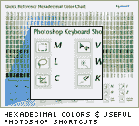

# 嘘…美丽网页设计的原则现在可以在这里找到。

> 原文：<https://www.sitepoint.com/psst-the-principles-of-beautiful-web-design-now-available-here/>

所以，一两个月前，你们中的许多人在我们的“即将出版的书籍”列表中发现了 Jason Beaird 的《美丽网页设计的原则》,你们想知道它在山姆山的什么地方吗？

***正式版***……我们计划下周才发布。

然而，鉴于如此多的人对此感到兴奋，我可以告诉你，它现在可以立即提供，但只能通过下面的特殊链接，而不是再回复一封电子邮件，说“*坚持住——它就要来了*”。

[https://www.sitepoint.com/premium/library](https://www.sitepoint.com/premium/library)

亚马逊确实有这本书上市，但他们已经卖完了最初的库存(他们几天前才收到)。老实说，这本书的受欢迎程度让我们大吃一惊——它在本周早些时候的销售排名为第 59 位，在计算机互联网类别中排名第二——这是一个令人震惊的结果。为了让你更好地理解这一点，在亚马逊的巨著《宇宙》中，我们通常认为任何低于 1000 英镑的书都是畅销书。

因此，现在 sitepoint.com([在这个链接](https://www.sitepoint.com/premium/library))是你能在网上得到这本书的唯一途径——我们已经准备好了，随时可以发货！

为了让交易更加甜蜜:在有限的时间内，我们不仅与亚马逊的价格相当(26.37 美元)，还附赠一张方便的 RGB 颜色&字体参考卡。

再公平不过了。

我不确定这是不是我们做过的最好的书，但它无疑是我迄今为止最喜欢的。五年来，我们一直在讨论“极客设计规则”这本书的想法，但长期以来，这一切似乎都太难了。从一开始就想象一个编码员的书要容易得多，而且找到一个能够“思考艺术”但“说极客话”的人是一个很难的问题。杰森不仅完全符合要求，还注入了他奇怪但非常有趣的幽默。

说够了。看看这个。

## 分享这篇文章