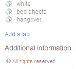
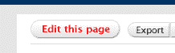
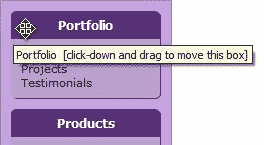
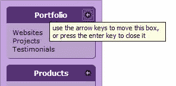

# 可访问的 JavaScript:超越鼠标

> 原文：<https://www.sitepoint.com/accessible-javascript/>

在我为 SitePoint 写的上一篇文章中，我质疑 AJAX 脚本技术是否可以被屏幕阅读器使用，并且发现，在大多数情况下，它们是不可以的。这样做是令人失望的——指出一个问题，却不能提供任何答案。但我真的别无选择，因为据我所知，没有任何具体的解决方案。(尽管从那以后，其他开发者已经进一步突破了这个极限；特别重要的是盖兹·莱蒙和史蒂夫·福克纳在这个领域所做的工作。)

但是可访问性并不总是困难的！我非常敏感地意识到，它被许多人视为一大堆问题，而事实上，可访问性仅仅是另一个设计挑战，一般来说，并不比其他任何设计更困难或更有问题。AJAX 是一个特别尴尬的例子。然而，大多数时候，提供可访问性并不困难。

<q>你不可能总是得到你想要的；但是如果你有时尝试，你可能会发现，你会得到你想要的。</q>

*—滚石*

在这篇文章中，我想给那些试图让他们的 web 应用程序具有可访问性的人一点小小的满足。为了实现这一点，我将在介绍与设备无关的脚本时，讨论一些与 JavaScript 可访问性相关的更基本的、可解决的问题。

##### 键盘导航？

我们大多数人使用鼠标来完成大部分的图形界面导航，但有些人不会，因此必须使用键盘来导航。例如，对于一个手抖的人来说，有效使用鼠标所需的精确控制可能根本不可能。对于屏幕阅读器等辅助技术的用户来说，键盘是主要的交互方式。毕竟在看不到指针的情况下使用鼠标还是比较困难的！

提供键盘访问也创造了更好的可用性，因为许多可以使用鼠标的人仍然更喜欢使用键盘来完成某些任务或在某些时候使用。这些人往往是超级用户，他们通常更熟悉计算机的工作方式，并希望能够根据自己的需求使用鼠标或键盘与功能进行交互。

如果你没有用键盘浏览网站的习惯，现在就试试吧！花些时间在你自己的网站和你经常访问的其他网站上，感受一下不用鼠标上网的感觉。发现哪里出现了困难，并思考如何避免这些问题。

##### 设备独立性！

提到“键盘”访问有点误导，因为我们谈论的不仅仅是键盘本身。我们正在讨论尝试提供设备独立性，以便无论用户的交互模式如何，他们都能够使用一个脚本。

例如，鼠标事件可能根本不是由鼠标生成的。它们可能是由跟踪球或手持游戏控制台上的模拟棒的运动引起的。焦点事件可能由使用 Tab 键导航的键盘用户生成，或者由使用浏览器语音控制功能的 [Opera 用户说出导航命令的结果。](http://www.opera.com/products/desktop/voice/)

理论上，我们希望能够支持任何交互模式，不管输入设备是什么。但实际上，所有这些交互形式通常都可以归结为两种基本类型之一:“鼠标”(点击或移动界面元素)和“键盘”(通过字符输入提供输入或指令)。它们处理浏览器公开的事件的两个相当谨慎的子集，忽略了大多数编程事件(加载、错误等)。

##### 三大支柱

我将假设您已经非常熟悉鼠标事件的脚本，并且只关注键盘事件的脚本。(如果你需要对事件的介绍，以及现代 JavaScript 技术在现实世界中的详细应用，你可能想看看我的书。)为此，我想讨论三个核心问题——你可能会说是三个“支柱”——它们共同为设备独立性提供了基础:

1.  提供可访问的交互元素。

3.  选择适当的触发元素。

5.  目标是配对脚本挂钩，而不是事件挂钩。这些术语现在可能没有意义，但是当你读完这篇文章的时候就会明白了。

我还希望您记住，当我们讨论这些问题时，迎合可访问性就是提供等价性，这与平等是不同的。如果我们为不同的用户提供不同的路径，这并不一定重要，只要每个人都有一个通向等效最终结果的路径。当我们稍后看一些实际的例子时，我们将会看到即使是完全不同的方法也能导致完全等价。

##### 提供可访问的交互元素

首先，如果我们想从键盘获取输入，我们需要使用可以接受焦点的元素:主要是链接(`<a>`)和表单控件(`<input>`、`<select>`、`<textarea>`和`<button>`)。请注意，还可以将焦点分配给图像映射中的`<area>`元素、一个`<frame>`或`<iframe>`，在某些情况下还有一个`<object>`(取决于它嵌入的数据类型)，在大多数浏览器中，还有文档或 documentElement 本身。

对于这些交互，我们能够处理的唯一事件是键盘能够实际生成的事件:主要是`focus`、`blur`(当当前聚焦的元素失去焦点时触发)、`click`(用键盘激活一个链接或按钮在程序上与用鼠标点击它是一样的)，以及三个按键动作事件、`keydown`、`keyup`和`keypress`。

除了这些直接输入事件之外，我们还可以使用编程事件——即间接触发以响应状态变化的事件。编程事件的例子包括臭名昭著的`window.onload`事件和`XMLHttpRequest`对象的`onreadystatechange`事件。

我们也可以使用与模式无关的事件，例如用户的交互模式对事件的触发方式和触发时间没有任何影响的事件，比如表单的提交事件。

然而——这是一个重要的警告——这并不意味着我们必须把特定于鼠标的事件扔进垃圾桶，也不把不可聚焦的元素完全放到一边。这只是意味着我们将不得不重新思考我们完成某些任务的方法。记住，是对等，不是平等。所有的路径都是好的，只要每个用户至少可以访问其中的一个。

##### 选择合适的触发元素

我使用术语“触发元素”来指代任何用于触发行为反应的元素。触发元素是用户为了引起其他事情发生而与之交互的东西。它可以是一个简单的链接，为 [flickr](http://www.flickr.com) 上的一张照片“添加标签”:



或者，它可以在照片顶部包含一系列图标，旨在允许用户执行一些操作，如将照片添加到收藏夹:


但是正如我们已经注意到的，我们可以用来实现这些触发器的元素的选择是有限的。

现在，`<button>`元素是我特别喜欢的一个元素，因为它非常灵活:它可以像任何其他元素一样进行样式化，它可以包含其他 HTML，它可以被启用或禁用并向用户代理报告状态，它可以作为一个没有值的活动触发器元素工作。然而，像所有的`<form>`元素一样，它唯一有效的上下文是在一个`<form>`中。

相比之下，使用链接作为触发器的问题是，尽管您可以让它们以您喜欢的任何方式出现，但它们总是必须有某种值:href 属性中没有任何内容的链接是键盘无法访问的。

普遍接受的最佳实践是使用[渐进式增强](http://hesketh.com/publications/progressive_enhancement_paving_way_for_future.html )——包括一个默认的`href`属性，该属性指向等效的、非脚本化的功能——但是当我们在一个完全脚本化的环境中工作时(例如，在一个为其他地方的非脚本用户提供服务的应用程序中，处理一个本身由脚本生成的链接时),这并不一定合适。这种情况经常导致链接需要有“`#`”或“`javascript:void(null)`”，或者类似的——本质上是垃圾的——`href`。

不过，所有这些都有点跑题了，因为我们对元素的选择应该基于触发器实际上是什么，以及它做什么。我们不能仅仅为了方便而使用一个`<button>`，并避免链接的问题，反之亦然。我们必须考虑语义，并努力确保一个触发元素是它看起来的样子，并且它的外观与其功能一致。

这并不总是容易的；flickr 图标的例子是一个特别棘手的例子。让我们再看一遍:


这些图标的整体外观表明它们是按钮，就像 Photoshop 或 MS Office 中的工具栏按钮一样。但是从功能上来说，前三个是脚本动作，而最后一个实际上是另一个页面的链接。

那么，前三个应该是`<button>`元素，而最后一个是`<a>`元素吗？也许“所有尺寸”应该是一个独立的链接，根本不是这个工具栏的一部分？

“添加标签”链接呢？


那不应该是——看起来像——一个按钮吗，因为它是一个脚本动作，而不是页面视图？(而且，当我们这样做的时候，如果 JavaScript 不可用，它不应该做些什么吗……？)

或许这个案例的总体结论是，flickr 的界面设计，就像很多 Web 2.0 风格一样，只是有点随意，没有经过适当的考虑。

但是所有这些真的很重要——语义学不仅仅是一种自我关注的练习。元素的选择对用户代理非常重要，因为它们依赖标记语义来识别内容是什么，这反过来又对希望有效使用该内容的普通用户非常重要。

如果您仍然觉得这只不过是对语义纯粹性的学术讨论，那么让我们来看看为什么触发元素选择在现实世界中如此重要的一个实际例子:Opera 的键盘导航。

Opera 使用不同的键来导航表单元素和导航链接(表单元素使用 Tab 键，而链接导航使用“A”和“Q”来表示“下一步”)和“前一个锚”)。因此，如果我们使用看起来像链接按钮的界面元素，反之亦然，我们将为使用键盘导航的 Opera 用户带来认知和可用性问题。
作为另一个例子，让我们来看看 [Basecamp](http://www.basecamphq.com/) 在其写字板应用程序中做了什么:



“编辑此页面”看起来像一个按钮，所以我们应该能够像其他任何标签；但是我们不能，因为它根本不是一个按钮。这是一个风格化的链接。

也许它终究应该是一个`<button>`，因为它看起来就是这样。或者它应该只是(看起来像)一个简单的链接，因为它实际上做的是加载一个全新的页面？在这种情况下，我认为是后者。

就像我说的，这个方面并不总是容易的，但是如果一个应用程序使用键盘像使用鼠标一样直观，就必须考虑这个问题。一般来说，我认为链接应该用于加载新页面而不发布任何数据的操作(即`GET`请求)，而按钮或其他适当的表单小部件应该用于其他任何操作。(毕竟，除了复杂的表单，什么是应用程序？).这个观点得到了 [HTTP 1.1 规范](http://tools.ietf.org/html/rfc2616)的响应，它声明 GET 请求不应该用于将改变资源的动作，比如删除、创建或更新内容。

但是在所有情况下，触发元素必须看起来像它是什么。

##### 寻找行为配对，而不是事件配对

WCAG 1.0 的 HTML 技术表明，满足设备独立性的一个好方法是提供冗余的输入事件——同一个元素的两个处理程序“配对”在一起。它给出的例子包括将 keydown 与 mousedown 配对，或者使用 keyup 与 mouseup 配对。

然而，这是看待提供设备独立性问题的错误方式，因为键盘和鼠标事件在概念上是不同的，并且在许多情况下，行为完全不同。在我们的第一个实际例子中，我们马上就会看到这种差异。

我认为从行为配对的角度来思考比从事件配对的角度来思考更有帮助。如果你有一个功能是由一个 mousedown 事件驱动的，不要想“我如何使用一个 keydown 事件来实现它？”简单地想一想，“我如何能从键盘上让这个工作？”

我在吹毛求疵吗？我不这么认为。这样一想，问题就有了不同的答案。第一个问题问的是一种具体的方法，这种方法可能行得通，也可能行不通；第二个问题简单问有没有办法；它对任何兼容的解决方案都是开放的。在我们的最后一个实际例子中——拖放——我们将看到这种思维差异是多么的巨大。

##### 一些实际例子

让我们看一些实际的例子。我不打算在这里深入研究代码。这只是一些不同类型的脚本的基本回顾，因为它们是为鼠标实现的；我们还会考虑如何在键盘上实现它们。

***简单的翻车和揭示内容***

简单的翻转效果可能由链接上的颜色或背景图像变化组成。您可能非常熟悉应用了块显示的链接，以及`:hover`和`:focus`伪类，这样它们就可以在不需要 JavaScript 的情况下进行后台交换。

脚本式翻转通常很容易扩展到键盘，只要它们使用适当的链接或其他可聚焦的元素(不仅仅是纯文本内容元素，如`<span>`或`<td>`)。在我们的第一个例子中，我们将为单个元素添加一个简单的效果，通过切换一个类名来触发(例如，使用一个假想的`addEvent`函数；[当你在自己的工作中应用代码时，替换这个](http://www.quirksmode.org/blog/archives/2005/09/addevent_recodi.html)——你可以选择你最喜欢的):

```
addEvent(link, 'mouseover', function()  

{  

  link.className = 'rollover';  

});  

addEvent(link, 'mouseout', function()  

{  

  link.className = '';  

});
```

我们可以简单地添加一对`focus`和`blur`处理程序来为通过键盘导航的人做同样的工作:

```
addEvent(link, 'focus', function()  

{  

  link.className = 'rollover';  

});  

addEvent(link, 'blur', function()  

{  

  link.className = '';  

});
```

当处理元素组上的事件时，情况更复杂，因为焦点事件不会冒泡。当一个元素将它触发的事件传递给它的父元素时，就会出现事件气泡。虽然我们可以使用单个文档级侦听器处理任何元素上的鼠标事件(这种技术有时被称为事件委托)，但我们不能对不冒泡的事件做同样的事情:

```
addEvent(document, 'mouseover', function(e)  

{  

  var target = typeof e.target != 'undefined'   

      ? e.target : e.srcElement;  

  //"target" is whatever node the event bubbles up from  

});
```

这种方法是可行的，因为鼠标事件从它们发生的地方冒泡；但是，因为焦点事件不会冒泡，所以这样的函数只能处理发生在文档节点上的事件。

如果我们想要捕获一组元素中每一个元素上的事件，我们必须遍历这些元素，并将一个侦听器分别绑定到每一个元素:

```
var links = list.getElementsByTagName('a');  

for(var i=0; i<links.length; i++)  

{  

  addEvent(links[i], 'focus', function()  

  {  

    //and so on ...      

  });  

}
```

请记住，鼠标到键盘行为的精确转换不一定是恰当的，因为这两种行为之间的可用性关注点通常非常不同。考虑 DHTML 菜单中的打开和关闭计时器；这些对鼠标来说是必要的，但对键盘来说是不理想的。毕竟，当用户使用键盘导航时，不可能“滑出”菜单的边缘，所以所有的计时器提供的都是菜单动作的无用暂停。

***AJAX 等 RPC 脚本***

AJAX 脚本的核心处理编程事件，比如一个`XMLHttpRequest`对象的 onreadystatechange 事件，或者用于数据检索的 iframe 的 load 事件。用户的交互方式并不影响这些事件的行为，所以我们不需要特别考虑每种交互方式。

然而，我们确实有两个要点需要考虑。

首先，也是最明显的，我们应该首先考虑这些过程是如何触发的。如果一个请求或流程是由一个用户动作发起的，我们必须确保这个动作可以被键盘用户触发。正如我们已经讨论过的，解决方案只是选择一个合适的触发元素。

第二个问题需要仔细构建响应 HTML，以确保我们维护可用的 tab 键顺序。如果我们创建新的内容来响应用户操作，并且新的内容本身是交互式的，我们必须确保它被插入到 HTML 中的逻辑点。

例如，假设我们有一个用户首选项表单，用户可以在其中指定自己的个人信息。在这种情况下，他们必须提供原产国信息:

```
<label for="country" id="country-selector">  

  <span>Country: </span>  

  <select id="country">  

    <option value=""></option>  

    <option value="uk">UK</option>  

    <option value="au">Australia</option>  

  </select>  

</label>  

<input type="button" value="Save details" id="save-button" />
```

我们可以将一个 onchange 事件监听器附加到 select 元素上，该监听器运行代码来创建一个辅助选择，允许用户选择适当的县或州。但是，我们希望键盘用户可以立即访问辅助选择，所以我们应该将它插入正确的位置——在第一个标签之后，按钮之前:

```
var button = document.getElementById('save-button');  

button.parentNode.insertBefore(newselect, button);
```

此示例假设新的选择器和标签已经创建，并保存到对象引用 newselect 中。

***拖‘n’落***

拖放功能即使在最好的情况下也需要复杂的脚本，不管你是否想让它变得可访问！乍一看，使这个功能可访问的任务看起来是不可能的，因为拖放的发电机是 mousemove 事件，对于它没有等价的键盘。但是用一点横向思维，是可以做到的！

假设我们的应用程序包含一个垂直列表或一列框，用户可以通过拖放来重新排序。用户的鼠标拿起一个对象，移动它，然后把它放到一个新的位置；这些动作的最终结果只是改变了对象的顺序——用户拖动的对象上下移动了 x 个空格。难道我们不能使用上下箭头键生成的命令来达到同样的结果吗？

事实上我们可以，但是要这样做，我们需要一个键盘的触发元素:一个可聚焦的元素(或者是可拖动的对象本身，或者是其中的东西)，它可以处理来自箭头键的事件。

在下图中，您可以看到一个指示鼠标行为的框。顶部较暗的条是鼠标的触发元素。用户点击这个区域并移动鼠标来拖动盒子；因此，该行为的主要活动事件是`mousemove`:



现在，如果我们在可拖动元素中添加一个链接或按钮，并使其看起来像一个图形图标，该图标可以用作键盘的触发元素。根据这一推理，行为的主要活动事件是`keypress`:



从这个例子中，我们可以看到事件配对的无用性。mousemove 和 keypress 事件在功能上几乎没有相似之处，但是这两个事件是我们需要提供给鼠标和键盘用户的。我们为了让这种功能适用于键盘而经历的概念之旅展示了我们如何实现最终目标——等效功能。实施的细节就是——细节。这些图片取自一个真实的脚本，它太大了，无法在这里复制，但如果你想下载并玩它，你可以在我的网站上找到它[。](http://www.brothercake.com/site/resources/scripts/dbx/)

##### 可访问性不是一个特性

在我的想象中，这并不复杂。

*—凯莉·米洛*

为可访问性而设计就像建造房子的地基——如果你从一开始就做，那么很容易，但之后就很难侵入了。

显然，最好的方法是从项目开始就考虑可访问性——认识到可访问性是一个设计考虑，而不是一个特性。事实上，[乔·克拉克对 Basecamp 可访问性的评价](http://joeclark.org/access/research/ice/iceweb2006-notes.html)指出，如果你将可访问性视为一项功能，你可能会忽略它。“无论如何，大多数开发人员都会忽略它；大多数开发人员对可访问性一无所知，甚至不知道它的重要性。”这是怀疑，当然，但尽管如此，这是真的。

记住这句话，我想给你一个很酷很有启发性的例子来结束我的演讲，它确实是这个领域最佳实践的范例。它并不新(它已经有一年多的历史了，由 Derek Featherstone 在 Web Essentials 2005 上开发和展示)，但它的优雅和简单仍然让我着迷:[它是一个语义上的、容易理解的纵横字谜](http://www.boxofchocolates.ca/projects/crossword/)。

我们不可能都像德里克一样有才华！但是在实际的、日常的层面上，我希望我已经开始证明设备无关的脚本并不那么困难或复杂。这可能与我们习惯的工作方式不同，但真正需要的是一点额外的思考。

## 分享这篇文章