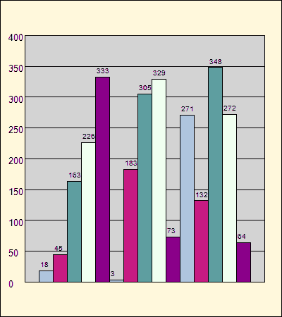
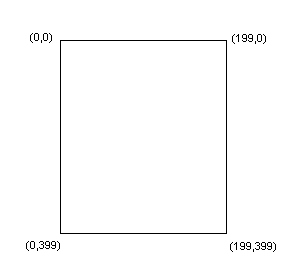

# ASP.NET 图表:提高标准

> 原文：<https://www.sitepoint.com/asp-net-graphs-raise-the-bar/>

他们说一张图片胜过千言万语，这一点在条形图的使用中表现得最为明显。

使用条形图，可以可视化过去的销售历史，预测股票价格，并以图形方式显示调查结果——在几乎成千上万的其他应用程序中。当条形图可以动态生成时，它甚至变得更有价值。令人欣慰的是，ASP.NET 在现有的基础上提供了这样做的手段。NET 框架，通过`SYSTEM.DRAWING`命名空间。

在本教程中，我们将:

*   检查一些`SYSTEM.DRAWING`名称空间的类和方法。
*   学习如何确定物体的坐标。
*   检查用于动态生成如下所示条形图的代码。



您可能有兴趣知道上面的图像文件是使用我们将在本教程中探索的代码制作的，只做了一点小小的修改。稍后会详细介绍。

在我们开始之前，您可能想[下载我们将在本文中使用的代码](https://www.sitepoint.com/examples/graphs/bargraph.zip)。

##### `System.Drawing`名称空间

`SYSTEM.DRAWING`名称空间提供了对基本图形功能的访问，允许我们绘制动态图像，并且是我们构建条形图的基础。我们将使用以下类:

*   `Bitmap`–这个类用于创建位图图像。
*   这是包含构成条形图的所有单个对象的表面。
*   这个类定义了单一颜色的画笔。画笔用于填充图形形状，在我们的条形图中，图形形状是矩形。
*   `Pen`–钢笔定义了一个用于绘制直线和曲线的对象。

我们还将在`SYSTEM.DRAWING`名称空间中使用许多方法:

*   `Clear`–该方法清除整个绘图表面，并用指定的背景色填充。它唯一的参数是 Color 对象，它指定了我们想要绘制背景的颜色。
*   `FillRectangle`–这种方法使用笔刷来填充形状的内部。这是我们用来填充位图的背景色、图表区的背景和图表条的方法。它使用的参数是 brush、矩形左上角的 X 和 Y 坐标以及矩形的宽度和高度。
*   这是我们在位图、条形图区域和图表条周围绘制边框的方法。它使用的参数是 brush、矩形左上角的 X 和 Y 坐标以及矩形的宽度和高度。
*   `DrawLine`–该方法用于绘制水平刻度线。它使用的参数是用于绘制线条的笔、线条起点的 X 和 Y 坐标以及线条终点的 X 和 Y 坐标。
*   这个方法在我们的图像上绘制文本对象。它使用的参数是我们要绘制的文本字符串、字体信息、它使用的画笔以及所绘制文本左上角的 X 和 Y 坐标。

##### 确定物体的坐标

确定图像中每个对象的 X 和 Y 坐标是一个值得特别关注的话题，因为它有可能在我们的绘图中引起最大的问题。与您可能还记得的高中几何课上的信息不同，中的主坐标或(0，0)位置。NET 实际上位于显示器的左上角。此外，位置标绘是从零开始的；也就是说，例如，一个 200 像素宽、400 像素高的矩形的 X 坐标范围为 0 到 199，Y 坐标范围为 0 到 399。

请看下图，它显示了我们 200 x 400 矩形中每个角的坐标。



现在，如果我们想从矩形的左下角到右下角画一条线，我们将画两个点:(0，399)和(199，399)。当我们确定构成图表的形状的坐标和尺寸时，这些信息将非常有用。

##### 生成条形图图像的代码

我们设计了所有的尺寸和定位常数，以允许我们的绘图的比例和尺度随着那些值的改变而改变。例如，在我们的示例程序中，高度和宽度分别设置为 450 和 400。如果我们将这些值分别更改为 850 和 1125，条形的高度和宽度将会改变，图表中的其他元素也会改变。

在深入研究代码之前，让我们检查一下它使用的全局值:

*   `BMP_HEIGHT`和`BMP_WIDTH`是位图图像的尺寸。
*   `CHART_LEFT_MARGIN`、`CHART_RIGHT_MARGIN`、`CHART_TOP_MARGIN`和`CHART_BOTTOM_MARGIN`定义了位图外边框和图表区边框之间的边距。
*   `CHART_HEIGHT`和`CHART_WIDTH`是图表区的尺寸。
*   `SCALE_INCREMENT`提供条形图上水平刻度线的增量。
*   `BAR_LABEL_SPACE`代表图表上每个条形的顶部和每个条形的标签之间的空间量，以像素为单位。
*   `LINE_COLOR`是常量对象，定义各种对象周围线条和边框的颜色。
*   `TEXT_COLOR`是一个常量对象，定义水平刻度标签和条形值标签的文本颜色。
*   `barValue`是一个整数数组，包含绘制在条形图上的条形的值。
*   是一个用来创建位图图像的类。
*   是与我们的位图图像相关联的图形类。它代表了我们的位图的所有对象将被放置的表面。

现在，继续写代码！在某些情况下，本教程中的代码与下载代码的格式不同，因此它可以符合 web 显示要求。

```
Dim bitmap As New Bitmap(BMP_WIDTH, BMP_HEIGHT)
```

创建我们的`Bitmap`类的一个实例，并将其维度设置为常量`BMP_WIDTH`和`BMP_HEIGHT`。

```
Dim Chart As Graphics = Graphics.FromImage(Bitmap)
```

创建一个与我们的`Bitmap`图像相关联的`Graphics`类的实例。这是我们的位图的所有其他对象将被放置的表面。

```
barValue is an integer array that will be used in drawing the chart bars, and is populated via the GetBarValues() function (below):

```
Function GetBarValues() 

  barValue = New Integer() {18, 45, 163, 226, 333, _ 

                                3, 183, 305, 329, 73, _ 

                                271, 132, 348, 272, 64} 

        Return barValue 

    End Function
```

注意，为了使我们的代码尽可能简单，这些值是硬编码的。然而，它们可以很容易地被数据库数据、表单数据或通过查询字符串传递到程序中的数据所替代。
下一部分代码包含一系列变量，用于定义图表上某些对象的尺寸和位置。

```
numberOfBars = barValue.Length
```

```
numberOfBars is the size of the integer array containing the bar values. Its main use is in determining the width of the chart bars. I could just as easily reference the barValue array length directly using its definition, barValue.Length. However, this variable is used to help our understanding of the code.

```
highBarValue is the highest bar value that appears on the chart, and is defined by the following function: 

```
 Public Function GetHighBarValue(ByVal numberOfBars As Integer, _ 

                            ByVal barValue As Integer(), _ 

                            ByVal highBarValue As Integer) 

        Dim i As Integer 

        For i = 0 To numberOfBars - 1 

            If barValue(i) > highBarValue Then 

                highBarValue = barValue(i) 

            End If 

        Next 

        Return highBarValue 

End Function
```

该函数循环遍历 bar 值整数数组，并将变量`highBarValue`设置为数组中的最高值。

```
maximumScaleValue is the highest scale value along the Y axis, and is defined by the function GetMaximumScaleValue. Let's examine each of the statements in this function. 

```
maximumScaleValue = Math.Ceiling(highBarValue / scaleIncrement) * scaleIncrement
```

此语句计算图表刻度增量的最高倍数。在我们的示例中，刻度增量为 50，最高小节值为 348。因此，最大比例值为 350。

```
 If (maximumScaleValue - highBarValue) < BAR_LABEL_SPACE Then 

        maximumScaleValue += scaleIncrement 

  End If
```

如果最高的条形太靠近图表的顶部，它的标签将位于位图的图表区域上方。为了防止这种情况发生，我们需要将最大比例值增加一个额外的比例增量。再次回到我们的示例图表，我们记得最大刻度值被计算为 350。我们的高柱值是 348，距离图表区顶部只有 2 个点。我们希望顶部条形值距离图表顶部至少 15 点(`BAR_LABEL_SPACE`的值)，因此我们需要将最大刻度值从 350 增加到 400:

```
numberOfHorizontalScaleLines = maximumScaleValue / SCALE_INCREMENT
```

在图表上绘制刻度线时，水平刻度线的数量用作索引。为了定义它，我们用最大刻度值除以刻度增量。刻度线的总数也用于计算垂直刻度比，这将在下面讨论。

```
verticalScaleRatio = CHART_HEIGHT / numberOfHorizontalScaleLines
```

```
verticalScaleRatio is the factor that ensures that the vertical positioning of the horizontal scale lines is proportional to the height, in pixels, of the chart area. verticalScaleRatio is calculated by dividing the chart's height by the number of horizontal scale lines in the chart.在我们的示例程序中，图表高度为 350 像素，有 8 条水平刻度线。因此，垂直比例为:

350 / 8

或 43.75 像素。这意味着我们需要从条形图的顶部到底部每隔 43.75 个像素画一条水平刻度线。

```
barHeightRatio = CHART_HEIGHT / maximumScaleValue
```

与我们计算水平刻度线位置的垂直刻度比率的方式类似，我们还需要计算条形高度比率，以便每个条形的像素高度与图表的高度成比例。
在我们的示例中，条形高度比计算如下:
350 / 400 = 0.875.
因此，每个条形值将乘以系数 0.875。
接下来，让我们检查绘制图表元素的方法。
**T2`DrawChartBackground`**
为此方法定义了以下颜色结构:

```

```

```

```

```

*   `clearCanvas`是位图图像的基本颜色。
*   `bmpBackgroundColor`是位图图像的背景色。
*   `chartBackgroundColor`是图表区的背景色。它表示图表条及其标签将要放置的区域。

```
Chart.Clear(clearCanvas)
```

上述方法清除整个绘图表面，并用颜色`clearCanvas`指定的颜色填充。

```
Chart.FillRectangle(bmpBackGroundColor, 0, 0, BMP_WIDTH, BMP_HEIGHT)
```

此方法设置位图的背景色，并确定图表的宽度和高度。

`Chart.DrawRectangle(LINE_COLOR, 0, 0, BMP_WIDTH - 1, BMP_HEIGHT - 1)`

上述方法在整个位图周围绘制一个边框。

```
chart.FillRectangle(chartBackgroundColor, _ 

                            CHART_LEFT_MARGIN, _ 

                            CHART_TOP_MARGIN, _ 

                            CHART_WIDTH, _ 

                            CHART_HEIGHT) 

chart.DrawRectangle(LINE_COLOR, _ 

                            CHART_LEFT_MARGIN, _ 

                            CHART_TOP_MARGIN, _ 

                            CHART_WIDTH, _ 

                            CHART_HEIGHT)
```

这里给出的代码对位图的图表区域进行颜色填充，并绘制一个边框。因为位图的所有元素都必须适合最外层的位图尺寸，所以我们需要在位图中为图表区域之外的元素腾出空间。我们的例子在这个区域只显示比例数字；但是，您可能希望在自定义代码时添加其他元素来满足您的需求。

**T2`DrawScaleElements`**

为此方法定义了以下常数:

*   `SCALE_X`是刻度标签的 X 坐标。`SCALE_X`定义为 25，用于将 X 坐标定位在图表左边距的左边 25 个像素处。
*   `SCALE_Y`是图表顶部刻度标签的 Y 坐标。它被定义为图表上边距下方 5 个像素，这确保刻度标签相对于水平刻度线垂直居中。
*   `i`是索引变量，用于跟踪我们在循环中的迭代。

```
For i = 1 To numberOfHorizontalScaleLines - 1 

            chart.DrawLine(LINE_COLOR, _ 

                CHART_LEFT_MARGIN, _ 

                CHART_TOP_MARGIN + (i * verticalScaleRatio), _ 

                CHART_LEFT_MARGIN + CHART_WIDTH, _ 

                CHART_TOP_MARGIN + (i * verticalScaleRatio)) 

Next
```

此循环绘制水平刻度线。请注意，在这里，我们只绘制了内部刻度线，因为顶部和底部的线是在我们围绕图表区域绘制边框时创建的。起始 X 坐标表示图表的左边距；结束 X 坐标是从计算图表区右侧位置的公式中得出的。起始和结束 Y 坐标都是相同的，并且是根据图表上边距和当前刻度线之间的距离计算的。

```
For i = 0 To numberOfHorizontalScaleLines 

            chart.DrawString(maximumScaleValue - (i * SCALE_INCREMENT), _ 

                New Font("arial", FontSize.Large, FontStyle.Regular), _ 

                TEXT_COLOR, _ 

                SCALE_X, _ 

                SCALE_Y + (i * verticalScaleRatio)) 

Next
```

此循环绘制刻度标签。刻度标签的 Y 坐标的计算方式类似于我们计算刻度线位置的方式。

**T2`DrawChartBars`**

此方法使用以下元素:

*   `columnSpacing`是一个变量，用于增加图表上每个条形之间的水平间距。
*   `currentBarHeight`是每个条形的调整值(以像素为单位),以便每个条形与图表的高度成比例(参见前面关于这一点的讨论)。
*   `barWidth`是根据图表的宽度和它要显示的条形数计算的。
*   `fillColor`是一个由`SolidBrush`对象组成的数组，用于定义条形的颜色。
*   `numberOfFillColors`定义了`fillColor`数组中数组元素的个数。它被用作一个计数器来决定每个条形应该采用哪种颜色。
*   `i`和`j`是指数变量。

```
columnSpacing = barWidth
```

此语句在绘制图表条之前初始化列间距。

```
For i = 0 To numberOfBars - 1 

      currentBarHeight = Convert.ToSingle(barValue(i)) * barHeightRatio 

     chart.FillRectangle(fillColor(j), _ 

                columnSpacing + CHART_LEFT_MARGIN, _ 

                BMP_HEIGHT - CHART_BOTTOM_MARGIN - currentBarHeight, _ 

                barWidth, _ 

                currentBarHeight) 

     chart.DrawRectangle(LINE_COLOR, _ 

                columnSpacing + CHART_LEFT_MARGIN, _ 

                BMP_HEIGHT - CHART_BOTTOM_MARGIN - currentBarHeight, _ 

                barWidth, _ 

                currentBarHeight) 

   chart.DrawString(Convert.ToString(barValue(i)), _ 

                New Font("arial", FontSize.Small, FontStyle.Regular), _ 

                TEXT_COLOR, _ 

                columnSpacing + CHART_LEFT_MARGIN, _ 

                BMP_HEIGHT - CHART_BOTTOM_MARGIN - currentBarHeight _ 

                                       - BAR_LABEL_SPACE) 

   j += 1 

   If j > (numberOfFillColors - 1) Then 

         j = 0 

   End If 

   columnSpacing += barWidth 

Next
```

此循环格式化图表栏。让我们分别检查每一项陈述。

```
currentBarHeight = Convert.ToSingle(barValue(i)) * barHeightRatio
```

该语句设置当前条形图的高度，使其与图表的高度成比例。(有关这一点的更多信息，请参见前面关于条形高度比的讨论。)

```
chart.FillRectangle(fillColor(j), _ 

                columnSpacing + CHART_LEFT_MARGIN, _ 

                BMP_HEIGHT - CHART_BOTTOM_MARGIN - currentBarHeight, _ 

                barWidth, _ 

                currentBarHeight)
```

此部分用适当的填充颜色填充条形。条形左上角的 X 坐标计算为`columnSpacing`和`CHART_LEFT_MARGIN`之和。Y 坐标的计算方法是从位图底部开始，从 Y 坐标值中减去图表的下边距和当前条形图的高度。

```
chart.DrawRectangle(LINE_COLOR, _ 

                columnSpacing + CHART_LEFT_MARGIN, _ 

                BMP_HEIGHT - CHART_BOTTOM_MARGIN - currentBarHeight, _ 

                barWidth, _ 

                currentBarHeight)
```

这段代码在图表栏周围绘制边框。该方法使用的计算方法与我们对条块左上角的 X 和 Y 坐标使用的`FillRectangle`方法相同。

```
chart.DrawString(Convert.ToString(barValue(i)), _ 

                New Font("arial", FontSize.Small, FontStyle.Regular), _ 

                TEXT_COLOR, _ 

                columnSpacing + CHART_LEFT_MARGIN, _ 

                BMP_HEIGHT - CHART_BOTTOM_MARGIN - currentBarHeight _ 

                                       - BAR_LABEL_SPACE)
```

在横条上方画标签。该方法中的 X 坐标与前一语句中的`DrawRectangle`方法相同。Y 坐标也类似于上面的`DrawRectangle`方法，除了它也从计算中减去`BAR_LABEL_SPACE`,因此标签将位于条的上方。

```
j += 1 

If j > (numberOfFillColors - 1) Then 

       j = 0 

End If
```

此代码块确保条形填充颜色是重复的。

```
columnSpacing += barWidth
```

最后，这个语句增加了变量`columnSpacing`,这样下一个条就位于前一个条的旁边。

##### 最后的润色

```
Response.ClearContent()
```

该方法清除输出缓冲区中的所有内容。这段代码确保发送到浏览器的唯一输出是我们的图像。

```
Response.ContentType = "image/gif" 

bitmap.Save(Response.OutputStream, Imaging.ImageFormat.Gif)
```

第一条语句将我们的图像类型设置为`.gif`。第二条语句将我们的图像直接发送到浏览器。如果我们想将图像发送到一个文件中，而不是浏览器中，我们可以使用下面的代码:

```
Response.ContentType = "image/png" 

bitmap.Save("C:pathtobargraph.png", Imaging.ImageFormat.Png)
```

您需要更改`"C:pathtobargraph.png"`的值来反映您的文件所需的文件名和路径。请注意，当我们用这两条语句而不是前两条语句运行页面时，将会显示一个空白页。但是，如果您查看指定要保存文件的目录，您会发现图像已经创建为一个可以在您最喜欢的图形软件中打开的文件。

```
chart.Dispose() 

bitmap.Dispose()
```

最后一个代码片段释放了由`Graphics`对象和位图使用的内存。

##### 摘要

在本教程中，我们研究了一些在`SYSTEM.DRAWING`名称空间中可用的类和方法，学习了如何确定对象的坐标，并使用这些技能绘制了一个基本的条形图。

那么，我们该何去何从？利用您从本教程中学到的技能，您可以轻松地向我们的示例图表添加报表标题、x 轴标签和图例。`SYSTEM.DRAWING`名称空间提供了许多方法，使您能够创建一系列其他图表——饼图只是一个例子。使用`SYSTEM.DRAWING.DRAWING2D`名称空间的高级二维图形功能，您可以创建具有惊人视觉吸引力的图表。我鼓励你检查所有可用的名称空间和方法，看看它们能为你做什么，然后真正让你的创造性的汁液流动！

## 分享这篇文章