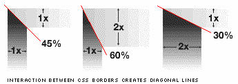
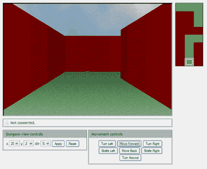

# 使用 CSS 和 DOM 渲染 3D 世界

> 原文：<https://www.sitepoint.com/render-3d-worlds-using-css-and-the-dom/>

让你的思绪回到 2001 年 1 月——真人秀时髦而新鲜,“Dubya”正在椭圆形办公室打开盒子，Tantek 切利克——他以盒子模型黑客闻名——首先介绍了使用 CSS 边框的交互来创建对角线而不需要图形的想法。他的“对正多边形的研究”表明，通过改变 CSS 边框属性的厚度，可以创建简单的几何形状。

我清楚地记得当时我被这个想法惊呆了，但是它看起来也有点模糊，在日常的 web 开发中并不真正有用。诚然，一些开发人员成功地从脆弱的 div 混乱中梳理出了 logo(Kevin 在 Tech Times edition 中设计了 SitePoint logo)和简单的图表，但总的来说，这更多的是关于血腥而不是实用性。

这花了五年半的时间，但是我们自己的詹姆斯·爱德华兹(JavaScript 选集'['的合著者之一)实际上已经提出了这项技术的实际应用。仅仅使用 Tantek 的想法，一些 JavaScript 和一些严肃的数学思考，James 已经构建了一个有效的](https://www.sitepoint.com/books/jsant1/)[动态 3D 渲染引擎](http://www.brothercake.com/site/resources/reference/3d/)。该引擎采用简单的 2D 平面图，并将它们转换成一个用户可以自由浏览的阴影 3D 世界。神奇的东西。

我应该说明的是，就像 Tantek 最初的演示一样，在这个阶段，它是对可能性的探索，而不是可行的应用。你可以预期这种应用程序在不久的将来会成为动态 SVG。

尽管如此，带着对 Wolfenstein 3D T1 的美好回忆，我不得不承认有一天我会悄悄穿过由 CSS 砖块建造的纳粹堡垒的想法有一定的吸引力。

## 分享这篇文章