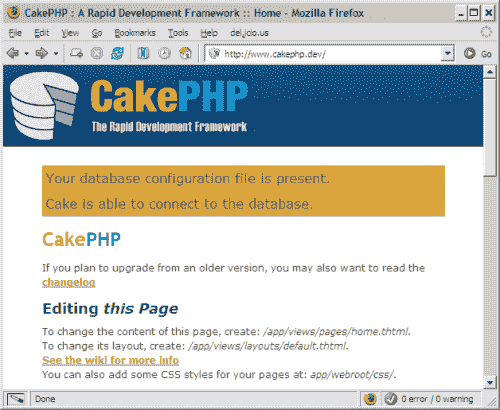
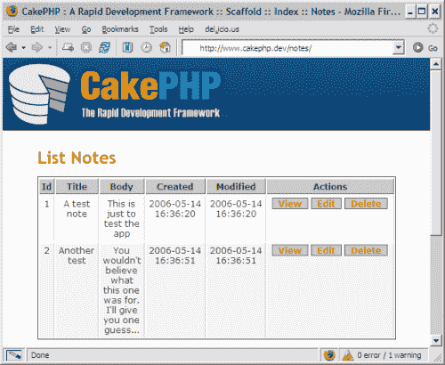
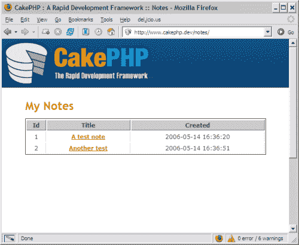
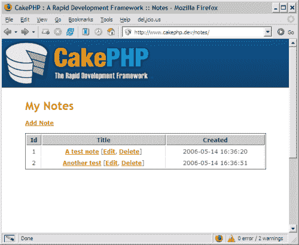

# CakePHP 框架:你的第一口

> 原文：<https://www.sitepoint.com/application-development-cakephp/>

根据最近的一项研究，PHP 是世界上最流行的编程语言之一。尽管如此，PHP 经常因其不一致的命名约定、与其他语言相比缺乏重要特性(如名称空间)以及其固有的混乱状态而受到批评。此外，PHP 非常容易学习，这经常导致一种常见的误解，即大多数 PHP 开发人员缺乏经验，他们的代码因此容易出现[安全漏洞和利用](https://www.sitepoint.com/php-security-blunders/)。

在某种程度上，这都是真的。PHP 本身实际上没有提供真正的结构或组织，从而让编码人员以最不可预测和最危险的方式自由表达自己:编程逻辑与表示元素混合，在脚本中无组织地包含其他源文件，不必要且经常被遗忘的数据库连接，等等。这些明显而常见的错误会使 PHP 代码变得完全不可维护。

##### PHP 需要一个框架

近年来，PHP 已经重新发明了自己，允许面向对象编程(OOP)以过多的新规则和功能进入场景，所有这些都根植于更主流的编程语言，如 C++和 Java。渐渐地，越来越多的 PHP 开发人员接受了这种新的理念，并开始开发框架，从其他更成熟的语言中汲取灵感，追求为一种固有的非结构化语言创建一种结构。

互联网上有许多可用的框架，每个框架都有自己特定的规则和约定、成就和失败。一些退化成无用的和复杂的预建库和工具的集合，使开发人员成为复杂的和真正无用的编程方法的奴隶；其他人没有。

Ruby on Rails 无疑在激励人们用 Ruby 以外的编程语言寻找完美的 web 框架方面发挥了关键作用。由于 Rails 现象，更多的框架出现了，提供了与 Ruby on Rails 非常相似的功能。这些框架通常被称为 [Rails 克隆](http://redhanded.hobix.com/cult/railsClonesBloodsuckersOrUsefulDrones.html)。

一些框架的开发者已经公开承认他们试图将 Rails 移植到其他语言，但是他们经常忽略这样一个事实:Ruby on Rails 是用 Ruby 构建的，这是有原因的:Ruby 拥有其他编程语言所没有的特性。同时，至少有一个人放弃了在 PHP 中完全克隆 Rails 的想法，而是决定借用它的结构和基本概念来使 PHP 更有组织性:

虽然在 PHP 中复制 Rails 很困难，但编写一个等价的系统还是很有可能的。我喜欢 Ruby 代码的简洁，但我需要 Rails 提供的结构，它如何让我将代码组织成可持续的东西。这就是为什么我要把蛋糕的轨道扯下来。

*——CakePHP 的创始人，在一篇著名的[博客文章](http://redhanded.hobix.com/cult/railsClonesBloodsuckersOrUsefulDrones.html)上评论。*

这使得 [CakePHP](http://www.cakephp.org/) 不仅与众不同，而且是 PHP 最受欢迎的框架之一:它适度但重要的目标是为 PHP 应用程序提供一个合适的结构。

##### CakePHP 的 MVC 架构方法

已经了解 Ruby on Rails 的读者可能会发现 CakePHP 与它非常相似。首先，Cake 基于一种类似 MVC 的架构，这种架构既强大又易于掌握:控制器、模型和视图保证了业务逻辑与数据和表示层严格而自然的分离。

**控制器**包含应用程序的逻辑。每个控制器可以提供不同的功能；控制器通过模型访问数据库表来检索和修改数据；它们注册变量和对象，这些变量和对象可以在视图中使用。

**模型**是数据库表的主动表示:它们可以连接到数据库，查询它(如果控制器指示这样做)并将数据保存到数据库。需要注意的是，为了正确应用 MVC 架构，模型和视图之间不能有交互:所有的逻辑都由控制器处理。

GA_googleFillSlot(“Articles_6_300x250”);

**视图**可以被描述为向用户呈现其内容的模板文件:视图中使用的变量、数组和对象通过控制器注册。视图不应包含复杂的业务逻辑；视图中应该只包含执行特定操作所需的基本控制结构，例如通过 foreach 构造对收集的数据进行迭代。

这种架构可以极大地提高站点代码的可维护性和组织性:

*   它将业务逻辑从表示和数据检索中分离出来。
*   一个站点被分成多个逻辑部分，每个逻辑部分由一个特定的控制器管理。
*   在测试和调试应用程序时，任何习惯于 CakePHP 结构的开发人员都能够在不了解所有代码细节的情况下找到并纠正错误。

控制器、模型和视图存储在 CakePHP 目录结构中预定义的目录中。下面是使用的目录结构:

*   app/
    *   配置/
    *   控制器/
    *   型号/
    *   插件/
    *   tmp/
    *   供应商/
    *   观点/
    *   webroot/
*   蛋糕/
    *   配置/
    *   文档/
    *   libs/
*   供应商/

这个目录方案必须保留，因为如果框架本身要工作，它是必不可少的。Cake 和 Rails 一样，相信约定比配置更重要:为了部署一个应用程序，而不是修改几十个不同的配置文件，重要的是将所有东西放在适当的位置；然后，您可以让框架完成剩下的工作。

尽管这对于一些开发人员来说似乎令人担忧，但是这是一个很好的折衷方案，可以真正加速开发过程。

##### 品尝面糊

作为一个例子，现在让我们看看如何构建一个简单的 memo 应用程序，它允许您添加、编辑、显示和删除存储在 MySQL 数据库中的个人笔记。为了亲自尝试，您需要下载最新稳定版本的 [CakePHP](https://cakephp.org/) ，并确保您的开发环境满足以下要求:

*   可以访问像 [Apache](http://httpd.apache.org/) 这样的 web 服务器，尽管也支持 IIS 和 Lighttpd 这样的服务器
*   能够重写 URL(例如，使用 Apache 的 mod_rewrite 模块——默认情况下，CakePHP 附带一个. htaccess 文件来处理这个问题)
*   安装了 [MySQL](http://www.mysql.com/) 或类似的数据库服务器，并且您拥有创建新数据库的必要权限；其他解决方案，如 PostgreSQL 或 SQLite 也可以，尽管推荐使用 MySQL(本例假设您正在使用 MySQL)
*   拥有 [PHP 版本 4.3](http://www.php.net/) 或以上；CakePHP 无缝支持 PHP4 和 PHP5

下载 CakePHP 包后，将它的内容解压到 web 服务器的文档根目录，或者它的一个子目录中。对于这个例子，我将假设您的 CakePHP 应用程序安装在文档根目录中，并且可以在`http://localhost/`访问它。


*确认 CakePHP 的配置*

GA_googleFillSlot(“Articles_6_300x250”);

如果您现在尝试访问您的应用程序，将显示 CakePHP 默认页面，警告您无法建立数据库连接。我们需要创建一个名为 memo 的新 MySQL 数据库，它可以由名为 memouser 的用户访问，还需要创建一个名为 notes 的新表:

```
CREATE TABLE notes (  
   id INT UNSIGNED AUTO_INCREMENT PRIMARY KEY,  
   title VARCHAR(50),  
   body TEXT,  
   created DATETIME DEFAULT NULL,  
 modified DATETIME DEFAULT NULL 
);
```

注意表格是如何使用复数的。现在，如下编辑您的数据库配置文件(`/app/config/database.php.default`)，并将其保存为`database.php`(是的:名称很重要！):

```
<?php 
class DATABASE_CONFIG 
{ 
    var $default = array('driver'   => 'mysql', 
                         'connect'  => 'mysql_pconnect', 
                         'host'     => 'localhost', 
                         'login'    => 'memouser', 
                         'password' => 'userpassword', 
                         'database' => 'memo' ); 
    var $test   =  array('driver'   => 'mysql', 
                         'connect'  => 'mysql_pconnect', 
                         'host'     => 'localhost', 
                         'login'    => 'user', 
                         'password' => 'password', 
                         'database' => 'project_name-test'); 
} 
?>
```

如果刷新默认页面，CakePHP 会通知您数据库现在可以访问了。

CakePHP 现在已经配置好了，我们可以开始开发我们的应用程序了。该框架提供了一个有用的受 Rails 启发的特性，称为 scaffolding，它基本上允许创建一个接口，只需几行代码就可以执行创建、读取、更新和删除(CRUD)数据库操作。当您希望应用程序的某个特定区域可以快速用于测试目的，并且您还不想花时间对其进行适当的编码时，这一点特别有用。

为了创建 memo 应用程序的搭建版本，我们需要创建两个非常基本的文件:一个控制器和一个模型。

创建一个名为`note.php`的文件(同样，名称很重要——注意这里定义的文件和类是数据库表注释的单数形式),并将其保存在您的`/app/models/`目录中。您只需要在其中包含以下几行:

```
<?php 
class Note extends AppModel 
{ 
  var $name = 'Note'; 
} 
?>
```

类似地，创建一个包含下面代码的`notes_controller.php`文件，并将其放在`/app/controllers/`中。

```
<?php 
class NotesController extends AppController 
{ 
var $name = 'Notes'; 
var $scaffold; 
} 
?>
```

`$scaffold`变量将触发 CakePHP 的默认搭建行为:一个全功能的 Notes 部分将被创建，并将在`http://localhost/notes/`被访问。

这就是全部了。你现在可以用五行 PHP 代码创建、更新、删除和显示你的笔记了！


*CakePHP 应用程序的默认编辑视图*

这是一个老把戏，如果你曾经读过 Ruby on Rails 的初学者教程，你可能不会太惊讶；然而，很高兴知道以前只有 Rails 才有的特性已经移植到 PHP 了。

##### 创建您的第一个应用程序

在使用新应用程序一段时间后——随意创建和删除一些笔记——您会开始注意到它明显的局限性:

*   布局非常简单，显然是不可定制的
*   注释未经确认即被删除
*   用户输入的任何数据都不需要验证

GA_googleFillSlot(“Articles_6_300x250”);

我们现在将拆除脚手架，开始开发稍微高级一点的东西。如果您注意了前面的例子，您会注意到没有创建视图文件。那是因为 Cake 使用预定义的模板搭建；实际上，对于控制器中列出的几乎每个动作，您都需要一个视图。

此外，我们的控制者没有行动，这也是脚手架魔术的一部分。当我们添加和删除注释时，可以在搭建的应用程序的 URL 中看到动作名称的提示，即:

```
http://localhost/notes/
http://localhost/notes/add/
http://localhost/notes/edit/1/
http://localhost/notes/view/2/
http://localhost/notes/delete/3/
```

换句话说，我们所有的 URL 都符合一个共同的模式:它们都以`/<controller>/<action>/<first_parameter>/`的形式编写。所以我们需要为 CRUD 操作创建至少三个视图——我们将它们命名为`add.thtml`、`edit.thtml`和`view.thtml`——以及一个默认视图(`index.thtml`)来列出和管理所有的注释。这些`thtml`文件中的“t”表示这些文件是蛋糕模板。而`delete.thtml`呢？不需要创建此文件；我们很快就会看到原因。

在继续之前，从您的`NotesController`类中删除这一行:

```
var $scaffold;
```

***查看笔记***

我们应该创建的第一个视图是存储在数据库中的所有笔记的列表，这将是我们访问`http://localhost/notes/`时显示的默认页面。在您的`/app/views/`目录中创建一个名为`notes`的新子目录，然后在其中创建一个名为`index.thtml`的新文件。该文件应包含以下代码:

```
<h1>My Notes</h1> 
<table> 
    <tr> 
        <th>Id</th> 
        <th>Title</th> 
        <th>Created</th> 
    </tr> 
    <?php foreach ($notes as $note): ?> 
    <tr> 
        <td><?php echo $note['Note']['id']; ?></td> 
        <td> 
            <a href="/notes/view/<?php echo $note['Note']['id']?>"> 
                <?php echo $note['Note']['title']?> 
            </a> 
        </td> 
        <td><?php echo $note['Note']['created']; ?></td> 
  </tr> 
    <?php endforeach; ?> 
</table>
```

请注意，我们的模板代码并不是一个完整的 HTML 文档——所有文件的 doctype 和 header 信息等内容也是由框架提供的，默认设置当然可以在以后被覆盖。

这应该会显示所有存储笔记的列表，但是如果你现在尝试访问`http://localhost/notes/`，你会得到一个错误，说动作索引没有在你的控制器中定义。

这个动作的代码需要在您的控制器中创建。它只需要从 notes 数据库表中检索所有记录，并将它们存储在一个数组中。Cake 用一行代码就完成了这项任务:

```
function index() 
    { 
          $this->set('notes', $this->Note->findAll());
    }
```

方法集在 Cake 的`Controller`类中定义，也由`AppController`、`NotesController`和应用程序中的任何其他控制器继承。set 的目的是创建一个变量(`$notes`)，该变量将在您的默认视图(`index.thtml`)中可用，它的语法是`$this->set(string $variable_name, mixed $value)`。

`$notes`变量的值是由`$this->Note->findAll()`返回的多维数组。`findAll`是在 Cake 的`Model`类中定义的方法，它获取数据库表中与模型相关的所有记录。在这个例子中，我们将访问我们的 Note 模型，并从我们的控制器调用这个方法。

假设您的 notes 表有一些记录，`findAll`的输出将是这样的:

```
// print_r($notes) output:   
Array   
(   
    [0] => Array   
        (   
            [Note] => Array   
                (   
                    [id] => 1   
                    [title] => First note's title   
                    [body] => Some text.   
                    [created] => 2006-04-20 14:21:42   
                    [modified] =>   
                )   
         )   
    [1] => Array   
        (   
            [Note] => Array   
                (   
                    [id] => 2   
                    [title] => Title...   
                    [body] => body text   
                    [created] => 2006-04-20 17:22:23   
                    [modified] =>   
                )   
        )   
)
```

正如我前面提到的，这个输出只用一行代码就完成了。CakePHP 极大地减少了应用程序中重复和枯燥的代码量，这要归功于它高效的内置类和直观的约定。


*创造我们的第一个视图*

我们以类似的方式查看单个音符。首先，我们需要在我们的`/app/views/notes/`目录中有一个`view.thtml`视图文件:

```
<h1><?php echo $data['Note']['title']?></h1>  
<p><small>   
Created: <?php echo $data['Note']['created']?>   
</small></p>   
<p><?php echo $data['Note']['body']?></p>
```

然后，我们将相应的视图动作添加到控制器中:

```
function view($id)   
    {   
        $this->Note->id = $id;   
        $this->set('data', $this->Note->read());   
    }
```

这个方法有一个参数:我们想要查看的笔记的 ID($ ID)。为了检索特定的音符，我们必须将我们的`Note`模型的`$id`变量设置为我们传递给该方法的`$id`参数。然后我们创建一个`$data`变量，它可以通过 set 方法在我们的视图中使用。它包含一个由`$this->Note->read()`返回的数组。`read`从我们的 notes 表中只获取一行，它对应于一个特定的`$id`。

***添加、编辑和删除备注***

接下来，我们将创建一个视图来添加新注释。我们只需要在`/app/views/notes/`目录中有一个名为`add.thtml`的文件:

```
<h1>Add Note</h1>   
<form action="<?php echo $html->url("/notes/add"); ?>" method="post">   

    <p>   
        Title:     
        <?php echo $html->input('Note/title', array('size' => '40'))?>   
    </p>   
    <p>   
        Body:     
        <?php echo $html->textarea('Note/body') ?>   
    </p>   
    <p>   
        <?php echo $html->submit('Save') ?>   
    </p>   
</form>
```

GA_googleFillSlot(“Articles_6_300x250”);

这段代码创建了一个基本的表单，允许用户输入注释的标题和文本，并保存它。这一次，我决定使用一些方便的代码，通过所谓的 HTML 助手创建两个输入标签。本文的下一节将详细讨论助手，但是简单地说，它们是可以从视图中访问的类，并且包含格式化文本、创建标签、添加 Javascript 或 AJAX 代码等有用的方法。默认情况下，HTML Helper 在所有视图中都可用，用于创建(X)HTML 标签。我在这个视图中使用它来创建一个输入标签、一个文本区域和一个提交按钮。语法相对简单，但是需要注意的是，为了轻松地将输入字段映射到我们的表列，从而自动化插入过程，输入字段的名称(通常是 HTML Helper 的每个方法的第一个参数)必须采用`<model_name>/<table_field>`的形式。

Notes 控制器的`add`方法可以是这样的:

```
function add()   
    {   
    if (!empty($this->data['Note']))   
        {   
            if($this->Note->save($this->data['Note']))   
            {   
                 $this->flash('Your note has been updated.','/notes/');   
            }   
        }   
    }
```

首先，我们检查`$this->data`变量——一种`$_POST`数组的“优化”版本——是否为空。如果它包含一些内容，那么通过`$this->Note->save()`方法调用，这些数据会自动保存在您的 notes 表中。

任何接触过 Rails 的人都会熟悉随后调用的 flash 方法:它用于在请求之间保存少量数据，比如错误消息或警告；在这种情况下，它会显示几秒钟的临时消息，然后将用户重定向到`http://localhost/notes/`。

*注意:每当通过 save 方法添加或修改注释时，我们的 notes 表的 created 和 modified 字段会自动填充相关数据，因此无需手动跟踪这些操作。很有用，是吧？*

在这一点上，你应该注意到有些不对劲。上面描述的`add.thtml`视图和添加操作非常简单，但却非常危险:没有任何数据验证，因此，目前用户输入的任何类型的数据都将被存储在我们的数据库中，没有经过过滤或检查。Cake 有一些内置的验证和输入净化机制(我们将在下一节简要介绍)，但我们现在将保持事情简单，因为这只是介绍 CakePHP 基本特性的一个非常简单的例子。

编辑注释类似于添加新注释，不同之处在于编辑表单的值必须已经包含数据。

```
/app/views/notes/edit.thtml:   

<h1>Edit Note</h1>   
<form action="<?php echo $html->url('/notes/edit')?>" method="post">   
    <?php echo $html->hidden('Note/id'); ?>   
    <p>   
        Title:   
        <?php echo $html->input('Note/title', array('size' => '40'))?>   
    </p>   
    <p>   
        Body:   
        <?php echo $html->textarea('Note/body') ?>   
    </p>   
    <p>   
        <?php echo $html->submit('Save') ?>   
    </p>   
</form>   

/app/controllers/notes_controller.php:   
function edit($id = null)   
{   
    if (empty($this->data['Note']))   
    {   
        $this->Note->id = $id;   
        $this->data = $this->Note->read();   
    }   
    else   
    {   
        if($this->Note->save($this->data['Note']))   
        {   
             $this->flash('Your note has been updated.','/notes/');   
        }   
    }   
}
```

在这种情况下，如果没有提交数据，那么我们要编辑的记录中的值将被检索并显示在视图中。否则，如果提交了数据，记录将照常通过 save 方法更新。同样，这个简单的函数有一些明显的限制:

*   我们不验证、过滤或检查`$id`参数(实际上，我们应该确保`$id`是数字，并且它确实存在)。
*   提交的数据未经验证或过滤。
*   没有错误处理发生——如果出错，用户永远不会收到警告消息。
*   最后，为了删除一个注释，我们需要做的就是在我们的`NotesController`中创建一个删除动作；不需要查看文件，因为用户将被重定向到索引页面，在那里将显示一条消息。

```
/app/controllers/notes_controller.php:   
function delete($id)   
    {   
        if ($this->Note->del($id))   
        {   
            $this->flash('The note with id: '.$id.' has been deleted.', '/notes');   
        }   
    }
```

在定义了所有的 CRUD 操作之后，我们可以通过添加一些方便的链接来添加、编辑和删除注释，从而使界面更容易使用。我们还可以使用 HTML 助手重写我们的`index.thtml`视图:

```
<h1>My Notes</h1>   
<p>   
<?php echo $html->link('Add Note', '/notes/add') ?>   
</p>   
<table>   
    <tr>   
        <th>Id</th>   
        <th>Title</th>   
        <th>Created</th>   
    </tr>   
    <?php foreach ($notes as $note): ?>   
    <tr>   
        <td><?php echo $note['Note']['id']; ?></td>   
        <td>   
      <?php echo $html->link($note['Note']['title'], "/notes/view/{$note['Note']['id']}")?>   
      [<?php echo $html->link('Edit', "/notes/edit/{$note['Note']['id']}")?>,   
      <?php echo $html->link('Delete', "/notes/delete/{$note['Note']['id']}", null, 'Are you sure?')?>]   
        </td>   

        <td><?php echo $note['Note']['created']; ?></td>   
    </tr>   
    <?php endforeach; ?>   
</table>
```

在这个例子中，我使用了`$html->link()`方法调用，它能够很容易地创建“蛋糕友好”的链接。它最多可以有六个参数:

*   链接的文本
*   内部 URL
*   HTML 属性的数组(如果有)
*   Javascript 确认消息的文本
*   我们是否要将标题中的特殊字符转换成 HTML 实体
*   这个方法是应该返回还是输出一个值
    `link($title`、`$url=null`、`$htmlAttributes=null`、`$confirmMessage=false`、`$escapeTitle=true`、`$return=false)`


*自定义索引页面*

完整的控制器应该是这样的:

```
<?php   
class NotesController extends AppController   
{   
  var $name = 'Notes';   
  function index()   
    {   
          $this->set('notes', $this->Note->findAll());   
    }   
  function view($id)   
    {   
        $this->Note->id = $id;   
        $this->set('data', $this->Note->read());   
    }   
  function add()   
    {   
    if (!empty($this->data['Note']))   
        {   
            if($this->Note->save($this->data['Note']))   
            {   
                 $this->flash('Your note has been updated.','/notes/');   
            }   
        }   
    }   

  function edit($id = null)   
{   
    if (empty($this->data['Note']))   
    {   
        $this->Note->id = $id;   
        $this->data = $this->Note->read();   
    }   
    else   
    {   
        if($this->Note->save($this->data['Note']))   
        {   
             $this->flash('Your note has been updated.','/notes/');   
        }   
    }   
}   

  function delete($id)   
    {   
        if ($this->Note->del($id))   
        {   
            $this->flash('The note with id: '.$id.' has been deleted.', '/notes');   
        }   
    }   
}   
?>
```

不太难，是吗？当然，如果你不习惯 MVC 模式，这可能看起来有点奇怪，但是我们的 PHP 代码看起来肯定更有组织，并且比大多数非结构化的 PHP 架构更容易维护。

要记住的一点是，Cake 中使用的所有这些小约定实际上都很重要:例如，控制器的名称必须是复数，模型必须是单数，而数据库表应该是复数(CakePHP 的 Inflector 类完成其余工作)，视图必须放在以控制器命名的文件夹中，等等。是的，你可以绕过其中的一些约定，但是正是这些细节使得 Cake 实际上可以自我配置:这是一个约定胜于配置的例子，就像 Rails 一样。CakePHP 可能不是每个人的最佳解决方案，但它肯定是解决许多与 web 开发相关的问题的简单而直观的方法。

此时，你可能有很多疑问。例如，我写道 CakePHP 有一个本地验证机制，它可以净化数据。那是什么意思？为什么我们没有修改我们的模型类？我们将在下一节回答这些问题和其他问题。

##### 关于 CakePHP 附加特性的常见问题

CakePHP 提供了许多无法在一篇文章中恰当描述的特性。然而，我列出了一些常见问题，可能有助于您进一步理解这个框架。

*1。如何让我的应用程序更安全？*

GA_googleFillSlot(“Articles_6_300x250”);

本文中的例子本质上是不安全的。幸运的是，CakePHP 附带了一个 Sanitize 类，可以在 Cake 应用程序中使用它来过滤字符串或数组，使它们可以安全地显示或插入数据库。关于消毒的更多信息可以在 [CakePHP 手册](http://manual.cakephp.org/pages/ch13s01)中找到。

关于验证，可以通过向我们的模型添加一些验证规则来确保输入的数据满足特定的规则或模式，如下所示:

```
<?php     
class Note extends AppModel     
{     
    var $name = 'Note';     
    var $validate = array(     
        'title'  => VALID_NOT_EMPTY,     
        'body'   => VALID_NOT_EMPTY     
    );     
}     
?>
```

```
VALID_NOT_EMPTY is a constant defined in /cake/libs/validators.php, and can be used to make sure that a particular field is not left blank. CakePHP comes with some predefined constants, but custom constants can be created.
```

定义验证规则后，所有相关的操作和视图都应该相应地进行修改。手册的这些页面[中提供了更多信息和示例。](http://manual.cakephp.org/pages/ch11s01)

*2。有没有办法关闭 Cake 的‘调试模式’？有主配置文件吗？*

是的。管理 CakePHP 一些核心设置的主配置文件位于`/app/config/core.php`中。可以通过该文件修改的一些设置包括:

*   CakePHP 的调试冗长和类型

*   记录级别

*   cookies 和会话持续时间

*   会话存储位置

*3。所有的业务逻辑都应该放在我的控制器中，但是如果我想在其他地方重用一些东西呢？*

好问题。您几乎总是必须为应用程序创建一些复杂的逻辑，并且您通常希望重用部分逻辑。包含应用程序范围的函数或变量以便在每个控制器中都可用的最常见方法是在 AppController 文件中定义它。这个文件基本上由一个空类组成，它扩展了 Cake 的内部控制器类，位于/cake/目录中。您可以将它移动到您的`/app/`目录中，并创建将在所有扩展 AppController 的自定义控制器中可用的方法。即使您最初不打算使用 AppController，创建扩展 AppController 而不是`Controller`类的自定义控制器通常也是明智的。

创建处理特定任务的自定义类的一种简单方法是创建一个组件。通过添加一个名为`$components`的变量，可以将组件自动加载到控制器中(并且只加载到控制器内部):

```
var $components = array('Session', 'MyCustomComponent');
```

CakePHP 附带了一些默认组件，比如 Session，它提供了组织会话数据的便捷方式，或者 RequestHandler，它可以用来确定关于 HTTP 请求的更多信息。这些都记录在 CakePHP 手册中:

*   [会话组件手册页](http://manual.cakephp.org/pages/ch14)
*   [请求处理程序组件手册页](http://manual.cakephp.org/pages/ch15)

*4。CakePHP 需要 PHP5 吗？*

不会。CakePHP 与 PHP 4 100%兼容。我个人认为这是 Cake 的主要优势之一。例如，`__construct()`方法可以用在 PHP4 上扩展`Object`核心类的所有类上，也就是说几乎 CakePHP 中的所有类。核心库中也包含了类似的补丁，以便在 PHP4 中提供额外的功能。不幸的是，变量和方法不支持访问修饰符，私有方法应该以下划线为前缀。这不仅仅是一个约定:在控制器中，它实际上意味着方法是私有的。如果有人试图访问它(例如通过`http://localhost/notes/_privatemethod/`，Cake 将返回一个错误。

*5。CakePHP 的默认助手有哪些？*

CakePHP 附带了一些非常方便的助手，当涉及到创建视图时，它们真的可以让您的生活变得更容易:

*   HTML —允许快速创建 HTML 标签，包括链接和输入字段
*   JavaScript —提供了一种管理 JavaScript 代码的简单方法
*   数字—一组格式化数字数据的有用方法
*   时间—格式化时间字符串和时间戳的函数
*   文本-自动链接网址，截断字符串，创建摘录，突出显示，剥离链接等
*   AJAX——一个真正令人惊叹的 AJAX 助手，将与流行的 Prototype 和 script.aculo.us 库结合使用；这个助手真的可以加速 AJAX 界面的创建

关于助手的更多信息可以在 CakePHP 手册中找到。

*6。有什么方法可以将我的自定义函数/类包含在 Cake 中？*

当然有。如果您想使用一个自定义的外部类，您可以将它放在`/vendors/`目录中，并像这样将其加载到您的控制器中:

```
vendors('MyClassName');
```

如果您需要定义定制的应用程序范围的常量或函数，您可以将它们放在`/app/config/bootstrap.php`中，这将使它们在您的应用程序中随处可用。

您可以修改代码并创建一个助手或组件来与视图或控制器结合使用。

也可以尝试将其他软件包集成到 Cake 中。

*7。如果我需要同时处理多个表怎么办？*

默认情况下，NotesController 会尝试定位并加载一个`Note`模型类。如果您的控制器需要访问其默认模型以外的模型，您可以通过设置`$uses`数组来定义其他模型，如下所示:

```
var $uses = array(Note, AnotherModel, YetAnotherModel);
```

在某些情况下，两个或多个表可能密切相关，因此会使用 JOIN 语句:例如，您的笔记可能是由 authors 表中列出的不同人提交的。在这些情况下，CakePHP 的关联可以用来直接在您的`Model`类中定义复杂的表关系。更多信息可在[这些手册页](http://manual.cakephp.org/pages/ch06s03)中找到。

*8。可以进一步定制我的应用程序的 URL 吗？*

是的。查看`/app/config/routes.php`文件，并随意定义或修改您的自定义路线。例如:

```
$Route->connect ('/', array('controller'=>'notes', 'action'=>'index'));
```

这为`http://localhost/`创建了一条默认路线:

```
http://localhost/notes/index/.
```

*9。蛋糕里有认证机制吗？*

是也不是。没有官方的身份验证组件，只是因为根据所开发的应用程序的类型，需求可能会有很大的不同。但是，有一个内置的访问控制列表机制，涉及平面文件或数据库。更多信息可在[这些手册页](http://manual.cakephp.org/pages/ch12)中找到。

##### CakePHP 资源

CakePHP 项目正在持续增长:随着越来越多的用户开始使用该框架并创建他们自己的项目，文档也在不断改进。因此，越来越多的网站和博客正在开发大量有用的信息，免费提供给 CakePHP“面包师”。以下是一些展示蛋糕相关材料的地方的名单:

【CakePHP 官方网站

CakePHP Wiki —一个社区驱动的 Wiki，提供各种蛋糕教程和操作方法

CakePHP 手册 — CakePHP 的官方手册，仍在开发中，但已经相当全面了

[CakePHP Google 用户群](http://groups.google.com/group/cake-php) —非常活泼的用户群；如果你有问题要问，请点击这里

CakePHP IRC 官方频道:# CakePHP on irc.freenode.net——与其他面包师以及 CakePHP 的创作者实时聊天

##### 摘要

CakePHP 是一个成熟的框架，适合那些想要 Ruby on Rails 的结构和节省时间的好处的 PHP 开发人员，而不必离开他们的舒适区或去理解晦涩的 Ruby 语法。使用 Cake 的脚手架，可以用最少的代码快速构建一个原型应用程序。此外，有了大量的助手类可以扩展和定制您的应用程序，同时保留一个明智的和易于维护的架构，Cake 使无限的可能性。CakePHP 正在积极开发中，有大量的文档和活跃的支持社区作为后盾。

这篇文章让您领略了 CakePHP 的潜力。现在是你离开去做点自己的烘焙的时候了！

## 分享这篇文章