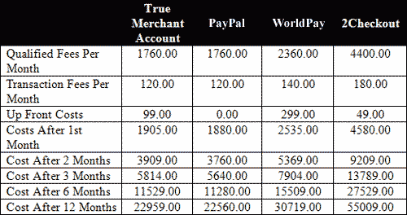
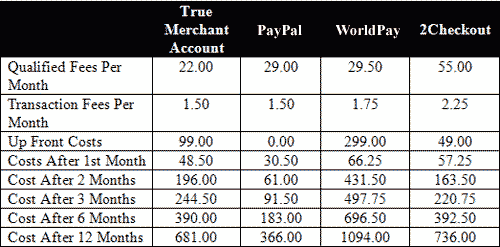
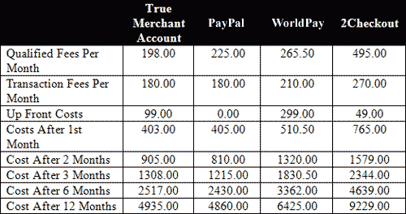
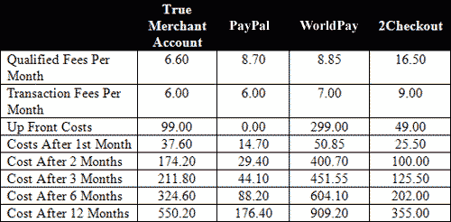
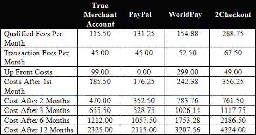

# 解决支付处理问题

> 原文：<https://www.sitepoint.com/merchant-account-review/>

在启动网上商店的早期阶段，你需要做出许多关键的决定。也许其中最重要的是你处理客户付款的方式。您可以选择使用真实的商家帐户自己处理订单，或者使用第三方处理程序。您决定的方法可能会影响整个网站的实现。

但是怎么选择呢？价格是唯一最重要的因素吗？还涉及哪些其他因素？在本文中，我们将通过比较真实的商家帐户和第三方处理者来揭示这些问题的答案。我们将通过在真实世界的例子中并排比较这两种方法来揭示它们之间的区别，使用一个定制的 PHP 计算器来帮助我们。我们不要再浪费时间了！

##### 基础知识

在我们深入比较之前，让我们仔细看看这两种方法。有了真实的商户账户，你，即商户，向处理银行(通常通过销售代理)申请拥有一个专门用于你的业务的商户账户的权利。商人帐户是为你的生意单独和你在各方面负责它。您还负责提供一个网关，因为这不包括在帐户中。(虽然一些处理公司或销售代理为了方便起见会将网关与商家帐户捆绑在一起，但它们是独立的实体，您通常可以自由使用您喜欢的任何网关)。基本上，你的商户账户是 Visa 和 Mastercard(以及 American Express 和 Discover Card，如果你选择接受他们成员的支付)的直接账户，所以你必须遵守他们的规则。

第三方处理器允许企业和个人通过自己的商户账户接受信用卡支付。您不是直接通过处理银行申请，而是通过第三方处理器申请，第三方处理器使用自己的一套标准来决定您是否有资格使用他们的服务，第三方处理器的银行甚至不知道您的存在！某种形式的支付网关自动包括在内，因为您必须通过第三方处理器的系统处理所有销售。第三方处理者掌握着所有的卡，因为他们制定了你必须遵守的所有规则，他们将让你对你的交易如何影响他们的商户账户(他们允许你共享的账户)负责。

##### 何时考虑第三方处理器

当访问真正的商家账户不切实际或不可能时，第三方处理器是显而易见的选择。什么时候会是这种情况？在接下来的情况下。

*   申请人无法获得真实的商户账户。不是每个希望接受信用卡的人都有资格获得真正的商家账户。出现这种情况的原因可能是:
    *   申请人不是注册企业。四大信用卡集团(Visa、MasterCard、American Express 和 Discover Card)要求所有申请者都是合法注册的企业。个人不得为个人用途处理信用卡，包括为个人用途使用其企业的商户账户。
    *   申请人已被列入黑名单。匹配档案又称终止商户档案，是信用卡加工业的黑名单。如果你在这个名单上，很有可能你将无法建立一个商业账户，直到你纠正了导致你被加入黑名单的任何原因。
    *   申请人构成高风险。在线接受信用卡是一个有风险的提议。与传统零售机构相比，网上信用卡支付的欺诈率要高得多。某些类型的商品也可能比其他商品构成更高的风险，例如电子产品和其他高价商品。将高风险项目与高风险互联网环境相结合，为您的企业建立一个商家帐户会突然变得非常困难。
    *   申请人的个人信用值得怀疑。由于风险是商家账户世界中唯一最重要的因素，个人信用成为商家建立账户能力的主要因素。由于新企业通常没有建立信用，商家必须使用他们的个人信用来支持业务。没有信用或信用不佳的商家很可能无法获得商家账户，如果他们获得了账户，利率也会高得惊人。
*   申请人只处理少量交易。真正的商家账户可能会产生与第三方处理商无关的额外费用。这包括开设商户账户的月费，如果你的账户没有达到一定的活动水平，通常还会收取最低月费。此外，还有每月网关费，以及网关安装费。试探性地，一个商家正在考虑花费几百美元来开始，然后每月 50 美元，不管是否有任何交易。对于一个月只处理几百美元交易的小商户来说，支付这样的费用可能会使他们的利润化为乌有。对于这样的商家，第三方处理器将是优选的，因为每笔交易都要收费，消除了月费，并且在大多数情况下，还消除了安装费。
*   申请人不是程序员。不是每个希望在线接受信用卡的人都有办法实现复杂的 API。很多商家都是非技术型的，编程经验很少。虽然他们拥有专业知识，也有动力在网上开店，但他们就是无法处理更先进的支付方式。第三方处理者处理大部分的支付过程，使支付过程变得异常简单。他们通常会为你提供几行简单的代码，放在你的网站上，并从那里接管支付事宜。

***其他要点考虑***

除了我们刚刚谈到的要点之外，在考虑第三方处理器时，还有其他一些因素需要记住。

*   第三方处理者不执行信用检查。
*   他们通常会接受没有更高利率的高风险业务。
*   价格不可协商。
*   它们不能与单独的处理网关一起使用。
*   第三方处理器的名称出现在您客户的信用卡对账单上。
*   你可以随时中止这种关系，而不会招致惩罚。
*   可能需要一个月的时间才能收到存款。

##### 何时考虑真正的商家账户

当向他们提出在线接受信用卡的想法时，大多数商家认为他们需要一个带有支付网关的商家账户。这种假设有一个很好的理由，因为所有信誉良好的在线商家都使用真实的商家账户。其原因包括:

*   处理大量交易。虽然真实商户账户会产生与第三方处理商无关的费用，但处理大量交易的商户使用真实商户账户支付的费用会更少，因为他们会获得更好的折扣率。支付给第三方加工商的折扣率最高可达 6.00%，交易费一美元以上。一个真正的商家账户可以提供低于一半的利率。因此，随着真实商户账户上的交易量增加，商户在真实商户账户上的存款也会增加。大批量商户将很容易清除门槛，使一个真正的商户帐户在财务上更优越的选择。
*   商家对账户拥有完全控制权。由于您已经专门为您的企业开设了商户账户，因此您可以完全控制该账户。你的名字会出现在客户的信用卡账单上，你可以直接与客户支持部门联系，并且你可以更自由地使用这个账户。第三方处理者倾向于设置严格的规则，因为如果确定有太多违反规则的行为，他们可能会失去他们的商家账户。
*   **商家账户提供透明结账。**大多数网关都提供一个 API(应用程序编程接口)来与它们的服务进行交互。这允许程序员直接从商家的网站与网关通信，而不是将客户带到网关的网站，然后再返回。交易似乎是直接在商家的网站上处理的，缓解了客户因为对购买过程感到不舒服而离开网站的问题。
*   商人塑造了一个更专业的形象。大多数客户对专业网站有一个先入为主的概念。在本文的范围内，这意味着一个无缝的结帐过程，页面具有与网站其余部分相同的外观和感觉。这也意味着永远不要离开网站来完成交易。使用真实商家账户的 API 可以让你实现透明的结账，保持你的顾客所期望的专业氛围。

***其他要点考虑***

*   在申请一个真正的商业帐户时，你将接受全面的信用检查。
*   一个商业账户不能用于个人用途。
*   高风险企业将支付更高的利率。
*   价格面议。
*   商家账户可以与单独的处理网关一起使用。
*   您的企业名称出现在您的客户声明上。
*   你可能会被锁定在一份多年的合同中。
*   资金通常在 1-3 个工作日内存入。

##### 并排比较

好了，我们已经确定了真正的商家账户和第三方处理器之间有很多不同之处。这些差异最终导致商家在两种方法之间进行选择，因为其中一种方法将满足他或她的特定需求。然而，我们仅仅触及了影响商家决策的主要因素的表面:成本。我并不是说我们谈到的其他要点不重要——它们很重要，而且肯定会影响最终的决定——但大多数电子商务初创公司预算紧张，利润微薄，对他们来说，成本是选择支付方式的最重要因素。

有什么比比较所有方法来确定哪种最适合您的企业更好的方法来找出最具成本效益的方法呢？听起来很棒，对吧？但是需要对比什么呢？您能说出您可能考虑使用的所有第三方提供商吗？

输入:php 计算器。为了简化将真正的商家账户与第三方处理器进行比较的任务，我将更受欢迎的第三方处理器的费率和费用进行了汇总，并将其放入一个用户友好的界面中，让您可以找出最符合成本效益的方法。您可以[在这里](https://www.sitepoint.com/examples/merchant/calculator.php)访问计算器。请随意使用这个计算器进行我们将要进行的比较，并进行您自己的比较。

##### 比较的目标

在这种情况下，比较苹果和苹果是相当困难的，因为每个企业的需求会有所不同，他们收到的报价也会有所不同。相反，我们将采用成本比较中涉及的核心原则，并使用这些原则来了解每个提供商相对于其他提供商的位置。

我们要做的不仅仅是解决“谁的利率更低？”表面，密切关注每个企业应该考虑的因素:他们的短期和长期成本。我们的成本比较不仅着眼于与在线接受信用卡相关的每月成本，还着眼于商家开始接受信用卡之前发生的成本，直至其年度累计成本。

##### 入门指南

在我们进行成功的比较之前，我们需要收集一些样本数据，即与真实商家账户和第三方处理者相关的费用。

*   **开户费:**开户需要支付多少钱
*   **折扣率:**加工商收取的销售额百分比
*   **交易费:**处理器对每笔交易收取的固定费用
*   **月费:**与保持账户活跃相关的月费
*   **网关设置费用:**设置一个网关的费用
*   **网关月费:**网关提供商因使用其支付网关服务而收取的月费

现在，我们知道从一个真正的商家供应商那里得到什么样的报价了。为了进行适当的比较，我们只需要来自我们企业的两条信息:

*   **每月平均交易量:**您每月要处理的交易量
*   平均票价:普通顾客会在你的网站上花多少钱

##### 我们要比较谁

有大量的第三方处理器可供选择。在这篇文章中，我们将把 PayPal 基本版、 [2CheckOut](http://www.2checkout.com) 和 [WorldPay](http://www.worldpay.com) 与真实的商家账户进行比较。

这些第三方处理器的费用是固定的，因此不需要报价。因此，他们的费用被硬编码到我们的计算器中。我也把它们列在这里供你参考。

***2 检出***

*   安装费:49 美元
*   贴现率:5.50%
*   交易费:45 英镑
*   月费:0.00 美元

***世界共享***

*   安装费:299 美元
*   贴现率:2.95%
*   交易费:35 英镑
*   月费:35 美元

***支付宝基础***

PayPal 有不同的费率，取决于你每月的交易量。随着你每月交易量的增长，PayPal 会通过降低费率来回报你。有四层可用。

2.  **月交易量低于 3000 美元:**
    *   安装费用:0 美元
    *   贴现率:2.90%
    *   交易费:30 英镑
    *   月费:0.00 美元

4.  **月交易量大于 3，000 美元，但小于 10，000 美元:**
    *   安装费用:0 美元
    *   贴现率:2.50%
    *   交易费:30 英镑
    *   月费:0.00 美元

6.  **月交易量大于 10，000 美元，但小于 100，000 美元:**
    *   安装费用:0 美元
    *   贴现率:2.20%
    *   交易费:30 英镑
    *   月费:0.00 美元

8.  **月交易量超过 10 万美元:**
    *   安装费用:0 美元
    *   贴现率:1.90%
    *   交易费:30 英镑
    *   月费:0.00 美元

尽管本文没有考虑 PayPal Pro，但它与 PayPal 标准差别很小。唯一的两个成本差异是取消了每月处理超过 100，000 美元的网站的第四层，并增加了每月 20 美元的费用。这导致一年后 PayPal 的总成本增加了 240 美元。

false 商户账户费率因提供商而异。我们的虚构公司从 SitePoint Merchant Services(一个虚构的商户服务提供商)收到了以下商户帐户和网关报价:

*   安装费用:0 美元
*   贴现率:2.20%
*   交易费:30 英镑
*   月费:10.00 美元
*   网关安装费:99.00 美元
*   网关月费:15.00 美元

这些费率代表了与普通真实商户账户相关的成本，对于我们的比较来说绰绰有余。

为了获得准确的比较，我们需要代表可能使用支付服务的不同类型的商家，因为并非所有商家都有相同的需求。我们将比较五家不同的商户，它们具有不同的票据大小和月交易量，具有非常不同的流程需求。

***特大商户*** :高平均票、高月成交量
平均票:$200
平均交易笔数:500

***超级商户*** :高平均票低月成交量
平均票:$200
平均交易笔数:5

***砍价商人***:；低平均票高月成交量
平均票:$15
平均交易笔数:600

***迷你商户*** :低平均票低月成交量
平均票:$15
平均交易笔数:20

***普通商户*** :中等普通票中等月成交量
普通票:$45
平均交易笔数:220

##### 我们比较的结果

Mega Merchant 的平均票价很高(200 美元)，每月的交易量也很大(400 美元)。我们的比较结果产生了以下结果:

在这种情况下，真正的商家的成本远远低于三个第三方处理器中的两个。贝宝基本版收费较低，但只是轻微的。对于这种规模的商家，真正的商家帐户和网关将优于 PayPal Basic，因为真正的商家帐户提供的优势(全面控制和定制，如本文前面所述)超过了 PayPal Basic 带来的成本节约。这种规模的商家也可能从真正的商家账户提供商处获得较低的折扣率，这进一步增加了他们选择真正的商家账户的动机。

超级商家的平均票价很高(200 美元)，但每月的交易量很低(5)。我们的比较产生了以下结果:

尽管 PayPal 的费用较高，但它显然是超级商家的最佳选择。如果 WorldPay 的安装费不那么高，它也是一个不错的选择。选择一个真正的商家帐户而不是 2 个 CheckOut 只能稍微节省一点。第三方处理器提供的简单性(没有网关可集成)使它们对这种规模的商家更具吸引力。

特价商品的平均票价较低(15 美元)，但每月的交易量较高(600 笔)。我们的比较结果如下:

尽管该商家的价格很低，但每月仍会处理大量交易。在这里，WorldPay 和 2CheckOut 远远超出了商家的价格范围，使 PayPal Basic 成为真正商家账户的可接受替代方案。在这种情况下，与 Mega Merchant 一样，true merchant 帐户提供的优势抵消了 PayPal Basic 提供的成本节约。

迷你商户的平均票价较低(15 美元)，每月交易量较低(20 美元)。我们的比较结果如下:

PayPal Basic 经常被认为是这种规模的商家的最佳选择，结果显示了原因。毫无疑问，哪种选择最适合商家。

普通商家有一个平均票价，不高也不低(45 美元)，每月处理适量的交易(200)。我们的比较产生了以下结果:

对于一般的商家来说，没有一家公司在成本方面脱颖而出。我们的结果表明，这归结为一个真正的商家帐户和贝宝基本之间的选择。一般商家几乎肯定会选择商家账户，因为真正的商家账户提供的优势抵消了 PayPal Basic 带来的成本节约。一个真正的商家帐户将允许普通商家描绘一个更大的公司的外观，并有希望成长为一个。

##### 结论

到目前为止，您应该对真正的商家帐户与第三方处理器有何不同有所了解。虽然这两种方法最终都允许您在线处理信用卡支付，但它们的实现方式非常不同，各自提供的优势也不同。

你应该意识到的一点是，每个企业都是不同的。在整篇文章中，我使用了许多可能不适用于您的业务的概括。一定要考虑网上接受信用卡所涉及的所有方面，而不仅仅是所涉及的成本。有时，每月多付几美元可能意味着顾客购物体验的改善，以及你的企业的专业形象的提升。

和任何重大决定一样，花时间探索你所有的选择。您做的研究越多，就越有可能找到最符合您需求的经济高效的解决方案。

## 分享这篇文章