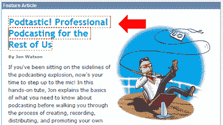

# IE 自动换行重身幽灵错误

> 原文：<https://www.sitepoint.com/the-ie-word-wrap-doppelganger-bug/>

在 IE6 常见的断头台和躲猫猫错误中，看到它仍然有能力向你扔出真正独特和有创意的东西，这几乎令人耳目一新。

这是我们今天早上在 SitePoint 封面上发现的一个新 bug。据我所知，这篇专题文章的 XHTML 在任何方面都不是特别出色:

–DIV #功能设置为百分比宽度，以便与页面一起缩放
–插图紧接在标题之前并向右浮动
–H1 标题、H5 作者署名和广告导语都在插图左侧换行

由于图像不能自行调整大小，当你缩小浏览器窗口时，你会完全期望文本环绕插图。

在某种程度上，你是对的。



正如你所看到的，当标题链接中的一个单词在 IE6 中用尽空间时，它会换行到下一行，但也会在原始行中留下其自身的部分副本——一个邪恶的二重身。

奇怪——就像这个词在冒险和坚持自己知道的路线之间被撕裂，希望事情会变得更好。

继续按比例缩小窗户，二重身最终会倒在边缘，再次消失在以太中。当然，再放大一点，它就会按命令重新出现。

我已经在现场修复了它，[但是如果你想自己看的话，这里有一个静态版本](https://www.sitepoint.com/the-ie-word-wrap-doppelganger-bug/)。

我无法解释为什么会发生这种情况——这肯定与链接有关——但我已经找到了一个解决方案，如果你遇到同样的问题，似乎可以解决这个问题。

首先，链接需要从默认的`'display:inline`切换到`display:block`。

```
 #feature h1 a {
display:block
} 

```

这将防止链接中的单词“中间单词”换行，但不会阻止二重身效应——它只是复制了一个完整的单词。为了驱逐二重身，我们必须在我们的头部添加至少 1px 的填充。给背景色添加边框也可以，但是更有可能导致*和其他*布局问题——例如，如果用户忽略了背景色。

```
 #feature h1  {
padding:1px 
} 

```

这当然有效，但是会增加额外的填充——可能有更好的解决方案。

我谷歌了这个错误的另一个实例，但没有找到，所以我认为这是一个由非常特殊的情况触发的错误。

我仍然认为在这里记录是值得的——实现修复比首先找到它要容易得多。

<ins datetime="2006-05-19T07:25:26+00:00">经过进一步调查，这似乎是“haslayout”错误的一种，这意味着在标题中添加“zoom:1”(无效 CSS)或“height:1%”将修复该错误，而不改变填充。</ins>

## 分享这篇文章