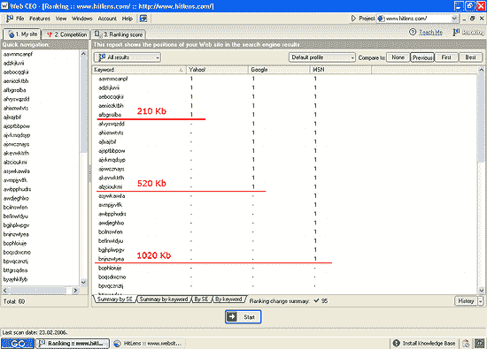
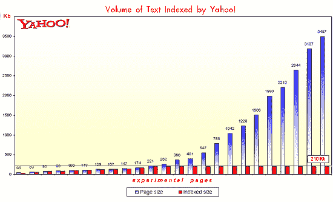
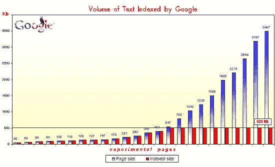
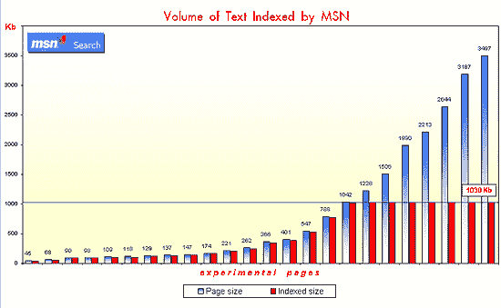
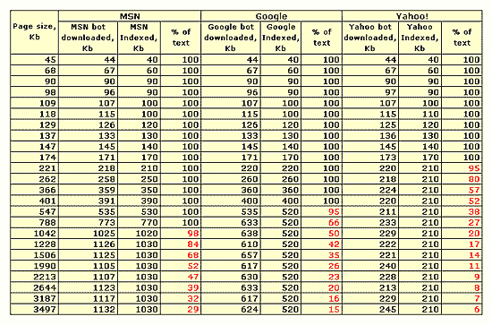

# 搜索引擎索引限制:机器人在哪里停止？

> 原文：<https://www.sitepoint.com/indexing-limits-where-bots-stop/>

对于搜索引擎在单个网页上索引的文本量，SEO 社区有许多不同的观点。问题是，优化后的页面应该有多大？一个页面太短以至于 SEs 视其为“无信息”而不予考虑，而另一个页面太长以至于蜘蛛无法注意到潜在的重要内容，这两者之间的平衡在哪里？

据我所知，还没有人试图通过自己的实验来回答这个问题。SEO 论坛的参与者通常局限于引用引擎本身发布的指导方针。今天，主流搜索引擎通过臭名昭著的“100 KB”限制来限制索引文本量的观点在 SEO 社区中仍然被广泛接受，让 SEO 的客户摸不着头脑，因为他们试图弄清楚如何处理超出这个限制的文本。

##### 运行实验

当我决定建立一个实验来实际回答这个问题时，我的目标是:

*   确定搜索引擎实际索引和缓存的网页文本量
*   了解索引的文本量是否取决于 HTML 页面的整体大小

这个实验实际上是这样进行的。我取了 25 个不同大小的页面(从 45 KB 到 4151 KB)，并以 10 KB 的间隔将唯一的、不存在的关键字插入到每个页面中(也就是说，在每个 10 KB 的文本后包含一个唯一的关键字)。这些关键字是专门为该实验自动生成的，用作“索引深度标记”。然后这些页面被出版了，我去给自己冲了些咖啡，因为等待机器人的到来肯定是一个缓慢的过程！最后我看到了三巨头的机器人(谷歌，雅虎！和 MSN)在我的服务器日志中。网站访问日志为我提供了继续进行实验并成功完成实验所需的信息。

值得注意的是，我在这个测试中使用了特殊的实验性页面。这些页面位于我为这类实验保留的域中，只包含我实验所需的带有关键字的文本。这样的页面——不时地充斥着胡言乱语的无聊文字——如果有人碰巧看到，肯定会引起人们的侧目。但是人类访客绝对不是这里的预期观众。

在我查看了日志文件并确保机器人已经进入之后，剩下的唯一事情就是检查我使用的每个独特关键字在每个实验页面上的排名。(为此，我使用了 [Web CEO 排名检查器](http://www.web-ceo-ranking-checker.com/index.htm))。正如您可能已经猜到的，如果搜索引擎只索引页面的某个部分，它们将在搜索结果中返回该页面中超出扫描限制的搜索词，但不会在搜索结果中返回页面中出现在搜索限制以下的关键词。

##### 试验结果

这个图表显示了三大巨头停止返回我的测试页的地方。

现在我有了关于 SE 机器人下载的页面文本数量的数据，我可以确定搜索引擎索引的页面文本的长度。相信我，结果是出乎意料的——至少可以这么说！但这使得与每个对搜索引擎优化的紧迫问题感兴趣的人分享它们变得更加愉快。

从下表可以看出，铜牌被授予雅虎！结果为 210 KB。任何超过此限制的网页内容都不会被编入索引。

第二名属于伟大的(从搜索质量来看)和可怕的(从对 SEO 的态度来看)谷歌。他们的 Googlebot 能够向其无数的服务器传送超过 600 KB 的信息。与此同时，Google 的 SERPs(搜索引擎结果页面)只列出那些被搜索的关键词位于离页面开始不超过 520 KB 的页面。这是确切的页面大小，在谷歌看来，这是最丰富的，为访问者提供最大限度的有用信息，而不会让他们陷入过长的文本。

这个图表显示了谷歌在测试页面上抓取了多少文本。

索引深度的绝对冠军是 MSN。它的 MSNBot 能够从一个页面下载高达 1.1 兆的文本。最重要的是，它能够索引所有这些文本，并显示在结果页面。如果页面大小大于 1.1MB，超过此限制后出现在页面上的内容将不会被索引。

以下是 MSN 处理大量文本的方法。

MSN 在第一次访问实验页面的时候表现出了一种不寻常的行为。如果一个页面小于 170KB，那么它在 SERPs 中表现良好。尽管机器人已经下载了完整的 1.1MB 的文本，但在我的查询中，任何超过这个阈值的页面都不会出现在 SERPs 中。似乎如果一个页面在 170KB 以上，它几乎没有机会出现在 MSN 的结果中。然而，在 4-5 周的时间里，我创建的较大页面开始出现在 MSN 的索引中，显示了引擎随着时间的推移索引大量文本的能力。这个研究让我想到 MSN 的索引速度取决于页面大小。因此，如果你想让 MSN 的用户尽快看到你网站的部分信息，把它放在一个小于 170 KB 的页面上。

这个图表显示了搜索引擎下载了多少信息，以及有多少信息存储在它们的索引中。

因此，这个实验证实了这样一个事实，即领先的搜索引擎在它们能够抓取的页面文本数量方面有很大的不同。为了雅虎！，限制为 210KB 对于谷歌，520KB 而对于 MSN，则是 1030KB。小于这些大小的页面会被完全索引，而超出这些限制的任何文本都不会被索引。

##### 超过限度

有超过索引限制的文本是不好的吗？

肯定不是！拥有比搜索引擎能够索引的更多的文本不会损害你的排名。你应该知道的是，这样的文字并不一定有助于你的搜索引擎排名。如果内容是你的访问者所需要的，并且为他们提供了重要的信息，不要犹豫，把它留在页面上。然而，有一种普遍的观点认为，搜索引擎更关注位于网页开头和结尾的单词。换句话说，如果你在文章的第一段和最后一段都有“网球”这个词，那么你的网页在“网球”这个词上的排名会比你在网页正文中间输入两次更高。

如果你打算利用这个建议，但是你的页面超过了索引限制，重要的是要记住“最后一段”不是你停止输入的地方，而是 SE bot 停止阅读的地方。

## 分享这篇文章