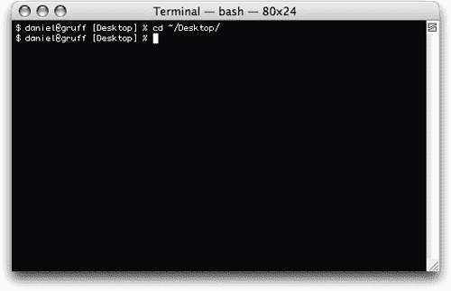
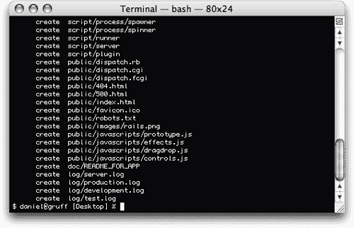
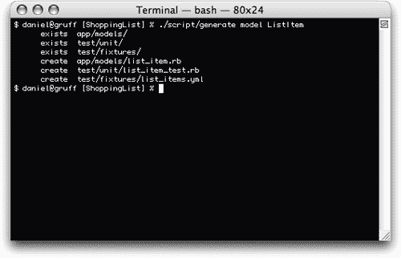
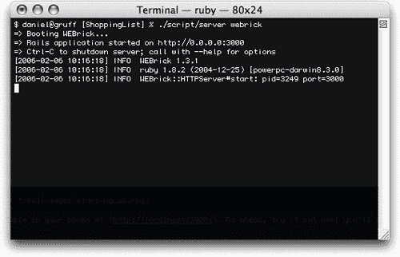
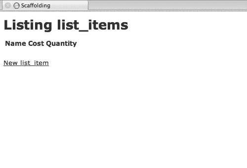
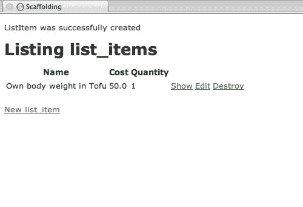
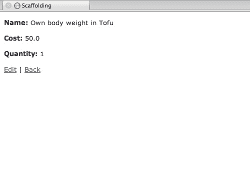
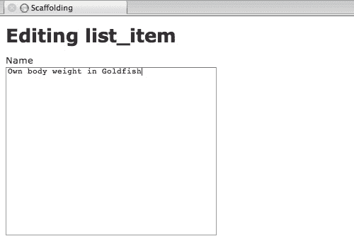
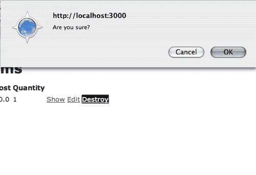
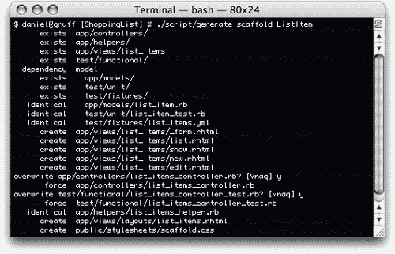

# 使用 Ruby on Rails 步入正轨

> 原文：<https://www.sitepoint.com/ruby-on-rails/>

**红宝石？Rails？Ajax？这一串令人困惑的流行语是不是像一群愤怒的蜜蜂一样在你的脑海中蜂拥而至？那么不要害怕，温柔的学徒——绝地的帮助就在眼前！因为我也曾经像你一样:困惑，在阴影中跳跃，陷入另一个定制 Python web 框架的深处，同时在一堆折角的 PHP 书籍后面轻声哭泣。但现在不是了。今天，我用 Ruby on Rails 构建我的应用程序。**

##### 摩擦铁轨

那么这个 Ruby on Rails 到底是什么呢？我们说的是男人和战斗猫…嗯，差不多。Ruby on Rails 结合了两个独立的元素——面向对象的脚本语言 Ruby 和基于 Ruby 构建的流行 web 框架 Rails——形成了一个强大的新整体。

##### 露比？

Ruby 是一种解释型脚本语言，就像 Python 和 PHP 一样。你写的、破解的和发誓的代码在处理过程中会被转换成机器代码。发明于日本(海！)，面向对象语言在构建基于 web 的应用程序和有用的脚本实用程序方面变得越来越流行。

OOP 做对了就是好事(TM)，Ruby 钉死了。这种语言基本上是面向对象的:在 Ruby 中，*一切*都是对象。

这里有一个小小的 Ruby 示例代码，可以吊起你的胃口:

```
 class MyClass 

  def initialize 

    @message = "My name is I.P. Freelyn" 

  end 

  def be_witty 

    print @message 

  end 

end 

my_joke = MyClass.new 

my_joke.be_witty
```

正如你所看到的，Ruby 用换行符而不是分号来结束代码。说真的，伙计，冒号是 90 年代的！上面的代码片段介绍了一整套 Ruby 语法:我们正在创建一个新的类(`MyClass`)并定义两个方法，`initialize`，它在对象创建时被自动调用，以及`be_witty`，它打印(到标准输出)@message 的值——这是童年恶作剧电话的经典。

Ruby 中的变量可以使用不同的前缀，这取决于您想在哪里使用它们:

*   `@@variable`是一个类变量，可用于该特定类的每个实例
*   `@variable`是一个实例变量，只对类的一个特定实例可用
*   `variable`是一个局部变量，只在创建和使用它的上下文中可用

要使用我们的类，我们必须首先*实例化*它。我们用`MyClass.new`语句来做这件事。因此，`my_joke`现在是`MyClass`的一个实例，我们可以使用新孵化的对象来调用我们在这个有趣的类中嵌入的任何方法。

你能猜到接下来会发生什么吗？当然，欢乐随之而来！有魅力的异性对我们赞不绝口！

从这个简单的概述中，我们一起成长并了解到:

*   Ruby 中的类是由关键字`class`定义的，带有一个 CamelCase 的名字
*   方法以`def`开始，以`end`关键字结束
*   类也是使用一个`end`关键字完成的
*   按照惯例(尽管这不是强制的)，方法名由下划线分隔单词
*   用`[class name].new`方法创建一个类的实例
*   作者需要成长

##### Rails？

那么，Rails 在这幅图中处于什么位置呢？为什么您要对此表示不满呢？

你应该在乎，因为没有 Rails，Ruby 什么都不是！没有战斗猫的人是什么？没有轮子的发动机是什么？如果说 Ruby 是引擎，Rails 就是身体和轮子——一个增强的 web 框架亲切地围绕着一个注入了燃料的核心宝石。你不需要我来告诉你，一个好的 web 框架可以让你的 Web 2.0 应用程序的 1.0 版本和一堆热气腾腾的 vapourware 之间产生很大的差异。事实上，Rails 本身源自前者:一个由 37 Signals 开发的名为 Basecamp 的小应用程序。

好了，现在你知道它是从哪里来的了，但是它实际上是做什么的呢？官方的[轨道描述](http://www.rubyonrails.org)写道:

<q>Rails 是一个按照模型-视图-控制模式开发数据库后台 web 应用的全栈框架，从视图中的 Ajax，到控制器中的请求和响应，再到包装数据库的域模型，Rails 给你一个纯 Ruby 的开发环境。要上线，你只需要添加一个数据库和一个网络服务器。</q>

“等一下，”我听到你哭了。“模型-视图-控制器？领域模型？我的皮疹越来越严重了！救命啊！”。冷静点。深呼吸几次，再喝一大口那种酒，因为我们会一起度过难关。我们是一个团队。

模型-视图-控制器(或 MVC)是一种简洁的、经过反复测试的设计方法。一个模型代表一个特定的对象(比如一张图片、一个人、一个文件夹或克劳迪雅·榭芙尔)，一个视图是给定模型的某种输出，一个控制器通过充当一个中介将前两者联系在一起。

在 Rails 中，模型和控制器是 Ruby 类，视图通常是 XHTML 文件。Rails 通过 web 服务器的调度程序运行。控制器获取请求的 URL(比如说，`/list/1`)并将它们转换成方法调用:`Controller.list(1)`。

至于提到“包装数据库的领域模型”，这两者都不涉及。com 或 Marshall Mathers(总之，在撰写本文时)。Rails 具有神奇的数据库对象建模能力，可以将表链接到模型，并允许您操作表内容，而无需编写一点 SQL。

##### 装置

让我们继续下去，让这个野兽安装。

在各种平台上，Ruby 和 Rails 都有许多安装选项。Windows 用户最好去看看 Instant Rails。

对于 OS X，我推荐[机车](http://locomotive.raaum.org/home/show/HomePage)。对于您这些 nix 和 BSD 的铁杆用户来说，我相信您对 rpm 和端口足够了解，可以让您自己启动并运行起来。

如果您已经决定使用 Instant Rails，或者您正在手动安装，您还需要掌握 SQLite 数据库(火车头为您提供了这个)。预编译的二进制文件可以从[下载](http://www.sqlite.org/download.html)——确保你得到的是版本 3。您还需要 SQLite 3 的 Ruby 绑定。如果你被卡住了，一定要查看官方 Rails wiki 上的[安装说明](http://wiki.rubyonrails.org/rails/pages/HowtosInstallation)。

告诉你 Ruby on Rails 是怎么回事是一回事，但真正向你展示是另一回事。既然你已经安装了 Ruby 和 Rails，为什么我们不深入其中，为自己构建一个实用的应用程序呢？

##### 边做边学

购物清单——编程真的没有比这更重要或更有用的了！还记得那个迷人的异性吗，那个之前听了我们的笑话开怀大笑的人？想象一下，如果我们邀请那个人回家吃饭，却忘了买吃饭必需的食品杂货！

为了防止这种灾难，我们将建立一个简单的小购物清单——没有什么太多的花里胡哨的东西，但希望它足以让你了解 Rails 中的东西是如何组合在一起的，并确保你做一顿非常美味的晚餐。

让我们首先打开一个终端窗口，进入您选择的目录。确切的位置并不重要，只要你记得它在哪里。我，我将在我的桌面上工作:



现在好戏开始了！键入:

```
>  rails ShoppingList
```

如果一切按计划进行，您将看到一串文本飞过，然后被扔回到您的提示符下——Rails 的魔力正在发生！如果这个*没有*起作用，你可能会想踢我的脸，再次检查安装说明。



刚刚发生了什么？`rails`命令创建了我们应用程序的框架:我们现在有一个名为`ShoppingList`(以下简称`SL`)的文件夹，其中包含 Rails 需要运行的所有子文件夹。我们将在本文中处理的最重要的问题是:

*   特定于我们的应用的模型、视图和控制器将存在于此
*   我们将把我们的数据库存储在这里
*   `config`–我们的数据库和环境设置
*   `public`–通过网络浏览器可见的文件–我们的样式表、Javascript 文件等。住在这里
*   `script`–让我们的 Rails 生活更轻松的便捷工具

让我们忙起来。

***型号***

因为我们正在构建一个购物列表，所以我们需要某种模型来表示列表中的各个项目。姑且称之为`List Item`。为了使这个模型有用，它需要一些数据，所以让我们继续假设这些项目中的每一个都有自己的 id、名称、成本和数量。在伪代码中，可能是这样的:

```
model ListItem 

  id (integer) 

  name (string) 

  cost (float) 

  quantity (integer)
```

酷毙了。现在让我们开始构建模型吧！确保您仍在 SL 中，键入:

```
>  ./script/generate model ListItem
```

`generate`脚本是一种很好的工具，您将在 Rails 编码中大量使用它。它创建模型、控制器和任何你告诉它的东西，*和*你可以下载并安装新的发电机来扩展它。我个人还在等它给我冲咖啡。在上面的命令中，我们已经指示它为我们名为 ListItem 的模型构建所有必需的文件和文件夹(又是那个 CamelCase):



打开`app/models/`文件夹中的`list_item.rb`文件——这是我们模型的类文件——您会看到脚本已经构建了必要的框架代码来使事情正常运行:

```
 class ListItem < ActiveRecord::Base 

end
```

这个类定义看起来和我们的第一个例子有些不同，不是吗？那是因为`ListItem`是另一个类的*子类*。子类由“<”字符标识。我们的父类是`ActiveRecord::Base`，`ListItem`继承了`ActiveReacord::Base`能做的一切。还记得我说过 Rails 具有神奇的数据库建模能力吗？

这种力量是活跃的记录。

**数据库**

当然，这只是我们模型的代码部分。它神秘的下腹部呢？是时候打开它，建立我们的数据库了！因为我们已经讨论了一系列潜在的令人困惑的话题，所以我选择使用轻量级和简单的 SQLite 来开发这个 lil' app。

在您的终端窗口中，移动到 SL 中的“db”文件夹并键入:

```
>  sqlite3 storage.db
```

我们刚刚打开了一个 SQLite 控制台，并创建了一个名为`storage.db`的空白数据库文件。让我们继续，通过将我们的伪代码转换成真正的 SQL 肉汁，用热的、多汁的表动作填充它。在控制台中，输入以下内容:

```
>  create table list_items (id integer primary key, name text, cost float, quantity integer);
```

我们现在有了一个可供 ActiveRecord 使用的表。您会注意到我把表的名称变成了复数。ActiveRecord 通过将类名与表名进行比较，将模型与其表联系起来；因此，我们的类`ListItem`变成了我们的表`list_items`(复数，小写，下划线分隔)。当然，如果您愿意，您可以更改这个名称。例如，如果您正在将一个遗留应用程序迁移到 Rails，并且已经有了一个填充的数据库，那么您可能需要这样做。

要退出 SQLite 控制台，请键入:

```
>  .quit
```

我们现在已经建立了一个快乐的小数据库，并为它提供了一个全新的表。但是为了让它有用，我们需要让 Rails 知道它的细节。使用你最喜欢的文本编辑器，在 SL 中打开`config`文件夹中的`database.yml`文件。删除所有现有的示例文本，并替换为以下内容:

```
development: 

  adapter: sqlite3 

  database: db/storage.db 

test: 

  adapter: sqlite3 

  database: db/storage-test.db 

production: 

  adapter: sqlite3 

  database: db/storage.db
```

Rails 以三种不同的模式工作:开发、测试和生产。各种设置针对每种特定模式进行了优化。我们现在只关注第一个和最后一个——测试是一篇全新的文章。

***控制器***

让我们继续，通过创建一个控制器和构建视图来完成 MVC 三角形，以通过 web 呈现`ListItem`模型。我们再一次求助于我们信赖的马，即`generate`脚本。确保您仍在主 SL 文件夹中，键入:

```
>  ./script/generate controller ListItems
```

与 ListItem 模型一样，这将创建所有必要的文件和文件夹，以使我们的新控制器变得生动:


在`app/controllers`中打开新的`list_items_controller.rb`文件，您会看到另一个框架类:

```
class ListItemsController < ApplicationController 

end
```

在这个特殊的例子中，我们的`ListItemsController`(以及我们创建的任何其他控制器)是`ApplicationController`的子类，它是 Rails 在构建我们的应用程序框架时创建的。打开`application.rb`文件，你会看到:

```
class ApplicationController < ActionController::Base 

end
```

与我们模型的`ActionRecord::Base`类一样，`ActionController::Base`是神奇发生的地方。基本控制器处理从 URL 到控制器方法的所有转换。默认情况下，控制器的名称将决定 Rails 应用程序将要使用的 URL。因为我们的控制器叫做`ListItemsController`，我们将能够通过`/list_items/`与它自动交互。

因此，如果我们有一个名为`create_boring_rails_article`的方法，点击`/list_items/create_boring_rails_article/`就可以了。

在我们充实控制器和构建视图之前，让我们利用 Rails 的另一个内置特性，即脚手架。Scaffolding 可以动态地自动生成所有的 CRUD 方法——我们需要用这些方法来玩我们的模型。

我们要编辑我们的控制器，所以再次打开`list_items_controller.rb`文件并修改该类，如下所示:

`class ListItemsController < ApplicationController
 scaffold :list_item
end`

scaffold 命令告诉 Rails 我们想要在这个控制器中为`list_item`模型启用脚手架。

但是等等，为什么在`list_item`前面有一个冒号？因为它是一个 Ruby *符号*，一个用于引用其他对象的对象，不管上下文如何。在 Ruby 和 Rails 中你会看到很多这样的例子。

***在铁轨上运行***

渴望看到脚手架在行动？我也是！在您的终端窗口中，进入 SL 并键入:

```
>  ./script/server webrick
```

这指示 Rails 启动 WEBrick(一个轻量级 Ruby web 服务器)并启动我们的 ShoppingList 应用程序(尖叫！):



我们的应用程序现在正在运行！您可以在包装盒上找到它，网址是:

```
<http://localhost:3000/>
```

不相信我？现在就开始尝试吧。您将看到一个默认的欢迎页面，我们稍后将更改该页面。

**CRUD: C 被创建**

我们来看看这个所谓的垃圾，好吗？现在还不要准备洗手不干！请访问:

```
<http://localhost:3000/list_items/>
```

您将看到这样一个页面:



点击`New list_item`链接。Rails 根据我们之前创建的表为您生成了下面的表单。很酷吧。填好表格！在你的购物清单上添加一些东西！我也会这么做。



看到了吗？创造东西很容易。

**CRUD: R 用于检索**

您刚刚创建的对象现在位于 SQLite 中，我们甚至不用动一根手指头！想要证据吗？回到 SQLite 控制台，输入:

```
>  select * from list_items
```

我们的小数据库被神奇地填充了！

你会在我们新创建的项目旁边看到一堆链接— `Show`、`Edit`和`Destroy`。继续，点击`Show`:你知道你想！



Rails 从我们的数据库中提取信息并显示给我们——这就是我所说的检索！

**CRUD: U 用于更新**

现在，点击页面底部的`Edit`链接，修改项目中的一些值:



完成后点击`Update`，是的，正如你所料，瞧！工作中的即时数据库更新！

对可能性感到兴奋？你应该害怕！

**CRUD: D 代表删除、破坏、剥夺生命，目的地:死亡之城**

现在我们到了最难的部分——放手。我们将毫不犹豫地取消清单上的项目。不，不，不要哭！这是最好的，真的。我还能如何演示删除？

忍住眼泪，点击主`list_items`页面上的`Destroy`链接。因为 Rails 非常有礼貌，所以首先会提示您确认您的选择。去吧，做吧。相信我，这是值得的。



布雅！就这样，你的物品从地球上消失了。如果您想要证据，请返回并在 SQLite 中运行`select * from list_items`查询。

***沿着铁轨移动***

所以你对 CRUD 有一些概念，以及它是如何通过你的浏览器工作的。但是让它运行的实际代码呢？让我们通过构建我们自己的脚手架和视图来进一步发展我们的关系，而不是让 Rails 为我们生成这些！在主 SL 文件夹中，键入:

```
>  ./script/generate scaffold ListItem
```

当询问时，点击“Y”(是)覆盖我们现有的文件:



我们刚刚要求`generate`脚本用执行 CRUD 操作所需的方法来充实我们的控制器，以及显示这些方法的视图。如果你再次打开`list_items_controller.rb`,你会发现它已经塞满了耐嚼的红宝石。我们的控制器中现在有八种新方法:

2.  指数

4.  目录

6.  显示

8.  新的

10.  创造

12.  编辑

14.  更新

16.  破坏

让我们快速浏览一下这些内容:

**索引**

该方法只是调用`list`方法，并请求`list`视图被*渲染*。

Rails 中的所有视图都是显式(通常在 web 浏览器中显示)或自动“呈现”的。如果您没有指定要呈现的方法，并且您的方法没有重定向到另一个 URL，Rails 将尝试查找与当前方法同名的文件。它在以控制器命名的`app/views`文件夹中寻找以`rhtml`或`rxml`结尾的文件。

因此，如果 index 方法没有呈现`list`视图，Rails 会在`app/views/list_items/`中寻找一个名为`index.rhtml`或`index.rxml`的文件。

**列表**

这里有一个看起来很怪异的方法！我们调用 paginate 方法，该方法接受一个模型的名称和一系列可选设置，并分割结果，以便您可以轻松地跨多个页面查看长列表。在这种情况下，我们要求该方法将所有的`list_items`分成每页最多十个条目的页面。注意，方法调用的结果不是传递给一个，而是传递给两个变量？

这是因为 paginate 方法返回一个数组对象——Ruby 中许多内置对象中的一个——并且 Ruby 允许我们以内联方式分配结果。因此，我们的第一个实例变量(`@list_item_pages`)被赋予结果数组中第一项的值，而我们的`@list_items`变量被赋予第二项的值。

得心应手！

我们没有使用“return”key world，因为在 Ruby 中，它们是可选的——默认情况下，Ruby 只会返回方法中的最后一条语句。您还会看到，我们没有请求渲染视图。记住，Rails 将寻找一个`list.rhtml`或`list.rxml`文件，如上所述。

**显示**

现在我们开始使用 ActiveRecord 和 ListItem 模型。ActiveRecord 的众多方法之一就是`find`。

向它传递一个 ID 或一组 SQL 条件，它将分割回一个单独的`ListItem`(如果只找到一个的话)或一组`ListItem`(如果一整组都符合您的标准的话)。这里，我们要求它检查通过 params 散列传入的特定 ID。

Ruby 中的 Hash 就像其他语言中的字典。您为特定的键设置一个值，每个键需要是唯一的。在这里，每当有请求进来时，Rails 的调度程序就会填充 params 散列。如果我们要查看`/list_items/show/1`，默认情况下，参数将包含有用的信息，如:

```
action: show  

id: "1"  

controller: list_items
```

同样，没有指定视图，所以 Rails 将使用位于`app/views/list_items/`中的`show.rhtml`文件。

**新**

这个非常简单——它创建一个新的 ListItem 对象并返回它。然而，它*在数据库中不存在。在保存或更新 ActiveRecord 对象之前，它只是漂浮在空中的一股逻辑。*

**创建**

对此有什么猜测吗？你说，创造一个物体？正确——吃块饼干。如果你认为这就是`new`的目的，那你就对了:的确如此。像`new`方法一样，我们用`ListItem new`创建一个对象，我们在这里通过传入新朋友发送的值(params hash)来创建一个对象。这用任何匹配属于我们类的值来预填充对象。当我们调用这个方法时，如果您偷看一下 params 内部，您会看到类似下面的内容:

```
name: Giant slab of Tofu  

cost: 25  

quantity: 10
```

你知道我们的模型有这个，因为你和我一起建造了它。

在这里你可以看到，这一次，我们实际上调用了 save 方法，这个方法*将我们的新对象提交到数据库中。如果我们成功了，我们会将其记录到闪存值中，并重定向到一个操作。*

闪光？！别紧张，我不是说。SWF 文件。Rails 中的“flash”是向查看者显示一次性消息的一种方式。在这种情况下，我们让他们知道保存是否有效。如果它*做了*，我们告诉 Rails 重定向到我们的`list`方法，它就像我们自己做的一样调用它。

如果没有，因为数据库突然吃了自己或矩阵中的一个小故障设置你的硬盘随机核爆几个扇区，那么我们只需渲染`new`动作，假装我们吃了蓝色药丸，什么也没发生。

**编辑**

虽然本质上它们是相同的，但是`edit`和`show`方法呈现不同的视图，这意味着即使使用相同的代码，最终也会得到非常不同的结果。

**更新**

这个方法与 save 方法几乎相同，只是它调用了`update_attributes`方法来代替`save`来用新值更新数据库中的现有项目(或者如果特定项目实际上不存在，则创建一个新项目——Rails 就是这样智能的)。

**摧毁**

杀，杀，杀。找到请求的项目，将其从数据库中删除，并重定向回`list`视图。

说够了，真的。

***观点***

那么，我一直提到的这些观点怎么样？嗯，我正要说到这一点。Rails 围绕布局、局部和各种杂物的概念工作，以构成 MVC 中的 V。把布局想象成一个骨架，你把你的应用程序的肉注入其中——如果你熟悉围绕你生成的内容的页眉和页脚模板的概念，你就在正确的轨道上。

打开`app/views/layouts/`中的`list_items.rhtml`文件:

```
<html>  

  <head>  

   <title>ListItems: <%= controller.action_name %></title>  

   <%= stylesheet_link_tag 'scaffold' %>  

  </head>  

  <body>  

   <p style="color: green"><%= flash[:notice] %></p>  

   <%= @content_for_layout %>  

  </body>  

</html>
```

看起来像普通的 HTML 加上一些奇怪的额外内容，对吗？正是如此！这种东西被称为 ERB——嵌入式 Ruby。如果你曾经使用过 PHP，你会有宾至如归的感觉。

ERB 允许你在你的`.rhtml` (Ruby HTML)文件中任何你喜欢的地方粘贴 Ruby 代码块。我们需要关注两种类型的 ERB 标签:

1.  `<%= ... %>`–放在这些标签之间的任何代码的结果(注意等号)都将输出到页面。
2.  `<% ... %>`–这些标签内发生的事情*留在这些标签内*。

因此,`<%= controller.action_name %>`行将给出控制器正在处理的当前动作的名称。如果你把它放在`<% %>`标签中，什么都不会出现。注意这个`<%= flash[:notice] %>`的称呼吗？啊，你说点头。现在一切都水落石出了！

而这个标记骨架里的肉呢？填充空白，附上我们要求渲染的任何内容。

##### 现在怎么办？

为什么不使用 Rails 中默认的脚手架，而不是拥有自己的方法和视图文件呢？

因为搭建只是 Rails 框架的一小部分——是一个强大的部分，但仍然相对较小。还有很多等待你去探索！

既然你现在有了自己的`.rhtml`文件，你可以自由地将你的个人风格融入到这个应用程序中。然而，考虑到这篇文章的长度，我就不告诉你更多令人尴尬的趣闻了，让你来做决定。到目前为止，您应该已经有了足够的想法，可以坐下来，阅读 Rails API 文档，并开始开发自己的小型 web 应用程序。

感谢您的参与！你们是很棒的观众。

## 分享这篇文章