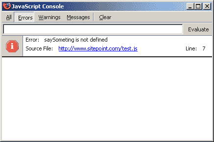
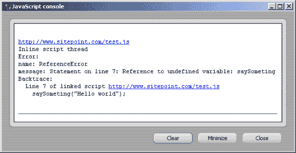
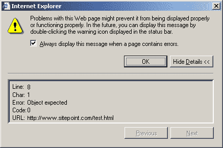
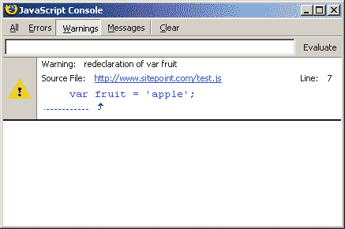
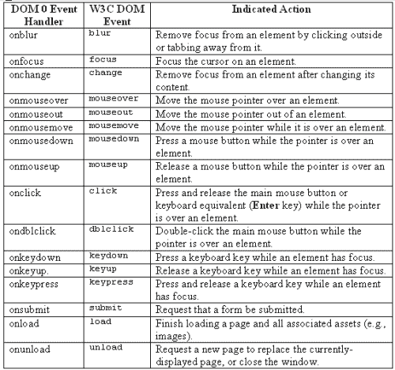
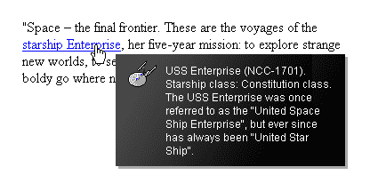
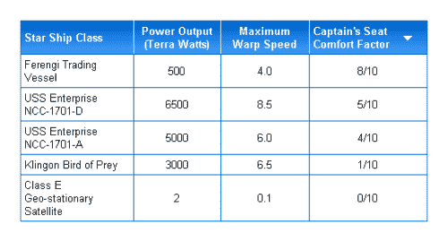
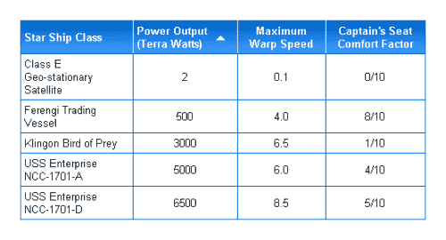

# 更智能的脚本:从头开始编写高质量的 JavaScript

> 原文：<https://www.sitepoint.com/javascript-from-scratch/>

JavaScript 是一种非常有用的语言，提供了许多独特的好处。稍微考虑一下脚本功能是如何退化的，你就可以使用 JavaScript 为你的网站带来一系列功能、设计和可用性的改进。

这篇文章实际上是摘自 SitePoint 的新标题，[*《JavaScript 选集:101 个基本技巧、窍门&黑客*。这里包括的四个章节包括:](https://www.sitepoint.com/books/jsant1/)

*   对 JavaScript 的全面介绍，包括基本技术、调试等等
*   在 JavaScript 编程中利用文档对象模型的方式
*   使用框架的实用性，包括使用弹出窗口、框架间通信和获得滚动位置的技术
*   对基本 DHTML 的介绍，包括事件处理、光标检测、查找元素的大小和位置等等

如果你想离线阅读这本入门书，你可以[下载 PDF 格式的章节](https://www.sitepoint.com/show-modal-popup-after-time-delay/)。

但是现在，让我们从 JavaScript 的介绍开始，探索它的用途，以及我们如何使用它。

##### JavaScript 已定义

JavaScript 是一种脚本语言，用于为网页和应用程序添加交互性和动态行为。JavaScript 可以与网页的其他组件(如 HTML 和 CSS)进行交互，使它们实时变化，或者对用户事件做出响应。

毫无疑问，你会在网页的源代码中看到 JavaScript。它可能是 HTML 元素中的内联代码，如下所示:

```
<a href="page.html" onclick="open('page.html'); return false;">
```

它可能作为链接到另一个文件的脚本元素出现:

```
<script type="text/javascript" src="myscript.js"></script>
```

或者它里面直接有代码:

```
<script type="text/javascript"> 

function saySomething(message) 

{ 

  alert(message); 

} 

saySomething('Hello world!'); 

</script>
```

先不要担心这些片段之间的区别。我们可以通过多种方式将 JavaScript 添加到网页中，这些方式有好有坏。我们将在本章的后面详细讨论这些方法。

JavaScript 由 Netscape 开发，并在 Netscape 2 中实现，尽管它最初被称为 LiveScript。另一种语言 Java 越来越流行，促使 Netscape 更改名称，试图利用这种连接，因为 JavaScript 提供了浏览器和 Java applet 之间的通信能力。

但是，随着这种语言由 Netscape 以其原始形式和微软以类似但不同的 JScript 实现形式开发出来，很明显 web 脚本太重要了，不能让供应商竞争。因此，在 1996 年，开发工作移交给了一个名为 ECMA 的国际标准机构，JavaScript 成为了 ECMAScript 或 ECMA-262。

大多数人仍然称它为 JavaScript，这可能会引起混淆:除了名称和语法上的相似性，Java 和 JavaScript 没有任何相似之处。

##### JavaScript 的局限性

JavaScript 最常用作客户端语言，在这种情况下,“客户端”是指最终用户的 web 浏览器，JavaScript 在其中被解释和运行。这使它区别于 PHP 和 ASP 等服务器端语言，后者运行在服务器上，向客户端发送静态数据。

由于 JavaScript 无法访问服务器环境，所以有许多任务虽然在 PHP 中执行时很简单，但却无法用 JavaScript 完成:例如，读写数据库或创建文本文件。但是由于 JavaScript 可以访问客户端环境，所以它可以根据服务器端语言所没有的数据做出决定，比如鼠标的位置，或者元素的呈现大小。

***ActiveX 呢？***

如果你已经非常熟悉微软的 JScript，你可能会想“但是 JavaScript 可以使用 ActiveX 做这些事情”，这是真的——但是 ActiveX 不是 ECMAScript 的一部分。ActiveX 是一种特定于 Windows 的机制，允许 Internet Explorer 访问 COM(Windows 脚本技术核心的组件对象模型),通常只在可信环境中运行，如 intranet。我们会遇到一些特殊的例外情况，例如在 IE 中运行的没有特殊安全性的 ActiveX 控件(如 Flash 插件和 XMLHttpRequest)，但在很大程度上，使用 ActiveX 编写脚本超出了本书的范围。

通常，运行客户端的计算机不会像服务器那样强大，因此 JavaScript 不是进行大量数据处理的最佳工具。但是客户端上数据处理的即时性使得这个选项对于少量处理很有吸引力，因为可以立即收到响应；例如，表单验证是客户端处理的一个很好的选择。

但是比较服务器端和客户端语言，看哪一个“更好”是被误导的。两者都不好——它们是不同工作的工具，它们之间的功能交叉很小。然而，客户端和服务器端脚本之间的交互日益增加，这导致了新一代 web 脚本的出现，它使用 XMLHttpRequest 等技术来请求服务器数据、运行服务器端脚本，然后在客户端管理结果。我们将在第 18 章《用 JavaScript 构建 Web 应用程序》中深入探讨这些技术。

***安全限制***

由于 JavaScript 在高度敏感的数据和程序领域运行，它的功能受到了限制，以确保它不会被恶意使用。因此，有许多事情是 JavaScript 根本不允许做的。例如，它不能从您的计算机中读取大多数系统设置，不能直接与您的硬件交互，也不能使程序运行。

此外，由于特定元素的属性，一些通常允许特定元素进行的特定交互在 JavaScript 中是不允许的。例如，更改表单`<input>`
的值通常没有问题，但是如果它是一个文件输入字段(例如`<input type="file">`)，则根本不允许写入它——这是一种限制，可以防止恶意脚本让用户上传他们没有选择的文件。

类似的安全限制有很多例子，我们将在本书涉及的应用程序中展开讨论。总之，这里列出了 JavaScript 的主要局限和安全限制，包括我们已经看到的。JavaScript 不能:

*   直接打开和读取文件(除了在特定情况下，详见第 18 章，用 JavaScript 构建 Web 应用)。
*   在用户的计算机上创建或编辑文件(cookie 除外，这将在第 8 章“使用 cookie”中讨论)。
*   读取 HTTP POST 数据。
*   从用户计算机中读取系统设置，或任何其他无法通过语言或宿主对象(宿主对象是像`window`和`screen`这样的东西，它们是由环境而不是语言本身提供的)获得的数据。)
*   修改文件输入字段的值。
*   改变从不同域加载的文档的显示。
*   关闭或修改不是由脚本打开的窗口(即主浏览器窗口)的工具栏和其他元素。

最终，JavaScript 可能根本不被支持。

同样值得记住的是，许多浏览器包含了比简单地启用或禁用 JavaScript 更精确的选项。例如，Opera 包含了禁止脚本关闭窗口、移动窗口、写入状态栏、接收右键单击的选项……不胜枚举。在这个问题上，你能做的很少，但大多数情况下，你不需要这么做？这种选项已经发展到抑制“烦人的”脚本(状态栏滚动条，非右键单击脚本等)。)所以如果你远离这些类型的脚本，这个问题很少会出现。

##### JavaScript 最佳实践

JavaScript 最佳实践非常强调这样一个问题:对于那些浏览器不支持脚本、关闭了脚本或者由于其他原因(例如，用户使用了不支持脚本的辅助技术)而无法与脚本交互的人，您应该做些什么。

最后一个问题是最难解决的，我们将在《第 16 章，JavaScript 和可访问性》中重点讨论这个问题的解决方案。在这一节中，我想看看优秀 JavaScript 的三个核心原则:

*   渐进增强——为没有 JavaScript 的用户提供
*   不引人注目的脚本——将内容与行为分开
*   一致的编码实践——使用括号和分号结束符

第一个原则确保我们在网站上使用脚本时，考虑的是大局。第二点使我们这边的维护更容易，对用户来说更好的可用性和*优雅的降级*。(适度降级意味着如果 JavaScript 不被支持，浏览器可以自然地依靠或者“降级”到非脚本功能。)第三个原则使代码更容易阅读和维护。

##### 为没有 JavaScript 的用户提供(渐进式增强)

用户可能没有 JavaScript 有几个原因:

*   他们使用的设备根本不支持脚本，或者以有限的方式支持脚本。
*   它们位于过滤 JavaScript 的代理服务器或防火墙之后。
*   他们有意关闭了 JavaScript。

第一点涵盖了数量惊人且不断增长的设备，包括 PDA 等小屏幕设备，WebTV 和索尼 PSP 等中屏幕设备，以及 Opera 5 和 Netscape 4 等传统 JavaScript 浏览器。

上面列表中的最后一点可以说是最不可能的(除了其他开发者唱反调！)，但是原因并不那么重要:一些用户根本没有 JavaScript，我们应该适应他们。没有办法量化属于这一类别的用户数量，因为从服务器检测 JavaScript 支持是出了名的不可靠，但我看到的数字表明关闭 JavaScript 的用户比例在 5%到 20%之间，这取决于你是否将搜索引擎机器人描述为“用户”。

***解***

解决这个问题的长期方法是使用 HTML noscript 元素，其内容由完全不支持 script 元素的浏览器以及支持它但关闭了脚本的浏览器呈现。

虽然这是一个好主意，但在实践中，随着时间的推移，这种解决方案已经变得不那么有用了，因为 noscript 不能根据功能进行区分。提供有限 JavaScript 支持的浏览器不能运行复杂的脚本，但是这种设备是支持脚本的浏览器，所以它们也不能解析 noscript 元素。这些浏览器最终将一无所获。

解决这个问题的更好方法是从静态 HTML 开始，然后使用脚本在静态内容中修改或添加动态行为。

让我们看一个简单的例子。制作 DHTML 菜单的首选技术是使用无序列表作为主菜单结构。我们将用整个第 15 章，DHTML 菜单和导航来讨论这个主题，但是这个简短的例子说明了这一点:

```
<ul id="menu"> 

  <li><a href="/">Home</a></li> 

  <li><a href="/about/">About</a></li> 

  <li><a href="/contact/">Contact</a></li> 

</ul> 

<script type="text/javascript" src="menu.js"></script>
```

链接列表是普通的 HTML，所以它对所有用户都存在，不管他们是否启用了脚本。如果支持脚本，我们的`menu.js`脚本可以应用动态行为，但是如果不支持脚本，内容仍然会出现。我们并没有明确区分不同的设备——我们只是提供了一些内容，如果浏览器能够处理，那么这些内容就是动态的，如果不能处理，那么这些内容就是静态的。

##### 讨论

这种场景的“传统”方法是用纯 JavaScript 生成一个单独的动态菜单，并在一个`noscript`元素中包含静态内容:

```
<script type="text/javascript" src="menu.js"></script> 

<noscript> 

  <ul> 

    <li><a href="/">Home</a></li> 

    <li><a href="/about/">About</a></li> 

    <li><a href="/contact/">Contact</a></li> 

  </ul> 

</noscript>
```

但是，正如我们已经看到的，大量的设备将会落入这个网中，因为 JavaScript 支持不再是一个全有或全无的命题。上述方法向所有设备提供默认内容，并且仅当脚本功能有效时才应用脚本功能。

这种脚本方法通常被称为*渐进增强*，这是我们将在本书中使用的一种方法。

*别问了！*

这种技术和 noscript 元素都不应该用来添加这样的消息:“请打开 JavaScript 继续。”充其量，这样的信息是放肆的(“我为什么要？”);在最坏的情况下，这可能是无益的(“我不能！”)或者无意义(“JavaScript 是什么？”).就像那些写着“请升级你的浏览器”的启动页面一样，这些信息对普通网络用户来说就像路标写着“请使用不同的汽车”一样有用。

有时，您可能会遇到这样的情况，没有 JavaScript 就无法提供等效的功能。在这种情况下，我认为可以用静态消息通知用户这种不兼容性(当然是用非技术术语)。但是，在大多数情况下，尽量避免提供这种信息，除非这是唯一的方法。

##### 将内容与行为分离(不引人注目的脚本)

将内容和行为分开意味着将网页结构的不同方面分开。Jeffrey Zeldman 将此称为 web 开发的“三条腿的凳子”。New Riders，2003)——由内容(HTML)、表示(CSS)和行为(JavaScript)组成——不仅强调每个方面的功能差异，还强调它们应该相互分离的事实。

良好的分离使得网站更容易维护，更容易访问，并且在旧的或低规格的浏览器中降级。

***解***

在一个极端，这与将内容和行为分离开来的想法正好相反，我们可以直接在属性事件处理程序中编写内联代码。这非常麻烦，通常应该避免:

```
<div id="content" 

    onmouseover="this.style.borderColor='red'" 

    onmouseout="this.style.borderColor='black'">
```

我们可以通过将完成工作的代码抽象成一个函数来改善这种情况:

```
<div id="content" 

    onmouseover="changeBorder('red')" 

    onmouseout="changeBorder('black')">
```

定义一个函数来完成我们的工作让我们可以在一个单独的 JavaScript 文件中提供大部分代码:

```
**Example 1.1\. separate-content-behaviors.js (excerpt)** 

function changeBorder(element, to) 

{ 

  element.style.borderColor = to; 

}
```

但是更好的方法是完全避免使用内联事件处理程序。相反，我们可以利用文档对象模型(DOM)将事件处理程序绑定到 HTML 文档中的元素。DOM 是一个标准的编程接口，通过它 JavaScript 等语言可以访问 HTML 文档的内容，从而消除了在 HTML 文档中出现任何 JavaScript 代码的需要。在本例中，我们的 HTML 代码如下所示:

```
<div id="content">
```

下面是我们要使用的脚本:

```
**Example 1.2\. separate-content-behaviors.js** 

function changeBorder(element, to) 

{ 

  element.style.borderColor = to; 

} 

var contentDiv = document.getElementById('content'); 

contentDiv.onmouseover = function() 

{ 

  changeBorder('red'); 

}; 

contentDiv.onmouseout = function() 

{ 

  changeBorder('black'); 

};
```

这种方法允许我们在不编辑 HTML 的情况下添加、删除或更改事件处理程序，而且由于文档本身根本不依赖或引用脚本，不理解 JavaScript 的浏览器不会受到它的影响。这个解决方案还提供了可重用性的好处，因为我们可以根据需要将相同的功能绑定到其他元素，而不必编辑 HTML。

这个解决方案依赖于我们通过 DOM 访问元素的能力，我们将在第 5 章“导航文档对象模型”中深入讨论。

*分离的好处*

通过实践内容和行为的良好分离，我们不仅在平滑退化方面获得了实际利益，而且在分离方面获得了思考的优势。因为我们已经把 HTML 和 JavaScript 分开了，而不是把它们结合起来，所以当我们看 HTML 时，我们不太可能忘记它的核心功能应该是描述页面的内容，独立于任何脚本。

安迪·克拉克提到了网络标准蛋糕，这是一个有用的比喻，蛋糕看起来就像一个好的网站:当你看着碗，你可以看到组成甜点的所有单独的层。与此相反的可能是水果蛋糕:当你看着蛋糕时，你无法说出每种不同的成分是什么。你只能看到一大块蛋糕。

***讨论***

需要注意的是，当您像这样将事件处理程序绑定到一个元素时，在该元素实际存在之前，您不能这样做。如果您将前面的脚本按原样放在页面的 head 部分，它将报告错误并且无法工作，因为在处理脚本时内容 div 尚未呈现。

最直接的解决方案是将代码放在 load 事件处理程序中。它在那里总是安全的，因为 load 事件直到文档完全呈现后才触发:

```
window.onload = function() 

{ 

  var contentDiv = document.getElementById('content'); 

  ... 

};
```

或者更清楚地说，再敲一点字:

```
window.onload = init; 

function init() 

{ 

  var contentDiv = document.getElementById('content'); 

  ... 

}
```

load 事件处理程序的问题是，一个页面上只有一个脚本可以使用它；如果两个或更多脚本试图安装加载事件处理程序，每个脚本将覆盖它之前的处理程序。这个问题的解决方案是以更现代的方式响应加载事件；我们将在“让多个脚本在同一个页面上工作”一节中对此进行简要介绍。

##### 使用大括号和分号(一致的编码实践)

在许多 JavaScript 操作中，大括号和分号是可选的，那么当它们不是必需的时候，包含它们还有价值吗？

***解***

尽管大括号和分号通常是可选的，但您应该始终包含它们。这使得代码更容易阅读——无论是他人还是您自己——并帮助您避免在脚本中重用和重新组织代码时出现问题(这通常会使可选的分号变得必不可少)。

例如，这段代码完全有效:

```
**Example 1.3\. semicolons-braces.js (excerpt)** 

if (something) alert('something') 

else alert('nothing')
```

这段代码之所以有效，是因为 JavaScript 解释器中有一个称为分号插入的过程。每当解释器发现由一个或多个换行符分隔的两个代码段，并且这些代码段如果在一行上就没有意义时，解释器会将它们视为它们之间存在分号。通过类似的机制，通常在 if-else 语句中要执行的代码周围的括号可以从语法中推断出来，即使它们不存在。把这个过程想象成解释器为你添加缺失的代码元素。

尽管这些代码元素并不总是必需的，但是如果您坚持使用它们，那么在需要时会更容易记住使用它们，并且更容易阅读生成的代码。

我们上面的例子最好写成这样:

```
**Example 1.4\. semicolons-braces.js (excerpt)** 

if (something) { alert('something'); } 

else { alert('nothing'); }
```

这个版本代表了代码可读性的极致:

```
**Example 1.5\. semicolons-braces.js (excerpt)** 

if (something) 

{ 

  alert('something'); 

} 

else 

{ 

  alert('nothing'); 

}
```

*使用函数文字*

随着您对 JavaScript 语言的复杂性越来越有经验，使用函数文字根据需要创建匿名函数，并将它们分配给 JavaScript 变量和对象属性将变得很常见。在这种情况下，函数定义后面应该有一个分号，用来终止变量赋值:

*T2`var saySomething = function(message)
{
 ...
};`*

##### 向页面添加脚本

在一个脚本开始做令人兴奋的事情之前，你必须把它加载到一个网页中。有两种技术可以做到这一点，其中一种明显优于另一种。

***解***

第一种也是最直接的技术是直接在脚本元素中编写代码，就像我们之前看到的那样:

```
<script type="text/javascript"> 

function saySomething(message) 

{ 

  alert(message); 

} 

saySomething('Hello world!'); 

</script>
```

这种方法的问题在于，在传统的纯文本浏览器中——那些根本不支持脚本元素的浏览器——内容可能被呈现为文字文本。

避免这个问题的一个更好的替代方法是将脚本放在外部 JavaScript 文件中。看起来是这样的:

```
<script type="text/javascript" src="what-is-javascript.js" 

    ></script>
```

这将加载一个名为`what-is-javascript.js`的外部 JavaScript 文件。该文件应该包含您原本要放在脚本元素中的代码，如下所示:

```
**Example 1.6\. what-is-javascript.js** 

function saySomething(message) 

{ 

  alert(message); 

} 

saySomething('Hello world!');
```

当您使用此方法时，不理解 script 元素的浏览器将忽略它并且不呈现任何内容(因为元素是空的)，但是理解它的浏览器将加载并处理脚本。这有助于将脚本和内容分开，并且更容易维护——您可以在多个页面上使用相同的脚本，而不必在多个文档中维护代码的副本。

***讨论***

您可能会质疑不在脚本元素中直接使用代码的建议。“没问题，”你可能会说。"我会在它周围放上 HTML 注释."嗯，我不得不反对:使用 HTML 注释来“隐藏”代码是一个非常糟糕的习惯，我们应该避免陷入其中。

**在代码周围放置 HTML 注释**

验证解析器不需要读取注释，更不用说处理注释了。注释 JavaScript 能够工作的事实是一个时代错误——退回到一种旧的、过时的做法，这种做法对文档做了一个可能不正确的假设:它假设页面被提供给一个非验证的解析器。

本书中的所有示例都是以 HTML(而不是 XHTML)的形式提供的，所以这个假设是合理的，但是如果您使用的是 XHTML(正确地使用 MIME 类型的 application/xhtml+xml ),那么在浏览器处理文档之前，验证 xml 解析器可能会丢弃代码中的注释，在这种情况下，注释脚本将不再有效。为了确保向前兼容性(以及对您自己的编码习惯和单个项目的相关好处)，我强烈建议您避免以这种方式在代码周围添加注释。您的 JavaScript 应该始终保存在外部 JavaScript 文件中。

**`language`属性**

不再需要语言属性。在 Netscape 4 和它同时代的浏览器占主导地位的日子里，`<script>`标签的语言属性具有嗅探上层支持的作用(例如，通过指定`javascript1.3`)，并且影响脚本解释器工作方式的一些小方面。

但是指定 JavaScript 的版本是没有意义的，因为 JavaScript 是 ECMAScript，而语言属性已经被弃用，取而代之的是类型属性。此属性指定包含文件的 MIME 类型，如脚本和样式表，并且是您需要使用的唯一属性:

```
<script type="text/javascript">
```

从技术上讲，该值应该是`text/ecmascript`，但 Internet Explorer 不理解这一点。就我个人而言，如果是这样的话，我会更高兴，只是因为`javascript`是一个我很难输入的单词——我已经数不清有多少次因为我输入了`type="text/javsacript"`而导致脚本失败。

##### 让多个脚本在同一个页面上工作

当多个脚本不能一起工作时，几乎总是因为脚本想要为给定元素上的同一个事件分配事件处理程序。因为每个元素对于每个事件只能有一个处理程序，所以脚本会覆盖彼此的事件处理程序。

***解***

通常怀疑是窗口对象的 load 事件处理程序，因为一个页面上只有一个脚本可以使用这个事件；如果两个或更多的脚本正在使用它，最后一个脚本将覆盖之前的脚本。

我们可以从单个加载处理程序中调用多个函数，如下所示:

```
window.onload = function()  

{  

  firstFunction();  

  secondFunction();  

}
```

但是，如果我们使用这段代码，我们将被束缚在一段代码上，在加载时，我们必须从这段代码中做所有需要做的事情。更好的解决方案是提供一种添加不与其他处理程序冲突的加载事件处理程序的方法。

当调用以下单个函数时，它将允许我们分配任意数量的加载事件处理程序，而不会有任何冲突:

```
**Example 1.7\. add-load-listener.js**  

function addLoadListener(fn)  

{  

  if (typeof window.addEventListener != 'undefined')  

  {  

    window.addEventListener('load', fn, false);  

  }  

  else if (typeof document.addEventListener != 'undefined')  

  {  

    document.addEventListener('load', fn, false);  

  else if (typeof window.attachEvent != 'undefined')  

  {  

    window.attachEvent('onload', fn);  

  }  

  else  

  {  

    var oldfn = window.onload;  

    if (typeof window.onload != 'function')  

    {  

      window.onload = fn;  

    }  

    else  

    {  

      window.onload = function()  

      {  

        oldfn();  

        fn();  

      };  

    }  

  }  

}
```

一旦这个函数就位，我们就可以任意多次使用它:

```
addLoadListener(firstFunction);  

addLoadListener(secondFunction);  

addLoadListener(twentyThirdFunction);
```

你明白了！

***讨论***

JavaScript 包括添加(和删除)事件侦听器的方法，这些方法的操作很像事件处理程序，但是允许多个侦听器订阅一个元素上的单个事件。不幸的是，事件侦听器的语法在 Internet Explorer 中与在其他浏览器中完全不同:IE 使用专有方法，而其他浏览器实现 W3C 标准。我们会经常遇到这种二分法，我们会在《第 13 章，基本动态 HTML》中详细讨论。

W3C 标准方法称为`addEventListener`:

```
window.addEventListener('load', firstFunction, false);
```

IE 方法叫做`attachEvent`:

```
window.attachEvent('onload', firstFunction);
```

正如你所看到的，标准结构采用事件的名称(不带“on”前缀)，后跟事件发生时要调用的函数，以及控制事件冒泡的参数(详见第 13 章，基本动态 HTML)。IE 方法采用事件*处理程序*的名称(包括前缀上的*)，后跟函数的名称。*

为了将这些放在一起，我们需要添加一些测试来检查每个方法的存在，然后再尝试使用它。我们可以使用 JavaScript 操作符`typeof`来实现这一点，它标识不同类型的数据(如`"string"`、`"number"`、`"boolean"`、`"object"`、`"array"`、`"function"`或`"undefined"`)。不存在的方法会返回`"undefined"`。

```
if (typeof window.addEventListener != 'undefined')  

{  

  ... window.addEventListener is supported  

}
```

还有一个额外的复杂性:在 Opera 中，可以触发多个事件监听器的 load 事件来自于文档对象，而不是窗口。但是我们不能只使用 document，因为它在较旧的 Mozilla 浏览器(如 Netscape 6)中不起作用。为了绘制一条穿越这些怪癖的路线，我们需要依次测试`window.addEventListener`，然后是`document.addEventListener`，然后是`window.attachEvent`。

最后，对于不支持任何这些方法的浏览器(实际上是 Mac IE 5)，后备解决方案是将多个旧式事件处理程序链接在一起，以便在事件发生时依次调用它们。我们通过动态构造一个新的事件处理程序来实现这一点，该处理程序在事件发生时调用新分配的处理程序之前调用任何现有的处理程序。(这项技术由西蒙·威廉森首创。)

```
**Example 1.8\. add-load-listener.js (excerpt)**  

var oldfn = window.onload;  

if (typeof window.onload != 'function')  

{  

  window.onload = fn;  

}  

else  

{  

  window.onload = function()  

  {  

    oldfn();  

    fn();  

  };  

}
```

如果你不明白这是如何工作的，不要担心——我们将在《第 13 章，基本动态 HTML》中更详细地探讨这些技术。在那里，我们将了解到事件监听器不仅对 load 事件有用，而且对任何类型的事件驱动脚本都有用。

##### 隐藏 JavaScript 源代码

如果你曾经创造过令你自豪的东西，你会理解保护你的知识产权的渴望。但是网页上的 JavaScript 本质上是一种开源语言；它以源代码的形式出现在浏览器中，所以如果浏览器可以运行它，人们就可以阅读它。

网上有一些应用程序声称提供源代码加密，但实际上，你无法加密另一个编码者在几秒钟内无法解密的源代码。事实上，这些程序中的一些确实会引起问题:它们经常以这样一种方式重新格式化代码，使得它变得更慢、效率更低，或者完全崩溃。我的建议？像躲避瘟疫一样远离他们。

但是，隐藏代码的愿望仍然存在。您可以做一些事情来混淆(如果不是完全加密的话)您的用户可以看到的代码。

***解***

去除了所有注释和不必要的空白的代码很难阅读，正如您所预料的，从这样的代码中提取单独的功能是非常困难的。以这种方式压缩脚本的简单技术可以吓退所有人，但最坚定的黑客除外。例如，以这段代码为例:

```
**Example 1.9\. obfuscate-code.js (excerpt)**  

var oldfn = window.onload;  

if (typeof window.onload != 'function')  

{  

  window.onload = fn;  

}  

else  

{  

  window.onload = function()  

  {  

    oldfn();  

    fn();  

  };  

}
```

我们可以通过删除不必要的空格将代码压缩成下面两行:

```
**Example 1.10\. obfuscate-code.js (excerpt)**  

var oldfn=window.onload;if(typeof window.onload!='function'){  

window.onload=fn;}else{window.onload=function(){oldfn();fn();};}
```

但是，记住那个重要的词——不必要。一些空格是必不可少的，比如`var`和`typeof`后面的单个空格。

***讨论***

除了混淆的好处之外，这种做法还有很多优点。去掉注释和不必要的空白的脚本更小；因此，它们的加载速度更快，处理速度也更快。

但是请记住，代码必须保持使用分号行结束符和大括号的严格格式(正如我们在“使用大括号和分号(一致的编码实践)”一节中所讨论的)；否则，删除换行符会使代码行一起运行，最终导致错误。

在开始压缩之前，请记住制作脚本的副本。我知道这似乎是显而易见的，但是我已经犯了很多次这样的错误，而且因为如此初级而更加令人恼火！这些天我所做的是以完全隔开的和注释的形式编写和维护脚本，然后在它们发布之前通过一堆搜索/替换表达式运行它们。通常我会保留一个脚本的两个副本，分别命名为`myscript.js`和`myscript-commented.js`，或者类似的东西。

我们将在第 20 章《跟上节奏》中回到这个主题，在那里我们将在一系列提高脚本速度和效率的技术中讨论这个问题，同时减少它们所需的物理空间。

##### 调试脚本

调试是发现并(希望)修复 bug 的过程。大多数浏览器都有某种内置的错误报告，一些外部调试器也值得研究。

**了解浏览器内置的错误报告**

Opera、Mozilla 浏览器(如 Firefox)和 Internet Explorer 都内置了不错的错误报告功能，但 Opera 和 Mozilla 的调试工具是最有用的。

*Opera*
从工具>高级> JavaScript 控制台打开 JavaScript 控制台。您也可以设置它在出错时自动打开，方法是转到工具>首选项>高级>内容，然后单击 JavaScript 选项按钮打开其对话框，并选中出错时打开 JavaScript 控制台。

*Firefox 和其他 Mozilla 浏览器*
从工具> JavaScript 控制台打开 JavaScript 控制台。

*Internet Explorer for Windows*
转到工具>互联网选项>高级，取消选中禁用脚本调试选项，然后选中显示每个脚本错误的通知选项，以便在出现错误时弹出对话框。

*Mac 版 Internet Explorer*
转到浏览器>首选项> Web 浏览器> Web 内容并选中显示脚本错误警告选项。

默认情况下，Safari 不包括错误报告，但最近的版本有一个“秘密”的调试菜单，包括一个 JavaScript 控制台，您可以通过输入以下终端命令来启用它。(`$`代表命令提示符，不需要键入。)

```
$ defaults write com.apple.safari IncludeDebugMenu -bool true
```

你也可以使用一个名为 Safari Enhancer 的扩展，它包括一个将 JavaScript 消息转储到 Mac OS 控制台的选项；然而，这些消息并没有太大的帮助。

理解各种浏览器的控制台消息需要一点练习，因为每个浏览器给出的信息都是如此不同。这是一个错误的例子，一个错误的函数调用:

```
function saySomething(message)  

{  

  ...  

  alert(message);  

}  

saySometing('Hello world');
```

Firefox 给出了一个简洁但非常准确的报告，其中包括错误发生的行号和描述，如图 1.1 所示，“Firefox 中的 JavaScript 错误控制台”。


*图 1.1。Firefox 中的 JavaScript 错误控制台*

如图 1.2“Opera 中的 JavaScript 控制台”所示，Opera 给出了一个非常详细的报告，包括错误起源事件的回溯、错误发生行的通知和描述。

当最初由其他代码调用的代码中出现错误时，回溯会有所帮助；例如，当一个事件处理程序调用一个函数，然后这个函数又调用另一个函数时，错误就发生了。Opera 的控制台将通过每个阶段追溯这个过程，直到它的原始事件或调用。

Internet Explorer 给出了相当基本的报告，如图 1.3 所示，“Windows IE 中的 JavaScript 控制台”。它提供解释器遇到错误的行号(这可能接近也可能不接近实际问题的真实位置)，加上错误类型的摘要，尽管它没有解释错误本身的细节。(Internet Explorer 尤其不擅长定位外部 JavaScript 文件中的错误。通常，它报告为错误位置的行号实际上是脚本在 HTML 文件中加载的行号。)


*图 1.2。Opera 中的 JavaScript 控制台*


*图 1.3。Windows IE 中的 JavaScript 控制台*

您可能已经猜到，Internet Explorer 的错误报告并没有给我留下太深的印象，但这比什么都没有好得多:至少您知道发生了错误。

**使用`alert`**

alert 函数是一种非常有用的分析错误的方法，您可以在脚本中的任何时候使用它来探测对象和变量，以查看它们是否包含您期望的数据。例如，如果您有一个包含几个条件分支的函数，您可以在每个条件中添加一个警报，以找出正在执行的条件:

```
**Example 1.11\. debugging-dialogs.js**  

function checkAge(years)  

{  

  if (years < 13)  

  {  

    alert('less than 13');  

    ... other scripting  

  }  

  else if (years >= 13 && years <= 21)  

  {  

    alert('13 to 21');  

    ... other scripting  

  }  

  else  

  {  

    alert('older');  

    ... other scripting  

  }  

}
```

也许年的值不会像它应该的那样作为一个数字返回。您可以在脚本的开头添加一个警告，测试变量以查看它是什么类型:

```
function checkAge(years)  

{  

  alert(typeof years);  

  ...
```

理论上，您可以在警告对话框中放入任意数量的信息，尽管一个很长的数据字符串可能会创建一个很宽的对话框，以至于一些信息会被裁剪掉或超出窗口。您可以通过用转义字符格式化输出来避免这种情况，比如用`n`来换行。

**使用`try-catch`**

`try-catch`构造是一种非常有用的方法，可以让脚本“尝试一些事情”，让您处理任何可能导致的错误。基本构造如下所示:

```
**Example 1.12\. debugging-trycatch.js (excerpt)**  

try  

{  

  ... some code  

}  

catch (err)  

{  

  ... this gets run if the try{} block results in an error  

}
```

如果您不确定错误来自哪里，您可以在一个非常大的代码块周围包装一个`try-catch`来捕获一般的错误，然后在该代码块内逐渐变小的代码块周围收紧它。例如，您可以在函数的前半部分加上一个 try 括号(在代码中方便的地方)，然后在后半部分加上一个 try 括号，以查看错误发生的位置；然后，您可以在方便的时候将可疑线路再分成两半，并继续下去，直到您隔离出有问题的线路。

```
catch has a single argument (I've called it err in this case), which receives the error object; we can query properties of that object, such as name and message, to get details about the error.
```

通常，我使用一个`for-in`迭代器遍历整个对象，并找出它所说的内容:

```
**Example 1.13\. debugging-trycatch.js (excerpt)**  

for (var i in err)  

{  

  alert(i + ': ' + err[i]);  

}
```

**写入页面或窗口**

如果您正在调试时检查大量数据，或者您正在处理以复杂方式格式化的数据，那么直接将数据写入页面或弹出窗口通常比试图处理大量警告对话框更好。特别是，如果您在一个循环中检查数据，您可能最终会生成数百个对话框，每个对话框都必须手动关闭？一个非常乏味的过程。

在这种情况下，我们可以使用元素的`innerHTML`属性将数据写入页面。下面是一个例子，我们使用数组(数据)的内容构建一个列表，然后将它写入一个测试 div:

```
**Example 1.14\. debugging-writing.js (excerpt)**  

var test = document.getElementById('testdiv');  

test.innerHTML += '<ul>';  

for (var i = 0; i < data.length; i++)  

{  

  test.innerHTML += '<li>' + i + '=' + data[i] + '</li>';  

}  

test.innerHTML += '</ul>';
```

我们还可以将数据写入一个弹出窗口，如果在页面上没有方便的地方放置数据，这将非常有用:

```
**Example 1.15\. debugging-writing.js (excerpt)**  

var win = window.open('', win, 'width=320,height=240');  

win.document.open();  

win.document.write('<ul>');  

for (var i = 0; i < data.length; i++)  

{  

  win.document.write('<li>' + i + '=' + data[i] + '</li>')  

}  

win.document.write('</ul>');  

win.document.close();
```

您可以随意设置输出的格式，并使用它以任何更容易发现错误的方式组织数据。

当您处理少量数据时，通过将数据写入主 title 元素，您可以获得类似的优势:

```
**Example 1.16\. debugging-writing.js (excerpt)**  

document.title = '0 = ' + data[0];
```

最后一种方法在跟踪不断变化或快速变化的数据时最有用，比如一个由 setInterval 函数处理的值(一种异步计时器，我们将在第 14 章《时间和运动》中适当讨论)。

**使用外部调试器**

我可以推荐两个调试器:

*   Mozilla 和 Firefox 的 Venkman
*   用于 Windows Internet Explorer 的 Microsoft 脚本调试器

外部调试器是一种更详细的分析脚本的方式，比浏览器内的调试器功能更强大。外部调试器可以做一些事情，比如在特定的点停止脚本的执行，或者监视特定的属性，以便通知您对它们的任何更改，无论是什么原因造成的。它们还包括允许您一行一行地“单步执行”代码的特性，以便帮助您找到可能只是短暂出现的错误，或者难以隔离的错误。

外部调试器是复杂的软件，开发人员需要花时间来学习如何正确使用它们。它们对于突出显示逻辑错误非常有用，本身也是很有价值的学习工具，但是它们在帮助解决浏览器不兼容性方面的能力有限:只有当您要寻找的错误在调试器支持的浏览器中时，它们才有用！

##### 严厉的警告

如果你在 Firefox 中打开 JavaScript 控制台，你会看到它包括显示错误和警告的选项。警告会通知您一些代码，这些代码虽然本身没有错误，但确实依赖于自动错误处理、使用了不推荐使用的语法，或者在某些其他方面不符合 ECMAScript 规范。(要查看这些警告，可能需要通过键入地址`about:config`并将`javascript.options.strict`设置为`true`来启用严格报告。)

例如，变量 fruit 在下面的代码中定义了两次:

```
**Example 1.17\. strict-warnings.js (excerpt)**  

var fruit = 'mango';  

if (basket.indexOf('apple') != -1)  

{  

  var fruit = 'apple';  

}
```

我们应该省略第二个`var`，因为`var`是用来第一次声明一个变量的，我们已经做过了。图 1.4，“Firefox 中的 JavaScript 警告控制台”显示了 JavaScript 控制台如何将我们的错误高亮显示为警告。


*图 1.4。Firefox 中的 JavaScript 警告控制台*

有几个编码失误会导致这样的警告。例如:

*   重新声明一个变量——这将产生警告“重新声明变量名称”，正如我们刚刚看到的。
*   没有首先声明一个变量——这个疏忽产生了警告“赋值给未声明的变量名”例如，如果我们代码的第一行是`simply fruit = 'mango';`
*   假设存在一个对象——这个假设产生警告“引用未定义的属性名”

例如，像`if (document.getElementById)`这样的测试条件假设`getElementById`方法的存在，并且依赖于这样一个事实，即 JavaScript 的自动错误处理能力会将不存在的方法转换为不存在该方法的浏览器中的 false。为了达到同样的目的而不看到警告，我们将使用`if(typeof document.getElementById != 'undefined')`更加具体。

还有一些与函数相关的警告，以及一系列其他的警告，包括我个人最喜欢的“无用的表达式”，它是由一个什么也不做的函数中的语句产生的:

```
**Example 1.18\. strict-warnings.js (excerpt)**  

function getBasket()  

{  

  var fruit = 'pomegranate';  

  fruit;  

}
```

关于这个主题的完整纲要，我推荐[艾力克斯·文森特的文章处理 JavaScript 严格警告](http://javascriptkit.com/javatutors/serror.shtml)。

警告并不重要，因为它们不会阻止我们的脚本工作，但是努力避免警告有助于我们采用更好的编码实践，这最终会带来效率上的好处。例如，如果没有严格的警告，脚本在 Mozilla 中会运行得更快，这是我们将在第 20 章中再次讨论的主题，跟上节奏。

*类型转换测试*

虽然我们不应该依赖类型转换来测试一个可能未定义的值，但是对于一个可能为 null 的值来说这样做是完全可以的，因为 ECMAScript 规范要求 null 的计算结果为 false。因此，例如，已经使用 typeof 操作符建立了 getElementById 的存在，从那时起测试如下所示的单个元素是完全安全的，因为 getElementById 为 DOM 中不存在的元素返回 null:

```
if (document.getElementById('something'))  

{  

  ... the element exists  

}
```

##### 摘要

在这一章中，我们已经讨论了编写脚本的最佳实践方法，这将使我们的代码更容易阅读和管理，并允许它在不受支持的设备中优雅地降级。我们还开始介绍一些构建有用脚本所需的技术，包括无处不在的 load event listener，我们将在本书的几乎所有解决方案中使用它！

我们已经介绍了一些非常高级的内容，所以如果有些内容很难理解，请不要担心。当我们继续阅读剩下的章节时，我们将回到我们在这里介绍的所有概念和技术。

##### 第五章。导航文档对象模型

浏览器通过文档对象模型(Document Object Model，DOM)让 JavaScript 程序访问 web 页面上的元素，DOM 是页面上 HTML 中标题、段落、列表、样式、id、类和所有其他数据的内部表示。

DOM 可以被认为是由相互连接的节点组成的树。HTML 文档中的每个标签由一个节点表示；嵌套在该标签中的任何标签都是作为子节点连接到该标签的节点，或者是树中的分支。这些节点中的每一个都被称为元素节点。(严格来说，每个元素节点代表一对标签——元素的开始和结束标签(例如，`<p>`和`</p>`)——或者单个自结束标签(例如，XHTML 中的`<br>`或`<br/>`)。)还有其他几种类型的节点；最有用的是文档节点、文本节点和属性节点。文档节点代表文档本身，是 DOM 树的根。文本节点表示元素标记之间包含的文本。属性节点表示在元素的开始标记中指定的属性。考虑这个基本的 HTML 页面结构:

```
<html>   

  <head>   

    <title>Stairway to the stars</title>   

  </head>   

  <body>   

    <h1 id="top">Stairway to the stars</h1>   

    <p class="introduction">For centuries, the stars have been   

      more to humankind than just burning balls of gas ...</p>   

  </body>   

</html>
```

这个页面的 DOM 可以被可视化为图 5.1，“一个简单的 HTML 页面的 DOM 结构，被可视化为一个树形层次”。

每个页面都有一个文档节点，但是它的后代是从文档本身的内容派生出来的。通过使用元素节点、文本节点和属性节点，可以通过 JavaScript 访问页面上的每一条信息。

然而，DOM 不仅仅局限于 HTML 和 JavaScript。下面是 W3C DOM 规范网站对此事的解释:

文档对象模型是一个平台和语言中立的接口，它允许程序和脚本动态地访问和更新文档的内容、结构和风格。

因此，尽管 JavaScript 和 HTML 的混合是使用 DOM 的最常见的技术组合，但是您从本章学到的知识可以应用于许多不同的编程语言和文档类型。

为了让你成为“你领域的主人”，本章将解释如何在网页上找到你正在寻找的任何元素，然后改变它，重新排列它，或者完全删除它。


*图 5.1。一个简单的 HTML 页面的 DOM 结构，可视化为一个树形层次结构*

##### 访问元素

访问提供控制，控制就是力量，你是一个强大的程序员，对吗？所以你需要访问网页上的所有内容。幸运的是，JavaScript 让您只需使用几个方法和属性就可以访问页面上的任何元素。

***解***

尽管可以像导航地图一样导航 HTML 文档？从家里出发，一次一个节点地朝着目的地前进？这通常是一种低效的查找元素的方式，因为它需要大量的代码，并且文档结构的任何变化通常都意味着您必须重写脚本。想要快速方便的找到某样东西，应该纹在手背上的方法是`document.getElementById`。

假设您已经有了正确的标记，`getElementById`将允许您通过元素的惟一 id 属性值立即访问任何元素。例如，假设您的网页包含以下代码:

```
**Example 5.1\. access_element.html (excerpt)**   

<p>   

  <a id="sirius" href="sirius.html">Journey to the stars</a>   

</p>
```

您可以使用 a 元素的`id`属性来直接访问元素本身:

```
**Example 5.2\. access_element.js (excerpt)**   

var elementRef = document.getElementById("sirius");
```

变量`elementRef`的值现在将被引用到`a`元素——您在`elementRef`上执行的任何操作都将影响那个确切的超链接。

```
getElementById is good for working with a specific element; however, sometimes you'll want to work with a group of elements. In order to retrieve a group of elements on the basis of their tag names, you can use the method getElementsByTagName.
```

从它的名字可以看出，`getElementsByTagName`接受一个标记名并返回该类型的所有元素。假设我们有这样的 HTML 代码:

```
**Example 5.3\. access_element2.html (excerpt)**   

<ul>   

  <li>   

    <a href="sirius.html">Sirius</a>   

  </li>   

  <li>   

    <a href="canopus.html">Canopus</a>   

  </li>   

  <li>   

    <a href="arcturus.html">Arcturus</a>   

  </li>   

  <li>   

    <a href="vega.html">Vega</a>   

  </li>   

</ul>
```

我们可以检索包含每个超链接的集合，如下所示:

```
**Example 5.4\. access_element2.js (excerpt)**   

var anchors = document.getElementsByTagName("a");
```

变量 anchors 的值现在将是 a 元素的集合。集合与数组的相似之处在于，集合中的每一项都是使用方括号符号引用的，并且这些项从零开始按数字进行索引。由`getElementsByTagName`返回的集合按照它们的源顺序对元素进行排序，因此我们可以引用每个链接:

```
anchorArray[0]   

    the a element for "Sirius"   

anchorArray[1]   

    the a element for "Canopus"   

anchorArray[2]   

    the a element for "Arcturus"   

anchorArray[3]   

    the a element for "Vega"
```

使用这个集合，您可以遍历元素并对它们执行操作，例如使用元素节点的`className`属性分配一个类:

```
**Example 5.5\. access_element2.js (excerpt)**   

var anchors = document.getElementsByTagName("a");   

for (var i = 0; i < anchors.length; i++)   

{   

  anchors[i].className = "starLink";   

}
```

与只能在文档节点上调用的`getElementById`不同，`getElementsByTagName`方法可以在每个元素节点上使用。您可以通过在特定元素上执行`getElementsByTagName`方法来限制它的范围。`getElementsByTagName`将只返回调用该方法的元素的后代元素。

如果我们有两个列表，但是想给一个列表中的链接分配一个新的类，我们可以通过在它们的父列表上调用`getElementsByTagName`来专门定位那些 a 元素:

```
**Example 5.6\. access_element3.html (excerpt)**   

<ul id="planets">   

  <li>   

    <a href="mercury.html">Mercury</a>   

  </li>   

  <li>   

    <a href="venus.html">Venus</a>   

  </li>   

  <li>   

    <a href="earth.html">Earth</a>   

  </li>   

  <li>   

    <a href="mars.html">Mars</a>   

  </li>   

</ul>   

<ul id="stars">   

  <li>   

    <a href="sirius.html">Sirius</a>   

  </li>   

  <li>   

    <a href="canopus.html">Canopus</a>   

  </li>   

  <li>   

    <a href="arcturus.html">Arcturus</a>   

  </li>   

  <li>   

    <a href="vega.html">Vega</a>   

  </li>   

</ul>
```

为了定位星星列表，我们需要获得对父元素`ul`的引用，然后直接对其调用`getElementsByTagName`:

```
**Example 5.7\. access_element3.js (excerpt)**   

var starsList = document.getElementById("stars");   

var starsAnchors = starsList.getElementsByTagName("a");
```

变量`starsAnchors`的值将是 stars 无序列表中 a 元素的集合，而不是页面上所有 a 元素的集合。

*DOM 0 集合*

*HTML 文档中的许多“特殊”元素可以通过更直接的方式访问。文档的 body 元素可以作为 document.body 访问。文档中所有表单的集合可以在`document.forms`中找到。文档中的所有图像都可以在`document.images`中找到。*

事实上，这些集合中的大部分在 W3C 对 DOM 进行标准化之前就已经存在了，通常被称为 DOM 0 属性。

因为这些功能的最初实现并不标准化，所以这些集合在逐渐符合标准的浏览器中偶尔会被证明是不可靠的。例如，一些 Mozilla 浏览器的早期版本(如 Firefox)不支持 XHTML 文档中的这些集合。

*今天的浏览器普遍做好了对这些集合的支持；然而，如果您确实遇到了问题，值得尝试更冗长的`getElementsByTagName`方法来访问相关元素。例如，你可以用*代替`document.body`

*T2`var body = document.getElementsByTagName("body")[0];`*

**讨论**

如果您真的需要逐个元素地遍历 DOM 层次结构，每个节点都有几个属性使您能够访问相关的节点:

*   `node.childNodes`–包含对指定节点的每个子节点的源顺序引用的集合，包括元素和文本节点
*   `node.firstChild`–指定节点的第一个子节点
*   `node.lastchild`–特定节点的最后一个子节点
*   `node.parentNode`–对指定节点的父元素的引用
*   `node.nextSibling`–文档中与指定节点具有相同父节点的下一个节点
*   `node.previousSibling`–与指定节点处于同一级别的上一个元素

如果这些属性中的任何一个对于特定节点不存在(例如，父节点的最后一个节点将没有下一个兄弟节点)，它们将具有值`null`。

看看这个简单的页面:

```
**Example 5.8\. access_element4.html (excerpt)**   

<div id="outerGalaxy">   

  <ul id="starList">   

    <li id="star1">   

      Rigel   

    </li>   

    <li id="star2">   

      Altair   

    </li>   

    <li id="star3">   

      Betelgeuse   

    </li>   

  </ul>   

</div>
```

ID 为`star2`的列表项可以使用以下任何表达式进行引用:

```
/document.getElementById("star1").nextSibling;   

document.getElementById("star3").previousSibling;   

document.getElementById("starList").childNodes[1];   

document.getElementById("star1").parentNode.childNodes[1];
```

*空白节点*

一些浏览器会在任何 DOM 结构中的元素节点之间创建空白节点，该 DOM 结构是从文本串(例如，HTML 文件)中解释的。空白节点是只包含空白(制表符、空格、换行符)的文本节点，以帮助按照代码在源文件中的书写方式格式化代码。

当你使用上述属性逐个节点地遍历 DOM 时，你应该总是考虑到这些空白节点。通常，这意味着检查您检索的节点是元素节点，而不仅仅是分隔元素的空白节点。

*有两种简单的方法可以检查一个节点是元素节点还是文本节点。文本节点的 nodeName 属性将总是“`#text`”，而元素节点的`nodeName`将标识元素类型。然而，在区分文本节点和元素节点时，更容易检查`nodeType`属性。元素节点有一个*

nodeType 为 1，而文本节点的`nodeType`为 3。您可以在检索元素时使用这些知识作为测试:

*T2`**Example 5.9\. access_element4.js (excerpt)**  

var star2 = document.getElementById("star1").nextSibling;  

while (star2.nodeType == "3")  
{  
 star2 = star2.nextSibling;  
}`*

使用这些 DOM 属性，有可能从根 html 元素开始您的旅程，并最终隐藏在一些深层嵌套字段集的图例中？这只是一个跟踪节点的问题。

##### 创建元素和文本节点

JavaScript 不仅仅能够修改 DOM 中的现有元素；它还可以创建新元素，并将它们放在页面结构中的任何位置。

***解***

```
createElement is the aptly named method that allows you to create new elements. It only takes one argument -- the type (as a string) of the element you wish to create -- and returns a reference to the newly-created element:
```

```
Example 5.10\. create_elements.js (excerpt)   

var newAnchor = document.createElement("a");
```

变量`newAnchor`将是一个新的 a 元素，准备插入页面。

*用 XML MIME 类型在文档中指定名称空间*

*如果您正在编写用于 MIME 类型为 application/xhtml+xml(或其他 XML MIME 类型)的文档的 JavaScript，您应该使用方法`createElementNS`，而不是`createElement`，来指定您正在为其创建元素的名称空间:*

```
var newAnchor = document.createElementNS(   

    "https://www.w3.org/1999/xhtml", "a");
```

*这种区别适用于许多 DOM 方法，比如`removeElement` / `removeElementNS`和`getAttribute`/`getAttributeNS`；然而，我们不会在本书中使用这些方法的名称空间增强版本。*

西蒙·威廉森在他的网站上简要解释了如何使用 JavaScript 和不同的 MIME 类型。

元素内部的文本实际上是元素的子文本节点，因此必须单独创建。文本节点不同于元素节点，所以有自己的创建方法，`createTextNode`:

```
**Example 5.11\. create_elements.js (excerpt)**   

var anchorText = document.createTextNode("monoceros");
```

如果您正在修改一个现有的文本节点，您可以通过`nodeValue`属性访问它包含的文本。这允许您获取和设置文本节点中的文本:

```
var textNode = document.createTextNode("monoceros");   

var oldText = textNode.nodeValue;   

textNode.nodeValue = "pyxis";
```

变量`oldText`的值现在是`"monoceros"`，`textNode`里面的文本现在是`"pyxis"`。

您可以使用其`appendChild`方法插入一个元素节点或一个文本节点作为现有元素的最后一个子元素。此方法会将新节点放在元素的所有现有子元素之后。

考虑 HTML 的这个片段:

```
**Example 5.12\. create_elements.html (excerpt)**   

<p id="starLinks">   

  <a href="sirius.html">Sirius</a>   

</p>
```

我们可以使用 DOM 方法在段落末尾创建并插入另一个链接:

```
**Example 5.13\. create_elements.js (excerpt)**   

var anchorText = document.createTextNode("monoceros");   

var newAnchor = document.createElement("a");   

newAnchor.appendChild(anchorText);   

var parent = document.getElementById("starLinks");   

var newChild = parent.appendChild(newAnchor);
```

变量`newChild`的值将是对新插入元素的引用。

如果我们要在这段代码执行后将 DOM 的状态转换成 HTML 代码，它看起来会像这样:

```
<p id="starLinks">   

  <a href="sirius.htm">Sirius</a><a>monoceros</a>   

</p>
```

我们没有为新元素指定任何属性，所以它目前没有链接到任何地方。指定属性的过程将在“读取和写入元素的属性”一节中简要介绍。

***讨论***

有三种基本方法可以将新的元素或文本节点插入到网页中。您使用的方法将取决于您希望新节点插入的位置:作为元素的最后一个子元素，在另一个节点之前，或者作为节点的替换。上面解释了将一个元素作为最后一个子元素追加的过程。您可以使用其父元素的`insertBefore`方法在现有节点之前插入节点，并且可以使用其父元素的`replaceChild`方法替换节点。

为了使用 insertBefore，您需要有对要插入的节点的引用，以及对要插入的节点的引用。考虑以下 HTML 代码:

```
**Example 5.14\. create_elements2.html (excerpt)**   

<p id="starLinks">   

  <a id="sirius" href="sirius.html">Sirius</a>   

</p>
```

我们可以在现有链接之前插入一个新链接，方法是从其父元素(段落)调用`insertBefore`:

```
**Example 5.15\. create_elements2.js (excerpt)**   

var anchorText = document.createTextNode("monoceros");   

var newAnchor = document.createElement("a");   

newAnchor.appendChild(anchorText);   

var existingAnchor = document.getElementById("sirius");   

var parent = existingAnchor.parentNode;   

var newChild = parent.insertBefore(newAnchor, existingAnchor);
```

变量`newChild`的值将是对新插入元素的引用。

如果我们在这个操作之后将 DOM 的状态转换成 HTML，它看起来会像这样:

```
<p id="starLinks">   

  <a>monoceros</a><a id="sirius" href="sirius.htm">Sirius</a>   

</p>
```

相反，我们可以使用`replaceChild`完全替换现有的链接:

```
**Example 5.16\. create_elements3.js (excerpt)**   

var anchorText = document.createTextNode("monoceros");   

var newAnchor = document.createElement("a");   

newAnchor.appendChild(anchorText);   

var existingAnchor = document.getElementById("sirius");   

var parent = existingAnchor.parentNode;   

var newChild = parent.replaceChild(newAnchor, existingAnchor);
```

DOM 看起来应该是这样的:

```
<p id="starLinks">   

  <a>monoceros</a>   

</p>
```

##### 更改元素的类型

你的有序列表感觉有点无序吗？你的标题有段落嫉妒吗？使用一点 JavaScript 知识，可以完全改变元素的类型，同时保留其子元素的结构。

***解***

没有直接简单的方法来改变元素的类型。为了实现这一壮举，你必须表演一点杂耍。

假设我们想把这一段改成`div`:

```
**Example 5.17\. change_type_of_element.js (excerpt)**    

<p id="starLinks">    

  <a href="sirius.html">Sirius</a>    

  <a href="achanar.html">Achanar</a>    

  <a href="hadar.html">Hadar</a>    

</p>
```

我们需要创建一个新的 div，将段落的每个子元素移入其中，然后用新元素替换旧元素:

```
**Example 5.18\. change_type_of_element.js (excerpt)**    

var div = document.createElement("div");    

var paragraph = document.getElementById("starLinks");    

for (var i = 0; i < paragraph.childNodes.length; i++)    

{    

  var clone = paragraph.childNodes[i].cloneNode(true);    

  div.appendChild(clone);    

}    

paragraph.parentNode.replaceChild(div, paragraph);
```

这里唯一不熟悉的一行应该是为每个段落的子元素创建一个克隆的地方。`cloneNode`方法产生一个与调用它的节点完全相同的副本。通过将参数 true 传递给该方法，我们表明我们希望该元素的所有子元素与元素本身一起被复制。使用`cloneNode`，我们可以在新的`div`下镜像原始元素的子元素，然后在复制完成后删除该段落。

虽然克隆节点在某些情况下很有用，但事实证明有一种更干净的方法来解决这个特定的问题。我们可以简单地将现有段落的子节点移动到新的`div`中。DOM 节点一次只能属于一个父元素，所以将节点添加到`div`中也会将它们从段落中删除:

```
**Example 5.19\. change_type_of_element2.js (excerpt)**    

var div = document.createElement("div");    

var paragraph = document.getElementById("starLinks");    

while (paragraphNode.childNodes.length > 0){    

  div.appendChild(paragraphNode.firstChild);    

}    

paragraph.parentNode.replaceChild(div, paragraph);
```

*注意改变 DOM 的节点结构*

每当 DOM 发生变化时，集合中的元素就会自动更新——即使您在变化发生之前将集合复制到变量中。因此，如果您从 DOM 中移除一个包含在您一直使用的集合中的元素，该元素引用也将从集合中移除。这将更改集合的长度以及出现在已移除元素之后的任何元素的索引。

*当执行影响 DOM 节点结构的操作时——比如将一个节点移动到一个新的父元素——您必须小心迭代过程。上面的代码使用了一个 while 循环，该循环只访问段落的第一个子元素，因为每重定位一个子元素，`childNodes`集合的长度就会减少一，集合中的所有元素都会随之移动。带有计数器变量的 for 循环不能正确处理所有子级，因为它假设集合的内容在整个循环中保持不变。*

***讨论***

没有简单的方法可以将元素的属性复制到替换元素中。(如果你看看 DOM 规范，看起来是有的。不幸的是，Internet Explorer 对相关属性和方法的支持还不够。)如果您希望新元素具有相同的`id`、`class`、`href`等等，您必须手动复制这些值:

```
**Example 5.20\. change_type_of_element.js (excerpt)**    

div.id = paragraph.getAttribute("id");    

div.className = paragraph.className;
```

##### 移除元素或文本节点

一旦一个元素失去了它的用处，就该把它砍掉了。您可以使用 JavaScript 从 DOM 中清除任何元素。

***解***

`removeChild`方法从父节点中移除任何子节点，并返回对被移除对象的引用。

让我们从这个 HTML 开始:

```
**Example 5.21\. remove_element.html (excerpt)**    

<p>    

  <a id="sirius" href="sirius.html">Sirius</a>    

</p>
```

我们可以使用`removeChild`从父段落中移除超链接，如下所示:

```
**Example 5.22\. remove_element.js (excerpt)**    

var anchor = document.getElementById("sirius");    

var parent = anchor.parentNode;    

var removedChild = parent.removeChild(anchor);
```

变量`removedChild`将是对 a 元素的引用，但是该元素不会位于 DOM 中的任何位置:它只是在内存中可用，就像我们刚刚使用`createElement`创建它一样。这允许我们将它重新定位到页面上的另一个位置，如果我们愿意的话，或者我们可以简单地让变量在脚本的末尾消失，并且引用将一起丢失——有效地删除它。按照上面的代码，DOM 将会像这样结束:

```
<p>    

</p>
```

当然，你不需要把`removeChild`的返回值赋给一个变量。您可以只执行它，而完全忘记元素:

```
var anchor = document.getElementById("sirius");    

var parent = anchor.parentNode;    

parent.removeChild(anchor);
```

***讨论***

如果您要删除的元素有您希望保留的子元素(即，您只想通过删除它们的父元素来“解开”它们)，您必须拯救这些子元素，以确保当它们的父元素被删除时，它们仍保留在文档中。您可以使用已经提到的`insertBefore`方法来实现这一点，当该方法用于已经包含在 DOM 中的元素时，首先删除它们，然后在适当的位置插入它们。

以下 HTML 中的段落包含多个子段落:

```
**Example 5.23\. remove_element2.html (excerpt)**    

<div id="starContainer">    

  <p id="starLinks">    

    <a href="aldebaran.html">Aldebaran</a>    

    <a href="castor.html">Castor</a>    

    <a href="pollux.html">Pollux</a>    

  </p>    

</div>
```

我们可以遍历段落的`childNodes`集合，在移除元素本身之前单独重新定位它的每个子元素:

```
**Example 5.24\. remove_element2.js (excerpt)**    

var parent = document.getElementById("starLinks");    

var container = document.getElementById("starContainer");    

while (parent.childNodes.length > 0)    

{    

  container.insertBefore(parent.childNodes[0], parent);    

}    

container.removeChild(parent);
```

页面的 DOM 现在将如下所示:

```
<div id="starContainer">    

  <a href="aldebaran.htm">Aldebaran</a>    

  <a href="castor.htm">Castor</a>    

  <a href="pollux.htm">Pollux</a>    

</div>
```

##### 读取和写入元素的属性

HTML 元素最常用的部分是它的属性。它的 id、class、href、title 或者可以包含在 HTML 标签中的上百条信息中的任何一条。JavaScript 不仅能够读取这些值，还能够写入它们。

***解***

有两种方法可以读写元素的属性。`getAttribute`允许你读取一个属性的值，而 setAttribute 允许你写它。

考虑这个 HTML:

```
**Example 5.25\. read_write_attributes.html (excerpt)**    

<a id="antares" href="antares.html" title="A far away place">    

  Antares</a>
```

我们将能够像这样读取元素的属性:

```
**Example 5.26\. read_write_attributes.js (excerpt)**    

var anchor = document.getElementById("antares");    

var anchorId = anchor.getAttribute("id");    

var anchorTitle = anchor.getAttribute("title");
```

变量`anchorId`的值将是`"antares"`，变量`anchorTitle`的值将是`"A far away place"`。

要改变超链接的属性，我们使用`setAttribute`，向它传递要改变的属性的名称，以及我们想要改变的值:

```
**Example 5.27\. read_write_attributes2.js (excerpt)**    

var anchor = document.getElementById("antares");    

anchor.setAttribute("title", "Not that far away");    

var newTitle = anchor.getAttribute("title");
```

变量`newTitle`的值现在将是`"Not that far away"`。

***讨论***

在从自由漫游的 Netscape 荒野到更严格定义的、基于标准的现代领域的旅程中，DOM 标准获得了大量额外的语法来处理 HTML。这些附加功能中最普遍的一个是 DOM 属性和 HTML 属性之间的映射。

当文档被解析成 DOM 形式时，会为元素的属性创建特殊的属性节点。这些节点不能作为该元素的“子元素”来访问:它们只能通过上面提到的两种方法来访问。然而，作为对最初的 DOM 实现(称为 DOM 0，零表示这些特性出现在标准之前)的回归，当前的 DOM 规范包含了特定于 HTML 的附加功能。特别是，属性可以作为元素的属性直接访问。因此，超链接的 href 属性可以通过`link.getAttribute("href")`和`link.href`访问。

这种快捷语法不仅更干净、可读性更强:在某些情况下，这也是必要的。Internet Explorer 6 和以下版本不会将通过`setAttribute`所做的更改传播到元素的可视显示中。因此，使用`setAttribute`对元素的`class`、`id`或`style`所做的任何更改都不会影响它的显示方式。为了使这些更改生效，必须通过元素节点的特定于属性的属性进行更改。

更令人困惑的是，读取特定于属性的属性时返回的值在不同的浏览器之间有所不同，最显著的变化发生在 Konqueror 中。如果一个属性不存在，Konqueror 将返回 null 作为特定于属性的属性值，而所有其他浏览器将返回一个空字符串。在更具体的情况下，一些浏览器将返回`link.getAttribute("href")`作为绝对 URL(例如`"http://www.example.com/antares.html"`)，而另一些则返回实际属性值(例如`"antares.html"`)。在这种情况下，使用 dot 属性更安全，因为它在各种浏览器中始终返回绝对 URL。

那么，解决这些问题的一般方法是什么呢？

基本规则是这样的:如果您确定某个属性已经被赋值，那么使用 dot property 方法来访问它是安全的。如果您不确定是否已经设置了一个属性，您应该首先使用一个 DOM 方法来确保它有一个值，然后使用 dot 属性来获取它的值。

对于*读取*未验证的属性，使用以下:

```
var anchor = document.getElementById("sirius");    

if (anchor.getAttribute("title") &&    

    anchor.title == "Not the satellite radio")    

{    

  ...    

}
```

这确保了属性存在，并且在获取其值之前不是`null`。

对于*向*写入未验证的属性，使用以下代码:

```
var anchor = document.getElementById("sirius");    

anchor.setAttribute("title", "");    

anchor.title = "Yes, the satellite radio";
```

此代码确保首先正确创建属性，然后以这样的方式进行设置，即如果属性影响元素的可视显示，Internet Explorer 不会出现问题。

对于您可以保证其存在的属性，此规则有一些例外。这些“必备”属性中最值得注意的是 style 和 class，它们对于任何给定的元素都是有效的；因此，您可以立即将它们引用为点属性(分别为`element.style`和`element.className`)。

```
class is one of two attributes that get a little tricky, because class is a reserved word in JavaScript. As a property, it is written element.className, but using getAttribute/setAttribute, we write element.getAttribute("class"), except in Internet Explorer, where we still use element.getAttribute("className").
```

我们必须注意的另一个属性是标签的 for 属性。它遵循与 class 相同的规则，但它的属性形式是`htmlFor`。使用`getAttribute` / `setAttribute`，我们写`element.getAttribute("for")`，但是在 Internet Explorer 中是`element.getAttribute("htmlFor")`。

##### 获取具有特定属性值的所有元素

例如，当您需要修改具有相同类或标题的所有元素时，查找具有特定属性的所有元素的能力会非常方便。

***解***

为了找到具有特定属性值的元素，我们需要检查页面上每个元素的属性。这是一个非常计算密集型的操作，因此不能掉以轻心。如果您想用`type="checkbox"`查找所有的输入元素，您最好先将搜索限制在输入元素:

```
var inputs = document.getElementsByTagName("input");    

for (var i = 0; i < inputs.length; i++)    

{    

  if (inputs.getAttribute("type") == "checkbox")    

  {    

    ...    

  }    

}
```

这比遍历页面上的每个元素并检查其类型需要更少的计算。然而，当您需要查找许多具有相同属性值的不同类型的元素时，这个解决方案中提供的函数`getElementsByAttribute`是理想的。

检查页面上每个元素的最简单方法是遍历由`getElementsByTagName("*")`返回的集合。这种方法的唯一问题是 Internet Explorer 5.0 和 5.5 不支持使用星号通配符进行标记选择。幸运的是，这些浏览器支持`document.all`属性，这是一个包含页面上所有元素的数组。`getElementsByAttribute`用一个简单的代码分支处理这个问题，然后继续检查给定属性值的元素，将匹配项添加到要返回的数组中:

```
**Example 5.28\. get_elements_by_attribute.js (excerpt)**    

function getElementsByAttribute(attribute, attributeValue)    

{    

  var elementArray = new Array();    

  var matchedArray = new Array();    

  if (document.all)    

  {    

    elementArray = document.all;    

  }    

  else    

  {    

    elementArray = document.getElementsByTagName("*");    

  }    

  for (var i = 0; i < elementArray.length; i++)    

  {    

    if (attribute == "class")    

    {    

      var pattern = new RegExp("(^| )" +    

          attributeValue + "( |$)");    

      if (pattern.test(elementArray[i].className))    

      {    

        matchedArray[matchedArray.length] = elementArray[i];    

      }    

    }    

    else if (attribute == "for")    

    {    

      if (elementArray[i].getAttribute("htmlFor") ||    

          elementArray[i].getAttribute("for"))    

      {    

        if (elementArray[i].htmlFor == attributeValue)    

        {    

          matchedArray[matchedArray.length] = elementArray[i];    

        }    

      }    

    }    

    else if (elementArray[i].getAttribute(attribute) ==    

        attributeValue)    

    {    

      matchedArray[matchedArray.length] = elementArray[i];    

    }    

  }    

  return matchedArray;    

}
```

`getElementsByAttribute`中的许多代码处理了属性处理中的浏览器差异，这在本章前面的“读取和写入元素的属性”一节中提到过。如果所需的属性是 class 或 for，则使用必要的技术。在检查 class 属性的匹配时，如果一个元素被分配了多个类，那么这个函数会自动检查每个类，看它是否匹配所需的值。

##### 在元素中添加和移除多个类

组合多个类是一种非常有用的 CSS 技术。它提供了一种非常原始的继承方式，允许在一个元素上组合许多不同的样式，允许您在整个站点中混合和匹配不同的效果。它们在突出显示元素的情况下特别有用:可以添加一个类来突出显示一个元素，而不会干扰其他类可能已经应用于该元素的任何其他可视属性。然而，如果你在 JavaScript 中分配类，你必须小心不要无意中覆盖了先前分配的类。

***解***

任何元素的类都可以通过它的`className`属性来访问。该属性允许您读写当前应用于该元素的类。因为它只是一个字符串，使用`className`最困难的部分是你需要处理它用来表示多个类的语法。

元素的`className`属性中的类名由空格分隔。第一个类名前面没有任何内容，最后一个类名后面没有任何内容。这使得简单地向类列表添加类变得很容易:只需在`className`的末尾连接一个空格和新的类名。但是，您将希望避免添加列表中已经存在的类名，因为这将使删除该类变得更加困难。您还需要避免在`className`值的开头使用空格，因为这会在 Opera 7:

```
**Example 5.29\. add_remove_classes.js (excerpt)**    

function addClass(target, classValue)    

{    

  var pattern = new RegExp("(^| )" + classValue + "( |$)");    

  if (!pattern.test(target.className))    

  {    

    if (target.className == "")    

    {    

      target.className = classValue;    

    }    

    else    

    {    

      target.className += " " + classValue;    

    }    

  }    

  return true;    

}
```

首先，`addClass`创建一个包含要添加的类的正则表达式模式。然后它使用这个模式来测试当前的`className`值。如果类名不存在，我们检查一个空的`className`值(在这种情况下类名被一字不差地分配给属性)，或者我们在现有的值后面添加一个空格和新的类名。

*分班*

*一些寻找类的正则表达式示例使用单词边界特殊字符(`b`)来分隔类。但是，这并不适用于所有有效的类名，例如包含连字符的类名。*

删除一个类的过程使用一个正则表达式模式，这个模式与我们添加一个类的模式相同，但是我们不需要执行那么多的检查:

```
**Example 5.30\. add_remove_classes.js (excerpt)**    

function removeClass(target, classValue)    

{    

  var removedClass = target.className;    

  var pattern = new RegExp("(^| )" + classValue + "( |$)");    

  removedClass = removedClass.replace(pattern, "$1");    

  removedClass = removedClass.replace(/ $/, "");    

  target.className = removedClass;    

  return true;    

}
```

在`removeClass`对`className`属性值的副本执行了替换正则表达式之后，它通过删除任何尾随空格(这是在我们删除多个类`className`中的最后一个类时创建的)来清理结果值，然后将它赋回给目标的`className`。

##### 摘要

本章介绍了操作文档对象模型所需的基本但强大的工具。当你操作任何网页时，理解 DOM——你在浏览器中看到的所有东西下面的骨架——是很重要的。了解如何创建、编辑和删除部分 DOM 对于理解本书的其余部分至关重要。一旦你掌握了这些技术，你就可以成为一名熟练的 JavaScript 程序员了。

##### 第七章。使用窗口和框架

这一章是关于简单的窗口和框架操作，包括像打开弹出窗口、框架间通信这样的任务(从 iframe 中读取数据所涉及的技术将在第 18 章，用 JavaScript 构建 Web 应用程序中讨论。)并找出页面的滚动位置。

很多人觉得窗口操作类似于黑暗面。他们认为窗口是用户 GUI 的一部分，而不是文档，因为 JavaScript 是一种文档脚本语言，它没有权利操纵窗口。

我通常倾向于同意，但我知道意见有时是一种奢侈。如果你的客户要求一些具体的东西，你不一定能改变他们的想法，或者在这样一个原则的基础上有拒绝工作的自由。在这一章中，我们将涵盖一系列实际的窗口和框架操作任务，同时对使用它们可能产生的可用性和可访问性问题保持敏感。

不过，请注意，这是有限制的，有些种类的窗口脚本特别不友好。我们不会采取激进的策略，比如关闭或修改用户的主窗口，在屏幕上移动窗口，或者打开全屏或“无边框”窗口。正是这些滥用给 JavaScript 带来了坏名声。

在本章的大部分时间里，我们将仔细观察窗口对象的属性和方法。这些由不同的浏览器以不同的方式实现，其中大部分在 JavaScript 标准化之前就已经在使用了。

我们将有相当多的代码分支要处理，但我们将通过小心使用对象检测来避免可怕的浏览器嗅探，对象检测是检测对象或功能以测试兼容性的过程，而不是检测特定的浏览器。

##### 使用弹出窗口

你应该使用弹出窗口吗？我最深思熟虑的答案是:如果你能帮助它，就不会。由于营销人员对弹出窗口的过度使用，弹出窗口已经声名狼藉，但是即使是被请求的弹出窗口也会成为良好可用性的障碍。

我不会说弹出窗口不合适，但我会说它们很少如此。然而，有些情况下，打开一个新窗口可能是最合适的解决方案:在线调查可能是一个例子，因为其格式可能使内容更容易接近；DHTML 游戏是另一个例子，因为视口可能需要已知的大小。

我将通过讨论弹出窗口造成的问题来限定我的观点，然后提供一个实用的方法来使用它们，尽可能地减轻这些问题。

***弹出窗口怎么了？***

大多数弹出窗口脚本的主要问题是它们没有考虑用户的需求？它们只满足设计者的需求。结果呢？我们都见过他们:

*   从链接生成的弹出窗口，尽管这些链接在脚本不可用时什么也不做
*   没有状态栏的弹出窗口，所以你不能确定文档是否已经加载或停止，是否仍在加载，等等。
*   不能让用户调整窗口大小的弹出窗口，以及不能为可能缩放到窗口之外的内容生成滚动条的弹出窗口
*   “无边框”窗口，或以用户屏幕的最大尺寸打开的窗口

这些问题不仅仅是可用性的问题，也是可访问性的问题。例如，屏幕阅读器用户的设备可能不会通知他们新窗口已经打开。如果他们试图返回浏览器历史记录(他们不能)，这显然会造成混乱。如果窗口以全尺寸打开，同样的事情可能会发生在视力正常的用户身上:你和我可能都熟悉使用任务栏来监视打开的窗口，但并不是所有的计算机用户都熟悉——他们甚至可能没有意识到一个新窗口已经弹出。

如果你要使用弹出窗口，注意这样的问题，并对它们的影响保持敏感，会让你的弹出窗口对用户更友好，减轻你的良心压力。

此外，请记住，从开发人员的角度来看，弹出窗口并不能保证正常工作:大多数浏览器现在都包含抑制弹出窗口的选项，在某些情况下，即使弹出窗口是为响应用户事件而生成的，也会抑制弹出窗口。

您也许能够像在不支持脚本的情况下一样考虑到这一点:确保弹出窗口的底层触发器在弹出窗口失败时仍然做一些有用的事情。或者您可以让您的代码打开一个窗口，然后检查它自己的 closed 属性，以查看它是否实际显示出来(我们将在下一个解决方案中研究这种技术)。

但是这两种方法都不能保证适用于所有的浏览器和弹出窗口拦截器，所以出于可用性的原因，尽可能避免使用弹出窗口会更简单、更好。

如何将问题最小化？

我们需要做的是为弹出窗口的道德使用建立一些黄金法则:

*   确保当脚本不可用时，任何触发链接都适当降级。
*   总是包含状态栏。
*   总是包含溢出内容的机制:允许窗口调整大小，允许滚动条出现，或者两者都允许。
*   不要打开大于 640×480 像素的窗口。通过限制弹出窗口的大小，您可以确保它们在大多数显示器上小于用户的主窗口。这增加了用户意识到弹出窗口是新窗口的可能性。

***解***

这是一个基于上述准则的通用弹出函数:

```
**Example 7.1\. make-popup.js (excerpt)**     

function makePopup(url, width, height, overflow)     

{     

  if (width > 640) { width = 640; }     

  if (height > 480) { height = 480; }     

  if (overflow == '' || !/^(scroll|resize|both)$/.test(overflow))     

  {     

    overflow = 'both';     

  }     

  var win = window.open(url, '',     

      'width=' + width + ',height=' + height     

      + ',scrollbars=' + (/^(scroll|both)$/.test(overflow) ?     

      'yes' : 'no')     

      + ',resizable=' + (/^(resize|both)$/.test(overflow) ?     

      'yes' : 'no')     

      + ',status=yes,toolbar=no,menubar=no,location=no'     

  );     

  return win;     

}
```

除了限制窗口大小之外，这个脚本拒绝创建没有溢出的弹出窗口，所以如果没有为溢出参数指定`"scroll"`、`"resize"`或`"both"`，将使用默认设置`"both"`。

*三元运算符*

*该脚本使用一个称为三元运算符的快捷表达式来评估每个溢出选项。三元运算符使用`?`和`:`字符来划分一个求值的两个可能结果，相当于单对`if..else`条件。考虑这个代码:*

```
if (outlook == 'optimistic') { glass = 'half-full'; }     

else { glass = 'half-empty'; }
```

*该代码相当于下面的标记:*

```
glass = (outlook == 'optimistic' ? 'half-full' :     

    'half-empty');
```

括号不是必需的，但是你会发现它们使表达式更容易阅读。关于这个和其他有用的快捷方式的更多信息，请参阅第 20 章，跟上节奏。

一旦有了弹出函数，就可以用多种方式调用它。例如，您可以使用常规链接:

```
**Example 7.2\. make-popup.html (excerpt)**     

<a href="survey.html" id="survey_link">Online survey</a>
```

如果脚本不可用，这将像任何其他链接一样工作，但是如果脚本可用，脚本可以触发 click 事件处理程序，该处理程序将其 href 和其他设置一起传递给`makePopup`函数。处理程序的返回值取决于窗口是否实际打开；阻止弹出窗口的浏览器将正常跟随链接:

```
Example 7.3\. make-popup.js (excerpt)     

document.getElementById('survey_link').onclick = function()     

{     

  var survey = makePopup(this.href, 640, 480, 'scroll');     

  return survey.closed;     

};
```

一般来说，如果您有一个需要生成窗口的脚本，您可以使用 URL 直接调用`makePopup`函数:

```
var cpanel = makePopup('cpanel.html', 480, 240, 'resize');
```

如果以后需要在脚本中关闭该窗口，可以通过对存储的窗口引用使用 close 方法来实现:

```
cpanel.close();
```

***讨论。***

除了 URL 和窗口名之外,`window.open`方法可以接受许多参数，这些参数指定窗口是否应该有特定的装饰，比如菜单栏、工具栏或地址(位置)栏。这些参数作为逗号分隔的字符串传递给`window.open`的第三个参数:

```
var win = window.open('page.html', 'winName',     

    'width=640,height=480,'     

    + 'scrollbars=yes,resizable=yes,status=yes,'     

    + 'toolbar=no,menubar=no,location=no');
```

在我们的`makePopup`函数中，`menubar`、`toolbar`和`location`参数都被预设为`no`，因为这些元素很少对弹出窗口有用——毕竟它们是导航工具。弹出窗口主要用于单页界面，或者不鼓励历史导航的界面，比如我们的调查示例，或者银行网站的登录过程。

如果需要，您可以更改这些参数，但是 status 参数应该始终设置为 yes，因为关闭它会破坏良好的可用性。(我知道——我已经提到过了，但我再说一遍，因为它很重要！)

resizable 参数可能没有任何效果—在某些浏览器中，无论是出于设计原因还是由于用户偏好，都不可能创建不可调整大小的窗口，即使您将该值设置为“否”。事实上，在 Mac OS X 版 Opera 8 中，根本不可能创建自定义大小的窗口—已创建的窗口将作为新选项卡出现在当前窗口中。这个特定的异常本身可能并不重要，但它说明了一个普遍的观点，即不能绝对保证对已创建窗口的属性进行控制。

新窗口打开后，可以使用对象的 focus 方法使其成为焦点。这通常是不必要的——通常，默认情况下会发生——但是当您使用多个窗口编写脚本时，这种技术可能会很有用:

```
var cpanel = makePopup('cpanel.html', 480, 240, 'resize');     

cpanel.focus();
```

或者，您可能希望打开一个弹出窗口，但将焦点保持在主窗口中(从而创建一个所谓的“弹出窗口”)。您可以使用模糊方法将焦点从窗口移开:

```
var cpanel = makePopup('cpanel.html', 480, 240, 'resize');     

cpanel.blur();
```

但是，在这种情况下，您无法预测下一个焦点会转到哪里，因此更可靠的方法是重新聚焦主窗口:

```
var cpanel = makePopup('cpanel.html', 480, 240, 'resize');     

self.focus();
```

##### 在新窗口中打开站外链接

在 HTML 4 和 XHTML 1 的严格版本中，链接的目标属性不再存在。对此的一种解释是，网页不应该在新窗口中打开链接；另一个原因是定位没有通用的语义，因此不应该在 HTML 中定义。(CSS 3 工作草案包括一组用于链接呈现的目标属性，最终可能会将这种机制交给 CSS。就我个人而言，我希望这永远不会超过草案阶段，因为这与 CSS 无关:界面控制在设计语言中并不比在语义标记语言中更合适！)

还有其他的解释，争论也很长(有时很乏味)，但是可以说你可能会发现自己需要一个解决这个问题的方法。不管你的个人观点是什么，这是 web 开发客户的共同要求。

***解***

该脚本通过 rel 属性值 external 来标识链接。rel 属性是描述链接与其目标之间关系的一种方式，因此使用它来标识指向另一个站点的链接在语义上是明确的:

```
**Example 7.4\. offsite-links.html (excerpt)**     

<a href="http://www.google.com/" rel="external">Google     

  (offsite)</a>
```

如果每个外部链接都是这样标识的，那么单个`document.onclick`事件处理程序就可以处理所有这些链接上的点击:

```
**Example 7.5\. offsite-links.js**     

document.onclick = function(e)     

{     

  var target = e ? e.target : window.event.srcElement;     

  while (target && !/^(a|body)$/i.test(target.nodeName))     

  {     

    target = target.parentNode;     

  }     

  if (target && target.getAttribute('rel')     

      && target.rel == 'external')     

  {     

    var external = window.open(target.href);     

    return external.closed;     

  }     

}
```

***讨论***

使用一个单一的、文档范围的事件处理程序是最有效的方法——这比遍历所有链接并将一个处理程序分别绑定到每个链接要好得多。我们可以通过引用事件目标属性来找出哪个元素实际上被点击了。关于事件和事件属性的更多信息，请参阅第 13 章，基本动态 HTML，但这里有一个情况的简要总结。

当前的浏览器采用了两种完全不同的事件模型。该脚本通过查找`e`来确定应该使用哪一个对象，这是 Mozilla 浏览器使用的事件参数，并且已经被大多数其他浏览器采用，而不是 Internet Explorer 使用的`window.event`对象。然后，它保存适合所用模型的对象属性:要么是 Mozilla 等浏览器的目标，要么是 IE 浏览器的`srcElement`。

目标对象(如果不是`null`)可以是以下三种类型之一:链接元素节点、链接中的元素或文本节点，或者其他节点。我们希望*的前两个*案例由我们的脚本来处理，但是由最后一种情况产生的点击可以被安全地忽略。我们所做的是从事件目标开始跟踪父节点，直到我们找到一个链接，或者到达 body 元素。

一旦我们有了统一的目标链接，我们只需要检查 rel 属性是否有正确的值；如果它存在，我们可以用链接的`href`打开一个窗口，如果所有操作都成功(根据新窗口对象的 closed 属性判断)，处理程序将返回 false，防止原始链接被跟踪。

传递一个链接到`window.open`而没有定义参数将会创建一个带有默认装饰的窗口——和一个带有`target="_blank"`的链接一样。

*第一次测试*

*我们使用`getAttribute`作为`rel`的第一个测试，因为特定于属性的属性只有在您确定所讨论的属性已经被赋值时才是可靠的。我们不能直接对一个字符串测试`target.rel`，因为它可能为空或未定义。这在“读取和写入元素的属性”一节中有更详细的讨论。*

##### 框架之间的通信

如果您在框架环境中工作，可能有必要让脚本在框架之间通信，或者读取或写入属性，或者调用不同文档中的函数。

如果您可以选择是否使用框架，我强烈建议您不要这样做，因为它们有许多严重的可用性和可访问性问题，除了它们在概念上被破坏的事实之外(它们在无法解决的浏览器状态中创建)。但是就像使用弹出窗口一样，在某些情况下，你可能无法选择使用框架。因此，如果你真的必须使用它们，下面是你需要做的。

***解***

让我们从一个简单的框架集文档开始:

```
<!DOCTYPE HTML PUBLIC "-//W3C//DTD HTML 4.01 Frameset//EN"      

    "https://www.w3.org/TR/html4/frameset.dtd">      

<html>      

  <head>      

    <title>A frameset document</title>      

  </head>      

  <frameset cols="200, *">      

    <frame src="navigation.html" name="navigationFrame">      

    <frame src="content.html" name="contentFrame">      

    <noframes>      

      <p>This frameset document contains:</p>      

      <ul>      

        <li><a href="navigation.html">Site navigation</a></li>      

        <li><a href="contents.html">Main content</a></li>      

      </ul>      

    </noframes>      

  </frameset>      

</html>
```

对于跨框架脚本，我们可以使用四个参考:

*   `window`或 self 是指当前的装帧页面。
*   `parent`指包含当前页面所在框架的页面。
*   `top`指的是框架层次结构最顶端的页面，如果层次结构中只有一个框架集，则该页面与父页面相同。
*   frames 集合是当前页面中所有框架的关联数组。

假设我们在`contentFrame`中有一个脚本，它想要与`navigationFrame`中的页面进行通信。两个页面都包含在一个框架集中——层次结构中唯一的一个——所以我们可以成功地从`contentFrame`内部进行以下任何引用:

*   `parent.frames[0]`
*   `top.frames[0]`
*   `parent.frames['navigationFrame']`
*   `top.frames['navigationFrame']`

frames 集合是一个关联数组(就像我们在第 6 章“处理和验证表单”中看到的 forms 集合一样)，所以每个元素都可以通过索引或名称来访问。通常最好使用这个名称(除非你有很好的理由不这样做),这样，如果帧顺序改变了，你就不必再编辑你的代码了。同样，如果层次结构发生变化，复杂嵌套框架集中的父引用也会发生变化，所以我通常建议开发人员总是从顶部开始引用。在以上选项中，我更喜欢的参考是`top.frames['navigationFrame']`。

现在我们有了对框架的引用，我们可以调用另一个框架页面中的函数:

```
**Example 7.6\. frames-navigation.js (excerpt)**      

var navframe = top.frames['navigationFrame'];      

navframe.callMyFunction();
```

或者，我们可以获得对另一个框架文档的引用，并从那里使用 DOM:

```
**Example 7.7\. frames-navigation.js (excerpt)**      

var navdoc = navframe.document;      

var menu = navdoc.getElementById('menulist');
```

***讨论***

框架之间的通信只允许用于同一域中的文档—出于安全原因，不可能处理从脚本以外的域中加载的文档。例如，恶意网站所有者不会将您经常访问的网站加载到框架中，并窃取您在那里输入的个人数据。

事实上，一些浏览器允许用户禁止所有脚本在框架之间通信，只是为了消除任何跨站点脚本漏洞的可能性，如果您的脚本发现自己在这样配置的浏览器中运行，就没有办法绕过这种偏好。

如果确实有用户在抱怨问题(他们不能或不愿意更改他们的设置来允许跨框架脚本)，最安全的做法就是完全避免跨框架脚本。

在第 6 章“处理和验证表单”和第 8 章“使用 Cookies”中讨论了在页面之间传递数据的其他方法。

##### 获取滚动位置

页面滚动是 JavaScript 中最不标准化的属性之一:不同版本的浏览器现在使用三种不同的属性。但是通过一些仔细的对象测试，我们可以可靠地获得一致的值。

***解***

有三种方法可以获得这些信息。我们将对每种方法进行对象测试，以确定可用的支持级别:

```
**Example 7.8\. get-scrolling-position.js (excerpt)**      

function getScrollingPosition()      

{      

  var position = [0, 0];      

  if (typeof window.pageYOffset != 'undefined')      

  {      

    position = [      

        window.pageXOffset,      

        window.pageYOffset      

    ];      

  }      

  else if (typeof document.documentElement.scrollTop      

      != 'undefined' && document.documentElement.scrollTop > 0)      

  {      

    position = [      

        document.documentElement.scrollLeft,      

        document.documentElement.scrollTop      

    ];      

  }      

  else if (typeof document.body.scrollTop != 'undefined')      

  {      

    position = [      

        document.body.scrollLeft,      

        document.body.scrollTop      

    ];      

  }      

  return position;      

}
```

现在可以根据需要调用该函数。下面是一个简单的演示，使用了一个`window.onscroll`事件处理程序，它获取数字并将它们写入标题栏:

```
**Example 7.9\. get-scrolling-position.js (excerpt)**      

window.onscroll = function()      

{      

  var scrollpos = getScrollingPosition();      

  document.title = 'left=' + scrollpos[0] + ' top=' +      

      scrollpos[1];      

};
```

*问题与`scroll`*

*`scroll`不是最可靠的事件:在 Konqueror 或 Safari 1.0 中，或者当用户在 Firefox 中使用鼠标滚轮导航时，它可能根本不会触发。如果它确实触发了，它可能会持续快速地触发(就像它在 Internet Explorer 中那样)，如果您设置的响应事件的脚本非常复杂，这可能会很慢并且效率很低。*

*如果你有这种困难，你可能会发现使用`setInterval`函数比使用 onscroll 事件处理程序更好。`setInterval`将允许你以一个可预测的时间间隔调用函数，而不是响应一个事件。你可以在第 14 章《时间和运动》中找到更多关于这种脚本的内容，但这里有一个类似的例子:*

*T2`window.setInterval(function()      
{      
 var scrollpos = getScrollingPosition();      
 document.title = 'left=' + scrollpos[0] + ' top=' +      
     scrollpos[1];      
}, 250);`*

***讨论***

这里唯一真正复杂的是 IE 5 实际上确实识别了`documentElement.scrollTop`属性，但是它的值总是零，所以我们必须检查该值以及寻找该属性的存在。

否则，哪个浏览器使用哪个属性对我们来说并不重要；重要的是我们的脚本通过了一个兼容性测试并返回了一个有用的值。但是，这里显示了每个浏览器使用的属性以供参考:

*   用于 Firefox 和其他 Mozilla 浏览器、Safari、Konqueror 和 Opera。
*   `document.documentElement.scrollTop`由 IE 6 在标准兼容模式下使用。
*   `document.body.scrollTop`是 IE 5 用的，IE 6 在“怪癖”模式下。

这个列表并没有讲述完整的故事，但是它主要是为了描述测试的顺序。最近的 Mozilla 浏览器(如 Firefox)也支持`documentElement.scrollTop`和`body.scrollTop`，其渲染模式规则与 IE 6 相同。Safari 和 Konqueror 在任一模式下都支持`body.scrollTop`。Opera 在任何模式下都支持这三个属性！

但是这些对您来说都不重要——浏览器供应商添加这些多个属性是为了允许脚本不知道这个或那个属性，而不是为了提供任意的选择。从我们的角度来看，重要的一点是确定一组兼容性测试，以确保我们的脚本将尽可能广泛地工作。

*渲染模式*

*“标准”模式和“怪癖”模式是当前浏览器使用的两种主要呈现模式。这些模式影响输出文档的各个方面，包括哪个元素是画布(`<body>`或`<html>`)，以及 CSS 框大小是如何计算的。有关渲染模式的更多信息，请参见第 11 章，检测浏览器差异。*

##### 使页面滚动到特定位置

所有当前的浏览器都实现了相同的(非标准的)滚动页面的方法。至少这里有些东西很简单！

***解***

有两种方法可以用来滚动页面(或者更确切地说，窗口或框架)，要么滚动特定的量(`window.scrollBy`)，要么滚动到特定的点(`window.scrollTo`):

```
**Example 7.10\. scroll-page.js (excerpt)**      

//scroll down 200 pixels      

window.scrollBy(0, 200);      

Example 7.11\. scroll-page.js (excerpt)      

//scroll across 200 pixels      

window.scrollBy(200, 0);      

Example 7.12\. scroll-page.js (excerpt)      

//scroll to 300 from the edge and 100 from the top      

window.scrollTo(300, 100);      

Example 7.13\. scroll-page.js (excerpt)      

//scroll to the beginning      

window.scrollTo(0, 0);
```

这些例子说:向下滚动 200 个像素，然后横跨 200 个像素，然后到距离左边 300 个像素和距离顶部 100 个像素的点，然后回到顶角。

##### 获取视窗大小(窗口内的可用空间)

许多脚本都需要视口大小的细节，只要可用空间是脚本逻辑中的一个因素。这个解决方案提供了一个获取视口大小的实用函数，我们将在本书中多次看到这个函数！

***解***

我们需要的属性以三种不同的方式实现，就像我们在上一节中看到的页面滚动的属性(这一节称为“使页面滚动到特定位置”)。就像那个例子中的情况一样，我们可以使用对象测试来确定哪个实现是相关的，包括我们在 IE 5 中需要的零值测试(这个测试是必需的，因为同样的原因:虽然属性存在，但它不是我们想要的):

```
**Example 7.14\. get-viewport-size.js (excerpt)**      

function getViewportSize()      

{      

  var size = [0, 0];      

  if (typeof window.innerWidth != 'undefined')      

  {      

    size = [      

        window.innerWidth,      

        window.innerHeight      

    ];      

  }      

  else if (typeof document.documentElement != 'undefined'      

      && typeof document.documentElement.clientWidth !=      

      'undefined' && document.documentElement.clientWidth != 0)      

  {      

    size = [      

        document.documentElement.clientWidth,      

        document.documentElement.clientHeight      

    ];      

  }      

  else      

  {      

    size = [      

        document.getElementsByTagName('body')[0].clientWidth,      

        document.getElementsByTagName('body')[0].clientHeight      

    ];      

  }      

  return size;      

}
```

该函数返回一个宽度和高度的数组，因此我们可以在需要该数据时调用它:

```
**Example 7.15\. get-viewport-size.js (excerpt)**      

window.onresize = function()      

{      

  var size = getViewportSize();      

  alert('Viewport size: [' + size[0] + ', ' + size[1] + ']');      

};
```

##### 摘要

在本章中，我们已经从实用主义者的角度讲述了窗口和框架操作的基础知识。我们还讨论了一些原则和技术，我们可以用它们来确保这样的脚本尽可能地用户友好和易于使用。毫无疑问，这种工作仍然会有争议，显然我们确实需要某种目标机制，因为尽管框架的使用正在慢慢消亡，但越来越复杂的界面的出现使这些问题仍然存在。

我更喜欢 XLink 标准的 show 属性，它的值类似于 [`new`和`replace`](https://www.w3.org/TR/xlink/#show-att) 。这些建议了一个目标进程(分别打开一个新窗口，并替换当前窗口的内容)，但它们实际上并没有定义具体的行为。他们让用户代理来控制实际发生的事情，例如，new 可以用来打开标签页而不是窗口。

##### 第十三章。基本动态 HTML

动态 HTML 不是一项你可以指着说“这是 DHTML”的技术这个术语是一个描述符，包含了使 web 页面动态化的所有技术:这些技术允许您在不刷新页面的情况下创建新元素，更改这些元素的颜色，并使它们在屏幕上扩展、收缩和缩放。

DHTML 将 HTML、DOM 和 CSS 与客户端脚本语言(JavaScript)结合使用，为传统的静态媒体注入了活力。在前面的章节中，我们了解到我们可以使用 JavaScript 来操作页面的某些部分，以获得一些非常方便的结果。DHTML 通过将这些部分组装成一个连贯的整体来为更复杂的问题提供解决方案——这个整体满足现实世界的需求，而不是编程难题。

本章探索了一些我们需要的工具，以便用 DHTML 创建有效的用户界面。然后讨论几个简单的小部件，为我们将在本书其余部分考虑的更复杂的模块做准备。

##### 处理事件

用户与网页的任何交互——无论是移动鼠标还是敲击键盘——都会导致浏览器生成一个事件。有时，我们希望我们的代码响应这种交互，所以我们监听这些事件，这让我们知道什么时候应该执行代码。

***解***

有两种处理事件的方式:简单的方式和 W3C 方式。两者各有利弊，但都允许您在特定元素上发生事件时执行指定的功能。

**简而言之:使用事件处理程序**

处理事件的更简单的方法是使用 DOM 0 事件处理程序，它们被指定为每个元素的快捷方式属性。正如我们在《第 5 章，导航文档对象模型》中讨论 DOM 0 属性快捷方式时看到的，这些事件处理程序不是面向未来的。然而，与标准的 W3C 事件侦听器相比，它们确实有一些优势:

*   当前运行的每个浏览器都支持 DOM 0 事件处理程序，而不需要代码分支。
*   DOM 0 事件处理程序执行的每个函数都可以访问事件处理程序被分配到的确切元素。(稍后您将会看到，这在 W3C 事件侦听器中并不总是可用的。)

使用 DOM 0 事件处理程序的主要问题是，它们不是为处理多个脚本而设计的。每次分配 DOM 0 事件处理程序时，都会覆盖以前为该事件分配的任何处理程序。这可能会干扰需要对同一元素进行事件处理的多个脚本的操作。使用 W3C 事件侦听器，您可以在同一个元素上应用任意数量的事件侦听器，并且可以随时删除它们。

如果您可以确定您的代码不会干扰其他人的事件处理(例如，您将事件放在自己的脚本中动态创建的元素上)，那么使用 DOM 0 事件处理程序将是安全的。但是——在所有条件相同的情况下——尽可能使用 W3C 事件监听器更安全，就像我们在本书中所做的那样。

许多 DOM 0 事件处理程序可以通过浏览器获得；表 13.1，“DOM 0 事件处理程序”列出了最常用的处理程序。

表 13.1。DOM 0 事件处理程序


在使用 DOM 0 事件处理程序时，一旦有了要处理其事件的元素的引用，就很容易将处理函数分配给适当的属性:

```
**Example 13.1\. handle_events.js (excerpt)**       

var mylink = document.getElementById("mylink");       

mylink.onclick = engage;       

...       

function engage()       

{       

  alert("Engage!");       

  return false;       

}
```

你会注意到，在函数赋值(`button.onclick = engage;`)中，函数名后面没有括号。它们的包含会立即执行函数，并将返回值指定为事件处理程序。通过省略括号，您可以将函数本身分配给处理程序。这也意味着您不能直接向处理函数提供参数:函数必须通过其他方式获取信息。

*匿名函数*

*您可以为事件处理程序提供一个匿名函数，而不是提供一个对命名函数的引用:*

*T2`var mylink = document.getElementById("mylink");      

mylink.onclick = function()      
{      
 alert("Engage!");      

 return false;      
}`*

根据您是否需要重用处理函数(以及您自己的编码偏好)，这可能是编写事件处理代码的一种更简单的方式。

处理函数的返回值决定了该事件的默认动作是否发生。因此，在前面的代码中，如果`mybutton`是一个超链接，那么当它被点击时的默认动作将是导航到它的`href`位置。通过返回`false`，函数`engage`不允许默认动作发生，超链接导航也不会发生。如果返回值是`true`，默认动作将在事件处理函数的代码执行后发生。

当事件发生时，关于事件发生的方式、原因和位置的详细信息被写入事件对象。在 Internet Explorer 中，这采用全局`window.event`对象的形式，但在其他浏览器中，该对象作为参数传递给事件处理函数。这种差异很容易在处理函数中解决:

```
**Example 13.2\. handle_events2.js (excerpt)**       

function engage(event)       

{       

  if (typeof event == "undefined")       

  {       

    event = window.event;       

  }       

  alert("The screen co-ordinates of your click were: " +       

      event.screenX + ", " + event.screenY);       

  return false;       

}
```

event 对象允许您找出一系列详细信息，例如单击了哪个元素、是否按下了任何键、事件的坐标(例如，单击鼠标按钮时光标所在的位置)以及触发该功能的事件类型。相当多的事件属性名称在不同的浏览器中是一致的，但也有一些不同。Mozilla 事件属性可以在 [Gecko DOM Reference](http://www.mozilla.org/docs/dom/domref/dom_event_ref.html) 查看，而 Internet Explorer 事件属性可以在 [MSDN](http://msdn.microsoft.com/workshop/author/dhtml/reference/objects/obj_event.asp) 查看。对于名称在浏览器之间不同的属性，潜在的相关问题通常可以通过一点点对象检测来纠正；我们将在本章后面详细讨论这一点。

**W3C 方式(事件监听器)**

尽管 DOM 0 事件处理程序快速而简单，但它们也有局限性(除了它们最终会被弃用这一事实)。W3C 事件侦听器的主要优点是，它们本身支持在单个元素上为同一事件添加和删除多个处理函数。事件监听器也有能力在几个阶段响应事件(尽管大多数浏览器还不支持这种能力)。

在 W3C 规范中，可以使用元素的 addEventListener 方法将事件添加到元素中，但 Internet Explorer for Windows 选择使用名为 attachEvent 的方法，该方法的语法略有不同。(Internet Explorer for Mac 不支持这两种事件模型，因此我们必须依赖 DOM 0 处理程序来处理该浏览器中的事件。)

要在除 Internet Explorer 之外的所有浏览器中添加事件侦听器，您应该编写类似于以下内容的代码:

```
var mylink = document.getElementById("mylink");       

mylink.addEventListener("click", engage, false);
```

要支持 Internet Explorer，您需要以下代码:

```
var mylink = document.getElementById("mylink");       

mylink.attachEvent("onclick", engage);
```

除了不同的函数名之外，需要注意的是，Internet Explorer 使用 DOM 0 事件处理程序名— `"onclick"` —而不是真正的事件名:`"click"`。提供给`addEventListener`的额外参数指定侦听器是在捕获(`true`)还是冒泡(`false`)事件传播阶段应用。事件传播在下面的讨论中有更详细的解释，但是 bubble 确实是最有用的选择，它确保了在符合标准的浏览器中的行为与在 Internet Explorer 中的行为相同。

这两种方法之间的区别很容易通过使用抽象函数来解决。我们还可以同时为不支持 W3C 事件监听器的浏览器提供一个后备:

```
**Example 13.3\. handle_events3.js (excerpt)**       

function attachEventListener(target, eventType, functionRef,       

    capture)       

{       

  if (typeof target.addEventListener != "undefined")       

  {       

    target.addEventListener(eventType, functionRef, capture);       

  }       

  else if (typeof target.attachEvent != "undefined")       

  {       

    target.attachEvent("on" + eventType, functionRef);       

  }       

  else       

  {       

    eventType = "on" + eventType;       

    if (typeof target[eventType] == "function")       

    {       

      var oldListener = target[eventType];       

      target[eventType] = function()       

      {       

        oldListener();       

        return functionRef();       

      };       

    }       

    else       

    {       

      target[eventType] = functionRef;       

    }       

  }       

}
```

前两个`if`语句分别处理基于标准的方法和 Internet Explorer 方法，但是所有的`else`语句处理不支持这两种方法的旧浏览器，特别是 Internet Explorer 5 for Mac。在最后一种情况下，使用了 DOM 0 事件处理程序，但是为了确保可以使用多个函数来处理特定元素的单个事件，使用了一个闭包来执行附加到该事件的任何现有函数。

闭包是 JavaScript 中与作用域相关的高级特性(你可以在第 19 章，JavaScript 中的面向对象中读到)。闭包允许内部函数引用包含函数的变量，即使包含函数已经结束运行。西蒙·威廉森已经详细解释了它们在事件处理程序中的用法。简单地说，闭包允许我们在不支持 W3C 事件侦听器的浏览器中堆叠多个事件处理程序。

用于分配事件侦听器的跨浏览器代码如下:

```
**Example 13.4\. handle_events3.js (excerpt)**       

var mylink = document.getElementById("mylink");       

attachEventListener(mylink, "click", engage, false);
```

*不是(相当)正品*

虽然 DOM 0 事件处理程序回退模仿了为元素上的一个事件类型添加多个事件侦听器的能力，但它不提供 W3C 事件模型的精确复制，因为特定的处理程序不能从元素中移除。

DOM 0 处理程序允许通过返回`false`来取消元素的默认动作，而 W3C 事件监听器实现这个目标的方式略有不同。要取消这个模型中的默认动作，我们需要修改事件对象。Internet Explorer 要求您将其`returnValue`属性设置为`false`；基于标准的实现提供了`preventDefault`方法来做同样的事情。我们可以创建一个小函数来计算出差异:

```
**Example 13.5\. handle_events4.js (excerpt)**       

function stopDefaultAction(event)       

{       

  event.returnValue = false;       

  if (typeof event.preventDefault != "undefined")       

  {       

    event.preventDefault();       

  }       

}
```

每当我们想取消默认操作时，我们都可以调用这个函数:

```
**Example 13.6\. handle_events4.js (excerpt)**       

function engage(event)       

{       

  if (typeof event == "undefined")       

  {       

    event = window.event;       

  }       

  alert("Engage!");       

  stopDefaultAction(event);       

  return false;       

}
```

为了确保不支持 W3C 事件模型的浏览器也能阻止默认动作，在执行`stopDefaultAction`之后，您仍然需要返回`false`。

*Safari 和 W3C 事件监听器*

*由于 Safari 中的一个错误，当使用 W3C 事件监听器时，无法取消在该浏览器中单击超链接的默认操作。为了实现取消，您必须使用返回值为`false`的 DOM 0 事件处理程序。*

*检查`attachEvent`*

*当`attachEvent`用于附加事件监听器时，Windows 的 Internet Explorer 实际上将事件对象传递给事件处理函数。然而，对于任何使用旧事件模型的浏览器，我们仍然需要检查该对象是否存在。*

使用 W3C 事件侦听器的优点之一是，您可以从元素中移除单个侦听器，而不会干扰同一事件中的任何其他侦听器。使用 DOM 0 处理程序是不可能的。

Internet Explorer 使用 detachEvent 方法，而符合标准的浏览器指定了一种称为`removeEventListener`的方法。这些方法的操作与添加侦听器的操作非常相似:事件类型必须与被分配来处理该事件类型的函数一起提供。标准方法还要求知道事件处理程序是否注册为在捕获或冒泡阶段进行响应。

这里有一个跨浏览器支持这种方法的函数:

```
**Example 13.7\. handle_events5.js (excerpt)**       

function detachEventListener(target, eventType, functionRef,       

    capture)       

{       

  if (typeof target.removeEventListener != "undefined")       

  {       

    target.removeEventListener(eventType, functionRef, capture);       

  }       

  else if (typeof target.detachEvent != "undefined")       

  {       

    target.detachEvent("on" + eventType, functionRef);       

  }       

  else       

  {       

    target["on" + eventType] = null;       

  }       

}
```

*W3C 事件模型和匿名函数*

W3C 事件模型不允许移除匿名函数，所以如果你需要移除一个事件监听器，就保留对相关函数的引用。

在不支持 W3C 事件监听器的浏览器中，这个函数删除给定事件的所有事件处理程序:不可能只删除其中一个而留下其他的。

***讨论***

**引用目标元素**

通常，您会希望在事件处理程序本身中使用作为事件目标的对象。对于 DOM 0 事件处理程序，在处理函数中使用特殊变量`this`将引用事件目标对象。考虑以下代码:

```
**Example 13.8\. handle_events6.js (excerpt)**       

var mylink = document.getElementById("mylink");       

mylink.onclick = engage;       

...       

function engage()       

{       

  var href = this.getAttribute("href");       

  alert("Engage: " + href);       

  return false;       

}
```

这里的`this`是指 ID 为`mylink`的链接。我们可以用它来获得链接的`href`属性。

但是，如果使用 W3C 事件侦听器，事件的目标将作为事件对象的一部分存储在不同浏览器的不同属性下。Internet Explorer 将目标存储为`srcElement`，而标准模型将其存储为`target`。但是这些属性指向的元素不一定是事件侦听器被分配到的元素。事实上，它是受事件影响的层次中最深的元素。看看下面的 HTML。

```
**Example 13.9\. handle_events6.html (excerpt)**       

<p>       

  These are the voyages of the <a id="mylink"       

      href="enterprise.html">starship Enterprise</a>.       

</p>
```

如果在段落上放置了一个 click 事件侦听器，并且用户单击了链接，则该段落的 click 事件处理程序将被执行，但是通过上述属性可访问的事件目标将是超链接。一些浏览器(最著名的是 Safari)甚至将链接中的文本节点作为目标节点。

我们可以编写一个函数来返回事件目标，而不管实现了哪个属性，但是这并不能解决找到我们最初应用事件侦听器的元素的问题。(W3C 标准指定了另一个名为`currentTarget`的属性，它允许您获取侦听器被分配到的元素，但是没有 Internet Explorer 的等效属性。支持`currentTarget`的浏览器也用相同的值设置了事件处理样式的 this 变量，但是同样，如果没有 Internet Explorer 的支持，这不是特别有用。)通常，解决这一难题的最佳方法是从浏览器提供的事件目标向上迭代，直到我们找到一个元素，该元素可能是我们附加了事件侦听器的元素。为此，我们可以对元素的标记名、类和其他属性进行检查。

抽象事件目标函数如下所示:

```
**Example 13.10\. handle_events7.js (excerpt)**       

function getEventTarget(event)       

{       

  var targetElement = null;       

  if (typeof event.target != "undefined")       

  {       

    targetElement = event.target;       

  }       

  else       

  {       

    targetElement = event.srcElement;       

  }       

  while (targetElement.nodeType == 3 &&       

      targetElement.parentNode != null)       

  {       

    targetElement = targetElement.parentNode;       

  }       

  return targetElement;       

}
```

`if-else`跨浏览器检索事件目标；如果浏览器报告的目标恰好是一个文本节点，那么`while`循环就会找到第一个非文本节点的父节点。

如果我们想要检索被点击的元素，那么我们调用`getEventTarget`:

```
**Example 13.11\. handle_events7.js (excerpt)**       

var mylink = document.getElementById("mylink");       

attachEventListener(mylink, "click", engage, false);       

...       

function engage(event)       

{       

  if (typeof event == "undefined")       

  {       

    event = window.event;       

  }       

  var target = getEventTarget(event);       

  while(target.nodeName.toLowerCase() != "a")       

  {       

    target = target.parentNode;       

  }       

  var href = target.getAttribute("href");       

  alert("Engage: " + href);       

  return true;       

}
```

因为我们知道，在这种情况下，事件处理函数将只附加到链接(`<a>`标签)，我们可以从事件目标向上迭代，检查节点名称`"a"`。我们找到的第一个将是处理程序被分配到的链接；这确保了我们不会使用链接中的某个元素(比如一个`strong`或者一个`span`)。

显然，这种寻找目标的方法并不理想，也不可能 100%准确，除非你知道你将要使用的 HTML。最近，人们已经做了很多努力来解决这个问题，相当多的解决方案提供了与 DOM 0 事件处理程序下相同的 this 变量，并且在支持 W3C 事件侦听器标准的浏览器(不是 Internet Explorer)中也提供了相同的 this 变量。

一个这样的解决方案是使事件监听功能成为 Internet Explorer 中目标对象的方法。然后，当方法被调用时，这将自然地指向方法被调用的对象。这需要修改`attachEventListener`和`detachEventListener`:

```
**Example 13.12\. handle_events8.js (excerpt)**       

function attachEventListener(target, eventType, functionRef,       

    capture)       

{       

  if (typeof target.addEventListener != "undefined")       

  {       

    target.addEventListener(eventType, functionRef, capture);       

  }       

  else if (typeof target.attachEvent != "undefined")       

  {       

    var functionString = eventType + functionRef;       

    target["e" + functionString] = functionRef;       

    target[functionString] = function(event)       

    {       

      if (typeof event == "undefined")       

      {       

        event = window.event;       

      }       

      target["e" + functionString](event);       

    };       

    target.attachEvent("on" + eventType, target[functionString]);       

  }       

  else       

  {       

    eventType = "on" + eventType;       

    if (typeof target[eventType] == "function")       

    {       

      var oldListener = target[eventType];       

      target[eventType] = function()       

      {       

        oldListener();       

        return functionRef();       

      }       

    }       

    else       

    {       

      target[eventType] = functionRef;       

    }       

  }       

}       

function detachEventListener(target, eventType, functionRef,       

    capture)       

{       

  if (typeof target.removeEventListener != "undefined")       

  {       

    target.removeEventListener(eventType, functionRef, capture)       

  }       

  else if (typeof target.detachEvent != "undefined")       

  {       

    var functionString = eventType + functionRef;       

    target.detachEvent("on" + eventType, target[functionString]);       

    target["e" + functionString] = null;       

    target[functionString] = null;       

  }       

  else       

  {       

    target["on" + eventType] = null;       

  }       

}
```

这种思路在彼得·保罗·科赫的[改良`addEvent`竞赛](http://www.quirksmode.org/blog/archives/2005/10/_and_the_winner_1.html)的参赛作品中得到了很好的体现。

狄恩·爱德华兹的另一个解决方案完全避开了 W3C 事件模型，支持用独立的添加和删除功能实现 DOM 0 事件处理程序。

尽管这两种解决方案可能都被证明是编写良好且健壮的，但是在撰写本文时它们基本上还没有经过测试，所以我们将坚持使用我们知道其缺陷并且能够处理的方法:主解决方案中呈现的方法。此外，在实践中，迭代寻找事件目标的过程并不像看起来那样不可靠。

什么是事件冒泡，我如何控制它？

您可能已经注意到，我们需要为 W3C 标准的`addEventListener`方法提供第三个参数，我们的`attachEventListener`函数中包含了一个 capture 参数来满足这个需求。该参数确定侦听器运行的事件周期的阶段。

假设您有两个元素，一个嵌套在另一个中:

```
<p>       

  <a href="untimely_death.html">Nameless Ensign</a>       

</p>
```

当用户点击链接时，点击事件将被记录在段落和超链接上。问题是，哪一个先收到事件？

事件周期包含两个阶段，每个阶段以不同的方式回答这个问题。在捕获阶段，事件由外向内发生，因此段落将首先收到点击，然后是超链接。在冒泡阶段，事件由内向外发生，所以锚点会在段落之前收到点击。

Internet Explorer 和 Opera 只支持冒泡，这就是为什么`attachEvent`不需要第三个参数。对于支持`addEventListener`的浏览器，如果第三个参数为真，则事件会在捕获阶段被捕获；如果为 false，事件将在冒泡阶段被捕获。

在支持这两个阶段的浏览器中，捕获阶段首先发生，随后是冒泡阶段。如果您为每个阶段都设置了侦听器，那么在捕获和冒泡阶段都可以在同一个元素上处理一个事件。

这些阶段还强调了嵌套元素受同一事件影响的事实。如果您不再希望事件在触发事件侦听器后继续在层次结构中向上或向下传播(取决于阶段),您可以停止它。在 Internet Explorer 中，这涉及到将事件对象的`cancelBubble`属性设置为`true`；在 W3C 模型中，您必须调用它的`stopPropagation`方法:

```
**Example 13.13\. handle_events9.js (excerpt)**       

function stopEvent(event)       

{       

  if (typeof event.stopPropagation != "undefined")       

  {       

    event.stopPropagation();       

  }       

  else       

  {       

    event.cancelBubble = true;       

  }       

}
```

如果我们不想让事件传播到事件处理程序之外，我们可以使用下面的代码:

```
**Example 13.14\. handle_events9.js (excerpt)**       

var mylink = document.getElementById("mylink");       

attachEventListener(mylink, "click", engage, false);       

var paragraph = document.getElementsByTagName("p")[0];       

attachEventListener(paragraph, "click", engage, false);       

function engage(event)       

{       

  if (typeof event == "undefined")       

  {       

    event = window.event;       

  }       

  alert("She canna take no more cap'n!");       

  stopEvent(event);       

  return true;       

}
```

尽管我们已经分配了 engage 函数来监听链接和包含它的段落上的点击事件，但是该函数在每次点击时只被调用一次，因为事件的传播在第一次被调用时被监听器停止。

##### 寻找元素的大小

影响元素大小的变量很多——内容长度、CSS 规则、字体系列、字体大小、行高、文本缩放……不胜枚举。此外，浏览器对 CSS 尺寸和字体大小的解释不一致，您永远无法预测元素呈现的尺寸。确定元素大小的唯一一致的方法是在浏览器呈现后测量它。

***解***

你可以直接看出，知道一个元素到底有多大是很有用的。W3C 对此无能为力:没有标准的方法来确定元素的大小。令人欣慰的是，浏览器制造商或多或少已经确定了一些 DOM 属性，让我们可以解决这个问题。

尽管框模型的差异意味着 Internet Explorer 不一致地将填充和边框作为元素 CSS 尺寸的一部分，但在所有浏览器中，`offsetWidth`和`offsetHeight`属性将一致地返回元素的宽度，包括填充和边框。

让我们假设元素的维度在 CSS 中是这样指定的:

```
**Example 13.15\. find_size_element.css**       

#enterprise       

{       

  width: 350px;       

  height: 150px;       

  margin: 25px;       

  border: 25px solid #000000;       

  padding: 25px;       

}
```

通过检查相应的`offsetWidth`和`offsetHeight`属性，我们可以在 JavaScript 中确定该元素的精确像素宽度:

```
**Example 13.16\. find_size_element.js (excerpt)**       

var starShip = document.getElementById("enterprise");       

var pixelWidth = starShip.offsetWidth;       

var pixelHeight = starShip.offsetHeight;
```

在 Internet Explorer 6、Opera、Mozilla 和 Safari 中，变量`pixelWidth`现在将被设置为 450，变量`pixelHeight`将被设置为 250。在 Internet Explorer 5/5.5 中，`pixelWidth`将是 350，`pixelHeight`将是 150，因为这些是在那些浏览器中使用的破盒模型方法将呈现元素的尺寸。这些值因浏览器而异，但这仅仅是因为实际呈现的大小也不同。偏移尺寸始终计算元素的精确像素尺寸。

如果我们没有指定元素的尺寸，而是将其显示保留为默认的块呈现(从而避免了框模型的错误)，那么浏览器之间的值将是可比较的(考虑到滚动条宽度差异、字体等)。).

*获得正确的尺寸*

为了正确地确定一个元素的尺寸，你必须等到浏览器完成对该元素的渲染，否则尺寸可能与用户最终看到的尺寸不同。没有保证的方法来确保浏览器已经完成了元素的呈现，但是通常可以安全地假设一旦窗口的 load 事件被触发，所有的元素都已经被呈现了。

***讨论***

可以检索元素的尺寸减去其边框，但包括其填充。使用`clientWidth`和`clientHeight`属性访问这些值，对于上面使用的示例元素，它们的值在 Internet Explorer 5/5.5 中是 300 和 100，在所有其他浏览器中是 400 和 200。

没有属性允许您在没有边框或填充的情况下检索元素的宽度。

##### 寻找元素的位置

当您希望相对于某个元素定位其他元素时，知道该元素的确切位置非常有帮助。然而，由于不同的浏览器大小、字体大小和内容长度，通常不可能在加载页面之前对元素的位置进行硬编码。JavaScript 提供了一种方法来确定页面呈现后任何元素的位置，因此您可以准确地知道元素的位置。

***解***

属性`offsetTop`和`offsetLeft`告诉你一个元素的顶端和它的`offsetParent`顶端之间的距离。但是什么是`offsetParent`？不同的元素和不同的浏览器会有很大的不同。有时它是直接包含元素；其他时候是`html`元素；在其他时候，它是不存在的。

幸运的是，解决方案是按照`offsetParents`的轨迹，将它们的偏移位置相加——这种方法将在每个浏览器中给出元素在页面上的精确绝对位置。

如果问题中的元素没有`offsetParent`，那么元素本身的偏移位置就足够了；否则，我们将元素的偏移量添加到其 offsetParent 的偏移量中，然后对其`offsetParent`(如果有)重复该过程:

```
**Example 13.17\. find_position_of_element.js (excerpt)**        

function getPosition(theElement)        

{        

  var positionX = 0;        

  var positionY = 0;        

  while (theElement != null)        

  {        

    positionX += theElement.offsetLeft;        

    positionY += theElement.offsetTop;        

    theElement = theElement.offsetParent;        

  }        

  return [positionX, positionY];        

}
```

*IE 5 for Mac Bug*

在计算偏移尺寸时，Internet Explorer 5 for Mac 不考虑正文的边距或填充，因此，如果您希望在此浏览器中获得精确的尺寸，您应该在正文上设置零边距和填充。

***讨论***

上面的方法适用于简单和复杂的布局；但是，当一个或多个元素的祖先将其 CSS position 属性设置为非 static(默认)时，您可能会遇到问题。

嵌套定位和浏览器差异的可能组合如此之多，以至于几乎不可能编写一个将它们都考虑在内的脚本。如果您正在使用一个使用大量相对或绝对定位的界面，那么最简单的方法可能是试验特定的情况并编写特殊的函数来处理它们。以下是您可能会遇到的一些不同之处:

*   在 Internet Explorer for Windows 和 Mozilla/Firefox 中，任何父元素相对定位的元素都不会将父元素的边框包含在自己的偏移量中；但是，父项的偏移将仅测量到其边界的边缘。因此，这些值的总和将不包括边界距离。
*   在 Opera 和 Safari 中，任何 offsetParent 为 body 的绝对或相对定位元素都将在自己的偏移量中包含 body 的边距。正文的偏移量也将包括它自己的边距。
*   在 Internet Explorer for Windows 中，相对定位元素内的任何绝对定位元素都将在其偏移量中包含相对定位元素的边距。相对定位的元素也将包括其边距。

##### 检测鼠标光标的位置

当处理鼠标事件(如 mouseover 或 mousemove)时，您通常会希望将鼠标光标的坐标用作操作的一部分(例如，将元素定位在鼠标附近)。下面解释的解决方案实际上是一种比我们在“查找元素的位置”一节中讨论的元素位置检测方法更可靠的位置检测方法，因此，如果有可能使用下面的解决方案来代替前面的解决方案，请使用它！

***解***

event 对象包含处理光标位置所需的一切，尽管需要一点点对象检测来确保在所有浏览器中获得相同的值。

获取光标相对于整个页面的位置的标准方法是通过事件对象的`pageX`和`pageY`属性。Internet Explorer 不支持这些属性，但它确实包含一些几乎是我们想要的属性。`clientX`和`clientY`在 Internet Explorer 中可用，尽管它们测量的是鼠标光标到浏览器窗口边缘的距离。为了找到光标相对于整个页面的位置，我们需要将当前滚动位置添加到这些维度中。这个技巧在第 7 章，使用窗口和框架中有介绍；让我们使用该解决方案中的`getScrollingPosition`函数来检索所需的尺寸:

```
**Example 13.18\. detect_mouse_cursor.js (excerpt)**        

function displayCursorPosition(event)        

{        

  if (typeof event == "undefined")        

  {        

    event = window.event;        

  }        

  var scrollingPosition = getScrollingPosition();        

  var cursorPosition = [0, 0];        

  if (typeof event.pageX != "undefined" &&        

      typeof event.x != "undefined")        

  {        

    cursorPosition[0] = event.pageX;        

    cursorPosition[1] = event.pageY;        

  }        

  else        

  {        

    cursorPosition[0] = event.clientX + scrollingPosition[0];        

    cursorPosition[1] = event.clientY + scrollingPosition[1];        

  }        

  var paragraph = document.getElementsByTagName("p")[0];        

  paragraph.replaceChild(document.createTextNode(        

      "Your mouse is currently located at: " + cursorPosition[0] +        

      "," + cursorPosition[1]), paragraph.firstChild);        

  return true;        

}
```

```
clientX/clientY are valid W3C DOM event properties that exist in most browsers, so we can't rely on their existence as an indication that we need to use them. Instead, within our event handler, we test for the existence of pageX. Internet Explorer for Mac does have pageX, but it's an incorrect value, so we must also check for x. x is actually a nonstandard property, but most browsers support it (the exceptions being Opera 8+ and Internet Explorer). It's okay that Opera 8+ doesn't support x, because the else statement is actually a cross-browser method for calculating the mouse cursor position except in Safari, which incorrectly gives clientX the same value as pageX. That's why we still need to use both methods of calculating the cursor position.
```

##### 当鼠标悬停在元素上时显示工具提示

工具提示在大多数浏览器中都是一个有用的特性，但是如果你打算把它作为你界面的一部分来使用的话，它可能会有点限制性。如果你想使用图层，当你想要他们出现时，不被截断，可以包含比纯文本更多的内容，为什么不制作你自己的增强工具提示呢？

***解***

在这个例子中，我们将对所有想要显示工具提示的元素应用`class`、`hastooltip`。我们将从每个元素的`title`属性中获取将要出现在工具提示中的信息:

```
**Example 13.19\. tooltips.html (excerpt)**        

<p>        

  These are the voyages of the <a class="hastooltip"        

      href="enterprise.html" title="USS Enterprise (NCC-1701) ...">        

    starship Enterprise</a>.        

</p>
```

从我们在本章前面对浏览器事件的探索中，你可能已经意识到我们需要设置一些事件监听器来让我们知道层应该何时出现和消失。

当鼠标悬停在某个元素上时，工具提示通常会出现在一个固定的位置，当鼠标离开时，工具提示会消失。JavaScript 工具提示的一些实现也会随着鼠标在元素上的移动而移动工具提示，但我个人觉得这很烦人。在本解决方案中，我们将重点关注`mouseover`和`mouseout`事件:

```
**Example 13.20\. tooltips.js (excerpt)**        

addLoadListener(initTooltips);        

function initTooltips()        

{        

  var tips = getElementsByAttribute("class", "hastooltip");        

  for (var i = 0; i < tips.length; i++)        

  {        

    attachEventListener(tips[i], "mouseover", showTip, false);        

    attachEventListener(tips[i], "mouseout", hideTip, false);        

  }        

  return true;        

}
```

我们已经在这个脚本中编写了相当多的函数，包括第 1 章的【with JavaScript 入门，第 5 章的`getElementsByAttribute`,文档对象模型导航，以及我们在本章前面创建的`attachEventListener`函数，所以大部分代码在事件监听器函数中:

```
**Example 13.21\. tooltips.js (excerpt)**        

function showTip(event)        

{        

  if (typeof event == "undefined")        

  {        

    event = window.event;        

  }        

  var target = getEventTarget(event);        

  while (target.className == null ||        

      !/(^| )hastooltip( |$)/.test(target.className))        

  {        

    target = target.parentNode;        

  }        

  var tip = document.createElement("div");        

  var content = target.getAttribute("title");        

  target.tooltip = tip;        

  target.setAttribute("title", "");        

  if (target.getAttribute("id") != "")        

  {        

    tip.setAttribute("id", target.getAttribute("id") + "tooltip");        

  }        

  tip.className = "tooltip";        

  tip.appendChild(document.createTextNode(content));        

  var scrollingPosition = getScrollingPosition();        

  var cursorPosition = [0, 0];        

  if (typeof event.pageX != "undefined" &&        

      typeof event.x != "undefined")        

  {        

    cursorPosition[0] = event.pageX;        

    cursorPosition[1] = event.pageY;        

  }        

  else        

  {        

    cursorPosition[0] = event.clientX + scrollingPosition[0];        

    cursorPosition[1] = event.clientY + scrollingPosition[1];        

  }        

  tip.style.position = "absolute";        

  tip.style.left = cursorPosition[0] + 10 + "px";        

  tip.style.top = cursorPosition[1] + 10 + "px";        

  document.getElementsByTagName("body")[0].appendChild(tip);        

  return true;        

}
```

在获得一个跨浏览器事件对象，并从基本事件目标元素迭代到一个具有类`hastooltip`，`showtip`的元素后，开始创建工具提示(一个`div`)。工具提示的内容取自目标元素的 title 属性，并放在工具提示内的文本节点中。

为了确保浏览器不会在我们增强的工具提示上显示自己的工具提示，target 元素的`title`会被清除——现在，浏览器没有什么可以显示为工具提示，所以它不会干扰我们刚刚创建的工具提示。不要担心移除`title`会导致潜在的可访问性问题:我们稍后会将它放回去。

*控制 Opera 中的工具提示显示*

*Opera 仍然显示原来的`title`，即使我们将它设置为空字符串。如果你想避免工具提示出现在这个浏览器中，你必须使用本章第一节“处理事件”中的`stopDefaultAction`函数来停止鼠标经过时的默认动作。请注意，这也会影响其他鼠标悬停行为，例如超链接的状态栏地址显示。*

为了给工具提示的样式提供挂钩，我们为工具提示元素分配了一个基于目标元素 ID 的 ID ( `targetIDtooltip`)，并设置了一个类`tooltip`。虽然这种方法允许通过 CSS 应用样式，但我们无法提前计算工具提示的位置，因此我们必须使用鼠标光标的坐标(当事件被触发时计算)来定位工具提示(用一些额外的像素给它一些空间)。

剩下的就是将 tooltip 元素附加到主体上，这样当我们将鼠标放在链接上时，它就会神奇地出现！使用一点 CSS，它可能看起来像图 13.1，“一个动态生成的层，出现在鼠标经过时”。


*图 13.1。鼠标悬停时出现的动态生成层*

当鼠标离开元素时，我们从文档中删除工具提示，它将消失:

```
**Example 13.22\. tooltips.js (excerpt)**        

function hideTip(event)        

{        

  if (typeof event == "undefined")        

  {        

    event = window.event;        

  }        

  var target = getEventTarget(event);        

  while (target.className == null ||        

      !/(^| )hastooltip( |$)/.test(target.className))        

  {        

    target = target.parentNode;        

  }        

  if (target.tooltip != null)        

  {        

    target.setAttribute("title",        

        target.tooltip.childNodes[0].nodeValue);        

    target.tooltip.parentNode.removeChild(target.tooltip);        

  }        

  return false;        

}
```

在前面的`showTip`中，我们创建了对 tooltip 元素的引用，作为目标元素的属性。完成后，我们可以在这里删除它，而不需要搜索整个 DOM。在移除工具提示之前，我们检索它的内容，并将其插入到目标元素的标题中，以便以后可以再次使用。

那些物体存在吗？

在试图操纵它们之前，你应该检查在其他事件监听器中创建的对象是否确实存在，因为事件经常会失败，而且你不能保证它们会按设定的顺序发生。

***讨论***

上面代码的一个问题是，如果目标元素靠近浏览器窗口的右边或底边，工具提示将被切断。为了避免这种情况，我们需要确保工具提示有足够的空间，并相应地放置它。

通过在每个维度上检查鼠标位置是否小于浏览器窗口大小减去工具提示大小，我们可以知道要将层移动多远才能将其显示在屏幕上:

```
**Example 13.23\. tooltips2.js (excerpt)**        

function showTip(event)        

{        

  if (typeof event == "undefined")        

  {        

    event = window.event;        

  }        

  var target = getEventTarget(event);        

  while (target.className == null ||        

      !/(^| )hastooltip( |$)/.test(target.className))        

  {        

    target = target.parentNode;        

  }        

  var tip = document.createElement("div");        

  var content = target.getAttribute("title");        

  target.tooltip = tip;        

  target.setAttribute("title", "");        

  if (target.getAttribute("id") != "")        

  {        

    tip.setAttribute("id", target.getAttribute("id") + "tooltip");        

  }        

  tip.className = "tooltip";        

  tip.appendChild(document.createTextNode(content));        

  var scrollingPosition = getScrollingPosition();        

  var cursorPosition = [0, 0];        

  if (typeof event.pageX != "undefined" &&        

      typeof event.x != "undefined")        

  {        

    cursorPosition[0] = event.pageX;        

    cursorPosition[1] = event.pageY;        

  }        

  else        

  {        

    cursorPosition[0] = event.clientX + scrollingPosition[0];        

    cursorPosition[1] = event.clientY + scrollingPosition[1];        

  }        

  tip.style.position = "absolute";        

  tip.style.left = cursorPosition[0] + 10 + "px";        

  tip.style.top = cursorPosition[1] + 10 + "px";        

  tip.style.visibility = "hidden";        

  document.getElementsByTagName("body")[0].appendChild(tip);        

  var viewportSize = getViewportSize();        

  if (cursorPosition[0] - scrollingPosition[0] + 10 +        

      tip.offsetWidth > viewportSize[0] - 25)        

  {        

    tip.style.left = scrollingPosition[0] + viewportSize[0] - 25 -        

        tip.offsetWidth + "px";        

  }        

  else        

  {        

    tip.style.left = cursorPosition[0] + 10 + "px";        

  }        

  if (cursorPosition[1] - scrollingPosition[1] + 10 +        

      tip.offsetHeight > viewportSize[1] - 25)        

  {        

    if (event.clientX > (viewportSize[0] - 25 - tip.offsetWidth))        

    {        

      tip.style.top = cursorPosition[1] - tip.offsetHeight - 10 +        

          "px";        

    }        

    else        

    {        

      tip.style.top = scrollingPosition[1] + viewportSize[1] -        

          25 - tip.offsetHeight + "px";        

    }        

  }        

  else        

  {        

    tip.style.top = cursorPosition[1] + 10 + "px";        

  }        

  tip.style.visibility = "visible";        

  return true;        

}
```

这个函数与之前的版本相同，直到我们插入工具提示元素。就在插入元素之前，我们将它的可见性设置为`"hidden"`。这意味着，当它被放置在页面上时，该层将占用与它可见时相同的空间，但用户不会在页面上看到它。这允许我们测量工具提示的尺寸，然后重新定位它，而不会让用户看到它在原来的位置闪烁。

为了检测层是否显示在视口之外，我们使用光标相对于视口的位置。这在理论上可以通过使用 clientX/clientY 获得，但是请记住:Safari 为该属性提供了一个不正确的值。相反，我们使用`cursorPosition`中的跨浏览器值，减去滚动位置(相当于 clientX/clientY)。使用我们在第 7 章中创建的`getViewportSize`函数，使用窗口和框架获得视窗的大小，然后，对于每个维度，我们检查光标位置加上层的大小是否大于视窗大小(减去滚动条的余量)。

如果层的一部分将出现在视口之外，我们通过从视口大小中减去它的尺寸来定位它；否则，它会使用光标位置正常定位。

另一个要注意的例外是，如果层通常在两个维度上都出现在视口之外，当我们垂直定位它时，它会自动定位在光标上方。这可以防止层直接出现在光标上方并触发 mouseout 事件。它还可以防止目标元素被工具提示完全遮挡，从而防止用户点击它。

*测量可见工具提示尺寸*

*为了测量工具提示的尺寸，必须首先将其附加到文档中。这将自动使它出现在页面上，所以为了防止用户看到它显示在错误的位置，我们需要隐藏它。我们通过将它的可见性设置为`"hidden"`来做到这一点，直到我们确定了工具提示的位置。*

*我们在这里不能使用更熟悉的`display`属性，因为`display`设置为`"none"`的对象根本不渲染，所以它们没有维度可度量。*

##### 按列对表格排序

表格可以是信息的宝库，但前提是你能正确理解它们。根据不同的列对表进行排序的能力允许用户以对他们有意义的方式查看数据，并最终提供了更好理解的机会。

***解***

首先，我们将使用一个语义上有意义的 HTML 表。这将为我们提供插入事件侦听器、注入额外元素和排序数据所需的结构:

```
**Example 13.24\. sort_tables_by_columns.html (excerpt)**        

<table class="sortableTable" cellspacing="0"        

    summary="Statistics on Star Ships">        

  <thead>        

    <tr>        

      <th class="c1" scope="col">        

        Star Ship Class        

      </th>        

      <th class="c2" scope="col">        

        Power Output (Terawatts)        

      </th>        

      <th class="c3" scope="col">        

        Maximum Warp Speed        

      </th>        

      <th class="c4" scope="col">        

        Captain's Seat Comfort Factor        

      </th>        

    </tr>        

  </thead>        

  <tbody>        

    <tr>        

      <td class="c1">        

        USS Enterprise NCC-1701-A        

      </td>        

      <td class="c2">        

        5000        

      </td>        

      <td class="c3">        

        6.0        

      </td>        

      <td class="c4">        

        4/10        

      </td>        

    </tr>
```

首先，我们需要在每个表格标题单元格上设置事件监听器。这些将监听对我们的列的点击，并触发对被点击的列的排序:

```
**Example 13.25\. sort_tables_by_columns.js (excerpt)**        

function initSortableTables()        

{        

  if (identifyBrowser() != "ie5mac")        

  {        

    var tables = getElementsByAttribute("class", "sortableTable");        

    for (var i = 0; i < tables.length; i++)        

    {        

      var ths = tables[i].getElementsByTagName("th");        

      for (var k = 0; k < ths.length; k++)        

      {        

        var newA = document.createElement("a");        

        newA.setAttribute("href", "#");        

        newA.setAttribute("title",        

            "Sort by this column in descending order");        

        for (var m = 0; m < ths[k].childNodes.length; m++)        

        {        

          newA.appendChild(ths[k].childNodes[m]);        

        }        

        ths[k].appendChild(newA);        

        attachEventListener(newA, "click", sortColumn, false);        

      }        

    }        

  }        

  return true;        

}
```

Internet Explorer 5 for Mac 在处理动态生成的表格内容方面有问题，所以我们必须明确地将它排除在任何可排序的表格之外。

只有带有类`sortableTable`的表格将被转换成可排序的表格，因此`initSortableTable`在 DOM 中导航以找到这些表格中的表格标题单元格。一旦找到它们，每个标题单元格的内容都被包装在一个超链接中——这允许键盘用户选择一列来对表格进行排序——并且在这些链接上设置一个事件监听器来监控点击事件，并执行`sortColumn`作为响应。还设置了每个链接的 title 属性，为用户提供单击链接时会发生什么的信息。

`sortColumn`函数相当长，因为它必须在每次点击标题单元格时导航并重新排列整个表格结构:

```
**Example 13.26\. sort_tables_by_columns.js (excerpt)**        

function sortColumn(event)        

{        

  if (typeof event == "undefined")        

  {        

    event = window.event;        

  }        

  var targetA = getEventTarget(event);        

  while (targetA.nodeName.toLowerCase() != "a")        

  {        

  targetA = targetA.parentNode;        

  }        

  var targetTh = targetA.parentNode;        

  var targetTr = targetTh.parentNode;        

  var targetTrChildren = targetTr.getElementsByTagName("th");        

  var targetTable = targetTr.parentNode.parentNode;        

  var targetTbody = targetTable.getElementsByTagName("tbody")[0];        

  var targetTrs = targetTbody.getElementsByTagName("tr");        

  var targetColumn = 0;        

  for (var i = 0; i < targetTrChildren.length; i++)        

  {        

    targetTrChildren[i].className = targetTrChildren[i].className.        

        replace(/(^| )sortedDescending( |$)/, "$1");        

    targetTrChildren[i].className = targetTrChildren[i].className.        

        replace(/(^| )sortedAscending( |$)/, "$1");        

    if (targetTrChildren[i] == targetTh)        

    {        

      targetColumn = i;        

      if (targetTrChildren[i].sortOrder == "descending" &&        

          targetTrChildren[i].clicked)        

      {        

        targetTrChildren[i].sortOrder = "ascending";        

        targetTrChildren[i].className += " sortedAscending";        

        targetA.setAttribute("title",        

            "Sort by this column in descending order");        

      }        

      else        

      {        

        if (targetTrChildren[i].sortOrder == "ascending" &&        

            !targetTrChildren[i].clicked)        

        {        

          targetTrChildren[i].className += " sortedAscending";        

        }        

        else        

        {        

          targetTrChildren[i].sortOrder = "descending";        

          targetTrChildren[i].className += " sortedDescending";        

          targetA.setAttribute("title",        

              "Sort by this column in ascending order");        

        }        

      }        

      targetTrChildren[i].clicked = true;        

    }        

    else        

    {        

      targetTrChildren[i].clicked = false;        

      if (targetTrChildren[i].sortOrder == "ascending")        

      {        

        targetTrChildren[i].firstChild.setAttribute("title",        

            "Sort by this column in ascending order");        

      }        

      else        

      {        

        targetTrChildren[i].firstChild.setAttribute("title",        

            "Sort by this column in descending order");        

      }        

    }        

  }        

  var newTbody = targetTbody.cloneNode(false);        

  for (var i = 0; i < targetTrs.length; i++)        

  {        

    var newTrs = newTbody.childNodes;        

    var targetValue = getInternalText(        

        targetTrs[i].getElementsByTagName("td")[targetColumn]);        

    for (var j = 0; j < newTrs.length; j++)        

    {        

      var newValue = getInternalText(        

          newTrs[j].getElementsByTagName("td")[targetColumn]);        

      if (targetValue == parseInt(targetValue, 10) &&        

          newValue == parseInt(newValue, 10))        

      {        

        targetValue = parseInt(targetValue, 10);        

        newValue = parseInt(newValue, 10);        

      }        

      else if (targetValue == parseFloat(targetValue) &&        

          newValue == parseFloat(newValue))        

      {        

        targetValue = parseFloat(targetValue, 10);        

        newValue = parseFloat(newValue, 10);        

      }        

      if (targetTrChildren[targetColumn].sortOrder ==        

          "descending")        

      {        

        if (targetValue >= newValue)        

        {        

          break;        

        }        

      }        

      else        

      {        

        if (targetValue <= newValue)        

        {        

          break;        

        }        

      }        

    }        

    if (j >= newTrs.length)        

    {        

      newTbody.appendChild(targetTrs[i].cloneNode(true));        

    }        

    else        

    {        

      newTbody.insertBefore(targetTrs[i].cloneNode(true),        

          newTrs[j]);        

    }        

  }        

  targetTable.replaceChild(newTbody, targetTbody);        

  stopDefaultAction(event);        

  return false;        

}
```

定义完所有结构变量后出现的第一个`for`循环为每个表格标题单元格设置了各自的状态。不仅维护类来标识表格当前排序的标题单元格，而且在每个单元格上维护一个特殊的`sortOrder`属性来确定该列排序的顺序。最初，列将按降序排序，但如果连续单击标题单元格两次，排序顺序将改变，以反映升序。每个标题单元格会记住它最近显示的排序顺序状态，当重新选择标题单元格时，该列会返回到该状态。被单击的标题单元格的超链接的标题也会根据当前的排序顺序以及用户再次单击它时的排序顺序而重写。

第二个 for 循环对表体中包含的每一行进行排序。创建原始`tbody`的副本来存储重新排序的表行，最初这个副本是空的。当扫描原始 tbody 中的每一行时，我们正在排序的列中的表格单元格的内容将与副本中已经存在的行进行比较。

为了找到表格单元格的内容，我们使用函数`getInternalText`:

```
**Example 13.27\. sort_tables_by_columns.js (excerpt)**        

function getInternalText(target)        

{        

  var elementChildren = target.childNodes;        

  var internalText = "";        

  for (var i = 0; i < elementChildren.length; i++)        

  {        

    if (elementChildren[i].nodeType == 3)        

    {        

      if (!/^s*$/.test(elementChildren[i].nodeValue))        

      {        

        internalText += elementChildren[i].nodeValue;        

      }        

    }        

    else        

    {        

      internalText += getInternalText(elementChildren[i]);        

    }        

  }        

  return internalText;        

}
```

```
getInternalText extracts all of the text inside an element -- including all of its descendant elements -- by recursively calling itself for each child element and concatenating the resultant values together. This allows us to access the text inside a table cell, irrespective of whether it's wrapped in elements such as spans, strongs, or ems. Any text nodes that are purely whitespace (spaces, tabs, or new lines) are ignored via a regular expression check.
```

当`sortColumn`在副本中发现一行的排序表格单元格值“小于”我们正在扫描的行时，我们将扫描行的副本插入到复制的 tbody 中。对于升序排列的列，我们只需颠倒这种比较:副本中行的值必须“大于”被扫描行的值。

但是，在进行比较之前，我们检查排序后的表格单元格的内容是否可以解释为整数或浮点数；如果是，则转换比较值。这可以确保包含数字的列被正确排序；字符串比较将产生与数字比较不同的结果。

一旦我们所有的原始行都被复制到新的`tbody`中，该元素就被用来替换旧的元素，这样我们就有了排序后的表！

使用分配给当前排序的表格标题单元格的`sortableDescending`和`sortableAscending`类，我们可以使用 CSS 来通知用户表格是按哪一列排序的，以及它是如何排序的，如图 13.2 所示，“一个可排序的表格在第四列按降序排序”和图 13.3，“一个可排序的表格在第二列按升序排序”。


*图 13.2。第四列*按降序排序的可排序表格


*图 13.3。在第二列*按升序排序的可排序表格

##### 摘要

DHTML 的两个主要支柱是捕获事件，以及通过 DOM 重组和创建页面元素。使用这些原则，就有可能捕捉到用户与页面交互的许多不同方式，并使界面做出相应的响应。

从现在可用的 JavaScript 增强的 web 应用程序的数量和质量可以看出，DHTML 可以为新界面带来的特性代表了创新 JavaScript 的最大增长领域之一。本章展示的基础和基本示例让您感受到它在用户浏览器中所能提供的强大功能。在接下来的章节中，当我们构建一些真正有趣的接口时，我们将对此进行进一步的扩展。

以上就是我们的样本[*《JavaScript 选集:101 个基本技巧、窍门&黑客*。下一步是什么？](https://www.sitepoint.com/books/jsant1/)

[下载 PDF 格式的样本](https://www.sitepoint.com/show-modal-popup-after-time-delay/)，以便离线阅读。查看这本书的[目录](https://www.sitepoint.com/books/jsant1/toc.php)，看看它还涵盖了什么。看看其他人对这本书的看法——[阅读*《JavaScript 选集:101 个基本技巧、窍门&黑客*](https://www.sitepoint.com/books/usercomment.php?p=jsant1) 的现场客户评论。

## 分享这篇文章