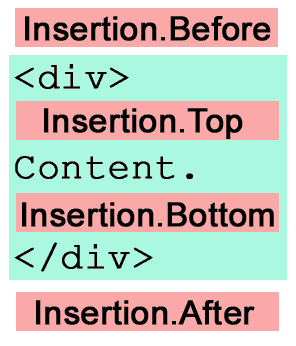
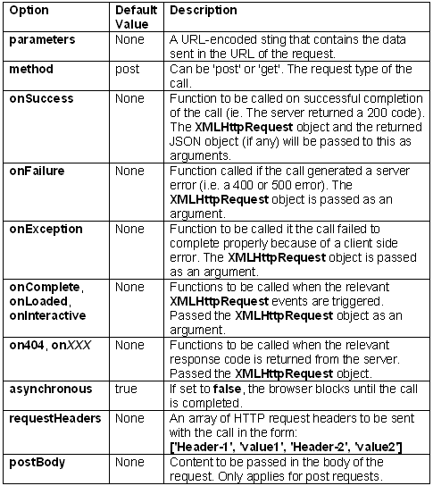

# 使用原型的无痛 JavaScript

> 原文：<https://www.sitepoint.com/painless-javascript-prototype/>

Prototype 是一个面向对象的 JavaScript 库(由 Sam Stephenson 和他的朋友编写),让 JavaScript 变得有趣。总之，在[网站上写着](http://prototype.conio.net)。熟悉开源社区最新最棒的应用框架 Rails 的人可能会认出 Prototype，因为它实际上构成了 Rails JavaScript helper 的主干。然而，Prototype 可以独立于 Rails 使用，以帮助许多 JavaScript 小玩意和 Web 2.0 小玩意的编码。

就我个人而言，我认为整个“有趣”的 JavaScript 事情还没有定论，但尽管如此，Prototype 是一个执行得非常好的 JavaScript 库，尽管最近情况有所改善，但它的文档却非常少。这篇文章提供了整个图书馆的快速浏览。它旨在为您提供足够的示例和资源，让您开始在 DOM 脚本项目中使用 Prototype。

首先，我们将研究 Prototype 的基本构件:它的$函数、它对字符串、数字、数组和函数对象的添加、它的表单处理能力和它的 DOM 函数。然后，我们将继续看 Prototype 众所周知的 AJAX 助手。最后，我们将简要讨论基于它的其他有趣的项目。

我想指出的是，在撰写本文时，Prototype 的当前稳定版本是 1.4.0。我有一种感觉，这个库将会随着 Rails 闪电般的开发周期而迅速改变，所以事情将会改变。最后令人厌烦的一点是，目前 Prototype 只支持较新的浏览器——正如您可能期望的基于 DOM 和 XMLHttpRequest 的库一样。有关浏览器支持的详细信息，请参见[原型站点](http://prototype.conio.net)。

##### 入门指南

最新版本的原型可以从原型网站下载。只需下载 prototype.js 并用一个`<script>`标签将其链接到您的页面:

```
<script type="text/javascript" src="path/to/prototype.js"></script>
```

如果您使用 Rails，您不需要下载 Prototype:它包含在发行版中。您可以将它放入页面的`<head>`中，将其包含在您的视图中:

```
<%= javascript_include_tag 'prototype' %>
```

现在，让我们开始吧！

##### 原型的小帮手

使用 Prototype 的真正好处之一是它为非常常见的脚本任务提供了极其简单的助手功能。`$`功能已经引起了一些关注。给它一个或多个元素 id，它将返回对它们的引用:

```
 // reference to the element with the ID 'nav' 

$("nav") 

// an array of element references 

$("img1", "img2", "img3")
```

这就像一个升级版`document.getElementById`,当你使用它的时候，你会惊奇地发现编码看起来是多么的方便。

另一个非常有用的函数是`document.getElementsByClassName`，它执行 tin 上所说的操作:它接受一个 CSS 类名并返回该类中所有元素的列表:

```
// all elements with class 'navlink' 

document.getElementsByClassName("navlink") 

// all elements with class navlink and inside the element with ID 'nav' 

document.getElementByClassName("navlink", $("nav"))
```

此外，在撰写本文时，Prototype 1 . 5 . 0 _ rc0 获得了强大的`$$`函数，它允许您使用标准 CSS 选择器语法选择元素:

```
// an array of all input elements inside 'commentform' 

$$("#commentform input") 

// an array of all links with the class 'external' 

$$("a.external")
```

请注意，在撰写本文时，除非您从 Subversion 下载了 Prototype 的最新版本[，否则您将无法使用该功能。](http://dev.rubyonrails.org/browser/spinoffs/prototype/)

```
$F takes an ID and returns the value of any form field, for instance, a select box like this:

```
<select name="country" id="country"> 

  <option selected="selected" value="UK">United Kingdom</option> 

  <option value="FR">France</option> 

  ... 

</select> 

$F('country') // 'UK'
```

让 JavaScript 不那么糟糕
糟糕，我偷了另一个 JavaScript 库的标签行。JavaScript 库开发人员似乎无法阻止让 JavaScript 像另一种语言一样。Mochikit 的家伙希望 JavaScript 是 Python，无数程序员试图让 JavaScript 像 Java，Prototype 试图让它像 Ruby。Prototype 对 JavaScript 的核心进行了扩展，可以(如果您选择使用它们)对您的 JavaScript 编码方法产生巨大的影响。根据你的背景和你大脑的工作方式，这可能对你有帮助，也可能没有帮助。
 *** OO 红宝石(ish)道:`Class.create``Object.extend`***
`Class.create`方法允许你以更像 Ruby 的方式定义类，尽管这纯粹是美学上的，因为它本质上只是调用你定义为构造函数的 initialize 方法，而不是采用传统的 JavaScript 方法用构造函数创建对象。

```
var DOMTable = Class.create(); 

DOMTable.prototype = { 

  initialize : function(el) { 

    this.el = el; 

  }, 

  ... 

}
```

然而，更强大的是愚蠢简单却有效的`Object.extend method`。它所做的只是将一个对象的属性和方法复制到另一个对象，但是它的用途很多。这里有一个快速品尝:

```
// make a (shallow) copy of obj1 

var obj2 = Object.extend({}, obj1); 

var options = { 

  method : "post", 

  args : "" 

}; 

// merges in the given options object to the default options object 

Object.extend(options, { 

  args : "data=454", 

  onComplete : function() { alert("done!"); } 

}); 

options.method // "post" 

options.args // "ata=454" 

options.onComplete // function() { alert("done!"); }
```

它最常用于将一个对象的方法“混合”到另一个对象中。例如，您可以创建一组使某些 DOM 元素可排序的函数:

```
var Sortable = { 

  sortBy : function(func) { 

    ... 

  }, 

  sortByReversed : function(func) { 

    ... 

  }, 

  reset : function() { 

    ... 

  } 

};
```

然后，如果我们想使上面的`DOMTable`可排序，我们可以将这些方法混合到`DOMTable`对象中:

```
var myTable = new DOMTable("table-id"); 

Object.extend(myTable, Sortable);
```

现在我们可以调用表上的那些方法:

```
// sort the table using the given function 

myTable.sortBy(function (itemA, itemB) { ... });
```

 ***功能绑定*** 

Prototype 还为函数对象添加了两个非常有用的方法:`bind`和`bindAsEventListener`。这些主要用于将一个函数绑定到一个特定的对象，以便`this`关键字指向那个对象。这在设置事件处理函数时非常有用。想象你尝试这样的事情:

```
var myObject = new Object();  

myObject.message = "Hello!";  

myObject.eventHandler = function() {  

  alert(this.message);  

}  

$("mydiv").onmouseover = myObject.eventHandler;
```

传统上，您会得到一个错误，因为当事件触发处理函数时，这指的是 mydiv 元素，而不是`myObject`，所以`this.message`是未定义的。你可以像这样使用`bind`方法来解决这个问题:

```
$("mydiv").onmouseover = myObject.eventHandler.bind(myObject);
```

现在一切都正常了，因为 this 关键字被绑定到了`myObject`。除此之外，`bindAsEventListener`做同样的事情，尽管它以跨浏览器兼容的方式将事件对象传递给你的函数，所以你不再需要担心 IE 中的`window.event`。试试这个:

```
myObject.eventHandler = function(event) {  

  alert(event.srcElement.nodeName);  

}  

$("mydiv").onmouseover = myObject.eventHandler.bindAsEventListener(myObject);
```

现在我们的`eventHandler`函数可以访问事件对象了。关于这两种方法的更多细节可以在它们的创建者网站上找到。

 ***新增字符串和数字方法*** 

Prototype 为内置的 String 对象添加了大量有用的方法。让我们快速浏览一下其中的一些。

```
// "backgroundColor"  

"background-color".camelize()
```

```
camelize turns hyphenated strings to camel case strings that you can use to work with CSS properties.

```
// "I am a piece of HTML"  

"I am a piece of <strong>HTML</strong>".striptTags()  

// {a : 10, b: "thing"}  

"a=10&b=thing".toQueryParams()
```

Prototype 也为`Number`添加了一个很好的方法。跟你的`for`循环说再见吧！

```
// alerts "1", "2", "3" ... "50"  

50.times(function(n) {  

  alert(n);   

}};
```

这里，times 方法采用一个将被调用给定次数的函数，并将当前迭代次数作为参数传入。迭代器函数的这种用法在使用 Enumerable 时很常见，我们将在接下来讨论。

***Ruby 方式迭代:可枚举和哈希*** 
Prototype 的隐藏宝石之一是`Enumerable` mix-in 和`Hash` object，它们是直接从 Ruby 中挖来的。如果你不熟悉 Ruby，不要担心。我会在这里解释这一切。
我们从`Enumerable`开始。简而言之，当我们使用`Object.extend`将`Enumerable`添加到一个对象中时，它为这个对象提供了许多真正有用的函数来处理它的属性。在`Array`的原型中加入了 Enumerable，所以任何数组都有这些新方法。这里有几个例子可以说明如何使用新的“枚举”数组:

```
// alerts "a is at 0" then "b is at 1" then "c is at 2"  

["a", "b", "c"].each(function(item, index) {  

  alert(item + " is at " + index);  

});  

// [80,50]  

[1, 80, 3, 50].select(function(item) {  

  return (item > 20);  

});
```

```
select creates a new array that contains only the elements that make the function return true.

```
// ["A", "B", "C"]  

["a", "b", "c"].invoke("toUpperCase");
```

```
invoke calls the specified method of each element of the array and returns the resulting array.

```
// ["cat", "rat"]  

["cat", "dog", "rat", "mouse",].grep(/at/);
```

```
grep returns all elements that match the given regular expression.

```
Enumerable offers a large number of incredibly powerful functions that can make many tedious DOM scripting tasks a breeze. I strongly suggest you have a good look at the Enumerable methods in Sergio Pereira's extremely useful developer notes.不过，这里有一个小问题。在 JavaScript 中，您会遇到许多类型的对象，它们实际上就像数组一样，但不是`Array`对象。像 DOM `NodeLists`和函数参数这样的对象不会自动拥有`Enumerable`。不过，这很容易纠正；要将`Enumerable`函数添加到任何类似数组的对象，请使用`$A`:

```
// add Enumerable to childNodes  

var children = $A($("mydiv").childNodes);  

// sets class="highlighted" for all child nodes of "mydiv"  

children.each(function(child) {  

  child.setAttribute("class", "highlighted");  

});
```

要创建一个散列，在任何对象上调用神奇的函数`$H`。这将对象的所有属性转化为一组混合了`Enumerable`的键值对。让我们来看看哈希表:

```
// create a hash by feeding an object to $H  

var contact = $H({  

  name : "Dan Webb",  

  email : "dan@danwebb.net",  

  address : "None of your Business, London",  

  postcode : "a111111"  

});  

// ["name", "email", "address", "postcode"]  

contact.keys()  

// ["Dan Webb", "dan@danwebb.net","None of your Business, London", "a111111"]  

contact.values()  

// "name=Dan Webb&email=..."  

contact.toQueryString()
```

```
Hash extends Enumerable as well, so all those useful methods are also available...

```
// alerts "name contains Dan Webb" and so on  

contact.each(function(item) {  

  alert(item.key + " contains " + item.value);  

});
```

起初，如果你不是 ruby 爱好者，`Enumerable`和`Hash`可能看起来有点麻烦，但是我可以向你保证，一旦你开始使用它们，你会想为什么你要费心让 RSI 编写这些 for 循环！当你使用其中一种或多种方法时，你会意识到这些新方法的巨大威力。你可以[在百科传媒](http://encytemedia.com/blog/articles/2005/12/07/prototype-meets-ruby-a-look-at-enumerable-array-and-hash<br />
)上更详细地了解`Enumerable`和`Hash`。
对于许多人来说，`Event`对象有助于提供 JavaScript 的圣杯:简单的跨浏览器事件处理:

```
function eventHandlerFunction(e) {  

  // the element that triggered the event  

  var element = Event.element(e);  

  // gets the mouse position  

  var mouseX = Event.pointerX(e),  

      mouseY = Event.pointerY(e);  

  // stop default behaviour and event propagation  

  Event.stop(e);  

}  

// register eventHandlerFunction to the onclick of myObject  

Event.observe(myObject, "click", eventHandlerFunction, false);  

// removes the event handler  

Event.stopObserving(myObject, "click", eventHandlerFunction, false);
```

Prototype 以一种相当令人愉快的方式，试图通过在页面卸载时自动移除每个观察者来避免 IE 中那些讨厌的内存泄漏。
不过，在我看来，目前这是一个相当不成熟的事件处理解决方案，所以暂时可能值得考虑使用像[狄恩·爱德华兹的`addEvent`](http://dean.edwards.name/my/events.js) 这样更丰富的东西。

##### 处理表单

`Form`和`Field`对象提供了许多简单而方便的函数来处理表单和输入字段，以及支持 Prototype 的 AJAX 实现的代码。

 ***表单对象*** 

一般来说，`Form`对象的方法要么接受 ID，要么接受对元素的对象引用:

```
// disables the form making all elements read only   

Form.disable(form)   

// enables a form again   

Form.enable(form)   

// clears values from all form elements    

Form.reset(form)   

// returns an array of all form fields in the form   

Form.getElements(form)   

// focuses on the first form field   

Form.focusFirstElement(form)
```

 ***字段对象*** 

`Field`对象处理单个表单元素，它的方法通常以类似于`Form`对象的方式获取元素的 ID 或对象引用:

```
// clears the field, will accept any number of arguments   

Field.clear(field)   

// returns true if all given fields have a value   

Field.clear(field, anotherField)   

// gives focus to the field   

Field.focus(field)   

// selects any text in the field   

Field.select(field)
```

 ***表单连载*** 

用 Prototype 术语来说，序列化表单意味着读取表单的所有元素，并将它们转换成 URL 编码的字符串(几乎)与提交表单时发送的字符串相同。例如，考虑以下形式:

```
<form id="search" action="search.php" method="post">   

  <input type="text" name="query" value="thing" />   

  <select name="field">   

    <option value="artistname">Artist Name</option>   

    <option value="title" selected="selected">Title</option>   

  </select>   

  <input type="submit" name="submit" value="Search" />   

</form>   

// query=thing&field=title&submit=Search   

Form.serialize($("search"))
```

注意`Form.serialize`巧妙地消除了不同表单元素访问方式之间的差异，这样输入、选择、复选框和单选按钮都能得到正确处理。`Form.serialize`对于很多任务都很有用，但是当我们使用 AJAX 时，它才真正发挥作用，我们很快就会看到。

```
Form.serialize exhibits some strange behaviour that's worth mentioning here. You'll remember that I said the URL-encoded string that Form.serialize produces is nearly identical to the one that would be sent if you submitted the form. Well, it's "nearly identical" because Form.serialize doesn't deal with submit button or image inputs properly. It includes all submit buttons in the string, regardless of whether or not they've been pressed, and completely ignores image and button inputs. As long as you're aware of this, you can code around it. ***形态观察者*** 

```
Form.Observer and Form.Element.Observer allow you to watch a form (or, in the latter case, a single form element) and trigger callbacks when the data changes. There are actually two flavours of each observer that check for value changes. The first is a periodic observer, which works like this:

```
new Form.Observer($("myform"), 1, myCallBackFunction);   

new Form.Element.Observer($("myfield"), 1, myCallBackFunction);
```

这些观察器每秒检查数据是否已经改变，如果已经改变，将调用`myCallBackFunction`。
第二种类型的观察器是基于事件的，只在为元素产生更改或点击事件时执行检查。你可以这样使用它:

```
new Form.EventObserver($("myform"), myCallBackFunction);   

new Form.Element.EventObserver($("myfield", myCallbackFunction);
```

如果您正在观察的表单中的所有字段都支持事件处理程序，这是一种更有效的观察表单的方式。但是，如果您想观察不支持这些事件的元素的变化，请使用周期观察器。
在 DOM 工作
Prototype 有 4 个对象(`Element`、`Insertion`、`Observer`和`Position`)，它们允许各种形式的 DOM 操作，并消除了许多浏览器差异，这些差异使得处理 DOM 变得如此令人恼火。不要把你的电脑扔出窗外，看看这个部分。
 ***元素对象*** 
到目前为止，Element 对象的工作方式可能是您已经预料到的:大多数 Element 的方法只是接受一个 ID 或一个对您想要操作的元素的对象引用。以下是一些最有用的方法:

```
// Hides an element   

Element.hide(element)   

// Shows an element   

Element.show(element)   

// Adds a CSS class to the element   

Element.addClassName(element, "cssClassName")   

// Removes a CSS class from the element   

Element.removeClassName(element, "cssClassName")   

// Returns true if element has the CSS class   

Element.hasClassName(element, "cssClassName")   

// {width: 394, height: 20}   

Element.getDimensions(element)   

// replaces the innerHTML of element with newHtml   

Element.update(element, newHtml)
```

查看塞尔吉奥·佩雷拉网站的完整名单。
 ***插入对象*** 
我知道你在想什么:这听起来有点奇怪，对吗？嗯，`Insertion`对象在元素内部和周围添加大量 HTML。有四种类型的插入:`Before`、`After`、`Top`和`Bottom`。下面是如何在 ID 为“myelement”的元素前添加一些 HTML:

```
new Insertion.Before("myelement", "<p>I'm before!</p>");
```

该图显示了每种类型的插入会将您的 HTML 内容放置在与给定元素相关的什么位置。

 ***位置对象*** 
`Position`对象提供了许多方法，这些方法可以告诉您屏幕上的给定位置，并以跨浏览器兼容的方式提供关于该位置相对于其他元素的信息。这将大大减少编写动画、效果和拖放代码的繁琐。更多细节请看[`Position`参考](http://www.sergiopereira.com/articles/prototype.js.html#Position)。

##### 启动您的 Web 2.0

“终于！”你在想，“他抓住了我们真正想知道的东西。”是的，我把它留到了最后来讨论 Prototype 的 AJAX 助手，因为它们是建立在我们已经讨论过的所有其他东西之上的，当我们谈论 AJAX 时，它有助于理解 Prototype 的表单序列化、观察器和插入。

AJAX 是指使用浏览器的`XMLHttpRequest`对象(或等效对象)与服务器进行通信，而无需重新加载页面，以防你在过去几年中陷入了一个很深的困境。Prototype 平滑了大部分细节，但还是需要了解一点关于`XMLHttpRequest`的背景，你可以在这篇由 Cameron Adams 撰写的[文章中找到。](https://www.sitepoint.com/article/remote-scripting-ajax)

现在，您已经准备好开始一些 Web 2.0 操作了，让我们来看看一个非常简单的 AJAX 请求:

```
new Ajax.Request("hello.php", {    

  onSuccess : function(resp) {    

    alert("The response from the server is: " + resp.responseText);    

  },    

  onFailure : function(resp) {    

    alert("Oops, there's been an error.");    

  },    

  parameters : "name=Fred"    

});
```

`Ajax.Request`构造函数接受一个 URL 和一个选项对象。在这种情况下，我们向`hello.php`发送一个参数(名称),并警告它的响应(如果它不起作用，则警告一个错误)。值得花时间去熟悉哪些选项是可用的；以下是这些选项及其默认值的概述:



Prototype 在其所有 AJAX 请求中添加了一个定制的 HTTP 头，这样您的服务器应用程序就可以检测到这是一个 AJAX 调用，而不是普通的调用。标题是:

```
X-Requested-With: XMLHttpRequest
```

下面是一个用于检测 AJAX 调用的 PHP 函数示例:

```
function isAjax() {    

  return isset($_SERVER['HTTP_X_REQUESTED_WITH']) &&    

      $_SERVER ['HTTP_X_REQUESTED_WITH']  == 'XMLHttpRequest';    

}
```

使用这种方法，您可以编写 AJAX 应用程序，即使用户使用旧的浏览器或禁用了 JavaScript 也能正常工作，但那是另外一篇文章了...

 ***使用`Form.serialize`将数据传递给`Ajax.Request` *** 

正如我们在上面看到的，parameters 选项用于传递 URL 编码的变量字符串。如果您需要发送的数据是由表单设置的，就像大多数 AJAX 应用程序一样，您可以简单地使用 Form.serialize 从所有表单字段中生成一个 URL 编码的字符串，并将其传递给参数选项，如下所示:

```
function addComment(e) {    

  // submit the form using Ajax    

  new Ajax.Request("comment.php", {    

    parameters : Form.serialize(this),    

    onSuccess : updateComment    

  });    

  Event.stop(e);    

}    

Event.observe($("commentform"), "submit", addComment, false);
```

 ***编写 AJAX 事件处理程序*** 

在上面的例子中，`onSuccess`和`onFailure`是 AJAX 事件处理程序的两个例子。在一个`Ajax.Request`调用的 options 对象中给出的事件处理函数被赋予一个参数，它是 AJAX 调用的`XMLHttpRequest`对象。我通常称这种争论为`response`或`resp`。您可以使用此参数从服务器获得响应，如下所示:

```
function successHandler(resp, jsonObj) {    

  // returns the response from the server as raw text    

  resp.responseText    

  // returns the response as an XML document that you can navigate with the DOM    

  resp.responseXML    

  // alert some property of the returned JSON    

  alert(jsonObj.name);    

}
```

但是请记住，`resp`只是`XMLHttpRequest`对象，所以所有这些属性都是可用的。

通过将 JSON 数据添加到 X-JSON 响应头中，您可以将数据作为 [JSON](http://www.crockford.com/JSON/) 从您的服务器发送。然后，Prototype 会自动对其进行评估，并将其作为第二个参数发送。

***`Ajax.Updater``Ajax.PeriodicalUpdater`***

许多 AJAX 操作只是用服务器返回的 HTML 更新页面上的一些 HTML。`Ajax.Updater`对象包装了`Ajax.Request`,为我们简化了这个常见的用例。这里有一个简单的例子:

```
new Ajax.Updater("mydiv", "hello.php", {    

  parameters : "name=Fred",    

  onFailure : function(resp) {    

    alert("Oops, there's been an error.");    

  }    

});
```

上面的代码片段只是用服务器返回的内容替换 ID 为“mydiv”的元素的内容。`Ajax.PeriodicalUpdater`与此类似，但是以您设置的时间间隔重复进行 Ajax 调用:

```
new Ajax.PeriodicalUpdater("mydiv", "hello.php", {    

  // initial number of seconds interval between calls    

  frequency : 1,    

  decay : 2    

});
```

如果服务器返回大量相同的响应，那么`decay`选项允许您给服务器一点喘息的机会。实际上，每次`PeriodicalUpdater`发出请求时，它都会将结果与服务器上次返回的结果进行比较。如果值相同，它会将间隔乘以衰减值。因此，对于上面的例子，它将在两秒钟后发出下一个请求，然后在四秒钟后发出，依此类推，直到它从服务器收到不同的结果。此时，间隔将被重置为一秒。

 ***阿贾克斯与先遣队*** 

AJAX 响应器允许您注册全局事件处理程序，页面上发生的每个 AJAX 请求都会触发这些事件处理程序。它们对于管理具有大量 AJAX 活动的应用程序非常有用。例如，每当 AJAX 请求发生时，您可以使用它们来显示标准的加载动画:

```
Ajax.Responders.register({    

  onCreate : showLoader,    

  onComplete : hideLoader    

});
```

如果您正在寻找一些带有 Prototype 的 AJAX 的工作示例，请尝试本文。

##### 接下来去哪里？

正如我们在本文中看到的，Prototype 不仅本身有用，而且为编写其他更专业的库提供了一个极好的起点。这正是越来越多的人一直在做的事情。

 *** Script.aculo.us 和 Moo.fx *** 

托马斯·富克斯的 [script.aculo.us](http://script.aculo.us/) 目前因其惊人的效果和巧妙的用户界面小部件而备受关注。它最初是核心原型库的一部分，但很快就失去了控制，脱离了它的父库。

使用 Prototype 作为基础，script.aculo.us 擅长通过动画效果、简单易用的拖放功能和强大的 UI 组件提供丰富的用户体验。网站上有一个很好的 Wiki，有一个快速增长的高质量文档库来帮助你开始，还有一些示例页面来激发你的创造力。由于 script.aculo.us 的文件越来越大，它被分成了几个文件，因此您的用户不必为了使用一些幻灯片效果而下载整个库。然而，即使是单个文件也非常庞大。

如果你想要一些简单的效果，我真的推荐 [Moo.fx](http://moofx.mad4milk.net/) 。它只有 3k 大小，并提供了一些切换滑动和淡入淡出的效果，这通常是一个简单的 AJAX 应用程序所需要的。如果你想写自己的效果，这也是一个很好的起点。请看一下代码，这是一个使用 Prototype 的 Object.extend 提供简单继承的很好的编程示例。Valerio 显然非常注重降低他的脚本文件大小，所以他甚至有一个“精简”版本的 Prototype(删减到 10k 左右)，和一个精简版本的 [Ajax。Request](http://www.mad4milk.net/entry/moo.ajax) ，我发现自己比完整的原型库用得更多。绝对值得一看。

 ***行为*** 

[behavior](http://bennolan.com/behaviour/)是对你的 DOM 脚本工具包的一个很好的补充，它允许你使用 CSS 选择器给你的文档添加行为。下面是它允许您做的一个示例:

```
Behaviour.register({    

  "#comment_form form" : function(el) {    

    // catch form submission and complete with XHR if possible    

    el.onsubmit = function() {    

      Form.disable(this);    

      new Ajax.Request(this.action, {    

        method: this.method,    

        postBody: Form.serialize(this),    

        onComplete: updateComments});    

      return false;    

    };    

  }    

});
```

在[行为网站](http://bennolan.com/behaviour/)上阅读更多相关内容。现在可以使用前面讨论过的全新的$$函数来实现类似的功能，所以这最终会变得多余。

 *** jQuery *** 

 [jQuery](http://jquery.com) 是一个紧凑的小库，可以很好地使用 Prototype，并创建了一个超级英雄版本的`$`函数，可以使用 XPath 和 CSS 3 选择器。它将这种能力与一些非常聪明的方法链接方法结合起来，使得代码非常简洁。小心这个。

##### 包裹

在向 web 应用程序添加一些 DOM 脚本时，Prototype 是一个强大的工具。不幸的是，它的功能和工具的增长速度比它的文档快得多！我们已经设法在本文中涵盖了 Prototype 的每个方面，但不是每个方法。不过，我希望您现在知道去哪里获取您需要的额外信息。

如果你想知道更多，试试罗尼·罗拉的 prototypedoc.com，这是一个能跟上不断增长的原型文档的资源。玩得开心！

## 分享这篇文章

```

```

```

```

```

```

```

```

```