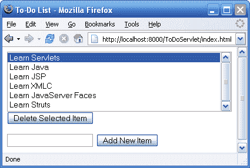

# 全 Java，无泡沫:MVC Web 应用的 6 个简单步骤

> 原文：<https://www.sitepoint.com/java-6-steps-mvc-web-apps/>

对于 Java web 开发人员来说，这是一个激动人心的时刻。在主机提供商中越来越受欢迎， [Java 5](http://java.sun.com/j2se/1.5.0/) (Java 2 标准版 5.0)包含了一堆[新的语言特性](http://java.sun.com/developer/technicalArticles/releases/j2se15/)来迷惑那些已经习惯于对语言了如指掌的自满开发者。主机也在很大程度上部署了主要 Java web 应用服务器的最新版本，这些服务器支持 Java web 开发中的当前标准( [J2EE 1.4](http://java.sun.com/j2ee/) )。并且主要的开发工具已经更新以支持这些标准的强大特性，比如 [JavaServer Faces](http://java.sun.com/j2ee/javaserverfaces/) 。就在那里，等着你去用。

与此同时，Java 在日常 web 开发人员中的名声越来越差。越来越多的人意识到 Java 不再简单，你必须为一家预算相当于一个小国 GDP 的公司工作，才能在这个平台上进行 web 开发。像微软这样的竞争平台。NET 因为做了 Java 已经做了多年的事情而赢得了大量的好评；像 Ruby 这样敏捷的脚本语言可以用很少的代码做出惊人的事情，而 Java 被很多人认为是一个停滞不前的庞然大物。

这种情绪很大程度上来自于 Java web 开发是分层发明的这一事实。首先是这种伟大的、简单易学的编程语言:Java。有人想用它动态生成网页，于是 servlets 被发明出来，它们运行在 Java 上。有人 *else* 想在所有 Java 代码中不丢失 HTML 代码的情况下构建动态网页，于是 JavaServer Pages (JSP)被发明出来，它们运行在 servletss 上，servlet 运行在 Java 上。

几年后，Java web 开发的最前沿位于至少六层技术之上，作为一名新手，您可能会很快感到迷失在术语的森林中！因此，现在我们有爱好者询问如何用 Enterprise JavaBeans (EJB)建立一个基于网络的图片库——这相当于买一辆拖拉机拖车把你的面包和牛奶从街角商店运回家。

在本文中，我将绘制一张穿过术语森林的地图，这样当您在 Java web 开发中迈出第一步时，您就可以弄清楚哪些是您真正需要知道的，哪些是您真正可以使用的，以及哪些是您可以放心地留给跨国公司的。最重要的是，我在这里要表达我在使用 Java 的过程中找到的快乐。希望我也能帮你找到。

##### 让我们从最底层开始…

正如我在[中提到的](https://www.sitepoint.com/blog/)，Java web 技术多年来一直是分层构建的。今天，用 Java 构建网站至少有十几种实用且经过验证的方法。然而，总的来说，它们都建立在相同的基础上: [Java 企业版](http://java.sun.com/j2ee/)(JavaEE)——以前的 Java 2 企业版(J2EE)——一系列相关的规范，描述了前面提到的服务器端 Java 技术层。

通过 J2EE，我们将从查看 [Servlets](http://java.sun.com/products/servlet/) 开始，然后我们将继续查看 [JSP](http://java.sun.com/products/jsp) ，在我们检查 [Model 2](http://www.javaworld.com/javaworld/jw-12-1999/jw-12-ssj-jspmvc.html) 时将两者结合起来，将此扩展到讨论 MVC 框架，如 [Struts](http://struts.apache.org/) 和 [Spring](http://www.springframework.org/) ，甚至探索各种视图技术，如 [Velocity](http://jakarta.apache.org/velocity/) 、 [JavaServer Faces](http://java.sun.com/j2ee/javaserverfaces/) 和 [XMLC](http://xmlc.objectweb.org/) 。这绝不是一个详尽的列表——有很多值得探索的地方！

GA_googleFillSlot(“Articles_6_300x250”);

当我们这样做的时候，我预测你会注意到一个有趣的趋势。大多数 web 开发平台开始时都相当容易学习和使用，但是当你试图将更大、更实用和更复杂的项目硬塞进去时，它们往往会变得越来越复杂。我想到了 PHP:尽管我非常喜欢这种语言的易用性，但你可以花几个月的时间去阅读人们关于如何最好地构建大型项目的想法，却仍然没有提出一个清晰的解决方案。

Java 的趋势是不同的:有很多东西需要提前学习，起初简单的任务看起来似乎是愚蠢的劳动密集型的。但是当你适应了复杂的层次，它们就开始为你工作，你过去觉得可怕的项目会开始变得容易。

为了开始我们的旅程，我们将从一个简单的 web 应用程序开始:一个数据库驱动的待办事项列表。我们将用我们探索的每一种技术构建同样的应用程序，我将为每个版本提供可下载的代码。因为这是一个简单的项目，它将允许你关注技术之间的差异，它们的优点和缺点，哪些特性容易实现，哪些很难实现。

这个应用程序的每个实例都将依赖于同一个 [MySQL](http://www.mysql.com/) 数据库，所以让我们从这个数据库开始。如果您打算继续下去，现在是确保您的开发机器上安装了健康的 MySQL 的好时机。如果你*真的*不熟悉数据库或服务器端 web 开发，你可以在我的书《使用 PHP & MySQL 构建你自己的数据库驱动网站[》的前两章找到关于 MySQL 的可靠介绍和完整的安装说明。这些章节可以在 sitepoint.com 上免费获得:](https://www.sitepoint.com/books/phpmysql1/)[第一章](https://www.sitepoint.com/blog/)和[第二章](https://www.sitepoint.com/blog/)。

有了 MySQL，创建一个新的数据库(我称之为`todo`)，其中包含以下单个表:

```
CREATE TABLE todo ( 
  todoid INT NOT NULL AUTO_INCREMENT PRIMARY KEY, 
  todo VARCHAR(255) NOT NULL 
)
```

就是这样！我们已经准备好查看将与这个简单数据库交互的 Java 类。

##### 与 MySQL 对话:你对 JDBC 的第一印象

为了构建我们将用来探索各种可用的 Java web 开发技术的待办事项列表应用程序，我们将从应用程序的主干开始:一组连接到 MySQL 数据库以检索、建模和更新待办事项列表的类。

在我们继续之前，您需要 Java 作为编程语言的工作知识。至少，你应该理解面向对象编程的基本概念:类、对象、方法、属性和构造函数。对于这些概念和 Java 编程的必要基础的概述，请参见我的文章:[Java 入门](https://www.sitepoint.com/article/getting-started-java)、 [Java 语言基础](https://www.sitepoint.com/article/java-language-basics)和[Java 中的面向对象概念(第一部分](https://www.sitepoint.com/article/oriented-concepts-java-1)和[两个](https://www.sitepoint.com/article/oriented-concepts-java-2))。

在下面的讨论中，我还将利用 Java 在其核心 API 中提供的许多内置实用程序类。如果你对这些感到好奇(你应该好奇！)，你可以在 [Java 5 API 文档](http://java.sun.com/j2se/1.5.0/docs/api/)中浏览参考，或者从[下载 JDK](http://java.sun.com/j2se/1.5.0/download.jsp) 的同一个页面为自己抓取一份。

因为我们连接到数据库，所以我们将使用 [Java 数据库连接(JDBC)](http://java.sun.com/products/jdbc/) 类，它们是 Java 企业版(JavaEE)平台的一部分，受所有支持 Java 的 web 服务器支持。JDBC 为连接到任何数据库服务器提供了一组通用的类(如果你愿意，你可以[浏览这些类的 API 参考](http://java.sun.com/products/jdbc/reference/api/))。

为了用 JDBC 连接到 MySQL，我们需要获取 MySQL 的 JDBC 驱动程序 [MySQL Connector/J](http://www.mysql.com/products/connector/j/) 的副本。在告诉 Java 加载驱动程序后，我们可以让它连接到一个 MySQL 数据库，所有标准的 JDBC 类都知道如何使用这个连接。

下载并解压缩 MySQL Connector/J 归档文件。在里面你会发现一个`mysql-connector-java-*version*-bin.jar`文件(在撰写本文时版本为 3.1.12)，这是驱动程序库。忽略其余的无用内容，将 JAR 文件复制到您计划构建待办事项列表 Java 应用程序的工作目录中。

我们准备开始编码了！在本文中，我将逐行展示所有代码，这样您就可以直接将其输入到您最喜欢的文本编辑器中。如果您已经习惯了一些更简洁的脚本语言，那么 Java 代码对您来说可能有点冗长。事实上，这是不喜欢 Java 的人抱怨的主要原因之一。对于现实世界的开发，我强烈建议你给自己一个可靠的集成开发环境(IDE)，比如 [NetBeans](http://www.netbeans.org/) 或者 [Eclipse](http://www.eclipse.org/) (两者都是免费的)。一个好的 IDE 会为您编写大部分代码，因此 Java 的冗长会有助于提高代码的可读性，而不是妨碍工作效率。然而，在最初的学习阶段，手工键入所有代码肯定会帮助您准确理解正在发生的事情，所以我将把对 ide 的进一步探索留到以后的文章中。

首先，让我们构建一个名为`ToDoList`的类，它将代表存储在数据库中的待办事项列表，并允许我们访问和修改它的条目。我们将把这个类放在一个名为`com.sitepoint`的 Java 包(或命名空间)中，因此，在您的工作目录中，创建一个名为`com`的目录和一个名为`sitepoint`的子目录，并在其中创建一个名为`ToDoList.java`的文件。以所需的包声明开始文件:

```
package com.sitepoint;
```

在这个类中，我们将使用来自`java.sql`的 JDBC 类和来自`java.util`的集合类，所以让我们导入它们:

```
import java.util.*; 
import java.sql.*;
```

最后，我们将声明我们的类:

```
public class ToDoList {
```

为了尽可能保持类与数据库无关，我们将设计它的构造函数来接受一个 JDBC 驱动程序的名称和一个 JDBC 连接字符串，这两个字符串一起为它提供了通过 JDBC 连接到数据库所需的一切。构造函数将立即加载驱动程序类，然后将 JDBC 连接字符串存储在私有属性中，以便对象可以在需要时使用它来连接数据库。

```
 private String jdbcConnectionString; 

  public ToDoList(String jdbcDriver, String jdbcConnectionString) { 
    this.jdbcConnectionString = jdbcConnectionString; 

    // Load the driver 
    try { 
      Class.forName(jdbcDriver).newInstance(); 
    } 
    catch (Exception ex) { 
      System.err.println("Error loading database driver " + jdbcDriver + 
                         ":n" + ex.getMessage()); 
    } 
  }
```

`Class.forName()`获得一个对 JDBC 驱动程序类的引用，调用它的`newInstance()`方法确保它被加载。我们捕捉在驱动程序类不可用的情况下可能抛出的任何异常(如果您忘记这么做，编译器会提醒您)。

现在，我们这个类的第一个版本将允许 Java 程序(和网页)来:

*   获取待办事项列表中的项目列表。
*   获取列表中的项目数。
*   向列表中添加新项目。
*   从列表中删除项目。

因为从数据库中获取列表可能是一项耗时的操作，所以我们将让我们的类在获取列表后保留一份副本，只在必要时从数据库中更新它。

```
 private List list = new ArrayList(); 
  private boolean staleList = true;
```

`list`变量将存储从数据库中检索到的列表，第二个变量将跟踪该列表何时需要更新(即何时“过时”)。我们从一个空的`ArrayList` (Java 的标准列表类，来自`java.util`包)开始，假设它需要更新。

现在，无论程序想要待办事项的实际列表还是仅仅想要知道有多少项，我们都需要从数据库中获取列表。因此，让我们编写一个私有方法来检查存储的列表(在`list`属性中)是否过时，并在必要时从数据库加载列表:

```
 private void refreshList() { 
    if (staleList) { 
      // Load list from the database... 

      staleList = false; 
    } 
  }
```

从数据库加载列表是 JDBC 的工作。首先，我们使用 JDBC 连接字符串(由构造函数存储在`jdbcConnectionString`中)来连接数据库。由于这是一个耗时的操作，我们将连接存储在另一个名为`conn`的私有属性中，并且只在它为空时创建一个新连接:

```
 if (conn == null) { 
          conn = DriverManager.getConnection(jdbcConnectionString); 
        }
```

接下来，我们从连接中创建一个`Statement`对象，并使用它来执行一个`SELECT`查询并获得结果`ResultSet`对象:

```
 Statement stmt = conn.createStatement(); 
        ResultSet rs = stmt.executeQuery("SELECT todoid, todo FROM todo");
```

有了结果，我们在`list`属性中存储一个新的空`ArrayList`，并用从结果集的内容创建的`ToDoItem`对象填充它:

```
 list = new ArrayList(); 
        while (rs.next()) { 
          list.add(new ToDoItem(rs.getInt(1), rs.getString(2))); 
        }
```

出于几个原因，这可能是一段令人困惑的代码。首先，我们使用一个`while`循环来遍历结果集。调用结果集的`next()`方法使其前进到下一条记录，或者如果没有剩余的记录，则返回`false`，从而结束`while`循环。

在循环中，我们使用`ArrayList`类的`add()`方法向列表中添加条目。但是我们到底在添加什么呢？`ToDoItem`类的新实例。

```
ToDoItem is a simple little class that keeps track of an ID (the database ID of a to-do list item) and a string (the text for that item). These two values are "read only", in that there are no methods provided for altering them. Objects like this that represent records in the database are called data objects. Create this class by pasting the following code into a file called ToDoItem.java alongside the ToDoList.java file you're already working on:
```

```
package com.sitepoint; 

public class ToDoItem { 
  private int id; 
  private String item; 

  ToDoItem(int id, String item) { 
    this.id = id; 
    this.item = item; 
  } 

  public int getId() { 
    return id; 
  } 

  public String getItem() { 
    return item; 
  } 

  public String toString() { 
    return getItem(); 
  } 
}
```

在这个简单的类中唯一值得注意的细节是，构造函数没有被声明为公共的，而是被保留为包私有的，因此只有`com.sitepoint`包中的类可以创建`ToDoItem`对象。

回到`ToDoList`,`ToDoItem`的构造函数期望得到该项目的 ID 和文本值。我们可以从结果集的当前行获取这些值，使用`getInt(1)`从第一列(`todoid`)获取一个整数值，使用`getString(2)`从第二列(`todo`)获取一个字符串值。

这就是填充列表的全部内容，除了处理数据库错误之外，我们还要捕捉任何可能抛出的`SQLException`(同样，如果您忘记了，编译器会提醒您)。下面是完成的`refreshList()`方法，以及对`conn`属性的描述:

```
 private Connection conn; 

  private void refreshList() { 
    if (staleList) { 
      try { 
        if (conn == null) { 
          conn = DriverManager.getConnection(jdbcConnectionString); 
        } 
        Statement stmt = conn.createStatement(); 
        ResultSet rs = stmt.executeQuery("SELECT todoid, todo FROM todo"); 

        list = new ArrayList(); 
        while (rs.next()) { 
          list.add(new ToDoItem(rs.getInt(1), rs.getString(2))); 
        } 
      } 
      catch (SQLException ex) { 
        System.err.println( 
            "Error retrieving to-do list items from the database:n" + 
            ex.getMessage()); 
      } 
      staleList = false; 
    } 
  }
```

有了在`refreshList()`中完成的艰苦工作，实现`getToDoItems()`和`getItemCount()`，分别获得待办事项和这些事项的数量，就不在话下了:

```
 public Iterator getToDoItems() { 
    refreshList(); 
    return list.iterator(); 
  } 

  public int getItemCount() { 
    refreshList(); 
    return list.size(); 
  }
```

Java 的 list 类的`iterator()`方法返回一个`Iterator`，一个很像我们刚刚处理的数据库结果集的对象，它让请求对象遍历列表。与此同时，`size()`不言自明。

`addItem()`和`deleteItem()`方法的工作方式与`refreshList()`非常相似，除了它们使用`PreparedStatement`而不是简单的`Statement`。考虑来自`addItem`的这段代码:

```
 PreparedStatement stmt = conn.prepareStatement( 
          "INSERT INTO todo (todo) VALUES (?)"); 
      stmt.setString(1, item); 
      stmt.executeUpdate();
```

注意`INSERT`查询中的问号。这表示将向查询中添加一些未知值的位置(在本例中，是新的待办事项列表项的文本)。接下来的`setString(1, item)`方法调用将一个字符串值(在本例中由`item`变量提供)分配给查询中的第一个点。像`setInt()`这样的其他方法允许您输入其他类型的值。以这种方式将值粘贴到数据库查询中巧妙地避开了字符转义问题，这种问题在其他语言中经常出现，并且经常是安全漏洞的原因。

下面是`addItem()`和`deleteItem()`的完整代码，从而完成了我们的`ToDoList`类:

```
 public void addItem(String item) { 
    try { 
      if (conn == null) { 
        conn = DriverManager.getConnection(jdbcConnectionString); 
      } 
      PreparedStatement stmt = conn.prepareStatement( 
          "INSERT INTO todo (todo) VALUES (?)"); 
      stmt.setString(1, item); 
      stmt.executeUpdate(); 
    } 
    catch (SQLException ex) { 
      System.err.println( 
          "Error adding a to-do list item to the database:n" + 
          ex.getMessage()); 
    } 
    staleList = true; 
  } 

  public void deleteItem(int id) { 
    try { 
      if (conn == null) { 
        conn = DriverManager.getConnection(jdbcConnectionString); 
      } 
      PreparedStatement stmt = conn.prepareStatement( 
          "DELETE FROM todo WHERE todoid=?"); 
      stmt.setInt(1, id); 
      stmt.executeUpdate(); 
    } 
    catch (SQLException ex) { 
      System.err.println( 
          "Error deleting a to-do list item from the database:n" + 
          ex.getMessage()); 
    } 
    staleList = true; 
  }
```

请注意，这些方法中的每一个都在完成工作后将`staleList`设置为`true`，因此下一次尝试读取待办事项列表时，将导致`refreshList`再次从数据库中获取它。

我们现在需要的是一个类来测试我们到目前为止所做的工作。这里有一个名为`ToDoTest`的类可以完成这个任务。将`ToDoTest.java`与您的其他文件放在一起:

```
package com.sitepoint; 

import java.util.*; 

public class ToDoTest { 
  public static void main(String[] args) { 
    ToDoList list = new ToDoList("com.mysql.jdbc.Driver", 
        "jdbc:mysql://localhost/*todo*?user=*root*&password=*password*"); 

    System.out.println("The to-do list contains " + list.getItemCount() + 
                       "items:"); 
    Iterator it = list.getToDoItems(); 
    while (it.hasNext()) { 
      System.out.println(" - " + it.next()); 
    } 

    list.addItem("Another todo item."); 
    list.addItem("And yet another."); 

    System.out.println("The to-do list contains " + list.getItemCount() + 
                       " items:"); 
    it = list.getToDoItems(); 
    while (it.hasNext()) { 
      System.out.println(" - " + it.next()); 
    } 
  } 
}
```

您需要将您的 MySQL 数据库名称、用户名和密码替换到该文件顶部附近的 JDBC 连接字符串中。

从顶层工作目录编译您的三个类:

```
javac com/sitepoint/ToDoList.java com/sitepoint/ToDoItem.java 
    com/sitepoint/ToDoTest.java
```

然后运行`ToDoTest`，将 MySQL JDBC 驱动程序添加到类路径中:

```
java -classpath .;mysql-connector-java-3.0.15-ga-bin.jar 
    com.sitepoint.ToDoTest
```

在两个新项目添加到列表之前和之后，您应该会看到待办事项列表项目的列表，如下所示:

```
The to-do list contains 2 items: 
 - Another todo item. 
 - And yet another. 
The to-do list contains 4 items: 
 - Another todo item. 
 - And yet another. 
 - Another todo item. 
 - And yet another.
```

[下载源代码](https://www.sitepoint.com/examples/jgrind/todo-backbone.zip)。(5KB)

就是这样！我们准备围绕这些类构建一个 web 应用程序。

##### 小型应用程序

如果您已经完成了，现在您已经有了一个待办事项列表数据库和几个查看和更新它的类。下一步是通过将该功能包装在 web 应用程序中，将它带到 web 上。在 Java 平台上，有许多方法可以做到这一点。最简单的方法是编写一个 servlet。servlet 只是一个类，它有处理来自 web 浏览器的请求的方法。

基本的页面请求由一个`doGet()`方法处理。使用 POST 方法的表单提交由一个`doPost()`方法处理。传递给这些方法的对象提供了对浏览器请求信息的访问，并允许控制 servlet 的响应。

GA_googleFillSlot(“Articles_6_300x250”);

XML 配置文件控制 servlet 负责的 URL，并提供 servlet 可能需要的任何配置信息。

Java web 应用标准(J2EE)甚至指定了目录结构，因此 servlet 总是知道在哪里可以找到它需要的任何类文件、配置文件和其他 web 资源(如图像和样式表)。

让我们先把已经有的东西放到正确的目录结构中。创建一个新的空目录，然后创建一个名为`WEB-INF`的子目录。所有“普通”的 web 资源(HTML 页面、图片、样式表和 JavaScript 文件)都将放在主目录中，而所有 Java 内容(类、库和配置文件)都将放在`WEB-INF`中。

在`WEB-INF`内，再创建两个子目录:`classes`和`lib`。`WEB-INF/classes`将包含我们 web 应用程序的所有 Java 类，`WEB-INF/lib`将包含这些类可能需要的任何库。

说到所需的库，请记住上一节提到的我们的`ToDoList`类需要 MySQL 的 JDBC 驱动程序(MySQL Connector/J)来访问数据库。对于独立的应用程序，我们需要将 JAR 文件(`mysql-connector-java-*version*-bin.jar`)添加到类路径中。对于 Java web 应用程序，只需将文件放入`WEB-INF/lib`目录。

因为我们将在 web 应用程序中使用已经开发的类(`ToDoList`和`ToDoItem`)，所以我们需要将它们放在`WEB-INF/classes`目录中。您也可以将源文件和编译后的类一起放在那里，以防万一您需要做任何更改——重新编译将是轻而易举的事情。

以下是我们目前为止的文件和目录结构:

```
/WEB-INF/classes/com/sitepoint/ToDoItem.class  
/WEB-INF/classes/com/sitepoint/ToDoItem.java  
/WEB-INF/classes/com/sitepoint/ToDoList.class  
/WEB-INF/classes/com/sitepoint/ToDoList.java  
/WEB-INF/lib/mysql-connector-java-*version*-bin.jar
```

现在让我们把注意力转向为我们的应用程序构建 servlet。记住，servlets 只是 Java 类，这个将是`com.sitepoint.ToDoServlet`:

```
package com.sitepoint;  

import java.io.*;  
import java.util.*;  
import javax.servlet.*;  
import javax.servlet.http.*;  

public class ToDoServlet extends HttpServlet {
```

如您所见，servlet 类必须扩展`javax.servlet.HttpServlet`类。你可以在 [J2EE API 规范](http://java.sun.com/j2ee/1.4/docs/api/)中查看关于这个类和相关类的文档。

我们的 servlet 将使用我们的`ToDoList`类的一个实例，我们希望在第一次加载 servlet 时创建这个实例。我们可以在`init()`方法中执行类似这样的初始化任务，服务器在加载 servlet 时会调用这个方法:

```
 private ToDoList toDoList;  

  // Initialize global variables  
  public void init() throws ServletException {  
    toDoList = new ToDoList(getInitParameter("jdbcDriver"),  
                            getInitParameter("jdbcConnectionString"));  
  }
```

您可能还记得，`ToDoList`构造函数接受您想要使用的 JDBC 驱动程序的名称和一个 JDBC 连接字符串，以便它可以连接到您的数据库。我们没有将这些字符串硬编码到我们的 servlet 中，而是使用这段代码，该代码使用这些值的初始化参数，这样就可以在不重新编译 servlet 的情况下配置它们。我们稍后会更深入地探讨这一点。

您会注意到，`init()`方法像所有标准 servlet 方法一样，可以抛出一个`ServletException`。这个异常用于让服务器知道 servlet 中出现了错误。稍后我们将看到这是如何工作的。

接下来是`doGet()`方法，它处理普通的浏览器请求。它有两个参数:一个是包含浏览器请求详细信息的`HttpServletRequest`,另一个是 servlet 可以用来控制其对浏览器响应的`HttpServletResponse`:

```
 public void doGet(HttpServletRequest request, HttpServletResponse response)  
      throws ServletException, IOException {
```

同样，该方法能够抛出一个`ServletException`来通知 servlet 中的错误。servlet 规范还允许这个函数抛出一个`IOException`，以防读取请求或编写响应出现问题。

为了响应正常的浏览器请求，我们希望显示当前的待办事项列表，并让用户能够向列表中添加项目，以及删除列表中的现有项目。首先，我们必须让`HttpServletResponse`对象知道我们将把什么类型的内容发送回浏览器:

```
 response.setContentType("text/html");
```

现在我们可以向它请求一个`PrintWriter`对象，我们可以用它向浏览器发送 HTML 代码:

```
 PrintWriter out = response.getWriter();
```

`PrintWriter`对象让我们使用它的`println()`方法向浏览器发送 HTML 代码:

```
 out.println("<!DOCTYPE html PUBLIC "-//W3C//DTD XHTML 1.0 Strict//EN"n" +  
                "  "https://www.w3.org/TR/xhtml1/DTD/xhtml1-strict.dtd">");  
    out.println("<html >");  
    out.println("<head>");  
    out.println("<title>To-Do List</title>");  
    out.println("<meta http-equiv="content-type" " +  
                "content="text/html; charset=iso-8859-1" />");
```

如果对您来说这看起来不太好，那么您已经发现了 servlets 的最大弱点:HTML 标记与应用程序的 Java 逻辑混杂在一起，这使得它难以阅读和维护。

继续，我们希望将一个 CSS 样式表链接到我们的页面:

```
 out.println("<link rel="stylesheet" type="text/css" href="" +  
                request.getContextPath() + "/styles.css" />");  
    out.println("</head>");  
    out.println("<body>");
```

因为我们还不知道我们的应用程序将安装在 web 服务器的哪个目录中，所以我们不知道样式表和图像等资源将在哪个路径上可用。上面的代码使用了`request`对象的`getContextPath()`方法来获取我们应用程序的根目录路径，从那里我们可以指向`styles.css`文件，我们稍后会创建这个文件。

接下来，我们将在 HTML 表单菜单中显示待办事项列表。我们可以从用`getToDoItems()`方法从`ToDoList`中抓取一个`Iterator`开始。然后，我们将使用它的`hasNext()`方法检查它是否包含任何项目:

```
 Iterator toDoItems = toDoList.getToDoItems();  
    if (toDoItems.hasNext()) {
```

我们希望表单提交回同一个 URL，这样这个 servlet 也可以处理那个请求，所以我们使用`getRequestURI()`方法来获得它:

```
 out.println("<form action="" + request.getRequestURI() +  
                  "" method="post">");
```

由于 HTML 表单菜单变成了下拉列表，并且`size`为 1，所以我们希望`<select>`标签的`size`至少为 2，但是我们也希望它能够扩展以容纳待办事项列表中的项目数量。我们使用`Math.max()`方法在 2 和列表中的项目总数之间进行选择，正如我们的`ToDoList`的`getItemCount()`方法所给出的:

```
 out.println("<select name="deleteid" size="" +  
                  Math.max(2, toDoList.getItemCount()) + "">");
```

然后我们可以用一个`while`循环遍历`toDoItems`。每次我们穿过循环，我们用`next()`从`Iterator`中拉出一个`ToDoItem`。因为它不知道它包含了 T5，我们需要在使用它们之前将它们转换到正确的类:

```
 while (toDoItems.hasNext()) {  
        ToDoItem toDoItem = (ToDoItem) toDoItems.next();
```

对于每个项目，我们想要创建一个`<option>`标签，将项目的 ID 作为它的`value`。输出 ID 没有问题，因为它只是一个整数，但是待办事项本身变得很棘手。如果待办事项包含 HTML 代码，甚至可能是恶意脚本代码，该怎么办？我们不想输出那些东西，让浏览器把它解释成我们网站的一部分！解决方法是在输出之前，对值中的任何特殊字符进行转义。

这是 servlet 的另一个弱点:在 servlet API 或 Java 中没有内置的 HTML 转义功能(至少对我们来说没有)。幸运的是，这是一个长期的问题，第三方类已经被创建来做这项工作。我选择的这个是由 [AnyWare](http://www.anyware.co.uk/anyware/java/) 开发和发行的。这个类叫做`uk.co.anyware.html.HTMLEscaper`，它的源代码和许可证包含在我下面提供的代码档案中。

要使用`HTMLEscaper`，将类(和源代码，如果你想保留它)放到`WEB-INF/classes`目录中，并将所需的`import`添加到`ToDoServlet`类的顶部:

```
import uk.co.anyware.html.*;
```

有了这个类，我们现在可以安全地输出待办事项了。我们还将用一个用于删除所选项目的提交按钮来完善表单的其余部分:

```
 out.println("</select>");  
      out.println("<input type="submit" value="Delete Selected Item" />");  
      out.println("</form>");  
    }
```

我们将使用第二个表单来结束页面，这次是为了提交新的待办事项:

```
 out.println("<form action="" + request.getRequestURI() +  
                "" method="post">");  
    out.println("<input type="text" name="newtodo" />");  
    out.println("<input type="submit" value="Add New Item" />");  
    out.println("</form>");  

    out.println("</body>");  
    out.println("</html>");  
    out.close();  
  }
```

它负责向用户显示初始页面，但是我们现在有两个表单提交回同一个 servlet！

这两个表单都使用 POST 方法(`method="post"`)提交，所以我们可以在 servlet 的`doPost()`方法中处理它们。但是为了使 servlet 尽可能灵活，我们还将支持通过 GET 请求来添加新的待办事项和删除现有的待办事项。为此，我们只需将 POST 请求反馈到我们的`doGet()`方法中:

```
 public void doPost(HttpServletRequest request, HttpServletResponse response)  
      throws ServletException, IOException {  
    doGet(request, response);  
  }
```

在`doGet()`的顶部，我们现在需要检查和处理表单提交。下面是处理新待办事项的代码:

```
 String newToDo = request.getParameter("newtodo");  
    if (newToDo != null) {  
      toDoList.addItem(newToDo);  

      // Redirect to self  
      response.sendRedirect(request.getRequestURI());  
      return;  
    }
```

`getParameter()`方法让我们用给定的名称作为字符串检索提交的值。如果值不是`null`，我们知道我们有一个提交。我们使用它的`addItem`方法将它添加到待办事项列表中，然后使用响应的`sendRedirect()`方法将浏览器重定向到当前页面。

如果我们不重定向浏览器，`doGet()`方法的其余部分确实会为用户显示更新后的待办事项列表，但是刷新页面会导致表单提交被再次发送，导致待办事项列表上出现重复条目。将浏览器重定向回同一页面会迫使浏览器将其视为一个单独的请求，因此在刷新页面时不会重新提交表单。

处理已删除项目的代码非常相似，除了它必须将提交的字符串转换为待办事项列表的`deleteItem()`方法的整数:

```
 String deleteid = request.getParameter("deleteid");   
    if (deleteid != null) {   
      try {   
        toDoList.deleteItem(Integer.parseInt(deleteid));   

        // Redirect to self   
        response.sendRedirect(request.getRequestURI());   
        return;   
      }   
      catch (NumberFormatException e) {   
        throw new ServletException("Bad deleteid value submitted.", e);   
      }   
    }
```

转换是通过`Integer.parseInt()`方法实现的，但是如果提交的值不能转换成数字，它将抛出一个`NumberFormatException`。如果发生这种情况，我们的代码会捕捉异常并抛出一个`ServletException`(我们将`NumberFormatException`作为根本原因传递给它)。

GA_googleFillSlot(“Articles_6_300x250”);

记住，所有标准的 servlet 方法都允许抛出`ServletException` s 来让服务器知道有什么地方出错了。这正是我们在这里做的。当代码抛出`ServletException`时，运行 servlet 的服务器会捕捉到它，并在用户浏览器中显示适当的错误消息。您可以配置大多数 Java 服务器来控制在这样的错误页面中包含多少技术细节。

信不信由你，servlet 就是这样！但是，您仍然需要编译它，这有点棘手。你看，我们的 servlet 扩展的`HttpServlet`类包含在每个 Java 服务器分发的库中，你需要这个类来编译你的子类。

在 Tomcat 5.x 中，servlet 库被称为`servlet-api.jar`，它可以在 Tomcat 安装的`commonlib`目录中找到。因此，您可以通过将 JAR 文件包含在类路径中来编译 servlet:

```
javac -classpath   
".;c:Program FilesApache GroupTomcat 5.5commonlibservlet-api.jar"   
com/sitepoint/*.java uk/co/anyware/html/*.java
```

现在，您的文件和目录结构应该是这样的:

```
/WEB-INF/classes/com/sitepoint/ToDoItem.class   
/WEB-INF/classes/com/sitepoint/ToDoItem.java   
/WEB-INF/classes/com/sitepoint/ToDoList.class   
/WEB-INF/classes/com/sitepoint/ToDoList.java   
/WEB-INF/classes/com/sitepoint/ToDoServlet.class   
/WEB-INF/classes/com/sitepoint/ToDoServlet.java   
/WEB-INF/classes/uk/co/anyware/html/HTMLEscaper.class   
/WEB-INF/classes/uk/co/anyware/html/HTMLEscaper.java   
/WEB-INF/lib/mysql-connector-java-*version*-bin.jar
```

我们还需要添加两件东西来完成我们的 Java web 应用程序。第一个是我们的 servlet 引用的`styles.css`样式表:

```
body, p, td, th {   
  background: #fff;   
  color: #000;   
  font: medium Verdana, Arial, Helvetica, sans-serif;   
}   

select {   
  width: 100%;   
}
```

将它放在主应用程序目录中，该目录也包含`WEB-INF`目录。

我们需要的另一件事是应用程序的 XML 配置文件`web.xml`。这个文件被称为**部署描述符**。它必须以这样一个`<web-app>`标记开始(同样，任何像样的 IDE 都会为您编写这个样板代码):

```
<?xml version="1.0" encoding="UTF-8"?>   
<web-app    
    xmlns:xsi="https://www.w3.org/2001/XMLSchema-instance"   
    xsi:schemaLocation="http://java.sun.com/xml/ns/j2ee http://java.sun.com/xml/ns/j2ee/web-app_2_4.xsd"   
    version="2.4">
```

接下来，我们为我们的 web 应用程序提供一个名称:

```
 <display-name>ToDoServlet</display-name>
```

现在我们将配置我们的 servlet。我们给它一个名字并指定它的类:

```
 <servlet>   
    <servlet-name>toDo</servlet-name>   
    <servlet-class>com.sitepoint.ToDoServlet</servlet-class>
```

现在，记住我们的 servlet 的`init()`方法使用了两个初始化参数:一个用于 JDBC 驱动程序类名，一个用于 JDBC 连接字符串。我们在此提供这些参数的值:

```
 <init-param>   
      <description>The JDBC driver class.</description>   
      <param-name>jdbcDriver</param-name>   
      <param-value>com.mysql.jdbc.Driver</param-value>   
    </init-param>   
    <init-param>   
      <description>The JDBC connection string.</description>   
      <param-name>jdbcConnectionString</param-name>   
      <param-value>jdbc:mysql://localhost/todo?user=root&amp;password=password</param-value>   
    </init-param>   
  </servlet>
```

最后，我们提供了一个 servlet 映射，它向 servlet 的给定 URL 发送请求。对于我们的例子，我们将把应用程序根中对`index.html`的请求定向到我们的 servlet:

```
 <servlet-mapping>   
    <servlet-name>toDo</servlet-name>   
    <url-pattern>/index.html</url-pattern>   
  </servlet-mapping>   
</web-app>
```

这就是我们的应用程序！以下是完整的文件列表:

```
/styles.css   
/WEB-INF/web.xml   
/WEB-INF/classes/com/sitepoint/ToDoItem.class   
/WEB-INF/classes/com/sitepoint/ToDoItem.java   
/WEB-INF/classes/com/sitepoint/ToDoList.class   
/WEB-INF/classes/com/sitepoint/ToDoList.java   
/WEB-INF/classes/com/sitepoint/ToDoServlet.class   
/WEB-INF/classes/com/sitepoint/ToDoServlet.java   
/WEB-INF/classes/uk/co/anyware/html/HTMLEscaper.class   
/WEB-INF/classes/uk/co/anyware/html/HTMLEscaper.java   
/WEB-INF/lib/mysql-connector-java-*version*-bin.jar
```

现在您已经准备好捆绑这个应用程序，以便它可以部署在支持 Java 的服务器上。为此，您需要使用 JDK 附带的`jar`实用程序。如果您已经将 JDK 的`bin`目录添加到系统路径中，那么您应该能够通过在命令提示符下键入`jar`来运行它。

转到应用程序的工作目录(包含`styles.css`和`WEB-INF`的目录)，键入以下命令:

```
jar cvf ToDoServlet.war .
```

这将生成一个名为`ToDoServlet.war`的文件，其中包含您的应用程序。它实际上是一个伪装的 ZIP 文件。

您现在需要在您的服务器上部署这个应用程序。不同的服务器提供了不同的实现方式。如果您使用 Tomcat，只需将`ToDoServlet.war`文件复制到安装的`webapps`目录中。过一会儿，Tomcat 会自动将文件解压到一个新的目录中。然后可以编辑`web.xml`文件，确保 JDBC 连接字符串包含数据库服务器的正确细节。

完成后，您应该准备好运行您的应用程序了。在浏览器中加载`http://localhost:8080/ToDoServlet/index.html`(假设 Tomcat 运行在本地机器的 8080 端口上)。以下是您应该看到的内容:



玩一玩这一页。它应该像你预期的那样工作。下面是 WAR 文件(如果解压缩，会有完整的源代码):

[下载代码](https://www.sitepoint.com/examples/jgrind/ToDoServlet.war)。(250KB)

##### 老派 JSP

您已经为理解 Java web 应用程序开发的最新技术做好了准备。到目前为止，我们已经了解了 servlets:设计用于响应 web 浏览器请求的 Java 类。使用 servlet，我们为数据库驱动的待办事项列表组装了一个简单的 web 界面。虽然它可以工作，但是用这种方式编写实际的 web 应用程序是很痛苦的，因为应用程序逻辑与页面的 HTML 代码混合在一起。

JavaServer Pages (JSP)就是为了克服 servlets 的这一弱点而创建的。您不用编写包含 HTML 代码的 Java 类，而是编写包含 Java 代码的 HTML 页面。然后，服务器动态地将这个页面转换成 Java servlet，以便处理页面请求。正如我们将看到的，以这种方式逆转我们的方法解决了一些问题，但也产生了一些新的问题。

从我们刚才构建的 to-do list web 应用程序开始，让我们去掉讨厌的 servlet，用一个做同样事情的 JavaServer 页面来代替它:`todo.jsp`。下面是我们的应用程序更新后的文件和目录结构:

```
/todo.jsp    
/styles.css    
/WEB-INF/web.xml    
/WEB-INF/classes/com/sitepoint/ToDoItem.class    
/WEB-INF/classes/com/sitepoint/ToDoItem.java    
/WEB-INF/classes/com/sitepoint/ToDoList.class    
/WEB-INF/classes/com/sitepoint/ToDoList.java    
/WEB-INF/classes/uk/co/anyware/html/HTMLEscaper.class    
/WEB-INF/classes/uk/co/anyware/html/HTMLEscaper.java    
/WEB-INF/lib/mysql-connector-java-version-bin.jar
```

GA_googleFillSlot(“Articles_6_300x250”);

让我们开始编写我们的`todo.jsp`文件。打开你最喜欢的文本编辑器，我们就可以开始烹饪了！

JSP 文件看起来很像 HTML 文件，除了其中散布着特殊的 JSP 标记。一般来说，所有 JSP 标签都以`<%`开始，以`%>`结束。当我们在将来寻找更现代和更高级的 JSP 工作方式时，这是一个将被打破的规则，但是，现在，如果你把它当作真理，那也没关系。

我们需要做的第一件事是提供一些关于页面的信息。这是通过一个**页面指令**完成的。指令是一种 JSP 标记，包含各种设置和其他类型的配置信息。指令在开始`<%`后有一个`@`符号。这是我们的页面指令:

```
<%@ page import="java.util.*,com.sitepoint.*,uk.co.anyware.html.*" %>
```

page 指令最常见的用途是导入 JSP 文件中的 Java 代码将使用的 Java 包。在这种情况下，我们已经指出我们需要来自`java.util`、`com.sitepoint`和`uk.co.anyware.html`的类。这些相同的包是由我们的 to-do list servlet 导入的(您可能希望将这些代码放在附近进行比较)。

然后，我们可以像编写任何(X)HTML 文件一样编写页面:

```
<!DOCTYPE html PUBLIC "-//W3C//DTD XHTML 1.0 Strict//EN"    
    "https://www.w3.org/TR/xhtml1/DTD/xhtml1-strict.dtd">    
<html >    
<head>    
  <title>To-Do List</title>    
  <meta http-equiv="content-type"    
      content="text/html; charset=iso-8859-1" />    
  <link rel="stylesheet" type="text/css"    
      href="<%= request.getContextPath() %>/styles.css" />    
</head>
```

仔细观察，您会看到另一个 JSP 标记:`<%= request.getContextPath() %>`。这就是我们所说的**表达式**，如标签中左`<%`后的`=`符号所示。表达式用于输出 Java 代码的值；在这种情况下，我们输出由`request`对象的`getContextPath()`方法返回的值——我们的 web 应用程序的根目录，浏览器需要它来定位`styles.css`文件。

是的，JSP 代码就像 servlet 代码一样，通过一个名为`request`的变量来访问浏览器的请求。还有一个用于浏览器响应的`response`变量。这两个变量都被称为隐式对象，它们是为您隐式创建的。

其他隐式对象包括`out`，一个工作方式类似于在 servlet 中用于向浏览器发送输出的`PrintWriter`的对象，`session`，一个用于在特定用户访问您的站点的过程中存储值的对象，`application`，一个用于存储在整个应用程序中使用的值的对象。

现在，正如我们的 servlet 依赖于一个`ToDoList`对象来完成应用程序的大量工作一样，我们的 JSP 文件也是如此。我们需要声明这个对象，为此我们需要另一个 JSP 标签:一个**声明**。

```
<%!    
private ToDoList toDoList;    

public void jspInit() {    
  toDoList = new ToDoList(getInitParameter("jdbcDriver"),    
      getInitParameter("jdbcConnectionString"));    
}    
%>
```

正如您所看到的，声明由开头`<%`后面的感叹号(`!`)表示，并且包含 Java 属性和方法声明，就像您在 Java 类中看到的那样。

在这种情况下，我们声明了一个名为`toDoList`的`ToDoList`对象，并编写了一个名为`jspInit()`的方法，该方法根据初始化参数创建这个对象，就像我们在 servlet 的`init()`方法中所做的一样。`init()`是 servlet 的一个特殊方法，在第一次使用 servlet 之前由服务器调用，`jspInit()`是一个特殊方法，它被自动调用来初始化 JSP 文件。

接下来是在这个页面中处理表单提交的代码。您应该记得我们的 servlet，该页面将包含两个表单:一个用于向待办事项列表添加项目，另一个用于删除项目。处理这些提交的代码在我们的 JSP 中是相同的，除了它放在另一种类型的 JSP 标记中:一个 **scriptlet** 。

```
<%    
String newToDo = request.getParameter("newtodo");    
if (newToDo != null) {    
  toDoList.addItem(newToDo);    
  response.sendRedirect(request.getRequestURI());    
  return;    
}    

String deleteid = request.getParameter("deleteid");    
if (deleteid != null) {    
  try {    
    toDoList.deleteItem(Integer.parseInt(deleteid));    

    response.sendRedirect(request.getRequestURI());    
    return;    
  }    
  catch (NumberFormatException e) {    
    throw new ServletException("Bad deleteid value submitted.", e);    
  }    
}    
%>
```

最初构思 JSP 时，scriptlets 被认为是最常见的 JSP 标记类型，因此它们用简单的`<%`和`%>`分隔符来表示——在标记的开始部分没有特殊字符。每次请求页面时，都会执行 scriptlet 中的 Java 代码。

表单处理完成后，剩下的就是生成表单本身了。首先，我们有我们的待办事项列表，它显示当前的待办事项并允许用户删除它们:

```
<body>    
  <%    
  Iterator toDoItems = toDoList.getToDoItems();    
  if (toDoItems.hasNext()) {    
    %>    
    <form action="<%= request.getRequestURI() %>" method="post">    
      <select name="deleteid" size="<%= Math.max(2, toDoList.getItemCount()) %>">    
        <%    
        while (toDoItems.hasNext()) {    
          ToDoItem toDoItem = (ToDoItem) toDoItems.next();    
          %>    
          <option value="<%= toDoItem.getId() %>"><%= HTMLEscaper.escape(toDoItem.toString()) %></option>    
          <%    
        }    
        %>    
      </select>    
      <input type="submit" value="Delete Selected Item" />    
    </form>    
    <%    
  }    
  %>
```

看起来有点乱，不是吗？这里我们有 HTML 代码、JSP 脚本和 JSP 表达式的混合。我们来分解一下。

```
 <%    
  Iterator toDoItems = toDoList.getToDoItems();    
  if (toDoItems.hasNext()) {    
    %>    
    ...    
    <%    
  }    
  %>
```

第一个 scriptlet 获取一个包含待办事项列表中项目的`Iterator`对象。我们的 servlet 做了完全相同的事情。因为如果待办事项列表不包含任何项目，我们就不需要显示它，所以我们使用一个`if`语句来检查它是否包含了`Iterator`的`hasNext()`方法。

表单的所有代码都放在这个`if`语句中。`if`语句的右括号在页面的最后一个 scriptlet 中。如您所见，scriptlet 中的 Java 代码不需要自包含；您可以将 JSP 标记之间的 HTML 代码视为输出该 HTML 代码的指令，scriptlets 提供了该 HTML 应该何时以及如何出现的逻辑。

在表单中，我们使用 JSP 表达式在我们的`<form>`和`<select>`标签中输出所需的值:

```
 <form action="<%= request.getRequestURI() %>" method="post">    
      <select name="deleteid" size="<%= Math.max(2, toDoList.getItemCount()) %>">    
        ...    
      </select>    
      <input type="submit" value="Delete Selected Item" />    
    </form>
```

最后，我们需要为待办事项列表中的每一项输出一个`<option>`标签。代码再次与我们的 servlet 非常相似，因为我们使用了一个`while`循环来完成这项工作:

```
 <%    
        while (toDoItems.hasNext()) {    
          ToDoItem toDoItem = (ToDoItem) toDoItems.next();    
          %>    
          <option value="<%= toDoItem.getId() %>">    
            <%= HTMLEscaper.escape(toDoItem.toString()) %></option>    
          <%    
        }    
        %>
```

乍一看很乱，但是如果您仔细观察(或者更好的是，如果您有一个用不同颜色突出显示 JSP 标记的编辑器)，您可以看到 JSP scriptlets 中的逻辑是怎样的，其余的代码只是带有 JSP 表达式以输出动态值的 HTML。

与第一个相比，添加新待办事项列表项的表单是小菜一碟:

```
 <form action="<%= request.getRequestURI() %>" method="post">    
    <input type="text" name="newtodo" />    
    <input type="submit" value="Add New Item" />    
  </form>    
</body> &   
</html>
```

这就是我们的 JSP 文件！剩下唯一要做的就是更新我们应用程序的`web.xml`配置文件，使初始化参数(`jdbcDriver`和`jdbcConnectionString`)可用于我们的 JSP 文件:

```
<?xml version="1.0" encoding="UTF-8"?>    
<web-app     
    xmlns:xsi="https://www.w3.org/2001/XMLSchema-instance"    
    xsi:schemaLocation="http://java.sun.com/xml/ns/j2ee http://java.sun.com/xml/ns/j2ee/web-app_2_4.xsd"    
    version="2.4">    
  <display-name>ToDoJSP</display-name>    
  <servlet>    
    <servlet-name>toDo</servlet-name>    
    <jsp-file>/todo.jsp</jsp-file>    
    <init-param>    
      <description>The JDBC driver class.</description>    
      <param-name>jdbcDriver</param-name>    
      <param-value>com.mysql.jdbc.Driver</param-value>    
    </init-param>    
    <init-param>    
      <description>The JDBC connection string.</description>    
      <param-name>jdbcConnectionString</param-name>    
      <param-value>jdbc:mysql://localhost/todo?user=root&amp;password=password</param-value>    
    </init-param>    
  </servlet>    
  <servlet-mapping>    
    <servlet-name>toDo</servlet-name>    
    <url-pattern>/todo.jsp</url-pattern>    
  </servlet-mapping>    
</web-app>
```

与我们在 servlet 中使用的`web.xml`文件相比，有两个显著的变化:

*   我们没有使用一个`<servlet-class>`标签来指示我们为其提供参数的 servlet，而是使用一个`<jsp-file>`标签来指示 JSP 文件。
*   `<servlet-mapping>`中的`<url-pattern>`标签也指向 JSP 文件。

完成这些更改后，您就可以打包应用程序并将其部署到您的服务器上了。与 servlet 不同，您不需要预先编译 JSP 文件——服务器会将它们转换成 servlet 并为您动态编译。然而，您仍然需要编译 JSP 使用的类(`ToDoList`、`ToDoItem`、`HTMLEscaper`)。

与 servlet 一样，使用`jar`命令提示实用程序创建一个包含您的应用程序的`WAR`文件:

```
jar cvf ToDoJSP.war .
```

将这个文件放到 Tomcat 的`webapps`目录中进行部署(或者使用您喜欢的任何 Java 兼容的服务器进行部署)，并编辑部署的`web.xml`文件以匹配您的数据库配置。

然后加载`http://localhost:8080/ToDoJSP/todo.jsp`来测试您的应用程序。您应该会看到您熟悉的待办事项列表界面，这次是由 JSP 生成的。

这里是完成的 WAR 文件，包括源代码，供您试验:

[下载代码](https://www.sitepoint.com/examples/jgrind/ToDoJSP.war)。(250KB)

现在，您会想起 JSP 的全部目的是克服将 HTML 代码混合到 servlet 的 Java 代码中的混乱。如果您已经查看了我们新 JSP 文件的代码，我会原谅您对我们是否已经实现目标的怀疑。

我们的待办事项 JSP 文件是用我所谓的“老派 JSP”写的。它是纯 JSP，因为它最初是在几年前构思的，没有任何现代的便利设施。在本文的其余部分，我将向您展示如何使用 JSP 的当前和高级特性来修改它。首先，我们将把 servlets 带回到画面中(但是以更简单的形式！)，然后我们将看看像 JavaBeans、Java 标准标记库和 JSP 表达式语言这样的标准。

总的来说，我们的目标是去掉 JSP 文件中的所有 Java 代码，或者用设计者更友好的标记结构替换它，或者把它移到外部独立的 Java 类中。当我们完成时，你将知道如何编写一个 JSP 文件，使它与标准的 HTML 文件几乎没有区别。

##### 踢它 MVC 风格

还在跟踪吗？我已经向您展示了如何将待办事项列表 servlet 转换成 JSP。不幸的是，就可读代码而言，我们得到的并没有好到哪里去——嵌入在 HTML 文档中的 Java 代码并不比嵌入在 Java 类中的 HTML 代码更可读。

怎么办？到目前为止，我们有两个工具可供使用:servlets 和 JSP。Servlets 非常适合包含 Java 代码，JSP 非常适合包含 HTML 代码。答案是将我们的应用程序分开，这样 Java 代码进入 servlets，HTML 代码进入 JSP。

这种被称为[模型 2 架构](http://java.sun.com/blueprints/guidelines/designing_enterprise_applications_2e/web-tier/web-tier5.html#1078527)的标准方法已经存在很长时间了，但是最近它被称为更具描述性的名称:**模型-视图-控制器** (MVC)。

GA_googleFillSlot(“Articles_6_300x250”);

这个想法是将应用程序分成三个部分:

*   **模型**:执行应用程序实际工作的 Java 类的集合(通常称为**业务逻辑**，独立于 web 界面。
*   **视图**，一组 JSP 或其他技术，产生用户看到的实际网页。
*   **控制器**，一个或多个 servlets，通过告诉模型做什么来处理浏览器请求，然后交给视图来响应。

现在我可以一整天不停地谈论这个，但是通过一个例子更容易理解，所以让我们开始修改我们的待办事项列表应用程序。

模型通常是最好的起点，因为你通常可以不用太担心 web 界面就可以编写它。在我们的待办事项列表应用程序中，我们已经*有了*我们的模型:它由类`ToDoList`和`ToDoItem`组成。这两个类完成了管理待办事项列表的所有工作。

当我们查看这些类时，让我们对`getToDoItems`方法做一个小的调整:我们将使它返回一个`List`而不是一个`Iterator`。这使得通过这个方法检索待办事项列表项时，可以更加灵活地使用它们。

```
 public List getToDoItems() {     
    refreshList();     
    return (List)list.clone();     
  }
```

接下来，让我们在控制器上工作。我们知道浏览器会发出三种不同的请求:查看待办事项列表的简单请求、向列表中添加新项目的表单帖子，以及从列表中删除现有项目的表单帖子。

我们现在有一个选择:是编写一个知道如何处理所有这些不同请求类型的 servlet，还是编写三个简单的、专门的 servlet，每个 servlet 都知道如何处理一种类型的请求？没有正确的答案，因为每种方法都有优点，但是让我们尽量保持我们的类简单，使用多个 servlets。

我们从`ToDoServlet`开始，它将处理查看待办事项列表的请求。这个 servlet 需要做的第一件事是建立模型——一个`ToDoList`的实例。当我们第一次看 servlet 时，我们用 servlet 的`init()`方法来做这件事，它将`ToDoList`存储在 servlet 的一个实例变量中。

这一次，这还不够，因为我们希望我们的三个 servlets 都能够访问模型。我们不能在一个 servlet 的初始化过程中创建`ToDoList`,因为其他 servlet 可能首先需要它，我们也不能将它存储在实例变量中，因为其他 servlet 根本看不到它。我们需要的是一种在 web 应用程序首次启动时创建模型的方法，以及一个任何 servlet 都可以访问的存储模型的地方。

为了执行整个应用程序的初始化任务，我们必须使用一个`ServletContextListener`。这不是一个要扩展的类，而是一个任何类都可以实现的接口。因为我们的“主”servlet 是做这些事情的好地方，所以我们将让它实现这个接口:

```
public class ToDoServlet extends HttpServlet     
    implements ServletContextListener {
```

当一个类实现`ServletContextListener`时，它必须包含两个方法:`contextInitialized`，它执行应用程序初始化任务，和`contextDestroyed`，它执行应用程序清理:

```
 public void contextInitialized(ServletContextEvent sce) {     
    ServletContext sc = sce.getServletContext();     
    sc.setAttribute("toDoList",     
        new ToDoList(sc.getInitParameter("jdbcDriver"),     
                     sc.getInitParameter("jdbcConnectionString")));     
  }     

  public void contextDestroyed(ServletContextEvent sce) {     
  }
```

这里的所有操作都在`contextInitialized`中，因为当应用程序关闭时，我们不需要做任何特殊的事情。正如你所看到的，当它们被调用时，这两个方法都接收到一个`ServletContextEvent`，从中我们可以得到对`ServletContext`的引用。`ServletContext`是一个表示 web 应用程序整体的对象——它是运行 *servlet* 的*上下文*。所有的 servlets 和 JSP 都可以访问`ServletContext`；因此，它提供了存放我们模型的完美场所！

`ServletContext`允许您设置和获取属性，这些属性只是与字符串标签相关联的应用程序范围的值。我们将把我们的模型，一个新的`ToDoList`对象，存储在一个标签为`"toDoList"`的属性中。

在我们继续之前，仔细看看创建`ToDoList`的代码:

```
 new ToDoList(sc.getInitParameter("jdbcDriver"),     
                     sc.getInitParameter("jdbcConnectionString")));
```

正如我们之前所做的，我们从初始化参数中获取了该类所需的 JDBC 驱动程序和连接字符串值，但是因为我们正在为整个应用程序执行初始化，`ToDoServlet`的初始化参数还不可用！这就是为什么我们调用`ServletContext`对象的`getInitParameter`方法，而不是我们习惯的 servlet 本身。这些被称为**上下文初始化参数**，与 servlet 初始化参数相对。

现在我们已经有了一个准备初始化我们的应用程序的`ServletContextListener`,只要它得到它需要的上下文初始化参数。正如您可能已经猜到的，我们需要在我们的`web.xml`文件中添加一些东西来使它工作:

```
<?xml version="1.0" encoding="UTF-8"?>     
<web-app      
    xmlns:xsi="https://www.w3.org/2001/XMLSchema-instance"     
    xsi:schemaLocation="http://java.sun.com/xml/ns/j2ee http://java.sun.com/xml/ns/j2ee/web-app_2_4.xsd" version="2.4">     
  <display-name>ToDoMVC</display-name>     
  <listener>     
    <listener-class>com.sitepoint.ToDoServlet</listener-class>     
  </listener>     
  <context-param>     
    <description>The JDBC driver class.</description>     
    <param-name>jdbcDriver</param-name>     
    <param-value>com.mysql.jdbc.Driver</param-value>     
  </context-param>     
  <context-param>     
    <description>The JDBC connection string.</description>     
    <param-name>jdbcConnectionString</param-name>     
    <param-value>jdbc:mysql://localhost/todo?user=root&amp;password=password</param-value>     
  </context-param>     
</web-app>
```

`<listener>`标签让应用程序知道我们提供的上下文监听器，而`<context-param>`标签设置我们应用程序范围的上下文初始化参数。

现在，在我们陷入所有这些应用程序初始化的东西之前，我似乎记得我们正在编写一个 servlet。所以让我们来看看`doGet`和`doPost`方法:

```
 public void doGet(HttpServletRequest request, HttpServletResponse response)     
      throws ServletException, IOException {     
    ToDoList toDoList = (ToDoList)getServletContext().getAttribute("toDoList");     
    List toDoItems = toDoList.getToDoItems();     
    request.setAttribute("toDoItems", toDoItems);     

    RequestDispatcher view = request.getRequestDispatcher("/todo.jsp");     
    view.forward(request, response);     
  }     

  public void doPost(HttpServletRequest request, HttpServletResponse response)     
      throws ServletException, IOException {     
    doGet(request, response);     
  }
```

看那个！一个没有嵌入 HTML 代码的 servlet！这种事怎么可能？请记住，这个 servlet 仅仅是我们的 MVC 设计中的控制器:在完成模型的工作后，它将请求传递给视图来显示实际的 web 页面。仔细观察`doGet`方法，您会发现它确实是这样做的:

```
 ToDoList toDoList = (ToDoList)getServletContext().getAttribute("toDoList");     
    List toDoItems = toDoList.getToDoItems();     
    request.setAttribute("toDoItems", toDoItems);
```

在这里，它获取模型(存储在 servlet 上下文属性中的`ToDoList`),用它获得待办事项列表项的`List`,然后将这个`List`存储在视图能够找到它的地方——也就是在`request`对象中。原来`request`对象也支持属性，这是将值传递给视图以构建页面的最佳方式。

完成繁重的工作后，我们准备将请求传递给视图(在本例中，是应用程序根目录中的一个名为`todo.jsp`的 JSP):

```
 RequestDispatcher view = request.getRequestDispatcher("/todo.jsp");     
    view.forward(request, response);
```

乍一看，这似乎有点令人困惑，但这是我们将总是用来将请求从 servlet 转发到 JSP 的公式。我们为我们想要转发到的位置获取一个`RequestDispatcher`对象(在本例中，`"/todo.jsp"`指定了应用程序根目录中的`todo.jsp`文件)，然后我们调用它的`forward`方法，将完成工作所需的`request`和`response`对象传递给它。

好吧，我不得不唠叨一点来解释这个 servlet 中所有的新东西，但是如果你退后一步看看代码，你会发现它实际上非常整洁。由于它们没有所有应用程序设置的负担，我们的另外两个 servlets 甚至更整洁！

```
package com.sitepoint;     

import javax.servlet.*;     
import javax.servlet.http.*;     
import java.io.*;     

public class AddToDoServlet extends HttpServlet {     
  public void doPost(HttpServletRequest request, HttpServletResponse response)     
      throws ServletException, IOException {     

    String newToDo = request.getParameter("newtodo");     
    if (newToDo != null) {     
      ToDoList toDoList = (ToDoList)getServletContext().getAttribute("toDoList");     
      toDoList.addItem(newToDo);     
    }     
    response.sendRedirect("index.html");     
  }     
}
```

```
package com.sitepoint;     

import javax.servlet.*;     
import javax.servlet.http.*;     
import java.io.*;     

public class DeleteToDoServlet extends HttpServlet {     
  public void doPost(HttpServletRequest request, HttpServletResponse response)     
      throws ServletException, IOException {     
    String deleteid = request.getParameter("deleteid");     
    if (deleteid != null) {     
      try {     
        ToDoList toDoList = (ToDoList)getServletContext().getAttribute("toDoList");     
        toDoList.deleteItem(Integer.parseInt(deleteid));     
      }     
      catch (NumberFormatException e) {     
        throw new ServletException("Bad deleteid value submitted.", e);     
      }     
    }     
    response.sendRedirect("index.html");     
  }     
}
```

您可能会惊讶地注意到，这些 servlets 在完成工作后实际上并不转发到 JSP。相反，它们将浏览器重定向到`"index.html"`，我们将很快将其配置为指向我们的主`ToDoServlet`。

因为我们希望在添加或删除项目后向用户显示更新后的待办事项列表，所以我们*可以*将请求转发给`/todo.jsp`，但是，正如我之前解释的，如果用户随后刷新浏览器，这会导致问题。浏览器将重新提交项目添加/删除请求，导致错误或重复的列表条目。重定向而不是转发可以解决这个问题，方法是让浏览器在提交表单后发出一个新的请求，这个请求可以安全地重复。

为了完善我们的 servletss，我们需要在我们的`web.xml`文件中为每个 servlet 分配 URL。我们将使用`/index.html`作为`ToDoServlet`，因为我们希望它在用户加载我们的应用程序目录时默认出现。`AddToDoServlet`和`DeleteToDoServlet`将分别获得`/AddItem.do`和`/DeleteItem.do`，遵循 Java web 应用程序中给“动作”URL`.do`扩展的惯例。

```
 <servlet>     
    <servlet-name>todoservlet</servlet-name>     
    <servlet-class>com.sitepoint.ToDoServlet</servlet-class>     
  </servlet>     
  <servlet-mapping>     
    <servlet-name>todoservlet</servlet-name>     
    <url-pattern>/index.html</url-pattern>     
  </servlet-mapping>     
  <servlet>     
    <servlet-name>addtodoservlet</servlet-name>     
    <servlet-class>com.sitepoint.AddToDoServlet</servlet-class>     
  </servlet>     
  <servlet-mapping>     
    <servlet-name>addtodoservlet</servlet-name>     
    <url-pattern>/AddItem.do</url-pattern>     
  </servlet-mapping>     
  <servlet>     
    <servlet-name>deletetodoservlet</servlet-name>     
    <servlet-class>com.sitepoint.DeleteToDoServlet</servlet-class>     
  </servlet>     
  <servlet-mapping>     
    <servlet-name>deletetodoservlet</servlet-name>     
    <url-pattern>/DeleteItem.do</url-pattern>     
  </servlet-mapping>
```

我们的 servlets 完成后，剩下的就是为我们的应用程序构建视图。对于这个例子，我们只需要一个 JSP 文件:`todo.jsp`。

既然我们已经将所有的初始化和请求处理代码提取到 servlets 中，我们的 JSP 文件看起来更加合理:

```
<%@ page import="java.util.*,com.sitepoint.*,uk.co.anyware.html.*" %>     
<!DOCTYPE html PUBLIC "-//W3C//DTD XHTML 1.0 Strict//EN" "https://www.w3.org/TR/xhtml1/DTD/xhtml1-strict.dtd">     
<html >     
<head>     
  <title>To-Do List</title>     
  <meta http-equiv="content-type" content="text/html; charset=iso-8859-1" />     
  <link rel="stylesheet" type="text/css" href="<%= request.getContextPath() %>/styles.css" />     
</head>     
<body>     
  <%     
  List toDoItems = (List)request.getAttribute("toDoItems");     
  Iterator it = toDoItems.iterator();     
  if (it.hasNext()) {     
    %>     
    <form action="DeleteItem.do" method="post">     
      <select name="deleteid" size="<%= Math.max(2, toDoItems.size()) %>">     
        <%     
        while (it.hasNext()) {     
          ToDoItem toDoItem = (ToDoItem) it.next();     
          %>     
          <option value="<%= toDoItem.getId() %>"><%= HTMLEscaper.escape(toDoItem.toString()) %></option>     
          <%     
        }     
        %>     
      </select>     
      <input type="submit" value="Delete Selected Item" />     
    </form>     
    <%     
  }     
  %>     
  <form action="AddItem.do" method="post">     
    <input type="text" name="newtodo" />     
    <input type="submit" value="Add New Item" />     
  </form>     
</body>     
</html>
```

如果您理解我们构建的原始 JSP，这应该是小菜一碟！scriptlet 代码简单地将`List`从`request`的`"toDoItems"`属性中提取出来，生成待办事项列表，我们的两个表单现在提交给我们分配给相应 servlets 的`.do`URL。除了这些变化之外，它还是原来的 JSP，只不过 Java 代码少了很多。

现在我们有了:一个 MVC Java web 应用程序！下面是目录结构:

```
/todo.jsp     
/styles.css     
/WEB-INF/web.xml     
/WEB-INF/classes/com/sitepoint/AddToDoServlet.class     
/WEB-INF/classes/com/sitepoint/AddToDoServlet.java     
/WEB-INF/classes/com/sitepoint/DeleteToDoServlet.class     
/WEB-INF/classes/com/sitepoint/DeleteToDoServlet.java     
/WEB-INF/classes/com/sitepoint/ToDoItem.class     
/WEB-INF/classes/com/sitepoint/ToDoItem.java     
/WEB-INF/classes/com/sitepoint/ToDoList.class     
/WEB-INF/classes/com/sitepoint/ToDoList.java     
/WEB-INF/classes/com/sitepoint/ToDoServlet.class     
/WEB-INF/classes/com/sitepoint/ToDoServlet.java     
/WEB-INF/classes/uk/co/anyware/html/HTMLEscaper.class     
/WEB-INF/classes/uk/co/anyware/html/HTMLEscaper.java     
/WEB-INF/lib/mysql-connector-java-version-bin.jar
```

[下载代码](https://www.sitepoint.com/examples/jgrind/ToDoMVC.war)。(250KB)

这个应用程序开始看起来非常好，即使我自己这么说。它的主要弱点仍然是 JSP 中的 Java scriptlet 代码。我们已经去掉了这个文件中的大部分 Java 代码，但是对于一个网页设计者来说，其中的内容仍然是相当混乱的。大旅行的下一步将是查看现代 JSP 的一些特性，这些特性允许我们放弃这些 scriptlets，而使用标记和表达式。

##### 无 Java JSP 速成班

是时候将 Java 从 JavaServer 页面中取出来了。

我们已经将我们的待办事项列表 web 应用程序分成了三个部分:**模型**，管理应用程序核心数据的类；**控制器**，处理传入请求并向视图发送显示值的 servlets 而**视图**，JSP 文件从这些显示值生成网页。

虽然这种方法在将 Java 应用程序逻辑从 HTML 用户界面代码中分离出来方面做得很好，但是它仍然在 JSP 文件中留下了一些 Java 代码。我们需要这段代码来获取控制器提供的值，并将它们传递到我们的 HTML 界面中。我们称之为**显示逻辑**。

现在，我将向您展示如何从 JSP 文件中去除 Java 代码，并用一种更简单、更强大的替代方法来实现显示逻辑。

让我们首先回顾一下我们示例的 JSP 文件中的 Java 显示逻辑是做什么的。首先，它获取控制器提供的项目列表:

```
 List toDoItems = (List)request.getAttribute("toDoItems");      
  Iterator it = toDoItems.iterator();
```

然后，它检查列表中是否有任何项目:

```
 if (it.hasNext()) {
```

为了保持 HTML `<select>`显示为正确大小的标准列表而不是下拉列表，我们使用显示逻辑来设置`size`属性:

```
<select name="deleteid" size="<%= Math.max(2, toDoItems.size()) %>">
```

然后使用显示逻辑依次处理每个待办事项列表项:

```
 while (it.hasNext()) {      
          ToDoItem toDoItem = (ToDoItem) it.next();
```

最后，显示逻辑用于提取每个待办事项列表项的 ID 和文本内容，并对文本中可能出现的任何特殊字符进行转义:

```
<option value="<%= toDoItem.getId() %>"><%= HTMLEscaper.escape(toDoItem.toString()) %></option>
```

鉴于这是一个相对简单的应用程序，相当多的 Java 代码仍然停留在一个表面上由 web 设计人员创建和编辑的文件中——这些人通常不太熟悉 Java 语言和 API 的细微之处。

那么，该怎么办呢？显然，这种显示逻辑是必需的，但是我们需要一种比在页面中包含 Java 代码更好的方法来实现它。

实际上，有相当多的替代方案是由网络上的各种团体编写的。从简单的 **JSP 标记库**(可以与 HTML 混合以实现显示逻辑的定制标记的集合)到完整的 JSP 替换，众多的选项令人汗颜。JSP 2.0 标准提出的解决方案是一个名为 [**JSP 标准标记库**](http://java.sun.com/products/jsp/jstl/) (JSTL)的标记库和一个名为 [**JSP 表达式语言**](http://java.sun.com/products/jsp/syntax/2.0/syntaxref207.html) (EL)的不使用 Java 代码访问 Java 值的语法的组合。

GA_googleFillSlot(“Articles_6_300x250”);

虽然 EL 内置于 JSP 2.0 中，因此可以在 JSP 文件中自动使用，但 JSTL 是一个单独的库，在使用它之前，必须专门包含在 web 应用程序中。在 Tomcat 5.x 中，您可以从服务器附带的`jsp-examples` web 应用程序中获取 JSTL 1.1 库文件。只需进入服务器安装的`webapps/jsp-examples/WEB-INF/lib`子目录，抓取`jstl.jar`和`standard.jar`，复制到待办事项 web app 的`WEB-INF/lib`子目录即可。

现在可以在 JSP 文件中使用 JSTL 标签了。让我们修改`todo.jsp`文件，生成没有任何 Java 脚本的相同的待办事项列表用户界面。

首先，我们需要声明我们打算在文件中使用 JSTL 标签。JSTL 实际上被分成许多子库，所以如果你只是想使用它的几个标签，你不必加载整个库。最常用的标签在核心子库中，我们可以使用紧跟在文件顶部的`@page`指令之后的`@taglib`指令来加载它:

```
<%@ taglib prefix="c" uri="http://java.sun.com/jsp/jstl/core" %>
```

这是我们的`todo.jsp`文件中的第一段 Java 代码。我们用它来获取 web 应用程序的上下文路径(根),这样我们就可以找到页面要使用的 CSS 文件:

```
 <link rel="stylesheet" type="text/css" href="<%= request.getContextPath() %>/styles.css" />
```

例如，如果我们的 web 应用程序安装在`http://www.example.com/todo`中，那么应用程序的上下文路径是`/todo`，因此我们的样式表将正确地位于`/todo/styles.css`。

JSTL 核心库的`<c:url>`标签让我们自动生成相对于上下文路径的 URL。调整后的代码如下所示:

```
 <link rel="stylesheet" type="text/css" href="<c:url value="/styles.css"/>" />
```

是的，你没看错。这是一个 HTML 标签的属性值中的 JSTL 标签。坚持 XML 的人可能会对此咬牙切齿，但是 JSP 从来就不是有效的 XML。为了符合 XHTML 标准，您只需要确保代码*生成*有效的 XML，这将会。

我们的`todo.jsp`文件中的下一段 Java 代码更具挑战性。它获取控制器存储在名为`toDoItems`的请求对象属性中的`List`对象，并检查它是否包含任何待办事项:

```
 <%      
  List toDoItems = (List)request.getAttribute("toDoItems");      
  Iterator it = toDoItems.iterator();      
  if (it.hasNext()) {      
    %>
```

标签让我们测试一个条件，只有当条件为真时才输出标签的内容。标签看起来像这样:

```
 <c:if test="<i>condition</i>">...</c:if>
```

但是我们如何指定一个条件呢？这就是 JSP 表达式语言(EL)的用武之地。`<c:if>`标签的`test`属性将一个 EL 表达式作为要测试的条件。

EL 被特别设计成非常非常擅长从请求、会话和应用程序属性中获取值。事实上，获取`toDoItems`请求属性的 EL 表达式很简单:

```
${toDoItems}
```

出于我们的目的，我们实际上想要更进一步，检查在`toDoItems`列表中有多少项。为此，我们需要使用一个 **EL 函数**，这需要添加另一个 JSTL 子库，并在页面顶部添加一个`@taglib`指令:

```
<%@ taglib prefix="fn" uri="http://java.sun.com/jsp/jstl/functions" %>
```

完成后，我们可以用这个 EL 表达式获得列表中的项目数:

```
${fn:length(toDoItems)}
```

我们可以确定列表中是否包含带有以下表达式的项目:

```
${fn:length(toDoItems) > 0}
```

我们现在可以编写`<c:if>`标签来测试这个条件:

```
 <c:if test="${fn:length(toDoItems) > 0}">...</c:if>
```

接下来，我们将使用 JSTL，而不是替换一些 Java 设计逻辑，而是改进我们的`todo.jsp`文件中的一些纯 HTML。显示待办事项列表项并允许用户删除它们的表单以这个`<form>`标记开始:

```
 <form action="DeleteItem.do" method="post"></form>
```

只要我们的 JSP 在我们的 web 应用程序的根目录中，这就很好，但是如果我们将它移到一个子目录中，这个标签的`action`属性将不再指向应用程序根目录中的`DeleteItem.do`。为了确保这个属性总是指向正确的 URL，我们可以使用一个`<c:url>`标签，就像我们在上面的样式表 URL 中使用的一样:

```
 <form action="<c:url value="/DeleteItem.do"/>" method="post">
```

顺便提一下，我们可以对页面上指向`AddItem.do`的第二个`<form>`标签进行同样的修改。

`todo.jsp`中的下一段 Java 显示逻辑在用 JSTL/EL 重现时有点棘手:

```
 <select name="deleteid" size="<%= Math.max(2, toDoItems.size()) %>">
```

没有与 Java 的`Math.max`方法等价的 JSTL 或 EL，所以要得到一个`<select>`列表，它的`size`等于`toDoItems`中的项数，但不小于 2，只使用标准的 JSTL/EL 特性，我们需要更详细地实现这个逻辑:

```
 <c:set var="selectSize" value="${fn:length(toDoItems)}"/>      
      <c:if test="${selectSize < 2}">      
        <c:set var="selectSize" value="2"/>      
      </c:if>
```

JSTL `<c:set>`标签让我们设置一个变量，用于页面其余部分的 EL 表达式中。在这种情况下，我们将它设置为`toDoItems`中的项目数(我们将再次通过`fn:length` EL 函数获得)。然后，我们使用一个`<c:if>`来测试值是否小于 2，在这种情况下，我们将使用另一个`<c:set>`来将变量设置为最小值。

然后，我们可以继续使用我们的`<select>`标签的`size`属性中的表达式输出该值:

```
 <select name="deleteid" size="${selectSize}">
```

是的-您也可以在 HTML 标签属性中使用 EL 表达式。

不过，这种解决方案会相当混乱。如果我们有一个和`Math.max`做同样事情的 EL 函数不是很好吗？事实证明，用自己的函数扩展 EL 非常容易。

首先，您需要创建一个具有公共静态方法的 Java 类，该方法执行您希望 EL 函数执行的操作。对于这个项目，让我们创建一个名为`com.sitepoint.jsp.Functions`(在`com/sitepoint/jsp/Functions.java`中)的类。这个类的代码非常简单:

```
package com.sitepoint.jsp;      

public class Functions {      
  public static int max(int i1, int i2) {      
    return Math.max(i1, i2);      
  }      
}
```

接下来，我们需要定义一个自定义标签库，将这个类的`max`方法设置为自定义 EL 函数。为此，创建一个名为`functions.tld`的 XML 文件，并将其放在项目的`WEB-INF`目录中。除了第一个标记(总是相同的)，大部分代码都是不言自明的:

```
<?xml version="1.0" encoding="iso-8859-1"?>      
<taglib       
    xmlns:xsi="https://www.w3.org/2001/XMLSchema-instance"      
    xsi:schemaLocation="http://java.sun.com/xml/ns/j2ee http://java.sun.com/xml/ns/j2ee/web-jsptaglibrary_2_0.xsd"      
    version="2.0">      
  <tlib-version>1.0</tlib-version>      
  <short-name>Functions</short-name>      
  <uri>https://www.sitepoint.com/jsp/taglibs/functions</uri>      
  <function>      
    <name>max</name>      
    <function-class>com.sitepoint.jsp.Functions</function-class>      
    <function-signature>int max(int, int)</function-signature>      
  </function>      
</taglib>
```

这个文件的作用是将 URL ( `https://www.sitepoint.com/jsp/taglibs/functions`)形式的唯一标识符与 EL 函数库相关联。这个库中的一个函数将被称为`max`，并将调用`com.sitepoint.jsp.Functions`类的`max`方法。

为了在我们的 JSP 中使用这个库，我们需要在页面顶部为它添加一个`@taglib`指令:

```
<%@ taglib prefix="spfn" uri="https://www.sitepoint.com/jsp/taglibs/functions" %>
```

我们现在可以使用一个 EL 表达式来计算我们的`<select>`标签的 size 属性:

```
 <select name="deleteid" size="${spfn:max(2,fn:length(toDoItems))}">
```

接下来，在我们的 Java 显示逻辑中，我们有一个`while`循环，它遍历待办事项列表项，依次取出每一项进行处理:

```
 <%      
        while (it.hasNext()) {      
          ToDoItem toDoItem = (ToDoItem) it.next();      
          %>
```

用 JSTL 的`<c:forEach>`标签来做这件事简单得令人羞愧:

```
 <c:forEach var="toDoItem" items="${toDoItems}">
```

同样，我们使用简单的 EL 表达式`${toDoItems}`来访问控制器提供的请求属性。这个标签将为列表中的每一项输出一次内容，将该项赋给由`var`属性指定的 EL 变量名(在本例中为`toDoItem`)。

我们的 Java 显示逻辑的最终花絮用于输出列表中包含的`ToDoItem`对象的 ID 和文本:

```
 <option value="<%= toDoItem.getId() %>"><%= HTMLEscaper.escape(toDoItem.toString()) %></option>
```

这就是 EL 真正发挥作用的地方。除了大大简化从请求属性中提取值的过程之外，它还非常善于从这些值中提取值！让我告诉你我的意思…

虽然我当时没提，`ToDoItem`类是按照 [**JavaBeans 标准**](http://java.sun.com/products/javabeans/) 设计的。尽管它有一些更复杂的部分，JavaBeans 规范(不要与 Enterprise JavaBeans 混淆——一个完全不同的规范)主要只是类和方法的命名约定。

根据 JavaBeans 规范，如果一个对象有一个属性(一个可以读写的值)，那么它应该有`getPropertyName`和`setPropertyName`方法来访问它。如果它是只读属性，那么它应该只有一个`getPropertyName`方法。如果属性包含布尔值，那么应该调用“get”方法来代替`isPropertyName`。

规范中还有很多内容，但这些都是最基本的。因为`ToDoItem`类有一个`getId`方法，所以它有一个名为`id`的只读属性。

所有这些的要点是，EL 精通 JavaBeans:EL 使得获取 JavaBean s 属性值变得非常容易。因此，要输出一个`ToDoItem`的`id`属性的值，我们可以使用这个表达式:

```
${toDoItem.id}
```

至于`ToDoItem`的文本值，EL 会使用其`toString`方法自动将任何对象转换为`String`，所以我们可以只使用`${toDoItem}`。然而，我们的 Java 代码也使用`HTMLEscaper`类来转义任何可能被解释为 HTML 代码的字符。但是等等:JSTL/埃尔也可以做到这一点！

实际上，有两种方法可以用 JSTL/EL 来转义 HTML 特殊字符。第一种是使用带有`escapeXml`属性的 JSTL `<c:out>`标签:

```
<c:out value="${toDoItem}" escapeXml="true"/>
```

更方便的是 EL 函数`fn:escapeXml`:

```
${fn:escapeXml(toDoItem)}
```

下面是如何在新的`todo.jsp`文件中输出待办事项:

```
 <option value="${toDoItem.id}">${fn:escapeXml(toDoItem)}</option>
```

由于我们不再使用`HTMLEscaper`类，我们可以从 web 应用程序中删除相关文件。我们还可以删除导入这个类和 Java 显示逻辑代码使用的其他类的`@page`指令:没有 Java 代码，不需要导入！

做了所有这些更改后，我们完成的`todo.jsp`文件如下所示:

```
<%@ taglib prefix="c" uri="http://java.sun.com/jsp/jstl/core" %>      
<%@ taglib prefix="fn" uri="http://java.sun.com/jsp/jstl/functions" %>      
<%@ taglib prefix="spfn" uri="https://www.sitepoint.com/jsp/taglibs/functions" %>      
<!DOCTYPE html PUBLIC "-//W3C//DTD XHTML 1.0 Strict//EN"      
    "https://www.w3.org/TR/xhtml1/DTD/xhtml1-strict.dtd">      
<html >      
<head>      
  <title>To-Do List</title>      
  <meta http-equiv="content-type"      
      content="text/html; charset=iso-8859-1" />      
  <link rel="stylesheet" type="text/css"      
      href="<c:url value="/styles.css"/>" />      
</head>      
<body>      
  <c:if test="${fn:length(toDoItems) > 0}">      
    <form action="<c:url value="/DeleteItem.do"/>" method="post">      
      <select name="deleteid" size="${spfn:max(2,fn:length(toDoItems))}">      
        <c:forEach var="toDoItem" items="${toDoItems}">      
          <option value="${toDoItem.id}">${fn:escapeXml(toDoItem)}</option>      
        </c:forEach>      
      </select>      
      <input type="submit" value="Delete Selected Item"/>      
    </form>      
  </c:if>      
  <form action="<c:url value="/AddItem.do"/>" method="post">      
    <input type="text" name="newtodo"/>      
    <input type="submit" value="Add New Item"/>      
  </form>      
</body>      
</html>
```

虽然肯定是新的，但是这个文件中的 JSTL/EL 语法比以前的 Java 代码更容易让一般的 web 设计人员掌握。

下面是我们更新后的应用程序的文件和目录结构:

```
/todo.jsp      
/styles.css      
/WEB-INF/functions.tld      
/WEB-INF/web.xml      
/WEB-INF/classes/com/sitepoint/AddToDoServlet.class      
/WEB-INF/classes/com/sitepoint/AddToDoServlet.java      
/WEB-INF/classes/com/sitepoint/DeleteToDoServlet.class      
/WEB-INF/classes/com/sitepoint/DeleteToDoServlet.java      
/WEB-INF/classes/com/sitepoint/ToDoItem.class      
/WEB-INF/classes/com/sitepoint/ToDoItem.java      
/WEB-INF/classes/com/sitepoint/ToDoList.class      
/WEB-INF/classes/com/sitepoint/ToDoList.java      
/WEB-INF/classes/com/sitepoint/ToDoServlet.class      
/WEB-INF/classes/com/sitepoint/ToDoServlet.java      
/WEB-INF/classes/com/sitepoint/jsp/Functions.class      
/WEB-INF/classes/com/sitepoint/jsp/Functions.java      
/WEB-INF/lib/jstl.jar      
/WEB-INF/lib/mysql-connector-java-*version*-bin.jar      
/WEB-INF/lib/standard.jar
```

[下载代码](https://www.sitepoint.com/examples/jgrind/ToDoMVC2.war)。(759KB)

就 JSP 最佳实践而言，这个更新的待办事项列表示例是遵循官方规范所能获得的最好的结果。不可否认，我们已经有了一个非常强大的网络应用平台。您当然可以只使用 Java 类作为模型，Java servlets 作为控制器，JSP 使用 JSTL/EL 作为视图来构建大型应用程序，但是还有更强大的选择。

不用在模型类中手工编写数据库访问代码，您可以使用一个持久性框架将数据库与一组自动生成的 Java 对象自动同步。Hibernate 是这一领域的宠儿，尽管 [EJB 3.0](http://java.sun.com/products/ejb/) 即将推出，其标准化的套装也有同样的好处。

你可以使用 web 应用程序框架来管理复杂性，而不是将所有的应用程序逻辑写成一组错综复杂的 servlets，比如 [Struts](https://www.sitepoint.com/article/struts-first-steps) 、 [WebWork](http://www.opensymphony.com/webwork/) 或 [Tapestry](http://jakarta.apache.org/tapestry/) 。

不要依赖于 JSTL 标签和使用自定义函数增强的 EL 表达式，您可以使用其他标签库，如 [JavaServer Faces](http://java.sun.com/j2ee/javaserverfaces/) 或众多[开源标签库](http://jakarta.apache.org/taglibs/)中的一个，或者您可以脱离 JSP，使用模板系统，如 [Velocity](http://jakarta.apache.org/velocity/) 或 [XMLC](http://xmlc.objectweb.org/) 。

## 分享这篇文章