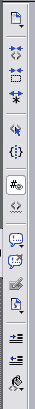
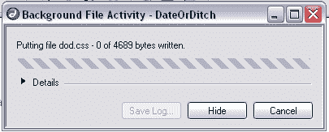
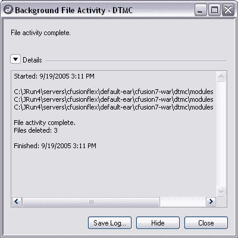

# Dreamweaver 8 已审核

> 原文：<https://www.sitepoint.com/dreamweaver-8-review/>

当我拿到 Studio 8 的评论版时，我立刻把它从令人窒息的收缩包装中拯救了出来。这个盒子看起来确实不错。包装是一流的，比 MX 2004 包装更干净，给人印象更深刻。我把盒子扔在沙发上，抓起我可信赖的笔记本电脑，开始查看 Macromedia 最新最棒的产品。

##### 安装

我决定看看如果我在 Studio MX 2004 上安装 Studio 8 会发生什么。我不确定这个新版本是否会覆盖旧版本，或者与旧版本一起安装，尽管我怀疑它会与旧版本一起安装，我是对的。Dreamweaver MX 2004 立即打开，没有问题。所以，万一你想保留两个版本(我自己也想不出这样做的理由)，你可以这样做而不会有冲突。这个问题回答了，我立即卸载了 Studio MX 2004。回头见，老朋友。

Dreamweaver 8 的用户体验与前代产品基本相同。Dreamweaver 早期版本的用户可以毫无困难地直接跳到版本 8。面板都差不多，位置也一样，工具栏和选项卡也一样。只看应用程序，版本 8 非常像 MX 2004，但相似之处也就到此为止了。在引擎盖下，Dreamweaver 8 是一个全新的怪兽。

##### 丰富

Dreamweaver 8 带来了很多好处。首先，对于开发人员来说，这一部分使 Dreamweaver 比以往任何时候都更接近于一个编码者集成开发环境(它离编码者集成开发环境已经很远了)，事实上，比我希望的更接近。我们有失去的功能(“我们”指 ColdFusion Studio 5 的用户)和新功能，所有这些都有助于我们这些不想要所见即所得编辑器的人更快地编写更好的代码。

***编码工具栏***

gutter 现在拥有大量方便的小部件，这些小部件有助于代码折叠、标记包装、注释插入、选择父标记等等。常见和有用的任务已经放在我们的指尖。下面是编码工具栏的辉煌之处:

***从 Word 粘贴？***

你收到过市场部的文案吗？来自一个有 Word 的用户？Dreamweaver 现在有粘贴和特殊粘贴。你再也不用先清理 Word 疯狂的文本标记了。只需将特殊复制粘贴到位，并从大量选项中选择您希望如何处理格式。您想只保留段落信息吗？完成了。保留字体格式？完成了。选项摆在那里:选择最有效的。

***注释/取消注释***

现在，您想在文档中加入一些预先格式化的注释类型。输入你的评论，选择评论标签的类型，然后 viola:完成了。需要 JavaScript“//”注释？他们在那里。需要多行 JavaScript“/* */”？没问题。ColdFusion 还是 HTML 评论？完成了。VB 的评论也在那里。

非注释功能也很好。选择一段被注释的代码，然后点击“取消注释”按钮来删除注释标签。你不再需要删除开始标签，然后去寻找结束标签。当您对大块代码进行注释和取消注释时，这个特性尤其方便。

***代码折叠***

它回来了！如果你一直在使用 Homesite(或者，但愿不会，CF Studio)，它从来没有离开过；但是对于我们这些从 CF Studio 转到 Dreamweaver 的人来说，我们已经错过了它。

Dreamweaver 8 提供了折叠选定标签或简单地折叠选定文本的功能。我非常想念这个功能很久了。现在我可以折叠整个<cfcase>块，大的<cfif>块和其他块都更容易管理了。</cfif></cfcase>

***工作区***

大大改进的工作区布局使在 Dreamweaver 8 中工作变得非常容易。以前的版本提供了“编码者”或“设计者”布局，差不多就是这样。Dreamweaver 8 附带了四种预定义的布局，但您并不局限于这些布局:您可以自定义布局以满足您自己的特定需求，并将其另存为您自己的布局。这个特性真的很棒——你可以拥有你的窗格、面板等。，都在你想要的地方。内置的双屏工作空间很棒，让它适合我的好恶很容易。我想要的东西就在我想要的地方，它们就在那里，即使我关闭 Dreamweaver 并在以后重新打开它。

来自 O'Reilly 的参考资料也已更新。添加了 XML、XSLT 和 Xpath 的新内容，并对 JSP 和 ASP 的材料进行了彻底修改。现在也支持 ColdFusion 7 和 PHP 5。我现在不怎么写 PHP，但是我听说服务器行为和 PHP 5 参考资料真的很棒！

***标签完成***

最后但同样重要的是，Dreamweaver 8 中我最喜欢的改进功能之一是标签完成功能。我知道:这不是很性感。但是这个标签补全的化身在我看来绝对很棒。最后一个 Dreamweaver 版本的标签完成非常糟糕——至少可以这么说！我不得不完全关闭它。一旦您关闭了开始标记">"，就会出现结束标记，这在处理表格或向现有代码添加标记时非常烦人，因为该标记会自动换行。

这种新的标签完成方法会对您打开的标签进行标记，当您启动“”时，它会为您关闭相应的标签。我知道，这是一个很小的特性，但是它让编码变得简单了一点。无论从哪方面来看，它都不完美，但仍相当聪明。处理条件逻辑有时会欺骗标记完成工具，使它想要关闭一个严格来说不需要关闭的标记。尽管如此，还是比以前好，这总是好的。

##### 新东西

***CSS***

Dreamweaver 为 CSS 提供了强大的新支持。统一的 CSS 面板将使用、学习和掌握 CSS 的所有方面放在一个面板中。现在很容易直观地理解所选元素的样式是如何层叠的。在 Dreamweaver 8 中，样式的渲染也得到了极大的改进，甚至支持高级 CSS，如伪元素和溢出。MX 2004 有一些 CSS 功能，但这个新的 CSS 面板是如此的改进，我认为它是一个全新的功能。

新的与比较实用程序的结合使您可以直接将 Dreamweaver 与许多流行的代码比较工具联系起来，如 Beyond Compare、Araxis Merge 等。就在文件面板中，您可以将您的文件与测试服务器上的版本进行比较。在文件获取和上传期间，如果文件不匹配，Dreamweaver 将向您发出警告，允许您在 Dreamweaver 完成任务之前打开合并工具。

***后台文件传输***

曾经配置过一个站点，使远程站点成为某处的 ftp 站点吗？您是否曾经保存了一个文件，然后不得不等待 Dreamweaver 将它上传到您设置了远程站点的任何位置？不再是了！Dreamweaver 现在提供后台文件传输:

点击“保存”并继续传输——Dreamweaver 将在您工作时传输文件。在您可以回到最重要的代码之前，不再需要等待每个文件上传。既然您可以开始这个过程并继续工作，那么获取和放置就容易多了。抱歉，当 Dreamweaver 将您的文件放在远程服务器上时，您再也没有借口查看电子邮件和与隔壁房间的人聊天了。以下是文件活动日志:

##### 完美，对吧？

这个新的 Dreamweaver 有一个主要的缺点:自从我使用它以来，这个问题就一直困扰着 Dreamweaver 用户。

Dreamweaver 仍然是一个资源贪婪者。它继续消耗大量的系统内存。由于只打开了几个文件，Dreamweaver 使用了大约 60MB 的系统内存。这在今天满是 RAM 的机器上没什么大不了的，但尽管如此，这个程序仍然是一个 RAM gobbler。例如，Eclipse 在打开同样多文件的情况下，使用的内存要少得多。我知道这不完全是苹果之间的比较，但仍然… 60MB？

也就是说，Dreamweaver 8 绝对值得升级。特征集好，稳定性好。这个 Dreamweaver 的最新版本真的没有什么不吸引人的。如果你是一名开发人员，你会高兴地听到，随着第 8 版，Dreamweaver 终于是一个值得开发人员使用的工具。如果你是一个设计师，它仍然是一个很好的设计工具，因为它改进了 CSS 处理功能，使得设计一个跨浏览器兼容的、支持 CSS 的网站变得更加容易。这无疑有助于遍历我自己的 CSS 学习曲线。如果我是电影评论家，我会给 Dreamweaver 8 竖起两个大拇指！

## 分享这篇文章