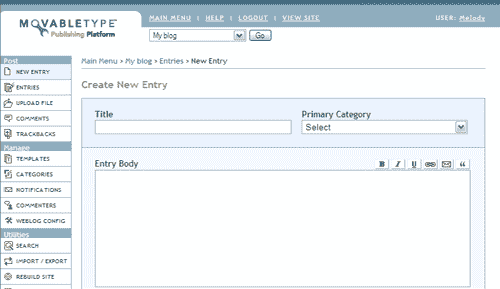
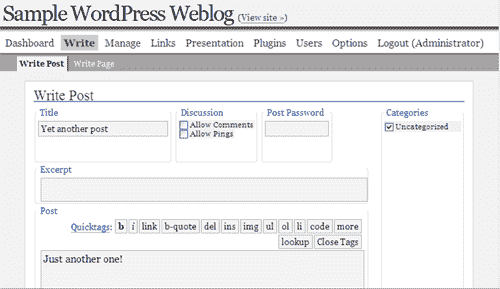
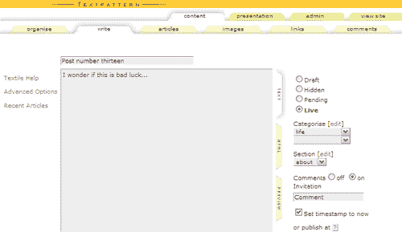
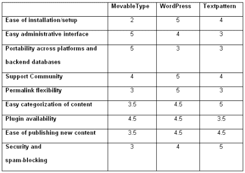

# 博客软件大战:三巨头回顾

> 原文：<https://www.sitepoint.com/blog-software-smackdown-review/>

在过去的几年里，网络日志(或博客)席卷了整个网络。根据维基百科的定义，网络日志是“一个在普通网页上包含定期帖子的网络应用。这些帖子经常但不一定是按时间倒序排列的。”基本上，如果你定期发布内容，博客包可以简化你的发布工作流程。

这篇文章假设你熟悉博客的基本知识，并且想开始你自己的博客；关于博客的更多信息，请参见 Aaron Brazell 的文章[Blogger ' s Primer](https://www.sitepoint.com/bloggers-primer/)。

##### 为什么要有博客？

Web 专业人员的部分工作是跟上当前的技术趋势。即使你从来没有选择自己运行博客，了解博客提供的功能也是很好的，以防客户或你的雇主有一个想法或业务需求，可以通过博客软件包来支持。博客的一些用途包括:

*   个人:一个人可能想要一个博客来帮助家人和朋友了解他们生活中发生的事情。
*   一些博客致力于一个特定的主题，比如政治或计算机硬件。这些通常读起来更像杂志而不是博客。
*   营销:公司开始涉足博客；如果运作良好，这种类型的博客可以成为企业沟通的一个很好的工具，创造关于产品和服务的兴奋感，或者用作内部工具，让员工了解最新的公司新闻。

##### 为什么要用别人的软件？

许多网络开发者会对使用别人的软件嗤之以鼻。当软件与客户的特定需求相差很大时，尤其如此。然而，当谈到博客软件时，没有什么理由害怕使用预先编写的软件包。许多这样的软件包背后都有多年的开发工作；它们不是在一个周末被扔在一起的，并且一直很稳定。

使用预先编写的包的另一个好理由是特性集。任何开发人员都要花几个月的时间来从头开始编写当今顶级博客软件包中的每一个功能。对我们大多数人来说，这根本不是对时间的好利用。此外，如果你选择在网上发表你的作品，你可能会想花更多的时间写作，少花时间编码。

##### 提供什么？

所以，你正在考虑为你的博客使用一个预先写好的包。不过，你可能仍然不清楚外面到底有什么。简而言之，您可以使用两种类型的包:托管服务和自托管包。

***托管服务***

如果你想开始在网上发布，但你没有任何虚拟主机，你可能想寻找一个托管服务来满足你的需求。这些服务包括 [TypePad](http://www.typepad.com/) 、[博主](http://www.blogger.com/)、 [LiveJournal](http://www.livejournal.com/) 等等。

所有这些服务都是为你管理的，所以你永远不必担心你的博客的技术维护:相反，你可以专注于你的博客的内容和外观。您可以在注册帐户后几分钟内启动并运行这些服务，如果您需要在短期内发布，这是非常好的。这些服务中的许多，比如 Blogger，都是免费的，但是有些，包括 TypePad，可能会收取象征性的月费。由于这些服务是众所周知的，并且它们的网站非常详细地解释了它们的产品，所以托管服务将不是本文的主要焦点。

***自主持***

如果你有虚拟主机(或者愿意购买虚拟主机)并且觉得维护你自己的博客的好处大于坏处，你会想考虑一个自托管的包。其中包括[可移动类型](http://www.movabletype.org/)、 [WordPress](http://wordpress.org/) 和 [Textpattern](http://www.textpattern.com/) ，我将在本文中一一回顾。

正如我前面所说的，这些包将要求您执行安装和维护任务。一些主机公司让安装过程变得简单了一些，允许从基于浏览器的控制面板一键安装。请咨询您的托管公司，了解您是否可以使用该功能。与托管服务一样，这些软件包可能免费提供，也可能收费提供，这取决于您选择的软件包以及您使用它的原因。现在让我们来看看市场上的一些主要产品。

##### 活字

[活字](http://www.sixapart.com/movabletype/)是[的 Ben 和 Mena Trott 的创意](http://www.sixapart.com/)。2001 年，Mena 通过手动创建和编辑 HTML 页面来维护网络日志。创建可移动类型是为了使发布和管理她的博客变得更加简单。1.0 版本于 2001 年 10 月发布；撰写本文时的当前版本是 3.17。

***特征***

可移动类型是第一个可用于 Weblogs 的主要包，也可以说是目前使用的最流行的包。它是用 Perl 编写的，Perl 是一种流行的脚本语言，几乎可以在所有操作系统上运行，并且可以使用各种数据库来存储博客内容，包括 MySQL、SQLite、Berkeley DB，甚至 PostgreSQL。大量的插件可以为你的基本安装带来新的功能。

活字挺好管理的。它具有一个模板编辑器，允许你改变你的博客的外观和感觉，并提供一个直观的模板标记语言，以提供对模板上显示的内容类型的更大控制。在审查的三个软件包中，可移动类型具有最简单的管理界面，提供了对常用功能和深入文档的方便访问。此外，在所审查的软件包中，这是唯一一个可以在同一个安装中运行多个博客的软件包。这意味着您可以同时运行许多博客(例如，在一个组站点上，每个成员都有自己的博客)，但是您可以从一个位置管理它们。Six Apart 还提供移动字体的付费支持，这对于那些在公司环境中使用博客的人来说是非常好的。下面是可移动类型管理界面的截图。

***发牌***

可移动类型不像其他被评论的包那样是一个开源项目，但是一个不受支持的个人使用许可是免费的。这个版本的可移动字体限制软件的使用，一个作者和三个博客每次安装。如果你需要更多的作者或博客，或者想要购买支持，包含这些功能的软件版本起价为 69.95 美元。商业、教育和非营利许可证有多种定价级别:查看[可移动类型定价页面](http://www.sixapart.com/movabletype/pricing)了解详情。

***可能的陷阱***

没有博客软件是完美的。由于可移动类型软件无处不在，它也比一些不太广泛使用的软件包更容易成为垃圾邮件和其他攻击的目标。插件可以帮助博客对抗垃圾邮件，任何可移动类型的安装都不应该没有插件。这是因为潜在的垃圾邮件和其他攻击，一些托管公司仍然不允许在他们的服务器上安装可移动类型:检查你的托管公司，看看可移动类型是允许的。

可移动类型的静态出版功能是福也是祸。静态发布的好处是，它为博客提供了网站的物理输出，可以很容易地备份。然而，在静态博客中进行修改，比如修改模板，可能会成为一个乏味的过程，因为在执行另一项任务之前，您必须等待每个文件都被更新。一旦你的博客包含了很多条目，重建它将会花费很长时间。

可移动字体也不幸成为最难安装的软件包。该软件包附带的安装说明很清楚，但是在您可以登录和发布内容之前，需要进行大量的配置。安装可移动字体平均需要一个小时，而其他软件包在 15 分钟内安装完毕。

***例活字博客***

网络上有很多很好的活字博客的例子。以下是一些例子:

*   [中蓝色](http://www.mezzoblue.com/)
*   [Kottke.org](http://www.kottke.org/)
*   [简单比特](http://www.simplebits.com/)

##### WordPress

WordPress 最初是一个叫做 B2 的旧开源包的分支。B2 最初的开发者已经退出了这个项目，所以[马特·莫楞威格](http://www.photomatt.net/)决定使用 B2 包含的代码组成一个新的项目；他称这个项目为 WordPress。像 B2 一样，WordPress 是开源的，这意味着任何用户都可以修改源代码以更好地满足他们的需求。由于它的许可选项和特性集，WordPress 在博客中变得非常受欢迎。WordPress 的当前版本是 1.5.1。

***特征***

WordPress 是用 PHP 编写的，使用 MySQL 数据库来存储内容。这对大多数 Web 开发人员来说都是好事，因为 PHP 是一种流行的语言，而 MySQL 是一种免费的流行数据库。像活字一样，WordPress 可以在各种平台上运行:大多数主机公司已经安装了运行 WordPress 博客所需的一切。

在所有被审查的软件包中，WordPress 是最容易安装的。该安装指南名为[“5 分钟安装”](http://wordpress.org/docs/installation/5-minute/)，名副其实。如果在安装这个软件的过程中一切顺利，你真的可以在五分钟内从零开始写博客。

WordPress 可能是对开发者最友好的软件包，它提供了一个非常可扩展的工作基础，以及各种为你的安装添加功能的插件。WordPress 在表示和管理方面也非常灵活，允许在 URL 风格(搜索引擎友好的链接)、联合供稿和格式方面有许多选项，并提供易于使用的主题和插件管理界面。WordPress 也有现成的更好的垃圾评论管理功能，这将使我们当中有安全意识的人非常高兴。这是它的界面:

WordPress 不仅仅可以用于博客。WordPress 的“页面”功能可以让你创建博客条目结构之外的页面。如果您希望创建的页面不一定与您通常发布的内容相关(例如，公司博客上的“关于我们”页面)，但您希望从熟悉的界面管理这些页面，这将非常有用。有了像页面这样的功能，再加上一点额外的配置，WordPress 可以作为一个成熟的内容管理系统来使用。

***发牌***

WordPress 是根据 GNU 通用公共许可证(GPL)授权的。这意味着你可以自由地修改和发布 WordPress 的源代码，只要你重新发布的代码也是 GPL 许可的。WordPress 可以免费下载。因为它是免费的，所以没有付费支持，但是在 [WordPress 支持论坛](http://wordpress.org/support/)有一个非常友好和活跃的社区可以提供帮助。

***可能的陷阱***

虽然 WordPress 在基础安装中包含了比其他博客包更好的垃圾邮件抵制功能，但由于其庞大的安装基础，它仍然是垃圾邮件发送者的一大目标。建议采取进一步措施打击通过插件发送的垃圾邮件。

对于非技术用户来说，WordPress 可能不是最容易管理的软件包。WordPress 的模板使用 PHP 代码，而不是基于标签的系统，因此对于非开发人员来说，改变 WordPress 博客的外观和感觉可能比其他软件包创建的要稍微困难一些。总的来说，管理界面比可移动字体更适合高级用户。然而，如果你是那种喜欢修补的人，WordPress 可能是适合你的系统。

最后，WordPress 在其官方发行版中没有多博客功能(像 MovableType 提供的那样)。WordPress 的多博客版本已经推出，但是在撰写本文时，它仍然是一个独立的项目，有些人可能会对不使用官方的 WordPress 版本感到不安。

***例子 WordPress 博客***

以下是一些 WordPress 博客的例子:

*   [照片蒙版](http://www.photomatt.net/)
*   [二元盆景](http://www.binarybonsai.com/)
*   [苹果博客](http://www.theappleblog.com/)

##### 文本模式

Textpattern 始于作者迪恩·艾伦的创意。创建 Textpattern 是为了减轻发布 Web 内容的痛苦过程，并使那些不懂 HTML 的人能够轻松地自行发布内容。Textpattern 可用于管理许多不同类型的内容，但它最常见的应用是用于博客。撰写本文时的当前版本是 1.0rc4。

***特征***

像 WordPress 一样，Textpattern 用 PHP 编写，并使用 MySQL 数据库来存储内容，这意味着它可以在 WordPress 可以运行的任何平台上运行(尽管 Textpattern 将 Apache 指定为一项要求，而 WordPress 没有)。这也意味着 PHP 开发人员可以轻松扩展 Textpattern，如果他们愿意的话。然而，真正让 Textpattern 在竞争中脱颖而出的是它对纺织品的整合，以及它的版块特色。

Textile 是一个工具，可以让不懂 HTML 的人轻松格式化网页内容。它的作者将它描述为一个“人性化的网络文本生成器”(有一个关于纺织品的演示)。对于不懂 HTML 的人来说，Textile 只需使用几个简单的字符就可以轻松地将条目格式化为标题、链接、图像、列表等，Textpattern 会将这些字符转换为 HTML 以供发布。对于 WordPress 和 Movable Type 来说，Textile 格式也是可用的，但是对于这些包来说，它不是像 Textpattern 中那样的默认发布方法。这个功能使得非开发人员可以很容易地快速开始编写。

Textpattern 内置的另一个强大特性是 Sections。与大多数普通的类别分类系统相比，章节能够以更好的方式轻松分离各种类型的内容。每个部分还可以使用不同的模板或样式表，并有自己的发布设置，例如该部分中的条目是否显示在首页列表或联合供稿中。如果您使用 Textpattern 不仅仅是为了写博客，这将非常有用。例如，一个 Web 开发人员可能使用 Textpattern 来运行他或她的业务站点，设置一个部分用于投资组合条目，另一个部分用于新闻和公告。

Textpattern 比 WordPress 和 Movable Type 更能抵御垃圾评论。诸如强制评论预览(这意味着你的网站的访问者必须在评论被批准之前预览他们的评论)等功能几乎消除了自动垃圾邮件攻击，而且由于 Textpattern 比 WordPress 或 Movable Type 使用得更少，所以专门针对它的攻击也更少。就个人而言，当我的博客运行 Movable Type 和 WordPress 时，我必须至少每隔几天清除一次垃圾邮件。自从我四个月前迁移到 Textpattern 以来，我没有收到一条垃圾评论。

最后，Textpattern 的默认安装中内置了基本的访问者日志和报告功能。虽然大多数托管公司都提供访客统计，但能够登录 Textpattern 并快速查看最新访客还是不错的。下面是 Textpattern 界面:

***发牌***

Textpattern 是在双许可模式下许可的。对于个人使用，Textpattern 可以免费下载，并根据 GNU 通用公共许可证进行许可。不同的定价和许可模式可能适用于商业用途；查看许可上的[教科书页面，看看您的应用程序是否符合这些要求。](http://textpattern.net/wiki/index.php?title=Textpattern_Licensing)

***可能的陷阱***

虽然 Textile 非常强大，但如果你想让你的内容以某种方式呈现出来，还需要一点学习曲线。起初，这可能会让新用户措手不及，但大多数人都倾向于快速通过学习曲线。

Textpattern 中一个明显的遗漏——mobile Type 和 WordPress 都包括的——是 Trackback。Trackback 是一种技术，当与您的某个条目相关的主题发布时，其他博客可以提醒您的网站。通常，引用通告会附加一个从其他博客到你网站的链接，如果你想成为一个知名的博客写手，这很有用。然而，Trackback 的缺点是它可能被滥用于发送垃圾邮件的目的，因此您可以通过不必管理无关的评论来节省时间。

最后，在撰写本文时，Textpattern 的最新版本仍然不稳定:它是一个发布候选版本。如果你是那种必须使用稳定软件版本的人，那么你可能需要再等几个月才能有信心使用 Textpattern。

***示例 Textpattern Weblogs***

下面是一些 Textpattern 博客的例子:

*   迪安·艾伦
*   [厄里斯免费](http://www.erisfree.com/)
*   [乔恩·希克斯的吻痕设计](http://www.hicksdesign.co.uk/)

##### 包扎

这些系统中的每一个都有其良好的特性，以及可能不如竞争对手所提供的那样完善的特性。下面是考虑的软件包的并排比较，基于大多数网络专业人员在博客软件系统中寻找的标准。排名基于 1 到 5 的等级，5 为最高。

***哪个包是对的？***

如果你把上面的评分加起来，评估更倾向于 WordPress 而不是 Movable Type 和 Textpattern，但是重要的是要记住没有一个软件包是适合所有人或所有类型内容的。这些产品的不同强度使得每一种都特别适合特定的环境。下面是一个快速解释的情况下，每个包可以把它最好的利用。

可移动字体虽然是垃圾邮件最容易攻击的目标，但在许多情况下却是唯一的选择。如果你需要最简单的管理界面，或者你需要从一个地方管理多个博客，没有比这更好的方法了。

如果你不能使用 MySQL 作为你的数据库，可移动类型也是你在三者中唯一的选择:它是唯一支持多个数据库系统的选择。最后，可移动字体最适合那些重视从单个公司获得支持和责任的人——这是开源解决方案无法获得的。只要确保你的主机允许你在他们的服务器上安装可移动字体。

WordPress 对于技术爱好者来说是一个很好的软件包。如果你是一个喜欢修补应用程序内部的 PHP 开发人员，那么 WordPress 可能正合你的胃口。如果你想通过与动态内容相同的界面管理静态内容，WordPress 也是最合适的选择——这要感谢它的 Pages 功能——并且它的配置选项的灵活性和简单的设置，使 WordPress 很难被击败。

我选择的系统 Textpattern 最适合那些主要目的是发布内容而不是维护博客安装的人。对于那些不想处理垃圾评论的人来说，它也可能是首选的软件包，代价是失去发送和接收引用通告的能力。Textpattern 也非常适合一般的网站管理，因为它有方便的 Sections 特性。

我审查的软件包没有一个在所有情况下都比其他的好，尽管有些确实比其他的更适合某些情况。如果你的博客符合我为一个特定的包列出的标准，那么你应该考虑一下。否则，把它们都试出来，看看哪一个最适合你。正确的软件包应该能够优化您的 Web 内容发布的生产力:这才是最重要的。

## 分享这篇文章