# 启发你下一个界面的 14 个顶级科幻设计

> 原文：<https://www.sitepoint.com/14-top-sci-fi-designs-to-inspire-your-next-interface/>

界面设计已经有 50 多年的历史了。

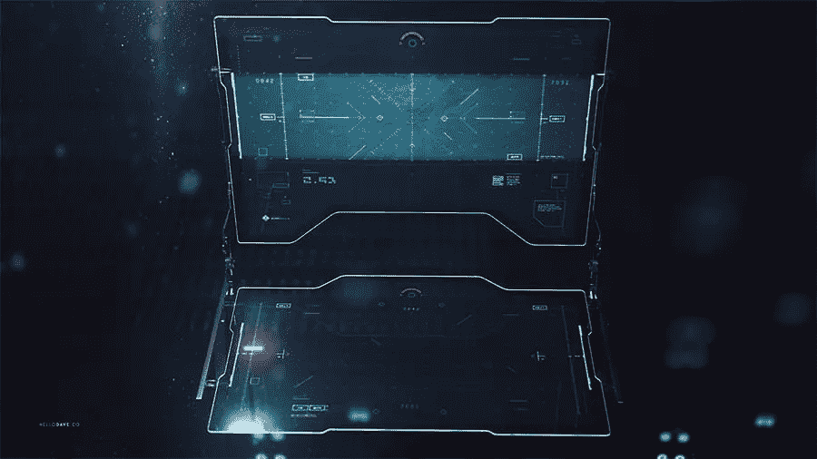
[*形象功劳*](https://www.artstation.com/artwork/gVEBE)

第一个 GUI 是在 1968 年末为 T2 NLS T3 计算机协作系统设计的。从那以后，硬件变得越来越先进，允许我们制作像今天一样棒的图形用户界面，或者将来某一天会这样…

你还记得《黑客帝国》中的这一幕吗？

[https://www.youtube.com/embed/ZPPBzmn6Fh4?feature=oembed](https://www.youtube.com/embed/ZPPBzmn6Fh4?feature=oembed)

或者托尼·斯塔克徒手操作的恐怖界面…

[https://www.youtube.com/embed/mRi1dmFgRfo?feature=oembed](https://www.youtube.com/embed/mRi1dmFgRfo?feature=oembed)

但即使在 60 年代和 70 年代，人们也梦想着像我们今天这样的界面，他们在科幻电影中找到了自己的位置，如 1968 年上映的“2001:太空漫游”。

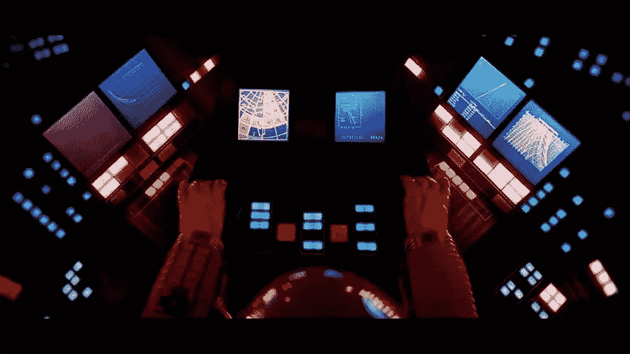

众所周知，科幻电影是通向未来的一扇窗户。许多仅在几十年前拍摄的梦幻技术已经可以使用，可以在我们的口袋或手腕上找到。

科幻电影里的电脑界面可以是真正的杰作。让我们来看一些电影，我会向你展示一些界面的例子，你可以在设计另一个仪表板或[网站模板](https://www.templatemonster.com/website-templates.php?aff=AllaTaff&utm_campaign=blog_site_sitepoint&utm_source=03.21.2018_guestpost&utm_medium=scifi)时用作灵感。

我们开始吧。

## [盲目](http://www.blindltd.com/)

我名单上的第一个是设计工作室[盲人](http://www.blindltd.com/)。

众所周知，他们是世界上最顶尖的创意设计工作室之一，在用户界面设计方面拥有丰富的专业知识。他们为我们都看过的电影创造了界面。查看它们:

### [正义联盟](http://www.blindltd.com/justice-league)

“人们太慢了……”——我想知道要过多少年我们才能得到类似的界面？

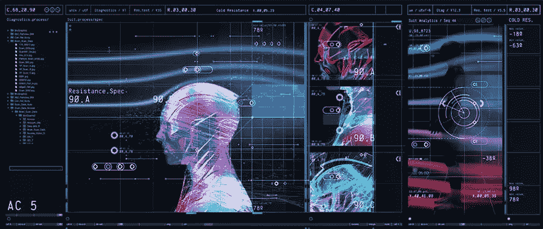
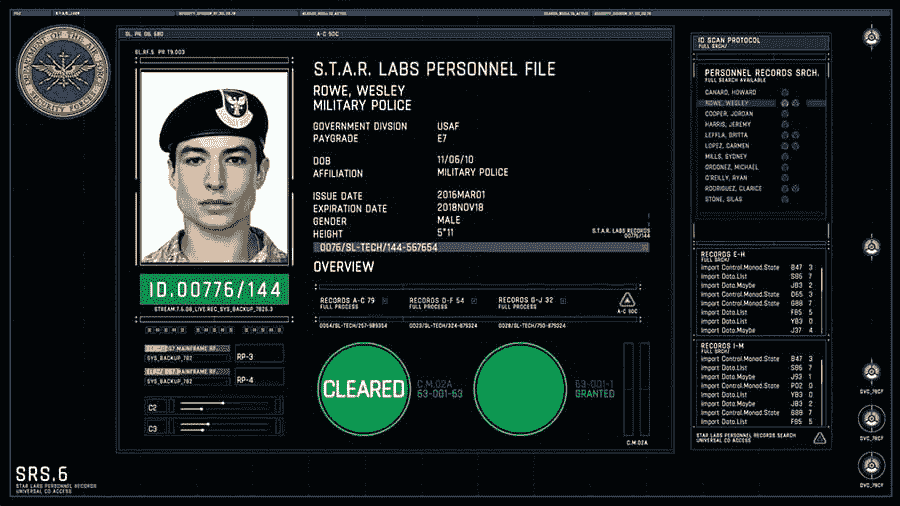

### [黑暗骑士崛起](http://www.blindltd.com/the-dark-knight-rises)

当你成为亿万富翁时，你就有能力拥有自己的 UX 部门，不是吗？

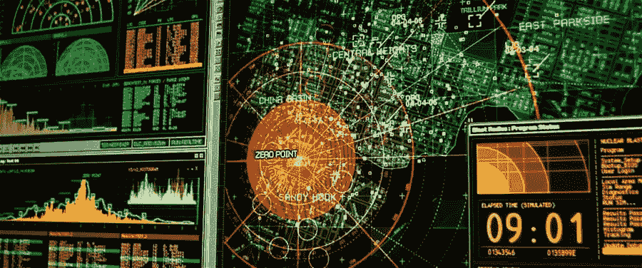

### [第五等级](http://www.blindltd.com/the-fifth-estate)

也许将来我们会从典型黑客的桌面上拿走一页。

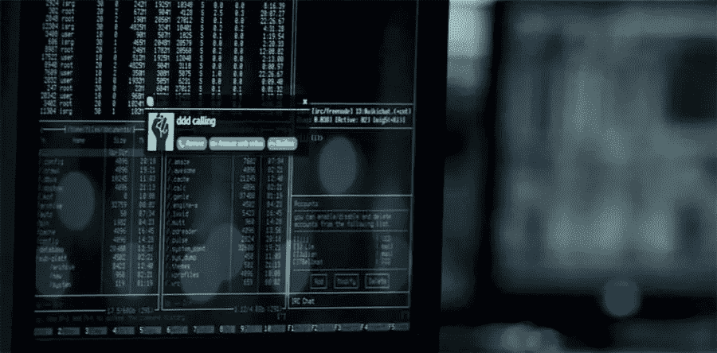

### [黑暗骑士](http://www.blindltd.com/the-dark-knight)

当你正在追捕罪犯，并且感觉 24/7 都很紧张时，一个绿色的、舒缓的配色方案肯定会对你有所帮助。

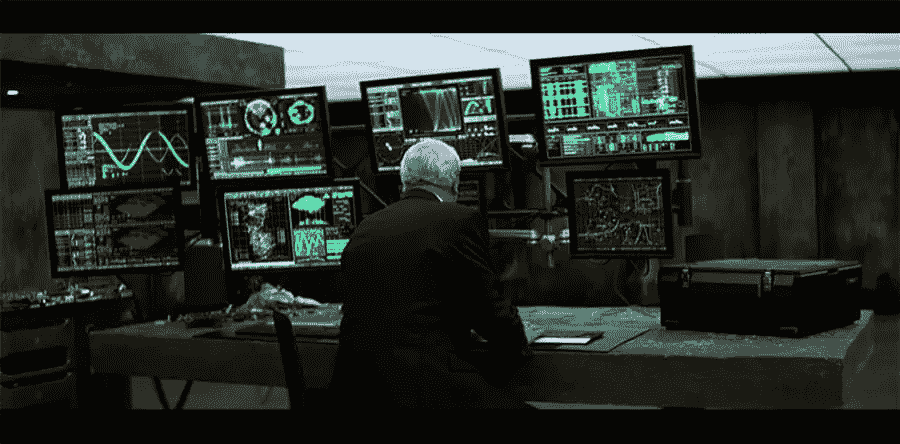
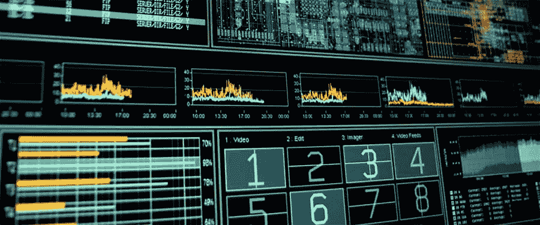

### [厄运](http://www.blindltd.com/doom)

即使游戏《毁灭战士 4》在这部电影之后差不多 12 年才发布，界面看起来还是和你在这部电影中看到的一样。

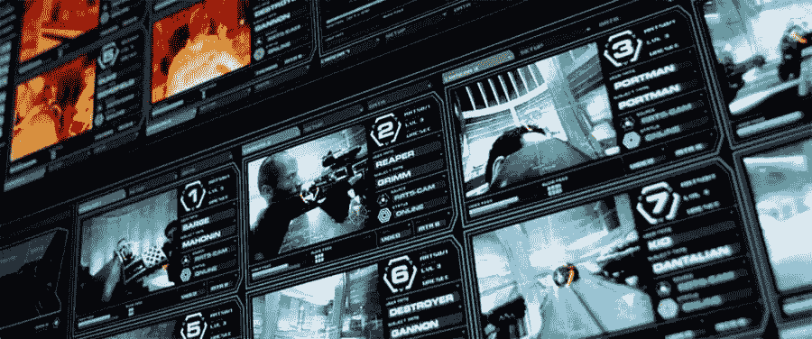
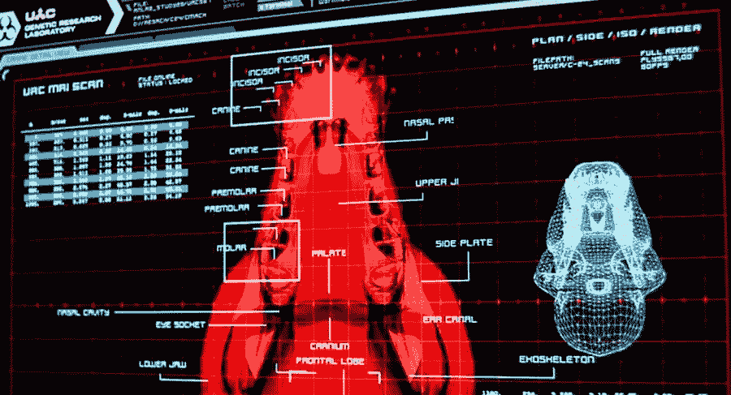

### [星球大战外传：侠盗一号](http://www.blindltd.com/rogue-one)

《星球大战》传奇中的标志性界面真的很少。也许乔治·卢卡斯是对的，极简界面就是未来？

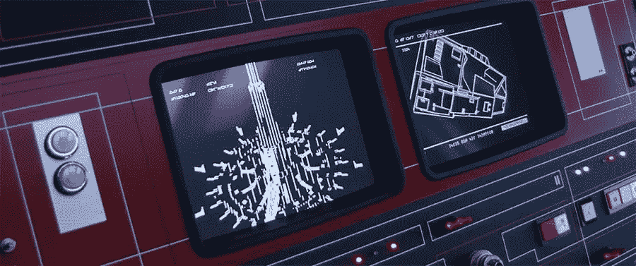
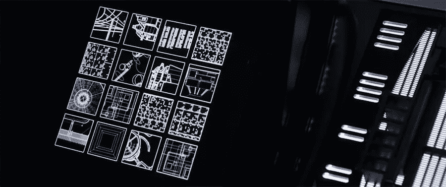

### [静音](http://www.blindltd.com/mute)

大多数最近的网飞原作都有一些共同点。一个让你想杀又想抱的主角，还有牛逼，超赞的界面。如果你看过《静音》或《改造碳》，你就会明白我的意思。

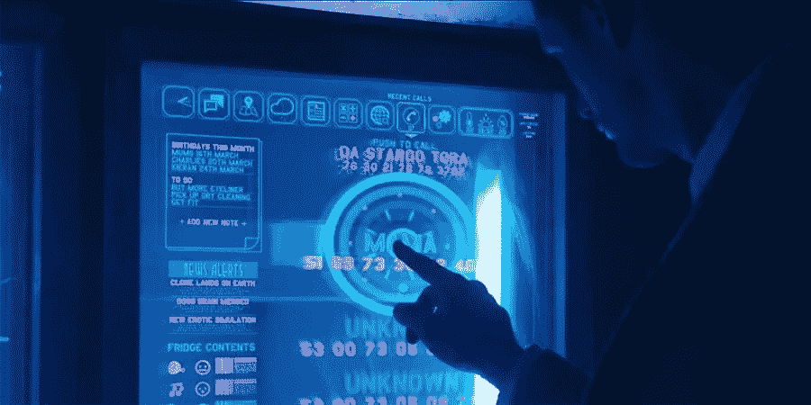
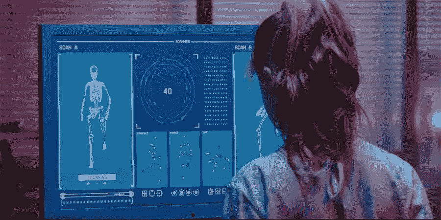

## [Spov](http://www.spov.tv)

下一个创意工作室是 [Spov](http://www.spov.tv) ，它以设计和制作以下电影的多个场景而闻名。

### [奇异博士](http://www.spov.tv/portfolio/doctor-strange/)

在我看来，这部电影的界面达到了奇怪的傲慢和自我的水平。

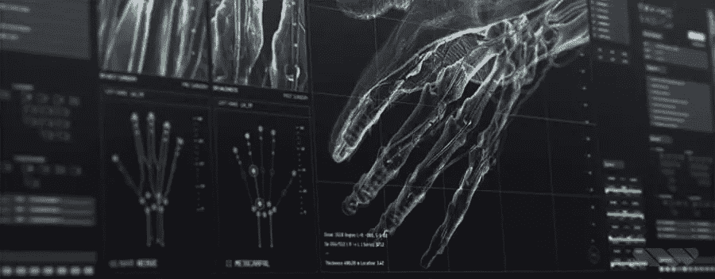

### [碟中谍:流氓国家](http://www.spov.tv/portfolio/mission-impossible-rogue-nation/)

如果有一天人们能够在自己的平板电脑上使用可视化界面入侵一个超级保护设施的冷却系统……我想如果比特币没有达到每枚 100 万美元，我会做约翰·迈克菲承诺要做的事情。

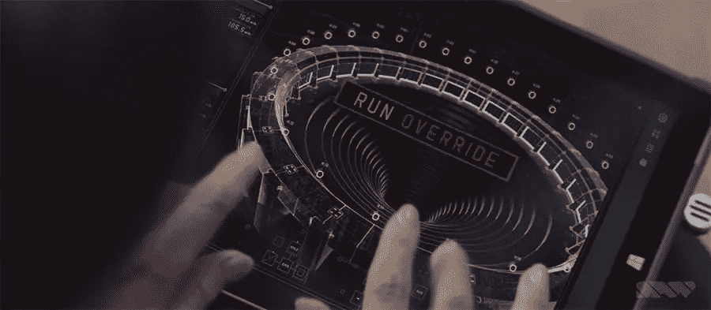
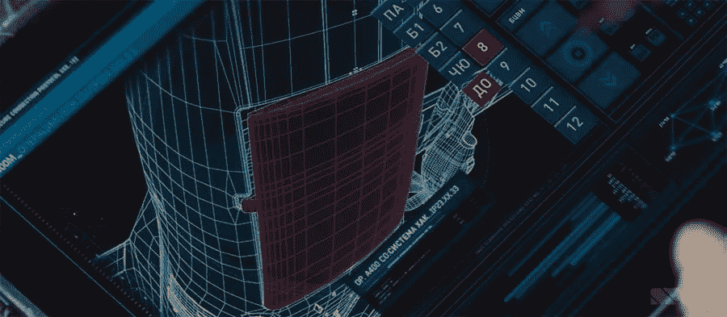

### [人生](http://www.spov.tv/portfolio/life/)

很长一段时间以来，我一直在管理一个用 Drupal 构建的网站，这部电影中的某些界面对我来说就像是 CMS。

## 克里斯·基弗

名单上的下一个不是机构而是一个人。请见见克里斯·基弗，他为 20 多部故事片设计过界面。

以下是他的投资组合中最显著、最鼓舞人心的例子。

### [乘客](http://www.imdb.com/name/nm2750333/?ref_=fn_al_nm_1)

一部电影，一个男人意外地从沉睡中醒来，然后醒来的是另一个他爱上的女人。

由于电影中的事件发生在遥远的未来，所有的界面都应该看起来很未来，我认为克里斯做得很好。

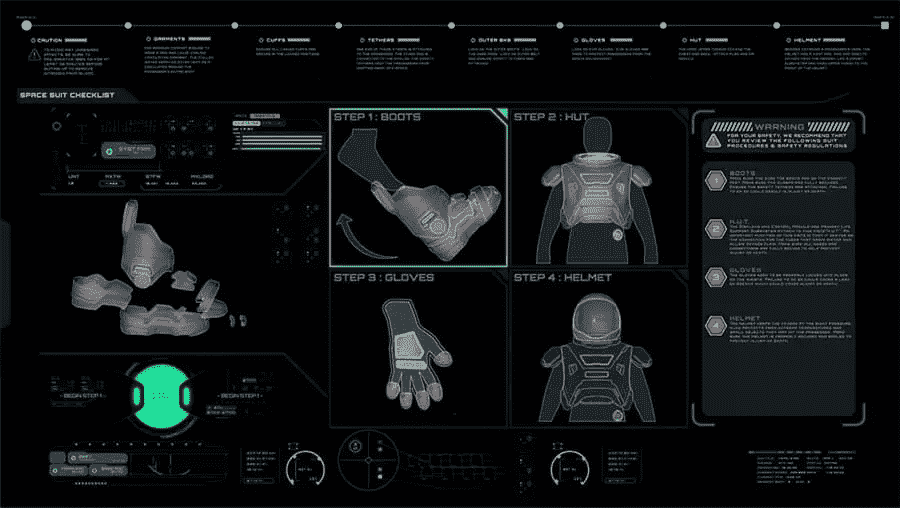

### [星际](https://www.chriskieffer.com/fuiinterstellar/)

他作品集的另一个项目，一部让很多男人流泪的电影。讽刺程度 85%。

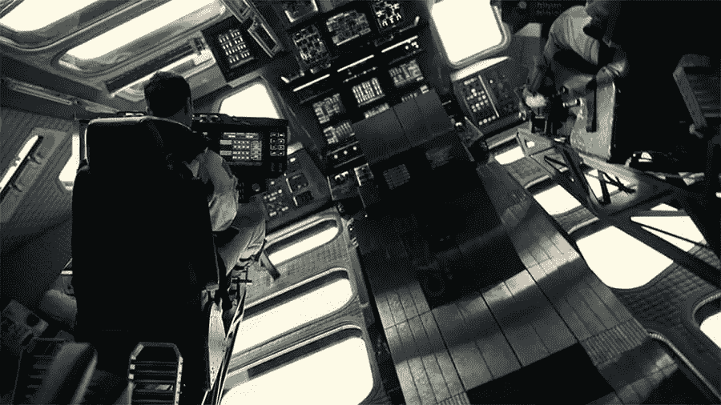

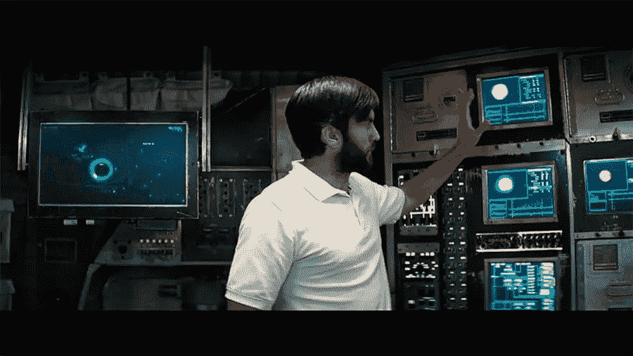

### [树林中的小屋](https://www.chriskieffer.com/cabin-in-the-woods/)

如果我是你，我不会去碰某个偏僻小屋里地下室的东西。

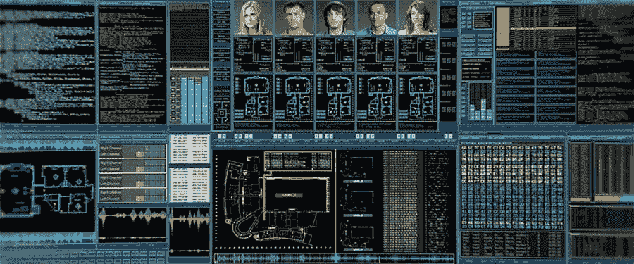

### 独立日:复兴

我很好奇——外星人有 USB type C 吗？

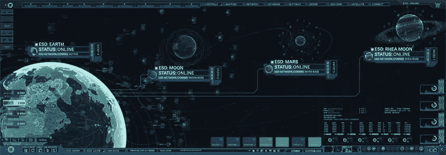
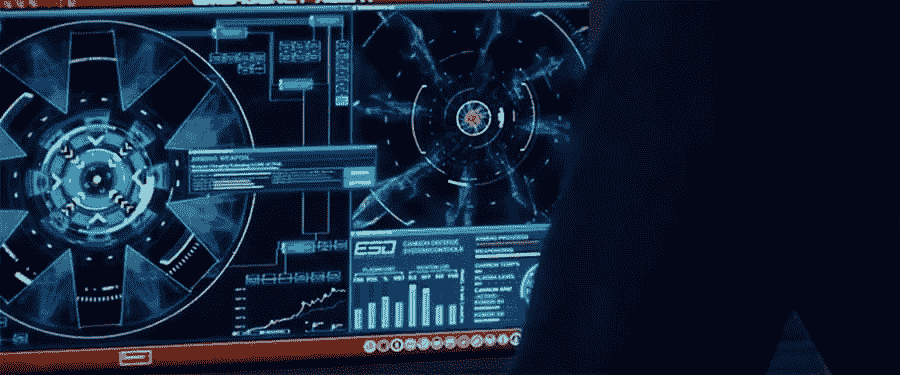

## 所有这些界面有什么共同点？

他们的设计师不得不专注于视觉美学，在扔掉尽可能多的文字的同时，添加尽可能多的图表。

所有的界面都集中在定义 **WIMP** ( *窗口、图标、菜单和定点设备*)范例的四个方面。

所以，如果你打算设计另一个管理主题，请记住，就像女人用耳朵来爱一样，大多数网络用户用眼睛来爱。你的设计不仅要开胃，而且要直观、干净。

## 轮到你了

设计师从他们周围的物体中寻找灵感——纹理、颜色、剥落的油漆、各种表面上的裂缝……你认为所有这些矢量共享和其他资产来自哪里？

他们观察、拍照或扫描——你呢？如果你需要设计一些很棒的仪表板模板，只需去网飞，打开科幻和幻想类型，选择一部电影。当你放松的时候，你会有一个完美设计的想法。记住——为了有一个好主意，你需要放松！

## 分享这篇文章