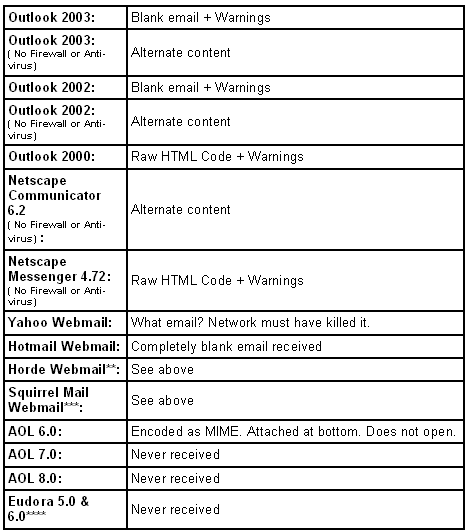

# 富媒体电子邮件最佳实践

> 原文：<https://www.sitepoint.com/rich-media-email-best-practices/>

2 年前，人人都想这么做；似乎没有人能正确地完成它。快速电子邮件日界线现在:见上文。

几年前，我们对 Flash 电子邮件、那些推动富媒体技术的承诺以及那些讨厌的小东西(如“电子邮件客户端”或“防火墙”)进行了长时间的认真研究。

##### 简言之

目前，Flash 电子邮件在很大程度上仍是一种企业级解决方案。有很多营销人员说他们可以设计 Flash 电子邮件；有很多说可以送的。但是很少有人能保证任何一个大群体都能看到它或者与之互动。我亲自测试了我能找到的几乎每一个演示、样本、预览或其他“测试”,但在我日常使用的电子邮件客户端(Outlook 2000–2003 和几个基于 Web 的电子邮件客户端)中，没有一个 Flash 内容能 100%正确显示。

没有。零。一无所获。没什么。我收到了乱码内容，或“替代”内容，如链接、静态图像或. gif。

因此，正如你所看到的，大多数声称能够专门从事 Flash 电子邮件的提供商实际上只是专门从事替代内容的交付。任何人都可以设置一个“最佳情况”场景作为演示。

##### 了解你的收件人

现在，我并不是说这些供应商没有把价值返还给他们的客户。然而，对于希望在某种程度上利用 Flash 电子邮件的普通开发人员、设计人员或商务人员来说，这并不那么简单。其中一些企业吹捧他们的快速电子邮件解决方案是万无一失的；他们说，“99%的收件人都有 Flash”，这意味着 99%的收件人将在他们的电子邮件客户端中正确接收您的 Flash 电子邮件。然而，正如我们将看到的，这种暗示是不正确的。

以下是我们运行的 Flash 电子邮件测试的快速运行，使用一个启用程序向系统无法显示 Flash 的用户提供替代内容(GIF 图像)。我们把它发给了 26 个不同的电子邮件客户端，这些客户端都在我们的“实验室”里。以下是一些主要的电子邮件客户端结果:

所有电子邮件客户端都被设置为接收 HTML 电子邮件，Windows XP Professional SP2。安装了最新版本的 Flash。

***这是一个常见的“带皮肤的”基于 Web 的电子邮件客户端，在许多托管包中都很常见。
***这是另一种常见于网络主机的基于网络的电子邮件客户端。
****这个特定的客户端运行“选择电子邮件”垃圾邮件过滤。*

而这只是一个人的考验！在你成功收到电子邮件的过程中，可能会出现很多不确定因素，包括:

*   安全设置
*   浏览器限制
*   防病毒软件
*   系统防火墙
*   ISP 的防火墙
*   电子邮件客户端
*   操作系统，或您可能在此过程中安装的任何第三方软件(电子邮件转发、垃圾邮件拦截器、动态域名系统等)。)

关键是，即使在非常受控的情况下，Flash 电子邮件也不会真的运行得很好。

##### 做正确的事

这并不意味着你应该全盘放弃富媒体电子邮件、活动或其他营销理念。越来越多的公司似乎正在采用富媒体电子邮件的混合方法，这是设计师和开发人员可以通过更多地考虑信息而不是媒体来帮助他们的客户的地方。

关于这个话题的第一篇文章中提出的许多最佳实践似乎已经被电子邮件和 Flash 电子邮件营销人员广泛采用:向你致敬！只需在谷歌上运行[搜索“快速电子邮件”](http://www.google.com/search?hl=en&ie=UTF-8&q=flash%2Bemail)，看看会出现多少采用相同做法的结果。

如果你正在设计一封快速邮件，考虑以下几点。

***使用一个动作，如“点击此处”按钮，启动即时电子邮件。***

这是可取的，因为预览窗格、Outlook 提醒和任何数量的其他电子邮件客户端怪癖将:

1.  立即开始播放邮件。

3.  不仅在预览模式下开始播放邮件，而且在打开邮件时播放同步副本(邮件变成了噪音墙，这是一个糟糕的营销信息)。

5.  开始播放电子邮件，只是让收件人稍后注意到，当他们错过了一半的信息。

一句简单的“点击此处播放此消息”就能让你的消息达到预期的效果。

***动画 Gif +点击通过到 Flash =有效。***

没有什么可以取代结合 Flash 元素的精心设计的 HTML 电子邮件和文本广告的价值。为什么不尝试一个引人注目的动画。gif 文件有一个“行动号召”,提示您的收件人点击进入您的网站？

***追踪它。研究一下。改进它。***

不要把自己局限于只跟踪邮件的打开，或者 HTML 链接的点击。Flash MX 2004 允许轻松跟踪 Flash 文件中的交互；或者，获取一个类似于 [APT Launcher](http://www.proposalkit.com/kits/devtools.htm) 的副本，它可以为您聚合更大项目中的数据。如果您的所有点击都是由 HTML 版本生成的，那是一回事，但我会插入额外的数据点来跟踪更“生硬”的指标:

1.  用户什么时候厌倦了停止 Flash 演示？

3.  他们什么时候变得足够感兴趣来点击进入？

5.  闪存文件是否正确启动？(放置一个当 Flash 成功播放时开始的数据点。)

7.  Flash 文件在停止/退出/崩溃等之前播放了多远。？(插入大量数据点。)

***不要试图在电子邮件中完成交易***

没有人在电子邮件中完成销售；没有人通过电子邮件填写抵押贷款/保险/胃灼热药物申请表，所以不要试图设计会产生这种回应的电子邮件。您希望收件人点击进入您所有正常的、“稳定的”动作和事件应该发生的网站。如果你正在考虑投资 Flash 或 HTML 电子邮件，这应该是因为你已经把你的网站变成了一个精简的，平均收入或线索生成机器，你可以确保:

*   Flash 电影将完美播放。
*   联系方式和订单都设置好了。
*   数据收集设备正常。
*   没有什么是靠运气或收件人的电子邮件客户端来决定的。
*   没有任何东西会“丢弃”收件人的计算机或篡改信息，也不会将您或您客户的品牌与此类错误联系起来。

*【编者按:为什么唯一似乎毫发无损地通过的东西是徽标或公司网址——就像一个巨大的“指责灯塔”？]*

##### 这是报价，傻瓜

是的，你已经知道了这一点:停止用愚蠢、无聊、空洞的东西来烦你的收件人。接受这样一个事实:你只能让“抵押贷款”这个词在日常生活的背景下显得如此突出。

我们最成功的 Flash 电子邮件活动是一个动画。用一款病毒游戏作为“优惠”的 gif。游戏呈现如下:

1.  已发送文本/HTML 电子邮件；收件人要么看了动画。我上面描述的 gif 邮件，或者一封简单的文本邮件，告诉他们关于游戏的事情。

3.  我们设计了这个游戏，这样它就不会出现在邮件正文中。你不能控制收件人的电子邮件客户端，也不应该试图这样做。

5.  我们的电子邮件系统记录了打开次数、点击次数等。—电子邮件营销活动的所有常规指标。

7.  这个游戏是在我们的网站上玩的；“转发给朋友”功能位于游戏下方的网页上。

9.  Flash 文件是用 Flash 跟踪软件编码的，该软件记录了内部指标，包括独特播放次数、重复播放次数、我们网站的点击率等。

11.  优惠券代码被绑定到订单系统中，以标记折扣并进一步跟踪销售。

13.  游戏本身包含了一张 10%折扣的优惠券，并被设计成在用户玩的时候向他们展示我们的信息。这张优惠券展示了我们的品牌和理念，即没有合同的工作会损失你的时间、金钱和利润等。

15.  一个附属系统记录了访问和销售的 cookies 和服务器端跟踪。

结果如下:

*   该游戏通过电子邮件发送给了 12，890 名收件人。
*   6879 打开了邮件。
*   游戏点击率为 4990。
*   该邮件被转发了 512 次。
*   该游戏从网页上被转发了 217 次，转发给了 534 人(多个电子邮件字段)。
*   重要的是，这个游戏被玩了 187900 次。
*   更重要的是，这款游戏创造了 512 笔销售额、40 个新会员、一些新的时事通讯注册、多个业务合作伙伴、新的服务客户以及一种全面的可量化成功的普遍感觉。
*   更重要的是，游戏产生了我们无法完全追踪的品牌知名度和销售额:电话销售、延迟销售、通过代销商的销售等等。

如果您没有资源部署企业应用程序来满足您的 Flash 和富媒体电子邮件需求，这就是您需要的地方。没有什么可以取代一个深思熟虑的活动，优惠，或营销创意。没有理由为什么你不能集中更多的时间、金钱和努力来改进你的信息和提议，而不是采取一种更“华而不实”的方法。

这两个链接提供了一些重要的附加信息:

*   [案例研究跟进:简讯和电子邮件](http://www.clickz.com/experts/em_mkt/case_studies/article.php/3100101)
*   [Fun @work:办公室病毒式营销](http://www.clickz.com/experts/em_mkt/case_studies/article.php/3359071)

## 分享这篇文章