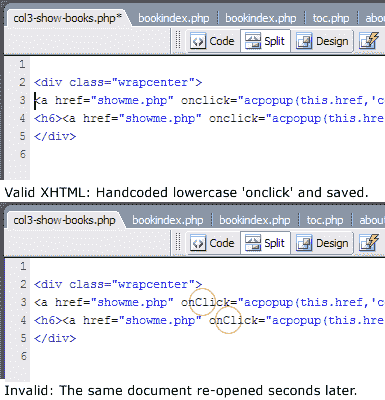
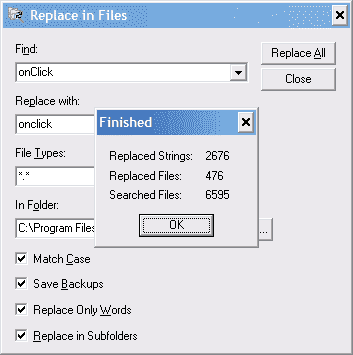

# 修复 Dreamweaver 中的“onClick”

> 原文：<https://www.sitepoint.com/fixing-the-onclick-in-dreamweaver/>

这是来自“用炸药钓鱼”部门的 Dreamweaver 提示。

尽管 Macromedia Dreamweaver 不是所有任务的理想工具，但它是非常有用的工具。

然而，它有一个特别讨厌的小习惯，已经困扰我一段时间了——一个令人愤怒的嗜好，自动和强制地将我完全有效的“onclick”属性转换为完全无效的“onClick”属性。据我所知，任何时候在 Dreamweaver 中打开一个有效的 onclick，它都会用 onclick 中的大写字母 C 重新解析页面。我已经搜索了设置或偏好来禁用它，但无济于事。

当然，从技术上来说，良好的“不唐突的 JavaScript”实践会指示我无论如何不应该在我的 XHTML 中使用“onclick”。没有争论。我们不会在网站上写任何新的，但是这需要一个渐进的过程来改装我们的一些旧系统。与此同时，我变得“非常暴躁”,每次我修复页面上的一个小错别字时，我都不得不在“onClick”上用 *find &替换*——更不用说当我们认为我们的队伍中有一个*大写的邪恶分子*时，引发的不和谐和指责了。

**我的解决方案**

我曾短暂地考虑过在 Dreamweaver 的文件夹结构中寻找有罪的文件，但面对成千上万的文件，这看起来需要几个小时。我决定采用蛮力攻击。这种方法有一定的风险，除了对我有效之外，我不做任何保证或承诺。

1)首先，我制作了一份“Dreamweaver MX 2004/Configuration”文件夹的副本，并将其放在一个安全的地方——如果它全部变成梨形，这就是我的救赎。

2)我已经用了 Emurasoft 的[‘在文件中替换’(他们的小文本编辑器也是一个小小的宝石)。这是免费的，快速和工程，但你可能会喜欢一个类似的应用程序。你的电话。](http://www.emurasoft.com/replall/index.htm)

3)我将它设置为查找' onClick= '并用' onclick= '替换它。我不知道我的目标是什么类型的文件，所以我将文件类型设置为' * '。*-所有文件。我还打开了“*区分大小写*”选项和“*搜索子文件夹*”和“*仅匹配单词*”选项。

4)最后，我把它指向 Dreamweaver 的“配置”文件夹，交叉手指，闭上眼睛，点击“全部替换”。

一分钟后，它完成了对该文件夹中近 6600 个文件的扫描，如您所见，它发现了 2676 处“onClick ”,并修复了近 500 个文件。大口喝。这比我想象的要多…

然而，我很高兴地报告，它不仅明确地修复了问题，而且我没有副作用、损坏或其他问题要报告。

当然，也许我只是还没找到他们。

毫无疑问，对于这个 bug 有一个更优雅的解决方案，但是如果这对你来说是一个问题并且你觉得很勇敢，..

## 分享这篇文章