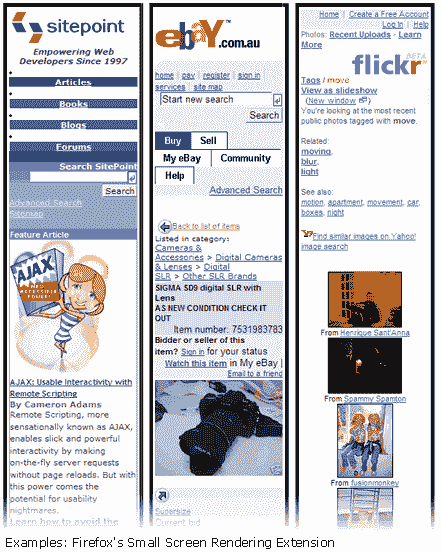

# FireFox 中的小屏幕测试

> 原文：<https://www.sitepoint.com/small-screen-testing-in-firefox/>

一两个月前，我写了一篇关于在设计视图中测试智能手机和 PDA 的小文章。本质上，这篇文章是一个更著名的小屏幕模拟器的框架。

今天我发现我忽略了一个相当方便的选择——特别是如果火狐是你选择的武器——颠覆性创新的[“小屏幕渲染 XPI 的‘扩展’](http://disruptive-innovations.com/products/index.html)。虽然它似乎已经存在了很长时间，但似乎被大多数开发人员忽略了。

不要寻找华而不实的东西。安装后，你会注意到的唯一变化是你的“视图”菜单中的一个额外选项——“小屏幕渲染”，结果与 Opera 的小屏幕模式没有什么不同。

在这一点上，Opera 选项可能在技术上更有用，如果只是因为它可以向您展示*您的页面将如何在使用 [Opera for Mobile](http://www.opera.com/products/mobile/) 的 PDA 和智能手机中呈现——这是相当重要的少数。*

 *由于 Mozilla 的移动产品(MiniMo) 仍在开发中，火狐的“小屏幕渲染 XPI”只能给你一个普通小屏幕设备如何处理给定页面的“最佳猜测”。

最终，没有一个模拟器可以向您展示一个页面在所有设备上的外观，但是这个扩展仍然是一个不错的起点。* 

## *分享这篇文章*