# 你对火狐一无所知！

> 原文：<https://www.sitepoint.com/firefox-secrets/>

如果你觉得网络失去了光彩，那可能是因为你在旧浏览器中苦苦挣扎。我在另一边，这里的草不仅更绿:没有那些引起严重皮疹的微小草虫！

##### 火狐秘密

这段节选自 Cheah Chu Yeow 撰写的 SitePoint 新发布的 [*Firefox Secrets*](https://www.sitepoint.com/premium/library) 。火狐正在彻底改变人们浏览网页的方式。不要被落下:给自己拿一份 *Firefox Secrets* 并成为革命的一部分！

该标题包含了超过 290 页的 Firefox 技巧、诀窍和窍门，提供了宝贵的指导，帮助您根据自己的偏好定制浏览器。

它从一些更著名的调整开始，比如搜索定制和收藏夹、密码和历史管理。但后面的章节甚至挑战了最坚定的火狐爱好者，揭示了 Web 开发人员扩展、RSS 订阅和鲜为人知的 about:config 接口的内部工作原理。

这个示例应该能让您体验一下这个动作。它从第 2 章开始，基本浏览特性，概述了任何 Firefox 用户都应该使用的必备功能。然后，我们跳到第 6 章“技巧、诀窍和诀窍”和第 7 章“Web 开发天堂”中的示例，通过这两章，您可以卷起袖子，亲自动手调整这个强大浏览器的幕后功能。为了找到更多关于*火狐的秘密*，[请访问这本书的信息页](https://www.sitepoint.com/premium/library)，或者查看[整个出版物的内容](https://www.sitepoint.com/premium/library)。和往常一样，如果你愿意，你可以[下载 PDF 格式的摘录](https://www.sitepoint.com/show-modal-popup-after-time-delay/)。现在，到第二章。

##### 第二章。基本浏览功能

这一章是关于以一种新的风格浏览网页。我们将研究 Firefox 的主要特性，并向您展示如何使用它们。您将学习如何更有效地浏览网页，减少干扰。你还会看到如何(如果你愿意的话)摆脱一些可能阻碍你的旧的网络冲浪习惯；窗口管理习惯和网页搜索习惯是两个非常重要的例子。甚至可能有吸引人的模特的照片，有男有女。好吧，没有模特。让我们一起探索火狐吧！

##### 选项卡式浏览

标签式浏览被《华尔街日报》的记者 Walter S. Mossberg 称为“自切片面包以来最好的东西，也是多年来网络浏览最大的根本性改进”。它也被批评，拒绝，并被贴上无用的非创新的标签。你一定想知道标签式浏览有什么大不了的，哪个观点是正确的。你可能也很好奇，作为你无畏的作者，假装知道什么对你最好，我站在哪一边。你很快就会知道了！

如果你对标签式浏览不熟悉，你可能陷入了某种老式的网上冲浪模式。也许你点击了一个有趣的链接，等待该链接加载，然后当你读完那个新页面时，按下后退按钮。或者，当您没有时间等待新页面加载时，您可以右键单击(或在 Mac OS X 上右键单击)超链接并选择在新窗口中打开。

不管怎样，当你看到标签式浏览是如何有效地消除等待和不必要的前后跟踪时，你会大吃一惊的。您可能会想，在一个窗口中一次浏览一个网页，您怎么会感到满意。那些已经迈出这一步的人可能仍然需要一些说服力来解释为什么标签式浏览比多窗口浏览更好。我是来鼓励你考虑好处的。

让我们来学习关于在 Firefox 中使用标签式浏览的一切。但请记住:你不是被迫使用它。如果你更喜欢每个网页只有一个窗口，那么这就是你的选择。但是，不要否认自己有更好的选择。

***一段短暂的历史和一个警示***

选项卡式浏览并不是什么新想法；事实上，它不是 Firefox 发明的。NetCaptor 很可能是这种方法的先驱，它是一个为 Internet Explorer 提供另一种选项卡式浏览界面的第三方程序。Mozilla 应用程序套件紧随该工具之后，最近 Opera 也紧随其后。Opera 开发了多文档界面(MDI)，和选项卡式浏览的选项卡式文档界面(TDI)不一样；Opera 在 Opera 7.60 预览版 3(及以后版本)中增加了仿标签式浏览界面。Firefox 作为 Mozilla 应用程序套件的衍生产品，自然继承了它的标签浏览功能。当然，像 Microsoft Excel 这样的电子表格工具在工作表显示区使用制表符已经有很长时间了。

目前，大多数图形浏览器都支持选项卡式浏览。一个快速的(不完整的)标签浏览器列表显示:Firefox、Opera、Mozilla、Safari、Konqueror、Netscape、OmniWeb 和 Camino。此列表不包括 NetCaptor、Maxthon、Avant Browser 和 Crazy Browser 等程序，这些程序为 Internet Explorer 添加了选项卡式浏览功能。唯一值得注意的例外是 Internet Explorer 本身，它可能在 7.0 版本中通过选项卡进行了功能增强。

重要的是要认识到，在 Internet Explorer 中提供选项卡式浏览功能的附加组件(如前面提到的 NetCaptor、Maxthon 和 kin)与 Internet Explorer 引擎具有相同的缺陷，因为它们只不过是该产品的表面“皮肤”。这意味着，当您使用这些不同的浏览器之一时，您仍然面临着 Internet Explorer 所隐含的一系列安全风险。

***标签页 vs 多个窗口***

现在，我正走上讲台，为选项卡式浏览提供理由，反对另一种选择:多浏览器窗口。自然，我将使用 Internet Explorer 作为多浏览器窗口的主要例子，因为它是最流行的无标签浏览器。我来客观论证(希望！)对于选项卡式浏览和多窗口，让您自己决定哪个选项最适合您。

**组织差异**

选项卡式浏览不会阻止使用多个窗口；事实上，您可以像使用 Internet Explorer 一样选择使用支持选项卡式浏览的浏览器(即每个网页显示一个窗口)。您可以充分利用这种兼容性，混合搭配两种风格来满足您的需求。选项卡式浏览将相关选项卡组合在一个窗口中，因此您可以有一个选项卡窗口用于工作，另一个窗口用于电子邮件和个人资料，等等。选项卡式浏览还允许您将相关的选项卡保存在一个逻辑组中。另一方面，多窗口就是这样:一个窗口显示一个网页。

对于旧式的多窗口情况，我没有什么可以说的，尽管我想保持客观。一个小优点是关闭非选项卡式窗口只会关闭它显示的单个页面。关闭选项卡式窗口会关闭一整组页面，其中一些可能是您想要保留的。

**管理多个网页**

同时使用多个窗口是我们大多数人的第二天性。自然，我们希望这些窗口可以以一种可管理的方式运行，但是当我们打开大量网页时，问题就来了。下面的图 2.1 显示了 Windows 任务栏，你觉得它易于管理吗？打开了 14 个浏览器窗口！

**图 2.1。在 IE 中使用多个浏览器窗口。**

我知道我很难在这里找到我想要的网页，特别是当每个任务栏按钮都显示同样无用的 Internet Explorer 图标时。当然，一个解决方案是使用 Windows XP 中的“相似任务栏按钮分组”选项；Linux KDE 和 Gnome 用户有一个相同的特性。分组很有帮助——至少你可以看到页面标题，如图 2.2 所示。不过，就我个人而言，我不喜欢这个功能，因为它需要我点击两次才能到达我想要的特定窗口。

**图 2.2。对 IE 窗口进行分组使得浏览稍微容易一些。**

在我看来，标签是一个更好的解决方案。图 2.3 显示了在 Firefox 的标签页中打开的相同网页。

选项卡式浏览和任务栏一样会遇到页面标题截断的问题，尽管在给定的选项卡空间会显示更多的字母。但是，在打开的窗口数量相同的情况下，仍然很难确定哪个页面是我想要的。至少这些标签显示了对提供它们的网站有用的图标(称为收藏夹图标)。你可以看到图 2.3 中显示的大约一半的标签有图标。

**图 2.3。Firefox 中显示多个标签。**
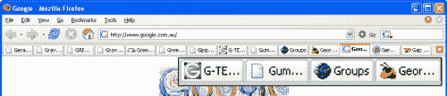

选项卡式浏览的另一个可取之处是，与使用多个单独的窗口相比，这个系统允许你处理更多的网页。您可以处理更多的网页，因为在选项卡栏(显示中包含选项卡名称和图标的部分)上没有空间竞争。多窗口浏览要求每个 IE 窗口与其他打开的程序竞争任务栏上的空间。这包括非 IE 窗口、右下方的系统通知区域、开始栏、快速启动栏以及您可能碰巧配置的任何其他栏。

哪个解决方案比较突出？嗯，两者都有可取之处。Firefox 为不同的网站显示一个指示性图标(favicon)很有帮助，在我看来，这比在每个页面显示相同的“e”图标更有帮助。这些显示在 Macintosh 和 Linux 桌面环境之间略有不同，但我相信您已经了解了。

**避免环境污染**

有一个小问题我喜欢称之为“环境转换污染”当您在桌面上从一个窗口切换到另一个窗口时，会发生应用程序上下文切换。我为这种简化和我对术语“上下文切换”的滥用向技术人员道歉在 Windows 中，你可以通过点击任务栏项目，或者按下 **Alt-Tab** 来打开另一个窗口。Mac OS X 用户可能是 ExposÃ的忠实粉丝。在 Linux 中，根据您的桌面环境，您可能有类似 Windows 的 **Alt-Tab** 上下文切换，甚至是类似 ExposÃ的特性。当您进行上下文切换时，Windows 会为每个可用窗口显示一个图标(上下文对象);然后你挑一个你想要的。

现在，如果你有标签浏览，你可能最多会打开几个窗口。事实上，我认识的大多数 Firefox 用户都不需要一个以上的窗口来容纳他们所有的标签。我通常坚持单一窗口，我自己。您可以在一个窗口中打开任意多的选项卡，您得到的好处是:对于这组选项卡，您只有一个上下文对象。一个窗口:一个上下文对象。相比之下，想象你打开了多个 IE 窗口:每个网页一个。这些窗口中的每一个都算作一个上下文对象。我的朋友，你有一个环境转换污染的坏案例！图 2.4 显示了环境切换污染的样子。

**图 2.4。Windows XP 中的上下文切换污染。**
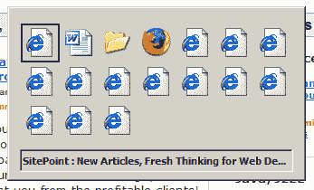

如果没有疯狂的 Windows 风格的**Alt-Tab**bing，我们怎么能快速找到我们想要的窗口呢？图 2.5 显示了 ExposÃ在 Mac OS X 上发布的一个类似的杂乱摘要。

尽管 ExposÃ比 Windows 的上下文切换要好，但您仍然需要执行费力的斜视点击选择。

标签式浏览将那些讨厌的多个窗口减少到一个*窗口中的单个标签——最多两三个窗口。再见，上下文切换混乱！*

**生产率差异**

当你在选项卡式浏览器中阅读网页时，你可以在“背景”选项卡中打开有趣的链接，当你继续阅读原文时，它会加载那些页面。一旦你完成了当前页面，你可以在你自己的时间访问这些新页面。到那时，他们可能已经完成加载，并准备好查看。

当你在每个网页上使用单一窗口时，你必须在新窗口中打开有趣的链接才能达到同样的效果。在 Internet Explorer 中，这将打开一个新窗口，然后该窗口具有“焦点:”它被带到所有其他窗口的前面。这种注意力的转移可能是也可能不是你想要的。如果不是，那就太糟糕了，你只需要再次回到原来的窗口。你不能在 IE 中改变这种行为；至少在 Opera 中，有一个“在后面打开”选项，可以将焦点保持在当前页面上。在选项卡式系统中，你可以告诉浏览器是否在后台打开新的选项卡，以及何时希望它们窃取焦点。稍后我们将看到如何实现这两者。

**图 2.5。曝光 Mac OS X 上的污染**
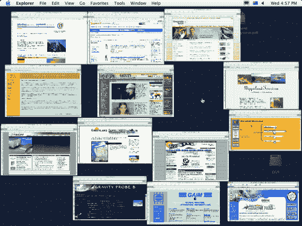

我发现在背景标签中打开链接是浏览网页最有效的方法。网络浏览的基本概念和在背景标签中打开有趣链接的基本概念之间有着近乎完美的匹配。想想看:网页是建立在超文本之上的，这意味着总有超链接指向其他网页。有些链接你可能会感兴趣；很可能不会。你会想要访问那些你确实关心的链接，所以你点击它们。但是，等等！我们说的是“链接”，不是“一个链接”通常，不止一个链接会引起你的注意(尤其是当使用谷歌或其他搜索引擎时)。你会想要访问所有这些有趣的链接，当你阅读当前页面时打开这些链接是一个自然的过程，这样你就不会从当前的任务中分心，并在完成后访问它们。选项卡式浏览允许你这样做。IE 不会，因为当你在新窗口中打开链接时，它会偷走焦点。

**判决结果**

不用说，选项卡式浏览为自己提供了一个非常强有力的理由。我第一次尝试时(在 Mozilla 应用程序套件中)就喜欢上了标签式浏览。对我来说，这感觉就像是网络应该被浏览的方式！

标签式浏览不仅仅是标签页，我们在回顾 Firefox 的其他特性时会看到这一点。Firefox 是围绕选项卡式浏览模式构建的，在整个讨论中，我们将探索如何使用这种集成来进一步改善您的浏览体验。

***使用制表符***

到目前为止，你可能已经确信选项卡式浏览的优越性，或者至少愿意尝试一下！在这一节中，我们将看到如何在 Firefox 中使用标签式浏览。

**打开、关闭和改变标签**

打开新标签页很容易；这件事可以用许多方法来做。

打开新标签页最简单的方法是点击鼠标中键。在链接上点击鼠标中键(或滚轮点击)会创建一个新的选项卡，并将链接的页面加载到其中。这也是最有效的打开链接的方式，所以如果你不习惯用鼠标中键的话，学习一下是值得的。大多数人甚至不知道滚轮是可点击的，但你可以像点击按钮一样简单地点击滚轮，因为滚轮具有按钮和滚动功能。如果你有一个三键鼠标，只需点击离开。如果你有一个带滚轮的两键鼠标，点击鼠标中键一开始会有点不舒服。在 Mac OS X 上，请使用 command-left-click。如果你喜欢点击鼠标中键，你可以通过 Mac OS X 鼠标驱动程序将 command-click 重新分配给鼠标滚轮(中键),使之成为 Macintosh 的一个标准。

注意，如果你点击鼠标中键时错过了链接，Firefox 会进入“自由滚动”模式，这可能不是你想要的。如果发生这种情况，当鼠标指针仍然远离任何链接时再次单击，您将恢复正常。

以下是打开标签页的其他几种方法:

*   Ctrl-T 打开一个新的空标签页。
*   右键单击(或在 Mac 上右键单击)链接，并从出现的上下文菜单中选择在新选项卡中打开链接。
*   点击链接时按住 **Ctrl** 。
*   在地址栏中键入一个 URL，然后按下 **Alt-Enter** 。这将在新的前台选项卡中加载 URL。
*   当一个链接被选中时，按下 **trl-Enter** (例如，在你运行一个页面搜索后，该链接被高亮显示)。
*   将 URL(从网页或外部应用程序)拖放到选项卡栏上。

关闭标签页也很简单灵活:只需中击标签页的描述(标签页内容上方的那部分)。您也可以使用 **Ctrl-W** 关闭当前选项卡，或者右键单击选项卡并选择关闭选项卡。选择任何适合你的凹槽。最后，您可以单击关闭标签图标，它在标签栏的右端显示为“X”，然后“噗！”–不再有账单。图 2.6 显示了标签栏上的关闭标签图标。

**图 2.6。标签栏旁边的关闭标签图标。**
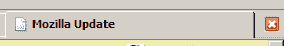

一旦你设置好标签，在它们之间切换焦点就很容易了:只需点击所需的标签。切换选项卡的不太明显的方法是使用 **Ctrl-Tab** 将焦点切换到下一个选项卡(当前选项卡的右侧)，使用 **Ctrl-Shift-Tab** 访问上一个选项卡(当前选项卡的左侧)。如果你的手大部分时间都在键盘上，这是非常有用的。

**标签相关偏好**

让我们来看看与选项卡和选项卡式浏览相关的可用用户首选项。启动 Firefox，从菜单栏中选择工具>选项(Windows)、Firefox >选项(Macintosh)或编辑>首选项(Linux)，然后选择高级面板。您应该会看到一个类似于图 2.7 所示的对话框。

**图 2.7。火狐 1.0 中的标签式浏览偏好。**
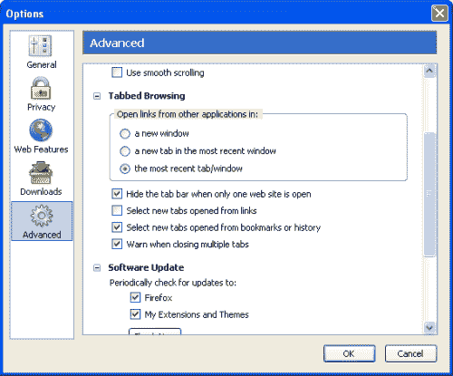

请注意，对于 Firefox 1.1 和更高版本，选项面板已经稍微进行了重新设计:在那里，您必须单击选项卡而不是图标才能看到这些信息。图 2.8 显示了未来事物的形状。

**图 2.8。Firefox 1.1 及更高版本中的选项卡式浏览首选项。**
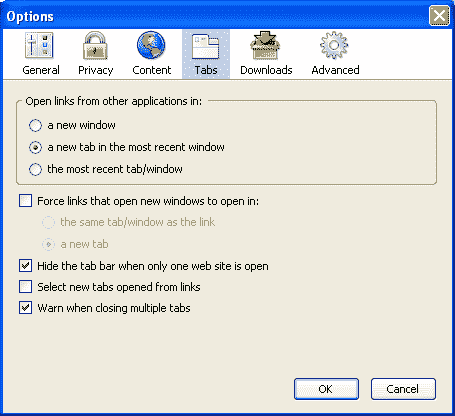

您可以看到，虽然有一点重组，但两个版本中的选项几乎相同。以下是每个偏好设置的作用:

*   **打开来自其他应用程序的链接:**
    如果你点击一个显示在其他程序中的链接，比如微软 Word 或者 Adobe Acrobat Reader，这个首选项决定了该链接在 Firefox 中的显示方式。我更喜欢在最近窗口的新标签中打开来自其他应用程序的链接，因为我通常使用单个窗口，我不想丢失我最近标签中的网页。当然，只有当 Firefox 被设置为默认浏览器时，链接才会在 Firefox 中加载。
*   **强制打开新窗口的链接打开方式:**
    这是一个新的特性，可以用来驯服弹出窗口:选中复选框打开它。该选项允许在现有选项卡或现有窗口内创建新内容，而不是在单独的新窗口中启动弹出窗口，或者被弹出窗口拦截器拦截(稍后讨论)。此选项仅在 Firefox 版本 1.1 和更高版本中可用。
*   **当只有一个网站打开时隐藏标签栏**
    如果选中，当只有一个网页打开时隐藏标签栏。就我个人而言，我没有选中它(默认情况下是选中的)，因为标签栏的消失和重新出现会令人不安。这个选项被默认为一个经过深思熟虑的设计决策，使不使用选项卡式浏览的用户能够享受更多的屏幕空间。然而，选项卡式浏览的用户可能更喜欢不选中这个选项。
*   **Select new tabs opened from links**
    This is the preference I was talking about earlier, which allows you to choose whether new tabs open in the background, or steal focus from the current page. Checking this option will cause links opened in new tabs to steal focus. I recommend that you leave this unchecked to gain the productivity benefits I mentioned earlier.

    *注意:*那些以某种方式设置了从链接中选择打开的新标签的用户，可以使用 Shift 键修饰符临时反转他们的设置。例如，如果你已经设置了 Firefox，使得从链接打开的新标签在后台加载，但是你想在前台打开一个特定的链接，只需在点击链接时按住 Shift 键(即，Shift-中键点击，或 Ctrl-Shift-左键点击)。

*   **关闭多个标签页时发出警告**
    如果你同时关闭多个标签页，这个选项会显示一个警告对话框，当你试图关闭一个打开了多个标签页的窗口时就会出现这种情况。这是一个有用的警告，可以防止你意外关闭一个充满标签页的窗口，但是如果你真的想关闭这个窗口，这可能会很烦人。图 2.9 显示了这一警告。

**图 2.9。同时关闭多个标签页时显示警告对话框。**
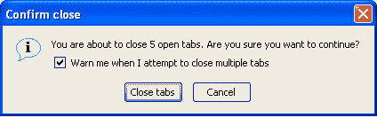

正如你所看到的，如果你是一个“普通”用户，你不需要改变任何选项:Firefox 从一开始就提供了明智的配置选择。

单一主页:1999 年！

选项卡式浏览的另一个好处是，选项卡式浏览器不再局限于单一的主页。如果你像大多数其他网络冲浪者一样，你可能有不止一个喜欢的网页:你第一次启动网络浏览器时绝对*必须*访问的网页。例如，我总共有八个 URL，我想在每次网络冲浪会话开始时检查它们。

单一文档界面(SDI)网络浏览器(例如 Internet Explorer)的用户要做什么？简单地说，单文档界面(SDI)是一种将应用程序组织成单个窗口的方式，每个应用程序(或应用程序的每个实例)一个窗口。如果你使用过 Internet Explorer，你就会知道什么是 SDI。嗯，他们最好开始翻翻他们的书签！另一方面，那些幸运的选项卡式浏览器用户可以设置多个主页，并一次加载所有他们喜欢的页面。图 2.10 说明了通过选项对话框设置多个主页所需的格式。

**图 2.10。指定一组选项卡式主页。**
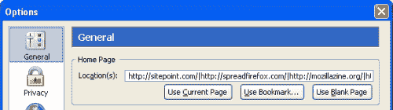

注意分隔每个 URL 的竖线(|):每个选项卡显示一个 URL。您只需将喜欢的网页加载到选项卡中，并将该组标记为您的主页。例如，如果你想让 https://www.sitepoint.com/的和 http://www.spreadfirefox.com/的成为你的主页，在 Firefox 中加载它们，进入工具>选项>常规(或 Mac OS X 上的 Firefox >首选项>常规，或 Linux 上的编辑>首选项>常规)，然后点击使用当前页面按钮。

或者，您可以在位置文本框中手动输入要设置为主页的 URL，使用竖线字符(|)分隔各个 URL，如上所示。例如，如果您希望 sitepoint.com 和 Spreadfirefox.com 成为您的主页，请在“位置”文本框中输入`https://www.sitepoint.com/|http://spreadfirefox.com/`。在大多数 PC 键盘上，竖线字符键位于**退格键**键附近，由上下两个垂直破折号表示。

第三种方法是单击使用书签…按钮，然后选择包含您要用作主页的书签的书签文件夹。稍后我们将更详细地介绍书签。

然而，设置多个主页确实有一个缺点。如果你想做的只是一个快速的网络搜索，Firefox startup 太聪明了(或者可能太蠢了)，它会坚持加载你的全部主页。这确实会减慢速度，尤其是在拨号连接上，因为加载八个网页几乎肯定比只加载一个慢。如果你感到不耐烦，你可以随时按下 **Ctrl-T** 获得一个新标签，将八变成九。然后你可以在第九个标签中输入你想要的网址，并让它以正常速度的九分之一加载。

尽管存在性能问题，但很难否认一次加载多个网页的便利性，更难不为那些仍然面临诸如“我要雅虎吗？电子邮件作为我的主页，还是应该改为设置为 sitepoint.com？”有了 Firefox，你可以避免这样的决定。只需将所有您喜欢的网页设置为您的主页，就大功告成了！

**后退、前进和主页按钮**

现在，火狐是一个标签浏览网页浏览器，对不对？当然是了。所以如果你点击返回按钮，火狐可以在一个新的标签中打开上一页，这是有意义的，对吗？事实上，这正是火狐的表现。

您可以中键点按(在 Mac OS X 上按住 command 键并左键点按)工具栏中的所有后退、前进和主页按钮，以在新标签页中打开相应的链接。如果你的主页有四个独立的标签页，中键点击主页按钮会在你当前的标签页中增加四个标签页。图 2.11 让我们想起了这些主要按钮的样子。重载或停止按钮没有特殊的 tab 动作。

**图 2.11。火狐的工具栏图标。**

在主浏览器按钮中提供标签支持清楚地表明了标签浏览是 Firefox 设计的一部分。它既不是事后想起的，也不是附加的功能。

##### 搜索和搜索工具

搜索:作为一项基本的网上冲浪活动，你无法逃避它。嗯，也许你可以，如果你有一种不可思议的能力，能猜出给你想要的确切网页的网址。一个好的超视力可能也是必要的！“嗯……让我们看看。网上有什么好的火狐电子书吗？我将运用我神秘的推理能力去找出……”(超自然的停顿。)“啊，我要去 http://firefox-book.com/."

这听起来可能吗？好吧，如果 http://firefox-book.com/有一个网站(没有)，它可能和一本关于火狐的书有关。最终，依靠你的推理能力是不可能产生结果的，此外，不可思议的推理是极其令人疲惫的！

这种繁琐的语言强调了这样一个事实，即搜索是使用万维网不可或缺的一部分。你不能用随意的方法找到你想要的信息。相反，我们使用提供系统解决方案的搜索工具:搜索引擎、目录和类似的在线服务。

搜索的例子比比皆是。你在寻找你最喜欢的乐队的独家新闻吗？也许你正在尝试学习 Java 编程？谷歌是你最好的选择。你在为你的论文研读最新的通量电容器和时间旅行吗？在 [ScienceDirect](http://www.sciencedirect.com/) 或【arXiv.org】T2 进行搜索。找一本好的计算机书，自强手册，或者龙枪小说？如果你想知道的话，我是龙枪迷。不过，我不喜欢自我提升的书。(自己写 D & D 战役设定更好玩——Ed。).Amazon.com 有一个很好的搜索功能，可以产生客户评论和推荐。

如果搜索是网络不可分割的一部分，那么它也应该是你的网络浏览器不可分割的一部分。Firefox 承诺不引人注目的集成搜索功能。火狐开发者知道你想要什么，他们会给你。我希望所有的软件项目都这样做！

在这里，我们详细看看 Firefox 的搜索相关特性，看看你如何最好地利用它们让事情变得简单。

***找到它的方法不止一种！***

没错:找到它的方法不止一种(TIMTOWTFI)。搜索是 Firefox 的一个集成特性，但它是以几种方式集成的。有许多单独的搜索功能和几个不同的起点，您可以从这些起点执行搜索。每种搜索方法都适合其特定的情况。

例如，您可以通过高亮显示某个网页上的单词或短语(比如“blogosphere”)来搜索其含义，然后单击上下文并选择上下文菜单条目“Search Web for blogosphere”图 2.12 显示了这种技术的应用。

**图 2.12。上下文 Web 搜索突出显示的文本。**
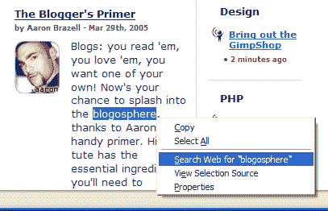

或者，您可以浏览搜索引擎的主页，在表单中键入您的搜索词(这不是 Firefox 的功能，但它是执行搜索的一种方式)。或者你可以…但是让我们结束这些琐碎的例子，直接讨论使用 Firefox 搜索的更有效和高效的方法。

**搜索吧:醉倒在搜索上！**

当你第一次启动 Firefox 时，你可能注意到有两个文本框可以输入文本。其中之一是地址栏，你可以在里面输入网址；另一个旁边有一个看起来很滑稽的“G”。图 2.13 显示了浏览器的这个角落。

**图 2.13。右边是搜索栏，左边是定位栏。**
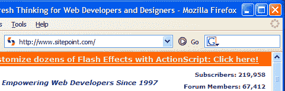

“G”实际上是谷歌搜索引擎的一个图标，这个文本框叫做“搜索栏”如果你输入一个搜索短语，然后按回车键，火狐会带你到谷歌搜索结果页面。你自己去试试吧:这是一个非常方便的安排。你不再需要输入[http://www.google.com/](http://www.google.com/)，等待它加载，然后使用标准表单进行搜索。每次搜索时，搜索栏可以节省 3 秒钟的时间——如果你是拨号上网，时间可能会更长。由于网上冲浪者平均每小时进行 12 次搜索，这相当于每花 1 小时在线时间节省 36 秒，或者每天 14.4 分钟，或者每年 3.65 天！这个数字是通过一个叫做猜测的复杂过程得出的！试着在谷歌上搜索“每年 36 天，每小时 36 秒”谷歌的计算器开始为你做转换！我就知道谷歌的计算器功能真的很智能，但是这种智能？！想象一下你可以用这 3.65 天做些什么。你可以休三天假，但仍有 0.65 天无所事事。当 Firefox 的人说 Firefox 有助于提高你的在线体验效率时，他们不仅仅是在宣传营销:效率的提高是实实在在的。

**像专业人士一样使用搜索栏**

搜索栏很容易使用，但是你可以用它做更多的事情，而不仅仅是搜索谷歌。在你让你自己在你的火狐福音传道者朋友面前尴尬之前，学习这些其他的技巧！

首先，点击**回车**在当前标签中加载搜索结果页面。有时，加载一个新标签可能更方便。对于这种情况，按下 **Alt-Enter** ，而不是只按 **Enter** 。

将输入光标放在搜索栏中的快捷键是 **Ctrl-K** 和**Ctrl-E**——你可以使用其中任何一个。如果你像我一样，不喜欢把手从键盘上拿开，那些快捷键非常有用。我搜索的方式是点击 **Ctrl-E** ，输入我的查询，然后点击 **Alt-Enter** 来指定一个新的标签页。

您也可以使用拖放功能进行搜索。只需选择一段文本(从任何支持拖放功能的程序中，而不仅仅是 Firefox)，并将其拖动到 Firefox 搜索栏中。而且，如果你想从 Firefox 网页上拖放文本，有一个更好的方法！让我暂时让你保持悬念:我们很快会回到这一点。

**添加更多搜索引擎**

你不会被限制在谷歌上搜索，即使它是最好的搜索引擎，并且有非常酷的软件作为补充。你可以很容易地添加其他搜索引擎，如 AltaVista，AllTheWeb，甚至是最新的搜索引擎 Clusty。为此，请单击 G 图标。您应该会看到如图 2.14 所示的下拉列表，其中列出了 Firefox 产品中默认安装的搜索插件。

要使用不同的搜索引擎(比如 Amazon.com)进行搜索，只需从下拉列表中选择该项目。搜索框左边的图标会从 G 图标变成 Amazon 上的图标。现在，你通过搜索栏进行的任何搜索都将在 Amazon.com 上运行(尝试搜索“Firefox”)。

自然，每个人都有他或她自己的特定需求和喜欢的搜索引擎。您可能想知道如何在搜索栏中添加一个新选项，并且您可能已经猜到只需单击下拉列表中的 Add Engines 项即可。选择该项会将你带到 Firefox Central，在那里你可以添加其他搜索插件。图 2.15 显示了该页面的一部分。

**图 2.14。添加和更改搜索引擎。**
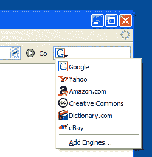

**图 2.15。在火狐中心添加新的搜索引擎。**
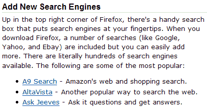

**图 2.16。添加维基百科搜索插件。**
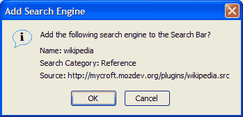

要添加特定的搜索引擎，只需点击相应的链接。让我们添加维基百科(一个非常有用和全面的在线百科全书)的搜索插件。点击维基百科搜索插件链接后，您应该会看到如图 2.16 所示的确认对话框。

点击确定，就大功告成了！你现在可以在搜索栏下拉列表中看到维基百科。只需选择它来搜索维基百科，如图 2.17 所示。

**图 2.17。成功安装维基百科搜索选项。**
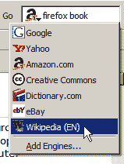

如果你想添加一个不在列表中的搜索引擎，可以去 Mycroft 项目网站，它提供了许多网站的搜索插件。搜索您想要的插件，或浏览搜索插件类别。这里列出了一千多个搜索插件，所以肯定有适合每个人的东西。

从搜索栏中移除搜索引擎有点麻烦。首先，使用桌面文件管理器(Explorer 或 Finder)定位 Firefox 安装目录中的`searchplugins`目录。在 Windows 系统上是在`C:Program FilesMozilla Firefoxsearchplugins`。在那里，为每个搜索插件存储了两个文件。一个是`.src`文件，另一个是图形，通常是`.png`或`.gif`文件。删除名称与您不再需要的搜索选项匹配的文件对。例如，如果我想删除雅虎！搜索插件，我会简单地删除`yahoo.src`和`yahoo.gif`，然后重启 Firefox。一个移除不需要的搜索引擎的界面计划包含在 Firefox 的未来版本中。与[相关的错误注释可在线获取](https://bugzilla.mozilla.org/show_bug.cgi?id=232272)。

接下来，我们将看看一种巧妙而便捷的搜索方式。

**智能关键词**

智能关键词是从地址栏执行搜索查询的好方法。有了智能关键词，你可以在地址栏中输入`dict extemporaneous`，点击**，输入**，就可以进入 Dictionary.com 对“即兴”的定义要做到这一点，最难的方法是去 Dictionary.com，等待它加载，点击它的搜索框，输入`extemporaneous`。呸！那需要太多的步骤。

火狐自带几个自动安装的智能关键词。您可以在书签的快速搜索文件夹中找到它们，如图 2.18 所示。你根本不需要使用这个菜单——这只是一个简单的方法来查看安装了哪些智能关键词。

**图 2.18。Firefox 的预定义智能关键词产品。**
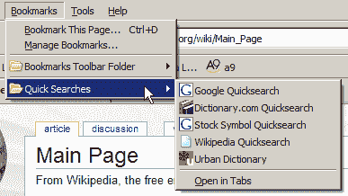

预定义的智能关键词有:

*   **Dictionary.com**键入`**dict *word***`来查找一个词的定义。
*   **谷歌**
    键入`**google *search keyword(s)***`执行普通的谷歌搜索。
*   **股票代码**
    键入`**quote *symbol***`来查找股票代码的股票报价。该内容来源于雅虎！由谷歌融资。
*   **维基百科**
    输入`**wp *anything***`就可以访问维基百科上的任何条目(维基百科是一个免费的在线百科全书)。
*   **都市词典**
    键入`**slang *slang word***`查阅都市俚语词汇的含义，与时俱进！

我敢肯定，你想知道如何创建智能关键字。毕竟，为 Firefox 还没有提供的搜索构建额外的关键字会很好。创建智能关键字有两种方法:简单的方法和困难的方法。容易的方法是首选，但当它偶尔失败时，你将不得不回到困难的方法。让我们从简单的方法开始，两者都看看。

让我们为亚马逊相对较新的搜索引擎 A9 添加一个智能关键字。首先显示 [A9 的主页](http://www.a9.com/)。在搜索框中单击鼠标右键，您应该会看到上下文菜单项 Add a Keyword for this Search…，如图 2.19 所示。

**图 2.19。从搜索栏添加智能关键词。**
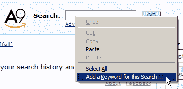

菜单上的最后一项看起来像是我们要的，的确如此。当您选择该项目时，将出现一个添加书签对话框，提示您填写书签的名称以及关键字。我们将其命名为`**A9 keyword**`，并使用`**a9**`作为特殊关键字。将结果保存在您选择的书签文件夹中-我建议您将它与所有其他预定义的智能关键词一起保存在快速搜索文件夹中。

完成后，您可以立即试用。输入`**a9 firefox**`，你将被带到你输入的“firefox”搜索词的 A9 搜索结果。太好了！我们正在取得进展。

现在，让我们试着用困难的方式做同样的任务。我们这样做不仅仅是为了在晚宴上给其他客人留下深刻印象。我们这么做是因为简单的方法行不通。

例如，去雅虎！搜索引擎，并尝试添加一个简单的智能关键字。什么也没发生:没有出现添加书签对话框——至少在本书付印时没有。(从技术上讲，这是因为雅虎！未使用 id="search "指定搜索文本字段。

也许雅虎！总有一天会解决的。也许当这本书到达你手中的时候，问题已经解决了:这就是互联网的本质。不管是不是固定的，很明显许多网站不支持智能关键字的简单添加。

要硬加一个智能关键字，你必须先研究一下网址。在搜索框中输入一个查询，点击**输入**，然后查看生成的 URL。为了我们自己的目的，我们需要把那个 URL 分开。如果我们使用雅虎！搜索搜索引擎来搜索“火狐”，结果的搜索网址看起来像这样:http://search.yahoo.com/search?ei=UTF-8&fr = SFP&p =火狐。那些熟悉 URL 查询字符串并了解某些搜索引擎如何工作的人会认识到，只有 http://search.yahoo.com/search?p=firefox 是执行搜索所必需的。其余的是雅虎的额外信息！，例如搜索查询的字符编码和搜索的位置。

将该 URL 中的搜索查询(“firefox”)替换为% `**s**`以创建适合智能书签的 URL。智能书签是一种特殊的书签，用于定义智能关键词。Firefox 将“%s”识别为关键字的占位符，并在您执行智能关键字搜索时用您键入的信息替换它。如果你输入两个或更多的单词，可能用空格分开，Firefox 会把它们当作一个单独的关键字字符串。所以只能用“%s”一次。

为了创建智能书签，我们将搜索页面(正在讨论的搜索引擎的普通搜索页面)加入书签，然后修改新的书签。我们把书签的名字改成更好的名字，比如“Yahoo！快速搜索”，并调整书签，使其以类似智能关键字的方式运行。然后，我们将书签保存在快速搜索书签文件夹中。

为此，在书签菜单中找到新书签，选择它，右键单击，然后选择属性。图 2.20 显示了包含属性项的菜单。

**图 2.20。显示普通书签的属性。**
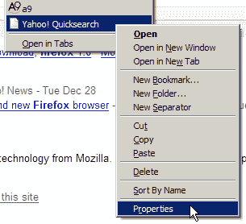

选择 Properties 将弹出书签属性对话框，我们可以在其中进行所有需要的编辑。更新名称，用特殊的% `**s**`占位符替换“firefox”，并提供一个关键字(我选择“y”表示“yahoo”)。如果您愿意，也可以添加描述。图 2.21 显示了这些变化。

最后，点击 OK，你就有了:雅虎的智能关键词！搜索。尝试一下寻找刺激。

现在你已经掌握了足够的知识来艰难地创建智能关键词，你可以用它来做一些创新和有趣的事情。让我们创建一个从欧洲欧元转换为美元的货币转换智能关键字。利用在[XE.com](http://www.xe.com/ucc/)的服务，让我们来一次硬的。

原来这个任务比平时更有挑战性。当我说 xe.com 货币转换器通常使用 HTTP POST 而不是 HTTP GET 进行表单提交时，Web 开发人员会理解我的话，所以没有我们可以利用的 URL:我们可以在其中插入我们之前使用的“%s”占位符。POST(或者更确切地说，HTTP POST)是一种将数据传递到网页(或者更确切地说，Web 服务器)的方法。智能关键字系统只能使用基于 GET 请求的 URL。非开发人员可能不会理解这个技术细节，他们也不应该理解。结果是我们需要找到一个 GET 请求，我们可以使用它作为智能关键字的基础。

**图 2.21。指定 Yahoo！快速搜索智能书签属性。**
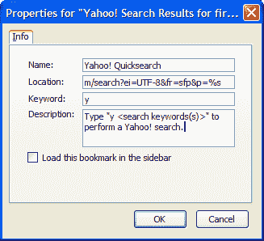

要做到这一点，我们必须深入执行搜索的网页的 HTML 源代码(从菜单中，选择“查看”>“网页源代码”，然后开始撕扯你的头发！).稍微研究一下 http://www.xe.com 网页的 HTML 源代码，我们就可以推断出一个有用的智能关键字 URL 应该是:http://www.xe.com/ucc/convert.cgi?Amount=%s&From=EUR&To=USD

我们将该 URL 加入书签，并编辑书签属性，记住给它一个关键字:“e2u”是一个不错的选择。要测试新关键字——例如，要找出一百万欧元值多少美元——在地址栏中键入`**e2u 1000000**`。

如果你知道如何筛选 HTML 源代码，生活是伟大的；如果没有，人生也没那么可怕。你所需要的只是别人的一点点帮助。这里有一些你可以考虑的其他智能关键词。

*   [谷歌我觉得自己很幸运](http://www.google.com/search?q=%s&btnI=I'm+Feeling+Lucky)
*   [阿尔塔维斯塔](http://www.altavista.com/sites/search/web?q=%s)
*   [亚马逊](http://www.amazon.com/exec/obidos/external-search/?index=blended&keyword=%s)
*   [谷歌新闻](http://news.google.com/news?q=%s)
*   [谷歌群组](http://google.com/groups?q=%s)
*   [易贝](http://search.ebay.com/%s)
*   [Feedster 最近的博客文章](http://feedster.com/search.php?q=%s&sort=date)
*   [互联网电影数据库](http://imdb.com/find?q=%s)
*   [Thesaurus.com](http://thesaurus.reference.com/search?q=%s)
*   [CiteSeer(计算机和信息科学出版物数据库)](http://citeseer.ist.psu.edu/cis?q=%s)

智能关键字功能背后的基本前提非常简单:它只是用您键入的关键字替换“%s”占位符。有了这些知识，您就可以为 URL 中包含可变组件的任何 Web 服务创建一个智能关键字。

***右击文本搜索***

我在本节开始时说过 TIMTOWTFI(找到它的方法不止一种)。然后，我们搜索文本“博客世界”这种技术被称为“文本搜索”，需要进一步探索。

要执行文本搜索，您必须掌握两种鼠标手势:高亮显示和上下文选择。突出显示文本很容易——至少对于简单的操作来说是如此。为此，在所需的文本段前单击，然后按住鼠标左键，在文本上拖动鼠标以创建突出显示。释放鼠标按钮以完成高亮显示。当您进行上下文选择时(右键单击突出显示的内容)，您会看到上下文菜单中出现一个针对“`*whatever you selected*`”项目的搜索网页，如图 2.22 所示。

**图 2.22。从上下文菜单中进行方便的搜索。**
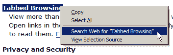

如果你左键点击这个菜单项(我谅你也不敢！)，Firefox 会在一个新的背景标签中对谷歌上的选定文本进行搜索。是的:在谷歌上，再次！

文本搜索也不仅限于文本。如果您高亮显示页面上的一个图像(通过单击图像左边缘外的*，然后在图像上拖动)，上下文菜单将提供基于图像指定的任何`alt`(描述性)文本的搜索。唉，如果图像是作为样式的一部分提供的，您还不能这样做；图像必须是页面的一部分。*

您还可以对出现在链接中的文本执行突出显示的搜索。不过，高亮显示链接中的文本是相当棘手的:如果你试图拖动高亮显示的文本，你可能会意外地开始下载或者打开一个标签。相反，首先用“键入时查找链接”功能突出显示文本(接下来将在[的“快速查找:键入时查找”](file:///C:/DOCUME~1/bree/LOCALS~1/Temp/Temporary%20Directory%201%20for%20firefox1-html.zip/firefox1.html#sectionfastfind)一节中讨论)。突出显示文本后，像对任何突出显示的文本一样，通过右键单击它来调出上下文菜单。

到目前为止，您还不能对文本框或文本输入字段中的文本执行文本搜索，但该功能可能会在将来出现。

如果你不想使用谷歌作为默认的搜索引擎呢？要改变这一点，需要一点极客语言。不过，在实验之前，你可能会喜欢读第 6 章，技巧、窍门和窍门。

在你的火狐地址栏中输入`**about:config**`，点击**输入**，在显示的首选项集中寻找 browser.search.defaulturl 首选项。它的值应该设置为:http://www.google.com/search?lr=&ie = UTF-8&OE = UTF-8&q =。通过右键单击首选项来替换此字符串。用 http://search.yahoo.com/search?p=换雅虎！搜索，或另一个引擎的等效字符串。请注意，在这种情况下不需要“%s”。

***快速查找:键入*** 时查找

除了搜索网页，你会经常发现自己在搜索网页的中的*。对于包含大量(大部分不相关)内容的网页，对于很长的列表，以及当您在查找特定信息时，尤其如此。*

Firefox 有一个简单易用的 ber 特性，叫做 *FastFind* 。这是官方的营销流行语；资深火狐用户也称之为*键入时查找* (FAYT)，或者*提前键入查找*。“键入时查找”确实如它所说的那样:它在您键入时查找文本*。它是如何工作的？只需点击/(正斜杠)或 **Ctrl-F** ，然后开始输入你要找的单词。从你开始输入的那一秒起，Firefox 就会找到并高亮显示第一个匹配你输入的单词。理解我的意思的最简单的方法就是自己尝试一下。页面加载完成后，立即进入 [Mozilla 网站](http://www.mozilla.org/)并输入 **/firefox** 。*

也可以使用 **F3** 或者 **Ctrl-G** 在页面上查找下一个匹配， **Ctrl-Shift-G** 查找上一个匹配。所以不需要把你的手从键盘上拿开，也不需要处理碍事的讨厌的查找对话框！相反，你会在页面底部看到一个不显眼的查找工具栏，如图 2.23 所示。

**图 2.23。查找工具栏。**
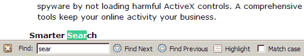

这是我最喜欢的火狐功能之一。当我偶尔使用 Internet Explorer 时，我经常会为了搜索资料而敲击/输入文本。唉，这个功能在 IE 里不管用…

如果你被不得不记住键盘快捷键吓住了，不要害怕:查找工具栏就在这里(这么多诗歌)。每当你开始查找，工具栏就会出现在页面的底部。您可以使用“查找”工具栏上的按钮来查找下一个或上一个匹配项。不过我建议你习惯键盘快捷键，因为它们真的能加快搜索过程。

也许你注意到了查找工具栏中的高亮按钮。您可以使用它来突出显示与您的搜索词匹配的所有文本。这个的快捷键是 **Ctrl-Enter** 。图 2.24 显示了这种情况。

**图 2.24。通过查找工具栏突出显示“Firefox”。**
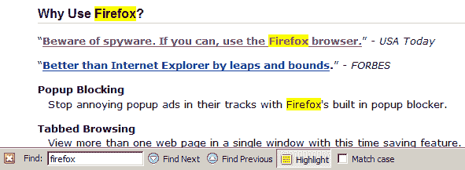

这种突出显示使用黄色来模拟毡笔荧光笔的操作，并且不会更改您当前的选择。如果您希望区分大小写，还可以选择一个复选框(即，键入 **Firefox** 将匹配“FiReFoX”，但不匹配“FiReFoX”或“FiReFoX”)。

***提示***
有时候你可能只想搜索链接的文本，而忽略页面上的其他文本。一个很好的例子就是我不停地扫描网页上的“下载”链接。要开始只在链接中搜索，点击'(单撇号)，而不是通常的/(正斜杠)或 **Ctrl-F** ，然后像平常一样开始输入。只有与您的搜索词匹配的链接文本才会突出显示。当你来到一个你想要的链接时，你可以使用**回车**将其加载到当前标签页，或者使用**回车**将其加载到一个新标签页。

提高搜索效率的最后一个变化是启用“开始键入时开始查找”偏好设置，可以在“工具”>“选项”>“高级”>“辅助功能”下找到(在 Mac OS X 上是 Firefox>“偏好设置”,在 Linux 上是“编辑”>“偏好设置”)。该选项如图 2.25 所示。

当这个首选项被启用时，你不再需要点击/或 **Ctrl-F** 来开始搜索:只需开始输入你的搜索短语！这曾经是 Firefox 1.0 之前的默认行为，是超级用户(包括您的用户)非常喜欢的特性。

**图 2.25。开始键入时开始查找。**
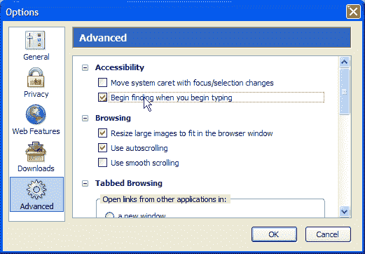

搜索是当你想找到某样东西时，你用浏览器做的事情。但是，当你面对不想知道的信息时，你会怎么做呢？接下来我们来看看这个问题。

##### 非侵入式浏览

Firefox 具有内置功能，使您的在线浏览体验尽可能流畅和不间断。有很多功能可以消除我们在使用 IE 时的烦恼。弹出式和弹出式广告，隐藏 URL 的欺骗状态栏文本，动画状态栏文本，闪烁的“点击我！”横幅广告，窗口可以自行调整大小，要么小得令人难以置信，要么大得令人难以置信:所有这些都是令人烦恼的事情。自从我开始使用火狐浏览器后，我就再也没见过它们了。

*烦恼消除*就是默默清除所有这些刺激物的过程。消除烦恼是 Firefox 擅长的一件事，所以让我们看看如何配置 Firefox 来创建您应得的不间断浏览体验。

***弹出拦截***

过去，我们生活在包含广告的弹出式和弹出式窗口中，就好像它们是生活中不可避免的一部分。幸运的是，有人构思了弹出窗口阻止软件，这提供了一些救济。最终，软件开发人员开始在他们的浏览器中建立阻止弹出窗口的功能；Firefox 就是这样一款浏览器。阻止弹出窗口已经成为网络浏览器的一个重要功能，你很难找到没有它的浏览器。Firefox、Safari、Mozilla 应用程序套件，甚至 Windows XP 上的 Internet Explorer(如果安装了 Service Pack 2)都提供了集成的弹出窗口阻止功能。

如果你访问的网站使用弹出窗口作为网站功能的必要元素(例如，一个银行网站)，或者你只是有一些奇怪的弹出广告爱好者，你可以关闭 Firefox 的弹出窗口拦截器，无论是全局的，还是单个网站的。随着讨论的深入，我们将看到如何调整 Firefox 弹出窗口拦截器来满足您的需求。

**注意**
这里不是讨论拦截弹出窗口和在线广告的“道德”的地方，所以在整个讨论中，我假设你想要拦截弹出窗口。拦截弹出窗口与道德有什么关系？人们认为，既然在线广告是许多免费(和非免费)网站的资金来源，那么阻止弹出窗口就像是从这些网站上偷窃，因为他们不会从你查看他们的内容中获得收入。讨论这些问题超出了本书的范围。

**避免弹出窗口**

Firefox 被配置为开箱即用来阻止弹出窗口，所以你不需要做任何事情来让它工作。您可以通过访问使用弹出窗口的网站来测试弹出窗口拦截器。我建议搜索“弹出测试”并访问其中一个流行的测试网站。每当 Firefox 遇到网站发起的弹出窗口，而不是用户发起的弹出窗口(稍后会有更多介绍)，它会阻止该弹出窗口并显示一个通知。你可以在图 2.26 中看到一个通知的例子:默认情况下，横跨顶部的条带出现；如果您单击该条，显示的菜单就会出现。

**图 2.26。Firefox 的弹出窗口拦截器生成通知和拦截弹出菜单。**
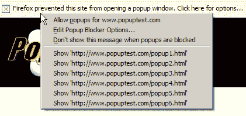

在这个例子中，Firefox 尽职尽责地阻止了来自 PopupTest.com 的弹出窗口。如果您愿意，您可以从上下文菜单中选择永久允许来自该站点的弹出窗口的选项；此外，您可以(仅一次)选择加载被阻止的弹出窗口。

当弹出窗口被阻止时，你还会在 Firefox 窗口的右下角看到一个图标:即使你选择了当弹出窗口被阻止时不要显示这个消息，这个图标也会一直可见。在图 2.27 中，图标出现在窗口大小调整手柄的左侧(右下角的小三角形圆点)。

**图 2.27。被阻止的弹出图标。**
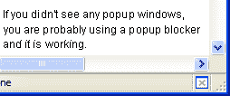

要查看任何被阻止的弹出窗口，单击信息栏并选择适当的显示'`*http://www.example.com/popup.html*`'选项。被阻止的弹出窗口只会突然出现一次。如果你想确定你没有错过任何东西(比如伟哥的一笔好交易)，这是很有用的。

你也可以告诉 Firefox 允许网站从现在开始为某个特定的站点打开弹出窗口。当你信任该网站并且不介意看到它的弹出窗口时，这是最好的选择——也许这是一个与工作相关的网站，你应该看到它的弹出窗口。无论什么原因，您都可以通过从信息栏中选择`*www.example.com*`允许弹出窗口来查看给定站点的弹出窗口。

不要害怕允许弹出窗口:你可以很容易地再次禁用弹出窗口。为此，请访问弹出窗口阻止程序选项。在“工具”>“选项”>“网络功能”下，您会看到一个“阻止弹出窗口”复选框，旁边有一个“允许的站点”按钮。图 2.28 显示了这一特征。

**图 2.28。弹出窗口拦截器选项。**
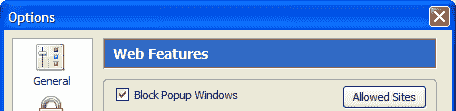

单击允许的站点按钮，显示允许在浏览器中打开弹出窗口的站点列表。图 2.29 显示了一个设置示例。

**图 2.29。“允许的站点”对话框。**
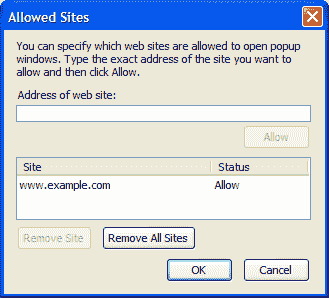

该对话框包含一个简单的网站白名单，允许其弹出窗口出现在您的浏览器中。您可以通过在对话框的网址栏中键入网址来将网站添加到列表中，但这是很难做到的。像我们以前做的那样，允许来自信息栏的弹出窗口要容易得多。删除一个站点非常简单，只需在列表中选择它(左键单击)，然后单击 Remove Site 按钮。

**用户启动的弹出窗口**

关于阻止弹出窗口的一个小注意:Firefox 不阻止用户发起的弹出窗口。如果你点击一个产生弹出窗口的链接，就会出现这样的弹出窗口。如果这样做，弹出窗口不会被阻止，因为这是您要求的。这是合乎逻辑的行为:如果我点击链接，我可能希望它做它应该做的事情。请参阅第 3 章“重新访问网页”中关于选项卡式浏览的讨论，了解在现有窗口或选项卡中捕获弹出窗口的方法。

用户发起的弹出窗口通常使用 JavaScript 实现。接下来，我们将看到如何控制 JavaScript 能做什么和不能做什么。

***禁用烦人的 JavaScript***

我不知道你怎么想，但是网站用 JavaScript 做的那些讨厌的事情真的让我很烦。我最讨厌的是会产生更多弹出窗口的弹出窗口，模糊正常状态栏文本的动画状态栏，以及试图误导的欺骗性状态栏文本。

我一直希望有一种方法可以在我的浏览器中关闭这些特定的 JavaScript 功能，而不会丢失这些网站提供的其他动态 JavaScript 功能。防止网站欺骗状态栏文本是一个好方法。阻止一个动态表单使用它的 JavaScript 脚本来计算我是“派对的灵魂”还是“不请自来的书呆子”并没有多大帮助。

Firefox 很好地支持了这种区分，它阻止某些 JavaScript 调用，而允许其余的调用。具体阻止哪些 JavaScript 调用可以在“Web 功能”偏好设置面板中配置。

**JavaScript Web 特性**

要找到这些 JavaScript 设置，请查看“选项”或“首选项”对话框的“Web 功能”面板。在高级…按钮旁边有一个启用 JavaScript 复选框，您可以单击它。图 2.30 显示了这种排列和由此产生的二级对话框:

**图 2.30。高级 JavaScript 选项。**
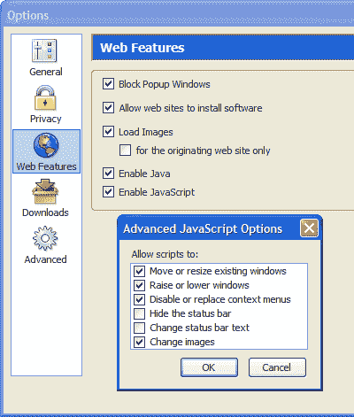

不要因为这些选项被描述为“高级”就害怕使用它们。这些实际上是相当模糊的选项，而不是特别高级的选项。下面是它们各自的工作内容。

*移动或调整现有窗口的大小*

取消选中此项可禁用试图调整已打开浏览器窗口大小的 JavaScript。这样做的网站通常希望窗口更小。它们通常是网页设计网站，但也可能只是为了让你心烦而创建的网站。然而，这个选项不会阻止弹出窗口选择自己的大小。如果您允许弹出窗口，或者该窗口是用户发起的弹出窗口，则弹出窗口可以选择自己的大小。

*升起或降下车窗*

这个选项在第一次检查时有点模糊，最初，我很难弄清楚“提高”和“降低”实际上是什么意思！这些选项控制 JavaScript 是否可以将一个窗口放在最前面(即“提升”)，从而放在桌面上显示的窗口的顶部，或者相反，隐藏其他窗口下面的一个窗口(即“降低”)。一个常见的“下”情况的例子，通常用于不正当的目的，是弹出式窗口，网站试图打开一个你不会注意到的秘密窗口。但是，有时这个特性是需要的，特别是当基于 Web 的应用程序需要同时维护几个打开的窗口，或者窗口需要显示警告消息时。

*禁用或替换上下文菜单*

你遇到过阻止你右键点击的网站吗？没有吗？也许你还记得试图保存一个引起你兴趣的图像，却发现你不能右击；相反，你会被严肃地告知这张图片是有版权的，不能下载。当禁用或替换上下文菜单选项被选中时，这种事情可能会发生。取消选中此选项会禁用任何试图隐藏上下文菜单的 JavaScript，因此上下文菜单始终可供您自由使用。

*隐藏状态栏*

取消选中此选项可防止网页隐藏 Firefox 窗口底部的状态栏。这是一个强烈推荐的选项，因为没有状态栏会产生安全风险(见下一点)。

*改变状态栏文本*

一些网站欺骗状态栏文本，用其他 URL 或其他文本替换链接的实际 URL。一些网站有令人讨厌的动画股票行情自动收录器一样的文本，尖叫着“欢迎来到我的主页！”这不仅令人讨厌，而且存在安全风险，因为您可能会被骗去点击一个链接，该链接指向一个您不希望访问的 URL。一段精心制作的状态栏文本也可能误导你，而不是惹恼你。这是一种所谓的“网络钓鱼”骗局，试图模仿正常的浏览器功能。我强烈建议您不要选中此选项。

*改变图像*

取消选中此选项会禁用依赖图像的 JavaScript 翻转和动态菜单等功能。它还禁用了一些基于图像替换的模糊表单提交技术。

##### 为假人下载

使用 Firefox 从互联网上下载文件是一项非常常见的活动。如果浏览器能让这种平凡的事情变得简单，那会很有帮助。Firefox 有几个标准特性，使得下载更容易；我们现在将一步一步来。在本书的后面，我们将看到如何用额外的特性来增强下载支持。

***下载文件***

当你第一次下载一个文件时，Firefox 会显示一个对话框，询问你应该如何处理这个文件。选择打开文件会指示 Firefox 将文件下载到一个临时目录，然后用您在下拉列表中选择的应用程序打开它。正如您所料，保存到磁盘只是将文件保存到您的硬盘上。图 2.31 显示了这个初始对话框:

**图 2.31。文件下载对话框。**
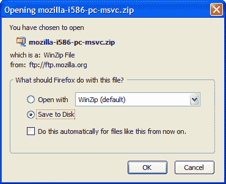

有风险的下载，比如可执行文件，不能被 Firefox 自动打开:你只能将这些文件直接保存到磁盘上。在这种情况下,“打开方式”选项被禁用，如图 2.31 所示。这种限制可以防止您意外运行不希望运行的应用程序。

还要注意标记为从现在开始对类似文件自动执行此操作的对话框复选框。此选项指示 Firefox 记住您的首选项，并在您下次下载相同类型的文件时预先选择它。您可以在“选项”对话框(工具>选项，Firefox >首选项或编辑>首选项，取决于您的平台)的“下载”部分更改此行为。图 2.32 显示了配置一些常用文件类型后的对话框。

**图 2.32。配置文件类型关联。**
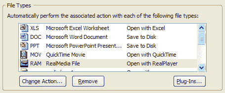

一旦 Firefox 记录了您的初始偏好，您就可以更改对记忆的文件类型采取的默认操作。点击 Change Action…按钮将允许您更改 Firefox 打开此类文件的应用程序，或者让您告诉浏览器恢复到将文件直接保存到磁盘。

***下载管理器***

Firefox 带有一个下载管理器，可以在一个地方显示你所有的下载。Firefox 不会像 Internet Explorer 那样为每次下载都显示一个下载对话框，而是将你的下载集中在一个位置，你可以在那里跟踪它们的进度，而不必与多个窗口竞争。图 2.33 显示了下载管理器。

**图 2.33。运行中的下载管理器。**
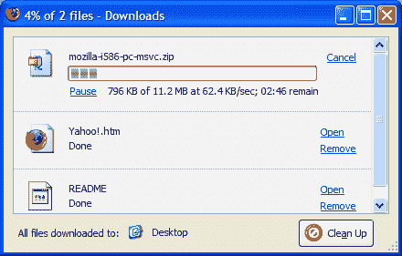

**图 2.34。打开包含下载文件的文件夹。**
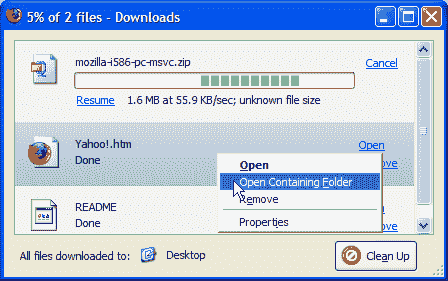

让我们快速讨论一下在下载管理器中你能做什么。首先，你会注意到正在进行的下载可以暂停或取消。只有在提供文件的服务器是这样配置的情况下，才能恢复暂停的下载，所以如果您不确定是哪个服务器，请不要暂停。通过单击打开链接，或者双击文件所在的行，可以打开已完成的下载。完成的下载也可以从下载管理器中删除。请注意，Remove 不会从磁盘上删除任何文件:它只是从下载管理器中删除它们。另一个通常需要的操作是打开包含下载文件的文件夹。这可以通过在下载管理器中右键单击文件所在的行，然后选择打开包含文件夹来完成。图 2.34 显示了这一细节。

请注意，在窗口的底部，还有一个标准下载目录的指示。这是正确的，前提是你没有配置 Firefox 询问你在哪里保存每个下载的文件。在上面的截图中，下载管理器提醒我们文件被下载到桌面，这是一个与当前操作系统用户帐户相关的文件夹或目录。

最后，Clean Up 按钮用于从下载管理器中删除已完成和已取消的条目，这有助于将下载管理器中的条目列表保持在合理的范围内。当所有下载完成后，Firefox 会在桌面右下角弹出一个小通知窗口，如图 2.35 所示。

**图 2.35。下载完成通知。**

默认情况下，Firefox 会将所有下载内容保存到桌面，并且不会提示。如果你喜欢保存到另一个位置，或者让 Firefox 提示你每次新下载的保存位置，进入工具>选项>下载(在 Windows 上),改变下载文件夹部分的设置，如图 2.36 所示。

**图 2.36。配置下载文件夹选项。**
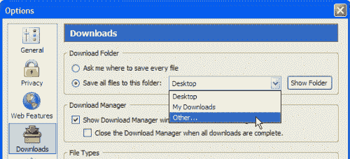

要在每次下载时提示保存位置，请确保选择了“询问我保存每个文件的位置”选项。否则，如果您想更改自动选择的默认下载位置，只需从下拉列表中选择其他…并选择您想要的文件夹。

如果您觉得下载管理器有点烦人(在这种情况下，您并不孤单)，您可以通过下载首选项(工具>选项> Windows 上的下载)禁用它，方法是取消选中下载开始时显示下载管理器窗口。如果您这样做了，您仍然可以从工具>下载或通过 **Ctrl-J** 快捷键调用下载管理器。当所有下载完成时，您将会收到通知。

如果您在下载文件时按下下载管理器中的暂停键，只要 Firefox 仍在运行，您就可以随时恢复下载。下载管理器还不支持跨会话恢复下载。跨会话恢复是一个非常有用的功能，它允许你在下载文件时关闭 Firefox，甚至关闭你的电脑。当您再次启动时，下载会从停止的地方继续。这个特性预计会出现在 Firefox 2.0 中:更多信息请参见[这个功能概述](http://wiki.mozilla.org/index.php/Firefox:2.0_Download_Manager)。当我们(尤其是拨号上网的人)耐心等待这个杀手级功能时，你可能会感到安慰，因为如果你试图过早退出浏览器，至少 Firefox 会警告你保护正在进行的下载。图 2.37 中的对话框显示了这个警告，它给你一个机会来改变你草率的退出决定。如果你继续，你部分下载的文件将不得不从头重新下载。

**图 2.37。退出时显示部分下载取消警告。**
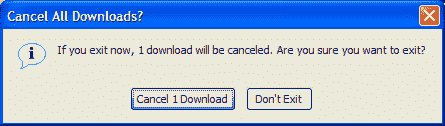

##### 安装插件

插件是附加程序，允许您在 Firefox 浏览器窗口或从 Firefox 窗口创建的单独窗口中查看非 HTML 内容，如 PDF 文件、Flash 内容、Java 小程序和视频。

如果当你查看带有插件内容的页面时，一个插件不见了，那么你会看到一个拼图块代替了内容；一个黄色的插件信息栏也会出现在页面的顶部。图 2.38 显示了缺少 Macromedia Flash 插件时的这种安排。

要自动安装所需的插件，只需点击安装缺失的插件…按钮，让 Firefox 为您找到插件。像平常一样按照出现的安装提示进行操作。在该过程结束时，当前页面会重新显示由新插件呈现的插件内容。

主要插件可用于 Adobe Acrobat、Macromedia Flash、Java、Apple Quicktime、Realplayer 和 Windows Media Player。Firefox 知道如何获得所有这些插件。然而，如果 Firefox 没有找到插件，或者你想要一个特定版本的插件或者其他特殊的安排，你可以自己安装插件。你可以在 https://addons.update.mozilla.org/plugins/获得大部分插件。

要从该页面安装插件软件，请查找适合您的操作系统的链接，单击它，然后按照出现的页面上的说明进行操作。支持文档也可以在 [PluginDoc 项目](http://plugindoc.mozdev.org/)中找到。如果你有任何问题，你可以参考更广泛的网站。

**图 2.38。插件内容占位符和信息栏。**
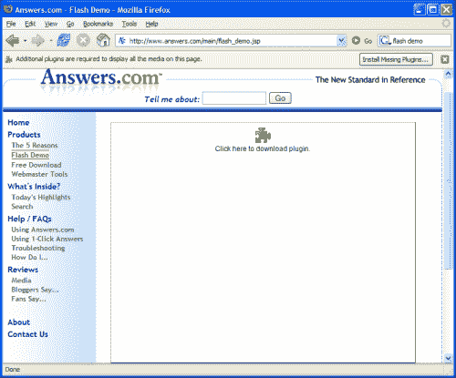

##### 查看您的电子邮件

Firefox 有一个电子邮件集成用户界面(UI)功能，可以让你在浏览器中创建和阅读电子邮件。它只适用于微软视窗系统。你可以从“工具”菜单中访问这个额外的功能:它甚至可以告诉你有多少未读邮件，前提是 Windows 已经注册了一个默认的电子邮件应用程序。在提供的两个菜单选项中，选择阅读邮件将启动您的默认电子邮件应用程序(可能是 Outlook、Outlook Express 或 Thunderbird)；选择 New Message…为您创建新的电子邮件。图 2.39 显示了这些菜单项。

**图 2.39。工具菜单上的 Windows 电子邮件选项。**
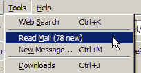

如果您选择自定义工具栏(使用视图>工具栏>自定义…)，您可以在导航栏中添加一个电子邮件按钮。它包含一个下拉列表，为阅读和创建电子邮件提供相同的选项。图 2.40 显示了左键单击后的按钮。

**图 2.40。基于工具栏的电子邮件按钮。**
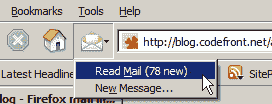

##### 摘要

在这一章中，我们已经介绍了 Firefox 的核心功能:在网络上高效使用 Firefox 需要知道的基本知识。

我们仔细研究了选项卡式浏览，以及它与老式的非选项卡式浏览器界面的比较。作者的结论是标签是一种更好的浏览方式。消除烦恼是 Firefox 擅长的另一项任务，除了标准功能之外，您还可以更改弹出窗口阻止并禁用烦人的 JavaScript。

在 Firefox 中找到它(TIMTOWTFI)的方法不止一种，现在你应该是使用 Firefox 进行搜索的高手了。智能关键字特别聪明，你也是，现在你知道如何创建和使用它们了！我们还介绍了我认为 Firefox 的另一个杀手级特性:FastFind，它允许你快速搜索页面中的文本。

除了选项卡、弹出窗口和搜索，我们还简要介绍了非 Web 内容的使用:下载文件、安装插件和访问电子邮件。Firefox 与所有那些非严格意义上的网络浏览活动整合得相当好。

在下一章，我们将继续探索 Firefox 的标准浏览特性。我们已经知道 Firefox 是一个高效的系统，可以把你从当前页面带到下一个页面。在第三章*重访网页*中，我们将会看到当需要重访你已经访问过的网页时，Firefox 有许多有用的特性。

##### 样本秘密

##### 第 6 章，提示、技巧和窍门

在 Firefox 引擎罩下隐藏着许多微妙的特性，其中许多是无法从菜单系统中访问到的:有些甚至需要你学习隐藏的键盘咒语！在这一章中，我们将深入游泳池的深水区，那里有这样的奇迹。我们将看看火狐的隐藏偏好，并揭开你的火狐档案隐藏的秘密。我们还将探索一些有用的技巧，从加速浏览器到改变它的外观和响应方式。

##### 名为 about:config 的秘密

Firefox 被设计成立即可用，无需任何配置工作。用户界面中没有令人困惑的过多偏好和选项——这个问题困扰着许多其他应用程序和网络浏览器。从设计上来说，Firefox 的配置界面比同类工具更简单。

虽然这种方法对于日常使用和“普通人”用户至关重要，但“高级”用户需要更灵活的方法。然而，这些特殊用户并没有陷入困境，因为 Firefox 有许多额外的首选项可以设置，尽管是通过某种非官方的方法。此类隐藏的首选项通过 about:config 配置页面进行管理。这是 Firefox 偏好设置系统的一个特殊界面。

要调用这个界面，在地址栏中键入特殊的 URL 或网址， **about:config** (是的，这是正确的说法)，然后点击 Enter。您应该会看到如图 6.1 所示的内容。

**图 6.1。介绍 about:config 界面。**
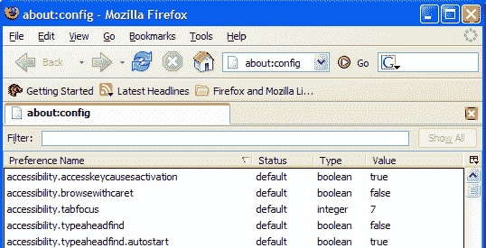

使用 Firefox 自己的 XUL 页面显示语言，显示特殊的首选项系统，而不是 HTML 网页。about:config 页面有点像一个对话框，只是它位于现有的窗口中，而不是一个单独的窗口。在图 6.1 中，页面显示在一个选项卡中。

这个接口的一些解释是适当的。列表中的每一行都反映了一个偏好。你可以在图 6.1 中看到五条这样的线。每个首选项都有一个名称和值。偏好设置的状态栏指示它是被设置为 Firefox 默认值(默认)，还是被用户更改为其他值(用户设置)。首选项的类型列标识了首选项保存的数据类型。

*注意*
偏好可以是三种类型之一:字符串、布尔或整数。字符串首选项是简单的文本字符串(如“你好”)，其中包括网址(https://update.mozilla.org/extensions/？应用程序=%APPID%)。布尔首选项是/否选项；它们要么对，要么错。著名科学家乔治·布尔是第一个解释如何处理真/假值的人，所以他们也被称为“布尔人”整数首选项接受任何整数值(如 1、2、23、1099)，但不能接受像 5.4 这样的小数。

在页面的顶部，您会看到一个过滤文本字段，您可以在其中输入一些文本来过滤掉首选项。这非常方便，因为完整的首选项列表跨越了很多页面。

##### 修改首选项

改变现有的偏好非常简单。只需双击该首选项行，或者右键单击它并选择 Modify。布尔首选项的值将自动切换(从“真”切换到“假”，反之亦然)。修改字符串和整数首选项会导致出现一个对话框，提示您输入首选项的新值。

进行更改时，您会注意到首选项的状态从默认更改为用户设置，并且首选项文本以粗体显示。这清楚地表明了与内置浏览器默认设置不同的首选项。

在数百个 Firefox 参数中，有一些特别方便的参数可以帮助 Firefox 变得更好。让我们来发现一些隐藏的宝石。

##### 加速 Firefox

这里有一个能让 Firefox 更快下载网页的配置技巧:启用 HTTP 管道。HTTP 管道允许 Firefox 同时发送多个请求，从而加快网页内容的加载速度。注意[更多关于 HTTP 管道](http://www.mozilla.org/projects/netlib/http/pipelining-faq.html)的技术细节是可用的。

警告
HTTP 管道是一项实验性的功能，如果 Web 服务器不正确支持，可能会导致某些网页显示不正确。虽然速度的提高可能是值得的，但如果你最喜欢的网页开始看起来怪异，请再次尝试关闭管道。

要启用管道，请打开 about:config 界面并:

*   将 network . http . pipeline 偏好设置设定为“true ”,为“直接连接”的 Web 访问启用 HTTP 管道
*   将 network . http . proxy . piping 首选项设定为“true ”,以便在通过代理服务器访问 Web 时启用 HTTP 管道。只有在使用代理服务器时，您才需要这样做；您的 ISP 或网络管理员可以告诉您是否如此。
*   将 network . http . pipeline . max requests 首选项设置为 1 到 8 之间的数字。这个数字是 Firefox 在管道中一次可以发出的最大请求数。我建议最初将其设置为最大值 8，然后从那里开始向后测试。(如 HTTP 1.1 规范所规定的，最大值是 8；不要试图将它设置得更高，因为这不会有任何效果。)每当您注意到页面显示有问题时，将该值递减 1(首先递减到 7，然后递减到 6，依此类推)。

有了这个隐藏的偏好，你必须完全重启 Firefox 才能确定速度是否有所提高。

##### 内联 URL 自动完成

这里有一个很有用的方法来启用 URL 的内联自动完成。当这个功能起作用时，无论你在地址栏中输入什么，Firefox 都会自动完成，并根据浏览器的历史记录确定最接近的匹配。当你得到一个匹配时，你可以按回车键，或者继续输入。这很像 Internet Explorer 中的内嵌自动完成功能。图 6.6 显示了它的工作情况。

**图 6.6。地址栏中的内联自动完成。**
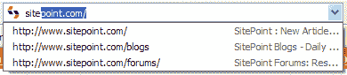

要启用这种效果，您必须添加一个尚未出现在 about:config 列表中的首选项。转到 about:config，右键单击页面上的任意位置，并从上下文菜单中选择 New > Boolean，如图 6.7 所示。

此菜单选项会产生几个对话框。当第一个对话框提示时，输入 **browser.urlbar.autoFill** ，如图 6.8 所示。

当提示您选择一个值时，选择 true，就这样:URL 的内联自动完成被激活！这种情况下不需要重启 Firefox 它马上就能工作。

**图 6.7。在 about:config 中创建布尔首选项。**
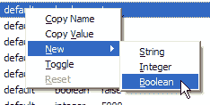

**图 6.8。命名新的首选项。**
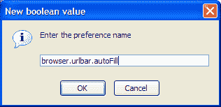

##### 第 7 章——Web 开发天堂

*警告*
这一章是面向网站开发者和设计者的，并且假设你有一些网站创建的知识。

从其对 Web 标准遵从性的偏好，到其内置的 Web 开发人员友好的特性，再到令人惊讶的大量有用的面向 Web 开发的扩展，Firefox 无疑是比任何其他 Web 浏览器都有用得多的 Web 开发工具！在这种情况下，这种夸张是完全准确的。

Firefox 的有用工具清单非常广泛。友好且实际有用的 JavaScript 调试工具——检查。提供详细的网页信息-检查。实时 DOM 检查器和编辑器-检查。能够查看从 Web 服务器返回的 HTTP 头–检查。通过最少的点击来验证 HTML、CSS 和可访问性一致性–检查。

使用扩展，你甚至可以编辑一个活生生的网页的 CSS，并立即观察结果。网页来自哪个网站都不重要！

在这一章中，我们将探索火狐的网络开发人员友好的特性。我们还将深入研究扩展，这些扩展是许多 Web 开发人员不可或缺的工具(包括我自己:我从 2001 年起就是一名自由 Web 开发人员，目前是 Java Web 开发人员)。如果你想让你的开发工作尽可能顺利和专业地进行，请继续阅读。

##### 火狐的标准工具

你不需要购买或下载任何东西来开始。许多有用的工具隐藏在标准的 Firefox 安装中。

***观看来源基础***

许多 Web 开发人员发现自己参与的首要任务之一是检查其他人的 Web 页面的源代码，无论是出于调试目的、作为学习辅助，还是仅仅为了满足自己抑制不住的好奇心。Firefox 附带了一个漂亮的页面源代码查看器，提供了内置的语法高亮显示。突出显示使得阅读 HTML 源代码更容易，并且更容易掌握页面的隐含结构。

您可以使用菜单系统查看页面的源代码:选择“查看”>“页面源代码”。或者，右键单击并从上下文菜单中选择查看页面源代码，或者点击 Ctrl-U。图 7.1 显示了对典型页面源代码的详细检查；在这种情况下，它是 Mozilla 网站上的 [Firefox 主页。](http://www.mozilla.org/products/firefox/)

如果您以阅读和编写 HTML 为生，您可能已经使用了提供语法高亮显示的 HTML 编辑器。现代浏览器应该达到同样的水平。然而，Firefox 的支持远胜于简单地打开黑白记事本会话——这是 Internet Explorer 6.0 的默认操作。

***查看选择来源***

有时候，浏览整个网页实在是太多了。您是否曾经希望可以自己检查特定页面元素的 HTML 源代码？(生成动态内容是一项常见的 Web 开发任务，总是容易出现粗心的错误，至少我是这样发现的。)也许你在别人的网页上看到了一个设计良好的元素，想知道是怎么做到的。使用 Internet Explorer，您可能会查看整个页面的 HTML 源代码，然后使用查找/搜索功能来定位匹配的 HTML。这可能是一个不可靠的过程，它依赖于你对页面上的上下文线索或其他模糊提示的回忆。

**图 7.1。查看 Firefox 主页的源代码。**
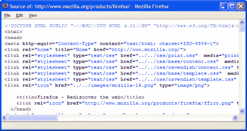

在 Firefox 中，这个过程很简单。只需用鼠标突出显示页面中感兴趣的元素，右键单击，然后选择查看选择源。例如，如果你想知道一个输入表单的复选框是如何编码的，只需用鼠标选中整个复选框；然后，单击鼠标右键，选择查看选择源。如图 7.2 所示，其中的“还记得我吗？”复选框突出显示。

**图 7.2。从上下文菜单中选择查看选择源。**
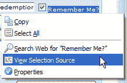

作为回报，Firefox 将向您显示您选择的 HTML 及其周围的代码，如图 7.3 所示。

**图 7.3。显示所选源代码的源代码。**
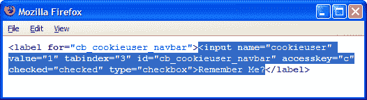

视图选择源为我节省了无数次，因为我编写 HTML 表单时，很容易犯一些微不足道的语法错误。查看选择源让我可以快速检查任何看起来工作不正常的表单元素。(通常，错误的原因是表单域命名不正确，或者省略了右引号。)

View Selection Source 也是一个很好的工具，可以帮助开发人员向最好的人学习。我经常发现自己在看由最好的网站开发者和设计者创建的网站的源代码。为了学习新的东西，我只查看页面中感兴趣部分的源代码。通过将 HTML 源缩小到一个特定的区域，视图选择源节省了时间并让我集中注意力。

***页面信息文档报告***

Firefox 通过查看页面信息功能提供关于网页的非常详细的信息，您可以从工具>页面信息中访问该功能，或者右键单击页面并从上下文菜单中选择查看页面信息。这两种方法都会弹出页面信息窗口，如图 7.4 所示，它会告诉你所有你想知道的关于页面的信息。

**图 7.4。显示 sitepoint.com 的页面信息。**
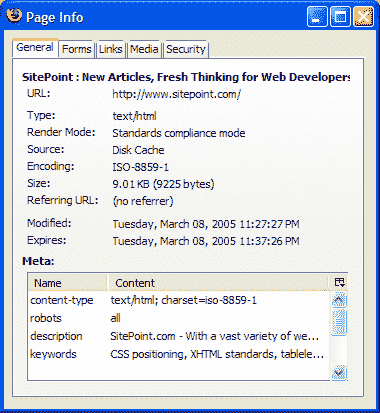

窗口顶部的每个选项卡代表一个关于网页信息的逻辑区域。让我们仔细检查每个选项卡，确定哪些部分对 Web 开发人员有用。

*常规选项卡*

顾名思义，图 7.4 所示的常规选项卡显示了关于网页的常规信息，包括其 MIME 类型、字符编码和页面大小。字符编码信息对于那些在国际化网页上工作的人特别有用。如果你有过用多种语言开发网页的经验(因此，使用多种字符编码)，你会知道如果你不小心，你会创建不正确编码的网页，显示为乱码。确保使用正确的字符编码可以节省大量调试时间。例如，仅仅因为您将元内容类型设置为“iso-8859-1 ”,并不一定意味着 Web 页面正在使用该编码！

另请注意“渲染模式”字段。这表明了 Firefox 布局引擎(称为 Gecko)如何呈现网页。在*标准兼容模式*中，Firefox 完全按照 HTML 和 CSS 规范中描述的方式呈现内容。*怪癖模式*，另一方面，适应现有的和制作不良的网页，这些网页是按照旧标准编码的，或者不是按照标准编码的。以怪癖模式显示的页面看起来仍然合理，因为它们的内容是以一种旨在表现“最大努力”而不是“学究式正确”的方式布局和呈现的 Firefox 通过首先检查 HTTP 内容类型，然后检查页面的 DOCTYPE 来确定使用哪种模式。具有内容类型 application/xhtml+xml 或 text/xml 的页面以符合标准的模式呈现。与 Internet Explorer 不同，Firefox 总是遵循 HTTP Content-Type 的指令。

最后，General 选项卡提供了网页中使用的内容标签的列表，以比 HTML 源代码更易读的格式呈现这些信息。

*表单选项卡*

Forms 选项卡是一个有趣的例子:它显示 Web 页面中表单和表单字段的详细信息。图 7.5 显示了为 Google 主页显示的表单信息。

**图 7.5。显示 Google.com 的“表单”选项卡。**
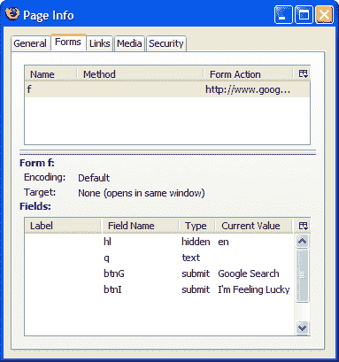

顶部列表框标识页面中的表单；底部列表框显示顶部列表框中所选表单中包含的表单域。

*注意*
如果页面不包含任何表单，该选项卡将为空。

在需要验证表单中包含的字段名以及隐藏表单字段的值的情况下，这种显示非常方便。它提供的信息格式比另一种格式更容易理解:HTML“标签汤”

*链接标签*

“链接”选项卡列出了网页中包含的所有链接。该列表包括通常的超链接以及到样式表的链接，以及指定相关元信息的任何链接(这些是表单的标签:`<link rel="linkName"/>`)。图 7.6 显示了一个示例报告。

**图 7.6。显示关于 sitepoint.com 链接的信息。**
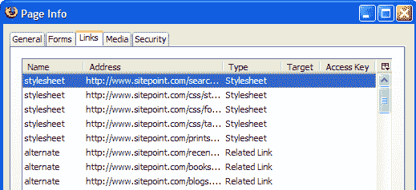

这个显示还允许您查看每个链接的目标，它标识该链接是否将在新页面中打开，以及每个链接的访问键，它是导致该链接导航的击键。您可以显示“访问键”栏，方法是点按“页面信息”窗口右上角的小按钮，然后在出现的对话框中选中“访问键”项。访问键列表对于开发可访问网页的人来说非常有用，因为它让我们一眼就能看出是否有链接缺少访问键，以及是否有访问键被分配给多个链接。

*媒体选项卡*

“媒体”选项卡包含嵌入给定网页的所有媒体文件(不仅仅是图像文件)的详细信息，甚至包括背景图像和收藏夹图标。您可以查看每个媒体文件的标题属性及其替换文本。要启用替换文本列，请单击窗口右上角的按钮，并选中替换文本，如图 7.7 所示。

**图 7.7。查看有关 sitepoint.com 媒体文件的信息。**
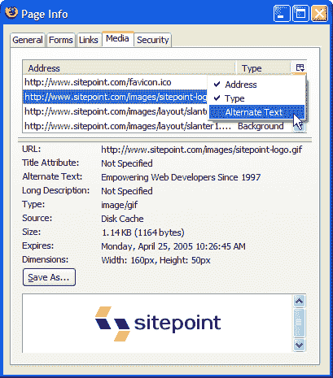

显示媒体文件的替换文本可以很容易地识别未指定 alt 属性的图像，并纠正这种情况。如果出于某种原因，您不能使用在线验证器，如 [Bobby](http://www.cast.org/bobby/) ，这将非常方便。这也是一个很好的方法来检查一个高质量的页面没有被你刚刚做的小改动破坏。

“媒体”标签的另一个有用功能是，它让您能够查看和存储媒体文件。只需从列表中选择一个给定的媒体文件，就会出现一个漂亮的小预览，还有一个“另存为”按钮，可以让你保存文件。有时，这是访问您想要保存的嵌入式媒体文件(如 Flash applet)的唯一方法。

*安全标签*

“安全”选项卡提供网页的安全相关信息。在一个正常发送的网页上——一个不是通过 HTTPS(安全 HTTP)发送的网页——安全选项卡会告诉你网站的身份无法验证，它不支持加密。但是，在安全交付的页面上,“安全性”标签会显示网站是否经过验证(通过其证书),并标识页面用于保护任何传输数据的加密类型。图 7.8 显示了 Google.com 的信息。

**图 7.8。通过安全选项卡访问加密详细信息。**
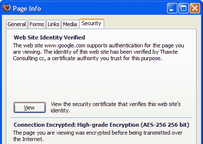

这是访问安全 HTTP 的加密细节的唯一方法。为了省心，如果您的页面或网站需要与其他网站(如支付处理设施)集成，那么检查这些细节是值得的。

***弹出 Cookie 跟踪***

您可能会发现有必要在用户的浏览器中设置一个 cookie。很自然，您通过浏览匹配的网页来测试 cookie，并验证它们是否按预期工作。也许您在设置 cookies 时会打印调试消息，这样您就可以看到发生了什么。如果不用添加临时诊断代码就能确认 cookies 是否设置好岂不是很好？Firefox 可以让你做到这一点。

要使此功能正常工作，请转到工具>选项>隐私，然后展开结果选项卡的 Cookies 部分(如果尚未展开)。从保留 Cookies:下拉列表中选择每次都问我，然后单击确定。

现在，浏览一个设置了 cookie 的网页:任何基于网络的电子邮件服务都可以做到这一点，就像互联网电影数据库一样。Firefox 会通知你正在设置一个 cookie，如果你点击 Show Details，你将能够访问关于这个 cookie 的具体信息，从它的名字和值，到它的截止日期。这些信息对于调试基于 cookie 和基于会话的网站来说绝对是无价的。图 7.9 显示了 Firefox 为 Google.com 报告的详细信息。

**图 7.9。火狐报告说 Google.com 想要设置一个 cookie。**
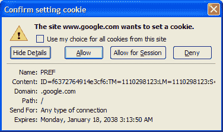

如果窗口太长，不适合默认显示，请拉伸窗口以查看整个 cookie 值。

一旦 cookie 被接受——单击“允许”( Allow)来实现这一点——您以后就可以很容易地召回它。要查看当前持有的 cookies，使用隐藏在 Firefox 菜单后面的选项，如第 3 章，重新访问网页中所讨论的。对于 cookie，进入工具>选项>隐私> cookie >查看 cookie。在 Linux 上，从编辑>首选项开始；在 Mac OS X 上，从 Firefox >偏好设置开始。

查看设置好的 cookie 细节是调试网页的一种“分而治之”的策略。它允许您一次处理一个问题，而不是将您的 cookie 问题与页面上的其他问题混在一起。在您确认 cookie 本身处于良好状态之后，您可以担心响应 cookie 值来操纵页面内容的脚本。

***JavaScript 控制台技巧***

在第 6 章，提示、技巧和黑客中，我们简单地提到了 JavaScript 控制台。现在让我们仔细看看这个工具。它被称为“控制台”,因为在这个工具中，任何来自脚本的内部生成的消息都会出现。

控制台是真正的瑰宝——调试 JavaScript 脚本的救星。Firefox 团队为了减少下载量，曾试图将其从浏览器中移除，但遭到了强烈抗议，该计划随即被放弃。JavaScript 控制台将一直存在。

在帮助调试 JavaScript 时，控制台会提供一条错误消息，一个指向出现问题的 JavaScript 文件行的直接链接，如果适用，还会提供错误的上下文。图 7.10 显示了字符串缺少右引号时产生的错误。

**图 7.10。在 JavaScript 控制台中显示错误。**
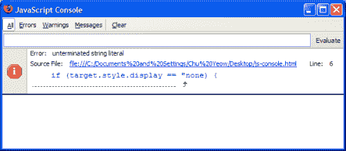

错误消息中显示的链接是非常有用的调试帮助。单击该链接将打开“查看源代码”窗口，并显示问题页面。更好的是，违规的那一行总是居中并突出显示，供您直接使用，如图 7.11 所示。

您可以过滤 JavaScript 控制台中显示的条目，只显示错误、警告和消息。点按看起来像菜单名称的文本项目来查看如何操作。

**图 7.11。突出显示视图源代码中的语法错误。**

两个隐藏的首选项影响 JavaScript 控制台的操作。第一个是 javascript.options.strict，默认情况下未设置。将它设置为 true，Firefox 有时会报告额外的不愉快消息——通常是围绕使用糟糕的编码实践编写的脚本。第二个首选项是 JavaScript . options . showin colle，默认设置为 false。除非你打算成为一名 Firefox 扩展黑客，否则不要碰这个。

发生错误时，JavaScript 控制台永远不会弹出:您必须自己手动启动它。在每个页面加载前按下清除按钮，以保持消息列表最小化。如果您确实看到控制台弹出，这表明当前页面不明智地使用了`javascript:` URL 作为链接目标。该 URL 除了显示 JavaScript 控制台之外没有其他用途。问题页面应该用`href="#"`代替。

在第 6 章，技巧、诀窍和窍门中，我们简要地谈到了 JavaScript 控制台作为计算器的使用。如果您稍微使用一下，您可以在控制台中执行更好的脚本操作。试着输入以下简单的脚本，然后点击**回车**或点击评估按钮: **`var a=5; var b=6; if (a > b) alert("Impossible"); else a*b;.`**

应该会出现数字 30。如果您颠倒这种比较的意义，您应该得到一个警告。

最后，即使没有 JavaScript 控制台，您也可以使用这种“动态”JavaScript 来探测显示的网页内容。让我们简单地回到 javascript: URL。访问[谷歌主页](http://www.google.com)(或任何基于表单的网页)，在搜索栏中键入一些东西(例如 Foo)，但不要开始搜索。取而代之的是，移动到地址栏，按如下方式键入一些内容: **`javascript:alert(document.forms[0].elements[1].value)`** 。

对于 Google 的主页，这个输入显示您刚刚输入的搜索文本。你可以用这种方式查看网页的任何部分。要获得更完整的方法，请尝试 JavaScript 调试器扩展，我们将在本章末尾提到它。

***DOM 检查员内容分析***

DOM Inspector，简称 DOMi，是一个允许您查看和动态编辑 XML 文档(如 Web 文档或 XUL 页面)的文档对象模型(DOM)的工具。它是 Web 开发期间调试和学习的优秀工具，对于 Mozilla 应用程序开发(编写 Firefox 扩展和主题的过程)几乎是必不可少的。

安装 DOM Inspector 后，您可以检查 HTML 文档的 DOM 结构——构成页面的一组嵌套标签。该结构以横向显示的分层树格式呈现。您可以放大文档中的特定元素，并研究关于它的大量信息，包括 DOM 节点对象属性、CSS 样式规则的应用、框模型属性，甚至 JavaScript 方法和属性。

在 Windows 版本中，默认情况下不安装 DOM 检查器；要获得它，您必须在安装 Firefox 时选择自定义安装。这提供了添加 DOM 检查器的选项，如图 7.12 所示。

**图 7.12。选择安装 DOM 检查器。**

如果您在安装时忘记获取 DOM 检查器，也不是世界末日。一个简单但有些破坏性的解决方案是卸载 Firefox，然后重新安装，在出现提示时选择自定义安装。一个更好的解决方案是[下载检查器作为一个单独的扩展](http://hacksrus.com/~ginda/venkman/)。在跳转到下载链接之前，请务必仔细阅读发行说明:目前，Firefox 版本 0.9.85 是绝对必需的最低版本。

一旦你安装了 DOM 检查器，你可以通过工具> DOM 检查器菜单选项，或者通过 **Ctrl-Shift-I** 调用它。

让我们在 SitePoint 主页上浏览一下 DOM Inspector 的用法。

*打开文件进行检查*

要开始检查网页，在 Firefox 中浏览到该文档，然后运行 DOM 检查器(工具> DOM 检查器或 **Ctrl-Shift-I** )。这将选择当前加载的文档进行检查，并在 DOM Inspector 中显示该文档的 DOM。您也可以从 DOM 检查器的文件菜单中选择一个文档，方法是选择一个窗口(文件>检查一个窗口)，或者在 DOM 检查器的文本字段中输入文档的 URL 并按下 Inspect，如图 7.13 所示。

**图 7.13。输入用于 DOM 检查的 URL。**

让我们加载 SitePoint 主页。DOM Inspector 将顺从地用页面 https://www.sitepoint.com/index.html.的 DOM 的分层树视图填充左边的*文档窗格*。右边的对象窗格显示关于在左边窗格中选择的节点的信息。用户将左窗格的内容稍微展开后，显示如图 7.14 所示。

**图 7.14。视察 sitepoint.com 大教堂。**

如果 SitePoint 页面没有显示在 DOM 检查器窗口的底部，请通过“视图”>“浏览器”添加它。我发现这是一种将被检查的节点与其在文档中的外观相匹配的便捷方式。如果您喜欢 DOM 检查器窗口不那么杂乱，您可以将检查过的页面留在 Firefox 浏览器窗口中。为此，请在打开 DOM 检查器之前，在普通浏览器窗口中显示页面。

*注意*
火狐内部被检查的页面只有一个版本！浏览器窗口和 DOM 检查器窗口以两种不同的方式显示单个文档。这被称为“多视图显示”

*选择节点和页面元素*

一旦 DOM Inspector 启动并运行，就可以随意使用左上角面板中显示的页面层次结构了。单击小加号图标，展开和折叠层次结构中任何感兴趣的部分。这个简单的动作以一种不同于视觉布局的方式展示了页面的结构。

注意
如果你没有使用默认的火狐主题，加号图标可能会被其他图标取代。不管图标看起来像什么，它们的操作是一致的。

另一种访问相同细节级别的方法是使用 DOM Inspector 工具栏左上角的 Inspect 节点图标选择要检查的节点。从菜单中选择“搜索”>“通过单击选择元素”也是同样的做法。图 7.15 显示了检查节点图标。

**图 7.15。DOM 检查器的检查节点图标。**

单击图标激活检查功能，然后将包含该页面的浏览器窗口置于最前面。单击您感兴趣的页面元素，在页面显示中相应的元素(或其父元素)会出现一个闪烁的红色矩形。返回到 DOM Inspector 窗口，页面层次结构将被展开以显示匹配的节点，该节点应该被选中并高亮显示。当您试图确定文档中给定元素的属性时，这种技术特别有用。DOM Inspector 允许您查看所有内容，而不需要您向页面添加诊断样式或脚本。

这个元素选择过程也可以反过来进行。在 DOM Inspector 的左窗格中选择(通过左键单击)一个节点将会高亮显示匹配的页面节点，并带有同样闪烁的红色边框。这种配对效应如图 7.16 所示。

**图 7.16。在页面中突出显示 DOM Inspector 元素。**

最后，您可以通过 ID、类或标签来查找特定的元素。例如，您可以搜索`<a>`标签或``标签，甚至搜索特定属性的值，如`href="http://www.example.com/"`，使用望远镜图标，搜索>查找节点…，或 **Ctrl-F** 。点击 **F3** 将开始搜索文档中的下一个匹配元素。

*信息视图*

DOM 检查器可以显示关于特定文档元素的几种类型的信息。这些显示可从右侧面板左上角的下拉菜单中获得。图 7.17 显示了该列表中的项目。

**图 7.17。对象面板中的信息类型。**

我们将依次研究这些选项，看看它们如何帮助您的 Web 或应用程序开发工作。

*DOM 节点视图*

DOM 节点视图显示所选节点的 DOM 表示。文档容器—`<html>`标签的视图如图 7.18 所示。

**图 7.18。在 DOM 节点视图中显示文档容器。**

稍后我们会看到，当您动态编辑当前文档的 DOM 时，这个视图是最有用的。

*盒子模型视图*

框模型视图显示所选节点的定位和布局相关属性。节点的尺寸、填充和边距等值都会显示出来。这个视图中的小菜单可以让您选择您最感兴趣的生命统计数据。图 7.19 显示了可能性。

**图 7.19。使用盒模型视图检查定位和布局属性。**

当您需要找出一组嵌套页面元素中多余空间的来源时，这个视图非常有用。

*XBL 绑定视图*

XBL，或可扩展绑定语言，是一种 XML 标记语言，它将 JavaScript 对象和其他内容附加到 HTML 或 XML 元素上，以便使这些元素更加智能和更具功能性。添加的代码称为绑定，它描述了绑定元素的行为。对于这本书来说，XBL 有点太先进了，而且它还不是一种在 Web 开发界广泛使用的技术。Mozilla 应用开发者——那些在 Firefox 之上构建扩展和工具的人——是对它最感兴趣的人。请注意，如果你对 Mozilla 平台上的应用程序开发感兴趣，可以在 http://www.mozilla.org/projects/xbl/xbl.html 的[和 http://xulplanet.com/tutorials/xultu/introxbl.html 的](http://www.mozilla.org/projects/xbl/xbl.html)[找到关于 XBL 的更多信息。](http://xulplanet.com/tutorials/xultu/introxbl.html)

XBL 绑定视图显示了通过 CSS 规则加载到被检查文档中的 XBL 绑定。当您不确定当特定的 HTML 事件针对显示的页面元素时会发生什么处理，并且您真的想知道所有血淋淋的细节时，可以使用它。

*CSS 样式规则视图*

CSS 样式规则视图标识应用于所选节点的 CSS 规则。它甚至向您显示了规则是在哪个字段中定义的，以及它们所在的确切行号。该视图列出了原始规则，而不是级联或计算后的规则。它类似于视图源代码，但是是针对 CSS 样式表而不是 HTML。

您经常会看到页面本身没有包含的特定 CSS 规则。例如，通常有格式为`"resource://,"`的 CSS 文件，如`resource://gre/res/html.css`和`resource://gre/res/ua.css`。这些是 Firefox 的默认 CSS 样式规则，在网页指定的任何规则之前应用。图 7.20 在顶部面板的第一行显示了这样一个规则的例子。

**图 7.20。在 CSS 样式规则视图中标识 CSS 样式规则。**

在此面板的上半部分选择一个规则，其 CSS 属性将显示在下半部分。另外，您可以添加、编辑和删除属性，并通过此面板实时观察更改的效果。换句话说，您可以立即观察到 CSS 规则将如何影响网页的布局、外观和感觉。相信我，这对于测试实验性变化或者调整页面布局非常有用。由于更改是实时发生的，所以没有必要陷入通常的(也是乏味的)循环:编辑文件、保存文件、在浏览器中刷新页面、再次编辑文件，等等。如果不是因为我们稍后将讨论的实时更改页面 CSS 的非常方便的方法，这将更加有用。

让我们通过一个简单的例子来展示这个特性的便利性。在 SitePoint 主页上，有一个小小的框元素，作为最近 SitePoint 文章的标题。如图 7.21 所示(但是请注意，SitePoint 站点是定期返工的，所以这可能会改变)。

**图 7.21。SitePoint 的盒装 title 元素。**

让我们假设我们正处于调整的情绪中，并且想要在衬线字体中试验居中对齐的文本(Georgia 看起来相当不错)。嗯，如果我们可以直接访问 sitepoint.com 网页上的 CSS 文件，我们可以在那里进行更改，上传新的 CSS 文件，并在浏览器中刷新页面。不幸的是，我们没有这个权限。这就是 DOM Inspector 非常好用的地方。

使用 DOM Inspector，我们分两步进行:找到我们想要更改的位，然后自己进行更改。

首先，检查页面并选择您想要编辑的元素。在这种情况下，这是装箱的标题元素。现在，切换到检查器中的 CSS 样式规则视图。您应该会看到如图 7.22 所示的内容。

**图 7.22。将 CSS 样式规则应用于所选元素。**

“CSS 样式规则”列表显示了应用于选定节点的规则，按特定性的升序排列。换句话说，当您在列表中向下移动时，规则变得更加具体，因此会否决位于它们之前的列表项。选择第二个 h3 规则，DOM Inspector 将用从该文件应用的 CSS 属性填充右下窗格。现在你已经设置好了，并准备做出改变。

让我们改变字体为我们选择的衬线字体，格鲁吉亚。在列表中找到 font-family 属性，并双击它。你会看到如图 7.23 所示的提示；这将要求您输入属性值。

**图 7.23。编辑 CSS 属性。**

输入此字符串代替当前值: **`georgia,"times new roman",times`** 。

点击 OK，神奇的事情发生了。在原始页面中，标题以 serif 字体显示，如图 7.24 所示。

**图 7.24。用 Georgia 制作漂亮的站点标题。**

现在，将文本框中的文本居中怎么样？嗯，您会发现在可用的样式表中没有出现文本对齐属性，所以让我们继续添加一个。为此，右键单击属性窗格上的任意位置，并从上下文菜单中选择新建属性。当提示输入属性名时，填写`**text-align**`，当提示输入属性值时，填写`**center**`。完成后，你会立即看到调整的结果:漂亮的，居中的，衬线字体标题如图 7.25 所示。

**图 7.25。将 SitePoint 的标题居中。**

如果您喜欢结果，只需将更改添加到您的用户定义的 CSS 文件中，使它们成为永久性的。当然，DOM 检查器不允许您更改原始站点的内容。

*计算样式视图*

当多个 CSS 规则应用于一个元素时，Firefox 会将它们组合起来，得到一组“计算”的 CSS 样式规则。组合(或“解析”)过程基于 [CSS 规范](https://www.w3.org/Style/CSS/)中指定的优先规则。图 7.26 中显示的“计算 CSS 样式规则”页面显示了这一组已解析的规则。

**图 7.26。查看计算的 CSS 样式规则。**

使用这个和 CSS 样式规则视图，您可以观察 Firefox 如何解析 CSS 规则。只需更改任何工作表——或任何工作表属性——并观察对计算结果所做的更改。这是理解 CSS 中优先级规则的一种非常实用和实验性的方法。

*JavaScript 对象视图*

JavaScript Object 视图列出了可用于为所选节点编写脚本的 JavaScript 对象。这包括所有传统的页面特性(访问表单元素和链接)、所有 DOM 特性(例如，添加和删除子节点以及节点本身)，以及页面设计者添加的任何脚本内容(例如处理程序和额外的表单对象属性)。图 7.27 提供了所显示的众多对象特征的一瞥。

**图 7.27。通过 JavaScript 对象视图查看可用的 JavaScript 对象。**

一个常见的 JavaScript 对象是目标对象，它包含所选节点的许多属性和方法，对于找出 DOM 节点上可用的方法特别有用。

*动态编辑 DOM*

有了 DOM 检查器，您就可以“实时”编辑被检查文档的 DOM 这意味着您可以添加或删除 HTML 内容，包括脚本和内联样式。您所做的任何更改都会立即反映在文档中，无需重新加载任何文件。图 7.28 显示了提供这些操作的下拉菜单。

通过 JavaScript 对象视图查看可用的 JavaScript 对象。

**图 7.28。动态编辑 DOM。**

在文档的 DOM 视图中，所选元素的子节点通常是其属性。例如，如果选择了一个元素，它将会有子节点 src 和 alt 等等。所以这个视图比简单的标签层次结构更加详细。

因为您可以编辑和删除现有的节点，并插入新的节点，所以您可以使用 DOM Inspector 来试验 Web 页面中元素的不同属性。至于 DOM 检查器的其他部分，您可以“实时”观察效果例如，您可能希望用另一个图像替换 img 标记的 src 属性，从而交换图像；或者，您可能想要调整表格的列宽，以便查看这些更改对列的比例可能产生的影响。

DOM Inspector 还允许您检查 XUL 页面:构成 Firefox 浏览器本身的页面。你可以检查所谓的 chrome 网址，了解火狐自己的 XUL、JavaScript 和 CSS 文件是如何编码的。下面是一些值得考察的有趣的 chrome 网址。

*   要查看浏览器本身，可以试试 chrome://browser/content/browser . XUL
*   要查看选项对话框，请尝试 chrome://browser/content/pref/pref . XUL
*   要查看书签管理器，可以试试 chrome://browser/content/Bookmarks/Bookmarks Manager . XUL
*   要查看 JavaScript 控制台，请尝试 chrome://global/content/Console . XUL

浏览这些网页会让你大吃一惊！这样的调查对于那些跨越到开发 XUL 应用程序、扩展或主题的人来说是重要的第一步。

*警告*
编辑一个文档的 CSS 或 DOM 有时会有意想不到的结果。如果在编辑 DOM 或 CSS 的过程中，您发现页面显示不正常或不符合预期，请尝试重启 Firefox。您可能编辑了影响所有网页的全局属性，或者编辑了默认的 Firefox CSS 规则。当使用 DOM 检查器时，这些改变是暂时的；快速重新启动将撤消您的更改并恢复默认设置。编辑 XUL 网页甚至更冒险:确保在你尝试之前做足功课。

这就是 *Firefox Secrets* 的节选！下一步是什么？

[下载 PDF 格式的本章内容](https://www.sitepoint.com/show-modal-popup-after-time-delay/)，您将拥有一份可以随时参考的副本。

查看这本书的目录,找出到底包括了什么。

现在就在 SitePoint.com 买一本你自己的书吧。

我们希望你喜欢 [*火狐的秘密*](https://www.sitepoint.com/premium/library) 。

## 分享这篇文章