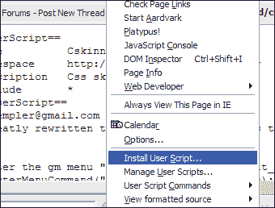
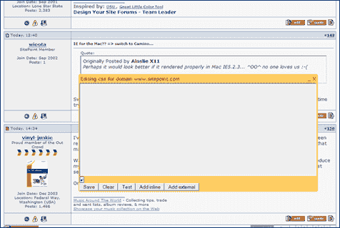
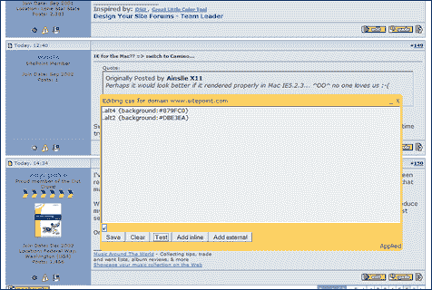

# 火狐——秘密泄露了

> 原文：<https://www.sitepoint.com/firefox-the-secret-is-out/>

你可能已经注意到了，SitePoint 的最新作品刚刚上架 Cheah Chu Yeow 的《Firefox Secrets》。如果你不知道的话，朱耀文在过去的几年里经营着最有影响力和信息量最大的[火狐博客](http://blog.codefront.net/)之一，并且是 Mozilla 社区长期以来受人尊敬的成员。

现在，我不得不承认我花了一段时间才把这本书好好读一读。我的意思是，嘿，…我一直在用火狐/火鸟/凤凰，因为‘豆荚’只不过是你的豌豆的容器。关于火狐，他们能告诉我什么？

事实证明相当多。事实上，看看凯文、汤姆和办公室其他人的反应，这本书应该被命名为“*哦，酷！，我不知道你可以这样做！*’。意识到你可能完全错过的真正重要的东西是非常令人惊讶的。

因此，为了证明这一点，而不是从 Cheah 的书中窃取一个很酷的技巧，我想我会加入我自己的小 Greasemonkey 演示，并在书中留下值。

**用 Greasemonkey 和 Cskinner 重新装修**

虽然我们对 SitePoint 的重新设计有非常积极的回应，但也有一些评论说更干净的色调使论坛比他们希望的更加明亮。虽然我们仍在微调设计，这里有一个简单的方法让火狐用户自己挑选论坛配色方案。

1.安装 [Greasemonkey](http://greasemonkey.mozdev.org/) (如果你还没有的话)。

2.转到[thedt.net](http://blog.thedt.net/cskinner/#)并安装马特的 Cskinner Greasemonkey 脚本(如果你是 Greasemonkey 新手，只需点击链接，让它以纯文本形式加载到你的浏览器窗口，然后转到“工具/安装用户脚本”(如图)。

3.导航到 SitePointForums(或者任何你想修改的域)。

4.转到“工具/用户脚本命令/Skinner(域)”。如果你想只改变你正在查看的页面，而不是整个论坛，请选择“Skinner(page)”。你应该会看到一个快乐的黄色“文本输入面板”漂浮在页面上方。

5.是时候开始收集了。查看页面的源代码，并确定要重新设计哪些元素的样式。我可以告诉你，左边面板(海报的名字)的造型类是“. alt4”。主 post 面板的类是“. alt2”。把你的 CSS 直接写到文本区，然后点击“测试”按钮。例如:

`.alt4 {background:#879FC0}`

瞧啊。猴子跑了。

6.修改你的颜色，当你满意时，点击“保存”按钮锁定你的修改。从现在开始，无论你什么时候访问这个网站，你的样式都将覆盖默认设置(它们是最后加载的，所以等一下)。

7.要更改或删除您的样式，只需转到脚本运行的任何页面，重新打开 Cskinner 面板并进行编辑。太容易了。

难道这不会让你想要一边咯咯地笑一边威胁地搓着手吗？…Mwha 哈哈哈哈..’？

好吧，也许这只是我。

## 分享这篇文章