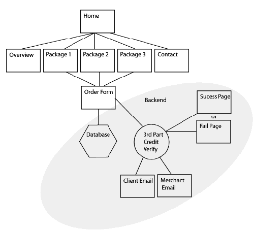
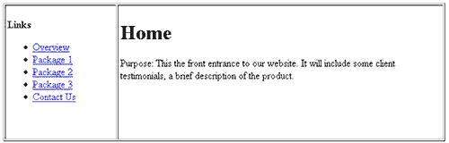
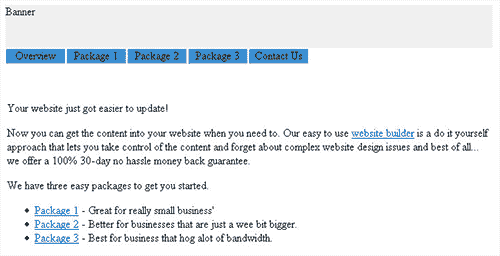

# 线框你的网站文章

> 原文：<https://www.sitepoint.com/wire-frame-your-site/>

我们都听过一遍又一遍:“如果你没有计划，你就计划失败”。在设计和创建网站的世界里，如果你没有计划好，当你重新设计你的网站以适应内容时，你会有很多头疼的事情，熬夜和错过最后期限。

在创建任何图形之前，执行几个简单的步骤来仔细规划您的站点，可以消除许多令人头痛的问题。我发现一个非常有用的方法是创建一个线框或“白色网站”模型。我将在本文中概述线框化的好处和过程。

##### 针尖潜在问题

为了更好地理解网络框架网站的世界，我们可以考虑史莱克。在史莱克又大又绿又丑之前，他是一个铁丝框架。

在 3D 动画世界中，线框是角色的工作模型，没有颜色、皮肤、衣服或头发。这样，动画师可以很容易地测试模型，并在花费大量金钱开发其优点之前对其进行修改。

这个原则对于网站建设者来说也是非常有价值的。网络框架网站包括建立一个纯文本版本的网站，有工作链接，但没有图形细节。

在你的网站的这个工作模型中，链接可以被跟踪，这为你的网站上的信息如何连接和网站如何流动提供了一个真实的感觉。一旦你在网站上添加了内容，它就能让你准确定位以后可能出现的潜在问题。

我发现这种技巧非常有助于让我首先关注内容。一旦我解决了这个问题，我就可以开始给线框添加支持内容的皮肤(即图形内容)。

让我们开始吧。过一会儿，我将带你经历我发现在规划我的网站有用的线框架过程。但是首先，我们将创建一个站点地图。

##### 准备你的网站地图

在我们开始使用线框模型之前，最好先画一个网站页面的快速信号流程图。画出代表每一页的简单方框，并在里面写上页面的标题。使用线条来表示网站的各个部分将如何链接在一起。对于大多数网络专业人士来说，这可能是一个相当基础的步骤，你可能已经在设计网站的时候做了。

您的站点地图可以是手绘的，也可以使用 Microsoft Visio、Adobe Illustrator 或 Macromedia FreeHand 等程序。

目标是为你的站点提供一个单页的概述，作为构建线框的指南。我通常把它打印出来，放在旁边作为我建立线框模型时的参考。

##### 创建您的线框模型

***阶段 1-创建线框***

现在是时候打开你选择的 HTML 编辑器，开始拼凑你的线框模型了。重要的是在这一点上不要走得太远。试着消除你所有的布局想法，把注意力集中在网站的框架上。

首先，为您在站点地图中勾画的每个块创建一个简单的 HTML 页面。包括网页的标题和网页的用途。

[点击弹出大图。](https://i2.sitepoint.com/graphics/wireframes1.png)

一旦你建好了整个网站，你就可以把它上传到服务器的安全区域，让你的客户签字或者修改你的线框。这将有助于消除对网页和网站运行方式的误解。

它也给你一些有形的东西展示给客户，这是相对快速和容易创建的。我花了不到一个小时就完成了一个 12 页网站的第一阶段线框。

您还可以使用线框作为收集内容的清单。站点越复杂，线框就越有用。

***阶段 2—添加您的内容***

一旦你设置好了所有的页面，并且你的客户已经批准了页面标题、目的和链接标题，你就可以开始填写每个页面的内容了。

我建议你把网页的目的放在顶部，把内容放在下面。通过这种方式，您可以随时参考您的原始计划。跟踪每个页面的目的也有助于指导客户决定应该显示什么类型的内容。通常，客户会希望添加一些他或她可能在其他网站上看到的内容，但你觉得这些内容不符合页面的目的。问题很容易解决:提醒客户该页面的目的，并询问他们希望如何进行。当面对更大的画面时，大多数客户会意识到内容不适合，并且至少愿意在建议的内容上妥协。

[点击弹出大图。](https://i2.sitepoint.com/graphics/wireframes2.png)

***阶段 3-使用图像占位符*** 开始布局页面

在第三阶段，我们完成我们的线框模型。此时，我们需要使用占位符图像或通过创建单独的层来创建网站的粗略布局。

图层效果最佳，因为当您与客户讨论布局时，它们更容易移动。然而，如果网站不是过于复杂，一个简单的基于表格的布局应该可以完成这项工作。

更好的是，如果您使用 Macromedia Dreamweaver，Eric Ott 已经创建了一个扩展，可以帮助您创建线框。可以从 [Macromedia Exchange 网站](http://www.macromedia.com/cfusion/exchange/index.cfm#loc=en_us&view=sn104&viewName=Extension%20Details&authorid=8769534&page=0&scrollPos=0&subcatid=0&snid=sn104&itemnumber=0&extid=51463&catid=0)免费下载。

[点击弹出大图。](https://i2.sitepoint.com/graphics/wireframes3.png)

##### 结论

线框绝对不是设计网站最激动人心的部分。然而，当作为设计过程的一部分实现时，它们会被证明是非常有价值的。它将帮助你，设计师，专注于你试图通过网站传达的营销信息，制作一个更有效的网站，并打开与客户沟通的渠道。它还可以节省你一卡车的时间。

## 分享这篇文章