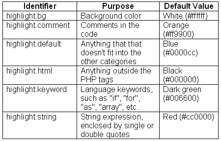
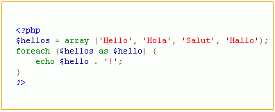
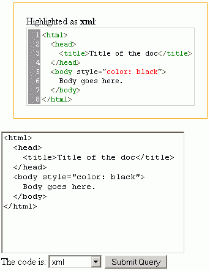

# 突出显示 PHP 应用程序中的源代码

> 原文：<https://www.sitepoint.com/highlight-source-code-php/>

如果你运营一个关于编程的网站，很有可能你会在网站的页面上展示源代码。如果源代码被突出显示——用不同的颜色显示——就像桌面编程编辑器和 ide 显示它一样，那不是很好吗？这肯定会让你的访问者更容易阅读代码。

本教程解释了如何突出显示网站上显示的多种编程语言的源代码，而无需手动格式化和编码。

我将展示如何以两种方式突出源代码:

1.  使用 PHP 的内置荧光笔的 PHP 源代码

3.  使用 PEAR 的`Text_Highlighter`包突出显示几乎任何编程或标记语言的源代码

这篇教程是我上一篇文章的续篇，标题是[在 PHP 应用程序中使用 BB 代码](https://www.sitepoint.com/article/bb-code-php-application)，它对代码环境使用了相同的设置。虽然本文并不假设您已经阅读了上一篇文章，但是您可能想看一看其中的设置部分。

##### 使用 PHP 内置的源荧光笔

PHP 提供了两个突出 PHP 代码的函数: [`highlight_file()`](http://php.net/highlight_file) 和 [`highlight_string()`](http://php.net/highlight_string) 。两个函数返回相同的结果，但是每个函数都有自己特定的输入参数。顾名思义，第一个函数接受要突出显示其代码的 PHP 脚本的文件名，而第二个函数接受字符串形式的输入。

***快速举例***

让我们来看一个`highlight_string()`函数的例子:

```
<?php 

include_once 'init.inc.php'; 

if (!empty($_POST['text'])){ 

    echo '<div style="border: solid 1px orange; padding: 20px; margin: 20px">'; 

    highlight_string($_POST['text']); 

    echo '</div>'; 

} 

?> 

<form action="<?php echo $_SERVER['PHP_SELF']?>" method="post"> 

    <textarea name="text" style="width: 300px; height: 200px"><?php  

        echo @$_POST['text'];  

    ?></textarea> 

    <br /> 

    <input type="submit" /> 

</form>
```

这个脚本显示了一个简单的文本框，您可以在其中键入或粘贴想要突出显示的 PHP 代码。该示例的代码可在[本文的代码档案](https://www.sitepoint.com/examples/highlightcode/code_archive.zip)中获得，在线[演示可在](http://www.w3clubs.com/sp/hilite/hi_test1.php)获得。脚本开始时需要的`init.inc.php`文件的用途在我上一篇文章的[设置部分已经解释过了。](https://www.sitepoint.com/article/bb-code-php-application)

这里有一个运行中的脚本截图。


如您所见，高亮版本的代码比标准的黑白代码更清晰、更容易理解。

***颜色定制***

PHP 荧光笔使用以下颜色显示代码:



第一列中的标识符实际上是 PHP 配置指令的名称。这意味着您可以通过修改 PHP 配置来自定义高亮颜色。所以，如果你想让你的关键字变成粉红色(我知道不好看，但这只是一个例子)，你可以通过使用一个简单的。htaccess 文件，包含:

```
php_value highlight.keyword #ff00ff
```

***原生 PHP 方法的弊端***

如您所见，这种突出显示 PHP 源代码的方法非常容易使用，效果很好，并且是可定制的。然而，它也有一些缺点:

*   它只能在 PHP 源代码上正常工作。有时候，当突出显示其他编程代码(如 HTML 或 JavaScript)时，您可以得到一些可以接受的结果，但大多数时候，结果不会很好。这只是因为这些突出显示的函数是专门为 PHP 代码设计的。
*   在执行突出显示后，生成的 HTML 代码不符合 XHTML。这个问题在 PHP5 中得到了纠正，但是在 PHP4 中，高亮显示使用了`<font>`标签，这在今天的 Web 编码人员看来几乎是一种犯罪。

##### 使用 PEAR:向`Text_Highlighter`包问好

在它的 PHP 库库中， [PEAR](http://pear.php.net/) 有一个特殊的包用来突出显示源代码。它叫做 Text_Highlighter，它的 [`细节、文档和下载都可以在`](http://pear.php.net/package/Text_Highlighter)`在线获得。`

 `这种包装的特点是:

*   能够突出显示 12 种不同编程语言的源代码
*   可扩展性；这个包允许你用一个简单的 XML 文件定义更多的语言
*   可以使用行号和制表符大小选项
*   在控制台窗口中突出显示代码的能力
*   输出以 XHTML 格式提供，语义上使用`<span>`标签，格式上使用 CSS 样式

***几个字就设置好了***

准备系统运行以下示例:

1.  安装 PEAR 核心库

3.  安装`Text_Highlighter`包

设置您的环境，也就是复制我的 10 行`init.inc.php`文件

这些步骤在上一篇文章中有详细描述，并不难做到。不要害怕这里的“安装”这个词:它基本上只是一个“复制”操作。这种设置不需要你在服务器上有任何特权，在低成本的共享主机环境中很容易完成。如果您想[看到示例设置的目录结构，请浏览本文中的代码示例](http://www.w3clubs.com/sp/hilite/)。

***用法***

完成设置后，您就可以开始使用荧光笔了。为了突出显示 PHP 源代码中包含的，比如说，`$some_source_code`变量，您需要做的就是:

1.  包含类别定义:
    `require_once 'Text/Highlighter.php';`

4.  创建一个对象的类:
    `$highlighter =& Text_Highlighter::factory('php');`

7.  调用高亮显示方法并打印输出:
    `echo $highlighter->highlight($some_source_code);`

***测试荧光笔***

这里有一个简单的脚本，可以用来测试荧光笔包:

```
<?php 

include_once 'init.inc.php'; 

if (!empty($_POST['text'])){ 

    echo '<link rel="stylesheet" href="hilight.css" />'; 

    echo '<div style="border: solid 1px orange; padding: 20px; margin: 20px">'; 

    require_once 'Text/Highlighter.php'; 

    $highlighter =& Text_Highlighter::factory('php'); 

    echo $highlighter->highlight($_POST['text']); 

    echo '</div>'; 

} 

?> 

<form action="<?php echo $_SERVER['PHP_SELF']?>" method="post"> 

    <textarea name="text" style="width: 300px; height: 200px"><?php echo @$_POST['text']; ?></textarea> 

    <br /> 

    <input type="submit" /> 

</form>
```

这里有一个运行中的脚本截图。



你可以[在这里玩现场演示](http://www.w3clubs.com/sp/hilite/hi_test2.php)。

***彩虹的颜色***

如你所见，PEAR 荧光笔的工作方式很像我们首先看到的内置 PHP 荧光笔。与前一个例子唯一可见的区别是颜色的数量:这里有七种，而不是我们在第一个例子中看到的三种。这之所以成为可能，是因为当涉及到源代码的“成分”时，PEAR highlighter 更加细化。

如果您查看上面脚本结果的源代码，您会看到突出显示部分将`<span class="hl-something">`标记放在不同的源代码元素周围。为了显示颜色，需要定义 CSS 类名，比如`hl-xxxx`。

如果你愿意，你可以看一下上面的例子中使用的 CSS 文件。如您所见，CSS 文件中使用了 18 个样式定义，其中 15 个与源代码文件中的不同元素相关:变量、字符串、括号、引号等。CSS 定义给了你自定义高亮颜色的能力。

***不全是 PHP！***

到目前为止，所有的例子都集中在着色 PHP 代码上。但是如果你的网站不是关于 PHP 的呢？有些人可能认为运气不好，但`Text_Highlighter`包却不是，它为其他 11 种编程和标记语言提供了丰富的支持，包括 C++、CSS、JavaScript、XML(也用于 HTML 文件)等等。

要突出显示另一种语言的代码，只需更改下面一行中的“php”来反映您选择的语言:

```
$highlighter =& Text_Highlighter::factory('php');
```

想突出 CSS？

```
$highlighter =& Text_Highlighter::factory('css');
```

现在可以突出显示 CSS 样式表了。

以下是创建 highlighter 对象时可以使用的语言标识符的完整列表:

*   `'cpp'`
*   `'css'`
*   `'diff'`
*   `'dtd'`
*   `'javascript'`
*   `'mysql'`
*   `'perl'`
*   `'php'`
*   `'python'`
*   `'ruby'`
*   `'sql'`
*   `'xml'`

你可以[用这个现场演示](http://www.w3clubs.com/sp/hilite/hi_test3.php)来看看其他语言是怎么上色的。源文件可以在[本文的代码档案](https://www.sitepoint.com/examples/highlightcode/code_archive.zip)中找到。

顺便提一下:你可能已经注意到 highlighter 类的一个对象是使用它的`factory()`方法创建的。这是一种流行的面向对象技术(OO 模式)。虽然理解工厂模式的内部工作方式不是本文所必需的，但是如果您感兴趣的话，您仍然可以找到更多的内容；【PHPPatterns 条目是一个很好的起点。

***微调荧光笔***

除了着色，荧光笔还可以:

*   显示行号和源代码
*   使用不同的制表符大小来缩进代码

第一个特性可以通过两种方式激活:使用编号列表(`<ol>`)或 HTML 表格。在后一种情况下，您可以使用 CSS 为包含数字的列定义一种样式，这种样式不同于包含源代码的样式。

这些选项作为带键的数组传递:

*   `'numbers'`:该设置接受以下值:
    *   `0`:默认值，表示不使用编号
    *   `HL_NUMBERS_LI`:将使用有序列表
    *   `HL_NUMBERS_TABLE`:代码将以表格形式显示

*   `'tabsize'`:该选项取整数值。它设置将使用多少个`&nbsp;`来替换一个标签。

如果选择“表格”选项，可以使用以下 CSS 选择器来自定义表格的外观:

*   `h1-main`–用于带有源代码的行
*   `hl-gutter`–编号行
*   `hl-table`–整张桌子

例如，请看一下本文的样式表。上面提到的三个 CSS 选择器可以在样式表的底部找到。

一个示例选项数组如下所示:

```
 $options = array( 

            'numbers' => HL_NUMBERS_TABLE, 

            'tabsize' => 4, 

        );
```

***设置选项***

有两种方法可以设置突出显示选项:

1.  最简单的方法:只需将选项添加到工厂方法中。就语法而言，这是一种更简单的方法，但它的存在只是为了向后兼容。
    `$highlighter =& Text_Highlighter::factory('php', $options);`

3.  正确的方法:使用渲染器对象。

如上所述，除了浏览器，荧光笔还可以在控制台窗口中进行颜色编码。在未来，新的显示设备，如 PDA、电话、你心爱的 iPod 或(最后但并非最不重要的)你的厨房水槽也可能得到支持——谁知道呢？为了允许这种类型的向前兼容性，工作的显示部分被传递给 renderer 对象。到目前为止，有两种呈现器:HTML 和控制台。你需要做的就是创建一个渲染器对象，然后将它传递给荧光笔。方法如下:

```
 require_once 'Text/Highlighter.php'; 

    require_once 'Text/Highlighter/Renderer/Html.php'; 

    $options = array( 

            'numbers' => HL_NUMBERS_TABLE, 

            'tabsize' => 4, 

        ); 

    $renderer =& new Text_Highlighter_Renderer_HTML($options); 

    $highlighter =& Text_Highlighter::factory('php'); 

    $highlighter->setRenderer($renderer); 

    echo $highlighter->highlight($_POST['text']);
```

完整的源代码清单可以在本文的代码档案中找到。一个使用 HTML 渲染器和表格显示源代码的[现场演示也是可用的。这里有一个运行中的脚本截图。](http://www.w3clubs.com/sp/hilite/hi_test4.php)



##### 其他选项

这里有一些本文中没有提到的选项，您可能想看看。

*   GeSHi: [通用语法荧光笔](http://qbnz.com/highlighter/)–一个非 PEAR 的荧光笔包，目前支持 35 种编程语言。
*   Aidan Lister 的 PHP 存储库包含两个使用和扩展原生 PHP 着色的类。[第一个类](http://aidan.dotgeek.org/lib/?file=function.highlight_file_linenum.php)添加行号，把 PHP 函数做成 PHP 手册的链接。[第二个](http://aidan.dotgeek.org/lib/?file=PHP_Highlight.php)做了同样的事情，但是以自己的方式，没有使用原生 PHP 函数。它还生成 XHTML 输出，并可以选择使用样式表进行颜色定义。
*   [Enscript](http://people.ssh.fi/mtr/genscript/) 是一个用于语法高亮显示的命令行工具。它的一个例子是这个 [WordPress 插件](http://scott.yang.id.au/2004/05/syntax-hilight-enscript/)。

##### 摘要

在本文中，我们详细讨论了在 PHP 应用程序中突出源代码的两种方法。如果您想快速着色 come PHP 代码，调用一两次语言内置的本地高亮函数。或者，如果您想突出显示更多的语言和更多的显示选项，可以考虑安装一个 PEAR 的 Text_Highlighter 包。

现在，您已经基本了解了如何使用颜色编码来增强包含源代码的网页的可读性，并改善访问者的体验。` 

## `分享这篇文章`