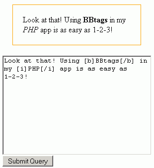
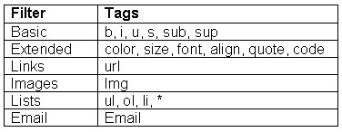
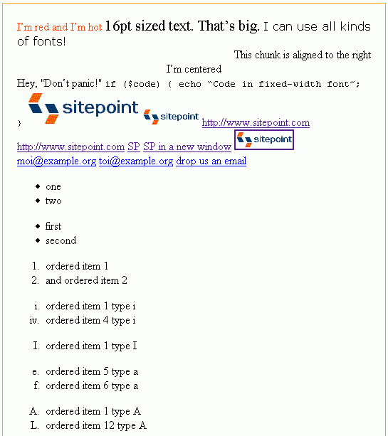
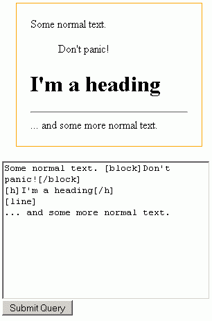

# 在你的 PHP 应用程序中使用 BB 代码

> 原文：<https://www.sitepoint.com/bb-code-php-application/>

许多网站允许访问者或管理员通过各种方式对网站内容做出贡献:内容管理系统、论坛、博客或其他评论系统。当你建立这样的网站时，给用户提供通过张贴格式化文本来增强内容的能力是一个好主意。

类似地，在构建与编程相关的站点时，一个非常吸引人但很少见的特性是能够突出显示编程代码，用不同的颜色来表示不同的编程语言关键字、函数等等。

这一系列文章将为您提供入门所需的一切:

*   使用所谓的 BB 码来格式化网站内容
*   内容中使用的几乎任何编程语言的彩色代码

在本指南的第一部分，您将学习如何在您的 PHP 应用程序中使用 BB 代码。

##### BB 码是什么？

BB 代码是一组非常简单的指令(也称为 BB 标记)，它提供了一段文本应该如何格式化的规则。当包含 BB 代码的页面显示在浏览器中时，BB 标记会被浏览器可以理解的适当的 HTML 标记所替换。

注意首字母缩写“UBB”和“BB”在本教程中作为同义词使用。“BB”代表“公告板”；“UBB”代表[“终极公告板”](http://www.ubbcentral.com/)，可能是第一个基于网络的公告板系统。

##### 为什么要用 BB 码？

BB 代码广泛应用于 phpBB 或 vBulletin 等社区论坛系统。很可能你网站的访问者或内容贡献者已经很熟悉它了，或者他们能很快跟上。BB 标签可以手动输入；或者，网站所有者可以构建 JavaScript 支持的界面，以允许更简单的点击式内容格式化。

本教程结束时，您将能够使用 BB 代码来转换字符串，如下所示:

```
[b]bold[/b] text into <b>bold</b> text 
```

并且:

```
[color=blue]blue text[/color]
```

变成:

```
<span style="color: blue">blue text</span>
```

如果你觉得现有的 BB 标签对于你网站的内容格式不够灵活，不要担心。在本教程结束时，你将知道足够创建自己的 BB 标签，例如，替换

```
[mytag]my content[/mytag]
```

随你喜欢！

在本教程中，我们将按照 4 个步骤学习如何使用 BB 代码:

1.  设置您的代码环境

3.  使用 PEAR 的 BBCodeParser

5.  使用配置选项定制解析器

7.  创建您自己的 BB 标签

请注意，您可以[下载本文所需的所有代码](https://www.sitepoint.com/examples/bbintro/bbintrocode.zip)——随着我们逐步深入，这将使事情变得更加简单。

##### 设置

系统设置可能不是您最喜欢的任务，但是这里需要一些系统管理员的工作。你很快就会看到，这绝对是值得的。如果您愿意，现在可以跳过设置部分。请继续阅读更有趣的“使用 BBCode 解析器”一节，当您准备好自己测试和试验这些示例时，再回到这里。

***梨子设置***

BBCodeParser 是我们将用来处理 BB 标签的 PHP 库的名称。这是一个 PEAR 包，所以您需要安装 PEAR。如果你已经是一个梨转换者，对你有好处！你可以跳过下一段。

如果您是 PEAR 新手或者还没有迈出这一步，那么今天是您迈出这一步的绝佳时机——并开始从这个庞大的高质量 PHP 代码库中受益。在 SitePoint 上，你会发现[开始使用 Pear](https://www.sitepoint.com/getting-started-with-pear/) ，这是一个很棒的教程，解释了如何在你的系统上安装 Pear 并开始使用它。

安装完核心 PEAR 库之后，需要安装 BBCodeParser 包。您可以使用 PEAR 安装程序或者直接从 PEAR 站点获取包，并将其粘贴到/HTML 目录下的 PEAR 代码库中。

完成后，您的 PEAR 目录应该如下所示:

```
/PEAR 

    /HTML 

        /BBCodeParser 

           /example  

           /Filter 

               Basic.php 

               Email.php 

               ... 

           BBCodeParser.php 

    /PEAR 

        /Command 

        /Frontend 

    PEAR.php
```

***`init.inc.php`文件***

在 UBB 代码解析发生之前，必须做一些准备工作。这项工作全部转移到`init.inc.php`文件中，以保持它与安装的其余部分分开。

我们必须完成的任务包括:

*   将 PEAR 目录添加到包含路径中
*   如果`magic_quotes_gpc`选项是`ON`，则去掉斜线

出于本教程的目的，我已经将我的 PEAR 目录设置为包含示例文件的根教程目录的子目录；如果不同，您可以更改 PEAR 目录的路径。

斜杠代码直接取自 PHP 手册的`get_magic_quotes_gpc()`条目。

`init.inc.php`文件包含在本文的[代码档案中——更多信息请参考该文件中的行内注释。您的测试脚本应该从需要这个`init`文件开始。](https://www.sitepoint.com/examples/bbintro/bbintrocode.zip)

***测试脚本***

为了测试您将要学习的 BB 处理指令，我们将使用一个带有一个文本区域的简单表单:

```
<form action="<?php echo $_SERVER['PHP_SELF']; ?>" method="post"> 

    <textarea name="text" style="width: 300px; height: 200px"><?php echo @$_POST['text']; ?></textarea> 

    <br /> 

    <input type="submit" /> 

</form>
```

我们所有的测试都将包含这个表单。它们将以一个`bb_`前缀和一个序列号作为后缀来命名。

这涵盖了设置环境所需的一切。包含完整目录结构的文本文件包含在本文的代码存档中，只是为了确保您理解正确。

##### 基于 BB 代码解析器的构建

现在，让我们编写一些代码，使用 BB 代码解析器来显示一个格式正确的网页。

***一个简单的例子***

在测试脚本中，我们将首先检查表单是否被提交；如果是，我们将解析`'text'`字段中的代码。

我们需要一些关键元素来解析插入到这个`'text'`字段中的任何 BB 代码:

*   应该创建一个`HTML_BBCodeParser`类的实例
*   必须调用方法`setText()`和`parse()`
*   我们努力工作的成果将使用`getParsed()`方法检索。

为了突出脚本执行的结果，我们将用橙色边框将它们包围起来。

下面是所需的代码:

```
if (!empty($_POST['text'])){ 

    echo '<div style="border: solid 1px orange; padding:20px; margin: 20px">'; 

    require_once 'HTML/BBCodeParser.php'; 

    $parser = new HTML_BBCodeParser(); 

    $parser->setText($_POST['text']); 

    $parser->parse(); 

    echo $parser->getParsed(); 

    echo '</div>'; 

}
```

下面是实际运行的脚本:



你自己试试！从[本文的代码档案](https://www.sitepoint.com/examples/bbintro/bbintrocode.zip)中提取完整的`bb_test1.php`文件，并在您已经设置好的环境中执行它。

***使用`qParse()`和处理 HTML***

上例中的三个方法，`setText()`、`parse()`和`getParsed()`，可以用一个方法调用来代替，`qParse()`—“q”，如“quick”。

如果你不想执行输入到文本区的 HTML 代码，你只需要调用`htmlspecialchars()`。这将使所有的`<`变成`&lt;`，所有的`>`变成`&gt;`，以此类推。

下面是简化和去除 HTML 的版本:

`$parser = new HTML_BBCodeParser();
   echo $parser->qParse(htmlspecialchars($_POST['text']));`

试用包含在[文章代码档案](https://www.sitepoint.com/examples/bbintro/bbintrocode.zip)中的新`bb_test2.php`脚本。您可以尝试的基本 UBB 标签包括:

```
[b]bold[/b] 

[i]italics[/i] 

[u]underlined[/u] 

[s]stikethrough[/s] 

[sub]subscript[/sub] 

[sup]superscript[/sup]
```

##### 配置选项

除了上面列出的 UBB 标记之外，BBCodeParser 还附带了许多其他标记供您使用。然而，为了从中受益，您必须首先配置解析器，这是使用“INI”(初始化)文件完成的。本文的代码归档中包含一个示例 INI 文件，它位于 BBCodeParser 包的`examples/`目录中。

您可以从它的原始位置使用这个 INI 文件，或者将它复制到您选择的方便的目录中，例如，您的根测试目录。然后，返回到创建`HTML_BBCodeParser`类的测试文件，并更改实例化行:

```
$options = @parse_ini_file('BBCodeParser.ini');  

$parser = new HTML_BBCodeParser($options);
```

通过这样做，您向该类提供了从 INI 文件中读取的所有选项。如果需要，您可以更改 INI 文件的路径和名称。

***INI 文件***

您可以在 INI 文件中设置的最重要的配置项是这一行:

```
filters     = Basic,Extended,Links,Images,Lists,Email
```

这告诉解析器哪些过滤器要被解析，哪些应该被忽略。过滤器只是 BBCodeParser 使用的一个 PHP 类，它定义了一组 BB 标记。下表描述了每个 BBCodeParser 过滤器为您提供的 BB 标签:



解析器的主要优点是它可以被配置为允许或不允许标记或标记组。例如，如果您在 CMS 中使用这个解析器，并且您不希望允许客户端添加图像，因为您担心它们可能会破坏您漂亮的设计，您可以通过 INI 文件删除图像过滤器。

您可能希望在 INI 文件中更改的其他配置选项有:

*   “quote style”—您可以将该值设置为“double”以符合 XHTML
*   “打开”和“关闭”条目——如果您运行的是 PHP5，可能需要用引号将它们的默认值括起来

以下是这些设置将如何出现在您的 INI 文件中:

```
quotestyle  = double  

open        = "["  

close       = "]"
```

测试脚本`bb_test3.php`和 INI 文件`BBCodeParser.ini`包含在本文的[代码档案](https://www.sitepoint.com/examples/bbintro/bbintrocode.zip)中。

***UBB 码语法***

此时，你可能会想，“哦，不！而不是另一种要学习的标记语言……”不用担心；您和您的用户很可能已经知道这些标签中的大部分。例如，如果您曾经在基于 phpBB 的论坛(如 SitePoint Forums)或其博客和文章评论中发表过文章，那么您应该知道 UBB 代码。

不过，公平地说，有些标签可能需要进一步澄清，因为几乎每个 UBB 代码实现都是一种 UBB 方言。不要担心，有一个简单的方法来掌握它。您可以学习 UBB 代码语法，同时通过将以下用户输入粘贴到测试脚本的文本区域来测试您的解析脚本。然后，坐下来欣赏结果。

```
[color=red]I'm red and I'm hot[/color]  

[size=16]16pt sized text. That's big.[/size]  

[font=Verdana]I can use all kinds of fonts![/font]  

[align=right]This chunk is aligned to the right[/align]  

[align=center]I'm centered[/align]  

Hey, [quote=http://www.h2g2.com]Don't panic![/quote]  

```
if ($code) {  

    echo "Code in fixed-width font";  

}
```  `[img]https://www.sitepoint.cimg/sitepoint-logo.gif[/img]  

[img w=80 h=25]https://www.sitepoint.cimg/sitepoint-logo.gif [/img]  

http://www.sitepoint.com  

https%3A%2F%2Feditor.sitepoint.com  

https%3A%2F%2Feditor.sitepoint.com  

https%3A%2F%2Feditor.sitepoint.com  

https%3A%2F%2Feditor.sitepoint.com  

moi@example.org  

[email]toi@example.org[/email]  

[email=we@example.org]drop us an email[/email]  

[ulist]  

    [*]one  

    [*]two  

[/ulist]  

[list]  

    [*]first   

    [*]second  

[/list]  

[list=1]  

    [*]ordered item 1  

    [*]and ordered item 2  

[/list]  

[list=i]  

    [*]ordered item 1 type i  

    [li=4]ordered item 4 type i[/li]  

[/list]  

[list=I]  

    [*]ordered item 1 type I  

[/list]  

[list=a s=5]  

    [li]ordered item 5 type a[/li]  

    [*]ordered item 6 type a  

[/list]  

[list=A]  

    [li]ordered item 1 type A[/li]  

    [li=12]ordered item 12 type A[/li]  

[/list]  

[list=A s=3]  

    [li]ordered item 1, nested list:  

            [li]nested item 1[/li]  

        [list=I]  

            [li]nested item 2[/li]  

        [/list][/li]  

    [li]ordered item 2[/li]  

[/list]`
结果应该是这样的:

你可以使用 CSS 来细化一些标签的显示，包括`<a>`、`<code>`、`<q>`(`[quote]`BB 标签)等等。或者，您也可以使用`nl2br()`将新行转换为`<br />`。
创建您自己的 BB 标签
喜欢到目前为止？好吧，现在是你站出来完全掌控自己命运的时候了！或者换句话说，随意定制解析器。
在本节中，您将创建自己的自定义解析器过滤器和自定义 BB 标记。让我们称过滤器为`MyBB`，标签为`[h]`、`[line]`和`[block]`。当这些标签被解析后，它们将被替换为旧的 HTML 标签`<h1>`、`<hr />`和`<blockquote>`。
为此，您需要为 MyBB 过滤器创建一个类定义。该课程需要:

```

*   被命名为`HTML_BBCodeParser_Filter_MyBB`
*   扩展基类`HTML_BBCodeParser`
*   放在一个`MyBB.php`文件中
*   位于`YourPEARDir/HTML/BBCodeParser/Filter`

事不宜迟，下面是您需要在`MyBB.php`文件中包含的代码，以便提供标题、水平线和块引用格式特性:

```
<?php  

require_once 'HTML/BBCodeParser.php';  

class HTML_BBCodeParser_Filter_MyBB extends HTML_BBCodeParser  

{  

    var $_definedTags =   

        array('block' => array( 'htmlopen'  => 'blockquote',  

                                'htmlclose' => 'blockquote',  

                                'allowed'   => 'all',  

                                'attributes'=> array()  

                                ),  

              'line' =>  array( 'htmlopen'  => 'hr',  

                                'htmlclose' => '',  

                                'allowed'   => 'all',  

                                'attributes'=> array()  

                                ),  

              'h' =>     array( 'htmlopen'  => 'h1',  

                                'htmlclose' => 'h1',  

                                'allowed'   => 'all',  

                                'attributes'=> array()  

                                ),  

        );  

}  

?>
```

唯一剩下的事情是将`MyBB`添加到 INI 文件的过滤器行:

```
filters     = Basic,Extended,Links,Images,Lists,Email,MyBB
```

你完了！下面是正在使用的定制标签。



##### 相关文件

这个 BB 标签教程到此为止。您已经学到了一些东西，可以马上开始使用，丰富您的应用程序！

首先，访问[http://pear.php.net](http://pear.php.net)并免费下载 PEAR 库。这是一个好主意，因为它允许您在安装 PEAR 时稍微放松一下您的系统管理员肌肉。如果您还记得我们在本教程的设置部分所说的，那么您所需要的就是 PEAR 基类和 BBCodeParser 包。

以下是本教程中创建和使用的其他文件，它们可以在[代码归档](https://www.sitepoint.com/examples/bbintro/bbintrocode.zip  )中找到:

*   目录结构——一个文本文件，显示了我在示例中使用的目录结构，仅供您在`directory_structure.txt`中参考
*   初始化脚本— `init.inc.php`
*   测试脚本— `test1.php`、`test2.php`和`test3.php`
*   自定义过滤器，应该保存在您的 pear dir/HTML/BBCodeParser/Filter/mybb . PHP—`MyBB.php`
*   配置文件— `BBCodeParser.ini`
*   所有内容都是 zip 文件

##### 尝试…并保持关注

您知道最好的学习方法是实践，所以继续吧:设置您的环境，运行示例并尝试它们。将 BB 代码功能添加到您的 CMS(留言簿/博客/论坛/you-name-it)从未如此简单！

…请继续关注本教程的下一部分。

## 分享这篇文章