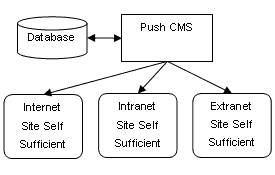
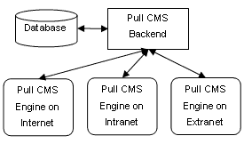

# 推与拉——争夺最佳 CMS

> 原文：<https://www.sitepoint.com/push-pull-best-cms/>

**内容管理系统(CMS)为多方提供了必要的基础设施，以便在整个信息生命周期中有效地提供内容和协作。**

从技术角度来看，推送 CMS 和拉取 CMS 之间有着根本的区别。本文概述并比较了两者，解释了为什么推送 CMS 优于拉取 CMS。

##### 什么是推送 CMS？

推送 CMS 的特点是以 Web 服务器中立格式的平面文件(独立于数据库的文件)的形式缓存和交付内容。在推送 CMS 中，内容从存储库中聚合并“烘焙”成标准文件，然后通过开放标准推送到适当的 Web 服务器。如下图所示，推送 CMS 通常位于企业防火墙内部。

##### 什么是拉 CMS？

在拉式 CMS 中，特殊的交付软件直接安装在实时网络服务器上。当在 Pull CMS 上请求一个网页时，从数据库中提取必要的内容片段，并组合成一个页面。拉 CMS 通常存在于公司防火墙之外。

推送 CMSs 和拉取 CMSs 都为用户提供了以分布式方式更新和管理信息的能力。然而，当从技术架构和发布的角度考虑时，这两种类型的系统是根本不同的。

##### 推送 cms 的优势

1.  ***Search Engine Index-Friendly URLs***

    当内容以平面文件格式被推送到 Web 服务器时，该内容本质上是搜索引擎友好的，因为搜索引擎被设计来索引基于文件的网站。例如，由推送 CMS 生成的 URL 如下所示:

    http://www.site.com/company/about.asp

    或者，拉 CMS 生成的 URL 可能如下所示:

    http://www.site.com/default.asp?ID=123

    拉 CMS URL 的关键问题是搜索引擎很难跟踪包含变量的链接。许多搜索引擎会忽略“？”后面的所有内容因此不索引网站上的所有页面。这不是推送 CMS 的问题。此外，在推送 CMS 中，在 URL 中找到的搜索关键字有助于提高搜索结果排名。

    当使用站点分析和点击软件时，搜索引擎友好的 URL 也很重要。例如，使用推送 CMS，像 Web Trends 这样的产品无需额外的配置就可以工作。集成这样一个程序来处理 Pull CMS 生成的自定义动态 URL 可能会很困难，如果真的有可能的话。

3.  ***Multi-Server Content Publication***

    使用推送 CMS 可以轻松地将内容发布到多个服务器。为了发布到其他服务器，管理员将服务器访问信息添加到中央存储库中，内容通过开放标准(如 FTP、s FTP、VPN、映射网络驱动器或本地文件系统)推出。相同的过程适用于在第二台机器上维护实时网站的镜像备份。

    使用拉式 CMS，内容的交付与边缘服务器联系在一起，因此 CMS 交付引擎必须安装在每台提供内容的实时服务器上。要添加另一台机器，必须专门为 Pull CMS 软件配置服务器。每增加一台拉 CMS 边缘服务器，维护开销可能会急剧增加。

5.  ***Content Independence from the CMS***

    当推送 CMS 传送内容时，文件是完全独立的格式。以这种方式提供内容有三大好处:

    1.  这些文件可以存档或移动，管理员不必担心这种移动会导致这些文件中的信息变得不可访问。对于拉式 CMS，内容的交付依赖于交付引擎的实现方法(通常使用专有方法)。如果“拉”CMS 停止工作或数据库关闭，整个站点也会随之关闭。拉式 CMS 交付引擎与网站的可用性密不可分。
    2.  推送 CMS 体系结构所提供的内容独立于 CMS，使得将内容迁移到其他应用程序或全新的系统变得容易，因为所有信息都是开放标准格式的文件。通常，使用拉式 CMSs 很难通过文件格式检索系统数据并使其在新的 CMS 或其他程序中可用，因为所有数据都被锁定在专有的数据库布局中。
    3.  推送 CMS 的升级或维护补丁只需应用于一台服务器。拉式 CMS 的管理员必须将所需的升级和维护补丁应用于每台服务器，这会产生额外的管理成本。
6.  ***Web Server Optimization***

    Web 服务器经过优化，可提供基于文件的内容。旨在增强站点性能的不同缓存机制和例程都是围绕着提供文件的概念而设计的。由于 Push CMS 推出的内容已经针对 Web 服务器进行了优化，因此与依靠自己的实现为访问者提供页面的 Pull CMS 相比，该网站将能够支持更多的访问者。从数据库构建和缓存拉 CMS 页面是硬件密集型的，并且由拉 CMS 交付引擎来管理。

    另一方面，Push CMS 提前做了“繁重的工作”,以服务器设计和优化时所采用的格式为 Web 服务器提供内容。如果网站需要面向数据库的内容，推送 CMS 可以轻松满足这种需求。实时调用特殊数据库内容的文件只是推送 CMS 中的资产。

8.  ***Infrastructure Integration***

    企业防火墙后的推送 CMS 可以更安全地与 LDAP/Active Directory 和现有数据库服务器等基础设施集成。在公司防火墙之后，推送 CMS 能够直接使用现有组件并与之交互。安装在边缘 Web 服务器上以运行互联网网站的拉 CMS 位于公司防火墙之外，因此需要对 LDAP/Active Directory 及其自己的数据库服务器进行特殊访问，该数据库服务器也位于公司防火墙之外。这就产生了安全问题，并需要管理员投入额外的管理时间。一些拉式 CMS 应用程序确实有位于公司防火墙后面的管理工具。

##### 结论

与拉式 CMS 相比，推式 CMS 具有许多独特的优势。当评估不同的 CMS 产品时，这些好处并不总是显而易见的，因为这些产品在表面上“看起来”是一样的。推送 CMS 和拉取 CMS 的业务用户体验是相同的。从管理和行政的角度来看，这两种技术方法之间的真正区别是显而易见的。推式 CMS 比拉式 CMS 有许多优点。

## 分享这篇文章