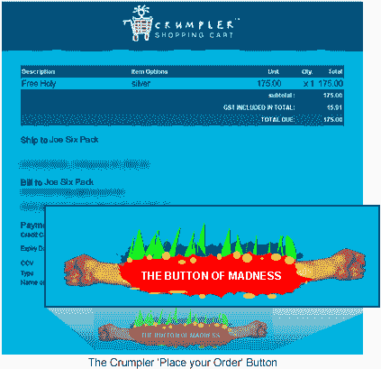

# 购物车和疯狂

> 原文：<https://www.sitepoint.com/shopping-carts-and-madness/>

今天早上，我偶然发现了芭芭拉·恰帕罗写的一篇非常有用的文章，这篇文章讲述了购物车设计的十大错误。

这篇文章是三年多前发表的，但我认为它仍然很有价值。

我建议阅读整篇文章，但套用她的话，10 个最大的错误是:

*   称购物车为任何东西，而不是购物车。
*   要求用户点击“购买”按钮将商品添加到购物车。
*   很少或没有给出商品已经被添加到购物车的视觉反馈。
*   迫使用户每次在购物车中放置商品时都要查看购物车。
*   要求用户在向购物车添加商品之前购买其他相关商品。
*   要求用户在向购物车添加商品之前进行注册。
*   要求用户将数量更改为零以从购物车中移除商品。
*   需要书面说明来更新购物车中的商品。
*   要求用户滚动以找到更新购物车按钮。
*   要求用户在知道包括运费和税在内的最终费用之前输入运费、账单和所有个人信息。

任何熟悉史蒂夫·克鲁格作品的人都应该知道其中的一些共同主题。

所以，当不久之后你访问一个网站，它不仅选择忽略一些规则，而且真的伸出舌头，然后面对它们开怀大笑，你不得不窃笑。

Crumpler 是一家小公司，生产时髦但非常耐用的包，他们通过一个非常有趣和独特的网站销售和支持他们的产品。

那么，他们会怎么称呼他们的“购买”按钮呢？

或许可以像亚马逊一样,**下单**？

也许'**像 ThinkGeek 一样提交最终订单**？

**买**’？

我给你疯狂的按钮！

## 分享这篇文章