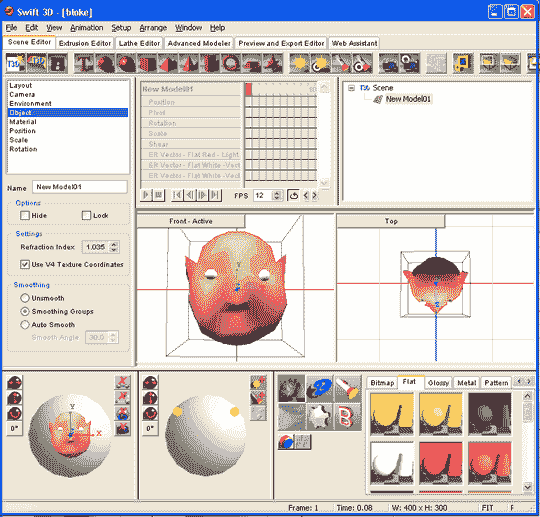
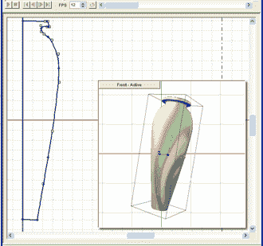
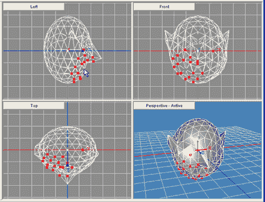
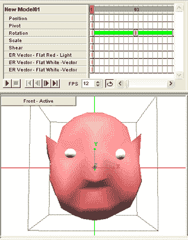

# swift 3D 4.0——网页设计师的真正希望

> 原文：<https://www.sitepoint.com/swift-3d-review/>

**一个鲜为人知的事实是，当[莎翁写下“真正的希望是迅捷的，用燕子的翅膀飞翔”](http://www.bartleby.com/70/3352.html)时，他实际上刚刚花了四个小时玩电动雨的[迅捷 3D 4.0](http://www.erain.com/products/Swift3D/) 。**

当然，当每个人都不停地告诉他，“你知道，伙计…那真的很深刻，”他决定声称他一直都是这个意思。我想我们都曾经这样做过。

然而，要理解威尔是如何受到那样的启发并不十分困难。像我们大多数人一样，在谈到 Flash 时，Will 有时会有点怀疑。他非常清楚，网络的第一个化身主要被认为是书写文字的快速、简单和健壮的载体——在过去的十年里，这意味着超文本标记。鉴于全球有 7 亿至 8 亿用户每天发布、搜索和消费数十亿网页，你当然可以证明“互联文本”的基本设计已经取得了巨大成功。

难怪像 Will 一样，当网站所有者决定将他们简单、标准化、可索引、可搜索的文本信息从超文本文档中取出，并将其隐藏在其他层(如 Flash、Director、Java 等)时，我们许多人都会感到有点困惑。)，通常只是为了实现一些机械的文本过渡，或者一个旋转的徽标。

然而，没有一些帮助，超文本无法处理许多其他类型的非文本数据，最常见的是视频、声音和 3D/VRML。显而易见，尽管阅读你想要订购的最新 Nike 运动鞋很有价值，但没有什么能比得上在你手中旋转这些宝贝，从各个角度欣赏它们，或许放大特定的细节以便近距离观察。

对于那些以前没有接触过 Swift 3D 的人来说，这正是该软件可以帮助您创建的功能。

电子雨的开发者掌握的核心技巧是能够拍摄 3D 场景，并将其转换为平滑、低脂肪、可用于 Flash 的 2D 文件。除此之外，他们还添加了一系列不断增长的建模和动画工具，以及专为直接从 3D Studio 或 Lightwave 导出 Flash 而设计的独立产品。

这是真的 3D 吗？一旦它闪现出来就不会了。Flash 没有内置的 3D 功能，因此与 3D 对象/环境的任何交互都必须被预测并预渲染为 2D 序列。

##### 应用程序

Swift 3D 围绕“场景编辑器”选项卡构建，大部分场景构建、照明和动画都在这里进行。五个附加选项卡提供了对一组建模工具、一个“预览和导出编辑器”和一个 IE 驱动的“Web 助手”的访问，旨在帮助您从应用程序中访问教程、支持服务和 Swift 社区。网络助手是一个不错的想法，尽管就我个人而言，在没有正常的浏览器控件的情况下使用它，我觉得有点奇怪。

***建模工具***

正如您所料，Swift 3D 的建模工具随着每个新版本不断发展，现在已经成为一个非常有用的建模工具箱。车床和挤压工具允许您将二维轮廓提升和旋转成更复杂的三维物体。

虽然在 Swift 3D 中直接绘制简单的 2D 形状非常容易，但您可以在自己喜欢的绘图程序中自由构建更复杂的形状，并将 2D 形状作为 Illustrator 文件(AI)、EPS 甚至 AutoCAD DWG 导入。我可能应该补充的是，将 2D 轮廓输入车床编辑器(如上所示)是一个比它需要的(例如，通过挤压编辑器)更复杂的过程。

除了挤压和车床编辑器，4.0 版现在包含一个“高级建模”。以及各种初级形状(立方体、圆柱体、圆锥体等)。)，高级建模器允许您直接通过单个顶点、单边、面、整个曲面和一个漂亮的“软选择”来变形您的网格，这允许随着您远离选择点而逐渐减少的变形。

建模控件最令人印象深刻的方面可能是它们足够简单，用户可以立即使用它们，同时还可以在需要时通过“属性面板”提供精细的控制。虽然我们收到的包里有一个可爱的小用户指南/手册(这些天似乎很少见)，但我能够通过简单的修补弄清楚大多数操作——这肯定不能对一些建模程序说。

总的来说，所包含的建模工具对于绝大多数的界面设计、标识处理和产品演示来说应该是绰绰有余的。在需要高精度产品模型的项目中(可能是手机、消费电子产品等。)，它们可以在任何 3DS 兼容的 modeler(甚至 Blender 作为免费选项)中构建，并单独导入到“场景编辑器”中。

表面是一个简单的拖放过程。几十个预设表面可在平面颜色，光泽，金属，图案，反射地图，石头，杂项纹理，透明色调和木纹。这些颜色/纹理中的每一种都可以通过调整所需的图案、颜色、光洁度和纹理来单独“调整”。此外，定制的位图可以导入并应用到任何表面。可能性是无限的。

总之，建模工具足够强大，可以处理绝大多数情况，如果需要更强大的功能，还可以使用后备选项。

***动画控件***

虽然 Swift 3D 的动画控件最初可能会让 Flash 用户感到熟悉，但它们在概念上是完全不同的。轻击 Swift 中的“动画”按钮，您可以访问模型位置(在 3D 空间中)、枢轴点、旋转、缩放、剪切和颜色(ER 矢量)的补间控件。

只需将帧标记沿时间轴移动到更远的位置，并更改模型的任何方面，以创建一个新的关键帧，并自动补间插入帧。很容易快速地得到结果，你可以像制作模型一样简单地制作表面和灯光的动画。

Swift 还允许你在“模型级别”制作动画。通过在挤压编辑器和车床编辑器中为您提供时间线，Swift 有效地允许您在多个模型“状态”之间变形。例如，当你的标志反弹时，你可以手动变形它的底部——非常有用的东西。

这还没完。“Bezier Path”动画工具允许您将模型绑定到预定义的 3D 轨道上(与 Flash 的 2D 等效物类似)，而预设的“罐中运动”风格的旋转、跳跃、缩放和滚动允许您将常见运动直接拖放到模型上。

简而言之，该程序提供了强大而灵活的动画控制。

***预览和导出编辑***

据推测，大多数 Swift 3D 用户希望直接从 Swift 或更多情况下通过 Macromedia Flash 创作环境生成用于 Flash 播放器显示的内容。然而，这肯定不是你唯一的选择。

事实上，你甚至不需要关注矢量图形。自从我安装了 Swift 3D 4.0 以来，我已经用它生成了 3 次 JPEGs 字符串，并将其转换成动画 gif(在这方面它做得很好)。

导出工具以两种模式工作:矢量和光栅。每种模式中的可用选项包括:

*   矢量

*   单身白人女性
*   SWFT (Swift 3D Flash 进口商)
*   EPS
*   人工智能
*   挽救（saving 的简写）

*   光栅

*   热重量分析法
*   位图文件的扩展名(Bitmap)
*   PNG
*   使用 jpeg 文件交换格式存储的编码图像文件扩展名
*   标签图像文件格式。
*   SWF(作为位图)

为什么要以光栅形式导出到 Flash？嗯，虽然你的文件大小无疑会受到影响，灯光效果，反射效果和其他渲染技巧肯定会保持光栅图形的微妙性。如果带宽不成问题，像素仍然是一个不错的选择。

预览和导出编辑器易于使用，并提供了灵活的导出工具。

##### 摘要

Swift 3D 4.0 是一款非常实用的应用程序。即使像威尔和我这样的“怀疑托马斯”也经常发现自己渴望地思考它所呈现的可能性。由于其他 3D Web 选项(Java 和 SVG)无法实现流畅的浏览器集成和 Flash 的巨大市场渗透，Swift 似乎在不久的将来覆盖了 3D Web 市场。它为数不多的建模弱点可以被替代的建模应用程序所弥补(如果需要的话), Swift 3D 不到 200 美元，就其提供的功能而言一点也不贵。

对于有些疲惫的网页设计师来说，也许真正的希望是迅速的。

**产品:**雨燕 3D 4.0
**制造:**电雨
**价格:** US$189.00
**更多信息:**[http://www.erain.com/products/Swift3D/](http://www.erain.com/products/Swift3D/)

## 分享这篇文章