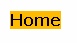
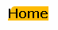
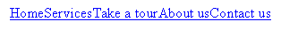
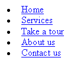

# CSS 和圆角:建立可访问的菜单标签文章

> 原文：<https://www.sitepoint.com/accessible-menu-tabs/>

就功能而言，最好的网站之一是[亚马逊](http://www.amazon.com/)。

不过，就可访问性而言，它并不是很好。

##### 问题是

亚马逊的菜单标签有着漂亮的圆角，看起来不错——但是它们完全无法访问。首先，它们缺少 ALT 标签。此外，W3C 可访问性指南 3.1(优先级 2)明确指出:

当存在合适的标记语言时，使用标记而不是图像来传达信息。

这基本上意味着我们不应该使用图像来显示文本。视力不好的用户无法调整通过图像显示的文本的大小。类似地，[屏幕放大器](http://www.magnifiers.org/links/Download_Software/Screen_Magnifiers/)的用户可能无法阅读嵌入图像的文本，因为它对他们来说可能显得模糊和像素化。

##### 解决方案:CSS 菜单标签

CSS 一如既往地拯救了我们。看看这个通过 HTML 和 CSS 创建的菜单标签——看不到一个``标签！


让[看看它的运行](https://www.sitepoint.com/examples/cssaccessiblenav/css-1.htm)——当你这样做时，调整你的浏览器中的文本大小。请注意，菜单选项卡的大小随着文本的增加而增加:它完全适合。

今天，你将学习如何做到这一点。

***怎么回事***

我们从一个简单的链接开始:

```
<div id="navigation"><a href="#">Home</a></div>
```

我们将为它指定以下 CSS 代码:

```
#navigation a 

{ 

color: #000; 

background: #fb0; 

text-decoration: none 

}

This gives us the following result:



它需要一点工作，对不对？让我们开始吧。

 ***添加左侧菜单标签角*** 

我们需要用相同的颜色为圆角的左手边的小图像。这是我之前做的一个。


让我们把这个图片命名为 left-tab.gif，并使用这个 CSS 规则把它放到链接的背景中:

```

```
#navigation a 

{ 

color: #000; 

background: #fb0 url("left-tab.gif") left top no-repeat; 

text-decoration: none 

}
```

这个新的 CSS 规则说，背景图像应该是 left-menu-tab.gif，图像应该在顶部的左边，并且不应该重复。结果呢？



我们就要到了，但是我们需要稍微移动文本，因为它覆盖了左边的圆角。通过向 CSS 规则添加填充，重新定位文本非常简单:

```
#navigation a 

{ 

color: #000; 

background: #fb0 url("left-tab.gif") left top no-repeat; 

text-decoration: none; 

**padding-left: 10px** 

}
```


***右上角***

我们只能为一个 CSS 规则分配一个背景图像，所以我们需要创建一个新的 CSS 规则，并为其分配右上角的图像。我们将从在 HTML 代码中插入一个`<span>`标签开始:

```
<div id="navigation"><a href="/">**<span>**Home**</span>**</a></div>
```

现在，我们将创建一个新的 CSS 规则，在这个规则中，我们将把如下所示的右菜单标签(另一个我之前做的)分配给`<span>`，我们准备好了！


我们将此图像命名为 right-tab.gif。

```
#navigation a span 

{ 

background: url("right-tab.gif") right top no-repeat; 

}
```

这个 CSS 规则意味着一个`<a>`标签中的每个`<span>`标签都将这个图像作为其背景。最终结果如下所示:


完美…不，等一下！你能发现为什么它不那么完美吗？我们忘记了在 CSS 规则中给标签`<span>`分配一些填充:

```
#navigation a span 

{ 

background: url("right-tab.gif") right top no-repeat; 

**padding-right: 10px** 

}
```

该代码为我们提供了:


现在，这真的是完美的！在这里查看结果，并调整文本大小，看看它看起来怎么样。

***最终 CSS 触动***

让我们使用一些最终的 CSS 规则给这个链接分配一个漂亮的悬停效果。我们还需要几张背景图片:


我们称之为 left-tab-hover.gif。


这个名为 right-tab-hover.gif。

现在，我们只需插入下面的 CSS 规则，就可以开始了！

```
#navigation **a:hover** { 

color: #fff; 

background: #fb0 url(**"left-tab-hover.gif"**) left top no-repeat; 

text-decoration: none; 

padding-left: 10px 

}  

#navigation **a:hover** span 

{ 

background: url(**"right-tab-hover.gif"**) right top no-repeat; 

padding-right: 10px 

}
```

看一下运行中的代码——一定要把鼠标放在上面！

##### 制作标签菜单

现在我们已经完成了所有的艰苦工作，我们可以根据自己的需要制作任意数量的菜单选项卡:


[查看运行中的导航](https://www.sitepoint.com/examples/cssaccessiblenav/css-3.htm) —确保将鼠标悬停在导航项目上！

看起来很棒，不是吗？不过，请注意，以这种方式构建菜单确实会带来一个新的可访问性问题:这种导航对任何禁用 CSS 的人来说都没有意义。没有 CSS，导航看起来像这样:



那是一个相当大的问题。解决办法？让我们把标签列成一个列表！HTML 将如下所示:

```
<**ul id="navigation"**> 

<**li**><a href="/"><span>Home</span></a><**/li**> 

<**li**><a href="/"><span>Services</span></a><**/li**> 

<**li**><a href="/"><span>Take a tour</span></a><**/li**> 

<**li**><a href="/"><span>About us</span></a><**/li**> 

<**li**><a href="/"><span>Contact us</span></a><**/li**> 

<**/ul**>

Now, let's create some CSS rules for our list items, so that all the menu tabs display next to one other on the same line:

```

```
#navigation 

{ 

list-style: none; 

padding: 0; 

margin: 0; 

} 

#navigation li 

{ 

float: left; 

display: block; 

margin: 0; 

padding: 0; 

}
```

为了去掉项目符号，我们使用了 CSS 命令`list-style: none`。为了显示我们的菜单标签，我们使用了`float: left`。

在这一点上，一些更专业的 CSS 编码人员可能会质疑保留`<span>`标签的意义，尤其是那些读过[道格·鲍曼的滑动门文章](http://www.alistapart.com/articles/slidingdoors/)的人。我们留在`<span>`标签中的原因是为了使整个菜单标签可点击。如果我们将其中的一个角指定给`<li>`作为背景图片，那么这个角将不可点击。

##### IE 5.x 问题

不幸的是，这些标签无法在 PC 上的 IE 5.0(以及其他一些浏览器)上工作，因为标签的圆形边缘没有出现。因此，每个菜单选项卡将显示为一个带有尖角的矩形。对此有一个简单的解决方案，那就是将`display: block`插入到`#navigation a`和`#navigation a span` CSS 命令中。

听起来很简单，对吧？可惜不是。通过将这些命令插入 CSS，Mac 上的 IE 5 会将菜单项堆叠在彼此之上。为了让这些在 Mac 上的 IE 5 上正确显示，我们还需要插入`float:left`命令，但是只应用于这个浏览器。但是我们如何将一个 CSS 命令应用于一个浏览器呢？简单——我们使用带注释的反斜杠 hack:

```
#navigation a, #navigation a span 

{ 

display: block; 

**float: left** 

} 

/* Commented backslash hack hides rule from IE5-Mac */ 

#navigation a, #navigation a span 

{ 

**float: none** 

} 

/* End IE5-Mac hack */ 
```

第一个 CSS 命令让菜单标签内容向左浮动，第二个 CSS 命令取消了这一点，Mac 上的 IE 5 除外。当为同一个选择器指定了两个 CSS 命令时，第二个命令总是优先。但是 Mac 上的 IE 5 因为斜线和星号的原因，无法读取第二个命令，所以默认为第一个 CSS 命令。(如果你真的想知道这是如何工作的，为什么会这样，请阅读 Sam Foster 的评论。)

##### 最终代码

最终的 HTML 是:

```
<ul id="navigation"> 

<li><a href="/"><span>Home</span></a></li> 

<li><a href="/"><span>Services</span></a></li> 

<li><a href="/"><span>Take a tour</span></a></li> 

<li><a href="/"><span>About us</span></a></li> 

<li><a href="/"><span>Contact us</span></a></li> 

</ul> 
```

这是完整的 CSS 代码:

```
#navigation a 

{ 

color: #000; 

background: #fb0 url("left-tab.gif") left top no-repeat; 

text-decoration: none; 

padding-left: 10px 

} 

#navigation a span 

{ 

background: url("right-tab.gif") right top no-repeat; 

padding-right: 10px 

} 

#navigation a, #navigation a span 

{ 

display: block; 

float: left 

} 

/* Commented backslash hack hides rule from IE5-Mac */ 

#navigation a, #navigation a span 

{ 

float: none 

} 

/* End IE5-Mac hack */ 

#navigation a:hover 

{ 

color: #fff; 

background: #26a url("left-tab-hover.gif") left top no-repeat; 

text-decoration: none; 

padding-left: 10px 

} 

#navigation a:hover span 

{ 

background: url("right-tab-hover.gif") right top no-repeat; 

padding-right: 10px 

} 

#navigation 

{ 

list-style: none; 

padding: 0; 

margin: 0 

} 

#navigation li 

{ 

float: left; 

display: block; 

margin: 0; 

padding: 0 

}
```

##### 最终产品…有和没有 CSS

让我们再看一遍。首先，CSS 版本的导航:


禁用 CSS 时，它看起来像这样:



现在，那真的是可及的！

##### 限制

正如你可能已经知道的，在老版本的浏览器中对 CSS 的支持是不稳定的。因此，这些标签在 Netscape 4 和 IE 4 中根本无法工作([仍有不到 1%的网络用户使用](http://www.thecounter.com/stats/2004/August/browser.php))。解决这个问题的方法是使用一个外部 CSS 文档，您可以使用 [@import 指令](http://www.yourhtmlsource.com/stylesheets/advancedcss.html#IMPORTINGSTYLE)调用这个文档。这些浏览器将会忽略 CSS 文档。

## 分享这篇文章