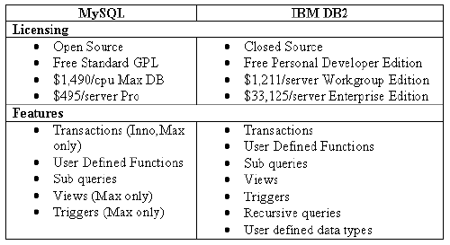
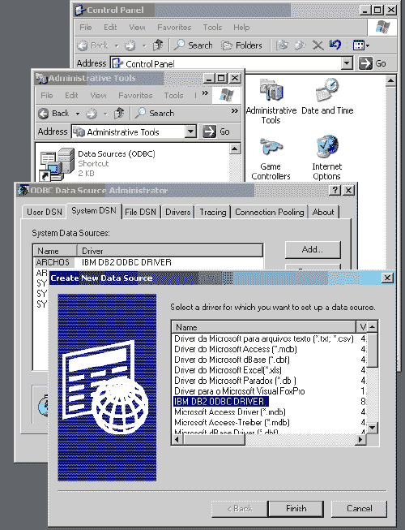

# 用 DB2 进行 PHP 数据库编程

> 原文：<https://www.sitepoint.com/php-database-db2/>

作为一名 PHP 程序员，我很自然地尝试了 MySQL。在基于 PHP-MySQL 的强大组合开发了一系列成功的网站后，我有机会使用 IBM 的 [DB2 UDB](http://www.ibm.com/software/data/db2/udb/) (通用数据库)开发一个数据驱动的网站。

在行业数据库管理领域，有三个主要参与者:IBM DB2、Microsoft SQL Server 和 Oracle。有很多关于使用微软和甲骨文产品的文献，但是很难找到专门针对 PHP 使用 DB2 的信息。我开发本教程是为了帮助 PHP-MySQL 应用程序开发人员扩展他的数据库视野，以包括 IBM 强大的数据库产品。

在我们开始之前，先简单比较一下 MySQL 和 DB2 的许可和特性。



有关 DB2 的更多信息，请参见 IBM 站点的专用小节。

##### 先决条件

要开始使用 DB2，您需要一台安装了以下软件的服务器:

1.  Apache 2.0 (可能适用于旧版本)

3.  [PHP 3.0.6+](http://www.php.net/downloads.php) (用–with-IBM-DB2 开关编译。注意:最新的二进制文件是用 DB2 代码编译的，所以如果您愿意，可以下载一个二进制文件。未经 PHP5 测试)

5.  [DB2 8.1+](http://www-306.ibm.com/software/data/db2/udb/edition-pde.html) (可能适用于旧版本)

如果您在安装这些组件时遇到问题，请参见本文的
[来解决安装](http://www-106.ibm.com/developerworks/db2/library/techarticle/scott/0614_scott.html)的问题。

另外，不要忘记[下载本教程的代码](https://www.sitepoint.com/examples/db2/db2.zip)——当你完成下面的过程时，它会很方便。

##### 设置

好了，一切都安装好了。让我们启动 DB2 控制中心。这个应用程序有点慢，但是请耐心等待。它将允许我们用图形用户界面管理 DB2。


***1。创建 DB***

*   按下左侧面板中每个 ucon 旁边的加号，直到看到数据库列表。
*   您应该会看到`toolsdb`和`sample`(取决于您在安装过程中选择的选项)。
*   右击标签为`Databases`的文件夹，选择`Create > Database using Wizard`。
*   按照这个向导在 DB2 中创建一个数据库。这可能需要几分钟时间，具体时间取决于您的系统。

***2。创建用户***

*   我们将需要一个我们可以用来连接到这个数据库的用户。
*   DB2 使用操作系统身份验证，所以您需要创建一个本地或网络用户，DB2 可以根据这个用户进行身份验证。
*   回到控制中心，单击新数据库旁边的加号。右键单击标记为“数据库用户”的文件夹，然后选择“添加”。
*   在此屏幕顶部的选择框中输入您希望授予访问新数据库权限的用户名。选中所有复选框，授予用户对此数据库的完全权限。



***3。创建 DSN 链接***

为了连接到 DB2，我们需要一个系统 DSN 链接。要在 windows 计算机上创建它，请执行以下操作:

*   转到:`Control Panel Administrative Tools Data Sources (ODBC)`
*   选择`System DSN and select Add`
*   选择`IBM DB2 ODBC DRIVER`
*   现在键入这个 DSN 链接的名称，并选择我们刚刚创建的数据库

##### 设置够了！

嗯，那很有趣。现在，让我们开始构建我们的 PHP 应用程序。我不太喜欢 PHP 处理 ODBC 数据库调用的方式，所以让我们编写一个数据库类，当我们想要连接到 DB2 时就可以使用它。

```
<?php 

class DB2 

{ 

  var $handle; 

  // bool connect(string $dsn, string $user, stirng $pass) 

  function connect($dsn, $user, $pass) 

  { 

    $this->handle = odbc_connect($dsn, $user, $pass); 

    if (!$this->handle) 

      return false; 

    return true; 

  } 

  // resourceid query(string $sql) 

  function query($sql) 

  { 

    $rs = @odbc_exec($this->handle, $sql); 

        if ($rs) 

          { 

return $rs; 

        } 

          else 

        { 

$sErr = "<b>Error:</b> " . $this->getErrorMsgs() . "<br>n"; 

$sErr .= "<b>SQL:</b> " . $sql; 

die($sErr); 

} 

  } 

  // string getErrorMsgs() 

function getErrorMsgs() 

{ 

return odbc_errormsg($this->handle); 

} 

// void disconnect() 

  function disconnect() 

  { 

    if ($this->handle) 

      odbc_close($this->handle); 

  } 

} 

?>
```

稍后我们将扩展这个类来封装更多的数据库功能，但是现在，这应该是我们所需要的。让我们看看如何使用这个类:

```
<?php 

require_once($HTTP_SERVER_VARS['DOCUMENT_ROOT'] . "/path/to/class.php"); 

$db = new DB2(); 

print "connecting to DB2..."; 

if (!$db->connect("testdb", "username", "password")) 

{ 

  print "Error!n"; 

  exit(); 

} 

print "Connected!<br>n"; 

print "Creating Database..."; 

$sql = ""; 

$sql .= "CREATE TABLE testtbl (id INTEGER NOT NULL GENERATED"; 

$sql .= "  ALWAYS AS IDENTITY (START WITH 0, INCREMENT BY 1, NO"; 

$sql .= "  CACHE), name VARCHAR (64) NOT NULL , created DATE  NOT NULL)"; 

$db->query($sql); 

print "Created Table!<br>n"; 

print "Disconnecting..."; 

$db->disconnect(); 

print "Disconnected!<br>n"; 

?>
```

这个简短的应用程序应该连接到数据库并创建一个三列表。请注意，SQL 语法不同于 MySQL 和其他语法。如果您在使用 SQL 语法时遇到问题，请记住，许多操作都可以从控制中心完成(您可以单击“Show SQL”来查看自己执行相同操作的 SQL)。

##### 向类中添加功能

现在，让我们将以下功能添加到我们的 DB 类中:

1.  解析结果集(`fetch`)

3.  结果集中的行数(`numRows`)

5.  交易(`transIsOpen`、`transStart`、`transCommit`、`transRollback`)

7.  上次插入 ID ( `lastInsertID`)

在 DB 类中，添加以下代码行:

```
// Member variables used to cache array template to reduce odbc calls  

var $lastrs;  

var $aTemplate;  

  // Generate a template for the column names (cached to reduce odbc calls)  

// void genTemplate(resourceid $rs)  

function genTemplate($rs)  

{  

  $numCols = odbc_num_fields($rs);  

  $this->aTemplate = array();  

  for($i = 0; $i < $numCols; $i++)  

    $this->aTemplate[$i] = strtolower(odbc_field_name($rs, $i));  

}  

  // Creates an associative array for the next row in the result set provided  

  // If a column name is provided, return the value for that column name only.  

  // Note: must use lower case column names!  

// array fetch(resourceid $rs[, string $colname])  

function fetch($rs)  

{  

  if ($rs != $this->lastrs)  

  $this->genTemplate($rs);  

  // Copy the Values into an array  

  $aTmp = array();  

  odbc_fetch_into($rs, $aTmp);  

  $numCols = sizeof($this->aTemplate);  

  // Copy the array into the associative array and return that array  

  $aRV = array();  

  for($i = 0; $i < $numCols; $i++)  

  {  

    $aRV[$this->aTemplate[$i]] = $aTmp[$i];  

    $aRV[$i] = $aTmp[$i];  

  }  

  if (func_num_args() > 1)  

    return $aRV[func_get_arg(1)];  

  return $aRV;  

}
```

当我们执行 SQL 查询时，该查询的结果以结果集的形式提供给我们。fetch 函数将为我们提供一个表示给定结果集中当前行的数组，或者，如果提供了列名，则提供当前行中的单个值。

需要注意的是，当调用 fetch 时，光标会自动前进到下一行。因此，如果您希望从给定的行中获得多个值，可以将整行提取到一个数组中，并使用列名作为索引来获取值。用不同的列名多次调用 fetch 函数将从不同的行中检索每一列的值。

像 PHP 中的任何关联数组一样，也可以使用数字索引而不是行名来获取值。

`// get the number of rows in the current result set  
// int numRows(resourceid $rs)  
function numRows($rs)  
{  
 return odbc_num_rows($rs);  
}`

上面的函数只是返回给定结果集中的行数。

`// is there a transaction open  
// bool transIsOpen()  
function transIsOpen()  
{  
 return !odbc_autocommit($this->handle);  
}  

 // start an SQL transaction  
// void transStart()  
function transStart()  
{  
 odbc_autocommit($this->handle, false);  
}  

 // commit the current SQL transaction  
// void transCommit();  
function transCommit()  
{  
 odbc_commit($this->handle);  
 odbc_autocommit($this->handle, true);  
}  

 // rollback the current SQL transaction  
// void transRollback()  
function transRollback()  
{  
 odbc_rollback($this->handle);  
 odbc_autocommit($this->handle, true);  
}`

现在我们来了解 DB2 的一些伟大特性，包括事务。事务是作为一个原子单位分组的 SQL 命令的集合。给定的事务要么完全执行，要么根本不执行。这在数据完整性至关重要的情况下非常有用。

当我们不使用事务时(即没有事务打开时)，查询会自动提交给数据库。这允许我们对数据库进行查询，而不必开始和结束事务。

事务很重要的另一种情况是，我们希望找到插入到特定表中的最后一个 ID。以下函数将返回最后一个 id:

`// get the last inserted ID into the specified table  
// int lastInsertID(string $tblName)  
function lastInsertID($tblName)  
{  
 if ($this->transIsOpen())  
 {  
   $sql = "SELECT SYSIBM.IDENTITY_VAL_LOCAL() AS id FROM " . $tblName;  
   $rs = $this->query($sql);  
   return $this->fetch($rs, "id");  
 }  
 return -1;  
}`

该功能类似于`mysql_insert_id()`功能。确定最后插入的`ID`对于生成的列来说是必不可少的，但是这并没有很好地记录下来(我实际上与 IBM 有一些通信来弄清楚这一点),所以——尽情享受吧！它现在展现了它所有的美丽。

##### 转义单引号

尽管在 C、PHP 和 Java 等编程语言中，用反斜杠()转义引号是很常见的，但是 DB2 不允许在字符串中使用反斜杠(与 MySQL 不同)。您可以在一行中使用两个引号来转义单引号，如下所示:

`INSERT INTO testtbl (name, created)  
   VALUES ('Mark''s favorite popsicle flavour', '2004-01-01')`

这将插入一个名字，马克最喜欢的冰棒口味。

还需要注意的是，DB2 不允许像 MySQL 那样用双引号括住字符串。必须在查询中使用单引号将字符串括起来。

##### 表格修改

尽管 SQL99 标准允许这样做，但是 DB2 不允许以某些方式修改表:

1.  **更改列**-DB2 不允许在创建列后更改列的数据类型、默认值或任何其他属性。

3.  **删除列**-一旦创建了表，就不能从表中删除列。

您仍然可以创建、删除和修改列的索引，以及添加新列。您始终可以通过 DELETE、UPDATE 和 INSERT 语句删除、修改和创建行。如果需要在一个表上完成上述操作之一，最好的方法是重命名旧表，并创建一个新表。

您可以使用 INSERT 语句将数据从一个表复制到另一个表。假设您想将名为`oldTbl`的表中的数据复制到`newTbl`中。您可以通过以下方式实现这一点:

```
INSERT INTO newTbl (col1, col2, col3)  

SELECT (col1, col2, col3) FROM oldTbl
```

这将把内容从`oldTbl`复制到`newTbl`。

##### 声明

我很惊讶除了 MySQL 之外没有数据库支持 LIMIT 子句。它不是 SQL99 标准的一部分，但是它太方便了。LIMIT 子句提供的一些功能可以在 MS SQL 中使用 TOP 子句复制，DB2 也有一个类似的子句(尽管它相当冗长)。不幸的是，与 TOP 子句一样，DB2 的 LIMIT 尝试只能用于 SELECT 语句。这里有一个例子:

`SELECT * FROM testtbl WHERE id > 10 FETCH ONLY FIRST 4 ROWS`

我不太清楚为什么这个条款这么长。将来它可能会有更多的功能，但现在它更有趣，更有用。

##### 结论

我希望您喜欢第一次接触 DB2。尽管 IBM 的标准查询语言(SQL)以其规模和晦涩的商业广告而闻名，但它是一种优秀的数据库产品，您可以在 PHP 应用程序中利用它！

DB2 SQL 方言在许多方面与 MySQL 有所不同，但是最初的挫折应该会在速度和性能方面得到回报(以及学习另一个行业标准应用程序的快乐)！要了解更多信息，请查阅官方的 [DB2 文档](https://aurora.vcu.edu/db2help/db2s0/frame3.htm)。

## 分享这篇文章