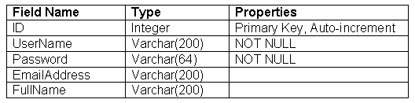

# ASP.NET 的单一登录 Web 服务

> 原文：<https://www.sitepoint.com/single-sign-web-service-asp-net/>

今天的大多数网站都要求用户进行注册，以允许网站所有者与这些访问者保持联系或提供服务。像这样建立一个用户群需要耐心和奉献。然而，提供一项新服务或一个新网站，通常情况下，你需要再次从零开始建立你的用户群。

本文概述了创建可移植成员工具的策略。我们将看到 Web 服务和服务器控件如何让您能够为所有站点和资源生成单一登录。

##### 挑战

网站单点登录的概念已经存在多年了。最值得注意的是，微软以。NET Passport 和 Liberty Alliance 项目(由 Visa 和 GM 等大公司支持)在拯救用户和开发者免受网站会员问题困扰方面取得了一定的成功。

然而，像 Passport 这样的系统的许可费让许多网络开发者望而却步。例如，Passport 每年的费用为 10，000 美元，每个 URL 的合规费用为 1，500 美元。

虽然本文中概述的工具不会为您提供使用 Passport 的所有优势(最值得注意的是，Passport 的 2 亿用户群或其安全性)，但我们将讨论的解决方案确实提供了一种在多个站点或资源上组织您的用户群的简单方法。

##### 体系结构

工具的设计需要使我们能够创建独立的应用程序——甚至是非独立的。NET 应用程序——并且仍然访问和验证我们的用户群。

***网络服务***

登录系统的核心是一个 Web 服务。Web 服务允许您提取和分发应用程序的特定功能，以便它可以被其他应用程序重用，即使它们不是用. NET 编写的。这为我们的登录系统提供了完美的平台，使我们能够灵活地将我们的一些站点制作成非。网络应用；比如 PHP，ASP，或者 JSP。我们甚至可以编写桌面应用程序来包含我们的登录功能。

***数据库设计***

一个数据库将包含我们所有用户的信息，并由 Web 服务查询以验证、定位和返回用户到我们的应用程序。因为只有 Web 服务会直接与数据库通信，所以我们的应用程序不需要知道如何访问数据库，也不需要处理 SQL 语句。

***成员对象***

Web 服务将使用我们定义的成员对象来代表我们站点的用户。该对象将使我们能够访问当前登录用户的详细信息。

***用户控件***

在生成 Web 服务之后，我们可以构建一些 ASP.NET 用户控件，这些控件封装了用户注册和身份验证的常见功能。用户控件将与 Web 服务通信，为我们提供简单的属性和事件来控制我们站点的成员资格。

##### 设计登录 Web 服务

Web 服务需要封装注册和验证用户所需的所有功能；因此，需要以下方法:

`bool createUser(Member m)
     Member authenticateUser(string userName, string password)`

当然，这并不是所有可能的功能。例如，我们可以用一些方法来控制用户的修改、密码的丢失或从系统中删除用户。然而，本文将集中讨论创建和认证。

这两种方法都引用一个对象，即成员。这个类将代表一个用户；它包含了我们所知道的与我们打交道的用户的所有信息。该类将具有以下属性:

`string userName;
     string hashedPassword;
     string emailAddress;
     string fullName;`

这是这个类的 C#源代码。这里没有什么特别的，只是四个属性的代码:

`namespace Sitepoint.SingleLogIn
{

 public class Member
 {
   private string _UserName;
   private string _Password;
   private string _FullName;
   private string _EmailAddress;

   public string UserName
   {
      get
      {
        return _UserName;
      }
      set
      {
        _UserName = value;
      }
   }

   public string Password
   {
     get
     {
       return _Password;
     }
     set
     {
       _Password = value;
     }    
   }

   public string EmailAddress
   {
     get
     {
       return _EmailAddress;
     }
     set
     {
       _EmailAddress = value;
     }    
   }

   public string FullName
   {
     get
     {
       return _FullName;
     }
     set
     {
       _FullName = value;
     }
   }  
 }
}`

为了在我们的系统上创建一个用户，我们首先创建一个成员类的实例，并用用户的个人信息填充它。然后，我们将它传递给 Web 服务上的 createUser 方法。如果添加成功，则返回 true 如果发现信息有问题，则返回 false(例如，如果用户名已经存在)。

为了对用户进行身份验证，我们将该用户的用户名和密码传递给 Web 服务，如果这些细节通过了身份验证，则返回一个代表该用户的成员对象。

数据库表将用于存储我们的用户详细信息。该表的字段将对应于用户信息:



因此，我们将用于创建该表的 SQL 如下:

`CREATE TABLE User
{
     ID int IDENTITY (1,1) NOT NULL,
     UserName varchar(200) NOT NULL,
     Password varchar(64) NOT NULL,
     EmailAddress varchar(200),
     FullName varchar(200)
}`

随着数据库的创建，以及我们的`Member`类的编码，我们现在可以在 Web 服务中充实方法来包含我们的功能。

`createUser`方法将首先检查包含在传递的`Member`对象中的用户名是否已经注册过(在私有方法`userExists`中实现)。如果有，该方法将返回 false。但是，如果一切正常，可以将用户添加到数据库中(通过私有方法`addUser`)。

为了安全起见，所有密码都存储为原始密码的散列。正如我们将在服务器控件中看到的，此功能是封装的。然而，如果我们不使用控件—假设我们创建了一个非。NET 或桌面应用程序-我们需要记住，纯文本密码不能通过网络连接传递。

`[WebMethod]  
 public bool createUser(Member m)  
 {  
   //check that the username doesn't already exist  
   if (!userExists(m.UserName))  
   {  
     return false;  
   }  

   //add the user  
   if (!addUser(m))  
   {  
     return false;  
   }  

   return true;  

 }  

 private bool userExists(string UserName)  
 {  
   conn.Open();  
   SqlCommand comm = new SqlCommand("select id from User where username = @username",conn);  
   SqlParameter p = new SqlParameter("@username",UserName);  
   comm.Parameters.Add(p);  
   SqlDataReader r = comm.ExecuteReader();  
   bool result = r.HasRows;  
   conn.Close();  
   return result;  
 }  

 private bool addUser(Member m)  
 {  
   conn.Open();  
   SqlCommand comm = new SqlCommand("insert into User(UserName, Password, FullName, EmailAddress) values (@username, @password, @fullname, @emailaddress)",conn);  
   SqlParameter pUserName = new SqlParameter("@username",m.UserName);  
   SqlParameter pPassword = new SqlParameter("@password",m.Password);  
   SqlParameter pFullName = new SqlParameter("@fullname",m.FullName);  
   SqlParameter pEmailAddress = new SqlParameter("@emailaddress",m.EmailAddress);  

   comm.Parameters.Add(pUserName);  
   comm.Parameters.Add(pPassword);  
   comm.Parameters.Add(pFullName);  
   comm.Parameters.Add(pEmailAddress);  

   int result = comm.ExecuteNonQuery();  

   //we should have 1 result returned. else, it failed  
   return (result ==1);  

 }`

方法是我们服务的核心。通过传递用户的用户名和散列密码(例如，取自 Web 表单)，返回一个代表用户的`Member`对象。该方法查询数据库，查看是否存在包含用户名和密码的行。如果找到一行，则用户通过身份验证，并从该行创建对象。否则，我们会得到不正确的凭证，并返回一个空值。

`[WebMethod]  
 public Member AuthenticateUser(string UserName, string Password)  
 {  
   //check that the username doesn't already exist  
   return authenticateUser(UserName, Password);      
 }  

 private Member authenticateUser(string UserName, string Password)  
 {  
   conn.Open();  
   SqlCommand comm = new SqlCommand("select fullname, emailaddress from User where username = @username AND password = @password",conn);  
   SqlParameter pUserName = new SqlParameter("@username",UserName);  
   SqlParameter pPassword = new SqlParameter("@password",Password);  

   comm.Parameters.Add(pUserName);  
   comm.Parameters.Add(pPassword);  

   SqlDataReader r = comm.ExecuteReader();  
   bool result = r.HasRows;  
   conn.Close();  

   if (result)  
   {  
     //build a new member object  
     Member m = new Member();  
     m.UserName = UserName;  
     m.Password = Password;  
     m.FullName = r.GetString(0);  
     m.EmailAddress = r.GetString(1);  
     return m;  
   }  

   return null;  

 }`

[点击此处下载 Web 服务文件](https://www.sitepoint.com/examples/singlesignin/singlesignin.zip)。要部署该服务，请将其复制到您的 Web 应用程序中(通过 FTP，或者在 Visual Studio.NET 中将它添加到您的项目中)

##### 设计用户控件

我们可以构建用户控件来封装系统中用户的创建和验证。本质上，用户控件是页面的封装区域，您可以将其放入 Web 窗体中，以便快速重用您的代码。例如，在这里，我们将创建`Login`和`Register User`表单，这两个表单都将放在一个用户控制文件中。要使用登录或注册表单，我们只需将控件拖放(或者，如果我们没有使用 Visual Studio，则引用)到页面上。阅读用户控制的 [MSDN 条目](http://msdn.microsoft.com/library/default.asp?url=/library/en-us/vbcon/html/vbconintroductiontowebusercontrols.asp)了解更多信息。

用户控件可以放在 Web 表单中，提供用户的自动注册。该控件包括允许用户输入用户名、密码、电子邮件地址和全名的文本框。

在 register 按钮的 click 事件中，我们调用上面创建的 Web 服务`LogIn`来创建用户，并检查该过程是否成功。如果创建成功，我们重定向到一个新页面，告诉用户下一步做什么。否则，先前隐藏的包含错误信息的 Label 控件将变得可见，用户将再次尝试。

您可以在代码归档中找到完整的 createUser.ascx 文件。然而，值得注意的是控件上按钮的 click 事件(当用户单击 Register 时运行的代码)。

这里，代码获取用户输入的信息，并用详细信息填充前面创建的成员对象:

`Sitepoint.SingleLogIn.Member m = new Member();  
 m.UserName = txtUserName.Text;  
 m.Password = System.Web.Security.FormsAuthentication.  
HashPasswordForStoringInConfigFile(txtPassword.Text, "sha1");  
 m.FullName = txtFullName.Text;  
 m.EmailAddress = txtEmailAddress.Text;`

然后，我们创建一个登录服务的实例，并将我们的新成员对象传递给它以注册用户。如果成功，我们可以将用户重定向到一个页面，通知他们注册已经成功。否则，我们可以显示之前隐藏的错误标签，要求用户尝试不同的用户名。

`Sitepoint.SingleLogIn.login login = new  Sitepoint.SingleLogIn.login();  

 if (login.createUser(m))  
 {  
   //success. user created.  
   //in this example, we redirect to the success page  
   Response.Redirect("success.aspx",true);  
 }  
 else  
 {  
   //try again.  
   lblError.Visible = true;  
 }`

`authenticateUser`用户控件与`createUser`控件非常相似；然而，当认证成功时，我们设置一个会话 cookie 来存储我们从`authentication`方法中检索到的`Member`对象。将来，我们可以检查这个对象是否存在于我们的缓存中，从而确定当前用户是否登录。

同样，您可以在代码归档中找到完整的 authenicateUser.ascx 文件。

这一次，我们希望验证一个用户，所以我们获取用户输入的用户名和密码，并使用它们从我们的 Web 服务中检索适当的`member`对象:

`Sitepoint.SingleLogIn.login l = new Sitepoint.SingleLogIn.login();  
 Sitepoint.SingleLogIn.Member m = l.AuthenticateUser(txtUserName.Text, System.Web.Security.FormsAuthentication.HashPasswordForStoringInConfigFile(txtPassword.Text, "sha1"));`

如果没有返回`member`对象(即`m is null`，则没有找到具有该用户名和密码组合的用户。如果是这种情况，我们显示错误标签，并要求用户再试一次。

`if (m == null)  
 {  
   //not authenticated  
   lblError.Visible = true;  
   return;  
 }`

否则，我们现在就有了一个经过身份验证的用户。将`member`对象添加到会话状态中(我们可以稍后通过我们的应用程序检索它)，并将一个已验证的变量设置为`true`。这提供了一种确定用户是否通过身份验证的快速方法(比较布尔值比比较对象和 null 更快更有效):

`// authenticated  
 Session["user"] = m;  
 Session["authenticated"] = true;  
 Response.Redirect("homepage.aspx");`

##### 使用登录系统

是时候使用我们的代码了！

***使用视觉 Studio.NET***

1.  在您希望使用登录系统的 Web 应用程序中，添加对登录 Web 服务的 Web 引用，并将用户控件添加到项目中。

3.  将用户控件拖放到您希望用来登录或创建用户的表单上。

***无。*网**

1.  将 login.asmx 和 2 个用户控制文件上传到 Web 应用程序目录。

3.  为 login.asmx 服务创建一个 [Web 服务代理](http://msdn.microsoft.com/library/default.asp?url=/library/en-us/cpguide/html/cpconCreatingWebServiceProxy.asp)类。编译应用程序时，确保将这个代理类添加到命令行中。

5.  在您希望使用`UserControls`的 Web 表单中，在表单代码的顶部添加一个指令。

对于注册(`createUser`)控制，添加:

```
<%@ Register TagPrefix="uc1" TagName="createUser" Src="createUser.ascx" %>
```

对于登录(`authenticateUser`)控件，添加:

```
<%@ Register TagPrefix="uc1" TagName="authenticateUser" Src="authenticateUser.ascx" %>
```

*   若要使用页面中的控件，请为注册控件添加以下标记:

```
<uc1:createUser id="CreateUser1" runat="server"></uc1:createUser>
```

为登录(`authenticateUser`)控件添加以下标签:

```
<uc1:authenticateUser id="AuthenticateUser1" runat="server"></uc1:authenticateUser>
```

现在，如果您需要确定当前会话是否已登录，您可以检查`Session`对象以查看`user`对象是否存在，如下所示:

```
if (Session["user"] != null)   

{  

  //logged in     

}  

else  

{       

  //no user  

}
```

并且，要注销用户，从`Session`对象中删除`user`对象，如下所示:

```
Session.Remove("user");

摘要

通过将代码封装在 Web 服务和用户控件中，您可以轻松地使重复性任务(如用户管理)更容易管理。此外，通过跨站点共享登录系统，您不仅可以共享您的会员资格，还可以共享系统背后的代码，使任何更新在您的网络中无缝显示。

```

## 分享这篇文章