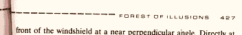
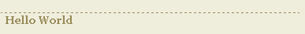
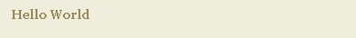
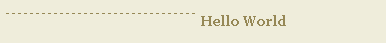
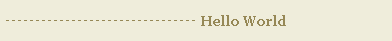

# 不守规矩的统治者

> 原文：<https://www.sitepoint.com/unruly-ruler/>

你知道你在一些书的索引或页面标题中发现的那些小分隔符吗？那些看起来像有人搞砸了标题对齐，然后通过添加分段线来修复它的半生不熟的尝试？我喜欢这些东西，所以我开始制作自己的。

这是我们的目标，直接取自大卫·谢夫的[“游戏结束——按下开始键继续”](http://www.amazon.com/exec/obidos/tg/detail/-/0966961706/qid=1075784488/ref=sr_8_xs_ap_i15_xgl14/002-7081133-1406466?v=glance&s=books&n=507846)



那时，我刚刚进入基于 CSS 的设计的奇妙世界，我想为我自己的网站建立这样的东西应该是轻而易举的。

我错了。

##### 选项 1:**`<hr>`**标签

显而易见，语义上正确的创建这些元素的方法是使用一个`<hr>`(水平标尺)标签，将其向左对齐，并在其右侧放置一些文本。在一个完美的世界里，我们甚至可以用这种方法逃脱。但是，唉，这是不可能的。

`<hr>`跨浏览器风格支持充其量也是脆弱的，正如本讨论中举例说明的那样。水平标尺元素不仅不能支持一致的边界/背景属性，而且还会到处浮动，这是对逻辑的嘲弄。我很快放弃了这种方法。

##### 选项 2:部分可见的块元素

在考虑了这些选项之后，我选择了一个 block 元素(只有顶部的边框是可见的)，浮动在标题旁边。让我们看看它是怎么做的。

我们希望解决方案在语义上尽可能正确，所以我们将把整个事情放在一个`<h3>`标题中(我最初使用`<h3>`是因为`<h1>`是我页面顶部的图像标题，`<h2>`表示我的博客进入日期等)。).

我们还希望能够为包含的标题和标题指定不同的边距属性，因此将标题放在它自己的 *blockable* 元素中是个好主意。因此，我们得到以下标记:

```
<h3 id="test"> 

  <span class="ruler"></span> 

  <span>Hello World</span> 

</h3>
```

我们将使用`<span>`元素作为我们的块(我们也可以使用 div，但是这样不太优雅)。注意，第一个属于`ruler`类。远离一些微妙的政治评论，这样做是为了让我们可以设置块的样式，并将其与包含标题的块区分开来。包含了`id`,这样我们可以用锚来使用这个标题。我们将从以下内容开始设计:

```
h3 span.ruler { 

  display: block; 

  height: 1px; 

  border-top: 1px #968856 dashed; 

  border-right: 0; 

  border-bottom: 0; 

  border-left: 0; 

  } `h3 span { 

  margin-left: 6px; 

  color: #968856; 

  font: bold .7em georgia, serif; 

  }`
这会产生以下结果:

还没到那一步。block 元素规范在每个块的末尾添加了一个换行符，当块被创建时，它们采用了最大的可用宽度，所以我们需要浮动标尺。我们加上`float: left`后；我们看到:

可怕！统治者跨度，作为一个向左浮动的空元素，已经被遗忘。请注意，它仍然存在，但没有任何明显的宽度可言。所以我们加上`width:50%`；把它从下面拉出来。

现在我们正在谈话！为了更接近地复制页面听觉图像，我们将进一步向下移动标尺。我们可以使用像素测量来实现这一点，但这太简单了，不是吗？像素虽然是精确的，但在 IE 中不能用文本大小增加工具调整大小，当这种情况发生时，我们的标尺将达不到垂直中心，所以我们将使用 ems，它在 IE 中是可调整大小的。
ems 方法提出了另一个问题:由于盒子模型实现的差异，IE 对 *n* ems 的再现有几个像素的误差。为了弥补这一点，我们将利用 IE 的缺点。我们将指定两次边距:一次是为符合标准的浏览器，另一次是为不同风格的 IE 浏览器:
`margin-top: .4em !important; 

  margin-top: .45em;`
`!important`告诉兼容的浏览器，对于同一属性，该规则应优先于其他规则，无论位置如何。IE 不理解这一点，因此最终采用了更低一级的规则(显然，在使用 CSS 时，顺序是极其重要的)。在这种情况下，差异是最小的(. 05 em)，但是当我将这种方法应用到我的站点上的另一个页面时，实际差异是. 2 em(这是相当大的)。这是一个有趣的黑客，所以我会把它留在这里。它产生:

现在，那不是很痛苦，是吗？以下是完整的代码:

```
h3 { 

  margin: 20px 0 0 0; 

  } 

H3 span . ruler {
margin-top:. 6em！重要；
margin-top:. 45em；
宽度:50%；
显示:屏蔽；
身高:1px
文本对齐:左对齐；
 border-top: 1px #968856 虚线；
右边界:0；
边框-底部:0；
左边界:0；
背景色:# eae8d0
浮动:左；
 } `h3 span { 

  margin-left: 6px; 

  color: #968856; 

  font: bold .7em georgia, courier, serif; 

  }`
若要更改标尺的宽度，请调整 ruler 类中的宽度值。两个`<span>`的属性不会混淆，因为第一个使用了更具体的选择器(注意上面的`span.ruler`)。
这种技术适用于 IE 5.0、5.5、6、基于 Gecko 的浏览器(Moz/Firebird)、Safari、Opera，对于 Lynx 和基于文本的浏览器，这种技术可以适当地降级(毕竟，文本包含在一个空 span 旁边的标题中，所以没有太多干扰)。希望你觉得这个解决方案很方便。

```

```

## 分享这篇文章