# 简化 Flash 界面设计

> 原文：<https://www.sitepoint.com/flash-interface-design/>

许多人试图在 Flash 中创建界面，但却被整个过程淹没，再也没有回来过。那真是太遗憾了。本文概述了使用图形应用程序、良好的规划和简单的逻辑创建 Flash 界面的技巧和方法。

Flash 绘图工具从软件的最早版本就出现了，并且在过去的几年里没有太大的进步。对于新手和经验丰富的专业人士来说，仅使用 Flash 中的工具创建有效的界面可能是艰苦、困难和彻底的挫折。这就是为什么大多数人倾向于在外部图形包中开发图形，然后将其导入 Flash 进行微调。

任何终端媒体的界面设计都是一件棘手的事情；在可用性、功能性和美观性之间找到一个有效的平衡是设计师的圣杯。有几个不同的平台，你可以创建一个设计，但没有一个像 Flash 播放器一样棘手。

我不知道有多少次我看到一个好的概念因为糟糕的执行和随意的界面规划而失败，但如果你遵循一些简单的经验法则，这两个问题都可以很容易地得到解决。这些规则不是一成不变的，但它们将帮助你在 Flash 中设计有效的界面。

我已经打包了我们将在教程中使用的文件— [在这里下载工作文件](https://www.sitepoint.com/examples/flashinterfacedesign/flashinterfacedesignsource.zip)。

##### 规划界面

我父亲曾经告诉过我一句古老的格言:“事先计划可以防止糟糕的表现”。太真实了！如果你的界面设计计划不周(或者很大程度上是没有计划的)，那么创建它将花费更长的时间，并且你无疑会引入需要额外工作来修复的缺陷。如果你花时间去计划界面——它的外观和功能——你已经成功地完成了一个有效的设计。

规划设计最简单的方法是什么？嗯，对我来说，要么是老式的纸和笔，要么，如果我在电脑前，我的平板电脑和笔。我通常从勾画出界面、组件、菜单系统和内容区域开始。然后我为每个部分创建额外的草图，如下图所示。

在我对计划满意之前，这个过程可能需要反复几次，但是，作为一个有点囤积癖的人，我从不扔掉任何东西。通过这种方式，我可以随时参考我几年前做的界面创意和草图(尽管在我的设计阶段，我的办公室确实变得有点像纸的漩涡)。

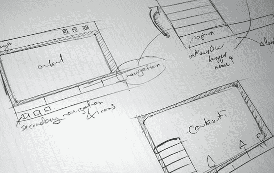

一旦我对最初的布局感到满意，我就会进入数字格式——通常是 Fireworks 或 Illustrator——来创建一个组合界面。

##### 设计线框

你们很多人可能已经熟悉了线框的概念。你可能已经下意识地把你的设计画成线框了，而没有意识到这一点。

简而言之，线框包括创建有形的骨架结构，作为内容的占位符。例如，如果您的设计将容纳大量文本，您可能需要考虑滚动设计，而不是分页设计(内容保存在不同的页面上)。

在为您的设计创建布局的过程中，有许多要点需要考虑。这些问题超出了本文的范围，但是一旦你开始以这种方式来布局你的设计，你很快就会发现什么可行，什么不可行。

您可以使用现有的各种工具来创建您的接口；我通常选择烟花 MX 2004。这个程序可以很容易地创建界面原型，然后使用 Flash 的矢量工具快速调整元素的大小和用途。每个人都有自己喜欢的应用程序，但 Fireworks MX 2004 确实使创建复杂的矢量图形变得轻而易举。

考虑下面的接口。虽然看起来很简单，但它是由一系列使用联合工具(“修改”>“合并路径”>“联合”)对齐和连接的圆角矩形创建的。然后使用标准的矢量和文本工具来创建一个可用的界面。

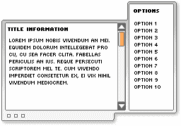

乍一看，它并不复杂，然而使用 Flash 的标准工具创建这种类型的界面将是一项艰巨的任务。只要看看这张设计特写中出现的曲线和控制点的数量就知道了。

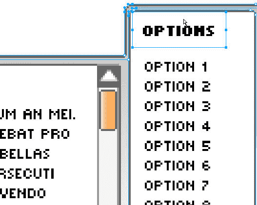

在下面的设计中(源 PNG 文件可以在代码档案中找到)，我创建了一系列简单的圆形和非圆形的矩形框。标识、额外图标和主要内容区域所在的内容区域都有清晰的标注，主菜单和子菜单选项也是如此。

从开始到结束，使用一系列实心填充和简单笔画创建此设计大约需要 15 分钟，因为 Fireworks MX 2004 可以轻松地对界面组件(如每个主菜单)进行分组，所以我可以微调属性和位置，直到对最终设计满意为止。

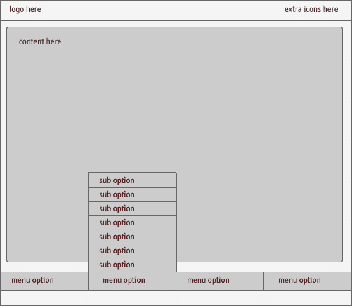

Macromedia 产品系列的优点之一是它们的紧密集成，Flash 和 Fireworks 之间的集成也不例外。

从最初的概念(并使用 Flash 中的相关层结构)，我可以在应用程序之间快速复制和粘贴。因为该设计是以矢量格式创建的(并且没有对项目应用实时效果，如投影或发光)，所以在应用程序之间保持了完整性，并且矢量格式的图像被成功导入到 Flash 中。

##### 了解层排序

要将我们在外部应用程序中创建的界面元素引入 Flash，我们需要了解各个界面元素是如何组合在一起的。

在下图中，您可以看到接口成分是如何层层叠加来创建接口的。从标题栏向前，项目堆叠在彼此之上，以产生最终效果。

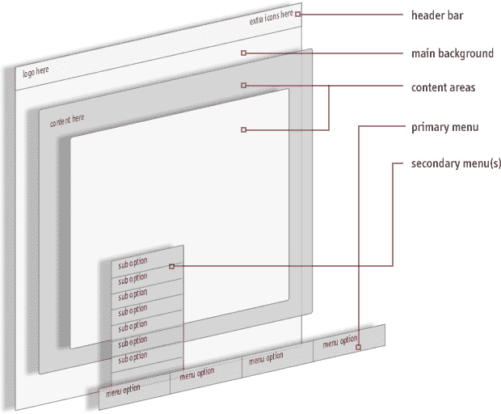

根据您在 Flash 中的工作方式，快速创建界面的最简单方法是将设计的组成部分作为单个组件导入，在舞台中将项目排列在单独的层中。这不仅使你的设计更具可伸缩性，更易于管理，而且让你更好地控制界面各个部分相对于其他部分的位置。

请注意上图中界面的各个部分是如何相互重叠的；这称为层的堆叠顺序。如果一个较大的对象被放置在较高的层中，那些出现在堆叠顺序中较低位置的对象将基本上被隐藏起来。这可能是一个有用的概念-您可以使用图层来遮罩其他图层，而无需更改图层类型或使用复杂的遮罩技术。这种能力可以让你快速创建一个界面。

##### 命名和排列层

因为 Fireworks 和 Flash 支持层，所以我们可以轻松地将内容从 Fireworks 迁移到 Flash。通过在 Flash 中重新创建图层并将内容放入每个后续图层中，我们可以毫不费力地模仿我们在 Fireworks 中创建的设计。

看看我们上面看到的界面的分解图。

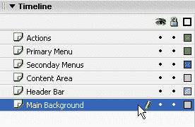

我们可以在 Flash 中从上到下创建这些层。然后，我们可以开始导入每个元素并相对于其他元素进行布局。

下图概述了简单的流程。一旦我们在 Fireworks 中创建了界面，我们就可以创建层来保存 Flash 中的结构。从这一点来说，从 Fireworks 复制内容并粘贴到 Flash 中是很简单的。

一旦内容在 Flash 中，我们可以微调导入图形的属性和位置。一旦我们对我们的工作感到满意，我们就可以回到 Fireworks，重复这个过程，直到所有不可或缺的元素都出现在 Flash 中。

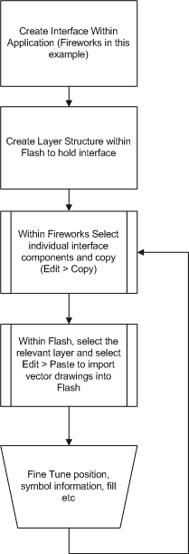

请注意，当您直接从 Fireworks 导入到 Flash 时，对象将作为电影剪辑或位图导入，并放置在名为“Fireworks 对象”的文件夹中。导入对象的命名还有一点需要改进的地方(“符号 1”、“符号 2”等)。)，因此，在导入每个元素后，为了可伸缩性，最好给项目起一个更具描述性的名称。

此过程还可以使文件在以后返回项目时更加有用。

我们可以命名添加到舞台的任何剪辑的实例，以便通过 ActionScript 进行操作。在下面的例子中，在我们命名了主菜单和次菜单层中的电影剪辑后，我们只需将 ActionScript 添加到 Actions 层，然后就可以开始了！

注意，在包含的例子中(包含在文章代码档案中)，子菜单项没有控制代码；它仅作为示例提供。

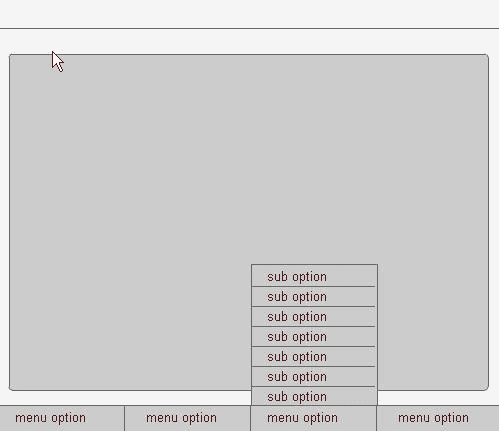

##### 梯度的有效使用

使用 Flash 为您的界面创建渐变可能是一个令人厌倦且冗长的过程，尽管 Illustrator 在某些方面很擅长，但没有什么比 Fireworks MX 2004 更适合创建复杂且易于控制的渐变。

使用 Fireworks MX 2004，您可以快速创建引人注目的界面元素。该程序提供了一系列简单的渐变，具有不同的颜色和不透明度，可以叠加以创建微妙的效果。

这些作品可以通过简单的复制和粘贴导入到 Flash 中，也可以导出为 Illustrator 格式的文件，然后导入到 Flash 中。

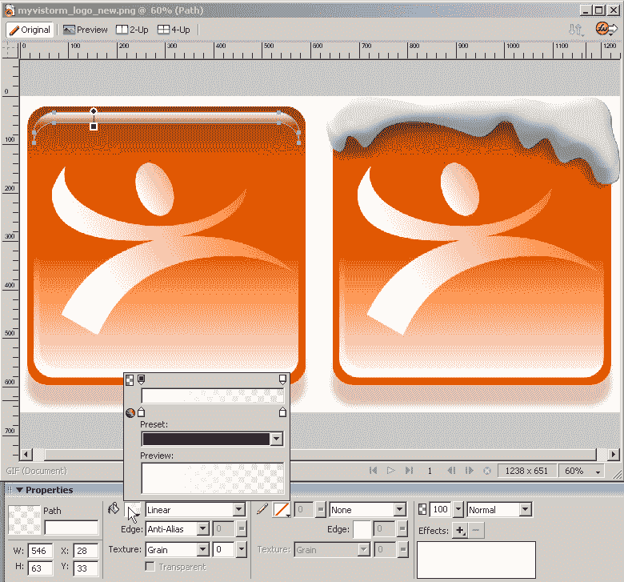

一个可行的设计和一个不可行的设计之间的区别通常在于它的微妙之处。使用细微渐变作为从 100%不透明度渐变到 0%不透明度的矢量路径的填充类型，并改变渐变的拖动手柄以产生非常有趣和细微的效果。

尝试渐变填充类型的不透明度标记，以及颜色和混合模式，可以帮助您实现逼真的效果，无论设计如何。

##### 创建投影

如果你将基于位图的投影导入 Flash，它们看起来最多是粒状的——最糟糕的是可怕的！虽然创建一个基于矢量的替代方案可能需要几分钟时间，但其好处远远超过额外的时间投入。

在 Flash 中创建矢量投影的最快方法是对要添加阴影的形状进行纯色填充(例如黑色)复制，然后将其放在原始对象下面的图层上

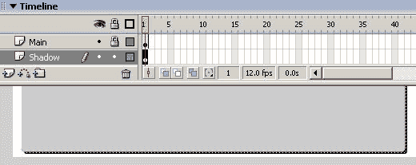

然后，选择形状，选择“修改”>“形状”>“柔化填充边缘”，并选择以下设置:

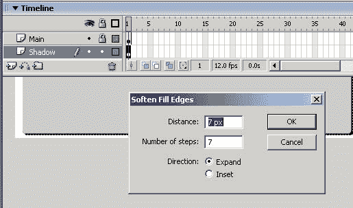

这将产生一个清晰的渐变阴影，而不是一个硬的实心矢量线，但是可以通过设置来创建一个适合你的项目的外观。

一旦你对效果满意，选择所有你刚刚用“柔化填充边缘”命令创建的对象。将它们组合在一起，并将结果组转换为影片剪辑，将剪辑的不透明度更改为 40%左右，以获得柔和效果。

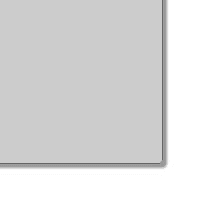

就是这样！虽然我们在这篇文章中仅仅触及了界面设计的表面，但是希望它已经给了你一个初步的体验——以及一些创建界面和将对象放入 Flash 的快捷方式。更多快捷方式和技巧，敬请关注下一期！

## 分享这篇文章