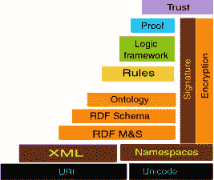
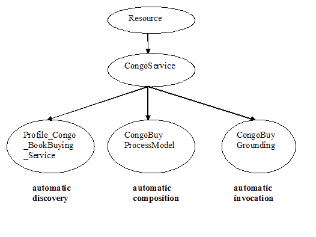

# 为语义 Web 服务做准备

> 原文：<https://www.sitepoint.com/semantic-web-services/>

万维网的发明者蒂姆·伯纳斯·李也是下一代网络架构语义网的创始人。目前，他的万维网联盟(W3C)团队致力于开发、扩展和标准化 Web 的标记语言和工具。

语义网架构的目标是提供链接数据的知识表示，以便允许在全球范围内进行机器处理。W3C 已经开发了新一代的开放标准标记语言，这些语言正准备释放下一代 Web 的能力、灵活性以及最重要的逻辑，并为下一代 Web 服务打开大门。

目前，使用。NET 和 J2EE 框架正在努力克服现有 Web 架构的局限性和相互冲突的专有标准。随着软件供应商争夺任何优势，语义 Web 服务提供了一个巨大的飞跃；第一次开发的人可以成功地开发其潜在的潜力，提供诸如语义搜索、集体电子邮件和协作网络文字处理等应用程序。

为什么我们需要这样一个系统？今天，超文本标记语言(HTML)中可用的数据难以大规模操作。想想飞机时刻表、棒球统计数据和产品购买信息。虽然目前在许多站点上可用，但是以 HTML 形式使用这些数据是有问题的，即使采用了可扩展标记语言(XML)。语义网提供了一种更简单的方式来发布数据，这些数据可以根据需要被访问和重新利用。

##### 语义 Web 服务

为了让语义 Web 服务成为现实，标记语言必须具有足够的描述性，以便计算机能够自动判断其含义。以下是这种语言需要执行的任务列表:

*   **发现:**一个程序必须首先能够自动找到或发现一个合适的 Web 服务。Web 服务描述语言(WSDL)和通用发现和描述语言(UDDI)都不允许软件决定 Web 服务向客户端提供什么。语义 Web 服务描述了它的属性和功能，因此软件可以自动确定它的用途。
*   **调用:**软件必须能够自动决定如何调用或执行服务。例如，如果执行服务是一个多步骤的过程，软件需要知道如何与服务交互来完成必要的序列。语义 Web 服务提供了一个描述性的列表，列出了代理需要做什么才能执行和完成服务。这包括定义服务的输入和输出。
*   **组成:**软件必须能够选择和组合多个 Web 服务来完成某个目标。这些服务必须彼此无缝地互操作，这样组合的结果才是有效的解决方案。
*   **监控:**代理软件需要能够在运行时验证和监控服务属性。

当 Web 标记语言发展到可以执行上述任务时，语义 Web 服务就可以开始繁荣了。您可能会惊讶地发现 W3C 距离满足这些条件有多近。

##### 高级标记语言

Web 服务和语义 Web 这两个领域可以通过多种方式进行交互，从而导致语义 Web 服务的进一步发展。Berners-Lee 认为，这两种技术都将受益于将语义网的有意义内容与 Web 服务的业务逻辑相结合的集成。

像 UDDI 和 WSDL 这样的地区非常适合使用语义网技术来实现。此外，SOAP 可以使用资源描述框架(RDF)有效负载、远程 RDF 查询和更新，并与语义 Web 业务规则引擎交互，从而为语义 Web 服务奠定基础。

W3C 致力于构建 Web 标记语言的金字塔，从 HTML 和 XML 开始，继续向上包括 RDF 和最新的 Web 本体语言(OWL)。OWL 的子代是 OWL for Services (OWL-S)。

然而，下一代 Web 的技术问题产生了许多棘手的问题，在语义 Web 服务的全部能力可用之前，必须解决这些问题。


**图 1-标记语言金字塔**

对逻辑循环、语法错误和值得信任的公开信息的担忧仍然是令人生畏的问题。尽管如此，语义 Web 服务的几个可信的例子正在进行中。下一节给出了一个由 DAML 组织开发的例子。

##### 猫头鹰的例子:Congo.com

当前基于 XML 的 Web 服务技术在机械化服务识别、服务配置和组合、服务比较和自动协商方面提供了有限的支持。在业务环境中，灵活和自治的 Web 服务的愿景转化为企业服务之间的自动合作。任何需要与另一个企业进行业务交互的企业都需要自动发现和选择最佳的 Web 服务。任何必要的中介都将在数据和流程的基础上使用语义互操作的自动翻译来应用。

为了设计一个基于 OWL-S 的自动自调节 Web 服务本体，有必要了解自动服务将如何在复杂的动态环境中运行，以及它将如何响应各种各样的外部刺激。与传统的计算机项目不同，设计一个基于 OWL-S 的 Web 服务需要详细的分析，揭示并消除语义逻辑冲突和不确定性。因为基于 OWL-S 的 Web 服务试图将人类从交互中移除，并将自动化流程留在原处，所以逻辑冲突将导致不可接受的事务失败率。

在这一节中，我们将研究设计和实现基于 OWL-S 的 Web 服务所必需的阶段和步骤。我们将通过一个在线图书服务的例子来说明设计过程，该服务为用户提供选择图书、收集买家信息、收取付款和交付图书的能力。我们浏览了一个 OWL-S 在线购书的例子，名为 Congo.com，由[www.daml.org](http://www.daml.org)提供，可以在[http://daml.semanticweb.org/services/owl-s/1.0/](http://daml.semanticweb.org/services/owl-s/1.0/)下载。这个例子提供了服务性能的交易、过程和流程的细节。

##### 网上书店的设计

为了设计一个在线图书服务，我们需要以下交易:选择图书的能力，收集买方的信息，收取他的付款和交付图书。这些交易描述如下:

1.  图书搜索功能，以找到所需的书籍

3.  将图书放入个人购物车

5.  个人登录，以及

7.  负载曲线，或

9.  创建新帐户，以及

11.  创建新配置文件

13.  指定交货详细信息

15.  最终确定购买

17.  图书发行

19.  图书递送

##### 刚果公司网上书店

Congo.com 的例子是一个虚构的图书购买服务，由虚构的 Web 服务提供商 Congo，Inc .提供。这个图书购买服务使用我们刚刚描述的设计，并生成一套 Web 程序，称为 LocateBook、PutInCart、SignIn、CreateAcct、CreateProfile、LoadProfile、SpecifyDeliveryDetails 和 FinalizeBuy。复合服务 CongoBuy 由用户买书所需的一套较小的程序组成。

用于概要本体、过程本体和基础本体编码的 OWL-S 规范可以在[http://daml.semanticweb.org/services/owl-s/1.0/](http://daml.semanticweb.org/services/owl-s/1.0/)找到，Congo.com 示例源代码可以在[http://daml . semantic web . org/services/OWL-S/1.0/examples . html](http://daml.semanticweb.org/services/owl-s/1.0/examples.html)找到

##### 任务驱动的 Web 服务标记

在 Congo 的例子中，Web 服务提供商 Congo Inc .正在考虑使用三个支持 OWL-S 标记的自动化任务:

*   自动 Web 服务发现
*   自动 Web 服务调用
*   自动 Web 服务组合和互操作

在下面的部分中，我们首先通过过程模型和基础描述来提供 Web 可访问程序的描述，以便提供自动调用和组合。然后，我们提供了一种方法，通过一个自动发现的概要文件描述来通告属性和功能。



##### 描述 Congo.com 交易程序

Congo.com Web 服务的本体开发包括以下四个步骤:

1.  **描述单个程序:**描述构成服务的单个程序。过程模型提供了程序属性的声明性描述。

3.  **描述每个原子过程的基础:**例如，将 LocateBook 与其基础相关联，LocateBookGrounding。

5.  **描述原子流程的组合:**例如描述复合流程 CongoBuyBook，它是 LocateBook、PutInCart 等的组合。

7.  **概要描述:**为服务提供声明性广告。它部分由流程模型填充。

Congo.com Web 服务从描述使用该服务的程序开始。OWL-S 根据过程模型提供了程序的声明性描述。这为自动化 Web 服务调用、Web 服务组合和互操作提供了描述符。

要实现自动化的 Web 服务调用，Web 服务必须能够告诉外部代理如何与 Web 服务交互，例如，如何自动构造 HTTP 调用来执行或调用 Web 服务，以及从服务返回什么输出。要组合服务，流程模型必须描述其执行的先决条件及其效果。OWL-S 提供了流程本体来完成这一任务。然后，标记使 Web 服务提供者能够包含足够的信息，用于自动化 Web 服务调用以及自动化 Web 服务组合。刚果服务本体如上面的图 2 所示。

***第一步:描述单个程序***

开发 Congo.com 的第一步是描述构成服务的各个程序。过程模型提供了程序属性的声明性描述。

Congo Inc .为其客户提供基于 OWL-S 的网络购书服务，名为 CongoBuy。这个服务实际上是一个更小的 Congo 程序的集合。我们必须首先描述每个程序，然后描述每个程序的组成，这就成为 ExpandedCongoBuy 交互服务。

在整个例子中，我们将提到概要文件本体和过程本体。这些本体定义了形成服务描述的类和属性。对于特定的服务，我们通过创建子类和子属性来专门化类和属性。

Congo.com 购书服务使用一套八个可通过网络访问的交易程序，称为 LocateBook、PutInCart、SignIn、CreateAcct、CreateProfile、LoadProfile、SpecifyDeliveryDetails 和 FinalizeBuy。通过 Congo.com 例子的信息流如图 3 所示。程序的名字反映了它们的功能，从用户选择一本书的 LocateBook 开始，一直到用户完成购买的 FinalizeBuy。正是过程模型提供了 Web 可访问程序的属性的声明性描述。


流程模型(如下面的清单 1 所示)将每个程序视为原子流程或复合流程。此外，它允许简单流程的概念，这将提供复合 CongoBuy 程序的简化视图。一个简单的流程被用来描述一个原子或组合服务的视图。

***清单 1-流程模型***

```
<owl:Class rdf:ID="Process"> 

  <rdfs:comment> The most general class of processes </rdfs:comment> 

  <owl:unionOf rdf:parseType=" owl:collection"> 

    <owl:Class rdf:about="#AtomicProcess"/> 

    <owl:Class rdf:about="#SimpleProcess"/> 

    <owl:Class rdf:about="#CompositeProcess"/> 

  </owl:unionOf> 

</owl:Class>
```

不可分解的 Web 可访问程序被描述为原子进程。原子流程的特征在于它能够被返回响应的单个 HTTP 调用执行。

```
<owl:Class rdf:ID="AtomicProcess"> 

  <owl:subClassOf rdf:resource="#Process"/> 

</owl:Class>
```

LocateBook 程序是一个原子过程，它将图书的名称作为输入，并返回图书的描述及其价格(参见图 4)。为简便起见，我们将输入、输出、前提条件和效果称为“iope”

```
<owl:Class rdf:ID="LocateBook"> 

  <rdfs:subClassOf rdf:resource="&process;#AtomicProcess"/> 

</owl:Class>
```

如果我们想要对 iope 进行限制(比如基数限制)，我们需要如清单 2 所示定义 LocateBook，在类定义中列出它的部分或全部 iope。


***清单 2-locate book 输入***

```
< owl:Class rdf:ID="LocateBook"> 

  <rdfs:subClassOf rdf:resource="&process;#AtomicProcess"/> 

  <rdfs:subClassOf> 

    < owl:Restriction owl:cardinality="1"> 

      <owl:onProperty rdf:resource="#bookName"/> 

    </owl:Restriction> 

  </rdfs:subClassOf> 

</owl:Class>
```

两种类型的参数是 OWL-S 属性输入(见清单 3)和输出(见清单 4)。

***清单 3-属性一般输入***

```
<rdf:Property rdf:ID="parameter"> 

  <rdfs:domain rdf:resource="#Process"/> 

  <rdfs:range  rdf:resource="http://www.daml.org/2001/03/owl#Thing"/> 

</rdf:Property> 

<rdf:Property rdf:ID="input">  

 <rdfs:subPropertyOf rdf:resource="#parameter"/>  

</rdf:Property>
```

与每个进程相关联的是一组属性，这些属性又具有相关联的参数。两种类型的参数是 OWL-S 属性输入和(条件)输出。LocateBook 的输入示例可能是图书的名称。我们使用构造的子属性来声明这一点。

LocateBook 的输入示例是图书的名称“bookName”，如下所示:

```
<rdf:Property rdf:ID="bookName"> 

  <rdfs:subPropertyOf rdf:resource="&process;#input"/> 

  <rdfs:domain rdf:resource="#LocateBook"/> 

  <rdfs:range rdf:resource="&xsd;#string"/> 

</rdf:Property>
```

输入可以是强制性的，也可以是可选的。相反，输出通常是有条件的。比如在刚果目录中搜索一本书，输出可能是该书的详细描述，如果刚果有；否则，它可能是一个“对不起，不可用”的消息。条件输出类是 conditional output，它描述了一个条件和基于该条件的输出。

***清单 4-通用条件输出类***

```
<rdf:Property rdf:ID="output"> 

  <rdfs:domain rdf:resource="#parameter"/> 

  <rdfs:range rdf:resource="#ConditionalOutput"/> 

</rdf:Property> 

<owl:Class rdf:ID="ConditionalOutput"> 

  <owl:subClassOf rdf:resource="http://www.daml.org/2001/03/owl#Thing"/> 

</owl:Class> 

<rdf:Property rdf:ID="coCondition"> 

   <rdfs:domain rdf:resource="#ConditionalOutput"/> 

  <rdfs:range rdf:resource="#Condition"/> 

</rdf:Property> 

<rdf:Property rdf:ID="coOutput"> 

  <rdfs:domain rdf:resource="#ConditionalOutput"/> 

  <rdfs:range rdf:resource="http://www.daml.org/2001/03/owl#Thing"/> 

</rdf:Property>
```

process bookDescription 是以输出为条件的，并且依赖于刚果目录中的图书(参见清单 5)。

***清单 5-locate books 输出图书描述***

```
<rdf:Property rdf:ID="bookDescription"> 

  <rdfs:subPropertyOf rdf:resource="&process;#conditionalOutput"/> 

  <rdfs:domain rdf:resource="#LocateBook"/> 

  <rdfs:range rdf:resource="InCatalogueBookDescription"/> 

</rdf:Property> 

<owl:Class rdf:ID="InCatalogueBookDescription"> 

  <rdfs:subClassOf rdf:resource="&process;#ConditionalOutput"/> 

  </owl:Class> 

<rdf:Property rdf:ID="condInCatalogueBookDescription"> 

  <rdfs:subPropertyOf rdf:resource="&process;#coCondition"/> 

  <rdfs:domain rdf:resource="#InCatalogueBookDescription"/> 

  <rdfs:range rdf:resource="#InCatalogueBook"/> 

</rdf:Property> 

<rdf:Property rdf:ID="outInCatalogueBookDescription"> 

  <rdfs:subPropertyOf rdf:resource="&process;#coOutput"/> 

  <rdfs:domain rdf:resource="#InCatalogueBookDescription"/> 

  <rdfs:range rdf:resource="#TextBookDescription"/> 

</rdf:Property> 

<owl:Class rdf:ID="TextBookDescription"> 

  <rdfs:subClassOf rdf:resource="&owl;#Thing"/> 

  </owl:Class>
```

输入和输出的指定实现了 Web 服务调用的自动化。对于自动组合和互操作，必须描述程序的副作用。动作隐喻用于设想具有前提条件(描述为属性)和(条件)效果的服务，类似于输入和条件输出。

前提条件指定代理执行服务时必须满足的条件。许多 Web 服务没有前提条件，除非输入参数是已知的。然而，可上网设备可能有许多物理前提条件，包括带宽资源或电池电量。先决条件在流程本体中被描述为属性，与输入的方式相同。

```
<rdf:Property rdf:ID="precondition">   

<rdfs:domain rdf:resource="#Process"/> 

<rdfs:range  rdf:resource="http://www.daml.org/2001/03/owl#Thing"/> 

</rdf:Property>
```

***第二步:描述每个原子过程的接地***

LocateBook 的基础是 LocateBookGrounding。对于类 LocateBook，该类的每个实例都有一个 hasGrounding 属性的实例，其值为 LocateBookGrounding。

hasGrounding 属性在 Process.owl 中定义。

```
<owl:Class rdf:about="LocateBook"> 

<owl:sameClassAs> 

<owl:Restriction owl:cardinality="1"> 

<owl:onProperty rdf:resource="#hasGrounding"/> 

<owl:hasValue rdf:resource="#LocateBookGrounding"/> 

</owl:Restriction> 

</owl:sameClassAs> 

</owl:Class>
```

清单 6 是 OWL-S 基础实例的一个例子。

***清单 6-LocateBookGrounding***

```
<grounding:WsdlGrounding rdf:ID="LocateBookGrounding">  

<grounding:wsdlReference rdf:resource="https://www.w3.org/TR/2001/NOTE-wsdl-20010315">  

<grounding:otherReferences rdf:parseType="owl:collection">  

"https://www.w3.org/TR/2001/NOTE-wsdl-20010315"  

"http://schemas.xmlsoap.org/wsdl/soap/"  

"http://schemas.xmlsoap.org/soap/http/"  

</grounding:otherReferences>  

<grounding:wsdlDocuments rdf:parseType="owl:collection">  

"http://example.com/congo/congobuy.wsdl"  

</grounding:wsdlDocuments>  

<grounding:wsdlOperation  

rdf:resource="http://example.com//locatebook.wsdl#FindBook"/>  

<grounding:wsdlInputMessage  

rdf:resource="http://example.com/locatebook.wsdl#LocateBookInput"/>  

<grounding:wsdlInputMessageParts rdf:parseType="owl:collection">  

<grounding:wsdlMessageMap>  

<grounding:damlsParameter rdf:resource=#bookName>  

<grounding:wsdlMessagePart  

rdf:resource="http://example.com//locatebook.wsdl#BookName">  

</grounding:wsdlMessageMap>  

... other message map elements ...  

</grounding:wsdlInputMessageParts>  

<grounding:wsdlOutputMessage  

rdf:resource="http://example.com/locatebook.wsdl#LocateBookOutput"/>  

<grounding:wsdlOutputMessageParts rdf:parseType="owl:collection">  

... similar to wsdlInputMessageParts ...  

</grounding:wsdlOutputMessageParts>  

<grounding:WsdlGrounding>
```

***第三步:描述原子过程的组成***

到目前为止，我们已经描述了每个原子进程及其 iope。现在，我们描述那些提供特定服务的程序的组成。CongoBuy 复合服务使用户能够购买一本书。

在清单 7 中，我们在流程模型中提供了复合流程的定义。注意，复合流程是由其他流程组成的。

在 Congo.com 的例子中，CongoBuy 是按照两个主要步骤来描述的:找到书，然后购买书。


ExpandedCongoBuy 是原子进程 LocateBook 序列的组合名称，后跟 CongoBuyBook。

虽然查找图书是一个原子过程，但购买图书涉及一系列子过程，对应于支付方法、交付细节和最终购买过程。图 6 显示了刚果服务模型。


***清单 7-复合过程***

`<owl:Class rdf:ID="CompositeProcess">  
<owl:intersectionOf rdf:parseType="owl:collection">  
     <owl:Class rdf:about="#Process"/>  
     <owl:Restriction daml:minCardinality="1">  
        <owl:onProperty rdf:resource="#composedOf"/>  
     </owl:Restriction>  
 </owl:intersectionOf>  
</owl:Class>  

<rdf:Property rdf:ID="composedOf">  
<rdfs:domain rdf:resource="#CompositeProcess"/>  
<rdfs:range rdf:resource="#ControlConstruct"/>  
</rdf:Property>`

OWL-S 复合流程是以自顶向下的方式递归构建的。每个 CompositeProcess 由一个 ControlConstruct 组成，它可以是一个 Sequence、Alternative、If-then-else 等等。每个 ControlConstruct 都有一个指定其子组件的类的属性。这些类也可能是流程或控制结构。最后，当复合流程的组件是原子流程时，就结束了。

ExpandedCongoBuy 是原子流程 LocateBook 序列的名称，后跟复合流程 CongoBuyBook。与原子流程一样，复合流程也有输入、输出、前提条件和效果以及限制。上面的图 5 表示 CongoBuy，对应于清单 8。

***清单 8–ExpandedCongoBuy***

```
<owl:Class rdf:ID="ExpandedCongoBuy">     

  <rdfs:subClassOf rdf:resource="&process;#CompositeProcess"/>  

  <rdfs:subClassOf>  

    <owl:Restriction>   

      <owl:onProperty rdf:resource="&process;#composedOf"/>  

      <owl:toClass>  

       <owl:Class>  

        <owl:intersectionOf rdf:parseType="owl:collection">  

          <owl:Class rdf:about="process:Sequence"/>  

          <owl:Restriction>   

            <owl:onProperty rdf:resource="process:components"/>  

            <owl:toClass>  

             <owl:Class>  

              <owl:listOfInstancesOf rdf:parseType="owl:collection">  

                <owl:Class rdf:about="#LocateBook"/>  

                <owl:Class rdf:about="#CongoBuyBook"/>  

              </owl:listOfInstancesOf>  

             </owl:Class>  

            </owl:toClass>  

          </owl:Restriction>  

        </owl:intersectionOf>  

       </owl:Class>  

      </owl:toClass>  

    </owl:Restriction>  

  </rdfs:subClassOf>  

  <rdfs:subClassOf>  

    <owl:Restriction owl:cardinality="1">  

      <owl:onProperty rdf:resource="#expCongoBuyBookName"/>  

    </owl:Restriction>  

  </rdfs:subClassOf>  

  <rdfs:subClassOf>  

    <owl:Restriction owl:cardinality="1">  

      <owl:onProperty rdf:resource="#expCongoBuyCreditCardNumber"/>  

    </owl:Restriction>  

  </rdfs:subClassOf>  

  <rdfs:subClassOf>  

    <owl:Restriction owl:cardinality="1">  

      <owl:onProperty rdf:resource="#expCongoBuyCreditCardType"/>  

    </owl:Restriction>  

  </rdfs:subClassOf>  

  <rdfs:subClassOf>  

    <owl:Restriction owl:cardinality="1">  

      <owl:onProperty       rdf:resource="#expCongoBuyCreditCardExpirationDate"/>  

    </owl:Restriction>  

  </rdfs:subClassOf>  

  <rdfs:subClassOf>  

    <owl:Restriction owl:cardinality="1">  

      <owl:onProperty rdf:resource="#expCongoBuyDeliveryAddress"/>  

    </owl:Restriction>  

  </rdfs:subClassOf>  

  <rdfs:subClassOf>  

    <owl:Restriction owl:cardinality="1">  

      <owl:onProperty rdf:resource="#expCongoBuyPackagingSelection"/>  

    </owl:Restriction>  

  </rdfs:subClassOf>  

  <rdfs:subClassOf>  

    <owl:Restriction owl:cardinality="1">  

      <owl:onProperty rdf:resource="#expCongoBuyDeliveryTypeSelection"/>  

    </owl:Restriction>  

  </rdfs:subClassOf>  

</owl:Class>
```

##### 创建服务

尽管 CongoBuy 服务是由几个 Congo 的事务程序组成的，但将其视为扩展复合流程的黑盒流程还是很有用的。黑盒流程能够隐藏复合流程的操作细节。在刚果的例子中，一个叫做 CongoBuy 的简单过程是(见清单 9):

```
<owl:Class rdf:ID="CongoBuy">  

  <rdfs:subClassOf rdf:resource="&process;#SimpleProcess"/>  

</owl:Class>
```

简单流程通过 expand 属性与复合 ExpandedCongoBuy 流程相关联。CongoBuy 扩展到 ExpandedCongoBuy。

***清单 9–刚果布伊***

```
<owl:Class rdf:about="#CongoBuy">  

  <rdfs:subClassOf>  

    <owl:Restriction>   

      <owl:onProperty rdf:resource="&process;#expand"/>  

      <owl:toClass rdf:resource="#ExpandedCongoBuy"/>  

    </owl:Restriction>   

  </rdfs:subClassOf>  

</owl:Class>
```

与黑盒流程 ExpandedCongoBuy 的情况一样，CongoBuy 有各种属性来表征其黑盒视图。黑盒流程的 iope 是为相关复合流程的计算 iope 而设计的。目前，OWL-S 将这个决定留给 Web 服务提供商。

***第四步:简介描述——广告服务***

OWL-S 被设计成通过提供属性和功能的描述来实现自动化的 Web 服务发现。这些描述符存在于服务注册表中，以提供搜索引擎更好的索引和检索。用于 Web 服务发现的标记需要构建一个流程模型，并且它的概要文件是可用的。

关于服务及其提供者的描述信息如下:

```
<profile:profile rdf:ID="Profile_Congo_BookBuying_Service">
```

该术语通过将概要文件与其描述的服务相关联来表示，在本例中为 Congo_BookBuying_Service。

`<service:isPresentedBy>  
     <service:Service df:resource = "&congo;#Congo_BookBuying_Service"/>  
   </service:isPresentedBy>`

术语 serviceName 是服务的一个标识符，可以用来引用这个概要文件。

`<profile:serviceName>Congo_BookBuying_Agent</profile:serviceName>`

术语 textDescription 是对服务的可读描述。

```
<profile:textDescription>  

  This service provides a  

  book selling site   

</profile:textDescription>
```

术语“提供者”描述服务的提供者。

***清单 10–简介由*提供 **

```
<profile:providedBy>  

<profile:ServiceProvider rdf:ID="CongoBuy">  

  <profile:name>CongoBuy</profile:name>  

    <profile:phone>455 484 1256 </profile:phone>  

    <profile:fax>455 484 1234 </profile:fax>  

    <profile:email>congo@congo.com</profile:email>  

    <profile:physicalAddress>  

         location, USA  

    </profile:physicalAddress>  

  <profile:webURL>  

              http://www.daml.org/services/daml-s/0.9/CongoBuy.html  

      </profile:webURL>  

</profile:ServiceProvider>  

</profile:providedBy>
```

该配置文件指定了服务的附加属性。

属性 profile:input 用于描述相应进程的每个键输入，使用类 profile:ParameterDescription 的描述作为值。ParameterDescriptions 指定流程的相应参数属性及其值限制。

由于 OWL 语言的限制，在概要文件中的参数描述和实际的输入、输出等之间没有逻辑关系。相应流程模型的参数。每个输入都需要一个名称和对所请求信息的限制，以及对所用流程模型输入的引用。

输入参数由名称、对其值的限制以及对它所代表的概要文件中的输入参数的引用来描述。在匹配过程中使用值限制来检查请求者愿意提供的输入是否与提供者要求的匹配。请求者使用输入来识别它需要的附加信息，以便提供给服务。

```
<input>   

<profile:ParameterDescription>   

    <profile:parameterName rdf:resource="bookTitle"/>  

  <profile:restrictedTo rdf:resource="&xsd;#string"/>  

  <profile:refersTo rdf:resource="&congo;#congoBuyBookName"/>  

</profile:ParameterDescription>  

</input>
```

输出的表示类似于输入。Web register 使用该限制来指定服务是否提供请求者所期望的输出。请求者使用输出来了解它将从服务中获得哪些额外的知识。

```
<output>   

<profile:ParameterDescription>   

    <profile:parameterName rdf:resource="EReceipt"/>  

    <profile:restrictedTo rdf:resource="&congoProcess;#EReceipt"/>  

    <profile:refersTo rdf:resource="&congo;#congoBuyReceipt"/>  

  </profile:ParameterDescription>  

</output>
```

先决条件和影响的结构与输入和输出的结构相似。主要的区别在于，它们有一个被定义为 owl:Thing 的语句，而不是对某个类的限制。注册中心以类似于输入和输出的方式使用前提条件和效果。

```
<precondition>   

  <profile:ConditionDescription>   

    <profile:ConditionName rdf:resource="AcctExists"/>  

    <profile:statement rdf:resource="&congoProcess;#AcctExists"/>  

    <profile:refersTo  

      rdf:resource="&congo;#congoBuyAcctExistsPrecondition"/>  

  </profile:ParameterDescription>  

</precondition>
```

最后，关闭服务的描述。

```
</profile:OfferedService>
```

清单 11 给出了完整的 Congo.com 服务。

***清单 11–Congo service . owl***

`<?xml version="1.0" encoding="ISO-8859-1" ?>  
 <!DOCTYPE uridef (View Source for full doctype...)>  

<rdf:RDF xmlns:rdf="https://www.w3.org/1999/02/22-rdf-syntax-ns#" xmlns:rdfs="https://www.w3.org/2000/01/rdf-schema#" xmlns:owl="https://www.w3.org/2002/07/owl#" xmlns:service="http://www.daml.org/services/owl-s/0.9/Service.owl#" >  

<owl:Ontology rdf:about="">  
 <owl:versionInfo>$Id: CongoService.owl,v 1.12 2003/09/19 05:06:47 martin Exp $</owl:versionInfo>  

 <rdfs:comment>This ontology represents the DAML-S service description for the Congo web service example.</rdfs:comment>  

 <owl:imports rdf:resource="https://www.w3.org/2002/07/owl" />  
 <owl:imports rdf:resource="http://www.daml.org/services/owl-s/0.9/Service.owl" />  
 <owl:imports rdf:resource="http://www.daml.org/services/owl-s/0.9/CongoProfile.owl" />  
 <owl:imports rdf:resource="http://www.daml.org/services/owl-s/0.9/CongoProcess.owl" />  
 <owl:imports rdf:resource="http://www.daml.org/services/owl-s/0.9/CongoGrounding.owl" />  
 </owl:Ontology>  

<service:Service rdf:ID="ExpressCongoBuyService">  

<!-- Reference to the Profile -->  

 <service:presents rdf:resource="http://www.daml.org/services/owl-s/0.9/CongoProfile.owl#Profile_Congo_BookBuying_Service" />  

<!-- Reference to the Process Model -->  

 <service:describedBy rdf:resource="http://www.daml.org/services/owl-s/0.9/CongoProcess.owl#ExpressCongoBuyProcessModel" />  

<!-- Reference to the Grounding -->  

 <service:supports rdf:resource="http://www.daml.org/services/owl-s/0.9/CongoGrounding.owl#CongoBuyGrounding" />  
 </service:Service>  
<service:Service rdf:ID="FullCongoBuyService">  
 <service:presents rdf:resource="http://www.daml.org/services/owl-s/0.9/CongoProfile.owl#Profile_Congo_BookBuying_Service" />  

<!-- Reference to the Process Model -->  

 <service:describedBy rdf:resource="http://www.daml.org/services/owl-s/0.9/CongoProcess.owl#FullCongoBuyProcessModel" />  

<!-- Reference to the Grounding -->  

 <service:supports rdf:resource="http://www.daml.org/services/owl-s/0.9/CongoGrounding.owl#FullCongoBuyGrounding" />  
 </service:Service>  
 </rdf:RDF>`

[http://www.daml.org/services/owl-s/0.9/CongoService.owl](http://www.daml.org/services/owl-s/0.9/CongoService.owl)

##### 如何准备语义 Web 服务

如今，很少有开发人员积极构建语义 Web 服务。然而，随着标准的完成和对智能代理需求的增长，语义 Web 服务领域将需要专业知识。对于想要保持领先的开发人员来说，保持消息灵通、采用早期原型和预见变化是必不可少的。

随着语义网的发展，开发人员应该监视关键的网站，以保持信息畅通。万维网联盟协调所有正式的语义网规范。或者， [DARPA 代理标记语言主页](http://www.daml.org)包含用例、工具、本体和其他用于创建语义标记的有用资源。新书和研究论文也值得调查。

今天可用的许多开发工具都是免费的——有些是开源项目。W3C 维护着许多免费工具的链接，商业工具可以在 SemanticWeb.org 找到。

##### 结论

语义 Web 和 Web 服务计划密切相关。两者都有一个高层次的目标，即让软件代理能够访问和使用当前万维网上的信息。语义 Web 服务是两种不断发展的技术的强大组合。

## 分享这篇文章