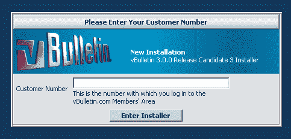
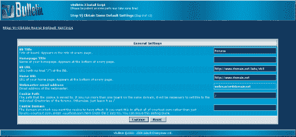
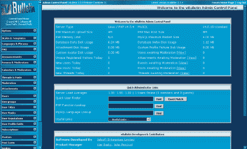
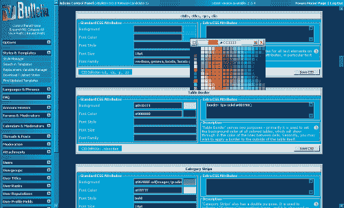
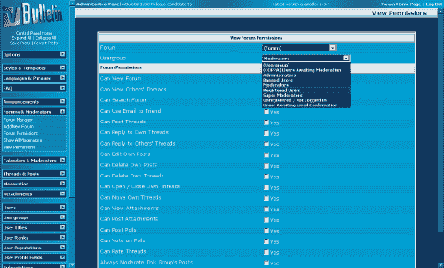
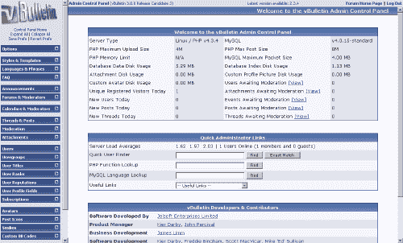
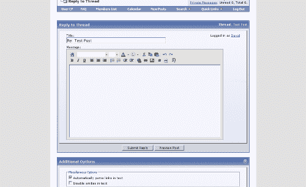
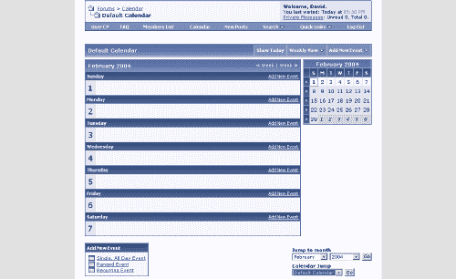

# 复习 vBulletin 3.0

> 原文：<https://www.sitepoint.com/review-vbulletin-3-0/>

vBulletin 通常用于创建大规模的互动社区。这个基于 PHP 的公告板已经在一些最知名的网站上使用，包括 [Linkin Park](http://forums.linkinpark.com/) 、 [SitePoint](https://www.sitepoint.com/forums/) 和 [Winamp](http://forums.winamp.com/) 等等。

vBulletin 2 以其丰富的功能集而闻名，是专业网站管理员的选择，但即将发布的 3.0 版本承诺将击败任何竞争对手。在[采访了首席开发者](https://www.sitepoint.com/article/interview-kier-darby-vbulletin)之后，我得到了一份 vB3 RC3 的拷贝，这是最新的拷贝，几乎可以发行了。黄金版唯一增加的内容是手册和一些修改过的图片(以及对用户报告的任何错误的修复)。因此，我可以在这里回顾一下，让您决定 vBulletin 是否是适合您的系统。

##### 装置

虽然安装 vB3 需要很多步骤，但是安装过程真的简单得不能再简单了！当你从会员区下载并解压软件包后，你会看到一个上传目录。

在上传之前，您需要将 includes/config.php.new 文件重命名为 config.php，然后按照文件注释中提供的说明，编辑内容以匹配您的站点设置。该文件包括允许特定管理员访问给定管理功能的配置选项— SQL 查询执行和管理员权限就是其中的一部分。在这个文件中配置这些设置是一个好主意，因为它确保管理选项是由董事会创始人设置的，并防止恶意管理员接管论坛。

一旦完成，文件被上传，只需浏览到 yourdomain.com/install/install.php 开始安装。这是你第一次看到新的 vB3 默认管理模板——它非常好看！

因为 vB 不是免费产品，所以你需要做的第一件事就是输入你的客户号来授权你的拷贝。一旦你这样做了，你将被重新定向到安装脚本，在屏幕上的指示引导你通过一个非常无痛的过程。在到达第 9 步之前，你只需点击“下一步！”第 9 步询问关于你的论坛的基本信息，你可以在下面的截图中看到(点击查看大图)。

一旦你完成了这一步，你被要求在继续主板之前删除 install.php 文件。

##### 管理员控制面板

vB3 管理控制面板拥有我所见过的管理面板中最多的选项！你一登录，模板和颜色就给你留下深刻印象——深蓝色和银色，就像安装系统一样。然而，过一段时间后，这可能会变得有点难以控制，我更喜欢一个更轻便的管理模板，当然，如果您准备编辑默认模板或获得一个别人修改过的模板，这是可能的。或者，如果您愿意，您可以选择使用白银模板，或者恢复到 vB2 管理模板。

控制面板主页为您提供了用户 PHP 和 MySQL 函数查询，以及 Jelsoft 积分。但是，您可以配置主页以显示额外的统计数据，如数据库数据磁盘使用情况、今天的独立注册访问者和自定义个人资料图片磁盘使用情况。

您要做的第一件事是编辑选项。你可以选择编辑选项的不同部分，或者在一个页面上查看所有设置，这允许你一次更新所有设置——在我看来，这是一个不错的选择。

这个页面包含了丰富的可定制选项，从禁用你的公告板，改变元标签，优化服务器使用，设置审查级别，到定义每页显示的内容。您想要更改或设置的每个元素都可以从 vBulletin 选项页面中访问。而且，如果您遇到困难，几乎每个选项都有上下文相关的帮助。

在 vBulletin 3 中，样式系统进行了全面的检查，并且变得非常强大。你风格的每个方面都可以通过管理控制面板轻松编辑。你根据默认设置创建一个新的模板，然后使用界面编辑 HTML 代码、字体、颜色、CSS——甚至是所见即所得的发布编辑器颜色和菜单图像。这确实将定制化发挥到了极致——它甚至包括定制变量和 PHP 支持的选项，并且您还可以编辑每个单独的页面模板。

一些用户希望能够下载模板页面，并在他们选择的编辑器中进行编辑；不幸的是，这在 vB3 中不可能立即实现，因为 vB3 中的所有内容都是通过管理面板编辑的。然而，没有什么可以阻止这些用户将模板 HTML 从 Web 编辑器复制到他们喜欢的编辑器中，在那里进行编辑，然后再粘贴回模板编辑器表单。

编辑完模板后，为什么不继续编辑出现在公告板页面中的副本呢？您可以直接从管理控制面板更改每个单词、短语和描述，因此没有必要升级和下载文件来编辑显示的内容！然而，尽管所有的文本都被分成了几个部分，但仍有大约 49 页的短语需要你去浏览编辑。如果你想编辑所有的副本，这可能是一个真正的痛苦。

类别、论坛和权限系统相当复杂，但这并不意味着它很难使用。用户可以为他们创建的每个论坛指定多个选项。您可能决定创建新帖子的通知，为新帖子/主题设置审核选项，设置警告选项，定义自定义模板，设置密码保护，以及启用或禁用一系列其他功能。

此功能使您可以完全控制您的论坛和类别。此外，为了确保您不必为每个单独的论坛设置相同的选项，系统会记住您之前选择的内容，并自动将这些选项设置为您创建的任何新论坛/类别的默认选项。您还可以将论坛设置为链接，并将点击它的论坛用户重定向到您指定的 URL。您可以将版主定义为个人用户或组，这正是权限系统非常方便的地方。

vB 提供了一组默认用户组——未注册用户、注册用户、管理员等。每个组都有默认权限，这些权限由您创建的每个论坛和类别继承。但是，如果您不想使用默认值，可以根据类别或论坛更改这些权限。

权限的定制不仅限于简单的选项——vB3 提供了非常具体的选项，从给定用户组成员的所有帖子的审核，到禁用搜索功能。这个权限系统非常强大，使您能够严格控制单个用户可以做什么和不可以做什么。这样做的一个缺点是，因为有太多的选项，新用户可能会弄不清他们正在为哪些组更改哪些设置。但是帮助就在眼前——vB3 提供了上下文敏感的支持，很好地解释了每个选项。

vBulletin 3 控制面板非常非常强大。它将允许你有效地管理你的论坛的每一个方面，直到最后一个像素。然而，在我花了大约 4 个小时的时间来测试它的时候，我发现了两个问题:

1.  有这么多选择的事实可能是好的也可能是坏的。我花了一些时间寻找一个选项，但最终我没有找到。最后，我加载了 vB 选项的“所有设置”页面，并用浏览器的 Find 命令找到了它。能够改变一切固然很好，但当有太多选项，很难找到你想要的，这是一个信号，表明界面的这一部分需要重新组织。

*   模板一开始看起来不错，但是当你试图完成任务时，它会变得过于强大和混乱。虽然我的观点可能与你的不同，但我更喜欢干净、整洁、整齐的界面，通常是浅色背景。vB3 界面的不同色调和蓝色渐变，以及大量的可用选项，使得控制面板很难长时间使用。幸运的是，在最终版本中，开发者打算包含一个管理模板，看起来和默认的论坛模板一样。然后，您可以根据自己的喜好选择想要使用的风格。你可以在下面的截图中看到这是什么——看起来好多了！

##### 论坛主页

默认的论坛模板完全不同于 vB2 管理和主论坛模板，它看起来很棒。它轻便、干净、整洁，而且不会让人感到压抑——这是一个好模板的绝佳例子。包含了许多简洁的 JavaScript 效果，其中包括搜索选项以及隐藏和显示某些面板的能力。这些功能通常与其他浏览器兼容，运行良好；那些不兼容的是不必要的。例如，当您在 Internet Explorer 中单击“注销”时，页面变暗并变灰，类似于您选择“关闭”时 WindowsXP 屏幕变灰的方式。

论坛用户可以使用的功能和管理控制面板中的选项一样广泛。发帖时，论坛成员可以访问先进的所见即所得编辑器，允许帖子格式化，插入列表、图像、链接和微笑，就像使用 Word 一样。这也允许用户使用 bbCode 标签，如`[quote]`迅速而容易。当然，这可以通过用户 CP 来改变。

所有论坛用户都可以访问他们自己的 CP 来配置他们的帐户。这允许他们查看订阅的线程，更改他们的签名，个人资料和论坛选项，并更新帐户信息。他们还可以很容易地设置私人信息，定义邮件文件夹和跟踪邮件，看看他们是否被阅读。此外，用户可以设置特殊事件提醒，定义好友和忽略列表，以及管理附件。总而言之，用户内容非常全面，给你的用户提供了自定义论坛体验的选项。

允许您的成员进一步互动的其他功能是日历和声誉/评级系统。日历可能很有用，例如，在一个体育网站上，允许成员发布关键事件的日期，并向他们发送提醒。信誉和评级系统允许成员向其他成员的帐户添加或从其他成员的帐户中删除信誉点，并对其他用户进行评级——该功能显然可以通过管理控制面板进行控制。这在建议式的论坛中是有益的，可以让新成员看到谁是最值得信任的论坛成员。

论坛版主也有一套很好的控制方法，允许他们有效地管理论坛。版主可以像管理员一样访问他们自己的控制面板。这允许他们向论坛添加新的公告；版主线程、帖子、附件和事件；搜索、编辑和禁止用户；和修剪线程。禁止系统允许管理员和版主指定时间禁止(包括永久禁止)，然后当持续时间到期时自动解除，节省您和您的团队手动做这件事的麻烦。

此外，关闭、移动、拆分、删除和合并(以及其他几个选项)等常见选项也出现在主论坛中。报告系统允许成员向版主和管理员报告帖子，以加速删除不适当的内容。缓和工具缺少的一点是警告系统。虽然这是一个额外的黑客，但它可能是一个有用的补充，可以让你给成员警告，并设置他们被禁止的级别。

##### 结论

到目前为止，我一直是 phpBB 的忠实追随者，因为它的开发团队、免费的开源成果以及易用性和特性。然而，在看到 vB3 之后，我真的很想为我的网站和论坛转换和购买它。

phpBB2.2 看起来不错，并且具有与 vB3 相似的功能，但是如果你现在想要这些功能，那么就购买 vB3 吧。对于专业网站管理员来说，它绝对是当前排名第一的论坛软件——它支持巨大的论坛，其功能可以满足任何社区的要求，并且创建者允许您查看源代码来编辑和开发它。

vB3 的优点远大于缺点，尽管这些问题应该得到解决——特别是管理界面和其中选项的组织。但是，在我看来，作为一个网站所有者和 PHP 爱好者，vB3 是所有严肃网站所有者的选择。你不会失望的。

**网站:**[http://www.vbulletin.com](http://www.vbulletin.com)
平台: PHP/MySQL
**价格:** $85 租赁许可证(每年续签)；160 美元的自有许可证(终身有效，但此后每年需要 30 美元用于更新)
**支持:**可通过社区和优先支持票获得。电话支持起价 60 美元
**附加组件可用:**由于源代码可见，修改(黑客)列表广泛，但可用模板有限，因为它还没有变成黄金
**优点:**非常好的默认主论坛模板，详尽的功能列表，全面的管理和用户控制面板
**缺点:**管理区的选项组织不太好，目前可用的模板很少
**评分:** 9.5/10