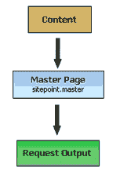
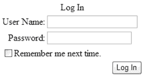

# 为惠德贝做好准备

> 原文：<https://www.sitepoint.com/microsoft-whidbey-dot-net/>

在大肆宣传的微软 PDC 之后，尘埃落定，Windows 和。NET 并展示了当前的进展。对于开发人员来说，这意味着要熟悉一套全新的缩略语和技术，并且有望对此感到兴奋。这篇文章的目的是给 ASP.NET 开发者一个机会为即将到来的事情做准备。NET 在不久的将来。

##### 这是什么？

惠德贝是下一代的代号。NET 工具和技术。就当是。NET 2.0。虽然仍在 Alpha 版本中，但 Whidbey 已经充满了添加、简化和有用的助手。

虽然本文将集中讨论为普通 space 开发人员引入的最大好处，但是 Whidbey 的内容比我在这短短的篇幅中所能介绍的还要多。对进一步信息感兴趣的人应该关注官方网站、ASP.NET 以及 [MSDN](http://msdn.microsoft.com) 。

##### 母版页

Web 开发人员面临的最大问题之一是如何抽象 Web 应用程序的布局和外观。ASP.NET 引入的自定义基础 Web 表单类和用户控件当然有所帮助，因为它们允许开发自定义 UI 元素和页面类型并集成到页面中。然而，页面组件的放置和布局需要在应用程序的所有页面上重复，这意味着需要大量的手动更改来重新设计应用程序的整体外观。

ASP.NET 2.0 引入了母版页，这是一种简单而强大的应用程序模板化机制。作为开发人员，您可以创建一个母版页；也就是说，定义组成应用程序中页面的元素的位置和外观的页面。内容页面(顾名思义)实际上定义了要在页面上显示的内容和数据。当发出请求时，这些信息将与母版页合并，并提供一个完整的页面:



ASP.NET 实际放置内容的位置由您使用内容占位符在母版页上指定。让我们看一个简单的例子来说明这一点。

下面是一个非常简单的母版页的代码:

```
<%@ Master Language="C#" %> 

<html> 

<body> 

<asp:ContentPlaceholder id="textContent" runat="server"> 

</asp:ContentPlaceholder> 

</body> 

</html>
```

这里有两个有趣的项目。首先，我们通过页面指令中的属性`Master`告诉 ASP.NET 这个页面是一个母版页。其次，我们定义一个内容占位符，称为`textContent`。任何熟悉服务器控件的人都会发现，内容占位符可以像现有的服务器控件一样被处理。

实际上，内容占位符是页面的一个区域，我们可以用内容页面中定义的内容来填充它。我们可以将任何想要包含的控件链接到占位符中，完成的页面将继承母版页中定义的所有布局样式和标记。下面是一个内容页面，它添加了一个带有文本“Hello World！”在名为`textContent`的占位符处:

```
<%@ Page Language="C#" Master="~/sitepoint.master" %> 

<script runat="server"> 

void Page_Load(object sender, System.EventArgs e) 

{ 

   lblText.Text = "Hello World!"; 

}     

</script> 

<asp:Content id="Content1" ContentPlaceholderID="textContent" runat="server"> 

<asp:Label runat="server" id="lblText"></asp:Label>   

</asp:Content>
```

为了链接页面以使用我们之前定义的母版页，我们将属性 master 添加到 page 指令中以标识母版页(在本例中保存为`sitepoint.master`)。

然后，我们定义希望在母版页的内容占位符中显示的内容。为此，我们使用一个新的服务器控件`content`，并将其`ContentPlaceholderID`属性设置为我们希望使用的`ContentPlaceholder`。在我们的例子中，有问题的`ContentPlaceholder`被称为`textContent`。

在内容页面上的事件中(如`Page_Load`)，我们然后访问我们定义的`Label`控件，就像任何其他控件一样添加到内容占位符中。在这里，`Text`属性被设置为“Hello World！”：

```
void Page_Load(object sender, System.EventArgs e) 

{ 

   lblText.Text = "Hello World!"; 

}    真正的美妙之处在于，如果我们现在想改变页面的外观，我们需要做的只是改变母版页；实际上，布局已经从我们的应用程序的页面内容中抽象出来了。

多个设备母版页

ASP.NET 2.0 还允许您为不同的呼叫设备定义不同的母版页。如果访问者使用 Mozilla 浏览你的网站，你可以定义一个母版页，它可以正确地使用 Mozilla 来呈现；Internet Explorer 也是如此；WAP 浏览器也是如此。最后，可以毫不费力地开发和集中管理多设备应用程序。

正如我们在上面的示例中链接内容页和母版页一样，我们也可以基于调用设备定义要使用的母版页:

```
<%@ Page Language="C#"  Master="sitepoint.master" 

    Mozilla:master="mozilla.master" %>
```

根据请求设备的不同，适当的母版页会链接到内容页。这在编写可能不是跨平台兼容的客户端代码时特别有用，例如，一些 DHTML 菜单或 JavaScripts。
主题
但是控制 ASP.NET 2.0 为我们提供了一个统一的外观和感觉，并没有就此停止。众所周知，主题化或皮肤化。
通过使用外观，您可以使用外观文件动态改变窗体上控件的外观。皮肤文件既可以定义控件的默认外观，也可以定义这些控件的特性，这与当今 CSS 的工作方式非常相似。然而，与 CSS 不同，主题化允许您为 ASP.NET 服务器控件的任何属性设置值，包括数据绑定属性，只要它们是主题感知的。
下面是一个皮肤文件，它设置了一个`Label`的默认外观和一个标签控件的专门化。我们可以通过将应用程序页面上出现的控件的`skinID`属性设置为等于专门化的 ID 来访问这个专门化。

```
<!--DEFAULT --> 

<asp:Label runat="server"  

    Font-Names="Arial" Font-Size="12pt" 

    ForeColor="#ff0000" BackColor="transparent" /> 

<!--SPECIALISATION --> 

<asp:Label runat="server" SkinID="Title" 

    Font-Names="Arial" Font-Size="18pt" 

    ForeColor="#0000ff" BackColor="transparent" 

    Font-Bold="true" />
```

如果我们现在指定希望在代码中使用这个皮肤文件，那么所有标签控件都将继承我们在皮肤中指定的默认外观(即 12 号红色 Arial 字体)。然而，如果我们将表单上的`Label`控件的`skinID`设置为等于我们的专门化，名为“Title ”,专门化外观将被使用。
让我们看看如何使用这个皮肤文件。下面是使用皮肤(保存在目录 Themes/MyTheme 中)来控制控件外观的表单代码:

```
<%@ Page Language="C#" Theme="MyTheme" %> 

<asp:Label runat="Server" SkinID="Title" 

    id="titleLabel" Text="This is a title!"/> 

<p> 

<asp:Label runat="Server" 

    Text="This is the default text"/> 

</p>
```

第一个标签从我们的 specialization`Title`继承了它的外观，而第二个标签从我们的皮肤文件中定义的默认外观继承了它的外观，因此不需要一个`skinID`属性。

##### 成员 API

今天，几乎所有的 Web 应用程序，无论是基于社区的还是基于电子商务的，都需要某种身份验证才能访问。ASP.NET 1 . x 附带了几种方法来简化在应用程序中构建安全访问的任务，其中最常用的方法是表单身份验证。开发者可以通过要求所有访问首先通过登录表单来保护应用程序。在编写了对用户进行身份验证的代码之后，访问被授予，用户被重定向到他们最初的请求。

即便如此，构建数据库表、管理会话 cookies、编写代码来添加、删除和修改用户以及提供丢失的密码的过程也是一件麻烦的事情。在步骤 ASP.NET 2.0，这是完整的一套全面的工具来建立和管理访问和成员到您的应用程序。

ASP.NET 2.0 引入了新的控件来帮助构建访问控制。登录控件是构建登录表单的一站式解决方案。该控件具有完整的持久性支持，这意味着方便的“记住我”功能是为您处理的。`LoginStatus`控件允许您向用户显示当前的登录状态，并提供“注销”和“登录”的自动链接。类似地，`LoginName`控件允许快速显示对用户名的访问，`LoginView`控件的功能很像传统的`Panel`；但是，它允许您为不同的登录状态自动创建不同的视图。最后，`PasswordRecovery`控件处理大家都很熟悉的“忘记密码了？”功能性。

您可以使用一个`Membership`对象来管理您的会员资格。数据提供者提供数据库与控件和对象之间的链接，这些可以在`web.config`文件中定义。有两个现成的提供程序，SQL Server 和 Access(不足为奇)都受到支持。然而，其他数据提供者可以使用一组标准的接口来实现——不需要复杂的数据库编码！

我们举个例子。现在，为用户提供访问所需要的只是一个登录控件:

```
<html>  

<body>  

<form runat="server">  

<asp:Login runat="server" />  

</form>  

</body>  

</html> 

当用户点击“登录”按钮时，事件`Login_Click`被触发，在这里我们可以验证用户:

```
void Login_Click(Object Sender, EventArgs E) {  

  if (Membership.ValidateUser(Username.Text, Password.Text))  

  {  

    FormsAuthentication.RedirectFromLoginPage(  

      Username.Text, false);  

  }  

  else  

  {  

    LoginMessage.Text =  

      "Wrong username or password. Please try again.";  

  }  

}
```

所有的艰苦工作都为我们完成了。查询我们的数据库以查看用户是否存在，如果存在，我们将用户重定向到请求访问的页面。
个性化
如您所见，这是一套全面的工具！但这还远远没有到 ASP.NET 2.0 让你自生自灭的地步。此外，它还为您提供了一个`Profile`对象。
对象允许你以一种简单的方式存储关于用户的信息。可以在应用程序的`web.config`文件中添加一个`profile`部分，并且可以插入不同的属性来组成用户的简档:

```
<profile>  

  <property name="Name" type="System.String "/>  

  <property name="Age" type="System.Integer "/>  

</profile>
```

然后可以通过`Profile`对象在代码中访问这些属性:
`Profile.Name = "Philip Miseldine";`
微软对 IntelliSense 的大量使用意味着，当您使用 Visual Studio .NET 进行开发时，您添加的所有属性都会在熟悉的自动完成下拉菜单中弹出。
您还可以定义组来构建您的配置文件。例如，您可以有一个名为“PersonalInformation”的组，其中包含有关用户个人详细信息的属性，还有一个名为“Responsibilities”的组，其中包含定义用户在组织中的角色的属性:

```
<profile>  

  <group name="PersonalInformation">  

    <property name="Name" type="System.String "/>  

    <property name="Age" type="System.Integer "/>  

  </group>  

  <group name="Responsibilities">  

    <property name="AdminRights" type="System.Boolean"/>  

  </group>  

</profile>
```

在您的代码中，现在可以通过以下方式访问它们:
`Profile.PersonalInformation.Name = "Philip Miseldine";`
与成员资格 API 一样，配置文件需要指定数据提供者才能运行。然后，当用户登录时，个人资料将链接到用户，这有助于无缝、无障碍地处理您的站点成员资格。
使用我们前面讨论的成员资格 API 和主题化功能，您可以为用户提供完全定制您的站点外观的能力。Web 部件和 Web 区域——熟悉 SharePoint 的任何人都熟悉——甚至允许您使用信息面板自动开发门户。因此，有了 ASP.NET 2.0，开发者可以毫不费力地为用户构建高度定制和安全的体验。
自适应设备呈现
对 ASP.NET 来说，移动互联网工具包(MMIT)是一个伟大的迟到的补充。使用自适应呈现，该工具包允许创建根据调用设备调整输出的页面。例如，访问页面的移动电话可以获得 WML 输出；一个 PDA，一个 HTML 3.0 输出；诸如此类。然而，仍然有必要将这些页面分离为`MobileWebForms`，而不是标准的`WebForms`，因此需要做更多的工作来获得真正自适应的网页。
ASP.NET 2.0 的核心内置了自适应渲染，这意味着不再有隔离。此外，还可以考虑不同的浏览器，因此无需您付出任何努力，页面就会根据调用的设备以 WML、HTML 或 XHTML 的形式出现。
Web 应用程序的预编译
ASP.NET 1 . x 的一个不和谐的行为是，一旦构建了 Web 应用程序，它仍然需要编译。这表现为在构建和部署新程序集后，显示页面会有短暂的延迟。实际发生的情况是，在第一次请求页面时，页面代码被编译，以后的请求使用这个编译的输出。
在 ASP.NET 2.0 中，应用程序(包括网页和代码)可以被预编译成程序集，从而克服了这个问题。作为一个有趣的副作用，这也意味着更好的智能内容控制，因为您的网站只是从一组编译的程序集运行，从您的网站的存储中删除代码和标记。它还有助于发现未编译成程序集的代码中的错误，例如。aspx 页面。由于整个站点是在您的终端编译的，而不是在服务器上，编译器会标记错误，就像您在使用 IDE 一样。
Visual Studio。NET“Whidbey”
Visual Studio。NET 是开发 ASP.NET 应用程序的极好的集成开发环境，但是它的 Whidbey 版本将使它更加智能和易于使用。这是我希望 2003 年发布的版本。
对于 Visual Basic 开发人员来说，将实现非常缺少的“编辑并继续”,这意味着不需要对运行时进行的每个更改进行完整的重新编译。Visual Basic 也在被简化，重点是将其返回到一个更加可视化的开发方面。这意味着 IDE 和语言核心将自动为您完成更多繁琐的任务。这并不符合每个人的开发口味，但它确实预示着回归旧的 Visual Basic，而不会失去任何大的附加功能，如 OO 支持、运算符重载和内联 XML 文档。
C#开发人员获得了广泛的新语言，包括泛型和迭代器。泛型类型可以用来生成保持不变的代码，而参数的数据类型可以随着每次调用而改变。这在今天可以通过使用多态性和类型转换来实现，但是泛型可以让你避免所有的陷阱和不确定性，就像你今天编码它一样。迭代器允许“类型声明`foreach`语句将如何遍历它们的元素”。这意味着一个类型不再需要实现`GetEnumerator`。虽然`GetEnumerator`对于简单的列表结构来说已经足够了，但是它不能有效地用于更复杂的结构，比如二叉树。
Visual Studio。NET Whidbey 提供了更多的添加、调整和改进。智能感知更智能，支持重构，使用自动手表调试更智能。IntelliTasks 自动完成常用代码，如`switch`和`if...else`语句。它甚至允许您定义自己的代码块来自动完成。生产率肯定会提高。
简单说说 indiglo
除了构建 ASP.NET 开发者已经可用的分布式 Web 服务框架之外，Whidbey 还引入了 Indigo，这是一种新的基础设施，允许您从一组服务构建完整的系统，而不是像传统的 OO 开发那样编写类。它最大的好处是 Indigo 允许快速开发可以用很少的代码完全处理的服务系统。
摘要
嗯，这里有一个关于 ASP.NET 开发者在不久的将来可以期待什么的简要概述。我甚至没有提到 SQL Server 的继任者 Yukon，以及它与 Longhorn development 的更密切的联系。简而言之，Whidbey 意味着编写更少的代码、更智能的开发工具和更容易的管理。滚吧，2005 年！

```

## 分享这篇文章

```