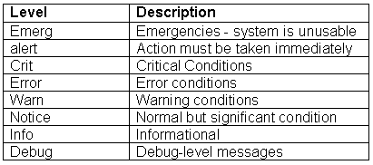
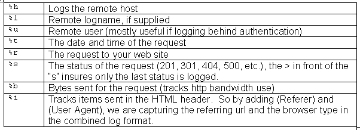

# 在 Apache 中配置 Web 日志

> 原文：<https://www.sitepoint.com/configuring-web-logs-apache/>

网站的众多难题之一是网络日志。流量分析是大多数网站的核心，从流量分析中获得最大收益的关键在于如何配置网络日志。

Apache 是用于网站运营的最强大的开源解决方案之一。您会发现 Apache 的 Web 日志功能对于单个网站或管理大量需要 Web 日志分析的域来说非常灵活。

作者注:虽然本文的大部分讨论了 Apache 支持的任何操作系统的配置选项，但有些内容是特定于 Unix/Linux (*nix)的，现在包括 Macintosh OS X 及其底层 Unix 内核。

对于单个站点，Apache 基本上配置为在默认安装中登录。初始的 httpd.conf 文件(大多数情况下在`/etc/httpd/conf/httpd.conf`中)应该有一个类似于(Apache 2.0.x)的日志部分，对每一项都有描述性的注释。您的默认日志文件夹将在`/etc/httpd/logs`中找到。这个位置在处理多个网站时可以改变，我们稍后会看到。现在，让我们回顾一下日志配置的这一部分。

```
ErrorLog logs/error_log 

LogLevel warn 

LogFormat "%h %l %u %t "%r" %>s %b "%{Referer}i" "%{User-Agent}i"" combined 

LogFormat "%h %l %u %t "%r" %>s %b" common 

LogFormat "%{Referer}i -> %U" referer 

LogFormat "%{User-agent}i" agent 

CustomLog logs/access_log combined 错误日志

错误日志包含 Apache 针对操作过程中遇到的错误发送的消息。这个日志对于解决服务器端的 Apache 问题非常有用。

 *Apache 日志提示:如果您正在监控错误或测试您的服务器，您可以使用命令行交互地观察日志条目。打开一个 shell 会话并键入`"tail –f /path/to/error_log"`。这将显示文件中的最后几个条目，并在新条目出现时继续显示。*

除了告诉 Apache 在哪里建立文件，以及您希望捕获什么级别的错误日志之外，没有真正的定制选项。首先，让我们看看 httpd.conf 中的错误日志配置代码。

```
ErrorLog logs/error_log
```

您可能希望将所有与错误相关的信息存储在一个错误日志中。如果是这样的话，以上是没问题的，即使是对于多个域。但是，您可以为每个单独的域指定一个错误日志文件。这是在`<VirtualHost>`容器中完成的，其条目如下:

```
<VirtualHost 10.0.0.2> 

DocumentRoot "/home/sites/domain1/html/" 

ServerName domain1.com 

ErrorLog /home/sites/domain1/logs/error.log 

</VirtualHost>
```

如果您作为服务器管理员负责查看错误日志文件，建议您维护一个错误日志。如果你为客户托管，并且他们负责监控错误日志，那么指定他们可以在方便的时候访问的单独的错误日志会更方便。
控制要捕获的错误日志记录级别的设置如下。

```
LogLevel warn
```

Apache 对错误日志级别的定义如下:

跟踪网站活动
通常默认情况下，Apache 会生成三个活动日志:访问、代理和推荐。这些跟踪访问您的网站，被用来访问网站的浏览器和引用的网址，您的网站访问者来自。
现在普遍使用 Apache 的“组合”日志格式，将这三个日志编译成一个日志文件。这在使用流量分析软件时非常方便，因为大多数第三方程序在每个域只处理一个日志文件时最容易配置和调度。
让我们以组合的日志格式来分解代码，看看它都意味着什么。

```
LogFormat "%h %l %u %t "%r" %>s %b "%{Referer}i" "%{User-Agent}i"" combined
```

```
LogFormat starts the line and simply tells Apache you are defining a log file type (or nickname), in this case, combined.  Now let's look at the cryptic symbols that make up this log file definition.

要查看生成定制日志的所有可用配置代码，请参见`module_log_config`上的 [Apache 的](http://httpd.apache.org/docs-2.0/mod/mod_log_config.html)文档，它为 Apache 中的日志文件提供了动力。

Apache 日志提示:如果您愿意，可以从 HTTP 头中获取更多信息。标题中数据的完整列表和定义可在[万维网联盟](https://www.w3.org/Protocols/HTTP/HTRQ_Headers.html)找到。

对于单个网站，默认条目就足够了:

```
CustomLog logs/access_log combined
```

但是，对于记录多个站点，您有几个选择。最常见的是为每个域标识单独的日志文件。这在下面的例子中可以看到，同样在每个域的`<VirtualHost>`容器中使用 log 指令。

```
<VirtualHost 10.0.0.2> 

DocumentRoot "/home/sites/domain1/html/" 

ServerName domain1.com 

ErrorLog /home/sites/domain1/logs/error.log 

CustomLog /home/sites/domain1/logs/web.log 

</VirtualHost> 

<VirtualHost 10.0.0.3> 

DocumentRoot "/home/sites/domain2/html/" 

ServerName domain2.com 

ErrorLog /home/sites/domain2/logs/error.log 

CustomLog /home/sites/domain2/logs/web.log 

</VirtualHost> 

<VirtualHost 10.0.0.4> 

DocumentRoot "/home/sites/domain3/html/" 

ServerName domain3.com 

ErrorLog /home/sites/domain3/logs/error.log 

CustomLog /home/sites/domain3/logs/web.log 

</VirtualHost>

In the above example, we have three domains with three unique Web logs (using the combined format we defined earlier).  A traffic analysis package could then be scheduled to process these logs and generate reports for each domain independently.这种方法适用于大多数主机。但是，在某些情况下，这可能会变得不可收拾。Apache 为大型虚拟主机环境推荐了一个特殊的日志文件，并提供了一个工具来为每个单独的域生成单独的日志。

我们将这种日志类型称为 cvh 格式，代表“公共虚拟主机”只需在前面定义的组合日志格式的开头添加一个%v(代表虚拟主机),并给它一个新的昵称 cvh，我们就可以将所有域编译成一个日志文件，然后自动将它们分割成单独的日志文件，供流量分析包处理。

```
LogFormat "%v %h %l %u %t "%r" %>s %b "%{Referer}i" "%{User-Agent}i"" cvh
```

在这种情况下，我们没有在`<VirtualHost>`容器中创建任何`CustomLog`条目，只是让 Apache 生成一个日志文件。Apache 创建的一个名为`split_logfile`的程序包含在 Apache 源代码的 src/support 目录中。如果你没有编译源代码或者没有源代码，你可以得到 [Perl 脚本](http://slacksite.com/apache/scripts/split-logfile)。
从主日志文件创建的各个日志文件将为每个域(虚拟主机)命名，看起来像:`virtualhost.log.`
原木旋转
最后，我们希望解决日志轮换问题。高流量网站会生成非常大的日志文件，这将很快吞噬你的服务器上宝贵的磁盘空间。您可以使用日志轮转来管理此过程。
有许多方法可以处理日志轮换，也有各种第三方工具可用。然而，我们关注的是 Apache 的本地配置，所以我们将在这里查看一个简单的日志轮换方案。稍后我将包含更灵活、更复杂的日志循环选项的链接。
这个示例使用一个基本的 shell 脚本将当前的 Web 日志移动到归档日志中，压缩旧文件并将归档文件保存长达 12 个月，然后暂停重启 Apache 以允许日志文件被切换出来。

```
mv web11.tgz web12.tgz 

mv web10.tgz web11.tgz 

mv web9.tgz  web10.tgz 

mv web8.tgz  web9.tgz 

mv web7.tgz  web8.tgz 

mv web6.tgz  web7.tgz 

mv web5.tgz  web6.tgz 

mv web4.tgz  web5.tgz 

mv web3.tgz  web4.tgz 

mv web2.tgz  web3.tgz 

mv web1.tgz  web2.tgz 

mv web.tgz   web1.tgz 

mv web.log   web.old 

/usr/sbin/apachectl graceful 

sleep 300 

tar cvfz web.tgz web.old
```

这段代码可以被复制到一个名为`logrotate.sh`的文件中，并放在存储 web.log 文件的文件夹中(或者任何您命名的日志文件，例如 access_log 等)。).只是一定要修改你的日志文件名和 chmod(改变文件的权限)为 755，这样它就成为一个可执行文件。
这对于单个繁忙的站点来说很好。如果您对日志循环有更复杂的要求，请务必访问以下网站。此外，许多 Linux 发行版现在都包含了日志循环。例如，Red Hat 9 附带了一个高度可配置的日志循环守护进程`logrotate.d`。要了解更多信息，在安装了`logrotate.d`的 Linux 系统上，输入`man logrotate`。
日志轮换网站
有关日志定位的更多信息，请参见:

```

```

```

*   [克罗诺格](http://www.cronolog.org/index.html)
*   [modperl](http://modperl.com:9000/perl_conference/test.html)

## 分享这篇文章