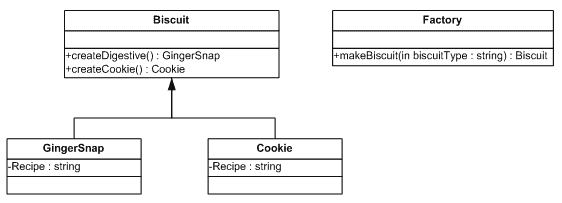

# 的统一数据访问。网

> 原文：<https://www.sitepoint.com/unified-data-access-net/>

几乎今天所有的 Web 应用程序都使用某种数据库来存储持久数据。。NET 应用经常使用 SQL Server，PHP 应用大多使用 MySQL 等等。然而，当将应用程序部署到客户端时，在许多情况下，客户端可能希望使用与您的应用程序已经实现的数据库不同的数据库。例如，他们可能会在整个企业中使用 Oracle，如果没有对它的支持，他们就不会使用您的系统。让最终用户选择，而不是将您的系统绑定到一个单独的第三方数据库，这也是更好的做法。

通常，这意味着大量的重新编码，以使您的应用程序与不同的 DBMSs(数据库管理系统)对话。下面的文章将向您展示，只需一点规划，您就可以让您的应用程序支持当今几乎所有的专业 DBMS。

##### 阿多。网:快到了

ADO.NET 无疑为开发商提供了更多便利。DataReader 和 DataSet 提供了可以操作和查询的类型，而不必担心底层的访问方法。即便如此，为了填充这两种结构，传统上我们需要使用不同的类型来处理不同的数据库。ADO.NET 让我们可以访问 SQL Server、OLE DB 和 ODBC，以及许多其他可用的数据库提供商(例如， [Oracle](http://msdn.microsoft.com/library/default.asp?url=/library/en-us/cpguide/html/cpconconnectingtooracledatasourceusingadonet.asp) 和 [MySQL](http://sourceforge.net/projects/mysqlnet/) )。

```
 using System.Data.SqlClient; // SQL Server 7.0/2000 

using System.Data.Odbc; // ODBC 

SqlConnection sqlConn = new SqlConnection(connectionString); 

OdbcConnection odbcConn = new OdbcConnection(connectionString);
```

假设我们编写了一个连接到 SQL Server 的应用程序，一个新客户希望我们使用他们专有的通过 ODBC 连接的 DBMS。为此，我们必须在整个应用程序中转换系统中包含的类型。Data.SqlClient 到系统。或者在我们的代码中放置条件语句，留下许多本质上重复的代码。这两种选择对程序员来说都不是很有吸引力。

然而，有趣的是，每个提供者都继承了框架提供的同一组接口，因此，它们可以用统一的方式处理；例如，所有连接对象(如 SqlConnection 和 OdbcConnection)都继承自 IDbConnection 接口。

我们真正想要的是这样一个类，我们可以只告诉它一次“我想使用这种类型的数据库”，然后让它“运行这个查询并返回一个数据集或 DataReader 以及结果”，而不用担心底层的连接。更具体地说，我们想要一个类，它将根据我们给它的标准创建一个对象的实例，在它后面有一个未知的和看不见的实现。这就是所谓的工厂模式。

##### 工厂模式

Erich Gamma 将工厂模式定义为“让一个类将实例化推迟到子类的方法。”让我们看一个真实世界的例子来理解工厂模式可以模仿什么，以及它可以用在哪里。

想象一个饼干厂。这家工厂能生产各种不同的饼干，每种都有自己的配方；例如，巧克力曲奇的制作方法就不同于姜饼的制作方法。工厂管理层不需要知道如何制作饼干，他们只需要能够将饼干包装好并运送到客户的商店。工人(无论是机器还是人)确实需要饼干的配方。他们按照食谱上的说明，为经理制作了一块饼干。如果经理需要制作一种不同的饼干，他告诉工人使用不同的配方，一种不同类型的饼干就生产出来了。

所以，要制作不同类型的饼干，需要改变的只是配方(当然，确保我们手头有所有的配料！).通过这种方式，经理将饼干的制作委托给他们的工人。沿着供应链往上走，我们可以考虑购买客户(购买饼干的商店和企业)和饼干消费者(公众)。同样，他们不需要知道饼干的配方(事实上，我们对配方保密是有利的，这样可以保护我们的生意)。他们只是要求创造饼干。

所以现在我们有了工厂的结构。我们想要一种所有其他饼干都必须符合的饼干形式。这使得我们的管理层可以用同样的方式处理饼干(对经理来说，姜饼和饼干本质上是一样的)。特种饼干，如我们的饼干，继承了我们标准饼干的所有特性，但有不同的行为(饼干可能比姜饼更耐嚼，或有不同的味道)。这可以用 UML 表示如下:



Factory 类将创建委托给 Biscuit 类(makeBiscuit 方法)，但是指定它需要哪种类型的饼干(biscuitType 参数)。然后，饼干类创建适当的饼干(createGingerSnap 或 createCookie 方法)，并返回其创建结果。

由于姜汁饼干和曲奇饼干都是饼干类型，工厂不需要担心它有什么类型的饼干，因为它们都可以被视为饼干，而不是姜汁饼干或曲奇饼干。

##### 从饼干到数据库

饼干说够了！回到我们最初的问题:如何统一数据访问。我希望到目前为止我们讨论的例子已经给了你一些如何做到这一点的想法。用我们希望实现的通用数据库连接替换我们的通用饼干，并将我们不同类型的饼干(ginger snap 和 cookie)替换为不同类型的数据库(SQL Server、ODBC)，我们可以调用工厂为我们生成一个具有我们需要的功能的数据库连接，而不必知道我们正在使用的底层细节(配方)。所有连接对象都已经从 IDbConnection 接口继承，因此不同的连接可以共享相同的代码；我们需要做的就是告诉工厂我们希望使用哪种类型的连接。

我们可以通过传递给 makeConnection 方法的参数来告诉我们的工厂使用哪种类型，该方法将返回一个 IDbConnection 来表示我们的数据库连接。我们可以使它成为静态的，因为不需要手工创建工厂类本身:我们只需要一个工厂，它从不改变自己:

```
public class ConnectionFactory  

  {  

  public enum connectionTypes {SQLServer, ODBC};  

public static IDbConnection makeConnection  

(int connectionType, string connectionString)  

    {  

      switch (connectionType)  

      {  

        case ((int)connectionTypes.SQLServer):  

          return (IDbConnection)new SqlConnection(connectionString);        

        case ((int)connectionTypes.ODBC):  

          return (IDbConnection)new OdbcConnection(connectionString);  

      }  

      //no match  

      return null;  

    }  

  }
```

注意`enum`或枚举器的使用。枚举器是给整数一个友好名称的好方法。在上面的代码中，`connectionTypes.SQLServer`等于 0，`connectionTypes.ODBC`等于 1，依此类推。这样，用户不需要记住特定的字符串或匿名整数，这有助于可读性和验证。

工厂查询传递给它的值`connectionType`,并创建适当的连接对象。因为每个连接对象都是 IDbConnection 类型，所以我们可以将创建的对象转换为这种类型，这样我们就可以用相同的方式处理所有的连接对象，不管它们的实现是什么…这是我们的最终目标！

##### 开业

现在，让我们看看如何在我们的应用程序中使用它。以前，如果我们希望连接到 SQL Server，我们需要创建一个 SqlConnection。现在，我们可以使用我们的工厂:

```
private void Form1_Load(object sender, System.EventArgs e)  

{  

  string connectionString = "";  

  IDbConnection conn = ConnectionFactory.makeConnection((int)ConnectionFactory.connectionTypes.SQLServer, connectionString);  

  IDbCommand comm = conn.CreateCommand();  

  comm.CommandText = "select * from mytable";  

  conn.Open();  

IDataReader dr = comm.ExecuteReader();  

//do what we want to do with the datareader  

//finally close the connection.  

conn.Close();  

}
```

请注意，现在唯一依赖于我们希望连接的数据库类型的行如下所示:

```
IDbConnection conn = ConnectionFactory.makeConnection((int)ConnectionFactory.connectionTypes.SQLServer, connectionString);
```

这里，我们的数据库类型规范是通过一个灵活的参数来制定的。

对数据库的所有其他调用现在都是从我们正在连接的实际数据库类型中抽象出来的。我们的工厂返回给我们一个将使用 SQL Server“配方”的对象，但是我们可以很容易地指示它返回一个基于 ODBC 连接“配方”的对象，并重用相同的代码。一个简单的 if 语句可以用来选择我们希望使用的数据库类型:

```
string connectionString = "";  

IDbConnection conn;  

if (database == "SQL Server")  

{  

  conn = ConnectionFactory.makeConnection((int)ConnectionFactory.connectionTypes.SQLServer, connectionString);  

}  

else  

{  

  //if not SQL Server, then ODBC  

  conn = ConnectionFactory.makeConnection((int)ConnectionFactory.connectionTypes.ODBC, connectionString);  

}  

  IDbCommand comm = conn.CreateCommand();  

  comm.CommandText = "select * from mytable";  

  conn.Open();  

IDataReader dr = comm.ExecuteReader();  

conn.Close();
```

正如你所看到的，一旦创建了 conn 对象，我们就再也不用考虑使用什么数据库，也不用修改任何代码:我们应用程序中所有数据库查询的代码现在都是独立于数据库的，使用 about 提供的内置接口。

##### 笔记

那么为什么不编写应用程序来通过 ODBC 进行通信呢？毕竟，大多数数据库都支持它。以 SQL Server ADO.NET 组件为例。这些允许应用程序通过 TDS(表格式数据流，这是 SQL Server 的本地数据格式)与 SQL Server 通信。与通过 ODBC[Sack]进行的调用相比，这提供了大约 30-40%的速度提升。j .(2003)SQL Server 2000 DBA 和开发人员快速解答。柯灵斯通出版社。].许多专用 ADO.NET 组件集也有类似的增强功能。当本文中概述的统一数据访问框架如此容易实现时，这些性能提升实在是太大了，不容忽视。

改进的余地很大。对于更健壮和更高级的数据层，我们应该包括 IDbDataAdapter、IDataReader 和 IDbCommand 的工厂。我们还可以使用反射类来查看我们可以连接到哪些类型的数据库。事实上，您可以编写自己的接口集，只公开您的应用程序中需要的功能，并通过工厂创建它们。

##### 摘要

对我来说，ASP.NET 给项目带来的最大好处是出色的面向对象支持的力量。我希望这篇文章已经展示了利用这种能力使您的应用程序可扩展和可重用是多么容易，而您只需付出很少的努力。

## 分享这篇文章