# 用 Fireworks MX 在内部粘贴

> 原文：<https://www.sitepoint.com/paste-inside-fireworks-mx/>

**Macromedia Fireworks MX 有许多非常酷的功能，其中之一就是让您能够在形状中放置图像，如下所示:**

你可能在网上见过这些图片——这种效果叫做“内部粘贴”

“粘贴在里面”是一个非常简洁的小效果，你可以用它来给你的图片增加一点趣味，让它们看起来更专业。您可以将任何图像粘贴到您在 Fireworks MX 中创建的任何形状:椭圆形、圆形、矩形、圆角矩形-任何形状！

在本教程中，我将向你展示如何创建类似于下图的图像。请注意图像如何出现在形状内部。让我们来学习如何创建这个非常整洁的效果。

首先，你需要一张图片。下面你会发现我最初开始的图像。如果您愿意，您可以下载这个图像并在本教程中使用，或者如果您手边有您喜欢的图像，您也可以使用自己的图像。

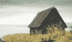

**第一步**

启动 Macromedia Fireworks MX，并通过选择“文件”>“新建”来创建一个新文件。

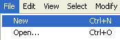

使新的 Fireworks 文件为 200×200 像素，背景为白色。

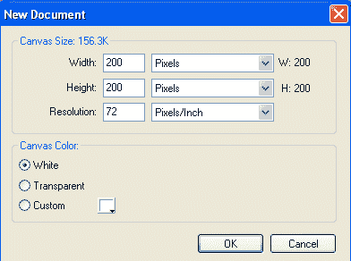

**第二步**

现在我们需要将我们决定使用的图像导入到新的 Fireworks 文件中。选取“文件”>“导入”，然后找到您想要使用的图像。将其导入到新的 Fireworks 文件中(见下文)。

单击“导入”按钮后，将鼠标移到您在步骤 2 中创建的空白 fireworks 文件上，然后单击鼠标左键。您尝试导入的图像将出现在空白 fireworks 文件中，看起来像这样:

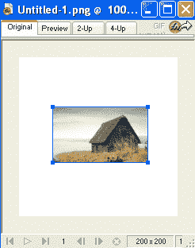

**第三步**

既然我们已经将图像导入到 fireworks 文件中，我们需要创建一个形状来放置图像。我要用一个椭圆。转到 fireworks 工具栏，左键单击并按住形状按钮。将出现一个框。左键单击椭圆按钮，然后释放，如下所示:

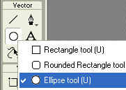

在步骤 3 中导入的图像上绘制一个椭圆，使形状的宽度和高度略小于图像。到目前为止，您的工作应该类似于以下内容:

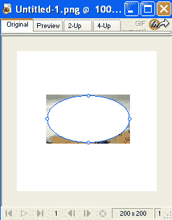

**第四步**

我们需要移动图像后面的椭圆，这样我们才能继续。选择修改>>排列>>置于底层。椭圆现在应该在图像后面，如下所示。

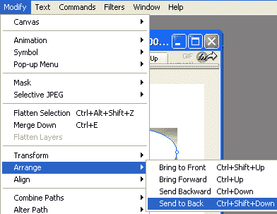

**第五步**

左键单击图像将其选中，然后选择编辑>>剪切，如下所示:

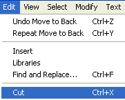

左键点击椭圆选择它，然后进入编辑>>粘贴在里面。

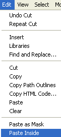

**第六步**

现在你应该有你的图像粘贴在你的椭圆内。很酷不是吗？

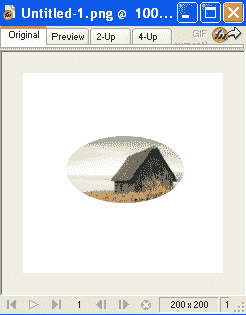

**第七步**

现在，让我们把一些效果加入到图片中，做一些最后的润色。首先我们将添加一个阴影。左键点击图像选择它，然后选择效果>>阴影和发光>>阴影。

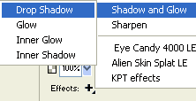

我将阴影的距离设置为 7，颜色使用黑色，如下所示:

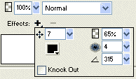

**第 8 步**

接下来，让我们添加一个发光的形象。左键点击图像选择它，然后进入效果>>阴影和发光>>内部发光。

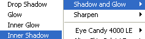

我已经设置光晕偏移量为 4，颜色为#66CCCC。

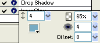

在图像完成之前，我们还需要做最后一件事。我们需要修剪画布，去掉所有多余的空白。选择修改> >画布> >修剪画布。

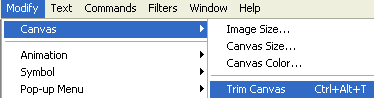

您的图像现在应该看起来如下所示。

您可以使用本教程中详细介绍的方法将任何图像放入您可以在 Macromedia Fireworks MX 中创建的任何形状中。祝你未来的创作好运！

## 分享这篇文章