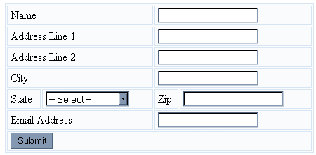
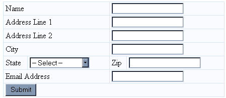

# 使用 CSS 文章样式化 Web 窗体

> 原文：<https://www.sitepoint.com/style-web-forms-css-3/>

##### 登记表

在要求用户登录的网站上，你可能也会提供注册功能。CSS 也可以帮助你制作更长的表单，比如注册页面，看起来更有吸引力。

我们将使用的表单标记如下(注意，为了简洁起见，我已经删除了选项列表中的大多数状态):

```
<form name="signup" id="signup" method="post" action="#">  
  <table>  
    <tr>    
      <td colspan="2"><label for="name">Name</label></td>  
      <td colspan="2"> <input type="text" name="name" id="name" tabindex="1" /></td>  
    </tr>  
    <tr>    
      <td colspan="2"><label for="address1">Address Line 1</label></td>  
      <td colspan="2"> <input type="text" name="address1" id="address2" tabindex="2" /></td>  
    </tr>  
    <tr>    
      <td colspan="2"><label for="address2">Address Line 2</label></td>  
      <td colspan="2"> <input type="text" name="address2" id="address2" tabindex="3" /></td>  
    </tr>  
    <tr>    
      <td colspan="2"><label for="city">City</label></td>  
      <td colspan="2"> <input type="text" name="city" id="city" tabindex="4" /></td>  
    </tr>  
    <tr>    
      <td><label for="state">State</label></td>  
      <td><select name="state" id="state" tabindex="5">  
          <option value="">-- Select ---</option>  
          <option value="AL" >Alabama</option>  
          <option value="AK" >Alaska</option>  
        </select></td>  
      <td><label for="zip">Zip</label></td>  
      <td> <input type="text" name="zip" id="zip" tabindex="6" /></td>  
    </tr>  
    <tr>    
      <td colspan="2"><label for="email">Email Address</label></td>  
      <td colspan="2"><input type="text" name="email" id="email" tabindex="7" /></td>  
    </tr>  
    <tr>    
      <td colspan="4"><input type="submit" name="Submit" value="Submit" tabindex="8" /></td>  
    </tr>  
  </table>  
</form>
```

这是在浏览器中。


该表单使用表格进行布局。为了将表格标记减到最少，我们可以使用 CSS 来设计表格和表单的样式。首先，要设置表格的样式，请将以下内容添加到样式表中:

```
 #signup table {  
  background-color: #F9FBFD;  
  color: #000000;  
  width: 440px;  
  border: 1px solid #D7E5F2;  
  border-collapse: collapse;  
}  

#signup td {  
  border: 1px solid #D7E5F2;  
  padding-left: 4px;  
}
```

代码规定这些规则适用于 id 为“signup”的区域中出现的任何表和 td。因此，这些规则不会影响网站上任何其他表格的外观。

现在，大部分内容应该看起来相当熟悉了，但是，请注意下面的行:

```
border-collapse: collapse;
```

这会折叠边框，这样表格中的每个单元格之间就不会出现空格。为了演示这段代码的效果，下面是当边框折叠线从 CSS 中移除时表单的外观。



下面是表单，这次 CSS 文件中包含了边框折叠线:



表单中有两种类型的单元格:包含标签的单元格和包含表单域的单元格。区分这些单元格类型可以使表单不那么杂乱，更容易扫描——特别是当它很长的时候。

在您的样式表'`.labelcell`'和'`.fieldcell`'中创建两个类。

将类“`labelcell`”添加到每个包含标签的 td 中，将“`fieldcell`”添加到每个包含表单字段的单元格中。

```
<tr>    
    <td colspan="2" class="labelcell"><label for="name">Name</label></td>  
    <td colspan="2" class="fieldcell">    
        <input type="text" name="name" id="name" tabindex="1" />  
    </td>  
</tr>
```

**Go to page:** [1](/style-web-forms-css) | [2](/style-web-forms-css-2/) | [3](/style-web-forms-css-3/) | [4](/style-web-forms-css-4/)

## 分享这篇文章