# 在闪存中执行数学计算

> 原文：<https://www.sitepoint.com/math-calculations-flash/>

Flash 只用于娱乐的日子已经过去了。Macromedia 投入了大量的资金和精力将 Flash 从“纯动画”的盒子中推出，并将其作为跨平台开发环境和设计师环境进行推广。除了有趣的卡通，Flash 现在还可以用来构建商业应用程序。

任何商业应用的一个基本要求是做数学的能力。在本教程中，我们将介绍如何在 Flash 中进行基本运算。我们还将讨论用户输入数据的捕获，并学习如何基于这些数据进行计算。

##### 关于 Flash 计算能力的信息搜索

一年多前，我开始了一个项目，需要 Flash 来做一些严肃的计算。我知道在 Flash 中计算是可能的；只是我从来没有做过。因此，像任何优秀的网络用户一样，我开始在论坛和谷歌上搜索一些指导。不幸的是，我找到的信息很少。

然后我去当地的书店寻找答案，但发现了同样的问题:几乎没有关于在真实世界的 Flash 应用程序中使用数学的文档。

不相信我？在 Macromedia.com 上搜索“计算”一词。去你当地的书店，看看任何声称是 Flash 的全部和最终目标的书，看看你能在“数学”或“方程”下找到什么。当然，有很多例子解释了如何使用数学来制作随机的漩涡线、飞行的正方形和跳舞的侏儒，但是如何使用数学来计算数据呢？那些跳舞的侏儒很可爱，但是计算数据可以赚钱。

在浏览了大约 30 本书之后，我找到了两本提供了我所寻找的内容的书。虽然不多，但也不算少。

如果富互联网应用程序像 Macromedia 希望的那样大，那么就需要编写更多的教程和例子来满足基本的、真实的商业需求，比如计算数据。本教程是激发开发人员对 Flash 数学能力的认识和兴趣的第一次尝试。

Flash 可以处理你扔给它的任何方程，从简单的加法到复杂的微积分。

##### 静态计算

为了让您熟悉 Flash 的功能，我们将从简单的静态计算开始。所谓“静态”，我指的是硬编码的方程，不需要终端用户的任何输入。

所有这些计算都是用 ActionScript 执行的，所以我们将编写一些代码。我们走吧！

1.  Start up Flash, and create a new movie.
2.  Draw four dynamic textboxes on your stage. The dynamic property is set on the Properties panel.

    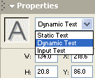

3.  Once that’s done, give each textbox a Variable name. In this example, I’m using “addition”, “subtraction”, “multiplication”, and “division” as the Variable names.

    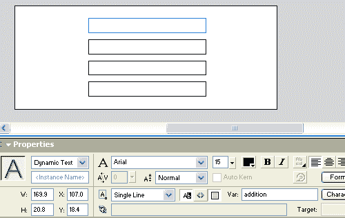

    **提示:**开发的时候，要时刻给对象(文本框、组件、电影剪辑等。)唯一的名称。否则，您将面临混淆 Flash 的风险。这就像有两个兄弟分别叫约翰和约翰，而你的妈妈说，“让约翰洗车，让约翰打扫浴室。”通过给每个对象一个唯一的名称来避免混淆。

    我们将使用这些变量来告诉 Flash 显示我们的计算结果。

4.  In the timeline, create a new layer. Name the layer containing the textboxes “Calculations”, and name the new layer “Actions”. We do this so that we can easily see which layer contains the code, and which layer contains the user interface.

    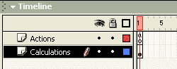

5.  Now, let’s apply the calculations. Select the first frame in your Actions layer. In order to give ourselves freedom to type what we wish, we need to set the Actions panel to Expert Mode. Choose Expert Mode from the Actions panel pop-up menu (at the upper right of the panel).

    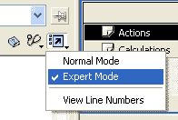

6.  Now, input the following code:

    ```
    addition = 1+1; 

    subtraction = 5-2; 

    multiplication = 10*2; 

    division = 100/5;
    ```

    现在，解释一下这段代码的作用和原因。共有四行，每一行的开头都是一个变量引用。还记得我们给四个文本框的变量名吗？第一行以“加法”开头。这引用了我们的“添加”文本框。然后我们给出一个“加法”等于什么的表达式。“加法”文本框将显示一加一的结果，减法文本框将显示五减二的结果，以此类推。

发布您的电影以查看结果！

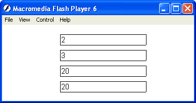

如果你真的迷路了，[这里有一个样本 FLA](https://www.sitepoint.com/examples/flash/basic_calculations.fla) 有所有的细节。

##### 高等数学

既然你已经理解了如何进行基本的计算，把它们混合起来只是一个代数问题。同样的数学规则也适用。

```
sample = 10*2-6/3;
```

上面的例子会给你一个 18 的结果。

和代数一样，乘法和除法是在加法和减法之前计算的，括号的使用表明括号中的任何内容都将首先计算。使用括号可以产生不同的结果。例如，10*(3-2)将得到 10 的结果，而 10*3-2 将得到 28 的结果。

Flash 中的 ActionScript 如下所示:

```
sample = 10(3-2);
```

***计算用户输入的数据***

计算静态数据是有帮助的，但是计算用户输入的数据是强大的和可销售的。可能性是无限的，但在这里，我们将涵盖基本的数据输入和计算。我们的示例将获取用户输入的两个数字。单击一个按钮，Flash 电影将显示总和，以及数字的乘积。

1.  Create a new movie.
2.  Create four textboxes in the first frame of the movie, and arrange them vertically.
3.  In the Properties panel, set the textboxes to be left-aligned. The top two textboxes should be Input text, while the bottom two should be Dynamic text.
4.  Limit the textboxes to numbers only. To do this, just select a textbox and click the Character… button in the Properties panel. This will bring up the Character Options box. From there, select “Only”, “Numerals (0-9)”, and click Done.

    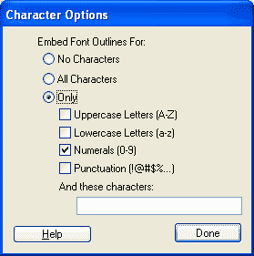

5.  I’ve added a line in the middle of my textboxes, to give them some sex appeal!

    

6.  Next, add some static text to the left of the text boxes. Starting from the top to the bottom:
    *   第一名
    *   第二个
    *   数字 1 和数字 2 之和
    *   数字 1 和数字 2 的乘积

    这样做是为了给最终用户——我们——清楚地标注一切！

    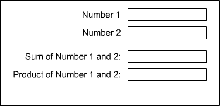

7.  The textboxes need to be given Variable names, so that Flash knows what we’re talking about when we refer to them. The Variable for a textbox is defined in the Properties panel. Starting from the top to the bottom, name the textboxes accordingly:
    *   第一
    *   第二点
    *   结果 _ 总和
    *   结果 _ 产品

    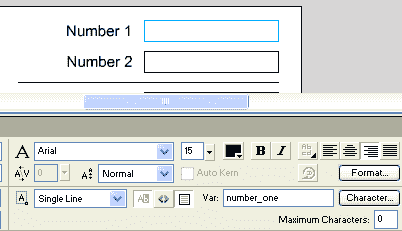

8.  Now, we need to add our button used to execute our calculations. In the Component panel, select Flash UI Components.
9.  Drag and drop the PushButton component into the scene.

    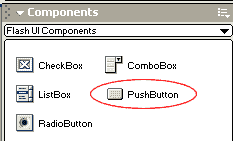

10.  Select the PushButton component you’ve just dragged into your scene. In the Properties panel, label the component “Calculate” and set the Click Handler to “onCalculate”. This is the button we will use to calculate the user’s data.

    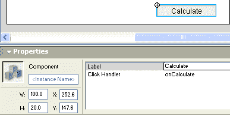

11.  As a final measure, I have given the “Number 1” and “Number 2” textboxes a value of zero. When you’re done, you’re scene should look something like the image below.

    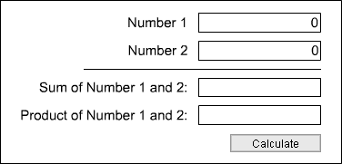

    好的。我们已经设置好了场景，所以现在，是时候输入使这部电影成功的代码了。

***代号***

1.  Name the current layer in the movie “content”. Add a new layer to the movie, and call it “actions”.

    

2.  Select the first frame of the “actions” layer. In the Actions panel, add the following code:

    ```
    function onCalculate() {   

      one = Number(number_one);   

      two = Number(number_two);   

      result_sum = one + two;   

      result_product = one * two;   

    }
    ```

    这是将使这部电影发挥其魔力的代码！让我们看看这段代码做了什么，为什么。

    ```
    function onCalculate() {
    ```

    这第一行开始了电影中的一个新功能。记住，我们给了按钮组件一个“onCalculate”的点击处理程序。单击该按钮时，它将执行该函数中的代码。

    ```
    one = Number(number_one);   

    two = Number(number_two);
    ```

    这个代码有两个目的。第一种是给正在计算的数据取较短的变量名。我们现在可以只使用“一”，而不是在整个代码中拼写“数字一”。

    这与第二个目的结合起来更有意义:将这些变量视为数字。这是通过 Number()完成的，它告诉 Flash 我们将括号中的值视为数字。如果我们没有，当我们计算 1 加 1 时，我们会得到 11。或者，如果我们计算 1 加 2，我们会得到 12。相反，对于数字()，当我们计算 1 加 1 时，我们将得到 2。

    ```
    result_sum = one + two;   

    result_product = one * two;   

    }
    ```

    还记得我们给底部两个文本框的变量名吗？这段代码将我们的计算结果放在这些文本框中。当执行这段代码时,“result_sum”文本框将显示数字 1 和数字 2 相加的结果。“结果 _ 产品”文本框将显示它们相乘的结果。

就是这样！发布您的电影，在前两个文本框中键入一些数字，然后点击计算。

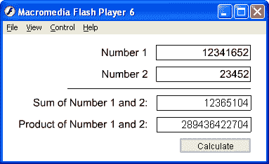

同样，如果您迷路了，[下载示例 FLA](https://www.sitepoint.com/examples/flash/calculateuserdata.fla) 。

##### 最后的想法

有你的快速和肮脏的运行下来的基本数学在闪光。没有一个计算是 Flash 不能处理的。本教程只是触及了表面，但我希望它能让你思考 Flash 数学。有关更多信息，请尝试:

*   [Flash Kit 的数学&物理论坛](http://flashkit.com/board/forumdisplay.php?forumid=63)
*   [基础代数课](http://www.algebrahelp.com/lessons/equationbasics/pg2.htm)

## 分享这篇文章