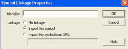
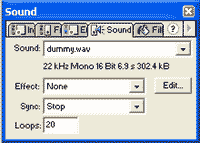

# Flash 脚本–变焦镜头

> 原文：<https://www.sitepoint.com/flash-script-zoom-lens/>

****1。**打开一部新电影，宽 400，高 400，帧率 40/s**

**2。**将您选择的长度和宽度与相框相同的图片导入 Flash。

**3。**将图片转换成电影剪辑。

**4。**命名当前图层图像 80%。

**5。**将电影剪辑准确对齐舞台中央。

**6。**使用变形工具将尺寸缩放至 80%。


**7。**新建一个图层，命名为“镜头”。

**8。**在新图层中创建一个圆。

**9。**将圆形转换成电影剪辑，给它一个实例名“magnify”。



10。转到“放大”的时间轴。



**11。**新建一个图层，将图片电影拖到时间轴上。把它放在舞台中央。

**12。**将新图层拖到旧图层下面，如下图。


13。把最上面一层做成蒙版。

**14。**接下来，转到主时间线，创建如下所示的三个关键帧。


15。在第一个关键帧中，插入动作:

```
startDrag ("/magnify", true); 
```

16。在第二个关键帧中，使用动作:

```
xx = getProperty("/magnify", _x); 

yy = getProperty("/magnify", _y); 

setProperty ("/magnify/bigpic", _x, 200-xx); 

setProperty ("/magnify/bigpic", _y, 200-yy);
```

**17。**在第三个关键帧中，插入动作:

```
gotoAndPlay (1); 
```

18。播放电影！如果你已经按照这些步骤，你会得到上面显示的结果！

**19。**通过给出动作`Mouse.hide()`你可以隐藏鼠标光标。

## 分享这篇文章