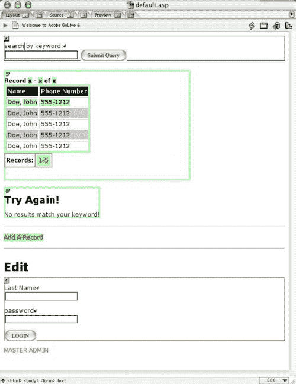
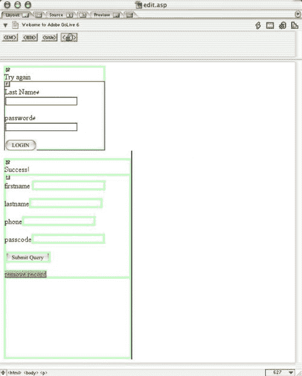
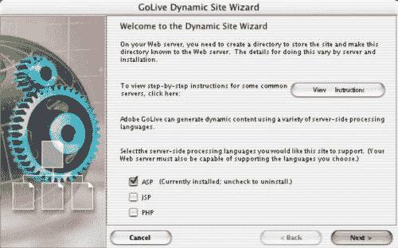
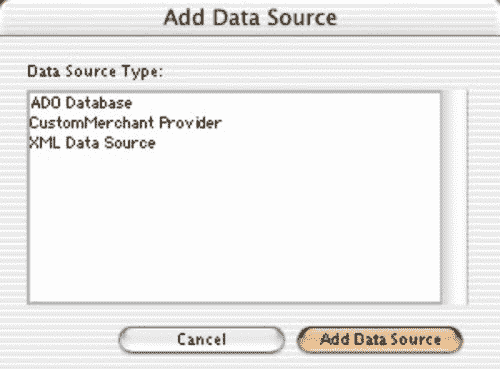

# GoLive 动态数据入门

> 原文：<https://www.sitepoint.com/started-dynamic-data-golive/>

网站设计者和管理者发现，他们不再需要成为专业的程序员来获得幕后数据库的好处。在 Adobe GoLive 6.0 中，这是一件简单的事情:

*   运行动态数据向导，
*   使用一些拖放命令，然后
*   了解一些基础知识

…您可以开始使用动态数据了。

本教程将向您展示如何使用 Adobe GoLive 6.0 和一个简单的 Microsoft Access 数据库来实现这一点。

一旦你理解了这个过程，你会发现有用和有趣的方法来修改它。我们已经使用了一个类似的数据库来驱动一所大学的校友目录。个人可以登录并动态更新学校为他们存档的信息。类似地，任何拥有一组已知客户的企业都可以让个人查看某些数据并保持更新。例如，当您考虑到大学的管理人员不再需要手动输入校友的地址或电话号码变更时，掌握这项技术所需的时间可以忽略不计。

##### 第一步。涵盖基础知识

首先:我假设你有一个 ISP(互联网服务提供商)的托管账户，或者可以访问发布网站的服务器空间。我还假设您对 GoLive 软件有基本的了解，并计划使用 GoLive 6.0。第三，对数据库如何工作的初级理解是有帮助的。第四，在:[http://www.adobe.com/products/golive/main.html](http://www.adobe.com/products/golive/main.html)更新到 GoLive 6.0.1。非常值得！

要回答的第一个问题是:您的 Web 主机允许在其服务器上使用 ASP、PHP 和/或 MySQL 数据吗？主要的互联网服务提供商经常这样做。与他们一起检查，因为如果他们这样做，GoLive 将自动确认您需要的一切都已就绪。这意味着您可以跳过 GoLive 6.0 手册“在 Web 服务器上准备站点”中的整个过程如果您的 ISP 或服务器还没有准备好，您需要根据手册设置自己的服务器，或者找到一个可以容纳您的数据库的服务器。此外，GoLive 包括预配置的服务器环境，您可以在与 GoLive 客户端相同的系统上运行这些环境。有关安装预配置服务器的更多信息，请参见 Adobe Web Workgroup Server CD。

首先，创建一个空白的 GoLive 站点。不要担心它会是什么样子。此时，我使用 GoLive 设计图表绘制了我的站点的页面流，但是您需要做的只是创建一两个页面来运行数据库，正如我们将在步骤 2 中讨论的那样。

如果您愿意，您可以下载一个 ZIP 文件，其中包含使用 ASP 和 PHP 的示例站点。点击下载示例网站[。](http://www.webmasterbase.com/examples/golivedynamic/samplesites.zip)

##### 第二步。准备起飞

***数据库***

现在你需要一个数据库。它将作为您在 GoLive 中的“数据源”,我们将在步骤 4 中解释这是什么。我们已经创建了一个简单的 Microsoft Access 数据库，并将其包含在我们的 ASP 示例站点中，当然，您也可以自己创建一个。无论您选择哪种数据库工具(Access 只是一个例子)，您都需要根据您想要存储和/或呈现给查看者的信息来了解该文件将包含哪些数据。

我们的示例数据库有一个包含五个字段的表:一个为每条记录提供唯一标识符的 AutoID 字段，以及四个用户定义的字段:

*   西方人名的第一个字
*   姓
*   电话
*   密码

数据库也应该有密码保护(尽管我们没有对我们的示例进行密码保护，所以您可以将它作为一个起点)，这可以在 Access 中通过选择`Tools > Security > Set Database Password`来实现。

当您的数据库有这些或类似的元素时，将其放在一边。

***GoLive 中的占位符页面***

现在，回到你的 GoLive 网站。您需要模拟两个带有占位符内容的主页面。此时不要担心动态内容，只需关注视觉布局。第一页是一个搜索页，人们可以在这里输入关键字并搜索您的目录。把这个页面命名为 index.html 或者其他你喜欢的名字。该页面应至少包含以下元素:

*   带有文本字段和提交按钮的搜索表单
*   表以逐行格式显示搜索结果
*   使用姓氏和密码登录以编辑记录的表单



第二个页面是编辑页面，登录的个人可以在其中更新他们的记录。称这一页为 edit.html 或任何其他适当的名字。如果您愿意，您可以使用我们的示例页面，或者至少查看它们以了解您需要的页面元素。



##### 第三步。充满活力

现在，您将使用 GoLive 中的动态站点向导来使您的站点动态化。



从站点菜单中，选择`Settings > Dynamic Content > Dynamic Site Wizard`。设置服务器语言(本例中为 ASP，但您可能选择了 PHP 或 JSP)。您的服务器连接很可能是 FTP(文件传输协议),但也可能是 WebDav，或者如果您运行 Web 服务器(包括 GoLive 6 附带的服务器),则站点在本地提供服务。

如果您将使用 FTP，并且您的设置尚未建立，请使用 ISP 提供的信息在“FTP”弹出式菜单的“编辑服务器”下创建一个连接(如果您没有，请询问他们)。接下来，向导将提示您输入站点的 URL 根目录。这只是该测试站点主页的地址；例如 http://www.mysite.com/test.

现在向导将询问您需要什么安全选项。GoLive 会自动识别您当前的 IP 地址，并允许该地址不受限制地访问网站文件。但是，如果您使用的是拨号调制解调器，每次拨入时，您的 IP 地址都是不同的。在这种情况下，选择“允许任何人”，这将确保您现在可以访问和编辑该站点。当您准备好启动时，可以稍后调整安全选项。

GoLive 利用 IP 授权来防止未经授权的个人篡改您的文件。您会在 config 文件夹中找到一个文件，您可以在其中通过列出受信任的 IP 地址来“包括朋友”。站点动态化后，您可以随时在文本编辑器中打开此文件(如`config > include > friends.asp`或类似文件),查看添加其他友好 IP 地址和完全禁用 IP 授权的说明。

暂时跳过向导关于数据源的最后一个问题——我们稍后会谈到这个问题。在向导的最后一个屏幕上输入 Finish，你猜怎么着…你的站点现在是动态的了！

此时，GoLive 已经自动上传了测试文件并执行了服务器检查。如果 GoLive 检测到任何问题，它会通知您，您可以返回到流程中需要进行更正的点。

##### 第四步。什么是数据源？

如果您第一次使用动态数据，您可能想知道“数据库”、“数据源”和“内容源”之间的区别。它们不一定可以互换，所以简单解释一下会有帮助。

**数据库:**这个文件包含组织到一个或多个表格中的数据。我们的示例是一个 Microsoft Access 文件(。mdb)，但您可能选择了使用 Microsoft SQL Server (ASP)、Oracle 8 (ASP)、MySQL 3.23 (PHP 和 JSP)或 Oracle 9 (JSP)。

**数据源:**这个文件指向一个数据库，并告诉你的站点如何访问它。您可以在网站设置的动态内容区域创建数据源。然后，GoLive 将数据源文件放在动态站点的`config > datasources`文件夹中。

如果您的 Microsoft Access 数据库没有密码保护，如本例所示，数据库本身就充当数据源，您不必创建单独的数据源。在现实生活中，您更可能想要用密码保护您的数据库，所以我们将在下面为它创建一个单独的数据源。

**内容源:**这是从动态页面到数据库的查询，以便为该页面提供内容。页面可以有多个内容源，为该页面提供不同的内容。例如，您将创建返回所有记录的内容源(查询)，或者只返回符合特定条件的记录，比如只返回那些姓氏以“T”开头的记录。

添加内容源意味着您在告诉 GoLive:“请在数据库‘y’的表‘x’中查找，并取出所有符合我的过滤要求的记录，这样我就可以将这些数据作为该页面的内容。”要添加内容源，只需从页面头部的动态内容面板中拖放一个内容源对象。

***确定你的数据源***

现在您需要告诉 GoLive 您的站点将使用什么数据源。如果你有一个 Access 数据库，你可以把你的。mdb 文件并将其移动到`config > datasources`文件夹中，就大功告成了。如果你的。mdb 文件是受密码保护的，但是，您需要使用下面的过程。

如果您使用受密码保护的 Access 数据库或 MySQL，创建数据源并不难。只需进入站点菜单，选择`Settings > Dynamic Content`。在数据源区域中，单击新建。然后选择您将使用的数据源类型(例如 ADO 数据库、MySQL 数据库等。).在数据源编辑器中，首先为数据源命名。数据源不需要与数据库文件同名，但是为了避免混淆，用相同的方式命名可能更容易。GoLive 将为您提供的名称添加正确的文件扩展名。

接下来，给出数据库在 Web 服务器上的 URL，并告诉它数据库本身的名称。您还需要告诉它访问数据库所需的用户名和密码。就是这样！如果你在这里有任何问题，GoLive 6.0 手册第 382-385 页可以解答。



##### 第五步。搜索，你会发现

您已经创建了您的数据库，使您的网站动态化，并将两者链接在一起。您已经完成了基础工作，所以是时候享受一些乐趣了！

现在，您将创建一个本质上是动态搜索的表单，它可以提取您的数据并基于关键字搜索显示出来。即使只做一次，也会为你的网站开辟一个新的领域——这意味着你知道一些关于网站表单的很酷的技巧的基础，并且可以用有趣的新方式显示用户数据。

***动态搜索页面***

通过打开您在步骤 1 中模拟的静态搜索页面，使您的搜索页面动态化。打开动态绑定面板，选择所需的服务器脚本语言(ASP、PHP、JSP ),然后单击转换页面。GoLive 会自动重命名页面的扩展名以匹配您的选择。

在这里，您可以添加一个或多个内容源(查询，还记得吗？)到头段。要获取内容，请将内容源对象从动态内容面板拖到搜索页面的 head 部分。按如下方式填写检查器字段:

*   **描述:**“Search _ Results”(随便你怎么命名，但这个内容源会保存我们的搜索结果)
*   **类型:** ADO 数据库查询(如果使用 PHP/MySQL，则为 MySQL 数据库查询)
*   **从弹出菜单中选择数据库名称**(adobe，如果使用示例数据库)
*   **从弹出菜单中选择表格名称**(如果使用示例数据库，则为 golive_test)

***过滤搜索结果***

此时，Search_Results 内容源将从我们指定的数据库表中返回所有记录。但是…如果我们不想要所有的记录呢？您现在可以过滤 Search_Results 内容源，以便它只返回基于用户搜索请求的记录。GoLive 通过 Content Source Inspector 提供了一种非常好的可视化方式来实现这一点。要开始使用:

1.  Link the search Form Action on your Search page to the file itself (index.asp or the name you gave it)
2.  Make sure the Form Method is "Get", *not* "Post"
3.  Rename your text field on your search form to "lname" (or, the same name as the last name field of the sample database)
4.  Select "lname" from the Field Name list in the Content Source Inspector
5.  Choose Match request parameter ‘lname’ from the Match Pattern popup menu to the right in the Content Source Inspector
6.  Bind the table you created to display search results to the Search_Results Content Source using the Dynamic Bindings palette by:
7.  Selecting the table
8.  Clicking Replace Rows in the Dynamic Bindings palette
9.  Choosing Search_Results as the Content Source
10.  Setting it to display 5 records per page (this is for Block Navigation; more on this later)
11.  使用动态绑定选项板将表中第一行的字段绑定到数据库中相应的字段。你只需要担心第一排！表格的其余部分将自动填充，因为您在动态绑定选项板中选择了“替换行”。您将通过选择模拟内容名字文本并将其绑定到动态绑定面板中的名字字段来绑定这些字段。对表的第一行中的姓氏和电话号码文本执行同样的操作，将它们绑定到数据库中各自的字段。

我们刚才所做的是告诉我们的内容源返回所有记录，这些记录的姓氏字段与用户在搜索表单文本字段中输入的内容完全匹配。

##### 第六步。微调搜索

您的动态搜索表单正在工作，但是现在您需要为用户可能尝试使用它的所有方式做好计划。例如，如果用户直接调用页面，或者不输入任何搜索条件，该怎么办？此时，您的搜索页面正在寻找一个“请求参数”，它必须与“lname”完全匹配。GoLive 为我们提供了一个很好的起点，接下来的几个额外步骤将涵盖 contingenes:

1.  Rename your text field on your search form to "keyword".
2.  Change the Table pop up menu to Custom SQL in the Content Source Inspector
3.  Select the text in the SQL edit box and delete it.
4.  Type or paste the text below into the SQL box:

    对于 ASP:

    ```
     select * from golive_test where lname like    

    '%{Request.QueryString("keyword")}%' or fname like    

    '%{Request.QueryString("keyword")}%' or phone like    

    '%{Request.QueryString("keyword")}%'
    ```

    对于 PHP:

    ```
     select * from golive_test where lname like    

    '%{@$GLOBALS["keyword"]}%' or fname like '%{@$GLOBALS["keyword"]}%'    

    or phone like '%{@$GLOBALS["keyword"]}%'
    ```

    这段源代码将 Search_Results 内容源转换成一个实用的搜索引擎。上面的代码基本上是这样说的:“查看用户在搜索字段中键入的内容，看看它是否与所有记录的任何字段中的任何内容相匹配。同时，返回匹配的记录，并将其作为该页面的内容。”这就是我们想要的！如果在搜索框中没有键入任何内容，或者直接调用页面而没有前一页，则返回所有记录。在搜索框中键入的任何内容都将与数据库字段相匹配。

请注意，“`select * from golive_test`”语句意味着选择名为“golive_test”的数据库中的所有内容。“where”语句让您能够做出一些限定。“like”一词指定了部分匹配，因此不需要完全匹配。“%”符号是一个通配符，告诉它匹配任意数量的字符。因为表达式的两端都有“%”符号，所以如果在搜索框中没有键入任何内容，或者如果首先调用页面而没有前一页，则搜索将匹配每条记录。这有点像问“显示包含任意数量字符的记录+用户键入的内容+任意数量的字符”。对我来说那听起来像数学！如果用户没有输入任何内容，或者页面被首先调用，那么单词 math 将会是:Records = '任意数量的字符'+ 0 +'任意数量的字符'。嘿……每张唱片都符合那个条件！

***屏蔽导航***

现在你想添加一些块导航，这是一个很酷的方式向用户提供他们的搜索结果。块导航允许您指定每页要显示多少条记录，并包括允许用户轻松浏览多页结果的链接。

首先向页面标题添加另一个空白内容源。按如下方式填写字段:

1.  **Description:** Block (again, name this anything you want, but this Content Source will provide our Block Navigation)
2.  **Type:** Navigation Block View
3.  **Content Source:** "Search_Results" (or whatever you named that first Content Source.)
4.  Create a regular 1 row x 2 cell table underneath the search results table – in the first cell type "Records:"
5.  Drag a Repeat Cells object from the Dynamic Content palette into the second cell of the 1×2 table
6.  Delete all but one cell of the Repeat Cells table and type "x-y" in that cell
7.  Select the ‘x’ and bind it to the "Block" Content Source with the filed set to "First"
8.  Select the ‘y’ and bind it to the "Block" Content Source with the filed set to "Last"
9.  Select the whole ‘x-y’ text and link it to your Search page
10.  在动态绑定选项板中，单击“将链接目标绑定到”并将字段设置为“Link_URL”

你现在拥有的是一个寻找搜索和进行区块导航的页面。当有人键入关键字“John”时，您指定的字段中包含“John”的所有记录都会显示出来。它还将使用“Block”内容源来提供方便的链接，允许用户在多个结果页面之间切换。这是“记录:1-5 6-10 11-13 等”形式的块导航非常酷！你认为你不会编程！

**提示:**记住将搜索表单的发布方法设置为“Get ”,因为“Post”与 Blockavigation 不兼容。

此时，您可以使用 GoLive 预览选项卡来查看结果，但请注意，您的页面不是实时的，因此您实际上只是在预览。如果在尝试显示自定义搜索时收到错误消息，请尝试在浏览器中预览它。此外，GoLive 6.0.1 可以在预览模式下正确显示这些自定义代码，因此请确保您已经完成了升级。

##### 第七步。允许记录所有权

在搜索页面上你需要做的最后一件事是在底部创建一个登录区域。用户可以在这里输入他们的姓氏和密码，以便进入编辑页面。在这里，他们可以更新您将绑定到该页面上的字段的信息。他们的更改将动态更新数据库。

在编辑页面(edit.html)上，过程很简单:

1.  **Create a form** that displays the text fields you want users to update, label the text fields accordingly.
2.  **Bind the form fields** to their corresponding database fields using the Dynamic Bindings palette.
3.  **Copy and paste** the Search_Results Content Source from the Search page to the head section of the Edit page
4.  **Rename the Edit page** Content Source to Matched_Record
5.  **Set the lname field** to "Match request parameter ‘lname’" in the Filter Records section of the Inspector
6.  **Set the password field** to "Match request parameter ‘password’" in the Filter Records section of the Inspector
7.  **Add a Submit Action button** from the Dynamic Content palette
8.  **Make sure the Action is set** to Update Record in the Dynamic Bindings palette
9.  **将内容源**设置为 Matched_Record

**提示:**此时，您还可以创建一个通用的成功和失败页面，显示类似“操作成功”和“操作失败！”然后，您可以在动态绑定选项板中设置“成功时重定向到:”和“失败时重定向到:”选项，以链接到适当的页面。

现在您已经创建了一个内容源，它只返回与姓氏和密码完全匹配的记录。你猜怎么着？这意味着只有一个记录将被返回，并且只有当用户输入准确的姓氏和匹配的密码。您刚刚实现了一种简单的记录所有权形式！

如果有人输入不正确的名称和密码怎么办？如果没有找到匹配的记录，只需将编辑页面设置为“隐藏内容”，如下所示:

1.  Drag and drop a Hide Content object from the Dynamic Content palette onto the Edit page
2.  Cut and paste your edit form into the Hide Content area next to the word "Content" (you can then delete the word ‘Content’)
3.  Select the Hide Content object
4.  Click Show/Hide in the Dynamic Bindings palette and select Hide
5.  Choose "If no records" from the pop up menu
6.  选择匹配记录作为内容源

你所做的就是说:“请只在没有匹配的时候隐藏这个表单；即用户输入了错误的名称和密码。”

此外，因为我们不希望他们在登录失败时看到空白页面:

1.  Drag and drop a Hide Content object from the Dynamic Content palette onto the Edit page
2.  Cut and paste your login form from the Search page into the Hide Content area next to the word "Content" (you can then delete the word ‘Content’)
3.  Type "Try Again!" above the login form
4.  Select the Hide Content object
5.  Click Show/Hide in the Dynamic Bindings palette and select Show
6.  Choose "If no records" from the pop up menu
7.  选择匹配记录作为内容源

这最后一步使用户能够再次尝试。

我还在搜索页面上使用这种技术来显示和隐藏内容，以防搜索没有返回记录。示例搜索页面将向您展示如何做到这一点。

本教程展示的内容足以让您理解示例文件中实现的其他特性。如果您浏览这些内容，您可以看到以下示例:

*   删除记录
*   确认记录删除
*   通过生成空白表单添加记录
*   为所有记录的管理编辑添加主管理页面

##### 把所有的放在一起

今天的网络发布工具使得相对非技术型的设计人员能够构建和部署数据库驱动的网站。如上所述，Adobe GoLive 调色板和向导可以让您的网站在功能和效率上有一个显著的飞跃，而不需要太多的编程专业知识。

当您尝试基本级别的动态数据时，您将很快开始设计使您的站点更加精简和高效的方法。从那里，天空是极限！

感谢 WDTP 的大卫·理查兹对本教程的帮助。

## 分享这篇文章