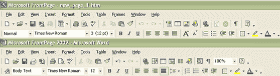
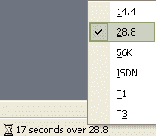
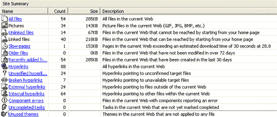

# 审阅 Microsoft FrontPage 2002

> 原文：<https://www.sitepoint.com/microsoft-frontpage-2002/>

“没有真正的专业人士会使用 FrontPage。”

这是许多“互联网专业人士”的共同信念，但这是真的吗？

许多 FrontPage 用户面临着一种压倒性的感觉，即如果他们使用 FrontPage，他们就不能成为“真正的专业人士”——我一直认为这种态度很可笑。“专业人士”可以将 FrontPage 作为他或她的武器库中的众多武器之一。

不过，不要搞错了:FrontPage 对新手来说是一个很好的应用程序，因为它是模仿微软的 Word 设计的，很容易使用，也是很多人都很熟悉的一个程序。所以，当你打开 FrontPage 时，你会想“嘿，这就像一个 Word 文档！这个我能行！”

Word 和 FrontPage 的控件惊人的相似。这里有一个对比两者的截图:FrontPage 在顶部，Word 在底部。

就像照镜子一样！

FrontPage 通常被称为 WYSIWYG(所见即所得)编辑器。这是一个可靠的工具，有大量易于使用的选项和页面元素，让您可以快速创建一个体面的网站，最少的麻烦。当然，如果你没有任何设计意识，你最终会得到一个丑陋的页面——但这适用于你能买到的每一个设计软件。但是 FrontPage 也提供了其他功能，包括非常有用的网站管理工具。我们稍后会谈到它们。

##### 优势

首先，我想谈谈我在 FrontPage 中看到的一些小而简洁的东西。

我真的很喜欢当你打开多个文档时出现的标签。在我用过的大多数其他编辑器中，每个文档都会打开一个新窗口，每个窗口都会在任务栏上占据一点额外的空间。但是 FrontPage 的单个标签占据了相同数量的任务栏空间，不管你打开了多少文档。另外，这使得在文档之间切换变得非常容易。看一看:

另一个很大的优势是 FrontPage 允许您从实际的编辑器跳转到 HTML 代码(您可以手动编辑)，并预览页面在线时的样子。你不必打开一个新的浏览器窗口来预览页面，除非你选择这样做。这一切都很方便。为了让您了解在视图之间切换有多容易，下面是工具栏:

负载估算工具只是 FrontPage 中包含的又一个小而酷的功能。它估计在特定连接上加载一个页面需要多长时间:当您选择不同的连接速度时，它将根据您的选择调整估计的下载时间:

##### 缺点是

FrontPage 的缺点是什么？它产生的代码并不漂亮，也不能通过 HTML/XHTML 的标准。可以想象，这是大多数人对 FrontPage 的主要不满。然而，这段代码目前在大多数主流和次要浏览器上都运行良好。

如果您碰巧编写了自己的代码，可以关闭代码编辑，这样 FrontPage 就不会碰到它。如果你想变得非常专业(我是说真的)，你甚至可以设置自己的编码配置文件——front page 会按照你告诉它的方式对网页进行编码。

##### 额外的好处:网站管理

FrontPage 包含了丰富的网站管理工具。这些帮助你计划和开发你的网站的结构，从导航和子目录，到链接和架构。您可以映射现有网站或从头创建一个网站。

您甚至可以配置 FrontPage 来显示网站流量报告。讨厌 FTP？FrontPage 可以设置为在您更改网页后自动更新网页。

我真的很喜欢报告功能。

它为你提供了大量有价值的信息。以下是几个报告示例(也在截图中):

*   **所有文件:**显示服务器上所有文件的列表。
*   **图片:**显示您服务器上的所有图像文件。
*   **未链接的文件:**显示存在于您的服务器上的所有文件，这些文件没有从您的主页链接到。
*   **链接文件:**显示可以从您的主页访问的服务器上的文件。
*   **慢速网页:**服务器上的网页在 28.8 连接下需要 30 秒以上才能加载。
*   **旧文件:**显示服务器上超过 72 天未被修改的文件。
*   **最近添加的文件:**显示服务器上最近 30 天内创建的文件。
*   **超链接:**显示您网站上的所有超链接。

…还有其他几个！

超链接报告特别有用。它们允许你检查你网站上的所有链接，这样你就可以很容易地找到并修复损坏的链接。这包括图像链接以及常规的 Web 链接(URL)。

**评级:** 4/5

总结一下:如果你愿意，可以说我不专业，但我觉得 FrontPage 很有用(尤其是它的站点管理工具)。我承认它产生的代码不符合标准，这一挫折反映在我的最终评级中。但我也认为，就价格而言，FrontPage 的购买者收到了一个坚实的包裹:的确，FrontPage 可以被视为穷人的 Dreamweaver。它对初学者来说很棒，而且它有一些工具和额外的特性，更有经验，但有成本意识的设计师也可以使用。如果你是一个有经验的 Web 开发人员，FrontPage 肯定不会把它作为你的“主程序”——但它也不应该是。它只是作为您开发软件武库中的又一件武器。

标题:微软 FrontPage 2002

**发布者:** [微软](http://www.microsoft.com/)

[在 Amazon.com](http://www.amazon.com/exec/obidos/ASIN/B00005AFI2/webmasterresou05)花 146.99 美元购买

## 分享这篇文章