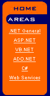

# 使用 ASP.NET 中继器控制

> 原文：<https://www.sitepoint.com/asp-net-repeater-control/>

这篇文章写于 2003 年，至今仍是我们最受欢迎的帖子之一。如果你很想了解 ASP.NET，你可能会对这篇最近关于 ASP.NET 和 MVC 的文章很感兴趣。

当我第一次学习使用。NET，我阅读了 ASP.NET 和 ASP。有一句话引起了我的注意:“在 ASP.NET，你可以用 Response。写，但不推荐”。

我心想“不推荐吗？我将如何写出我的 HTML？我将如何遍历数据集并构建表？”我见过 datagrid，它非常适合显示原始数据表，但是我问自己，如何才能只写出一列呢？如果数据和 HTML 混合在一起会怎么样？

我在我新喜欢的 ASP.NET 服务器控件中找到了答案:Repeater。在本文中，我将向您展示我是如何使用它为自己的站点创建左侧菜单的，如下所示:



我将菜单类别存储在 SQL Server 中一个名为“`Sub_Category`”的表中，这样，如果我需要添加一个，我只需将它添加到表中，它就会出现在菜单上。表格中有两个字段:`Sub_Category_ID`和`Sub_Category_Text`。

## 步骤 1 —创建页面并插入`Repeater`控件

`Repeater`控件允许您创建模板来定义其内容的布局。这些模板是:

*   `**ItemTemplate**` —将此模板用于每行数据呈现一次的元素。
*   `**AlternatingItemTemplate**` —将此模板用于每隔一行数据呈现的元素。例如，这允许您替换背景颜色。
*   `**HeaderTemplate**` —将此模板用于您希望在`ItemTemplate`部分之前呈现一次的元素。
*   `**FooterTemplate**` —将此模板用于您希望在`ItemTemplate`部分之后呈现一次的元素。
*   `**SeperatorTemplate**` —使用此模板在每行之间呈现元素，如换行符。

下面是包含`Repeater`的 Web 表单的一部分(subcategories.aspx):

```
....
<asp:Repeater ID="catlist" runat="server">
<HeaderTemplate>
<tr>
<td class="imgspace">

</td>
</tr>
</HeaderTemplate>
<ItemTemplate>
<tr>
<td>
<div align=center>
<asp:HyperLink class="text"
NavigateUrl="<%# "mainframeset.aspx?CatType=" +
DataBinder.Eval(Container.DataItem,"Sub_Category_ID")%>"
Text="<%#DataBinder.Eval(Container.DataItem, "Sub_Category_Text")%>"
runat="server" target="mainFrame" ID="Hyperlink1" NAME="Hyperlink1"/>
<br></div>
</td>
</tr>
</ItemTemplate>
<FooterTemplate>
<tr>
<td>
</td>
</tr>
</FooterTemplate>
</asp:Repeater>
....
```

`Repeater`的名称为`catlist`。它使用`HeaderTemplate`打印出`Areas`图像。然后，它使用`ItemTemplate`来显示一个`Hyperlink`控件，其中有我们的数据。我们将在第二步回到这个问题。

`FooterTemplate`不是必需的，但是我把它放在这里是为了保持一致性。

## 第二步——获取数据

现在让我们看看数据检索。下面是代码隐藏文件中的`Page_Load`事件。

```
private void Page_Load(object sender, System.EventArgs e)
{
SqlConnection conDotNet = new SqlConnection
"Server=xxxxxxx;UID=xxxx;PWD=xxxxx;Database=DotNetGenius");
string sSQL = "Select sub_category_id, sub_category_text
from Sub_Category";
SqlCommand cmd = new SqlCommand(sSQL, conDotNet);
conDotNet.Open();
SqlDataReader dtrCat = cmd.ExecuteReader();
catlist.DataSource = dtrCat;
catlist.DataBind();
}
```

前五行打开一个数据库连接并检索`Sub_Category`表的内容。最后两行将我们的`Repeater`控件绑定到`DataReader`。现在，让我们再来看看`ItemTemplate`部分:

```
<ItemTemplate>
<tr> <td> <div align=center>
<asp:HyperLink class="text"
NavigateUrl="<%# "mainframeset.aspx?CatType=" +
DataBinder.Eval(Container.DataItem,"Sub_Category_ID")%>"
Text="<%#DataBinder.Eval(Container.DataItem, "Sub_Category_Text")%>"
runat="server" target="mainFrame" ID="Hyperlink1" NAME="Hyperlink1"/>
<br></div></td></tr>
</ItemTemplate>
```

一旦调用了`Repeater`控件的`DataBind`方法，ASP.NET 将遍历`DataReader`并用我们指定的数据填充`Repeater`。`Databinder.Eval`方法在运行时使用反射来解析和评估针对对象的数据绑定表达式，在本例中，对象是我们的`Repeater`。所以这行代码:

```
NavigateUrl="<%# "mainframeset.aspx?CatType=" +
DataBinder.Eval(Container.DataItem,"Sub_Category_ID")%>"
```

将呈现`DataReader`中每一行的`"Sub_Category_ID"`字段的内容。

如果你花很多时间和 spend 在一起，你肯定会经常使用这个控件。希望你觉得方便！

如果你喜欢读这篇文章，你会爱上[可学的](https://learnable.com/)；向大师们学习新技能和技术的地方。会员可以即时访问 SitePoint 的所有电子书和互动在线课程，比如使用 ASP.NET 的[入门网站开发。](https://learnable.com/courses/introductory-web-development-using-asp-net-125) 

## 分享这篇文章