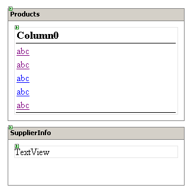

# 在路上。NET 移动控件

> 原文：<https://www.sitepoint.com/road-net-mobile-controls/>

***感兴趣。网？不要错过[网站。NET 功能指南](https://www.sitepoint.com/using-special-characters-online/) —这是一个极好的资源！***

场景是这样的:你的老板想在旅途中获取信息，但他不喜欢带着笔记本电脑。他厌倦了带着它上飞机和到处跑的麻烦。他想要一个移动应用程序，为他提供他通常在您的外部网上访问的信息。

现在，假设老板正在去波士顿参加一个大型会议的路上，他是我们最大的供应商之一。他告诉你，他想让你设计一个应用程序，他可以从中获取贵公司销售的每种产品的供应商信息，这样当他在路上时，所有的数据都可供他使用……他需要在手机上获得这些数据，他需要在本周四之前完成。

不要担心。当老板拿出他的诺基亚去检查波士顿蟹肉的供应商时，他会得到我们在数据库中得到的所有供应商信息。这包括联系人的姓名、头衔、公司的地址和电话号码——老板正期待着与这位客户共进一顿丰盛的晚餐，他必须知道去哪里和联系谁。

就像 20 世纪 90 年代基于 PC 的浏览器的爆炸一样，在过去的几年里，支持互联网的手机的渗透率飞速上升，使得 IT 开发人员争先恐后地为渴求信息的客户提供他们想要的内容。以前，您必须手动编写多个移动网页的代码——要注意您的客户端可能连接的许多不同的协议以及客户端使用的不同语言。事实证明，这对于任何人手不足的 IT 部门来说都是一场噩梦，因为这不仅意味着保持页面更新，还意味着密切关注互联网电话社区初期发生的技术变化。

##### 入门指南

对于这个场景，我安装了 VS.NET 移动互联网工具包，并在不到一个小时的时间内完成了这段代码——这一切都是因为它的易用性和集成性。NET 框架。Mobile Internet Toolkit 是一个控件集合，允许开发人员创建能够与您的 Web 服务器连接和通信的移动应用程序，将内容发布到您的手机、PDA 或其他便携式设备上。它可以从 MSDN 免费下载——只需搜索微软移动互联网工具包。

我将向您介绍使用移动互联网工具包的一些特性，然后我们将为老板构建那个应用程序。

在你开始之前，我建议你去网上买一个手机模拟器。这将有助于你的设计比 VS.NET 展示的视图更真实一些。phone 公司的优秀员工一直在努力开发顶尖的仿真软件，让你可以模仿许多不同的手机浏览器。在你向世界发布你的移动应用程序之前，你会想要确保它的功能是你所期望的——而最好的方法就是用[一个模拟器](http://developer.phone.com/download/index.html)。

##### 都是。网

移动工具包真正酷的地方在于它利用了。NET 框架。这意味着您可以用创建 windows 和 Web 应用程序时使用的语言编写为移动设备设计的软件。如果您熟悉如何在 Visual Studio 中创建 Web 或 Windows 应用程序。NET，您将很快学会创建移动应用程序。

加载移动工具包后，您将创建一个 ASP.NET 项目并向其中添加一个移动 Web 表单。一旦定义了移动 Web 表单，您就可以像使用常规 Web 表单一样使用它。

##### 快速到达那里

创建一个应用程序让你的老板可以浏览公司的供应商信息是很容易完成的。我们将使用我们都非常熟悉的 NorthWind 数据库来说明启动和运行移动应用程序是多么容易。

创造性应用的秘密之一是把它分解成最简单的部分。记住，我们正在为一个适合你口袋的屏幕编码，所以我们需要遵循一个简单的规则:保持简单，笨蛋。

创建移动应用程序与创建 Web 应用程序一样简单，只是有一些不同。一个关键的区别是，您将在一个移动页面上处理多个表单。您可以将表单集合想象成一堆卡片，可以在移动设备上翻转和显示。每页可以只使用一个表单，但是最简单的方法是将两个或三个具有相关功能的表单放在同一页上。这将使您的应用程序更加清晰明了——如果您在表单之间传递信息，这也有助于减少您的代码。您可以通过设置移动页面的 ActiveForm 属性在表单之间切换，这允许您将新信息“推到”应用程序的表面。

我们的主页 productsView.aspx 包含两个表单:Product 和 SupplierInfo。

两种表单都很简单，每个表单只包含一个控件。产品表单在一个可浏览的列表中显示我们销售的许多产品，我们将使用的控件是`ObjectList`。SupplierInfo 表单显示了我们在数据库中关于供应商的所有信息——我们使用了一个`TextView`对象。该应用程序的工作原理如下:老板可以在一个表单上选择特定的产品，在另一个表单上查看供应商的相关信息。当老板选择一种产品时，SupplierInfo 表单被激活，并填充了我们所拥有的关于该供应商的所有信息。很简单，是吧？

如果我们查看页面 productsView.aspx 的 HTML，我们会看到一些熟悉的功能和一些新概念:

```
<body Xmlns:mobile="http://schemas.microsoft.com/Mobile/WebForm">  

  <mobile:Form id="Products" runat="server" Paginate="True">  

  <mobile:ObjectList id="ObjectList1" runat="server"   

  OnItemSelect="getSupplierInfo"   

  OnItemCommand="ObjectList1_ItemCommand"   

  LabelStyle-StyleReference="title"  

  CommandStyle-StyleReference="subcommand">  

<Command Name="View" Text="View"></Command>  

</mobile:ObjectList>  

  </mobile:Form>  

<mobile:Form id="SupplierInfo" runat="server" Paginate="True">  

    <mobile:TextView id="TextView1" runat="server">  

    TextView</mobile:TextView>  

  </mobile:Form>  

</body>
```

如果你编写过任何 ASP.NET，这是非常简单的事情。我们使用两个`<mobile:Form>`标签来描绘我们的表单和驻留在其中的对象。请特别注意`<mobile:ObjectList>`标签——这是我们放在产品表单上的控件。这个对象几乎和 ASP.NET 的`DataList`对象一模一样，所以为它编程不会有任何问题。注意，`OnItemSelect`事件触发了我们的`getSupplierInfo()`方法。当老板正在查看我们的产品列表时，他做出的选择触发了`getSupplierInfo()`方法，该方法查找供应商的信息并显示供应商表单。

##### 代码

让我们开始浏览一些代码，展示我们如何为老板创建这个简单而有效的应用程序。当我们第一次点击 products.aspx 页面时，我们的`Page_Load`事件触发，我们将活动表单设置为 products 表单，它显示我们销售的产品的名称。

```
private void Page_Load(object sender,   

System.EventArgs e  

{  

// Put user code to initialize the page here  

ActiveForm = Products;  

}
```

一旦我们将`ActiveForm`设定为产品形式，奇迹就开始发生了。我们的产品表单有一个 `Activate`事件，在这个事件中，我们启动一个方法来检索和格式化我们需要的信息。

```
private void Products_Activate(object sender,   

System.EventArgs e)  

{  

getProductList();  

}
```

`getProductList()`方法对我们的数据库进行 SQL 语句调用，获取数据集并将其绑定到我们的移动 Web 控件。

```
public void getProductList()  

{  

try  

{  

string strSQL = "select productname, supplierid from products   

order by productname";  

clsMsSQL oSQL = new clsMsSQL();  

DataSet oDS = oSQL.getSqlDataSet(strSQL);  

ObjectList1.DataSource = oDS.Tables[0].DefaultView;  

ObjectList1.DataBind();  

}  

catch(System.Exception e)  

{  

string x = e.ToString();  

}  

}
```

我们正在做的是调用 NorthWind 数据库来检索表中所有产品的 productname 和 supplierid。我们正在设置 DataSource 和 DataBinding，就像在常规 Web 表单中使用 DataList 控件一样。这再简单不过了，不是吗？

现在，当老板选择他的一个产品时，供应商表单被启动，并且用选择的供应商信息填充`TextView` 对象。他可以在手机上自由滚动，查看供应商的信息。

让我们看看从数据库中获取供应商信息的代码。

```
public void getSupplierInfo(object sender,   

System.Web.UI.MobileControls.ObjectListSelectEventArgs e)  

{  

TextView1.Text = getSupplier(Convert.ToInt32(e.ListItem[1]));  

ActiveForm =  SupplierInfo;  

}
```

```
getSupplierInfo calls the method, getSupplier, and passes in the SupplierId via the t_id parameter and finally, sets the SupplierInfo form's TextView object to display the supplier's information. 
```

```
public string getSupplier(Int32 t_id)  

{  

string strSupplier = "";  

Int32 i = 0;  

Int32 x = 0;  

try  

{  

string strSQL = "select * from suppliers where supplierid = " + t_id;  

clsMsSQL oSQL = new clsMsSQL();  

DataSet oDS = oSQL.getSqlDataSet(strSQL);  

System.Text.StringBuilder oSB = new System.Text.StringBuilder();  

//Loop through the DataSet and get our what we want...  

for (i=0;i<oDS.Tables[0].Rows.Count;i++)  

{  

for (x=0;x<oDS.Tables[0].Columns.Count;x++)  

{  

oSB.Append("<b>" + oDS.Tables[0].Columns[x].ColumnName.ToString()   

+ "</b> " + oDS.Tables[0].Rows[i][x].ToString() + "<br>");  

}  

}  

strSupplier = oSB.ToString();  

}  

catch(System.Exception e)  

{  

string xyz = e.ToString();  

}  

return strSupplier;  

}
```

我们在 getSupplier 方法中真正做的是连接 NorthWind 的 Suppliers 表中的列名和相关值。我们用 HTML 元素`<b>`标记列名，进行一些基本的格式化，然后我们就可以开始工作了。我们返回一个格式化的字符串，由`TextView`对象显示——还有 viola！老板得到了他的信息，参加了公司聚会，吃了一顿丰盛的螃蟹大餐，每个人都很开心！

##### 最后的话

显然，这是移动工具包背后的力量的一个基本例子——我希望它说明了在使用这个工具时您可以做什么的潜在能力。如果你已经有了一个用来提供信息的网站，你总是可以用最少的努力创建一个基于移动的应用程序版本。至少，您可以只公开应用程序中那些提供关键动态信息的特性。最终用户可以连接到该网站，获得最新的可用信息。

微软移动互联网工具包使得为企业开发和部署移动应用变得非常快速和容易。如果你熟悉 ASP.NET 编程，那么你在为移动设备编程方面不会有任何问题。欧洲人和日本人已经接受了这些小巧的手机浏览器——所有的迹象都表明美国正在经历一场巨大的变革。微软现在正在更新 Visual Studio。NET 1.1 包含对移动表单的本地支持，这意味着越来越多的移动应用程序将浮出水面。接受我的建议:现在就开始吧。

*本文是 [SitePoint 的一部分。NET 功能指南](https://www.sitepoint.com/using-special-characters-online/) —对于有抱负和有经验的人来说是一个极好的资源。NET 开发人员。不要错过！*

## 分享这篇文章