# 15 个创意和艺术联系页面

> 原文：<https://www.sitepoint.com/15-creative-and-artistic-contact-pages/>

网页设计师花费无数的时间来创建理想的网站，以反映他们的个性或他们(客户)的业务。尽管投入了精力、精力和人才，但许多网站支持单向信息流，并把与客户的互动(通常通过联系页面实现)作为事后的想法。

有时，您会发现联系人页面不存在，不能正常工作，或者只是一个普通的、没有创意的 web 表单。(谁会花时间去填写这样一个平淡乏味的联系页面呢？)如果你提供一项服务，或者只是想聚集志同道合的人来进行讨论，你将需要一个邀请联系页面。

联系页面通常是你在访问者去其他地方之前向他们提供更多信息的最后机会，所以有一个功能性的设计是至关重要的。今天我分享一些有创意的联系页面，希望能启发你评估你当前的页面设计。

**桶装公寓**

**匠媒**

[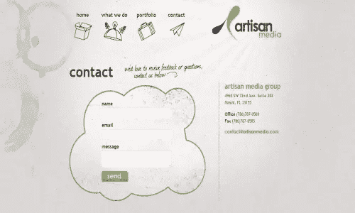](http://www.artisanmedia.com/contact.php)

**辐条**

[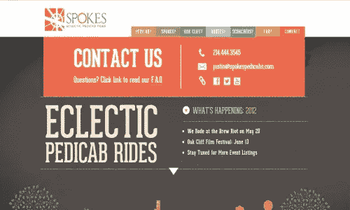](http://www.spokespedicabs.com/)

**羡慕实验室**

[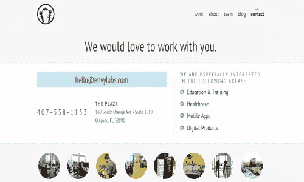](http://envylabs.com/contact/)

**咖啡馆唤起**

[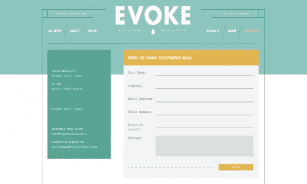](http://cafeevoke.com/contact)

**东京**

光模式

[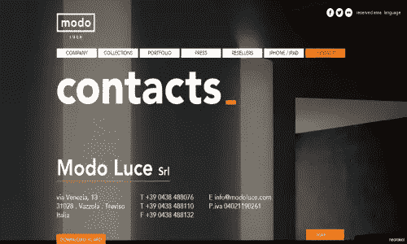](http://www.modoluce.com/#/contatti)

**Applicom**

[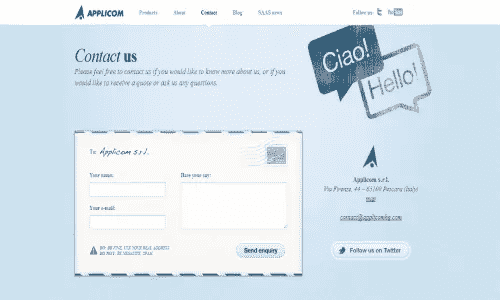](http://www.applicomhq.com/contact/)

**红色 Tiki**

[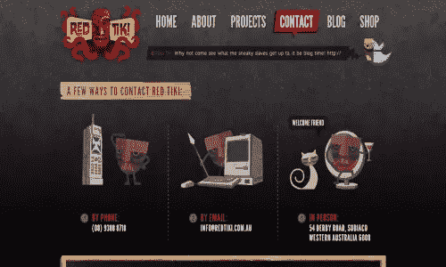](http://www.redtiki.com.au/contact)

丹尼斯·钱德勒

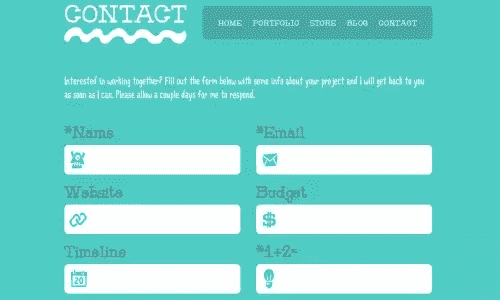

**华丽的电视**

[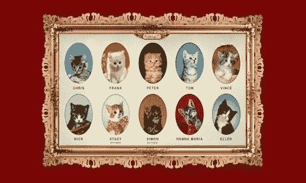](http://www.gorgeous.tv/main.php)

**基督教麻雀**

[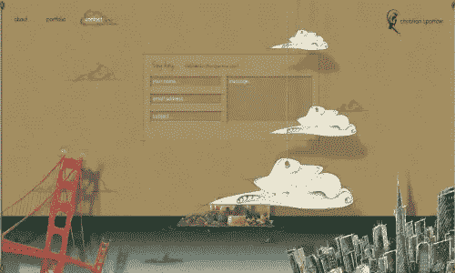](http://http://christiansparrow.com/)

**尼奥波利坦服装**

**在线部门**

[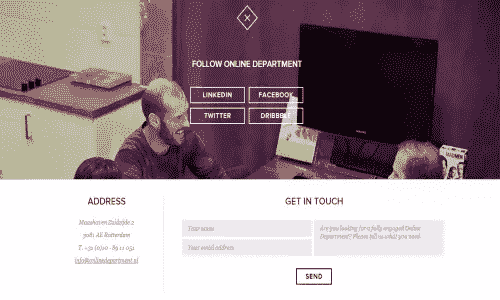](http://onlinedepartment.nl/#cases)

**投资组合**

## 分享这篇文章