# 15 个有创意、有吸引力的“关于我”页面

> 原文：<https://www.sitepoint.com/15-creative-appealing-about-me-pages/>

仅仅因为你在屏幕后面工作并不意味着你不能风度翩翩。你可能会在网上为你的客户提供非凡的服务，这令人钦佩，但请记住，大多数人不会轻易将他们的信任(连同他们的钱)交给一个完全陌生的人。当然，不是每个人都能马上知道你是谁，但是通过建立一个深思熟虑的“关于我”的页面，你能够让客户了解是什么让你值得客户的考虑、信任和业务。

“关于”页面是一个经常被忽视的机会，可以让你从竞争对手中脱颖而出，并培养对你的服务的兴趣。这些“关于”页面的误导、欠考虑的版本通常充满了乏味、无趣的图像和信息，这对创意行业的人来说是双倍的糟糕。在制作“关于我”或“关于我们”的页面时，把它当成一个展示你创造力的机会。你是一名设计师。你不想成为一个翻版，是吗？幸运的是，这个展示提供了一些快速的灵感，所以看看这些精彩的，极具创意的吸引人的“关于我”页面的例子。

三木蛾

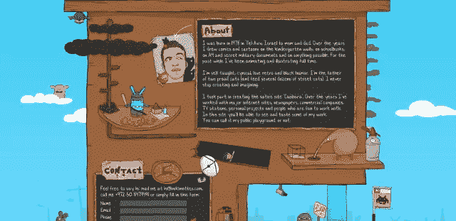

**碳制**

[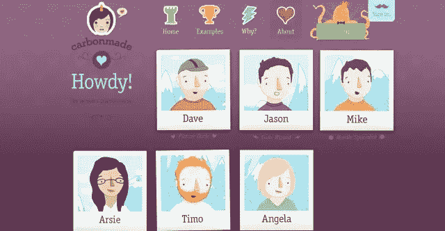](http://carbonmade.com/about)

安德鲁·雷夫曼

[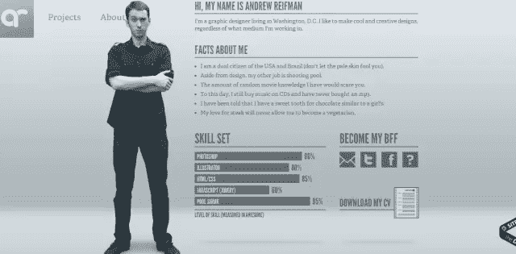](http://www.andrewreifman.com/#)

马德威尔

[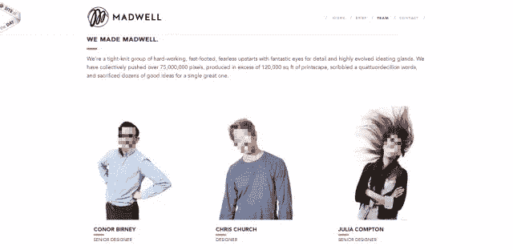](http://www.madwellnyc.com/team.php)

**碳工作室**

[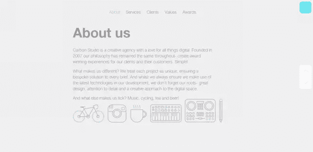](http://www.carbonstudio.co.uk/)

**公共类**

[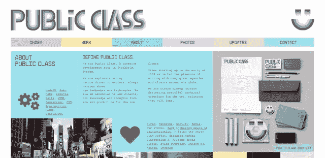](http://publicclass.se/about)

**古德温**

[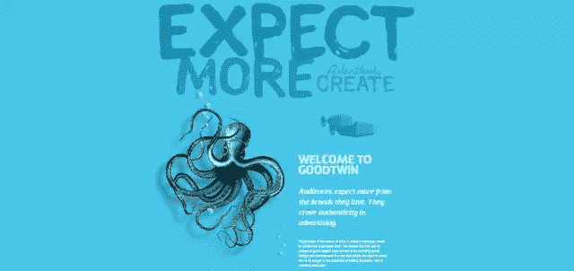](http://goodtwin.co/about/)

**核**

[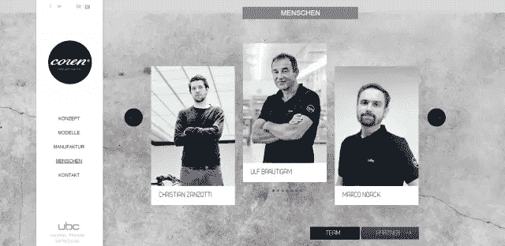](http://ubc-coren.com/)

**木工**

[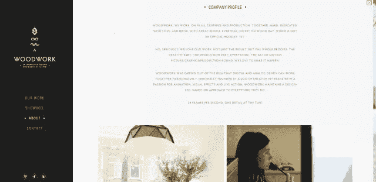](http://woodwork.nl/about/)

**香巴拉珠宝**

[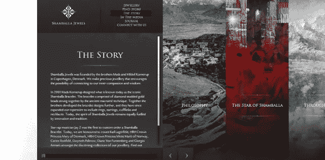](http://www.shamballajewels.com/story)

**害怕灰熊**

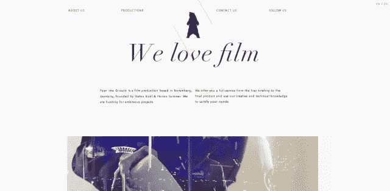

**这些事情**

[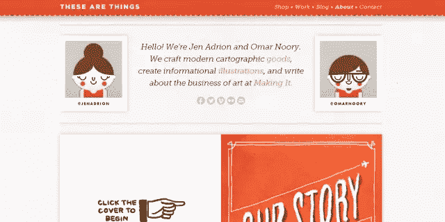](http://thesearethings.com/about/)

希瑟·康兰

[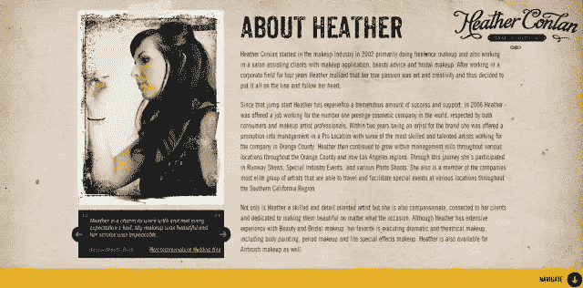](http://makeup.heatherconlan.com/)

克雷格·莫里森

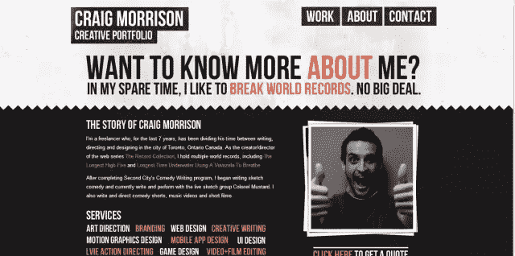

**永成**

[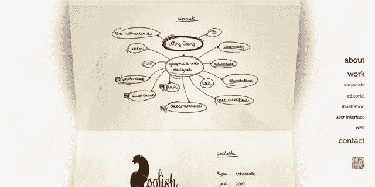](http://www.wingcheng.com/)

你在“关于我”的页面设计中寻找什么？这些设计中有你感兴趣的吗？

## 分享这篇文章