# 15 个以上的 Figma 插件帮助您更好地设计

> 原文：<https://www.sitepoint.com/15-figma-plugins-to-help-you-design-better/>

**[Figma](https://figma.com/) ，设计用户界面第二常用的工具(仅计算 Windows 操作系统时，是*第一*最常用的工具)，最近真的在数字设计行业掀起了风暴，甚至 Adobe XD 也发布了他们自己版本的 Figma 多人功能(将其命名为“共同编辑”)。**

然而，Figma 目前的热门话题是发布*插件【that Figma 用户可以在 Figma 上安装扩展，以允许额外的功能或改善他们的设计工作流程。*

让我们来看看目前为止最好的 Figma 插件。

## 1.[箭头自动](https://figma.com/c/plugin/751007211632768205/Arrow-Auto/)(创建用户流)

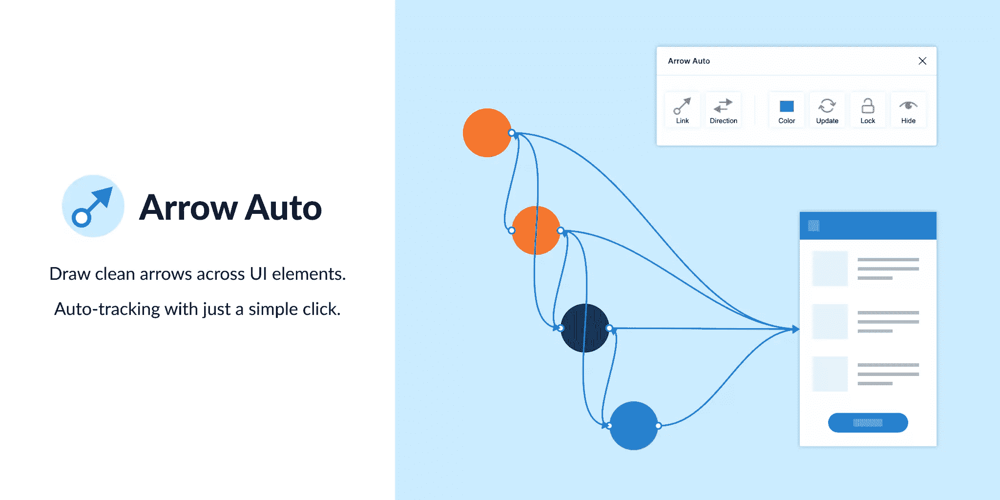

Arrow Auto 为 Figma 添加了流程图功能，这对于创建用户流程图非常有用。在画布上选择任意两个对象，箭头自动将使您能够在它们之间绘制一个连接符。您还可以根据需要隐藏和显示流量。

Autoflow 是一个不错的(也许看起来更好)选择，但 Arrow Auto 有更多的功能，包括切换连接器方向的能力，还可以在保持连接器完整的情况下移动连接的对象。

## 2.[角度](https://angle.sh/)(利用设备模型)

Angle 允许您在许多逼真或无光效果的设备帧中显示屏幕(即画板)，每个帧都带有各种角度选项*和*阴影样式。

令人印象深刻的是，它们也是 100%的矢量。

Artboard Studio 并不是完全一样的东西，因为它允许在画布上插入一大堆随机的 3D 对象(比如猕猴桃)。如果你只关心设备样机，我会安装角度。 [Vectory 3D](https://figma.com/c/plugin/769588393361258724/Vectary-3D/) 类似于 Artboard Studio，但是它输出实际的 3D 资产。

## 3.[掌握](https://figma.com/c/plugin/767721682134156281/Master/)(更轻松地管理组件)

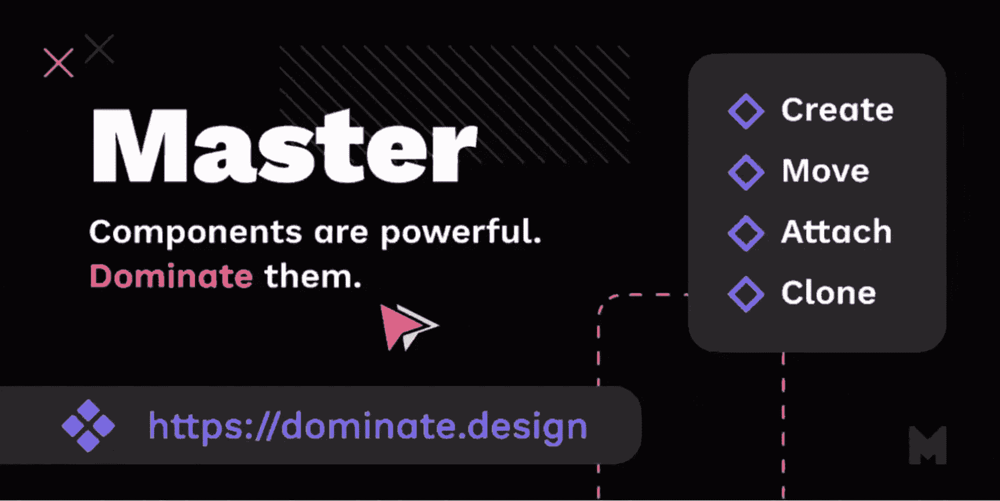

Master 提供了一种更好的管理组件的方法，例如将多个相同的对象转换成一个组件，将组件复制成其他 Figma 文件，等等。

## 4.[清洗文件](https://figma.com/c/plugin/767379019764649932/Clean-Document/)(自动清洗文件)

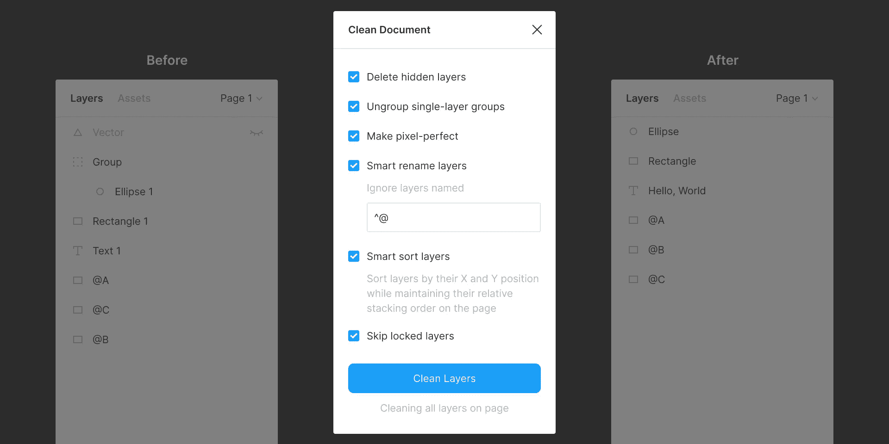

清理文档，嗯…清理你的文档！它会删除隐藏的图层，智能地对它们进行排序，根据您的喜好重命名它们，取消单层组的分组，甚至将尺寸四舍五入到最接近的*像素*。痴迷洁癖者的绝佳工具！

## 5.[相似层](https://figma.com/community/plugin/735733267883397781/Similayer/)(选择相似层)

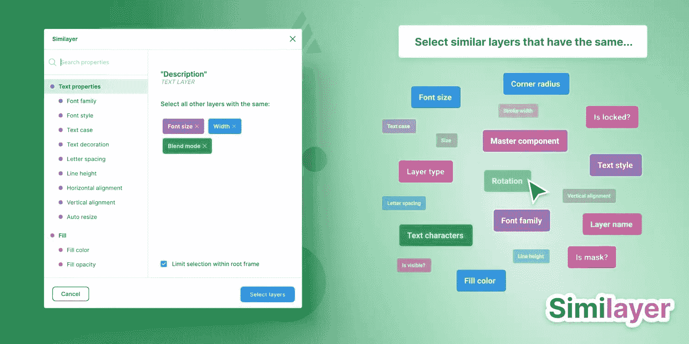

很简单，Similayer 允许你根据图层与当前选中图层的相似性来选择图层。让我们说，你想改变一个阴影风格，正在使用的一些不同的元素:Similayer 可以做到这一点。

您还可以使用它来批量重新分配多个组件。

## 6.[视口](https://figma.com/community/plugin/732240841094697441/Viewports/)(改变视口)

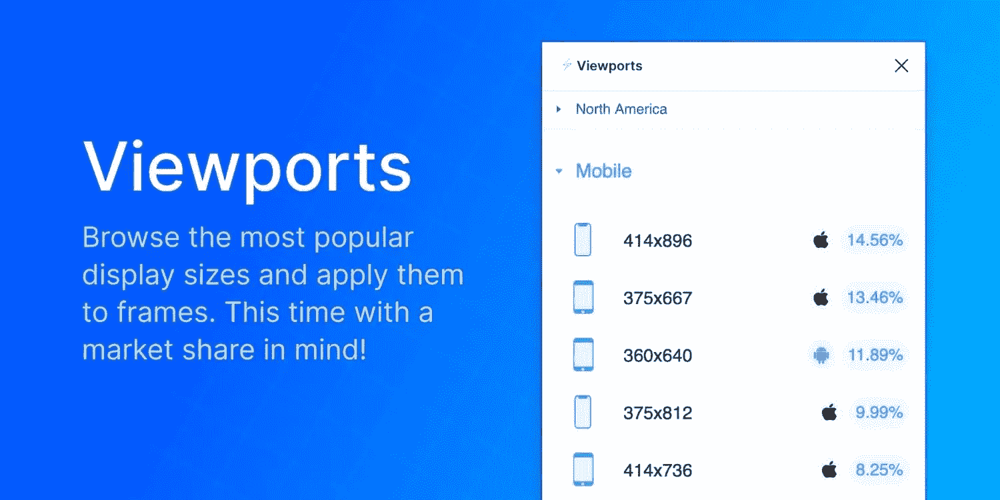

找出所有视口尺寸的正确市场份额，然后将它们应用于框架。这是多么的有用啊！

视口数据来自 StatCounter。

## 7.[待办事项](https://figma.com/community/plugin/747822968977461925/)(创建待办事项列表)

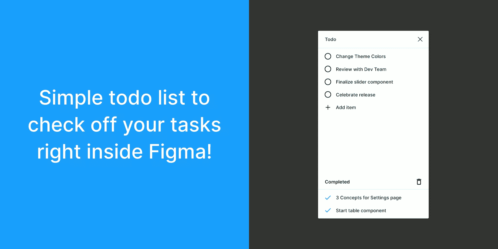

有几十个可怕的待办事项列表，但这一个存在于 Figma 中。它不是为了取代你的日常待办事项列表而设计的，但它是一种更方便的方式来跟踪你的特定设计待办事项，而不需要离开 Figma。有一份需要对进行*变更的清单吗？需要建立*优先事项*？*

如果是，安装 Todo。

## 8.[字体比例](https://figma.com/community/plugin/741231992144144738/Font-Scale/)(建立字体比例)

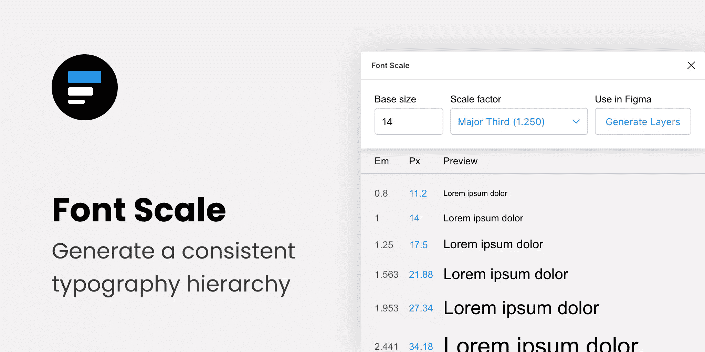

通过选择基本大小和比例因子来建立视觉上一致的/分层的字体比例，然后将结果保存到您的文档中以供连续参考(作为 *em* 或 *px* )。

## 9.[内容卷轴](https://figma.com/c/plugin/731627216655469013/Content-Reel/)(插入优于 lorem-ipsum 的内容)

内容卷轴将“真实”的内容插入到您的设计中。需要一个快速地址吗？还是头像？出于某种原因，当你需要一个名字时，却想不出一个单独的名字？内容卷轴支持你。

使用真实数据进行设计可以确保设计一经开发就不会看起来很奇怪，也有助于我们针对边缘情况进行设计。

## 10.[谷歌工作表同步](https://figma.com/community/plugin/735770583268406934/Google-Sheets-Sync/)(从谷歌工作表同步数据)

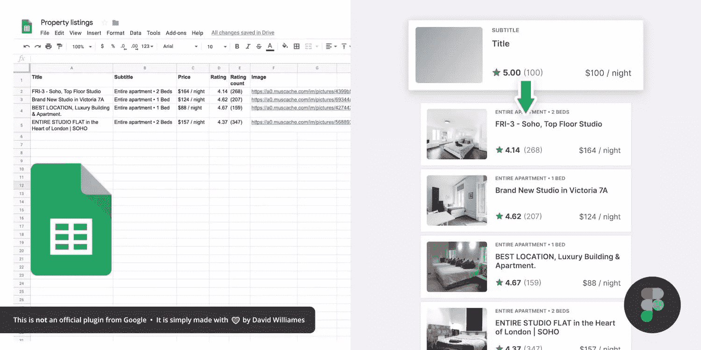

无论您的应用程序是否有 API，或者您只是想手动创建一个数据表，Google Sheets Sync 基本上都可以让您将这些数据直接同步到 Figma 中。这就像内容卷轴，但是你自己定义数据。这对于那些想要用来自他们实际领域(或者实时应用程序)的数据构建超现实模型的设计师来说很有用，对于那些想要使用相同数据库进行设计的团队来说尤其有用。

## 11.[图表](https://figma.com/community/plugin/734590934750866002/Chart/)(创建“真实数据”图表)

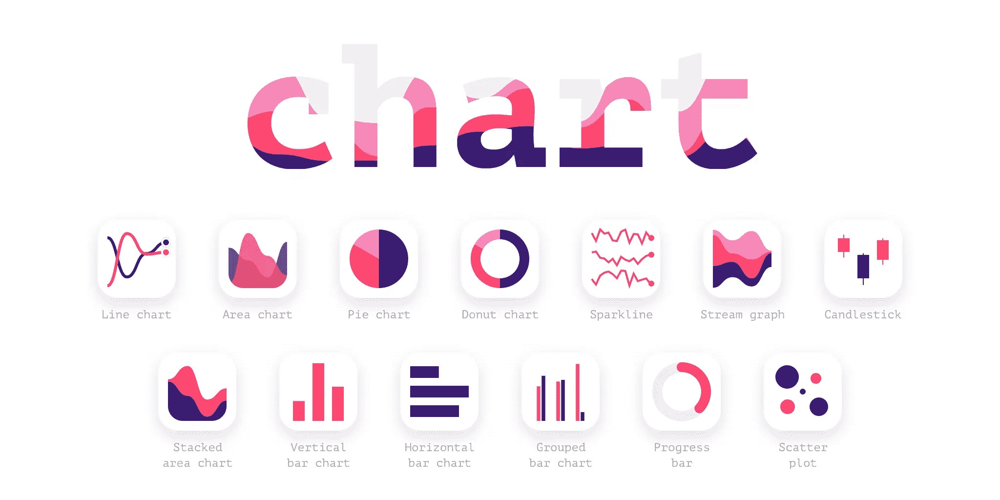

使用来自 Excel、Numbers、Google Sheets 的数据创建令人惊叹的可定制图表，或者只需导入本地 CSV 或 JSON 文件。Datavizer 是一个合适的选择，但是 Chart 也可以与 live JSON 同步(例如，您可以将 Chart 连接到 REST API)。

## 12.[图标化](https://figma.com/community/plugin/735098390272716381/Iconify/)(利用图标字体)

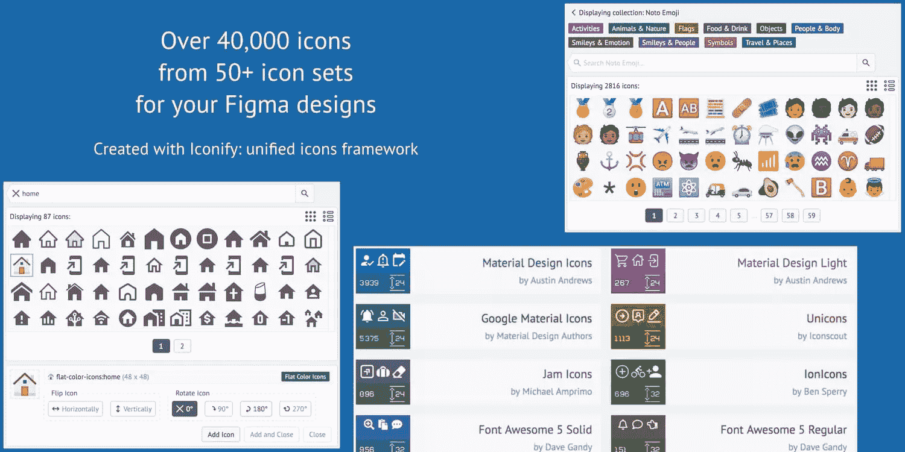

所有图标字体，就在 Figma 里面。材料设计图标、字体棒极了、果酱图标、表情符号、推特表情符号——应有尽有。

很有代表性，真的。

## 13. [Figmotion](https://figma.com/community/plugin/733025261168520714/Figmotion/) (创建动画)

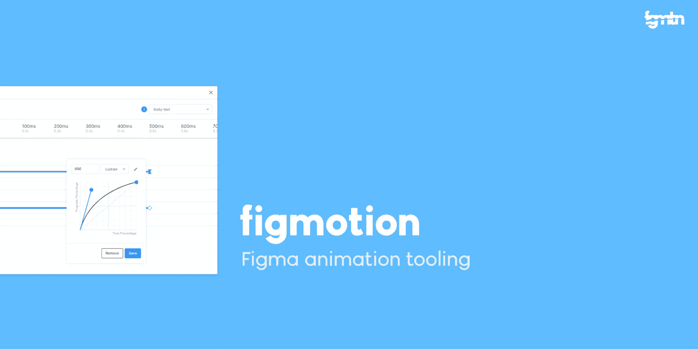

如果探索动画的想法让你害怕，或者你害怕切换工具来访问高级动画功能，Figmotion 让动画变得不那么令人焦虑。动画也很容易传递，因为它们是基于网络技术的。

## 14.[分割形状](https://figma.com/community/plugin/746565487016656360/Split-Shape/)(制作柱子…和其他东西)

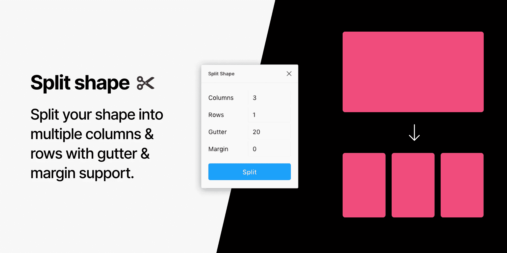

创建列的一个有趣的方法，Split Shape 将一个矩形分割成多个矩形，然后你可以从中创建列(或行，或其他)。分裂形状可以用于各种事情，如果一个人打破常规思考的话！😁

## 15.[移除背景](https://figma.com/community/plugin/738992712906748191/Remove-BG/)(创建透明位图)

Remove BG 是一个 web 工具，可以删除位图图像的背景，有效地将它们转换为透明的 png。为 Figma 删除 BG 本质上做同样的事情，但是在 Figma 内部。

如果你一直囤积 Adobe Photoshop 只是为了移除背景，现在你可以删除它，并且*可能*在你的固态硬盘上释放大约 800 亿 GB 的空间😌。

## 流行的 Figma 插件

有几个 Figma 插件我没有提到，因为它们已经被 Sketch 等其他 UI 设计工具的用户所熟知。你*可能*已经有了这些:

*   [五彩纸屑](https://figma.com/community/plugin/732876968584257019/Confetti/)(产生分散体)
*   [去飞溅](https://figma.com/community/plugin/738454987945972471/Unsplash/)(插入库存图片)
*   [重命名为](https://figma.com/c/plugin/731271836271143349/Rename-It/)(更有效地重命名图层)
*   [人类](https://figma.com/community/plugin/739503328703046360/Humaaans-for-Figma/)(插入混搭插图)
*   [斯塔克](https://figma.com/community/plugin/732603254453395948/Stark/)或[A11y——色彩对比检查器](https://figma.com/community/plugin/733159460536249875/A11y---Color-Contrast-Checker/)(测量色彩对比)

## 奖金 Figma 插件

这些 Figma 插件很棒，但是你可能不经常需要它们(如果需要的话)。不过，很高兴知道他们在那里。

*   [弧线](https://figma.com/community/plugin/762070688792833472/arc/)(弧线文字)
*   [旋转](https://figma.com/community/plugin/733184376355671573/Roto/)(旋转挤压形状)
*   [表格生成器](https://figma.com/community/plugin/735922920471082658/Table-Generator/)(创建表格)
*   [到路径](https://figma.com/c/plugin/751576264585242935/To-Path/)(在*路径*上创建文本)
*   [Brandfetch](https://figma.com/community/plugin/733590967040604714/Brandfetch/) (来源品牌资产)
*   [等距](https://figma.com/community/plugin/741184519069077841/Isometric/)(使物体等距)
*   [Mapsicle](https://figma.com/community/plugin/736458162635847353/Mapsicle/) 或[地图制作者](https://figma.com/community/plugin/731312569747199418/Map-Maker/)(创建地图)
*   [倾斜](https://figma.com/community/plugin/741472919529947576/SkewDat/)(创建简单的等轴模型)
*   [图像跟踪器](https://figma.com/community/plugin/735707089415755407/Image-tracer/)(将位图转换为矢量)
*   [阴影拾取器](https://figma.com/community/plugin/744987207861965946/Shadow-picker/)(智能创建阴影)
*   [变形球](https://figma.com/c/plugin/743754408199479204/Metaball/) / [水滴](https://figma.com/community/plugin/739208439270091369/Blobs/) / [波浪](https://figma.com/community/plugin/745619465174154496/Get-Waves/)(创建抽象形状)

最后，[所有 Figma 插件](https://figma.com/c/plugin/all/)(以防你对它们百看不厌！😉).

渴望了解开发自己的插件的来龙去脉，无论是为了改进自己的工作流程还是他人的工作流程？查看 Figma 的[插件文档](https://figma.com/plugin-docs/intro)。

## 分享这篇文章