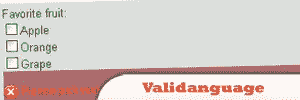
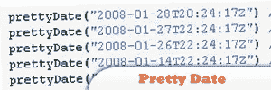
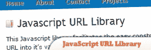
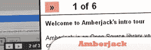

# 15 个有用的 Javascript 库

> 原文：<https://www.sitepoint.com/15-javascript-libraries/>

流行的 JavaScript 库，如 jQuery、MooTools、Prototype、Dojo 和 YUI，可以很好地完成常见的 JavaScript 任务。这些库提供了许多功能，无论是事件、效果还是 AJAX。如果其中一个库不能完成这项工作，那么可能存在一个插件可以完成这项工作。

 

## [1。wForms](http://www.formassembly.com/wForms/)

一个开源且不引人注目的库，它简化了最常见的 JavaScript 表单函数。它提供了现成的表单验证函数，可以通过向表单对象添加类信息来应用这些函数。

来源

## 2.有效语言

它是一个不引人注目的 JavaScript 表单验证框架。它有一个继承逻辑，其设置可以全局定义，执行或每个元素。

## 3.现场验证

这是一个轻量级的库，为你提供了一套验证函数。除了经典的验证方法，该库还有一个强大的实时验证功能，可以在您键入时控制字段。

 

## [4。表单改革](http://code.google.com/p/formreform/)

这个小小的图书馆将一个经典的形式转变成一个时尚的布局，有一列、两列或四列。使用 formreform 自动调整表单样式以适应任何设计。

来源

 

## [5。JSTweener](http://coderepos.org/share/wiki/JSTweener)

JavaScript 的补间库。它的 API 类似于著名的 ActionScript 补间引擎 Tweener。

来源

## 6.外汇（foreign exchange 的缩写）

一个轻量级的库，具有类似 YUI 的语法，FX 可以为几乎任何 CSS 属性创建补间。它支持颜色和滚动动画。设计任何对象/属性的“到”和“从”值就足够了。

 

## [7。太妃糖数据库](http://taffydb.com/)

一个 JavaScript 库，可以被认为是浏览器中的 SQL 数据库或高级“阵列管理器”它作为 AJAX 'ed 应用程序中的数据库层。

来源

 

## [8。ActiveRecord.js](http://www.activerecordjs.org/)

这个库支持 Google Gears 和 Chrome、Aptana Jaxer、Adobe AIR 以及任何支持 W3C HTML5 SQL 规范的平台(目前是 Webkit 和 iPhone)。它使得用 JavaScript 处理数据库变得很容易。

来源

 

## [9。西尔维斯特](http://sylvester.jcoglan.com/)

这是一个 JavaScript 库，可以轻松地进行向量和矩阵运算，不需要使用很多循环，也不会在数组之间迷路。它包括在任意维数上建模向量和矩阵的类，以及在 3D 空间中建模无限直线和平面的类。

来源

 

## 10。漂亮的约会

一个智能的 JavaScript 解决方案，以更漂亮、更友好的方式显示上个月的日期。它显示相对于当前时间的日期；例如，“昨天”、“3 小时前”等。

来源

## 11.JavaScript URL 库

一个更容易处理和操作 URL 的库。可以以字符串的形式到达 URL 的每个部分，并在需要时修改它。这个 URL 库是非常新的，但已经如前所述工作。

 

## [12。Typeface.js](http://typeface.neocracy.org/)

一个不显眼的库，可以在网站上使用任何字体。与 sIFR 或 FLIR 等流行的解决方案不同，typeface.js 不需要 Flash，是 100%的 JavaScript。

来源

 

## 13。Amberjack

一个很小的 JavaScript 库(大约 4 KB)，可以帮助你在网站上添加好看的网站导览。一旦激活，一个模态框通过显示任何类型的内容来引导用户。

来源

 

## [14\. JsLoad](http://jsload.net/)

JavaScript 库的远程加载 API。JsLoad 是一个简单的 API，可以让你从 Google 服务器导入大型 JavaScript 库。JsLoad 自动加载任何版本库的依赖项。

来源

 

## 15。自定义 JavaScript 对话框

一个用于创建自定义对话框的轻量级库(大约 4.5 KB)。可以显示四个框:警报、警告、提示、成功。通过一个简单的功能，你可以指定盒子的标题，要显示的内容以及显示多少秒。

来源

## 分享这篇文章