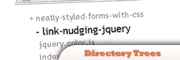
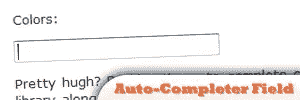

# 15 个 jQuery 和 PHP 组合插件

> 原文：<https://www.sitepoint.com/15-jquery-php-combination-plugins/>

这里是另一组 jQuery 和 PHP 的组合技巧。他们都是有用的和有帮助的，好好享受吧！

## [1。目录树](http://www.lateralcode.com/directory-trees-with-php-and-jquery/)

这是跟踪许多文件的简单方法。

来源

## [2。照片管理网站](http://net.tutsplus.com/videos/screencasts/create-a-photo-admin-site-using-php-and-jquery/)

使用 PHP、jQuery 和 AJAX 创建一个照片网站。这是一个帮助你从数据库中检索图像的教程。这也为创建简单的登录表单身份验证提供了帮助。

来源

## [3。异步注释](http://net.tutsplus.com/tutorials/php/asynchronous-comments-with-jquery-and-json/)

您将学习如何使用 jQuery 和 PHP 创建一个简单但有用的捕获和显示访问者评论的工具。

来源

## [4。使用 jQuery 的 PHP Ajax 登录表单](http://www.chazzuka.com/blog/?p=82)

使用 jQuery 创建一个新的 PHP AJAX 登录功能。

来源

## [5。简讯模块](http://virae.org/newsletter_module/)

一个 PHP、jQuery 和 AJAX 模块，应该很适合任何时事通讯管理需求。

来源

## [6。从 PHP 到 XML 到 jQuery 和 Ajax](http://www.reynoldsftw.com/2009/03/tutorial-from-php-to-xml-to-jquery-and-ajax/)

使用 PHP 从数据库获取数据，将其转换为 XML 文档，然后通过 Ajax 调用通过 jQuery 读取。

来源

## 7.使用 PHP 验证双方的表单

在两端使用 PHP 和 jQuery 验证您的表单。

## 8.创建一个 Shoutbox

从头开始学习用 jQuery 创建基于动态 ajax 的 shoutbox。

## 9.上传/进度条

在 jQuery 进度条的帮助下创建进度条，驱动新的进度条值并使用 PHP 设置它。

## 10。自动完成字段

使用 jQuery 和 PHP 创建自动完成字段。

来源

## 11.苹果风格搜索建议

通过创建一个花哨的 Apple 风格的搜索建议，重现苹果网站的效果。

## 12.图像上传和裁剪

使用 PHP 和 jQuery 创建图片上传和裁剪工具。

## [13 号。Flickr roller](http://ennuidesign.com/blog/FlickrScrollr+Explained:+PHP)的缩写形式

这是 PHP 和 jQuery 的结合，用于解析 Flickr RSS 提要。

来源

## 14.Reddit 式投票

如果你去过 Reddit，你会发现那里的投票系统有多好。用这个技巧模仿它。

## 15.SMTP 反馈邮件

使用 php SMTP 类和 jQuery 得到一个带有漂亮幻灯片效果的反馈邮件。

## 分享这篇文章