# 15+ jQuery 单选按钮和复选框样式插件

> 原文：<https://www.sitepoint.com/15-jquery-radio-button-checkbox-style-plugins/>

今天我们给你一个列表，里面有 **15+ jQuery 单选按钮&复选框风格插件**——一个简单、轻量级、可风格化的单选按钮和使用 jQuery 的复选框插件的集合。尽情享受吧！:)

**2013 年 9 月 29 日更新:**新增 17。jQuery 统一插件

**相关帖子:**

*   [**10 JQUERY IPHONE 风格插件**](http://www.jquery4u.com/mobile/10-jquery-iphone-style-plugins/)

## 1.jQuery 可检查的

这个插件取代了默认的复选框和单选按钮，以获得更好的外观。

[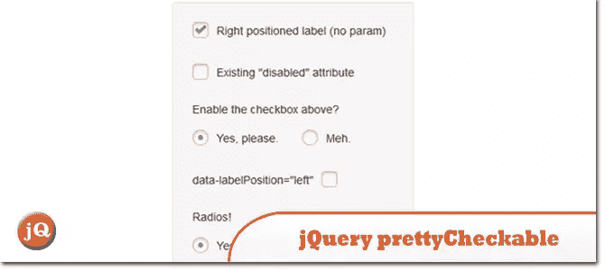](http://arthurgouveia.com/prettyCheckable/) 
[源+演示](http://arthurgouveia.com/prettyCheckable/)

## 2.伊切克

jQuery 和 Zepto 的高度可定制的复选框和单选按钮。

[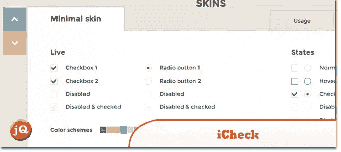](https://github.com/damirfoy/iCheck#readme) 
[来源](https://github.com/damirfoy/iCheck#readme) [演示](http://damirfoy.com/iCheck/#skins)

## 3.螺丝刀默认按钮

一个简单的 jQuery 插件，允许你用自己的定制设计替换单选按钮和复选框的浏览器默认设置。

[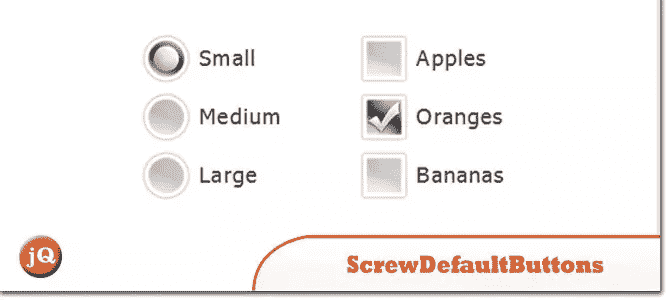](http://www.screwdefaultbuttons.com/) 
[源+演示](http://www.screwdefaultbuttons.com/)

## 4.带有 CSS 的奇特复选框和单选按钮

许多年轻的新手询问如何设计表单中自定义复选框和单选按钮的样式。我准备了一个典型的标记、几行 CSS 和一些 JavaScript 函数(包括 Safari 标签行为修复)。

[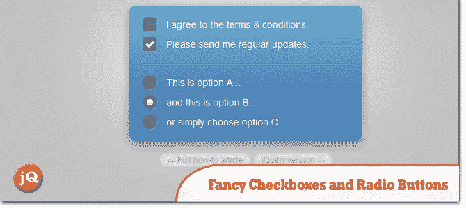](http://www.maratz.com/blog/archives/2006/06/11/fancy-checkboxes-and-radio-buttons/) 
[来源](http://www.maratz.com/blog/archives/2006/06/11/fancy-checkboxes-and-radio-buttons/) [演示](http://webdesign.maratz.com/lab/fancy-checkboxes-and-radio-buttons/demo.html)

## 5.卡利帕托

一个基本插件，使用一个简单的精灵和 CSS 来代替复选框或单选按钮。

[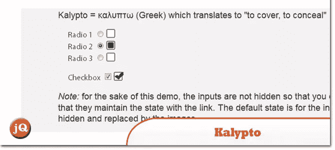](http://localpcguy.github.io/Kalypto/) 
[源+演示](http://localpcguy.github.io/Kalypto/)

## 6.CSS 和 jQuery 自定义复选框和单选按钮输入样式

使复选框和单选按钮输入符合定制设计几乎是不可能的，因为它们都不可靠地支持基本的 CSS，如背景颜色或图像；让不同浏览器的页边距保持一致甚至是一个挑战。

 
[来源](http://www.htmldrive.net/items/show/637/CSS-and-jQuery-Custom-Checkbox-and-Radio-Button-Inputs-Styled.html) [演示](http://www.htmldrive.net/items/demo/637/CSS-and-jQuery-Custom-Checkbox-and-Radio-Button-Inputs-Styled)

## 7.jQuery 单选按钮插件

这是一个非常简单的用于 jQuery 的 radiobutton 插件。它简单、轻便、易于设计。

[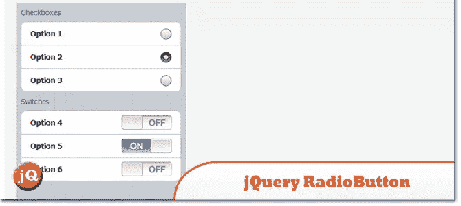](http://tomekwojcik.github.io/jQuery-Custom-Radiobuttons/) 
[源+演示](http://tomekwojcik.github.io/jQuery-Custom-Radiobuttons/)

## 8.美好的形式

一种非侵入式的 javascript 方法，允许完全定制 web 表单。

[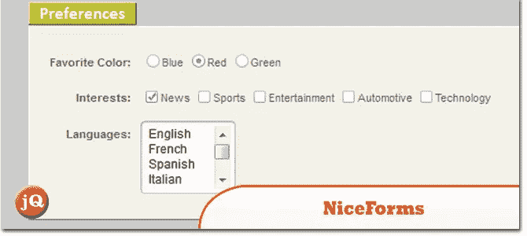](http://www.emblematiq.com/lab/niceforms/demo/) 
[来源](http://www.emblematiq.com/lab/niceforms/demo/) [演示](http://www.emblematiq.com/lab/niceforms/demo/niceforms.html)

## 9.jQuery 复选框 v.1.3.0 Beta 1

jQuery 1.2.x 和 1.3.x 的轻量级定制风格复选框实现

[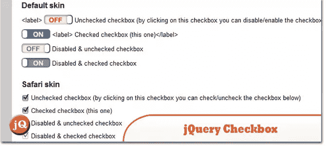](http://widowmaker.kiev.ua/checkbox/) 
[源+演示](http://widowmaker.kiev.ua/checkbox/)

## 10.jqTransform

这个插件是一个 jQuery 样式插件，它允许你对表单元素进行皮肤处理。

[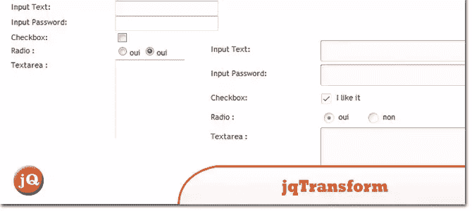](http://www.dfc-e.com/metiers/multimedia/opensource/jqtransform/) 
[源+演示](http://www.dfc-e.com/metiers/multimedia/opensource/jqtransform/)

## 11.iOS 复选框

iphone 风格的复选框实现了 iPhone 切换作为标准 HTML 复选框的替换。

[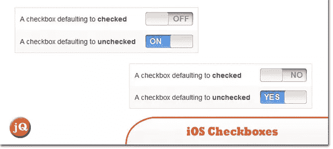](http://ios-checkboxes.awardwinningfjords.com/) 
[源+演示](http://ios-checkboxes.awardwinningfjords.com/)

## 12.jQuery 奇特的自定义单选按钮和复选框

jQuery 奇特的自定义单选按钮和复选框

[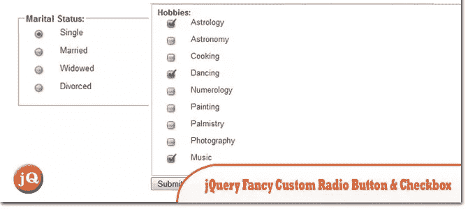](http://blogs.digitss.com/javascript/jquery-javascript/jquery-fancy-custom-radio-and-checkbox/) 
[来源](http://blogs.digitss.com/javascript/jquery-javascript/jquery-fancy-custom-radio-and-checkbox/) [演示](http://www.digitss.com/jquery/custom-radio-checkbox/fancy_radio_button_and_checkbox.html)

## 13.使用 jQuery 和 CSS 的 iPhone 风格的收音机和复选框开关

这是一个很棒的管理面板界面，拥有非常漂亮的表单和按钮。

[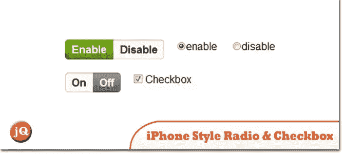](http://devgrow.com/iphone-style-switches/) 
[源+演示](http://devgrow.com/iphone-style-switches/)

## 14.jQuery 复选框和单选按钮样式

跨浏览器复选框和单选按钮脚本。

[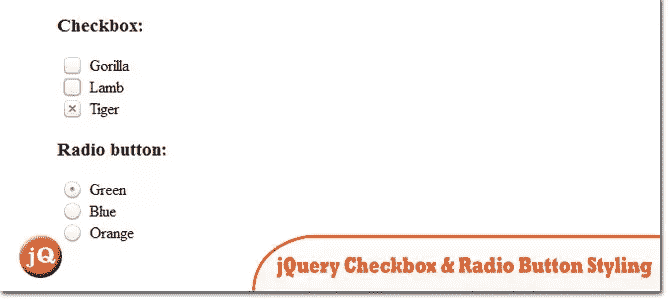](http://www.1stwebmagazine.com/jquery-checkbox-and-radio-button-styling) 
[来源](http://www.1stwebmagazine.com/jquery-checkbox-and-radio-button-styling) [演示](http://www.1stwebmagazine.com/demo/jquery-checkbox-and-radio-button-styling.html)

## 15.jQuery 插件–图像单选按钮

它只有 2KB 大，可以把你的普通单选按钮变成图像，你可以为 src，checked 和 hover 设置任何你喜欢的图像。

[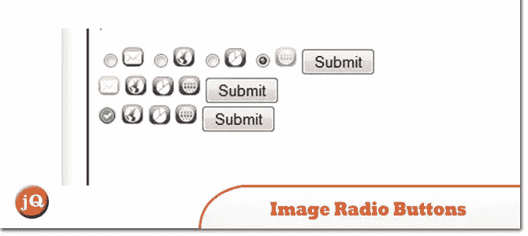](http://www.thheuer.com/2011/10/jquery-plugins-image-radio-buttons/) 
[来源](http://www.thheuer.com/2011/10/jquery-plugins-image-radio-buttons/) 

## 16.ezMark: jQuery 复选框和单选按钮插件

一个小的 jquery 插件提供了风格化复选框和单选按钮的能力。

[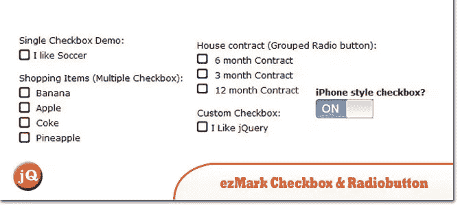](http://www.itsalif.info/content/ezmark-jquery-checkbox-radiobutton-plugin) 
[来源](http://www.itsalif.info/content/ezmark-jquery-checkbox-radiobutton-plugin) [演示](http://www.itsalif.info/content/demo-ezmark-jquery-plugin/)

## 17.jQuery 统一插件

Uniform 使用自定义主题控件屏蔽标准窗体控件。它与您的真实表单元素同步工作，以确保可访问性和兼容性。

[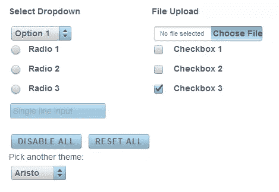](http://uniformjs.com/) 
[源+演示](http://uniformjs.com/)

## 分享这篇文章